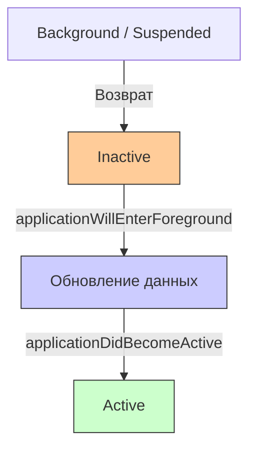
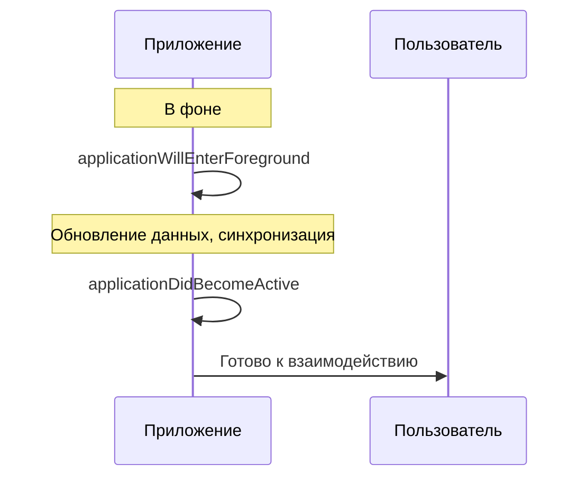

## applicationWillEnterForeground — Приложение возвращается из фона

---
#ios #appdelegate #app-lifecycle #foreground #swift

---

### Определение

**`applicationWillEnterForeground`** — это метод в [[AppDelegate]] (или [[SceneDelegate]] для многоконных приложений), который вызывается, когда приложение **возвращается из фонового состояния** и собирается стать активным, но ещё **не активно**. Это происходит после того, как приложение находилось в фоне (Background) или замороженном состоянии (Suspended).

```swift
func applicationWillEnterForeground(_ application: UIApplication) {
    print("🔄 applicationWillEnterForeground — приложение возвращается из фона")
}
```

**Ключевые факты:**
- Вызывается **перед** `applicationDidBecomeActive`
- Приложение становится видимым, но ещё **не активным** (не получает события)
- Идеальное место для **обновления данных**, которые могли устареть в фоне



---

### Зачем это знать iOS-разработчику?

| Сценарий | Почему это важно |
|---|---|
| **Обновление устаревших данных** | Пока приложение было в фоне, данные на сервере могли измениться |
| **Проверка авторизации** | Токен мог устареть, пользователь мог разлогиниться на другом устройстве |
| **Обновление UI** | Экран должен показать актуальную информацию |
| **Перезапуск анимаций и видео** | Всё, что было остановлено в фоне, нужно возобновить |
| **Синхронизация с сервером** | Получение новых сообщений, уведомлений, обновлений |
| **Обновление виджетов** | Данные виджетов могли устареть |
| **Обновление курсов валют, погоды** | Внешние данные требуют актуализации |

---

### Где находится метод (2026)

#### AppDelegate (глобальный уровень)

```swift
@main
class AppDelegate: UIResponder, UIApplicationDelegate {
    
    func applicationWillEnterForeground(_ application: UIApplication) {
        print("🔄 AppDelegate: applicationWillEnterForeground")
        
        // Глобальные действия при возврате из фона
        refreshGlobalData()
        checkAuthStatus()
        updateWidgets()
    }
}
```

#### SceneDelegate (уровень сцены, iOS 13+)

```swift
class SceneDelegate: UIResponder, UIWindowSceneDelegate {
    
    func sceneWillEnterForeground(_ scene: UIScene) {
        print("🔄 SceneDelegate: sceneWillEnterForeground")
        
        // Обновление UI конкретной сцены
        refreshUIIfNeeded()
        resumeAnimations()
    }
}
```

> **Важно:** В iOS 13+ для приложений с поддержкой сцен (multitasking на iPad) вместо `applicationWillEnterForeground` в [[AppDelegate]] используется `sceneWillEnterForeground` в [[SceneDelegate]].

---

### Полный пример использования

```swift
@main
class AppDelegate: UIResponder, UIApplicationDelegate {
    
    // MARK: - Application Lifecycle
    func applicationWillEnterForeground(_ application: UIApplication) {
        print("🔄 applicationWillEnterForeground")
        
        // 1. Обновление данных
        refreshDataIfNeeded()
        
        // 2. Проверка авторизации
        checkAuthStatus()
        
        // 3. Обновление UI (через уведомления)
        NotificationCenter.default.post(name: .refreshUI, object: nil)
        
        // 4. Обновление виджетов
        updateWidgets()
        
        // 5. Возобновление фоновых задач
        resumeSuspendedTasks()
        
        // 6. Аналитика
        trackSessionResume()
    }
    
    func applicationDidEnterBackground(_ application: UIApplication) {
        print("⏸ applicationDidEnterBackground")
        
        // Пауза фоновых задач
        pauseSuspendedTasks()
        
        // Сохранение состояния
        saveAppState()
    }
    
    // MARK: - Data Refresh
    private func refreshDataIfNeeded() {
        let lastRefresh = UserDefaults.standard.object(forKey: "lastDataRefresh") as? Date ?? .distantPast
        let refreshInterval: TimeInterval = 60 // 1 минута
        
        if Date().timeIntervalSince(lastRefresh) > refreshInterval {
            print("🔄 Refreshing data")
            
            Task {
                await fetchRemoteData()
                UserDefaults.standard.set(Date(), forKey: "lastDataRefresh")
                
                await MainActor.run {
                    NotificationCenter.default.post(name: .dataDidUpdate, object: nil)
                }
            }
        }
    }
    
    private func fetchRemoteData() async {
        // Имитация сетевого запроса
        try? await Task.sleep(nanoseconds: 1_000_000_000)
        print("📡 Remote data fetched")
    }
    
    // MARK: - Auth
    private func checkAuthStatus() {
        guard let token = AuthManager.shared.token else {
            print("🔐 No token, need login")
            showLoginScreen()
            return
        }
        
        Task {
            let isValid = await AuthManager.shared.validateToken(token)
            
            await MainActor.run {
                if !isValid {
                    showLoginScreen()
                } else {
                    print("✅ Token is valid")
                }
            }
        }
    }
    
    private func showLoginScreen() {
        NotificationCenter.default.post(name: .showLogin, object: nil)
    }
    
    // MARK: - Widgets
    private func updateWidgets() {
        if #available(iOS 14.0, *) {
            WidgetCenter.shared.reloadAllTimelines()
            print("📱 Widgets refreshed")
        }
    }
    
    // MARK: - Tasks
    private var suspendedTasks: [Task<Void, Never>] = []
    
    private func pauseSuspendedTasks() {
        // Отмена фоновых задач при уходе в фон
        for task in suspendedTasks {
            task.cancel()
        }
        suspendedTasks.removeAll()
        print("⏸ Suspended tasks cancelled")
    }
    
    private func resumeSuspendedTasks() {
        // Возобновление задач при возврате
        let task = Task {
            await performBackgroundSync()
        }
        suspendedTasks.append(task)
        print("▶️ Suspended tasks resumed")
    }
    
    private func performBackgroundSync() async {
        // Длительная синхронизация
        try? await Task.sleep(nanoseconds: 2_000_000_000)
        print("🔄 Background sync completed")
    }
    
    // MARK: - Analytics
    private func trackSessionResume() {
        AnalyticsManager.shared.track(event: "session_resume", parameters: [
            "time_in_background": getTimeInBackground()
        ])
        print("📊 Session resume tracked")
    }
    
    private func getTimeInBackground() -> TimeInterval {
        let enterTime = UserDefaults.standard.object(forKey: "enterBackgroundTime") as? Date ?? Date()
        return Date().timeIntervalSince(enterTime)
    }
    
    // MARK: - State
    private func saveAppState() {
        UserDefaults.standard.set(Date(), forKey: "enterBackgroundTime")
        print("💾 App state saved")
    }
}

// MARK: - Notifications
extension Notification.Name {
    static let refreshUI = Notification.Name("refreshUI")
    static let dataDidUpdate = Notification.Name("dataDidUpdate")
    static let showLogin = Notification.Name("showLogin")
}
```

---

### SceneDelegate (iOS 13+)

```swift
class SceneDelegate: UIResponder, UIWindowSceneDelegate {
    
    var window: UIWindow?
    
    func sceneWillEnterForeground(_ scene: UIScene) {
        print("🔄 sceneWillEnterForeground")
        
        // Обновление UI текущей сцены
        refreshCurrentScreen()
        
        // Возобновление анимаций
        resumeAnimations()
        
        // Перезапуск видео
        resumeVideoPlayback()
        
        // Проверка авторизации и обновление UI
        updateUIAfterAuthCheck()
    }
    
    func sceneDidEnterBackground(_ scene: UIScene) {
        print("⏸ sceneDidEnterBackground")
        
        // Пауза анимаций
        pauseAnimations()
        
        // Пауза видео
        pauseVideoPlayback()
        
        // Сохранение состояния сцены
        saveSceneState()
    }
    
    private func refreshCurrentScreen() {
        guard let rootVC = window?.rootViewController as? MainViewController else { return }
        rootVC.refreshData()
    }
    
    private func updateUIAfterAuthCheck() {
        if !AuthManager.shared.isLoggedIn {
            window?.rootViewController = LoginViewController()
        } else {
            (window?.rootViewController as? MainViewController)?.loadUserData()
        }
    }
    
    private func resumeAnimations() { print("▶️ Animations resumed") }
    private func pauseAnimations() { print("⏸ Animations paused") }
    private func resumeVideoPlayback() { print("▶️ Video resumed") }
    private func pauseVideoPlayback() { print("⏸ Video paused") }
    private func saveSceneState() { print("💾 Scene state saved") }
}
```

---

### Различия между applicationWillEnterForeground и applicationDidBecomeActive

| Аспект | `applicationWillEnterForeground` | `applicationDidBecomeActive` |
|---|---|---|
| **Вызывается** | При возврате из фона | При активации приложения |
| **Состояние** | Inactive | Active |
| **Получает события** | Нет | Да |
| **Что делать** | Обновлять данные, синхронизацию | Запускать анимации, аналитику |
| **Длительность** | Короткая | Длительная |



---

### Распространённые ошибки

#### 1. Тяжёлые операции синхронно

```swift
// ❌ Плохо — блокирует UI
func applicationWillEnterForeground(_ application: UIApplication) {
    let data = loadLargeDataFromDisk()  // Синхронно
    updateUI(with: data)
}

// ✅ Хорошо — асинхронно
func applicationWillEnterForeground(_ application: UIApplication) {
    Task {
        let data = await loadLargeDataFromDiskAsync()
        await MainActor.run {
            updateUI(with: data)
        }
    }
}
```

#### 2. Игнорирование проверки авторизации

```swift
// ❌ Плохо — токен не проверяется
func applicationWillEnterForeground(_ application: UIApplication) {
    loadUserData()  // Предполагаем, что пользователь всё ещё авторизован
}

// ✅ Хорошо — проверяем токен
func applicationWillEnterForeground(_ application: UIApplication) {
    Task {
        if await !AuthManager.shared.isTokenValid() {
            await MainActor.run {
                showLoginScreen()
            }
        } else {
            loadUserData()
        }
    }
}
```

#### 3. Обновление данных без проверки необходимости

```swift
// ❌ Плохо — обновляем всегда
func applicationWillEnterForeground(_ application: UIApplication) {
    refreshAllData()  // Всегда, даже если данные свежие
}

// ✅ Хорошо — только если устарели
func applicationWillEnterForeground(_ application: UIApplication) {
    let lastRefresh = UserDefaults.standard.object(forKey: "lastRefresh") as? Date ?? .distantPast
    if Date().timeIntervalSince(lastRefresh) > refreshInterval {
        refreshAllData()
    }
}
```

---

### Лучшие практики (2026)

| Практика | Почему |
|---|---|
| **Обновляйте данные только если они устарели** | Экономия трафика и батареи |
| **Проверяйте авторизацию** | Токен мог устареть в фоне |
| **Используйте асинхронные операции** | Не блокируйте UI |
| **Обновляйте виджеты** | Пользователь ожидает актуальные данные |
| **Не делайте тяжёлых синхронных операций** | applicationWillEnterForeground должен быть быстрым |
| **Для UI-логики используйте SceneDelegate** | Разделение ответственности |
| **Возобновляйте анимации и видео** | Пользователь ожидает непрерывности |

---

### Современный подход с Swift Concurrency

```swift
@main
class AppDelegate: UIResponder, UIApplicationDelegate {
    
    private var refreshTask: Task<Void, Never>?
    
    func applicationWillEnterForeground(_ application: UIApplication) {
        print("🔄 applicationWillEnterForeground")
        
        refreshTask = Task {
            await performForegroundRefresh()
        }
    }
    
    func applicationDidEnterBackground(_ application: UIApplication) {
        print("⏸ applicationDidEnterBackground")
        
        // Отмена фоновых операций
        refreshTask?.cancel()
        refreshTask = nil
    }
    
    private func performForegroundRefresh() async {
        // Параллельное выполнение задач
        async let userData = fetchUserData()
        async let messages = fetchMessages()
        async let settings = fetchSettings()
        
        let (user, msgs, settingsData) = await (userData, messages, settings)
        
        await MainActor.run {
            updateUI(with: user, messages: msgs, settings: settingsData)
        }
    }
    
    private func fetchUserData() async -> User? {
        try? await Task.sleep(nanoseconds: 500_000_000)
        return User(id: 1, name: "John")
    }
    
    private func fetchMessages() async -> [Message] {
        try? await Task.sleep(nanoseconds: 300_000_000)
        return []
    }
    
    private func fetchSettings() async -> Settings {
        Settings()
    }
    
    private func updateUI(with user: User?, messages: [Message], settings: Settings) {
        NotificationCenter.default.post(name: .refreshUI, object: nil)
    }
}
```

---

### Короткое правило

> **`applicationWillEnterForeground`** = приложение возвращается из фона, но ещё не активно.  
> **Обнови данные** (если устарели).  
> **Проверь токен** (мог устареть).  
> **Обнови виджеты** и UI.  
> **Не блокируй UI** — используй async/await.  
> **Возобнови анимации и видео**.

---

### Итог

**`applicationWillEnterForeground`** — ключевой метод для обновления приложения при возврате из фона:

| Аспект | Значение |
|---|---|
| **Вызывается** | При возврате из фона (Background / Suspended) |
| **Состояние** | Inactive (видим, но не активен) |
| **Назначение** | Обновление данных, проверка авторизации, синхронизация |
| **Не делать** | Тяжёлые синхронные операции |
| **Обязательно** | Проверять токен и обновлять виджеты |
| **Альтернатива** | `sceneWillEnterForeground` в SceneDelegate (iOS 13+) |

**Главное правило:**
> При возврате в приложение всегда проверяй, не устарели ли данные, и валиден ли токен авторизации. Обновляй UI только после проверки. Используй асинхронные операции, чтобы не блокировать UI. Обновляй виджеты, чтобы они показывали актуальную информацию. Для игр и видео не забывай возобновлять их при возврате. На iPad с многозадачностью используй SceneDelegate и метод `sceneWillEnterForeground` для UI-логики. Современный код должен использовать async/await для асинхронных операций.