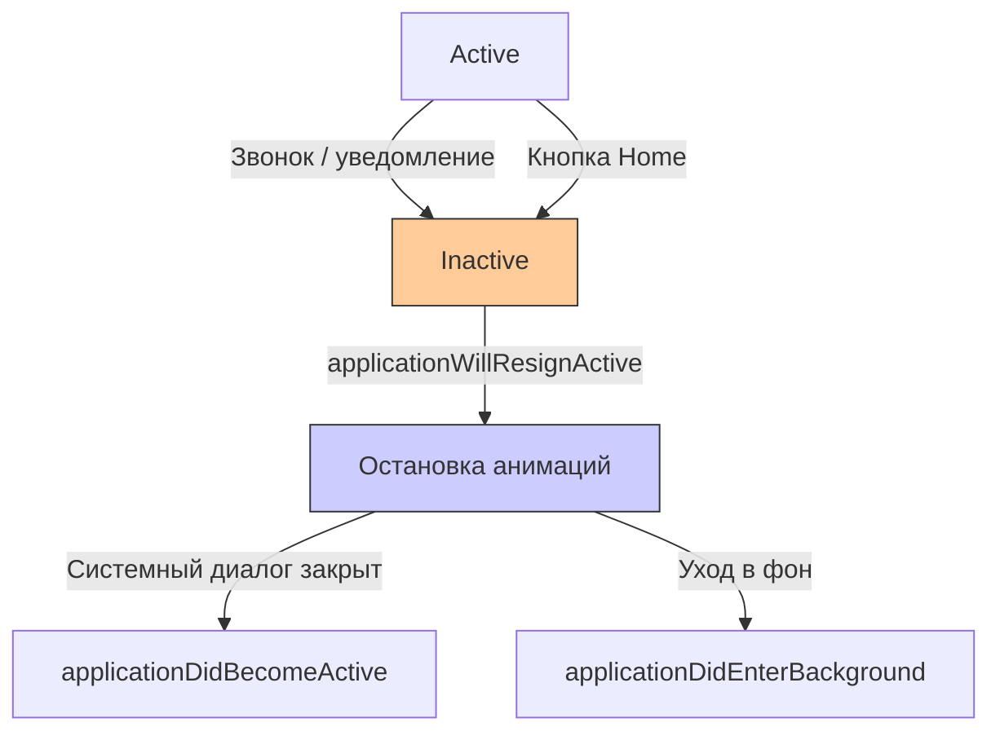
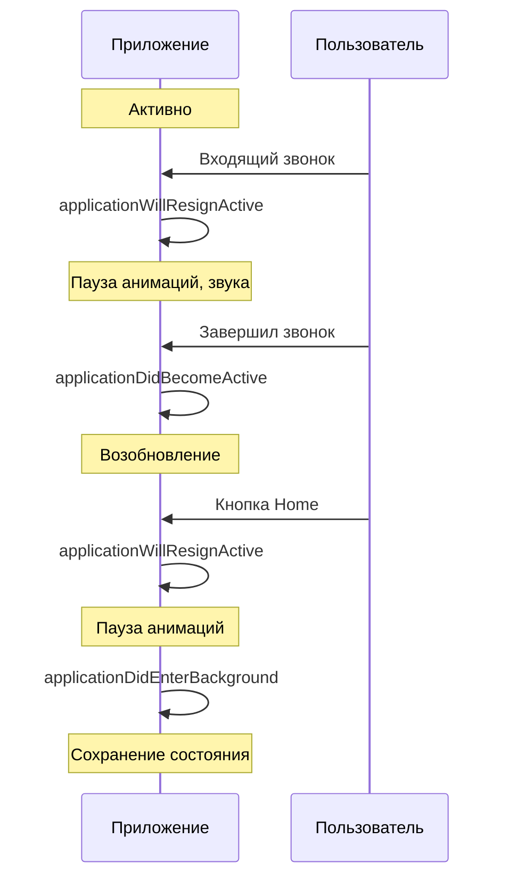

## applicationWillResignActive — Приложение теряет фокус

---
#ios #appdelegate #app-lifecycle #inactive #swift #background

---

### Определение

**`applicationWillResignActive`** — это метод в [[AppDelegate]] (или [[SceneDelegate]] для многоконных приложений), который вызывается, когда приложение **теряет активный статус** и перестаёт получать события от пользователя. Это происходит перед тем, как приложение перейдёт в фоновое состояние, а также при временных прерываниях (входящий звонок, уведомление, открытие шторки).

```swift
func applicationWillResignActive(_ application: UIApplication) {
    print("⚠️ applicationWillResignActive — приложение теряет фокус")
}
```

**Ключевые факты:**
- Приложение становится **inactive** (не получает события, но всё ещё видимо)
- Вызывается **перед** `applicationDidEnterBackground`
- Также вызывается при системных диалогах (звонок, Siri, уведомление)



---

### Зачем это знать [[iOS]]-разработчику?

| Сценарий | Почему это важно |
|---|---|
| **Пауза анимаций и игр** | Экономия ресурсов и батареи |
| **Пауза видео и аудио** | Пользователь ожидает, что звук замолкнет |
| **Остановка таймеров** | Не нужно обновлять UI в фоне |
| **Сохранение текущего состояния** | Чтобы восстановить при возврате |
| **Отмена сетевых запросов** | Не тратить трафик, если приложение не активно |
| **Отправка аналитики** | Фиксация, что пользователь ушёл |
| **Пауза захвата камеры / микрофона** | Освобождение оборудования |

---

### Где находится метод (2026)

#### AppDelegate (глобальный уровень)

```swift
@main
class AppDelegate: UIResponder, UIApplicationDelegate {
    
    func applicationWillResignActive(_ application: UIApplication) {
        print("⚠️ AppDelegate: applicationWillResignActive")
        
        // Глобальные действия при потере фокуса
        pauseGlobalAnimations()
        pauseAudioPlayback()
        saveGlobalState()
    }
}
```

#### SceneDelegate (уровень сцены, iOS 13+)

```swift
class SceneDelegate: UIResponder, UIWindowSceneDelegate {
    
    func sceneWillResignActive(_ scene: UIScene) {
        print("⚠️ SceneDelegate: sceneWillResignActive")
        
        // Пауза UI-операций конкретной сцены
        pauseAnimations()
        pauseVideoPlayback()
        saveSceneState()
    }
}
```

> **Важно:** В iOS 13+ для приложений с поддержкой сцен (multitasking на iPad) вместо `applicationWillResignActive` в AppDelegate используется `sceneWillResignActive` в SceneDelegate.

---

### Полный пример использования

```swift
@main
class AppDelegate: UIResponder, UIApplicationDelegate {
    
    // MARK: - Application Lifecycle
    func applicationWillResignActive(_ application: UIApplication) {
        print("⚠️ applicationWillResignActive")
        
        // 1. Пауза анимаций
        pauseAnimations()
        
        // 2. Пауза видео и аудио
        pauseMediaPlayback()
        
        // 3. Остановка таймеров
        stopTimers()
        
        // 4. Отмена ненужных сетевых запросов
        cancelPendingRequests()
        
        // 5. Пауза захвата камеры/микрофона
        pauseCaptureSessions()
        
        // 6. Сохранение состояния
        saveCurrentState()
        
        // 7. Отправка аналитики
        trackSessionEnd()
    }
    
    func applicationDidBecomeActive(_ application: UIApplication) {
        print("✅ applicationDidBecomeActive")
        
        // Возобновление при возврате
        resumeAnimations()
        resumeMediaPlayback()
        startTimers()
        resumeCaptureSessions()
        trackSessionStart()
    }
    
    // MARK: - Animations
    private var activeAnimations: [UIViewPropertyAnimator] = []
    
    private func pauseAnimations() {
        // Пауза всех текущих анимаций
        for animator in activeAnimations {
            animator.pauseAnimation()
        }
        print("⏸ Animations paused")
    }
    
    private func resumeAnimations() {
        for animator in activeAnimations {
            animator.startAnimation()
        }
        print("▶️ Animations resumed")
    }
    
    // MARK: - Media
    private func pauseMediaPlayback() {
        // Пауза видео
        NotificationCenter.default.post(name: .pauseVideo, object: nil)
        
        // Пауза аудио
        AudioManager.shared.pause()
        
        // Пауза звуковых эффектов
        SoundEffectsManager.shared.pauseAll()
        
        print("⏸ Media playback paused")
    }
    
    private func resumeMediaPlayback() {
        NotificationCenter.default.post(name: .resumeVideo, object: nil)
        
        // Аудио обычно не возобновляется автоматически — пользователь должен сам решить
        // AudioManager.shared.resume()
        
        print("▶️ Media playback resumed")
    }
    
    // MARK: - Timers
    private var timers: [Timer] = []
    
    private func stopTimers() {
        for timer in timers {
            timer.invalidate()
        }
        timers.removeAll()
        print("⏸ Timers stopped")
    }
    
    private func startTimers() {
        // Перезапуск необходимых таймеров
        setupTimers()
        print("▶️ Timers started")
    }
    
    private func setupTimers() {
        // Инициализация таймеров
    }
    
    // MARK: - Network
    private func cancelPendingRequests() {
        // Отмена некритичных сетевых запросов
        NetworkQueue.shared.cancelNonCriticalRequests()
        print("🌐 Pending requests cancelled")
    }
    
    // MARK: - Capture
    private func pauseCaptureSessions() {
        // Пауза камеры (если используется)
        CameraManager.shared.pauseSession()
        
        // Пауза микрофона
        AudioRecorderManager.shared.pause()
        
        print("⏸ Capture sessions paused")
    }
    
    private func resumeCaptureSessions() {
        CameraManager.shared.resumeSession()
        print("▶️ Capture sessions resumed")
    }
    
    // MARK: - State
    private func saveCurrentState() {
        let state = AppState(
            timestamp: Date(),
            currentScreen: NavigationManager.shared.currentScreen,
            scrollPositions: ScrollPositionManager.shared.getAll()
        )
        
        if let data = try? JSONEncoder().encode(state) {
            UserDefaults.standard.set(data, forKey: "appState")
            UserDefaults.standard.synchronize()
        }
        
        print("💾 App state saved")
    }
    
    // MARK: - Analytics
    private var sessionStartTime: Date?
    
    private func trackSessionStart() {
        sessionStartTime = Date()
        print("📊 Session started")
    }
    
    private func trackSessionEnd() {
        guard let startTime = sessionStartTime else { return }
        
        let duration = Date().timeIntervalSince(startTime)
        AnalyticsManager.shared.track(event: "session_end", parameters: [
            "duration": duration,
            "screen": NavigationManager.shared.currentScreen
        ])
        
        print("📊 Session ended (duration: \(String(format: "%.1f", duration))s)")
    }
}

// MARK: - Notifications
extension Notification.Name {
    static let pauseVideo = Notification.Name("pauseVideo")
    static let resumeVideo = Notification.Name("resumeVideo")
}
```

---

### SceneDelegate (iOS 13+)

```swift
class SceneDelegate: UIResponder, UIWindowSceneDelegate {
    
    var window: UIWindow?
    private var sceneAnimations: [UIViewPropertyAnimator] = []
    private var sceneTimers: [Timer] = []
    
    func sceneWillResignActive(_ scene: UIScene) {
        print("⚠️ sceneWillResignActive")
        
        // Пауза UI-операций текущей сцены
        pauseSceneAnimations()
        pauseVideoPlayback()
        stopSceneTimers()
        saveSceneState()
    }
    
    func sceneDidBecomeActive(_ scene: UIScene) {
        print("✅ sceneDidBecomeActive")
        
        resumeSceneAnimations()
        resumeVideoPlayback()
        startSceneTimers()
    }
    
    private func pauseSceneAnimations() {
        for animator in sceneAnimations {
            animator.pauseAnimation()
        }
        print("⏸ Scene animations paused")
    }
    
    private func resumeSceneAnimations() {
        for animator in sceneAnimations {
            animator.startAnimation()
        }
        print("▶️ Scene animations resumed")
    }
    
    private func pauseVideoPlayback() {
        guard let player = (window?.rootViewController as? VideoPlayerViewController)?.player else { return }
        player.pause()
        print("⏸ Video paused")
    }
    
    private func resumeVideoPlayback() {
        // Видео обычно не возобновляется автоматически
        print("▶️ Video can be resumed by user")
    }
    
    private func stopSceneTimers() {
        for timer in sceneTimers {
            timer.invalidate()
        }
        sceneTimers.removeAll()
        print("⏸ Scene timers stopped")
    }
    
    private func startSceneTimers() {
        setupSceneTimers()
        print("▶️ Scene timers started")
    }
    
    private func setupSceneTimers() {
        // Инициализация таймеров для сцены
    }
    
    private func saveSceneState() {
        guard let navigationController = window?.rootViewController as? UINavigationController else { return }
        
        let state = SceneState(
            viewControllers: navigationController.viewControllers.map { String(describing: type(of: $0)) },
            selectedIndex: (window?.rootViewController as? UITabBarController)?.selectedIndex ?? 0
        )
        
        UserDefaults.standard.set(try? JSONEncoder().encode(state), forKey: "sceneState_\(scene.hash)")
        print("💾 Scene state saved")
    }
}

struct SceneState: Codable {
    let viewControllers: [String]
    let selectedIndex: Int
}
```

---

### Игровой пример (важно для игр)

```swift
class GameViewController: UIViewController {
    
    private var gameLoop: CADisplayLink?
    private var isGamePaused = false
    
    override func viewDidLoad() {
        super.viewDidLoad()
        setupNotifications()
    }
    
    private func setupNotifications() {
        NotificationCenter.default.addObserver(
            self,
            selector: #selector(pauseGame),
            name: UIApplication.willResignActiveNotification,
            object: nil
        )
        
        NotificationCenter.default.addObserver(
            self,
            selector: #selector(resumeGame),
            name: UIApplication.didBecomeActiveNotification,
            object: nil
        )
    }
    
    @objc private func pauseGame() {
        guard !isGamePaused else { return }
        
        isGamePaused = true
        gameLoop?.isPaused = true
        
        // Сохранение состояния игры
        GameStateManager.shared.save()
        
        // Пауза фоновой музыки
        AudioManager.shared.pauseBackgroundMusic()
        
        print("🎮 Game paused")
    }
    
    @objc private func resumeGame() {
        guard isGamePaused else { return }
        
        isGamePaused = false
        gameLoop?.isPaused = false
        
        // Восстановление звука
        AudioManager.shared.resumeBackgroundMusic()
        
        print("🎮 Game resumed")
    }
    
    deinit {
        NotificationCenter.default.removeObserver(self)
    }
}
```

---

### Различия между applicationWillResignActive и applicationDidEnterBackground

| Аспект | `applicationWillResignActive` | `applicationDidEnterBackground` |
|---|---|---|
| **Вызывается** | При потере фокуса | При уходе в фон |
| **Состояние** | Inactive | Background |
| **Причина** | Звонок, уведомление, Home | Только Home или другое приложение |
| **Гарантия вызова** | Всегда (при потере фокуса) | Не всегда (если приложение не уходит в фон) |
| **Что делать** | Пауза анимаций, звука | Сохранение состояния, завершение задач |



---

### Распространённые ошибки

#### 1. Не паузится аудио

```swift
// ❌ Плохо — звук продолжает играть в фоне
func applicationWillResignActive(_ application: UIApplication) {
    // Ничего не делаем со звуком
}

// ✅ Хорошо — паузим звук
func applicationWillResignActive(_ application: UIApplication) {
    AudioManager.shared.pause()
    AVAudioSession.sharedInstance().setActive(false, options: .notifyOthersOnDeactivation)
}
```

#### 2. Игнорирование системных уведомлений

```swift
// ❌ Плохо — приложение не реагирует на временные прерывания
func applicationWillResignActive(_ application: UIApplication) {
    // Ничего не делаем
}

// ✅ Хорошо — корректная пауза и возобновление
func applicationWillResignActive(_ application: UIApplication) {
    pauseGame()
    pauseVideo()
    saveState()
}
```

#### 3. Долгие синхронные операции

```swift
// ❌ Плохо — блокирует переход
func applicationWillResignActive(_ application: UIApplication) {
    saveLargeFileSync()  // Может занять секунды
}

// ✅ Хорошо — асинхронно с фоновой задачей
func applicationWillResignActive(_ application: UIApplication) {
    let taskId = beginBackgroundTask()
    
    DispatchQueue.global().async {
        self.saveLargeFileSync()
        self.endBackgroundTask(taskId)
    }
}
```

---

### Лучшие практики (2026)

| Практика | Почему |
|---|---|
| **Паузите анимации и игры** | Экономия ресурсов и батареи |
| **Паузите аудио и видео** | Пользователь ожидает тишины при звонке |
| **Останавливайте таймеры** | Не нужно обновлять UI в неактивном состоянии |
| **Сохраняйте состояние** | Чтобы восстановить при возврате |
| **Не делайте тяжёлых синхронных операций** | Не блокируйте переход |
| **Используйте SceneDelegate для UI-логики** | Разделение ответственности |
| **Отменяйте некритичные сетевые запросы** | Экономия трафика |

---

### Короткое правило

> **`applicationWillResignActive`** = приложение теряет фокус.  
> **Паузи анимации, видео, аудио, таймеры**.  
> **Сохрани состояние** (чтобы восстановить).  
> **Не блокируй переход** (делай операции асинхронно).  
> **Отмени некритичные сетевые запросы**.

---

### Итог

**`applicationWillResignActive`** — критически важный метод для корректной паузы приложения при потере фокуса:

| Аспект | Значение |
|---|---|
| **Вызывается** | При потере фокуса (звонок, уведомление, Home) |
| **Состояние** | Inactive → Background |
| **Назначение** | Пауза анимаций, звука, таймеров |
| **Обязательно** | Паузить медиа и сохранять состояние |
| **Не делать** | Долгие синхронные операции |
| **Альтернатива** | `sceneWillResignActive` в SceneDelegate (iOS 13+) |

**Главное правило:**
> При потере фокуса всегда паузи анимации, видео, аудио и таймеры. Пользователь ожидает, что звук замолкнет при звонке, а игра остановится. Сохраняй состояние, чтобы восстановить при возврате. Не делай долгих синхронных операций — они заблокируют переход. На iPad с многозадачностью используй SceneDelegate и метод `sceneWillResignActive` для UI-логики. Отменяй некритичные сетевые запросы, чтобы не тратить трафик. Помни, что `applicationWillResignActive` вызывается всегда, а `applicationDidEnterBackground` — не всегда.