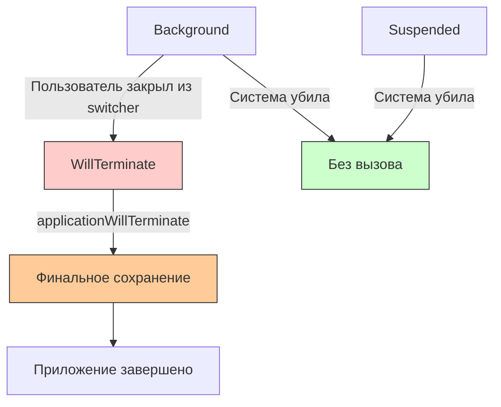
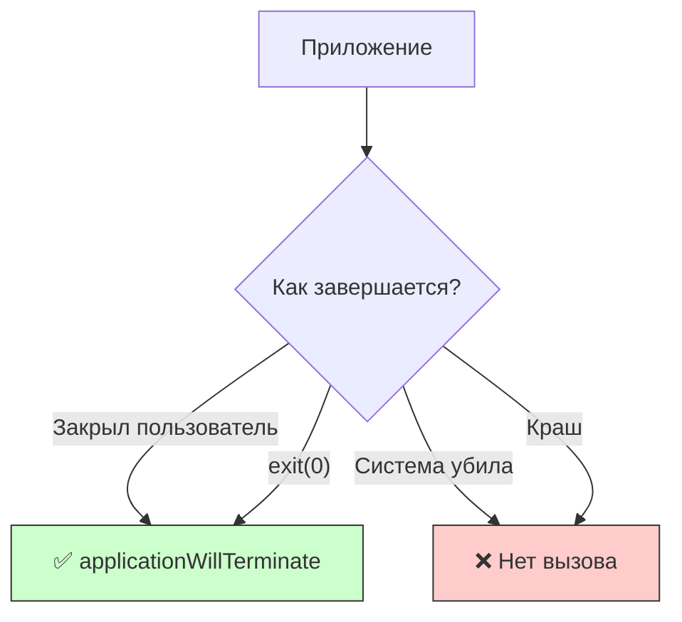

## applicationWillTerminate — Приложение завершает работу

---
#ios #appdelegate #app-lifecycle #terminate #swift #background

---

### Определение

**`applicationWillTerminate`** — это метод в [[AppDelegate]], который вызывается, когда приложение **завершает свою работу** и будет удалено из памяти. Это последний шанс для приложения выполнить какой-либо код перед завершением.

```swift
func applicationWillTerminate(_ application: UIApplication) {
    print("💀 applicationWillTerminate — приложение завершается")
}
```

**Ключевые факты:**
- Вызывается **не всегда** (система может убить приложение без вызова)
- Не вызывается для **Suspended** приложений (замороженных)
- Вызывается только при **нормальном завершении** (например, пользователь закрыл приложение из switcher)
- Даётся **очень мало времени** (~5 секунд)



---

### Зачем это знать iOS-разработчику?

| Сценарий | Почему это важно |
|---|---|
| **Финальное сохранение данных** | Последний шанс сохранить критичные данные |
| **Очистка ресурсов** | Закрытие соединений, освобождение файлов |
| **Отправка аналитики** | Фиксация завершения сессии |
| **Отписка от уведомлений** | Освобождение ресурсов |
| **Инвалидация таймеров** | Остановка фоновых процессов |

---

### Где находится метод

```swift
@main
class AppDelegate: UIResponder, UIApplicationDelegate {
    
    // MARK: - Application Lifecycle
    func applicationWillTerminate(_ application: UIApplication) {
        print("💀 applicationWillTerminate")
        
        // Финальное сохранение
        saveCriticalData()
        
        // Отправка аналитики
        flushAnalytics()
        
        // Очистка ресурсов
        cleanupResources()
    }
}
```

> **Важно:** В SceneDelegate **нет** метода `sceneWillTerminate`. Для завершения сцены используйте `sceneDidDisconnect`.

---

### Полный пример использования

```swift
@main
class AppDelegate: UIResponder, UIApplicationDelegate {
    
    // MARK: - Application Lifecycle
    func applicationWillTerminate(_ application: UIApplication) {
        print("💀 applicationWillTerminate — приложение завершается")
        
        // 1. Финальное сохранение состояния
        saveFinalState()
        
        // 2. Отправка аналитики
        flushAnalytics()
        
        // 3. Очистка временных файлов
        cleanupTemporaryFiles()
        
        // 4. Закрытие соединений
        closeConnections()
        
        // 5. Отписка от уведомлений (дублирование, но на всякий случай)
        removeObservers()
    }
    
    // MARK: - State
    private func saveFinalState() {
        // Сохранение критичных данных
        let state = FinalAppState(
            timestamp: Date(),
            lastScreen: NavigationManager.shared.currentScreen,
            userData: UserManager.shared.currentUser
        )
        
        if let data = try? JSONEncoder().encode(state) {
            UserDefaults.standard.set(data, forKey: "finalAppState")
            UserDefaults.standard.synchronize()
        }
        
        // Сохранение в Core Data (если есть незавершённые изменения)
        CoreDataManager.shared.saveContext()
        
        print("💾 Final state saved")
    }
    
    // MARK: - Analytics
    private func flushAnalytics() {
        // Отправка накопленных событий
        AnalyticsManager.shared.flush()
        
        // Отправка финального события
        AnalyticsManager.shared.track(event: "app_terminated", parameters: [
            "session_duration": getSessionDuration(),
            "last_screen": NavigationManager.shared.currentScreen
        ])
        
        print("📊 Analytics flushed")
    }
    
    private func getSessionDuration() -> TimeInterval {
        let startTime = UserDefaults.standard.object(forKey: "sessionStartTime") as? Date ?? Date()
        return Date().timeIntervalSince(startTime)
    }
    
    // MARK: - Cleanup
    private func cleanupTemporaryFiles() {
        let tempDirectory = FileManager.default.temporaryDirectory
        
        do {
            let tempFiles = try FileManager.default.contentsOfDirectory(at: tempDirectory, includingPropertiesForKeys: nil)
            for file in tempFiles {
                try? FileManager.default.removeItem(at: file)
            }
            print("🧹 Temporary files cleaned")
        } catch {
            print("❌ Failed to clean temp files: \(error)")
        }
        
        // Очистка кэша
        URLCache.shared.removeAllCachedResponses()
        ImageCache.shared.clear()
    }
    
    // MARK: - Connections
    private func closeConnections() {
        // Закрытие WebSocket соединений
        WebSocketManager.shared.disconnect()
        
        // Закрытие сетевых сессий
        URLSession.shared.finishTasksAndInvalidate()
        
        // Закрытие базы данных
        DatabaseManager.shared.close()
        
        print("🔌 Connections closed")
    }
    
    // MARK: - Observers
    private func removeObservers() {
        NotificationCenter.default.removeObserver(self)
        print("👀 Observers removed")
    }
}
```

---

### Когда applicationWillTerminate НЕ вызывается

| Сценарий | Вызывается ли | Почему |
|---|---|---|
| **Пользователь закрыл из switcher** | ✅ Да | Нормальное завершение |
| **Вызов `exit(0)`** | ✅ Да | Принудительное завершение из кода |
| **Система убила из-за нехватки памяти** | ❌ Нет | Приложение было заморожено (Suspended) |
| **Приложение в фоне, система его убила** | ❌ Нет | Нет времени на вызов |
| **Краш приложения** | ❌ Нет | Неконтролируемое завершение |
| **Обновление приложения через App Store** | ❌ Нет | Приложение было заморожено |



---

### Что НЕЛЬЗЯ делать в applicationWillTerminate

```swift
func applicationWillTerminate(_ application: UIApplication) {
    // ❌ Не делайте долгих операций — система убьёт приложение
    Thread.sleep(forTimeInterval: 10)  // Не успеет
    
    // ❌ Не полагайтесь на завершение асинхронных операций
    DispatchQueue.global().async {
        self.saveData()  // Может не успеть
    }
    
    // ❌ Не пытайтесь делать синхронные сетевые запросы
    let data = try? Data(contentsOf: url)  // Блокирует и может не успеть
    
    // ❌ Не создавайте новые сильные ссылки
    let newObject = MyClass()  // Не будет освобождён
}
```

---

### Правильный подход — асинхронное сохранение с фоновой задачей

```swift
func applicationWillTerminate(_ application: UIApplication) {
    print("💀 applicationWillTerminate")
    
    // Запрашиваем дополнительное время
    var taskId: UIBackgroundTaskIdentifier = .invalid
    taskId = application.beginBackgroundTask {
        print("⏰ Background task expired")
        application.endBackgroundTask(taskId)
    }
    
    // Сохраняем данные (синхронно, но быстро)
    saveCriticalDataSync()
    
    // Завершаем фоновую задачу
    application.endBackgroundTask(taskId)
    
    print("✅ Termination cleanup completed")
}

private func saveCriticalDataSync() {
    // Только быстрые синхронные операции
    UserDefaults.standard.synchronize()
    CoreDataManager.shared.saveContext()
}
```

---

### Сохранение состояния на случай невызова willTerminate

Поскольку `applicationWillTerminate` может не вызваться, **всегда сохраняйте состояние в `applicationDidEnterBackground`**:

```swift
func applicationDidEnterBackground(_ application: UIApplication) {
    print("⏸ applicationDidEnterBackground")
    
    // ✅ Основное сохранение здесь
    saveAppState()
    
    // Отправка аналитики
    flushAnalytics()
}

func applicationWillTerminate(_ application: UIApplication) {
    print("💀 applicationWillTerminate")
    
    // ⚠️ Дополнительное сохранение (на случай, если что-то изменилось после фона)
    saveCriticalDataSync()
}
```

---

### SceneDelegate (iOS 13+)

В SceneDelegate нет метода `sceneWillTerminate`. Вместо него используйте `sceneDidDisconnect`:

```swift
class SceneDelegate: UIResponder, UIWindowSceneDelegate {
    
    func sceneDidDisconnect(_ scene: UIScene) {
        print("🔌 sceneDidDisconnect — сцена отключена")
        
        // Сохранение состояния сцены
        saveSceneState()
        
        // Очистка ресурсов сцены
        cleanupSceneResources()
    }
}
```

---

### Распространённые ошибки

#### 1. Полагаться на willTerminate для сохранения данных

```swift
// ❌ Плохо — данные могут потеряться
func applicationWillTerminate(_ application: UIApplication) {
    saveUserInput()  // Может не вызваться
}

// ✅ Хорошо — сохраняем в didEnterBackground
func applicationDidEnterBackground(_ application: UIApplication) {
    saveUserInput()
}

func applicationWillTerminate(_ application: UIApplication) {
    // Дополнительное сохранение (на всякий случай)
    saveUserInput()
}
```

#### 2. Долгие операции

```swift
// ❌ Плохо — не успеет
func applicationWillTerminate(_ application: UIApplication) {
    for i in 0..<10000 {
        processItem(i)  // Долго
    }
}

// ✅ Хорошо — только критичное
func applicationWillTerminate(_ application: UIApplication) {
    saveCriticalData()  // Только самое важное
}
```

#### 3. Асинхронные операции без фоновой задачи

```swift
// ❌ Плохо — не успеет
func applicationWillTerminate(_ application: UIApplication) {
    DispatchQueue.global().async {
        self.saveLargeFile()  // Не выполнится
    }
}

// ✅ Хорошо — с фоновой задачей
func applicationWillTerminate(_ application: UIApplication) {
    let taskId = application.beginBackgroundTask {
        application.endBackgroundTask(taskId)
    }
    
    saveLargeFileSync()
    
    application.endBackgroundTask(taskId)
}
```

---

### Лучшие практики (2026)

| Практика | Почему |
|---|---|
| **Сохраняйте состояние в `didEnterBackground`** | willTerminate может не вызваться |
| **Делайте только быстрые синхронные операции** | Мало времени |
| **Используйте фоновую задачу для гарантии** | Если нужно чуть больше времени |
| **Не полагайтесь на willTerminate для критичных данных** | Лучше сохранять чаще |
| **Не делайте сетевых запросов** | Не успеют |
| **Не создавайте новых объектов** | Не будут освобождены |
| **Используйте SceneDelegate для сцен** | Разделение ответственности |

---

### Короткое правило

> **`applicationWillTerminate`** = последний шанс сохранить данные (но может не вызваться).  
> **Не полагайся на него** для критичных данных.  
> **Сохраняй состояние в `didEnterBackground`**.  
> **Делай только быстрые синхронные операции**.  
> **Не делай сетевых запросов** — не успеют.

---

### Итог

**`applicationWillTerminate`** — непредсказуемый метод, на который нельзя полагаться:

| Аспект | Значение |
|---|---|
| **Вызывается** | Не всегда (только при нормальном завершении) |
| **Доступное время** | Очень мало (~5 секунд) |
| **Назначение** | Финальное сохранение, очистка ресурсов |
| **Не делать** | Долгие операции, сетевые запросы |
| **Обязательно** | Сохранять состояние в `didEnterBackground` |
| **Альтернатива** | Сохранение в `didEnterBackground` |

**Главное правило:**
> Никогда не полагайся на `applicationWillTerminate` для сохранения критичных данных — он может не вызваться. Всегда сохраняй состояние в `applicationDidEnterBackground`. В `willTerminate` делай только быстрые синхронные операции и не создавай новых объектов. Для длительных операций используй фоновые задачи, но помни, что время ограничено. На iPad с многозадачностью для сцен используй `sceneDidDisconnect`. Лучшая стратегия — сохранять данные инкрементально в процессе работы приложения, а не только при завершении.