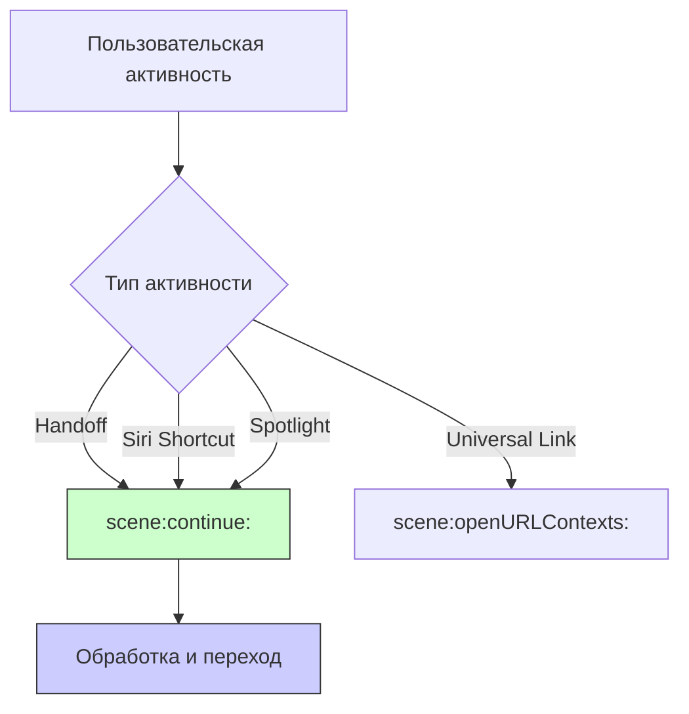

## scene(_:continue:) — Обработка продолжения пользовательской активности (NSUserActivity) в SceneDelegate

---
#ios #scenedelegate #nsuseractivity #handoff #siri #spotlight #universal-links

---

### Определение

**`scene(_:continue:)`** — это метод в [[SceneDelegate]] ([[iOS]] 13+), который вызывается, когда приложение получает **пользовательскую активность** (`NSUserActivity`) и должно её продолжить. Это может быть:
- **Handoff** — передача активности между устройствами Apple (iPhone → Mac, iPad → iPhone)
- **Siri** — запуск через Siri Shortcuts
- **Spotlight** — открытие приложения через результаты поиска Spotlight
- **[[Universal Link]]s** (частично, но для них есть отдельный метод)

```swift
func scene(_ scene: UIScene, continue userActivity: NSUserActivity) {
    print("🔄 scene(_:continue:) — продолжение активности: \(userActivity.activityType)")
    
    // Обработка активности
    handleUserActivity(userActivity)
}
```

---

### Зачем это знать iOS-разработчику?

| Сценарий | Почему это важно |
|---|---|
| **Handoff** | Пользователь начал работу на одном устройстве, хочет продолжить на другом |
| **Siri Shortcuts** | Пользователь запустил приложение через Siri |
| **Spotlight поиск** | Пользователь нашёл контент через поиск Spotlight |
| **Universal Links** | Переход по ссылке (частично) |
| **Кастомные активности** | Собственные NSUserActivity для глубокой интеграции |



---

### Полный пример использования

```swift
import UIKit

class SceneDelegate: UIResponder, UIWindowSceneDelegate {
    
    var window: UIWindow?
    
    // MARK: - User Activity Continuation
    func scene(_ scene: UIScene, continue userActivity: NSUserActivity) {
        print("🔄 scene(_:continue:)")
        print("   Activity type: \(userActivity.activityType)")
        print("   User info: \(userActivity.userInfo ?? [:])")
        
        // 1. Обработка в зависимости от типа активности
        switch userActivity.activityType {
        case "com.example.app.viewProduct":
            handleProductActivity(userActivity)
            
        case "com.example.app.viewArticle":
            handleArticleActivity(userActivity)
            
        case CSSearchableItemActionType:
            handleSpotlightActivity(userActivity)
            
        default:
            if #available(iOS 12.0, *) {
                if userActivity.activityType == NSStringFromClass(INStartWorkoutIntent.self) {
                    handleSiriWorkoutActivity(userActivity)
                }
            }
        }
        
        // 2. Обновление UI
        updateUIForActivity(userActivity)
    }
    
    // MARK: - Handlers
    private func handleProductActivity(_ activity: NSUserActivity) {
        guard let productId = activity.userInfo?["productId"] as? String else {
            print("❌ No product ID in activity")
            return
        }
        
        print("📦 Opening product: \(productId)")
        
        // Переход на экран продукта
        navigateToProduct(productId: productId)
    }
    
    private func handleArticleActivity(_ activity: NSUserActivity) {
        guard let articleId = activity.userInfo?["articleId"] as? String else {
            print("❌ No article ID in activity")
            return
        }
        
        print("📰 Opening article: \(articleId)")
        
        // Переход на экран статьи
        navigateToArticle(articleId: articleId)
    }
    
    private func handleSpotlightActivity(_ activity: NSUserActivity) {
        guard let identifier = activity.userInfo?[CSSearchableItemActivityIdentifier] as? String else {
            print("❌ No identifier in Spotlight activity")
            return
        }
        
        print("🔍 Opening from Spotlight: \(identifier)")
        
        // Парсинг идентификатора
        let components = identifier.split(separator: "/")
        if components.count == 2, components[0] == "product" {
            navigateToProduct(productId: String(components[1]))
        } else if components.count == 2, components[0] == "article" {
            navigateToArticle(articleId: String(components[1]))
        }
    }
    
    @available(iOS 12.0, *)
    private func handleSiriWorkoutActivity(_ activity: NSUserActivity) {
        guard let intent = activity.interaction?.intent as? INStartWorkoutIntent else {
            print("❌ Not a workout intent")
            return
        }
        
        let workoutName = intent.workoutName?.spokenPhrase ?? "unknown"
        print("💪 Starting workout from Siri: \(workoutName)")
        
        navigateToWorkout(name: workoutName)
    }
    
    // MARK: - Navigation
    private func navigateToProduct(productId: String) {
        guard let window = window,
              let navigationController = window.rootViewController as? UINavigationController else {
            return
        }
        
        let productVC = ProductViewController(productId: productId)
        navigationController.pushViewController(productVC, animated: true)
    }
    
    private func navigateToArticle(articleId: String) {
        guard let window = window,
              let navigationController = window.rootViewController as? UINavigationController else {
            return
        }
        
        let articleVC = ArticleViewController(articleId: articleId)
        navigationController.pushViewController(articleVC, animated: true)
    }
    
    private func navigateToWorkout(name: String) {
        guard let window = window,
              let navigationController = window.rootViewController as? UINavigationController else {
            return
        }
        
        let workoutVC = WorkoutViewController(workoutName: name)
        navigationController.pushViewController(workoutVC, animated: true)
    }
    
    private func updateUIForActivity(_ activity: NSUserActivity) {
        // Обновление UI, если нужно
        NotificationCenter.default.post(name: .userActivityReceived, object: activity)
    }
}

// MARK: - Notifications
extension Notification.Name {
    static let userActivityReceived = Notification.Name("userActivityReceived")
}
```

---

### Регистрация и создание NSUserActivity

#### 1. Регистрация активности для Handoff

```swift
class ProductViewController: UIViewController {
    
    var productId: String = ""
    
    override func viewDidLoad() {
        super.viewDidLoad()
        
        // Создание активности для Handoff
        let activity = NSUserActivity(activityType: "com.example.app.viewProduct")
        activity.title = "Просмотр товара"
        activity.userInfo = ["productId": productId]
        
        // Делаем активность доступной для Handoff
        userActivity = activity
        userActivity?.becomeCurrent()
        
        // Обновление заголовка для Spotlight
        activity.title = "Товар \(productId)"
        activity.isEligibleForSearch = true
        activity.isEligibleForHandoff = true
        activity.isEligibleForPublicIndexing = true
        
        // Добавление в Spotlight
        let attributeSet = CSSearchableItemAttributeSet(contentType: .item)
        attributeSet.title = "Товар \(productId)"
        attributeSet.contentDescription = "Описание товара"
        
        activity.contentAttributeSet = attributeSet
        
        userActivity = activity
        activity.becomeCurrent()
    }
    
    override func viewWillDisappear(_ animated: Bool) {
        super.viewWillDisappear(animated)
        userActivity?.resignCurrent()
    }
}
```

#### 2. Регистрация Siri Shortcut

```swift
import Intents

class SettingsViewController: UIViewController {
    
    @IBAction func addSiriShortcutTapped(_ sender: Any) {
        let intent = StartWorkoutIntent()
        intent.workoutName = INSpeakableString(spokenPhrase: "Вечерняя тренировка")
        
        let interaction = INInteraction(intent: intent, response: nil)
        interaction.donate { error in
            if let error = error {
                print("❌ Failed to donate: \(error)")
            } else {
                print("✅ Siri shortcut donated")
            }
        }
    }
}
```

---

### AppDelegate vs SceneDelegate

В iOS 13+ большая часть обработки `NSUserActivity` переехала в `SceneDelegate`:

| Метод | Где находится | Когда используется |
|---|---|---|
| **`application(_:continue:restorationHandler:)`** | AppDelegate (устаревший) | iOS 12 и ниже |
| **`scene(_:continue:)`** | SceneDelegate (iOS 13+) | Современный подход |

```swift
// Устаревший подход (iOS 12 и ниже)
class AppDelegate: UIResponder, UIApplicationDelegate {
    func application(_ application: UIApplication,
                     continue userActivity: NSUserActivity,
                     restorationHandler: @escaping ([UIUserActivityRestoring]?) -> Void) -> Bool {
        // Обработка
        return true
    }
}
```

---

### Обработка разных типов активностей

```swift
func scene(_ scene: UIScene, continue userActivity: NSUserActivity) {
    
    // 1. Handoff
    if userActivity.activityType == "com.example.app.viewProduct" {
        handleProductActivity(userActivity)
        return
    }
    
    // 2. Siri Intent
    if #available(iOS 12.0, *) {
        if let intent = userActivity.interaction?.intent as? INStartWorkoutIntent {
            handleSiriWorkoutIntent(intent)
            return
        }
    }
    
    // 3. Spotlight
    if userActivity.activityType == CSSearchableItemActionType {
        handleSpotlightActivity(userActivity)
        return
    }
    
    // 4. Universal Link (частично)
    if let webpageURL = userActivity.webpageURL {
        handleUniversalLink(webpageURL)
        return
    }
    
    print("⚠️ Unknown activity type: \(userActivity.activityType)")
}
```

---

### Универсальные ссылки (Universal Links)

Для Universal Links используется отдельный метод:

```swift
func scene(_ scene: UIScene, continue userActivity: NSUserActivity) {
    // Universal Links приходят через webpageURL
    if let url = userActivity.webpageURL {
        handleUniversalLink(url)
        return
    }
}

func scene(_ scene: UIScene, openURLContexts URLContexts: Set<UIOpenURLContext>) {
    // Обычные URL Scheme
    for context in URLContexts {
        handleDeepLink(context.url)
    }
}
```

---

### Тестирование Handoff

#### 1. Настройка entitlements

```xml
<!--.entitlements -->
<key>com.apple.developer.associated-domains</key>
<array>
    <string>applinks:example.com</string>
    <string>activitycontinuation:example.com</string>
</array>
```

#### 2. Настройка Info.plist

```xml
<key>NSUserActivityTypes</key>
<array>
    <string>com.example.app.viewProduct</string>
    <string>com.example.app.viewArticle</string>
</array>
```

---

### Распространённые ошибки

#### 1. Забыли вызвать becomeCurrent()

```swift
// ❌ Плохо — активность не будет доступна для Handoff
userActivity = activity

// ✅ Хорошо
userActivity = activity
userActivity?.becomeCurrent()
```

#### 2. Разные типы на разных устройствах

```swift
// ❌ Плохо — Handoff не сработает
// iPhone: com.example.app.viewProduct
// iPad: com.example.app.viewItem

// ✅ Хорошо — одинаковые типы
// Используйте один и тот же идентификатор на всех устройствах
```

#### 3. Забыли обработку в SceneDelegate

```swift
// ❌ Плохо — метод не реализован
class SceneDelegate: UIResponder, UIWindowSceneDelegate {
    // Нет метода scene(_:continue:)
}

// ✅ Хорошо
class SceneDelegate: UIResponder, UIWindowSceneDelegate {
    func scene(_ scene: UIScene, continue userActivity: NSUserActivity) {
        // Обработка
    }
}
```

---

### Лучшие практики (2026)

| Практика | Почему |
|---|---|
| **Используйте SceneDelegate** | Современный подход для iOS 13+ |
| **Регистрируйте типы активностей** | В Info.plist и в коде |
| **Вызывайте becomeCurrent()** | Чтобы активность была доступна |
| **Обрабатывайте все типы активностей** | Handoff, Siri, Spotlight |
| **Проверяйте userInfo на nil** | Данные могут отсутствовать |
| **Используйте осмысленные идентификаторы** | Для отладки и аналитики |
| **Тестируйте на нескольких устройствах** | Handoff требует тестирования |

---

### Короткое правило

> **`scene(_:continue:)`** = продолжение пользовательской активности.  
> **Handoff, Siri, Spotlight** — всё сюда.  
> **Не забудь `becomeCurrent()`** на отправляющем устройстве.  
> **Обрабатывай разные типы** активностей.  
> **Используй SceneDelegate** для современных приложений.

---

### Итог

**`scene(_:continue:)`** — ключевой метод для обработки продолжения пользовательской активности в современных iOS-приложениях:

| Аспект | Значение |
|---|---|
| **Вызывается** | При получении NSUserActivity (Handoff, Siri, Spotlight) |
| **Где находится** | SceneDelegate (iOS 13+) |
| **Назначение** | Продолжение активности с другого устройства или через Siri/Spotlight |
| **Не забыть** | `becomeCurrent()` на отправляющем устройстве |
| **Альтернатива** | `application(_:continue:restorationHandler:)` (устаревший) |

**Главное правило:**
> Для поддержки Handoff, Siri Shortcuts и Spotlight реализуй `scene(_:continue:)` в SceneDelegate. Не забывай вызывать `becomeCurrent()` на отправляющем устройстве и регистрировать типы активностей в Info.plist. Обрабатывай разные типы активностей и всегда проверяй наличие данных в `userInfo`. Используй осмысленные идентификаторы для отладки. Тестируй Handoff на нескольких устройствах с одним Apple ID. Для Universal Links используй отдельные методы. Помни, что это современный подход, заменивший старый `application(_:continue:restorationHandler:)` из AppDelegate.