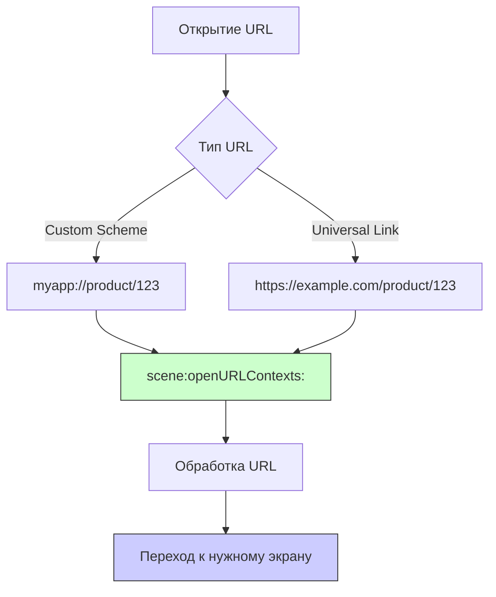

## scene(_:openURLContexts:) — Обработка открытия URL в SceneDelegate

---
#ios #scenedelegate #deep-links #url-schemes #universal-links #appdelegate #ios13

---

### Определение

**`scene(_:openURLContexts:)`** — это метод в [[SceneDelegate]] (iOS 13+), который вызывается, когда приложение открывается **по [[URL]]-схеме** (custom scheme) или **универсальной ссылке** ([[Universal Link]]). Этот метод пришёл на смену устаревшему `application(_:open:options:)` в [[AppDelegate]].

```swift
func scene(_ scene: UIScene, openURLContexts URLContexts: Set<UIOpenURLContext>) {
    print("🔗 scene(_:openURLContexts:) — открыто \(URLContexts.count) URL")
    
    for context in URLContexts {
        handleURL(context.url)
    }
}
```

**Ключевые факты:**
- Вызывается **только для активных сцен** (если несколько окон на iPad)
- Поддерживает **несколько URL одновременно** (например, если приложение закрыто и открыто несколькими ссылками)
- Каждый `UIOpenURLContext` содержит: URL, опции открытия, источник события



---

### Зачем это знать iOS-разработчику?

| Сценарий | Почему это важно |
|---|---|
| **Deep Links (глубокие ссылки)** | Открытие конкретного экрана приложения по ссылке |
| **Универсальные ссылки (Universal Links)** | Альтернатива URL-схемам, более безопасная |
| **Firebase Dynamic Links** | Обработка динамических ссылок |
| **Маркетинговые ссылки** | Переходы из email, SMS, соцсетей |
| **Шаринг контента** | Открытие шеринга из другого приложения |
| **Многозадачность на iPad** | Разные сцены (окна) могут обрабатывать разные URL |

---

### Полный пример использования

```swift
import UIKit

class SceneDelegate: UIResponder, UIWindowSceneDelegate {
    
    var window: UIWindow?
    
    // MARK: - URL Handling
    func scene(_ scene: UIScene, openURLContexts URLContexts: Set<UIOpenURLContext>) {
        print("🔗 scene(_:openURLContexts:)")
        print("   Количество URL: \(URLContexts.count)")
        
        for context in URLContexts {
            let url = context.url
            let options = context.options
            
            print("   URL: \(url.absoluteString)")
            print("   Source app: \(options.sourceApplication ?? "unknown")")
            print("   Annotations: \(options.annotations ?? [:])")
            print("   Open in place: \(options.openInPlace)")
            
            handleURL(url, sourceApp: options.sourceApplication)
        }
    }
    
    // MARK: - URL Handling Logic
    private func handleURL(_ url: URL, sourceApp: String?) {
        print("🔍 Обработка URL: \(url.absoluteString)")
        
        // 1. Проверяем схему
        guard let scheme = url.scheme else {
            print("❌ Нет схемы URL")
            return
        }
        
        switch scheme {
        case "myapp":
            handleCustomScheme(url)
        case "https", "http":
            handleUniversalLink(url)
        default:
            print("⚠️ Неизвестная схема: \(scheme)")
        }
    }
    
    // MARK: - Custom URL Scheme
    private func handleCustomScheme(_ url: URL) {
        print("📱 Custom scheme URL: \(url)")
        
        guard let host = url.host else {
            print("❌ Нет host в URL")
            return
        }
        
        switch host {
        case "product":
            // myapp://product/123
            let productId = url.lastPathComponent
            navigateToProduct(productId: productId)
            
        case "profile":
            // myapp://profile?userId=123
            if let components = URLComponents(url: url, resolvingAgainstBaseURL: false),
               let userId = components.queryItems?.first(where: { $0.name == "userId" })?.value {
                navigateToProfile(userId: userId)
            }
            
        case "search":
            // myapp://search?q=iphone
            if let components = URLComponents(url: url, resolvingAgainstBaseURL: false),
               let query = components.queryItems?.first(where: { $0.name == "q" })?.value {
                navigateToSearch(query: query)
            }
            
        default:
            print("⚠️ Неизвестный host: \(host)")
        }
    }
    
    // MARK: - Universal Links
    private func handleUniversalLink(_ url: URL) {
        print("🌐 Universal Link: \(url)")
        
        // Разбор пути
        let pathComponents = url.pathComponents
        
        if pathComponents.contains("product") {
            // https://example.com/product/123
            if let productId = pathComponents.last {
                navigateToProduct(productId: productId)
            }
        } else if pathComponents.contains("profile") {
            // https://example.com/profile/123
            if let userId = pathComponents.last {
                navigateToProfile(userId: userId)
            }
        } else if pathComponents.contains("search") {
            // https://example.com/search?q=iphone
            if let components = URLComponents(url: url, resolvingAgainstBaseURL: false),
               let query = components.queryItems?.first(where: { $0.name == "q" })?.value {
                navigateToSearch(query: query)
            }
        } else {
            // Обычный переход на главный экран
            navigateToMain()
        }
    }
    
    // MARK: - Navigation
    private func navigateToProduct(productId: String) {
        print("📦 Переход на товар: \(productId)")
        
        guard let window = window,
              let navigationController = window.rootViewController as? UINavigationController else {
            return
        }
        
        let productVC = ProductViewController(productId: productId)
        navigationController.pushViewController(productVC, animated: true)
    }
    
    private func navigateToProfile(userId: String) {
        print("👤 Переход на профиль: \(userId)")
        
        guard let window = window,
              let navigationController = window.rootViewController as? UINavigationController else {
            return
        }
        
        let profileVC = ProfileViewController(userId: userId)
        navigationController.pushViewController(profileVC, animated: true)
    }
    
    private func navigateToSearch(query: String) {
        print("🔍 Переход на поиск: \(query)")
        
        guard let window = window,
              let navigationController = window.rootViewController as? UINavigationController else {
            return
        }
        
        let searchVC = SearchViewController(searchQuery: query)
        navigationController.pushViewController(searchVC, animated: true)
    }
    
    private func navigateToMain() {
        print("🏠 Переход на главный экран")
        
        guard let window = window else { return }
        
        if let navigationController = window.rootViewController as? UINavigationController {
            navigationController.popToRootViewController(animated: true)
        }
    }
}
```

---

### Настройка URL Schemes

#### 1. Info.plist — добавление схемы

```xml
<key>CFBundleURLTypes</key>
<array>
    <dict>
        <key>CFBundleURLSchemes</key>
        <array>
            <string>myapp</string>
            <string>myapp2</string>
        </array>
        <key>CFBundleURLName</key>
        <string>com.example.myapp</string>
    </dict>
</array>
```

#### 2. Настройка Universal Links

**Associated Domains entitlement:**

```xml
<key>com.apple.developer.associated-domains</key>
<array>
    <string>applinks:example.com</string>
    <string>applinks:www.example.com</string>
</array>
```

**apple-app-site-association файл на сервере:**

```json
{
    "applinks": {
        "apps": [],
        "details": [
            {
                "appID": "TEAMID.com.example.myapp",
                "paths": ["/product/*", "/profile/*", "/search"]
            }
        ]
    }
}
```

---

### Обработка Firebase Dynamic Links

```swift
import Firebase

class SceneDelegate: UIResponder, UIWindowSceneDelegate {
    
    func scene(_ scene: UIScene, openURLContexts URLContexts: Set<UIOpenURLContext>) {
        for context in URLContexts {
            // Firebase Dynamic Links
            let dynamicLink = DynamicLinks.dynamicLinks().dynamicLink(fromCustomSchemeURL: context.url)
            
            if let dynamicLink = dynamicLink {
                handleDynamicLink(dynamicLink)
            } else {
                handleURL(context.url)
            }
        }
    }
    
    private func handleDynamicLink(_ dynamicLink: DynamicLink) {
        guard let url = dynamicLink.url else { return }
        
        // Аналитика перехода
        Analytics.logEvent("dynamic_link_opened", parameters: [
            "url": url.absoluteString,
            "match_type": dynamicLink.matchType.rawValue
        ])
        
        handleURL(url)
    }
}
```

---

### AppDelegate vs SceneDelegate

| Метод | Где находится | iOS версия | Поддержка сцен |
|---|---|---|---|
| **`application(_:open:options:)`** | AppDelegate | iOS 9+ | ❌ Нет |
| **`scene(_:openURLContexts:)`** | SceneDelegate | iOS 13+ | ✅ Да |

```swift
// ❌ Устаревший подход (iOS 12 и ниже)
class AppDelegate: UIResponder, UIApplicationDelegate {
    func application(_ app: UIApplication,
                     open url: URL,
                     options: [UIApplication.OpenURLOptionsKey: Any] = [:]) -> Bool {
        handleURL(url)
        return true
    }
}

// ✅ Современный подход (iOS 13+)
class SceneDelegate: UIResponder, UIWindowSceneDelegate {
    func scene(_ scene: UIScene, openURLContexts URLContexts: Set<UIOpenURLContext>) {
        for context in URLContexts {
            handleURL(context.url)
        }
    }
}
```

---

### Поддержка нескольких сцен (iPad multitasking)

```swift
func scene(_ scene: UIScene, openURLContexts URLContexts: Set<UIOpenURLContext>) {
    // Каждая сцена (окно) обрабатывает свои URL
    print("🔗 Сцена \(scene.session.persistentIdentifier) получила URL")
    
    // Определяем, активна ли сцена
    if scene.activationState == .foregroundActive {
        print("✅ Сцена активна, обрабатываем URL")
        for context in URLContexts {
            handleURLInCurrentScene(context.url)
        }
    } else {
        print("⏸ Сцена не активна, сохраняем URL для обработки позже")
        pendingURL = URLContexts.first?.url
    }
}
```

---

### Распространённые ошибки

#### 1. Неправильная схема

```swift
// ❌ Плохо — не проверяем схему
func scene(_ scene: UIScene, openURLContexts URLContexts: Set<UIOpenURLContext>) {
    let url = URLContexts.first!.url
    navigateToProduct(productId: url.lastPathComponent)  // Упадёт, если схема другая
}

// ✅ Хорошо
func scene(_ scene: UIScene, openURLContexts URLContexts: Set<UIOpenURLContext>) {
    guard let url = URLContexts.first?.url,
          url.scheme == "myapp" else { return }
    navigateToProduct(productId: url.lastPathComponent)
}
```

#### 2. Игнорирование нескольких URL

```swift
// ❌ Плохо — обрабатываем только первый
func scene(_ scene: UIScene, openURLContexts URLContexts: Set<UIOpenURLContext>) {
    handleURL(URLContexts.first!.url)
}

// ✅ Хорошо — обрабатываем все
func scene(_ scene: UIScene, openURLContexts URLContexts: Set<UIOpenURLContext>) {
    for context in URLContexts {
        handleURL(context.url)
    }
}
```

#### 3. Забытая обработка в AppDelegate (для iOS 12 и ниже)

```swift
// ❌ Плохо — метод не реализован для старых iOS
class AppDelegate: UIResponder, UIApplicationDelegate {
    // Нет метода application(_:open:options:)
}

// ✅ Хорошо — поддерживаем и старые iOS
@available(iOS 13.0, *)
func scene(_ scene: UIScene, openURLContexts URLContexts: Set<UIOpenURLContext>) {
    // iOS 13+
}

func application(_ app: UIApplication, open url: URL, options: [UIApplication.OpenURLOptionsKey: Any] = [:]) -> Bool {
    // iOS 12 и ниже
    handleURL(url)
    return true
}
```

---

### Лучшие практики (2026)

| Практика | Почему |
|---|---|
| **Используйте SceneDelegate** | Современный подход для iOS 13+ |
| **Проверяйте схему URL** | Безопасность |
| **Обрабатывайте несколько URL** | Поддержка нескольких ссылок |
| **Поддерживайте старые iOS версии** | Метод в AppDelegate для iOS 12- |
| **Логируйте открытия** | Аналитика и отладка |
| **Используйте Universal Links** | Безопаснее, чем URL schemes |
| **Проверяйте активность сцены** | Для многозадачности на iPad |

---

### Короткое правило

> **`scene(_:openURLContexts:)`** = обработка URL в современных iOS-приложениях.  
> **Custom schemes и Universal Links** — всё сюда.  
> **Обрабатывай все URL** в контексте.  
> **Не забывай про старые iOS** (метод в AppDelegate).  
> **Используй SceneDelegate** для многозадачности на iPad.

---

### Итог

**`scene(_:openURLContexts:)`** — ключевой метод для обработки глубоких ссылок в современных iOS-приложениях:

| Аспект | Значение |
|---|---|
| **Вызывается** | При открытии URL (custom scheme, Universal Link) |
| **Где находится** | SceneDelegate (iOS 13+) |
| **Назначение** | Обработка глубоких ссылок, переход к нужному контенту |
| **Поддержка сцен** | ✅ Да (разные окна на iPad) |
| **Несколько URL** | ✅ Да (одновременно) |
| **Альтернатива** | `application(_:open:options:)` (устаревший) |

**Главное правило:**
> Для обработки глубоких ссылок в iOS 13+ используй `scene(_:openURLContexts:)` в SceneDelegate. Не забывай проверять схему URL и обрабатывать все контексты. Поддерживай старые версии iOS через `application(_:open:options:)` в AppDelegate. Используй Universal Links вместо URL schemes для лучшей безопасности. На iPad учитывай, что URL может быть открыт в конкретной сцене (окне). Логируй открытия для аналитики и отладки. Проверяй, что URL содержит все необходимые параметры перед навигацией. Помни, что Firebase Dynamic Links также обрабатываются через этот метод. Для правильной работы Universal Links настрой Associated Domains и apple-app-site-association на сервере. В Info.plist добавь поддерживаемые URL схемы. Используй осмысленные пути и параметры для deep linking. Всегда проверяй, что корневой контроллер готов к навигации (view загружен). Для отложенных переходов сохраняй URL и обрабатывай после загрузки приложения.