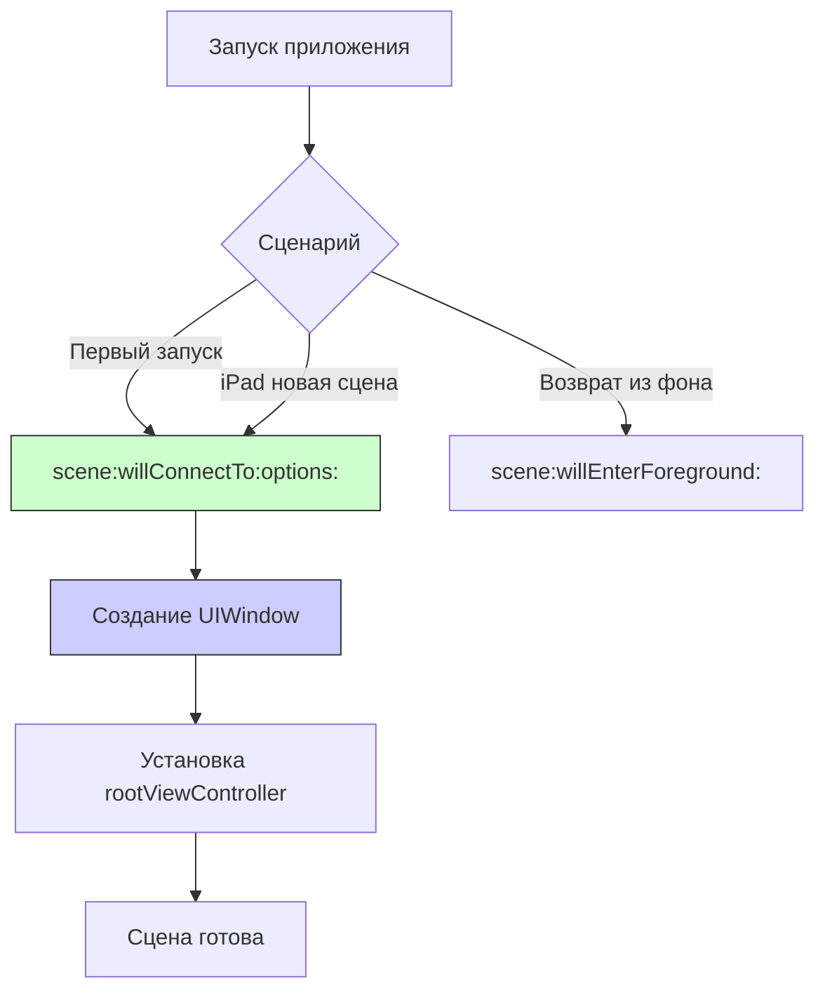

## scene(_:willConnectTo:options:) — Начальная настройка сцены в SceneDelegate

---
#ios #scenedelegate #scene #app-lifecycle #ios13 #swift #uikit

---

### Определение

**`scene(_:willConnectTo:options:)`** — это первый и самый важный метод в [[SceneDelegate]], который вызывается при создании новой сцены (окна) в приложении. Этот метод является аналогом `application(_:didFinishLaunchingWithOptions:)` для отдельной сцены.

```swift
func scene(_ scene: UIScene, 
           willConnectTo session: UISceneSession, 
           options connectionOptions: UIScene.ConnectionOptions) {
    print("🔗 scene(_:willConnectTo:options:) — создание сцены")
    
    guard let windowScene = scene as? UIWindowScene else { return }
    
    // Настройка окна и корневого контроллера
    let window = UIWindow(windowScene: windowScene)
    window.rootViewController = MainViewController()
    window.makeKeyAndVisible()
    self.window = window
}
```

**Ключевые факты:**
- Вызывается **один раз** для каждой новой сцены (окна)
- На iPad может быть **несколько сцен** (многозадачность)
- Здесь создаётся и настраивается [[UIWindow]] для сцены
- Аналог `didFinishLaunchingWithOptions` на уровне сцены



---

### Зачем это знать iOS-разработчику?

| Сценарий                       | Почему это важно                             |
| ------------------------------ | -------------------------------------------- |
| **Инициализация UI**           | Создание окна и корневого контроллера        |
| **Различные сценарии запуска** | Обработка [[URL]], userActivity, shortcut    |
| **iPad многозадачность**       | Поддержка нескольких окон                    |
| **State restoration**          | Восстановление состояния сцены               |
| **Разные конфигурации**        | Разные сцены могут иметь разную конфигурацию |

---

### Полный пример использования

```swift
import UIKit

class SceneDelegate: UIResponder, UIWindowSceneDelegate {
    
    var window: UIWindow?
    
    // MARK: - Scene Lifecycle
    func scene(_ scene: UIScene, 
               willConnectTo session: UISceneSession, 
               options connectionOptions: UIScene.ConnectionOptions) {
        
        print("🔗 scene(_:willConnectTo:options:)")
        print("   Session: \(session.persistentIdentifier)")
        print("   Configuration: \(session.configuration.name ?? "default")")
        
        // 1. Проверяем, что сцена подходит
        guard let windowScene = scene as? UIWindowScene else {
            print("❌ Неверный тип сцены")
            return
        }
        
        // 2. Создаём окно
        let window = UIWindow(windowScene: windowScene)
        
        // 3. Определяем корневой контроллер в зависимости от конфигурации
        let rootViewController = makeRootViewController(for: session)
        
        // 4. Устанавливаем корневой контроллер
        window.rootViewController = rootViewController
        window.makeKeyAndVisible()
        self.window = window
        
        // 5. Обрабатываем причину запуска
        handleLaunchOptions(connectionOptions)
        
        // 6. Восстанавливаем состояние (если нужно)
        restoreStateIfNeeded(for: session)
    }
    
    // MARK: - Root View Controller Factory
    private func makeRootViewController(for session: UISceneSession) -> UIViewController {
        // Разные конфигурации для разных сцен
        switch session.configuration.name {
        case "MainScene":
            return MainViewController()
        case "SearchScene":
            return SearchViewController()
        case "SettingsScene":
            return SettingsViewController()
        default:
            return MainViewController()
        }
    }
    
    // MARK: - Launch Options Handling
    private func handleLaunchOptions(_ options: UIScene.ConnectionOptions) {
        print("📱 Обработка опций запуска")
        
        // 1. URL Contexts (глубокие ссылки)
        if let urlContext = options.urlContexts.first {
            print("   URL: \(urlContext.url)")
            handleDeepLink(urlContext.url)
        }
        
        // 2. User Activity (Handoff, Siri, Spotlight)
        if let userActivity = options.userActivities.first {
            print("   Activity: \(userActivity.activityType)")
            handleUserActivity(userActivity)
        }
        
        // 3. Shortcut Item (3D Touch / Haptic Touch)
        if let shortcutItem = options.shortcutItem {
            print("   Shortcut: \(shortcutItem.type)")
            handleShortcutItem(shortcutItem)
        }
        
        // 4. Notification Response (Push-уведомления)
        if let notificationResponse = options.notificationResponse {
            print("   Notification: \(notificationResponse.notification.request.identifier)")
            handleNotificationResponse(notificationResponse)
        }
    }
    
    // MARK: - State Restoration
    private func restoreStateIfNeeded(for session: UISceneSession) {
        guard session.stateRestorationActivity != nil else {
            print("🔄 Нет сохранённого состояния")
            return
        }
        
        print("🔄 Восстановление состояния сцены")
        
        // SwiftUI автоматически восстанавливает состояние
        // Для UIKit нужно сохранять/восстанавливать вручную
        if let restorationActivity = session.stateRestorationActivity {
            restorationActivity.persistentIdentifier = session.persistentIdentifier
            restorationActivity.becomeCurrent()
        }
    }
    
    // MARK: - Handlers
    private func handleDeepLink(_ url: URL) {
        print("🔗 Deep link: \(url)")
        NotificationCenter.default.post(name: .deepLinkReceived, object: url)
    }
    
    private func handleUserActivity(_ activity: NSUserActivity) {
        print("📱 User activity: \(activity.activityType)")
        NotificationCenter.default.post(name: .userActivityReceived, object: activity)
    }
    
    private func handleShortcutItem(_ item: UIApplicationShortcutItem) {
        print("⚡️ Shortcut: \(item.type)")
        NotificationCenter.default.post(name: .shortcutReceived, object: item)
    }
    
    private func handleNotificationResponse(_ response: UNNotificationResponse) {
        print("📬 Notification response: \(response.notification.request.identifier)")
        NotificationCenter.default.post(name: .notificationReceived, object: response)
    }
}

// MARK: - Notifications
extension Notification.Name {
    static let deepLinkReceived = Notification.Name("deepLinkReceived")
    static let userActivityReceived = Notification.Name("userActivityReceived")
    static let shortcutReceived = Notification.Name("shortcutReceived")
    static let notificationReceived = Notification.Name("notificationReceived")
}
```

---

### Различные сценарии запуска

#### 1. Обычный запуск

```swift
func scene(_ scene: UIScene, willConnectTo session: UISceneSession, options connectionOptions: UIScene.ConnectionOptions) {
    guard let windowScene = scene as? UIWindowScene else { return }
    
    let window = UIWindow(windowScene: windowScene)
    window.rootViewController = MainViewController()
    window.makeKeyAndVisible()
    self.window = window
    
    // ✅ Обычный запуск — опции пустые
    print("Обычный запуск")
}
```

#### 2. Запуск через [[Deep Link]] ([[URL]] Scheme)

```swift
func scene(_ scene: UIScene, willConnectTo session: UISceneSession, options connectionOptions: UIScene.ConnectionOptions) {
    guard let windowScene = scene as? UIWindowScene else { return }
    
    let window = UIWindow(windowScene: windowScene)
    
    // Проверяем URL
    if let urlContext = connectionOptions.urlContexts.first {
        // Запуск через URL — показываем соответствующий экран
        let url = urlContext.url
        if url.absoluteString.contains("product") {
            window.rootViewController = ProductViewController()
        } else {
            window.rootViewController = MainViewController()
        }
    } else {
        window.rootViewController = MainViewController()
    }
    
    window.makeKeyAndVisible()
    self.window = window
}
```

#### 3. Запуск через Shortcut (3D Touch)

```swift
func scene(_ scene: UIScene, willConnectTo session: UISceneSession, options connectionOptions: UIScene.ConnectionOptions) {
    guard let windowScene = scene as? UIWindowScene else { return }
    
    let window = UIWindow(windowScene: windowScene)
    
    // Проверяем shortcut
    if let shortcutItem = connectionOptions.shortcutItem {
        switch shortcutItem.type {
        case "com.example.search":
            window.rootViewController = SearchViewController()
        case "com.example.profile":
            window.rootViewController = ProfileViewController()
        default:
            window.rootViewController = MainViewController()
        }
    } else {
        window.rootViewController = MainViewController()
    }
    
    window.makeKeyAndVisible()
    self.window = window
}
```

#### 4. Запуск через Push Notification

```swift
func scene(_ scene: UIScene, willConnectTo session: UISceneSession, options connectionOptions: UIScene.ConnectionOptions) {
    guard let windowScene = scene as? UIWindowScene else { return }
    
    let window = UIWindow(windowScene: windowScene)
    
    // Проверяем push-уведомление
    if let notificationResponse = connectionOptions.notificationResponse {
        let userInfo = notificationResponse.notification.request.content.userInfo
        // Анализируем userInfo и показываем нужный экран
        window.rootViewController = makeViewControllerForNotification(userInfo)
    } else {
        window.rootViewController = MainViewController()
    }
    
    window.makeKeyAndVisible()
    self.window = window
}
```

---

### Поддержка нескольких сцен на iPad

```swift
class SceneDelegate: UIResponder, UIWindowSceneDelegate {
    
    var window: UIWindow?
    
    func scene(_ scene: UIScene, willConnectTo session: UISceneSession, options connectionOptions: UIScene.ConnectionOptions) {
        guard let windowScene = scene as? UIWindowScene else { return }
        
        let window = UIWindow(windowScene: windowScene)
        
        // Разные конфигурации для разных сцен
        switch session.configuration.name {
        case "MainScene":
            window.rootViewController = MainViewController()
        case "SecondaryScene":
            window.rootViewController = SecondaryViewController()
        case "SearchScene":
            window.rootViewController = SearchViewController()
        default:
            window.rootViewController = MainViewController()
        }
        
        window.makeKeyAndVisible()
        self.window = window
    }
    
    // MARK: - Scene Configuration
    func scene(_ scene: UIScene, willOpenURLContexts URLContexts: Set<UIOpenURLContext>) {
        // Обработка URL в этой сцене
        for context in URLContexts {
            handleDeepLink(context.url)
        }
    }
}
```

---

### [[AppDelegate]] vs SceneDelegate

| Аспект | `application(_:didFinishLaunchingWithOptions:)` | `scene(_:willConnectTo:options:)` |
|---|---|---|
| **Вызывается** | При запуске приложения | При создании сцены |
| **Количество вызовов** | 1 раз | 1 раз на сцену |
| **UIWindow** | Не создаётся (в SceneDelegate) | Создаётся здесь |
| **iOS версия** | Всегда | iOS 13+ |
| **Назначение** | Глобальная инициализация | Настройка UI для сцены |

```swift
// AppDelegate — глобальная инициализация
@main
class AppDelegate: UIResponder, UIApplicationDelegate {
    
    func application(_ application: UIApplication, 
                     didFinishLaunchingWithOptions launchOptions: [UIApplication.LaunchOptionsKey: Any]?) -> Bool {
        // Инициализация Firebase, аналитики и т.д.
        FirebaseApp.configure()
        return true
    }
    
    // MARK: - Scene Configuration
    func application(_ application: UIApplication,
                     configurationForConnecting connectingSceneSession: UISceneSession,
                     options: UIScene.ConnectionOptions) -> UISceneConfiguration {
        return UISceneConfiguration(name: "Default Configuration", sessionRole: connectingSceneSession.role)
    }
}

// SceneDelegate — настройка UI для сцены
class SceneDelegate: UIResponder, UIWindowSceneDelegate {
    
    var window: UIWindow?
    
    func scene(_ scene: UIScene, willConnectTo session: UISceneSession, options connectionOptions: UIScene.ConnectionOptions) {
        // Создание UIWindow и rootViewController
        guard let windowScene = scene as? UIWindowScene else { return }
        let window = UIWindow(windowScene: windowScene)
        window.rootViewController = MainViewController()
        window.makeKeyAndVisible()
        self.window = window
    }
}
```

---

### Распространённые ошибки

#### 1. Забыли сохранить window

```swift
// ❌ Плохо — window не сохраняется
func scene(_ scene: UIScene, willConnectTo session: UISceneSession, options connectionOptions: UIScene.ConnectionOptions) {
    guard let windowScene = scene as? UIWindowScene else { return }
    let window = UIWindow(windowScene: windowScene)
    window.rootViewController = MainViewController()
    window.makeKeyAndVisible()
    // Не сохранили window — будет освобождён
}

// ✅ Хорошо
func scene(_ scene: UIScene, willConnectTo session: UISceneSession, options connectionOptions: UIScene.ConnectionOptions) {
    guard let windowScene = scene as? UIWindowScene else { return }
    let window = UIWindow(windowScene: windowScene)
    window.rootViewController = MainViewController()
    window.makeKeyAndVisible()
    self.window = window  // Сохраняем
}
```

#### 2. Не проверяем тип сцены

```swift
// ❌ Плохо — можно получить другую сцену (macOS Catalyst)
func scene(_ scene: UIScene, willConnectTo session: UISceneSession, options connectionOptions: UIScene.ConnectionOptions) {
    let window = UIWindow(windowScene: scene)  // Ошибка: scene не UIWindowScene
}

// ✅ Хорошо
func scene(_ scene: UIScene, willConnectTo session: UISceneSession, options connectionOptions: UIScene.ConnectionOptions) {
    guard let windowScene = scene as? UIWindowScene else { return }
    let window = UIWindow(windowScene: windowScene)
}
```

#### 3. Игнорирование connectionOptions

```swift
// ❌ Плохо — теряем информацию о запуске
func scene(_ scene: UIScene, willConnectTo session: UISceneSession, options connectionOptions: UIScene.ConnectionOptions) {
    // Ничего не делаем с connectionOptions
}

// ✅ Хорошо — обрабатываем
func scene(_ scene: UIScene, willConnectTo session: UISceneSession, options connectionOptions: UIScene.ConnectionOptions) {
    if let urlContext = connectionOptions.urlContexts.first {
        // Запуск через URL
    }
    if let shortcutItem = connectionOptions.shortcutItem {
        // Запуск через shortcut
    }
}
```

---

### Лучшие практики (2026)

| Практика | Почему |
|---|---|
| **Всегда сохраняйте window** | Иначе окно будет освобождено |
| **Проверяйте тип сцены** | Для поддержки разных платформ |
| **Обрабатывайте connectionOptions** | Глубокие ссылки, shortcut, push |
| **Используйте разные конфигурации** | Для iPad многозадачности |
| **Не делайте тяжёлую инициализацию** | Это замедляет открытие окна |
| **Поддерживайте state restoration** | Для восстановления состояния |

---

### Короткое правило

> **`scene(_:willConnectTo:options:)`** = создание новой сцены (окна).  
> **Создай и сохрани window**.  
> **Установи rootViewController**.  
> **Обработай connectionOptions** (URL, shortcut, push).  
> **Используй разные конфигурации** для разных сцен.

---

### Итог

**`scene(_:willConnectTo:options:)`** — ключевой метод для настройки UI в современных iOS-приложениях:

| Аспект            | Значение                                                   |
| ----------------- | ---------------------------------------------------------- |
| **Вызывается**    | При создании новой сцены (окна)                            |
| **Где находится** | SceneDelegate (iOS 13+)                                    |
| **Назначение**    | Создание [[UIWindow]] и rootViewController                 |
| **Обязательно**   | Сохранить window, проверить тип сцены                      |
| **Альтернатива**  | `didFinishLaunchingWithOptions` (глобальная инициализация) |

**Главное правило:**
> В `scene(_:willConnectTo:options:)` создавай и настраивай UI для конкретной сцены. Всегда сохраняй `window` в свойство, иначе окно будет освобождено. Проверяй тип сцены через `as? UIWindowScene`. Обрабатывай `connectionOptions` для поддержки глубоких ссылок, shortcut и push-уведомлений. Используй `session.configuration.name` для разных конфигураций сцен (особенно на iPad). Глобальную инициализацию (Firebase, аналитика) оставляй в AppDelegate в `didFinishLaunchingWithOptions`. Не делай тяжёлых операций в этом методе — пользователь ждёт появления окна. Для SwiftUI используй `WindowGroup` и не реализуй этот метод вручную. Поддерживай state restoration для сохранения состояния сцены между запусками. Помни, что на iPad может быть несколько сцен с разными rootViewController. Для глубоких ссылок, полученных при запуске, откладывай навигацию до загрузки rootViewController (можно через NotificationCenter). Тестируй разные сценарии запуска: обычный, через URL, через shortcut, через push. Используй осмысленные имена для конфигураций сцен. Всегда проверяй, что windowScene не nil перед созданием UIWindow.