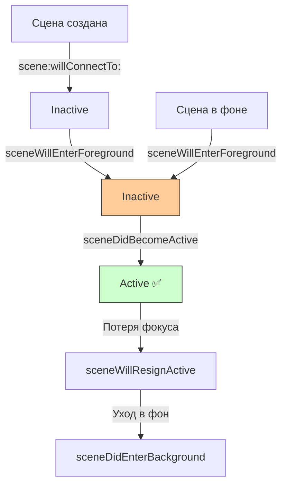
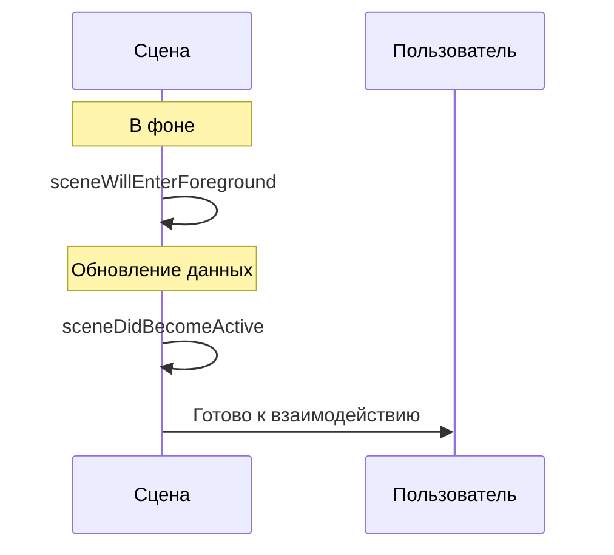

## sceneDidBecomeActive — Сцена стала активной

---
#ios #scenedelegate #app-lifecycle #scene #ios13 #swift #uikit

---

### Определение

**`sceneDidBecomeActive`** — это метод в [[SceneDelegate]], который вызывается, когда сцена (окно) **становится активной** и готовой к взаимодействию с пользователем. В этот момент сцена находится на переднем плане и получает события от пользователя.

```swift
func sceneDidBecomeActive(_ scene: UIScene) {
    print("✅ sceneDidBecomeActive — сцена активна")
}
```

**Ключевые факты:**
- Вызывается **после** `sceneWillEnterForeground`
- Сцена **видима** и **получает события**
- Аналог `applicationDidBecomeActive` на уровне сцены
- Вызывается при:
  - Первом запуске сцены
  - Возврате сцены из фона
  - Закрытии системных диалогов



---

### Зачем это знать iOS-разработчику?

| Сценарий | Почему это важно |
|---|---|
| **Обновление UI** | Сцена стала видимой — нужно показать актуальные данные |
| **Возобновление анимаций** | Анимации должны продолжаться |
| **Возобновление таймеров** | Таймеры, остановленные в фоне, нужно перезапустить |
| **Проверка авторизации** | Токен мог устареть, пока сцена была в фоне |
| **Аналитика** | Отслеживание активного использования |
| **Обновление виджетов** | Синхронизация с виджетами |

---

### Полный пример использования

```swift
import UIKit

class SceneDelegate: UIResponder, UIWindowSceneDelegate {
    
    var window: UIWindow?
    
    // MARK: - Scene Lifecycle
    func sceneDidBecomeActive(_ scene: UIScene) {
        print("✅ sceneDidBecomeActive")
        print("   Scene: \(scene.session.persistentIdentifier)")
        
        // 1. Обновление данных
        refreshDataIfNeeded()
        
        // 2. Проверка авторизации
        checkAuthStatus()
        
        // 3. Возобновление анимаций
        resumeAnimations()
        
        // 4. Возобновление таймеров
        resumeTimers()
        
        // 5. Обновление виджетов
        updateWidgets()
        
        // 6. Аналитика
        trackSessionStart()
        
        // 7. Проверка наличия глубоких ссылок (отложенных)
        checkPendingDeepLinks()
        
        // 8. Уведомление об активности
        NotificationCenter.default.post(name: .sceneDidBecomeActive, object: nil)
    }
    
    func sceneWillResignActive(_ scene: UIScene) {
        print("⚠️ sceneWillResignActive")
        
        // Пауза анимаций и таймеров
        pauseAnimations()
        pauseTimers()
        
        // Сохранение состояния
        saveSceneState()
        
        // Аналитика
        trackSessionEnd()
    }
    
    // MARK: - Data Refresh
    private func refreshDataIfNeeded() {
        let lastRefresh = UserDefaults.standard.object(forKey: "lastDataRefresh") as? Date ?? .distantPast
        let refreshInterval: TimeInterval = 60 // 1 минута
        
        if Date().timeIntervalSince(lastRefresh) > refreshInterval {
            print("🔄 Refreshing data")
            
            Task {
                await fetchRemoteData()
                UserDefaults.standard.set(Date(), forKey: "lastDataRefresh")
                
                await MainActor.run {
                    NotificationCenter.default.post(name: .dataDidUpdate, object: nil)
                }
            }
        }
    }
    
    private func fetchRemoteData() async {
        // Имитация сетевого запроса
        try? await Task.sleep(nanoseconds: 1_000_000_000)
        print("📡 Remote data fetched")
    }
    
    // MARK: - Auth
    private func checkAuthStatus() {
        guard let token = AuthManager.shared.token else {
            print("🔐 No token, need login")
            showLoginScreen()
            return
        }
        
        Task {
            let isValid = await AuthManager.shared.validateToken(token)
            
            await MainActor.run {
                if !isValid {
                    showLoginScreen()
                } else {
                    print("✅ Token is valid")
                }
            }
        }
    }
    
    private func showLoginScreen() {
        guard let window = window else { return }
        
        // Показываем экран логина
        let loginVC = LoginViewController()
        window.rootViewController = loginVC
        window.makeKeyAndVisible()
    }
    
    // MARK: - Animations
    private var activeAnimations: [UIViewPropertyAnimator] = []
    
    private func resumeAnimations() {
        for animator in activeAnimations {
            animator.startAnimation()
        }
        print("▶️ Animations resumed (\(activeAnimations.count))")
    }
    
    private func pauseAnimations() {
        for animator in activeAnimations {
            animator.pauseAnimation()
        }
        print("⏸ Animations paused (\(activeAnimations.count))")
    }
    
    // MARK: - Timers
    private var activeTimers: [Timer] = []
    
    private func resumeTimers() {
        for timer in activeTimers {
            timer.fire()
        }
        print("▶️ Timers resumed (\(activeTimers.count))")
    }
    
    private func pauseTimers() {
        for timer in activeTimers {
            timer.invalidate()
        }
        activeTimers.removeAll()
        print("⏸ Timers paused")
    }
    
    // MARK: - Widgets
    private func updateWidgets() {
        if #available(iOS 14.0, *) {
            WidgetCenter.shared.reloadAllTimelines()
            print("📱 Widgets refreshed")
        }
    }
    
    // MARK: - Analytics
    private var sessionStartTime: Date?
    
    private func trackSessionStart() {
        sessionStartTime = Date()
        AnalyticsManager.shared.track(event: "scene_session_start", parameters: [
            "scene_id": window?.windowScene?.session.persistentIdentifier ?? "unknown"
        ])
        print("📊 Scene session started")
    }
    
    private func trackSessionEnd() {
        guard let startTime = sessionStartTime else { return }
        
        let duration = Date().timeIntervalSince(startTime)
        AnalyticsManager.shared.track(event: "scene_session_end", parameters: [
            "duration": duration,
            "scene_id": window?.windowScene?.session.persistentIdentifier ?? "unknown"
        ])
        
        print("📊 Scene session ended (duration: \(String(format: "%.1f", duration))s)")
    }
    
    // MARK: - Deep Links
    private var pendingDeepLink: URL?
    
    private func checkPendingDeepLinks() {
        guard let url = pendingDeepLink else { return }
        
        print("🔗 Processing pending deep link: \(url)")
        handleDeepLink(url)
        pendingDeepLink = nil
    }
    
    private func handleDeepLink(_ url: URL) {
        NotificationCenter.default.post(name: .deepLinkReceived, object: url)
    }
    
    // MARK: - State
    private func saveSceneState() {
        guard let navigationController = window?.rootViewController as? UINavigationController else { return }
        
        let state = SceneState(
            viewControllers: navigationController.viewControllers.map { String(describing: type(of: $0)) },
            selectedIndex: (window?.rootViewController as? UITabBarController)?.selectedIndex ?? 0
        )
        
        if let data = try? JSONEncoder().encode(state) {
            UserDefaults.standard.set(data, forKey: "sceneState_\(window?.windowScene?.session.persistentIdentifier ?? "")")
        }
        
        print("💾 Scene state saved")
    }
}

// MARK: - Notifications
extension Notification.Name {
    static let sceneDidBecomeActive = Notification.Name("sceneDidBecomeActive")
    static let dataDidUpdate = Notification.Name("dataDidUpdate")
    static let deepLinkReceived = Notification.Name("deepLinkReceived")
}

// MARK: - Models
struct SceneState: Codable {
    let viewControllers: [String]
    let selectedIndex: Int
}
```

---

### Различия между sceneDidBecomeActive и [[sceneWillEnterForeground]]

| Аспект | `sceneWillEnterForeground` | `sceneDidBecomeActive` |
|---|---|---|
| **Вызывается** | При возврате из фона | При активации сцены |
| **Состояние** | Inactive → Foreground | Inactive → Active |
| **Получает события** | Нет | Да |
| **Анимации** | Ещё не запущены | Уже запущены |
| **Что делать** | Обновление данных | Запуск анимаций, аналитика |



---

### Сравнение с AppDelegate

| Аспект                   | `applicationDidBecomeActive` | `sceneDidBecomeActive`    |
| ------------------------ | ---------------------------- | ------------------------- |
| **iOS версия**           | Всегда                       | [[iOS]] 13+               |
| **Вызывается**           | Для всего приложения         | Для каждой сцены отдельно |
| **Использование**        | Глобальная аналитика         | UI-логика для сцены       |
| **iPad многозадачность** | 1 раз                        | Для каждого окна          |

```swift
// AppDelegate — глобальная аналитика
@main
class AppDelegate: UIResponder, UIApplicationDelegate {
    func applicationDidBecomeActive(_ application: UIApplication) {
        // Глобальная аналитика
        AnalyticsManager.shared.track(event: "app_became_active")
    }
}

// SceneDelegate — UI-логика для сцены
class SceneDelegate: UIResponder, UIWindowSceneDelegate {
    func sceneDidBecomeActive(_ scene: UIScene) {
        // Обновление UI для конкретной сцены
        refreshUIIfNeeded()
    }
}
```

---

### Поддержка нескольких сцен на iPad

```swift
class SceneDelegate: UIResponder, UIWindowSceneDelegate {
    
    var window: UIWindow?
    
    func sceneDidBecomeActive(_ scene: UIScene) {
        print("✅ sceneDidBecomeActive for scene: \(scene.session.persistentIdentifier)")
        
        // Каждая сцена (окно) обрабатывается отдельно
        updateBadgeCount()
        refreshSceneContent()
    }
    
    private func updateBadgeCount() {
        // Обновление бейджа на иконке приложения
        // Делается через UIApplication.shared, не зависит от сцены
        let totalUnread = getTotalUnreadCount()
        UIApplication.shared.applicationIconBadgeNumber = totalUnread
    }
    
    private func refreshSceneContent() {
        guard let rootVC = window?.rootViewController as? Refreshable else { return }
        rootVC.refreshData()
    }
}

protocol Refreshable {
    func refreshData()
}
```

---

### Распространённые ошибки

#### 1. Тяжёлые синхронные операции

```swift
// ❌ Плохо — блокирует UI
func sceneDidBecomeActive(_ scene: UIScene) {
    let data = loadLargeDataFromDisk()  // Синхронно
    updateUI(with: data)
}

// ✅ Хорошо — асинхронно
func sceneDidBecomeActive(_ scene: UIScene) {
    Task {
        let data = await loadLargeDataFromDiskAsync()
        await MainActor.run {
            updateUI(with: data)
        }
    }
}
```

#### 2. Игнорирование паузы анимаций

```swift
// ❌ Плохо — анимации не приостанавливаются в фоне
class AnimatedViewController: UIViewController {
    override func viewDidLoad() {
        super.viewDidLoad()
        startAnimation()  // Анимация не остановится в фоне
    }
}

// ✅ Хорошо — приостанавливаем и возобновляем
class AnimatedViewController: UIViewController {
    
    override func viewDidLoad() {
        super.viewDidLoad()
        setupNotifications()
        startAnimation()
    }
    
    private func setupNotifications() {
        NotificationCenter.default.addObserver(
            self,
            selector: #selector(pauseAnimation),
            name: UIApplication.willResignActiveNotification,
            object: nil
        )
        NotificationCenter.default.addObserver(
            self,
            selector: #selector(resumeAnimation),
            name: UIApplication.didBecomeActiveNotification,
            object: nil
        )
    }
    
    @objc private func pauseAnimation() { animator?.pauseAnimation() }
    @objc private func resumeAnimation() { animator?.startAnimation() }
}
```

#### 3. Несколько вызовов сцены

```swift
// ❌ Плохо — данные обновляются при каждой активации каждой сцены
func sceneDidBecomeActive(_ scene: UIScene) {
    refreshAllData()  // Может вызываться много раз на iPad
}

// ✅ Хорошо — проверяем, нужно ли обновлять
func sceneDidBecomeActive(_ scene: UIScene) {
    let lastRefresh = getLastRefreshTime()
    if Date().timeIntervalSince(lastRefresh) > refreshInterval {
        refreshAllData()
    }
}
```

---

### Лучшие практики (2026)

| Практика | Почему |
|---|---|
| **Обновляйте данные только если устарели** | Экономия трафика и батареи |
| **Используйте асинхронные операции** | Не блокируйте UI |
| **Возобновляйте анимации и таймеры** | Пользователь ожидает непрерывности |
| **Проверяйте авторизацию** | Токен мог устареть |
| **Обновляйте виджеты** | Синхронизация данных |
| **Для iPad учитывайте несколько сцен** | Каждая сцена обрабатывается отдельно |
| **Не делайте тяжёлых синхронных операций** | sceneDidBecomeActive должен быть быстрым |

---

### Короткое правило

> **`sceneDidBecomeActive`** = сцена стала активной и видимой.  
> **Обнови данные** (если устарели).  
> **Проверь токен** (мог устареть).  
> **Возобнови анимации и таймеры**.  
> **Не блокируй UI** — используй async/await.  
> **Для iPad учитывай несколько сцен**.

---

### Итог

**`sceneDidBecomeActive`** — ключевой метод для возобновления работы сцены:

| Аспект | Значение |
|---|---|
| **Вызывается** | При активации сцены (первый запуск, возврат из фона) |
| **Где находится** | SceneDelegate (iOS 13+) |
| **Состояние** | Active |
| **Назначение** | Обновление данных, проверка авторизации, возобновление анимаций |
| **Не делать** | Тяжёлые синхронные операции |
| **Обязательно** | Возобновлять анимации и таймеры |
| **Альтернатива** | `applicationDidBecomeActive` (глобальный уровень) |

**Главное правило:**
> При активации сцены всегда проверяй, не устарели ли данные, и валиден ли токен авторизации. Используй асинхронные операции, чтобы не блокировать UI. Возобновляй анимации и таймеры, остановленные в фоне. На iPad с многозадачностью учитывай, что `sceneDidBecomeActive` вызывается для каждого окна отдельно. Глобальную аналитику оставляй в `applicationDidBecomeActive`. Для виджетов вызывай `WidgetCenter.shared.reloadAllTimelines()`. Отложенные глубокие ссылки обрабатывай после активации сцены. Не делай тяжёлых синхронных операций — это ухудшает пользовательский опыт. Используй async/await и Combine для современной обработки асинхронных операций. Помни, что `sceneDidBecomeActive` может вызываться часто (например, при закрытии системных диалогов), поэтому операции должны быть быстрыми или кешированными.