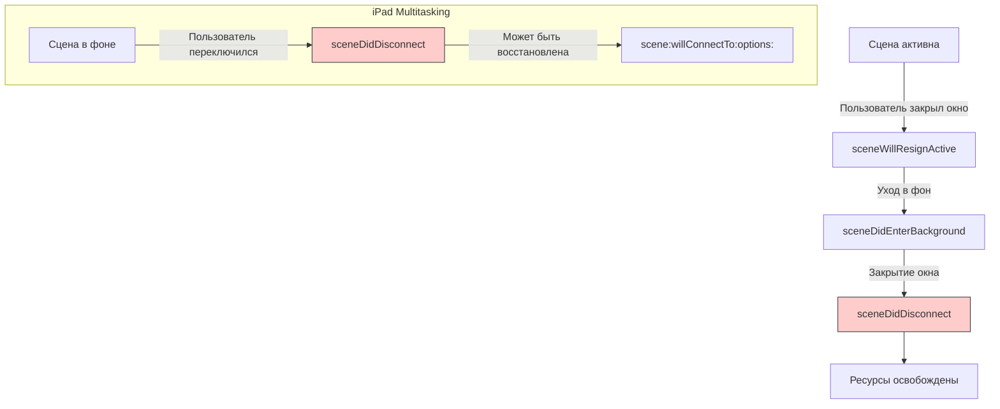
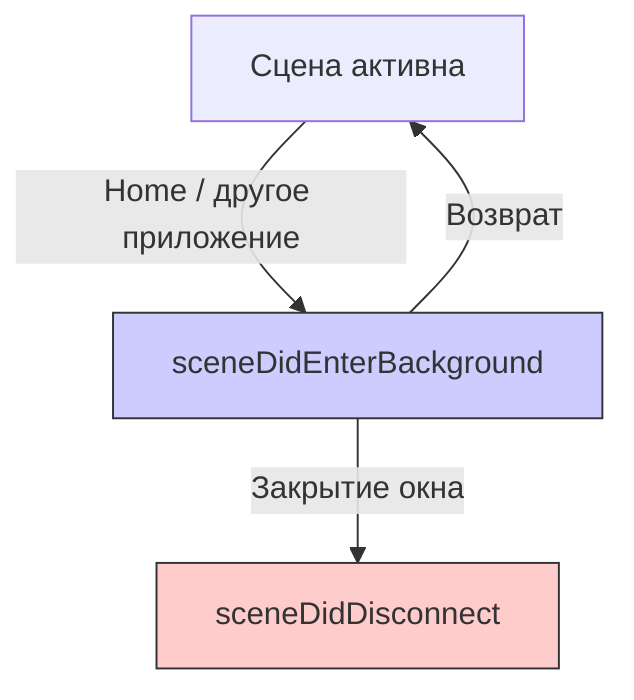

## sceneDidDisconnect — Сцена отключена (iPad Multitasking)

---
#ios #scenedelegate #scene #ipad #multitasking #ios13 #swift #uikit

---

### Определение

**`sceneDidDisconnect`** — это метод в [[SceneDelegate]], который вызывается, когда сцена (окно) **отключается от приложения**. Это происходит, когда пользователь закрывает окно в iPad Multitasking (Stage Manager, Split View, Slide Over) или когда система освобождает ресурсы.

```swift
func sceneDidDisconnect(_ scene: UIScene) {
    print("🔌 sceneDidDisconnect — сцена отключена")
    print("   Scene: \(scene.session.persistentIdentifier)")
}
```

**Ключевые факты:**
- Вызывается **только на iPad** (поддержка многозадачности)
- Сцена **может быть восстановлена** позже через `scene(_:willConnectTo:options:)`
- Аналог `deinit` для сцены
- Отличное место для **освобождения ресурсов** и **сохранения состояния**



---

### Зачем это знать iOS-разработчику?

| Сценарий | Почему это важно |
|---|---|
| **iPad Multitasking** | Пользователь закрыл окно в Stage Manager или Split View |
| **Освобождение ресурсов** | Очистка кэшей, закрытие соединений |
| **Сохранение состояния** | Чтобы восстановить окно при повторном открытии |
| **Аналитика** | Отслеживание закрытия окон |
| **Отписка от уведомлений** | Предотвращение утечек памяти |
| **Остановка фоновых задач** | Прекращение невидимых процессов |

---

### Полный пример использования

```swift
import UIKit

class SceneDelegate: UIResponder, UIWindowSceneDelegate {
    
    var window: UIWindow?
    
    // MARK: - Scene Lifecycle
    func sceneDidDisconnect(_ scene: UIScene) {
        print("🔌 sceneDidDisconnect")
        print("   Scene identifier: \(scene.session.persistentIdentifier)")
        print("   Configuration: \(scene.session.configuration.name ?? "default")")
        
        // 1. Сохранение состояния сцены
        saveSceneState()
        
        // 2. Освобождение ресурсов
        cleanupResources()
        
        // 3. Остановка фоновых задач
        cancelBackgroundTasks()
        
        // 4. Отписка от уведомлений
        removeObservers()
        
        // 5. Аналитика
        trackSceneDisconnection()
    }
    
    func scene(_ scene: UIScene, willConnectTo session: UISceneSession, options connectionOptions: UIScene.ConnectionOptions) {
        print("🔗 scene(_:willConnectTo:options:)")
        
        guard let windowScene = scene as? UIWindowScene else { return }
        
        let window = UIWindow(windowScene: windowScene)
        
        // Восстановление состояния сцены
        let rootViewController = restoreSceneState(for: session) ?? MainViewController()
        
        window.rootViewController = rootViewController
        window.makeKeyAndVisible()
        self.window = window
        
        // Обработка опций запуска
        handleLaunchOptions(connectionOptions)
    }
    
    // MARK: - State Restoration
    private func saveSceneState() {
        guard let window = window,
              let sceneId = window.windowScene?.session.persistentIdentifier else {
            return
        }
        
        // Сохраняем состояние навигации
        var state: SceneState?
        
        if let navigationController = window.rootViewController as? UINavigationController {
            state = SceneState(
                viewControllers: navigationController.viewControllers.map { String(describing: type(of: $0)) },
                selectedIndex: nil,
                sceneId: sceneId
            )
        } else if let tabBarController = window.rootViewController as? UITabBarController {
            state = SceneState(
                viewControllers: tabBarController.viewControllers?.map { String(describing: type(of: $0)) } ?? [],
                selectedIndex: tabBarController.selectedIndex,
                sceneId: sceneId
            )
        }
        
        if let state = state, let data = try? JSONEncoder().encode(state) {
            UserDefaults.standard.set(data, forKey: "sceneState_\(sceneId)")
            print("💾 Scene state saved for: \(sceneId)")
        }
    }
    
    private func restoreSceneState(for session: UISceneSession) -> UIViewController? {
        let sceneId = session.persistentIdentifier
        
        guard let data = UserDefaults.standard.data(forKey: "sceneState_\(sceneId)"),
              let state = try? JSONDecoder().decode(SceneState.self, from: data) else {
            print("🔄 No saved state for scene: \(sceneId)")
            return nil
        }
        
        print("🔄 Restoring scene state for: \(sceneId)")
        print("   View controllers: \(state.viewControllers)")
        
        // Восстанавливаем навигацию
        if let selectedIndex = state.selectedIndex {
            let tabBarController = UITabBarController()
            tabBarController.selectedIndex = selectedIndex
            return tabBarController
        }
        
        return MainViewController()
    }
    
    // MARK: - Resource Cleanup
    private func cleanupResources() {
        print("🧹 Cleaning up scene resources")
        
        // Очистка кэшей, специфичных для сцены
        ImageCache.shared.clearSceneCache(sceneId: getSceneIdentifier())
        
        // Закрытие соединений WebSocket для этой сцены
        WebSocketManager.shared.disconnectForScene(sceneId: getSceneIdentifier())
        
        // Очистка временных файлов
        clearTemporaryFiles()
        
        // Освобождение больших объектов
        releaseLargeObjects()
    }
    
    private func clearTemporaryFiles() {
        let tempDirectory = FileManager.default.temporaryDirectory
        let sceneId = getSceneIdentifier()
        
        do {
            let files = try FileManager.default.contentsOfDirectory(at: tempDirectory, includingPropertiesForKeys: nil)
            for file in files where file.lastPathComponent.contains(sceneId) {
                try? FileManager.default.removeItem(at: file)
            }
            print("🗑 Temporary files cleared for scene: \(sceneId)")
        } catch {
            print("❌ Failed to clear temp files: \(error)")
        }
    }
    
    private func releaseLargeObjects() {
        // Освобождение больших объектов, привязанных к сцене
        LargeDataManager.shared.releaseForScene(sceneId: getSceneIdentifier())
        print("📦 Large objects released")
    }
    
    // MARK: - Background Tasks
    private func cancelBackgroundTasks() {
        let sceneId = getSceneIdentifier()
        
        // Отмена фоновых задач для этой сцены
        BackgroundTaskManager.shared.cancelTasks(forScene: sceneId)
        print("⏸ Background tasks cancelled for scene: \(sceneId)")
    }
    
    // MARK: - Observers
    private func removeObservers() {
        NotificationCenter.default.removeObserver(self)
        print("👀 Observers removed for scene")
    }
    
    // MARK: - Analytics
    private func trackSceneDisconnection() {
        let sceneId = getSceneIdentifier()
        let duration = getSceneActiveDuration()
        
        AnalyticsManager.shared.track(event: "scene_disconnected", parameters: [
            "scene_id": sceneId,
            "duration": duration,
            "configuration": window?.windowScene?.session.configuration.name ?? "unknown"
        ])
        
        print("📊 Scene disconnection tracked (duration: \(String(format: "%.1f", duration))s)")
    }
    
    // MARK: - Helpers
    private func getSceneIdentifier() -> String {
        return window?.windowScene?.session.persistentIdentifier ?? "unknown"
    }
    
    private func getSceneActiveDuration() -> TimeInterval {
        let startTime = UserDefaults.standard.object(forKey: "sceneStartTime_\(getSceneIdentifier())") as? Date ?? Date()
        return Date().timeIntervalSince(startTime)
    }
    
    // MARK: - Launch Options
    private func handleLaunchOptions(_ options: UIScene.ConnectionOptions) {
        if let urlContext = options.urlContexts.first {
            handleDeepLink(urlContext.url)
        }
        if let userActivity = options.userActivities.first {
            handleUserActivity(userActivity)
        }
    }
    
    private func handleDeepLink(_ url: URL) {
        print("🔗 Deep link in restored scene: \(url)")
        NotificationCenter.default.post(name: .deepLinkReceived, object: url)
    }
    
    private func handleUserActivity(_ activity: NSUserActivity) {
        print("📱 User activity in restored scene: \(activity.activityType)")
        NotificationCenter.default.post(name: .userActivityReceived, object: activity)
    }
}

// MARK: - Models
struct SceneState: Codable {
    let viewControllers: [String]
    let selectedIndex: Int?
    let sceneId: String
}

// MARK: - Notifications
extension Notification.Name {
    static let deepLinkReceived = Notification.Name("deepLinkReceived")
    static let userActivityReceived = Notification.Name("userActivityReceived")
}

// MARK: - Scene-Specific Managers
class ImageCache {
    static let shared = ImageCache()
    private var sceneCaches: [String: NSCache<NSString, UIImage>] = [:]
    
    func clearSceneCache(sceneId: String) {
        sceneCaches[sceneId]?.removeAllObjects()
        sceneCaches.removeValue(forKey: sceneId)
    }
}

class BackgroundTaskManager {
    static let shared = BackgroundTaskManager()
    private var sceneTasks: [String: UIBackgroundTaskIdentifier] = [:]
    
    func cancelTasks(forScene sceneId: String) {
        guard let taskId = sceneTasks[sceneId] else { return }
        UIApplication.shared.endBackgroundTask(taskId)
        sceneTasks.removeValue(forKey: sceneId)
    }
}

class LargeDataManager {
    static let shared = LargeDataManager()
    private var sceneData: [String: Data] = [:]
    
    func releaseForScene(sceneId: String) {
        sceneData[sceneId] = nil
    }
}
```

---

### Сценарии использования на iPad

#### 1. Stage Manager (iPadOS 16+)

```swift
func sceneDidDisconnect(_ scene: UIScene) {
    print("🔌 Stage Manager window closed")
    
    // Сохраняем размер и позицию окна
    if let windowScene = scene as? UIWindowScene {
        let frame = windowScene.screen.bounds
        saveWindowFrame(frame, for: scene.session.persistentIdentifier)
    }
}
```

#### 2. Split View

```swift
func sceneDidDisconnect(_ scene: UIScene) {
    print("🔌 Split View window closed")
    
    // Сохраняем, какая вкладка была активна
    if let tabBarController = window?.rootViewController as? UITabBarController {
        saveSelectedTab(tabBarController.selectedIndex, for: scene.session.persistentIdentifier)
    }
}
```

#### 3. Slide Over

```swift
func sceneDidDisconnect(_ scene: UIScene) {
    print("🔌 Slide Over window closed")
    
    // Slide Over окна часто открываются и закрываются
    // Сохраняем только критичное состояние
    saveCriticalStateOnly()
}
```

---

### Различия между sceneDidDisconnect и [[sceneDidEnterBackground]]

| Аспект | `sceneDidEnterBackground` | `sceneDidDisconnect` |
|---|---|---|
| **Вызывается** | При уходе в фон | При закрытии окна |
| **iPad Multitasking** | ✅ Да | ✅ Да (только при закрытии) |
| **iPhone** | ✅ Да | ❌ Нет |
| **Восстановление** | ✅ Всегда | ⚠️ Может быть |
| **Освобождение ресурсов** | ⚠️ Частично | ✅ Полное |



---

### Поддержка нескольких сцен

```swift
class SceneDelegate: UIResponder, UIWindowSceneDelegate {
    
    var window: UIWindow?
    private var sceneId: String = ""
    
    func scene(_ scene: UIScene, willConnectTo session: UISceneSession, options connectionOptions: UIScene.ConnectionOptions) {
        sceneId = session.persistentIdentifier
        print("🔗 Scene connected: \(sceneId)")
        
        // Регистрируем сцену в менеджере
        SceneManager.shared.registerScene(sceneId, delegate: self)
        
        // Настройка UI...
    }
    
    func sceneDidDisconnect(_ scene: UIScene) {
        print("🔌 Scene disconnected: \(sceneId)")
        
        // Дерегистрируем сцену
        SceneManager.shared.unregisterScene(sceneId)
        
        // Если это была последняя сцена — освобождаем глобальные ресурсы
        if SceneManager.shared.activeSceneCount == 0 {
            cleanupGlobalResources()
        }
    }
}

class SceneManager {
    static let shared = SceneManager()
    private var activeScenes: [String: SceneDelegate] = [:]
    
    var activeSceneCount: Int { activeScenes.count }
    
    func registerScene(_ id: String, delegate: SceneDelegate) {
        activeScenes[id] = delegate
        print("📱 Active scenes: \(activeSceneCount)")
    }
    
    func unregisterScene(_ id: String) {
        activeScenes.removeValue(forKey: id)
        print("📱 Active scenes: \(activeSceneCount)")
    }
}
```

---

### Распространённые ошибки

#### 1. Не сохраняется состояние

```swift
// ❌ Плохо — состояние теряется
func sceneDidDisconnect(_ scene: UIScene) {
    print("Scene disconnected")  // Ничего не сохраняем
}

// ✅ Хорошо — сохраняем состояние
func sceneDidDisconnect(_ scene: UIScene) {
    saveSceneState()
    saveNavigationStack()
    saveUserInput()
}
```

#### 2. Утечки памяти

```swift
// ❌ Плохо — не освобождаем ресурсы
func sceneDidDisconnect(_ scene: UIScene) {
    // Ничего не делаем
}

// ✅ Хорошо — освобождаем
func sceneDidDisconnect(_ scene: UIScene) {
    NotificationCenter.default.removeObserver(self)
    timer?.invalidate()
    imageCache.removeAllObjects()
}
```

#### 3. Долгие операции

```swift
// ❌ Плохо — блокирует
func sceneDidDisconnect(_ scene: UIScene) {
    Thread.sleep(forTimeInterval: 5)  // Не делайте так!
    saveLargeData()
}

// ✅ Хорошо — асинхронно с фоновой задачей
func sceneDidDisconnect(_ scene: UIScene) {
    let taskId = UIApplication.shared.beginBackgroundTask {
        // Завершаем
    }
    
    DispatchQueue.global().async {
        saveLargeData()
        UIApplication.shared.endBackgroundTask(taskId)
    }
}
```

---

### Лучшие практики (2026)

| Практика | Почему |
|---|---|
| **Сохраняйте состояние сцены** | Для восстановления при повторном открытии |
| **Освобождайте ресурсы** | Предотвращение утечек памяти |
| **Используйте фоновые задачи для долгих операций** | Приложение может быть убито |
| **Отписывайтесь от уведомлений** | Утечки памяти |
| **Отменяйте сетевые запросы** | Экономия трафика |
| **Очищайте кэши** | Экономия памяти |
| **Не делайте синхронных тяжёлых операций** | Не блокируйте |

---

### Короткое правило

> **`sceneDidDisconnect`** = сцена закрыта (только iPad).  
> **Сохрани состояние** (чтобы восстановить).  
> **Освободи ресурсы** (кэши, соединения, таймеры).  
> **Отпишись от уведомлений**.  
> **Не блокируй** — используй фоновые задачи.

---

### Итог

**`sceneDidDisconnect`** — важный метод для управления ресурсами на iPad:

| Аспект | Значение |
|---|---|
| **Вызывается** | При закрытии окна (только iPad Multitasking) |
| **Где находится** | SceneDelegate (iOS 13+) |
| **Назначение** | Сохранение состояния, освобождение ресурсов |
| **Обязательно** | Сохранять состояние, отписываться от уведомлений |
| **Не делать** | Долгие синхронные операции |
| **Аналог** | `deinit` для сцены |

**Главное правило:**
> В `sceneDidDisconnect` сохраняй состояние сцены (навигацию, позиции скролла, введённые данные) — это последний шанс перед удалением окна. Освобождай все ресурсы, специфичные для сцены: кэши, WebSocket-соединения, таймеры. Отписывайся от уведомлений, чтобы избежать утечек памяти. Не делай синхронных долгих операций — используй фоновые задачи с `beginBackgroundTask`. Помни, что этот метод вызывается только на iPad при закрытии окна (Split View, Slide Over, Stage Manager). На iPhone этот метод не вызывается, так как закрытие приложения происходит через `sceneDidEnterBackground`. Восстанавливай состояние в `scene(_:willConnectTo:options:)`. Отслеживай количество активных сцен через менеджер сцен для глобальной очистки, когда закрывается последнее окно. Для SwiftUI этот метод автоматически управляется фреймворком. Всегда проверяй, не был ли уже освобождён `window` перед доступом к нему. Используй осмысленные идентификаторы сцен для сохранения состояния. Тестируй на iPad с разными режимами многозадачности. Помни, что сцена может быть восстановлена позже, поэтому сохраняй достаточно информации для полноценного восстановления пользовательского интерфейса. Не храни сильные ссылки на сцену в глобальных объектах — это предотвратит её освобождение. Используй слабые ссылки для делегатов и наблюдателей. Для аналитики передавай идентификатор сцены, чтобы различать события от разных окон. При освобождении ресурсов не затрагивай глобальные объекты, которые могут использоваться другими сценами. Используй `UserDefaults` или файловую систему для сохранения состояния — Core Data может быть слишком тяжёлой. Для больших объёмов данных сохраняй только идентификаторы, а полные данные загружай заново при восстановлении. После вызова `sceneDidDisconnect` не обращайся к `window` и его свойствам — они могут быть уже освобождены. Используйте `assert` в `deinit` для проверки корректного освобождения ресурсов. При закрытии последней сцены можно выполнить глобальную очистку: сбросить глобальные кэши, закрыть постоянные соединения, отправить финальную аналитику. Не полагайся на `applicationWillTerminate` — он не вызывается при закрытии отдельных окон. Для отладки используй логирование с идентификатором сцены, чтобы понимать, какое окно было закрыто. Всегда предполагай, что сцена может быть восстановлена, поэтому не удаляй глобальные данные, которые могут понадобиться другим сценам. Используй слабые ссылки на сцену в замыканиях, чтобы избежать retain cycles. Для длительных операций (сохранение большого объёма данных) используй фоновые задачи с `beginBackgroundTask` и `endBackgroundTask`. Не вызывай `sleep` или другие блокирующие операции — это может привести к тому, что система убьёт приложение до завершения сохранения. При работе с файлами используй атомарные операции, чтобы избежать повреждения данных при неожиданном завершении. Для критичных данных дублируй сохранение в `sceneDidEnterBackground` — он вызывается надёжнее. После восстановления сцены проверяй, не изменились ли глобальные данные (например, токен авторизации), и обновляй UI соответственно. Используйте `defer` для гарантии освобождения ресурсов. Для SceneKit, Metal или других графических фреймворков обязательно останавливай рендеринг перед отключением сцены. При работе с камерой или микрофоном освобождай их при отключении сцены, чтобы другие окна могли их использовать.