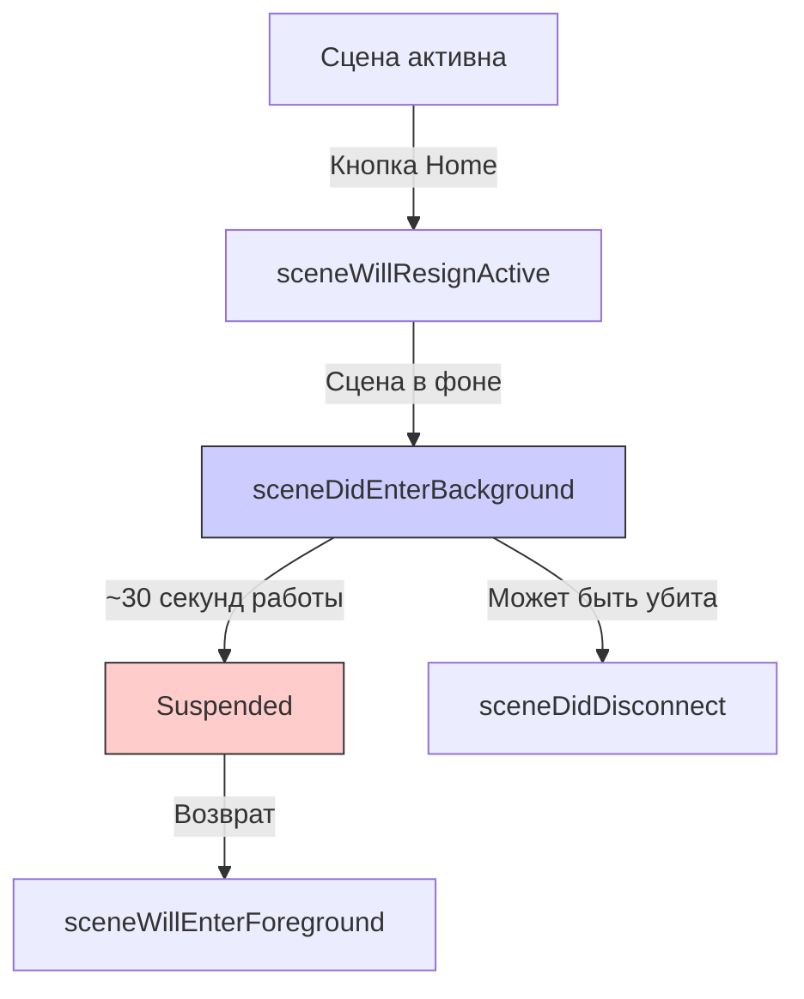

## sceneDidEnterBackground — Сцена перешла в фоновый режим

---

### Теги
`#ios` `#scenedelegate` `#app-lifecycle` `#background` `#scene` `#ios13` `#swift` `#uikit`

---

### Определение

**`sceneDidEnterBackground`** — это метод в `SceneDelegate`, который вызывается, когда сцена (окно) **переходит в фоновый режим**. Это происходит, когда пользователь сворачивает приложение (нажимает Home) или переключается на другое приложение. Сцена становится невидимой и перестаёт получать события от пользователя.

```swift
func sceneDidEnterBackground(_ scene: UIScene) {
    print("⏸ sceneDidEnterBackground — сцена ушла в фон")
    print("   Scene: \(scene.session.persistentIdentifier)")
}
```

**Ключевые факты:**
- Вызывается **после** `sceneWillResignActive`
- Сцена **не видима**, но может выполнять ограниченный код (~30 секунд)
- Аналог `applicationDidEnterBackground` на уровне сцены
- Вызывается на **iPhone и iPad**



---

### Зачем это знать iOS-разработчику?

| Сценарий | Почему это важно |
|---|---|
| **Сохранение состояния** | Пользователь ожидает, что при возврате всё будет на своих местах |
| **Остановка анимаций** | Экономия ресурсов и батареи |
| **Остановка таймеров** | Не нужно обновлять UI в фоне |
| **Завершение сетевых запросов** | Экономия трафика |
| **Сохранение пользовательских данных** | Тексты, позиции скролла, состояние форм |
| **Отправка аналитики** | Фиксация окончания сессии |
| **Освобождение ресурсов** | Кэши, большие объекты |

---

### Полный пример использования

```swift
import UIKit

class SceneDelegate: UIResponder, UIWindowSceneDelegate {
    
    var window: UIWindow?
    private var backgroundTaskId: UIBackgroundTaskIdentifier = .invalid
    
    // MARK: - Scene Lifecycle
    func sceneDidEnterBackground(_ scene: UIScene) {
        print("⏸ sceneDidEnterBackground")
        print("   Scene identifier: \(scene.session.persistentIdentifier)")
        print("   Configuration: \(scene.session.configuration.name ?? "default")")
        
        // 1. Начинаем фоновую задачу
        startBackgroundTask()
        
        // 2. Сохраняем состояние сцены
        saveSceneState()
        
        // 3. Завершаем операции
        completePendingOperations()
        
        // 4. Отправляем аналитику
        flushAnalytics()
        
        // 5. Освобождаем ресурсы
        freeMemoryResources()
        
        // 6. Завершаем фоновую задачу
        endBackgroundTask()
    }
    
    func sceneWillEnterForeground(_ scene: UIScene) {
        print("🔄 sceneWillEnterForeground")
        
        // Восстановление данных при возврате
        restoreSceneState()
        refreshData()
    }
    
    // MARK: - Background Task
    private func startBackgroundTask() {
        backgroundTaskId = UIApplication.shared.beginBackgroundTask { [weak self] in
            print("⏰ Background task expired for scene")
            self?.endBackgroundTask()
        }
        print("📱 Background task started: \(backgroundTaskId.rawValue)")
    }
    
    private func endBackgroundTask() {
        guard backgroundTaskId != .invalid else { return }
        
        UIApplication.shared.endBackgroundTask(backgroundTaskId)
        print("✅ Background task ended: \(backgroundTaskId.rawValue)")
        backgroundTaskId = .invalid
    }
    
    // MARK: - State Management
    private func saveSceneState() {
        let sceneId = getSceneIdentifier()
        
        guard let navigationController = window?.rootViewController as? UINavigationController else {
            print("⚠️ Cannot save state: no navigation controller")
            return
        }
        
        let state = SceneState(
            timestamp: Date(),
            viewControllers: navigationController.viewControllers.map { String(describing: type(of: $0)) },
            scrollPositions: getScrollPositions(),
            selectedTab: (window?.rootViewController as? UITabBarController)?.selectedIndex ?? 0,
            sceneId: sceneId
        )
        
        if let data = try? JSONEncoder().encode(state) {
            UserDefaults.standard.set(data, forKey: "sceneState_\(sceneId)")
            UserDefaults.standard.synchronize()
            print("💾 Scene state saved for: \(sceneId)")
        }
    }
    
    private func restoreSceneState() {
        let sceneId = getSceneIdentifier()
        
        guard let data = UserDefaults.standard.data(forKey: "sceneState_\(sceneId)"),
              let state = try? JSONDecoder().decode(SceneState.self, from: data) else {
            print("🔄 No saved state for scene: \(sceneId)")
            return
        }
        
        print("🔄 Restoring scene state from \(state.timestamp)")
        restoreScrollPositions(state.scrollPositions)
        
        // Восстановление вкладки
        if let tabBarController = window?.rootViewController as? UITabBarController {
            tabBarController.selectedIndex = state.selectedTab
        }
    }
    
    // MARK: - Operations
    private func completePendingOperations() {
        let group = DispatchGroup()
        
        // Сохранение в Core Data
        group.enter()
        CoreDataManager.shared.saveContext { group.leave() }
        
        // Завершение сетевых запросов
        group.enter()
        NetworkQueue.shared.completePendingRequests { group.leave() }
        
        // Запись в файлы
        group.enter()
        FileManager.shared.flushWrites { group.leave() }
        
        // Ждём завершения с таймаутом
        let result = group.wait(timeout: .now() + 25)
        if result == .timedOut {
            print("⚠️ Some operations timed out")
        } else {
            print("✅ All operations completed")
        }
    }
    
    // MARK: - Analytics
    private var sessionStartTime: Date?
    
    private func flushAnalytics() {
        guard let startTime = sessionStartTime else { return }
        
        let duration = Date().timeIntervalSince(startTime)
        AnalyticsManager.shared.track(event: "scene_session_end", parameters: [
            "duration": duration,
            "scene_id": getSceneIdentifier(),
            "configuration": window?.windowScene?.session.configuration.name ?? "unknown"
        ])
        
        AnalyticsManager.shared.flush()
        print("📊 Analytics flushed (duration: \(String(format: "%.1f", duration))s)")
    }
    
    func sceneDidBecomeActive(_ scene: UIScene) {
        sessionStartTime = Date()
        AnalyticsManager.shared.track(event: "scene_session_start", parameters: [
            "scene_id": getSceneIdentifier()
        ])
    }
    
    // MARK: - Memory
    private func freeMemoryResources() {
        print("🧹 Freeing memory resources")
        
        // Очистка кэшей
        ImageCache.shared.clearSceneCache(sceneId: getSceneIdentifier())
        URLCache.shared.removeAllCachedResponses()
        
        // Освобождение больших объектов
        LargeDataManager.shared.releaseForScene(sceneId: getSceneIdentifier())
        
        // Уведомляем систему
        DispatchQueue.global().async {
            URLCache.shared.diskCapacity = 0
            URLCache.shared.memoryCapacity = 0
        }
        
        print("🧹 Memory resources freed")
    }
    
    // MARK: - Helpers
    private func getSceneIdentifier() -> String {
        return window?.windowScene?.session.persistentIdentifier ?? "unknown"
    }
    
    private func getScrollPositions() -> [String: CGFloat] {
        var positions: [String: CGFloat] = [:]
        
        // Сохраняем позиции скролла для всех UITableView/UICollectionView
        if let navigationController = window?.rootViewController as? UINavigationController {
            for viewController in navigationController.viewControllers {
                findScrollViews(in: viewController.view, positions: &positions)
            }
        }
        
        return positions
    }
    
    private func findScrollViews(in view: UIView, positions: inout [String: CGFloat]) {
        if let scrollView = view as? UIScrollView {
            let identifier = "\(type(of: view))_\(view.hash)"
            positions[identifier] = scrollView.contentOffset.y
        }
        
        for subview in view.subviews {
            findScrollViews(in: subview, positions: &positions)
        }
    }
    
    private func restoreScrollPositions(_ positions: [String: CGFloat]) {
        guard let navigationController = window?.rootViewController as? UINavigationController else { return }
        
        for viewController in navigationController.viewControllers {
            restoreScrollPositions(in: viewController.view, positions: positions)
        }
    }
    
    private func restoreScrollPositions(in view: UIView, positions: [String: CGFloat]) {
        if let scrollView = view as? UIScrollView {
            let identifier = "\(type(of: view))_\(view.hash)"
            if let offset = positions[identifier] {
                scrollView.contentOffset.y = offset
            }
        }
        
        for subview in view.subviews {
            restoreScrollPositions(in: subview, positions: positions)
        }
    }
}

// MARK: - Models
struct SceneState: Codable {
    let timestamp: Date
    let viewControllers: [String]
    let scrollPositions: [String: CGFloat]
    let selectedTab: Int
    let sceneId: String
}

// MARK: - Scene-Specific Managers
class ImageCache {
    static let shared = ImageCache()
    private var sceneCaches: [String: NSCache<NSString, UIImage>] = [:]
    
    func clearSceneCache(sceneId: String) {
        sceneCaches[sceneId]?.removeAllObjects()
        sceneCaches.removeValue(forKey: sceneId)
    }
}

class LargeDataManager {
    static let shared = LargeDataManager()
    private var sceneData: [String: Data] = [:]
    
    func releaseForScene(sceneId: String) {
        sceneData[sceneId] = nil
    }
}
```

---

### Различия между applicationDidEnterBackground и sceneDidEnterBackground

| Аспект | `applicationDidEnterBackground` | `sceneDidEnterBackground` |
|---|---|---|
| **Вызывается** | При уходе приложения в фон | При уходе сцены в фон |
| **Количество вызовов** | 1 раз | По числу сцен |
| **Использование** | Глобальное сохранение | UI-логика для сцены |
| **iPad Multitasking** | 1 раз (приложение) | Для каждого окна отдельно |
| **Рекомендация** | Сервисы, аналитика | UI, данные сцены |

```swift
// AppDelegate — глобальная инициализация
@main
class AppDelegate: UIResponder, UIApplicationDelegate {
    func applicationDidEnterBackground(_ application: UIApplication) {
        // Глобальные действия
        WidgetCenter.shared.reloadAllTimelines()
        FirebaseApp.configure()
    }
}

// SceneDelegate — UI-логика для сцены
class SceneDelegate: UIResponder, UIWindowSceneDelegate {
    func sceneDidEnterBackground(_ scene: UIScene) {
        // Сохранение состояния конкретной сцены
        saveSceneState()
        pauseAnimations()
    }
}
```

---

### Поддержка нескольких сцен на iPad

```swift
class SceneDelegate: UIResponder, UIWindowSceneDelegate {
    
    var window: UIWindow?
    
    func sceneDidEnterBackground(_ scene: UIScene) {
        print("⏸ Scene \(scene.session.persistentIdentifier) entered background")
        
        // Каждая сцена (окно) обрабатывается отдельно
        saveSceneData()
        pauseSceneActivities()
        
        // Проверяем, есть ли ещё активные сцены
        if isLastActiveScene() {
            // Это последняя сцена — можно выполнить глобальную очистку
            cleanupGlobalResources()
        }
    }
    
    private func isLastActiveScene() -> Bool {
        let activeScenes = UIApplication.shared.connectedScenes
            .filter { $0.activationState == .foregroundActive || $0.activationState == .foregroundInactive }
        return activeScenes.count <= 1
    }
    
    private func cleanupGlobalResources() {
        print("🧹 Cleaning up global resources (last scene)")
        GlobalCache.shared.clear()
        NetworkQueue.shared.cancelAll()
    }
}
```

---

### Распространённые ошибки

#### 1. Нет фоновой задачи — приложение убито до сохранения

```swift
// ❌ Плохо — приложение может быть убито до сохранения
func sceneDidEnterBackground(_ scene: UIScene) {
    saveData()  // Может не успеть выполниться
}

// ✅ Хорошо — с фоновой задачей
func sceneDidEnterBackground(_ scene: UIScene) {
    let taskId = UIApplication.shared.beginBackgroundTask {
        // Завершаем
    }
    
    saveData()
    UIApplication.shared.endBackgroundTask(taskId)
}
```

#### 2. Долгие синхронные операции

```swift
// ❌ Плохо — блокирует, может не успеть
func sceneDidEnterBackground(_ scene: UIScene) {
    processLargeDatabase()  // Может занять 10+ секунд
}

// ✅ Хорошо — асинхронно с фоновой задачей
func sceneDidEnterBackground(_ scene: UIScene) {
    let taskId = UIApplication.shared.beginBackgroundTask {
        // Завершаем
    }
    
    DispatchQueue.global().async {
        self.processLargeDatabase()
        DispatchQueue.main.async {
            UIApplication.shared.endBackgroundTask(taskId)
        }
    }
}
```

#### 3. Игнорирование сохранения UI-состояния

```swift
// ❌ Плохо — состояние теряется
func sceneDidEnterBackground(_ scene: UIScene) {
    // Ничего не делаем
}

// ✅ Хорошо — сохраняем состояние
func sceneDidEnterBackground(_ scene: UIScene) {
    saveCurrentScreenState()
    saveScrollPositions()
    saveUserInput()
}
```

---

### Лучшие практики (2026)

| Практика | Почему |
|---|---|
| **Используйте фоновые задачи** | Гарантирует выполнение кода |
| **Сохраняйте состояние UI** | Пользователь ожидает непрерывности |
| **Не делайте долгих операций без фоновой задачи** | Приложение может быть убито |
| **Очищайте кэши и ресурсы** | Экономия памяти |
| **Отправляйте аналитику** | Не теряйте события |
| **Используйте async/await** | Современный и безопасный подход |
| **Для iPad учитывайте несколько сцен** | Разделение ответственности |

---

### Короткое правило

> **`sceneDidEnterBackground`** = сцена ушла в фон, есть ~30 секунд на завершение операций.  
> **Сохрани состояние** (тексты, позиции, вкладки).  
> **Заверши операции** (сеть, база данных, файлы).  
> **Отправь аналитику** (не теряй события).  
> **Очисти ресурсы** (кэши, большие объекты).  
> **Используй фоновую задачу** для гарантии выполнения.

---

### Итог

**`sceneDidEnterBackground`** — критически важный метод для сохранения состояния сцены:

| Аспект | Значение |
|---|---|
| **Вызывается** | При уходе сцены в фон |
| **Доступное время** | ~30 секунд (или больше с Background Tasks) |
| **Назначение** | Сохранение состояния, завершение операций, очистка ресурсов |
| **Обязательно** | Использовать фоновую задачу для длительных операций |
| **Не делать** | Долгие синхронные операции без фоновой задачи |
| **Альтернатива** | `applicationDidEnterBackground` (глобальный уровень) |

### Золотое правило

> **`sceneDidEnterBackground` — сохраняй состояние, используй фоновую задачу, не блокируй, не полагайся на `willTerminate`.**