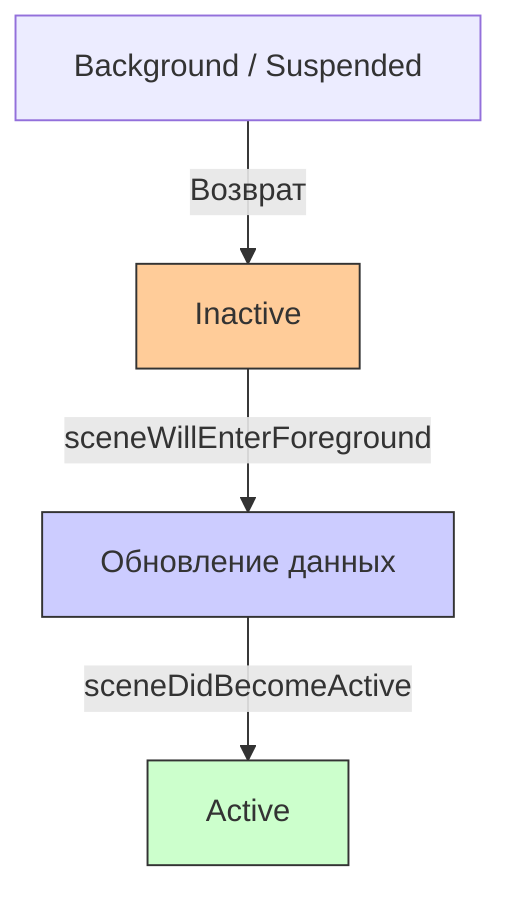
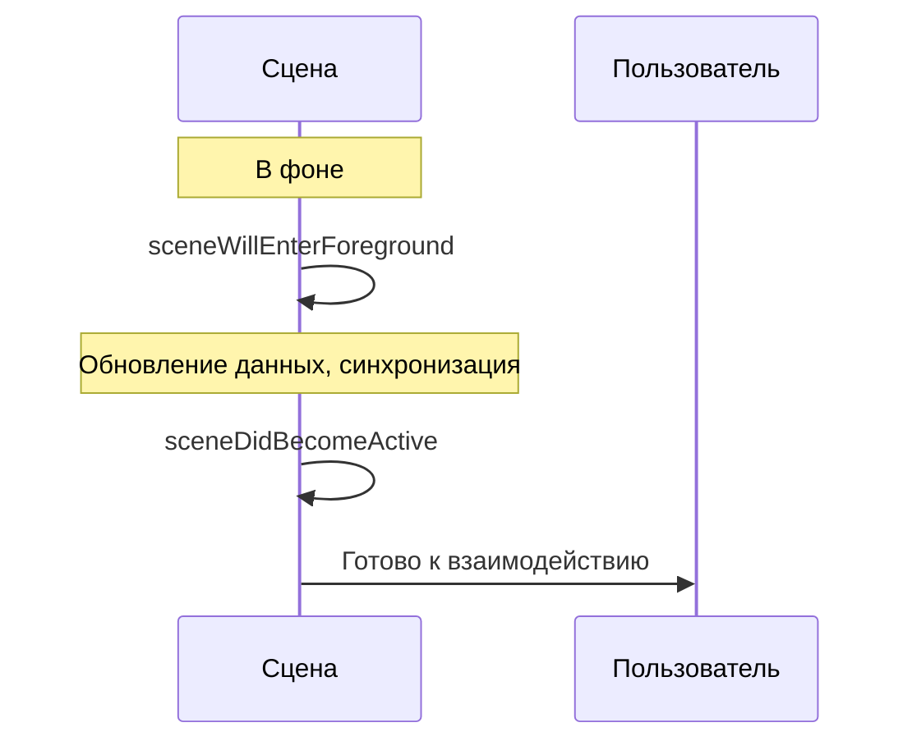

## sceneWillEnterForeground — Сцена возвращается из фона

---
#ios #scenedelegate #app-lifecycle #foreground #background #swift

---

### Определение

**`sceneWillEnterForeground`** — это метод в [[SceneDelegate]], который вызывается, когда сцена (окно) **возвращается из фонового состояния** и собирается стать видимой, но ещё **не активна**. Это происходит после того, как приложение находилось в фоне (Background) или замороженном состоянии (Suspended).

```swift
func sceneWillEnterForeground(_ scene: UIScene) {
    print("🔄 sceneWillEnterForeground — сцена возвращается из фона")
}
```

**Ключевые факты:**
- Вызывается **перед** `sceneDidBecomeActive`
- Сцена становится видимой, но ещё **не активна** (не получает события)
- Идеальное место для **обновления данных**, которые могли устареть в фоне



---

### Зачем это знать iOS-разработчику?

| Сценарий | Почему это важно |
|---|---|
| **Обновление устаревших данных** | Пока приложение было в фоне, данные на сервере могли измениться |
| **Проверка авторизации** | Токен мог устареть, пользователь мог разлогиниться на другом устройстве |
| **Обновление UI** | Экран должен показать актуальную информацию |
| **Синхронизация с сервером** | Получение новых сообщений, уведомлений, обновлений |
| **Обновление виджетов** | Данные виджетов могли устареть |
| **Возобновление анимаций** | Анимации, остановленные в фоне, можно подготовить к показу |

---

### sceneWillEnterForeground vs sceneDidBecomeActive

| Аспект | `sceneWillEnterForeground` | `sceneDidBecomeActive` |
|---|---|---|
| **Вызывается** | При возврате из фона | При активации сцены |
| **Состояние** | Inactive | Active |
| **Получает события** | Нет | Да |
| **Что делать** | Обновлять данные, синхронизацию | Запускать анимации, аналитику |
| **Длительность** | Короткая | Длительная |



---

### Полный пример использования

```swift
import UIKit

class SceneDelegate: UIResponder, UIWindowSceneDelegate {
    
    var window: UIWindow?
    
    // MARK: - Scene Lifecycle
    func sceneWillEnterForeground(_ scene: UIScene) {
        print("🔄 sceneWillEnterForeground")
        print("   Scene: \(scene.session.persistentIdentifier)")
        
        // 1. Обновление данных
        refreshDataIfNeeded()
        
        // 2. Проверка авторизации
        checkAuthStatus()
        
        // 3. Обновление UI (через уведомления)
        NotificationCenter.default.post(name: .refreshUI, object: nil)
        
        // 4. Обновление виджетов
        updateWidgets()
        
        // 5. Возобновление анимаций
        resumeAnimations()
        
        // 6. Аналитика
        trackSessionResume()
    }
    
    func sceneDidEnterBackground(_ scene: UIScene) {
        print("⏸ sceneDidEnterBackground")
        saveAppState()
    }
    
    // MARK: - Data Refresh
    private func refreshDataIfNeeded() {
        let lastRefresh = UserDefaults.standard.object(forKey: "lastDataRefresh") as? Date ?? .distantPast
        let refreshInterval: TimeInterval = 60 // 1 минута
        
        if Date().timeIntervalSince(lastRefresh) > refreshInterval {
            print("🔄 Refreshing data")
            
            Task {
                await fetchRemoteData()
                UserDefaults.standard.set(Date(), forKey: "lastDataRefresh")
                
                await MainActor.run {
                    NotificationCenter.default.post(name: .dataDidUpdate, object: nil)
                }
            }
        }
    }
    
    private func fetchRemoteData() async {
        try? await Task.sleep(nanoseconds: 1_000_000_000)
        print("📡 Remote data fetched")
    }
    
    // MARK: - Auth
    private func checkAuthStatus() {
        guard let token = AuthManager.shared.token else {
            print("🔐 No token, need login")
            showLoginScreen()
            return
        }
        
        Task {
            let isValid = await AuthManager.shared.validateToken(token)
            
            await MainActor.run {
                if !isValid {
                    showLoginScreen()
                } else {
                    print("✅ Token is valid")
                }
            }
        }
    }
    
    private func showLoginScreen() {
        NotificationCenter.default.post(name: .showLogin, object: nil)
    }
    
    // MARK: - Widgets
    private func updateWidgets() {
        if #available(iOS 14.0, *) {
            WidgetCenter.shared.reloadAllTimelines()
            print("📱 Widgets refreshed")
        }
    }
    
    // MARK: - Animations
    private func resumeAnimations() {
        print("▶️ Animations resumed")
        NotificationCenter.default.post(name: .resumeAnimations, object: nil)
    }
    
    // MARK: - Analytics
    private func trackSessionResume() {
        let timeInBackground = getTimeInBackground()
        AnalyticsManager.shared.track(event: "session_resume", parameters: [
            "time_in_background": timeInBackground
        ])
        print("📊 Session resume tracked")
    }
    
    private func getTimeInBackground() -> TimeInterval {
        let enterTime = UserDefaults.standard.object(forKey: "enterBackgroundTime") as? Date ?? Date()
        return Date().timeIntervalSince(enterTime)
    }
    
    private func saveAppState() {
        UserDefaults.standard.set(Date(), forKey: "enterBackgroundTime")
        print("💾 App state saved")
    }
}

// MARK: - Notifications
extension Notification.Name {
    static let refreshUI = Notification.Name("refreshUI")
    static let dataDidUpdate = Notification.Name("dataDidUpdate")
    static let showLogin = Notification.Name("showLogin")
    static let resumeAnimations = Notification.Name("resumeAnimations")
}
```

---

### Игровой пример (важно для игр)

```swift
class GameViewController: UIViewController {
    
    private var gameLoop: CADisplayLink?
    private var isGamePaused = false
    
    override func viewDidLoad() {
        super.viewDidLoad()
        setupNotifications()
    }
    
    private func setupNotifications() {
        NotificationCenter.default.addObserver(
            self,
            selector: #selector(willEnterForeground),
            name: UIScene.willEnterForegroundNotification,
            object: nil
        )
        
        NotificationCenter.default.addObserver(
            self,
            selector: #selector(didEnterBackground),
            name: UIScene.didEnterBackgroundNotification,
            object: nil
        )
    }
    
    @objc private func willEnterForeground() {
        if isGamePaused {
            isGamePaused = false
            gameLoop?.isPaused = false
            resumeAudio()
            
            // Проверка, не устарели ли данные
            checkForServerUpdates()
        }
    }
    
    @objc private func didEnterBackground() {
        if !isGamePaused {
            isGamePaused = true
            gameLoop?.isPaused = true
            pauseAudio()
            saveGameState()
        }
    }
    
    private func resumeAudio() { print("▶️ Audio resumed") }
    private func pauseAudio() { print("⏸ Audio paused") }
    private func saveGameState() { print("💾 Game state saved") }
    private func checkForServerUpdates() { print("📡 Checking for updates") }
}
```

---

### Распространённые ошибки

#### 1. Тяжёлые синхронные операции

```swift
// ❌ Плохо — блокирует UI
func sceneWillEnterForeground(_ scene: UIScene) {
    let data = loadLargeDataFromDisk()  // Синхронно
    updateUI(with: data)
}

// ✅ Хорошо — асинхронно
func sceneWillEnterForeground(_ scene: UIScene) {
    Task {
        let data = await loadLargeDataFromDiskAsync()
        await MainActor.run {
            updateUI(with: data)
        }
    }
}
```

#### 2. Игнорирование проверки авторизации

```swift
// ❌ Плохо — токен не проверяется
func sceneWillEnterForeground(_ scene: UIScene) {
    loadUserData()  // Предполагаем, что пользователь всё ещё авторизован
}

// ✅ Хорошо — проверяем токен
func sceneWillEnterForeground(_ scene: UIScene) {
    Task {
        if await !AuthManager.shared.isTokenValid() {
            await MainActor.run {
                showLoginScreen()
            }
        } else {
            loadUserData()
        }
    }
}
```

#### 3. Обновление данных без проверки необходимости

```swift
// ❌ Плохо — обновляем всегда
func sceneWillEnterForeground(_ scene: UIScene) {
    refreshAllData()  // Всегда, даже если данные свежие
}

// ✅ Хорошо — только если устарели
func sceneWillEnterForeground(_ scene: UIScene) {
    let lastRefresh = UserDefaults.standard.object(forKey: "lastRefresh") as? Date ?? .distantPast
    if Date().timeIntervalSince(lastRefresh) > refreshInterval {
        refreshAllData()
    }
}
```

---

### Лучшие практики (2026)

| Практика | Почему |
|---|---|
| **Обновляйте данные только если они устарели** | Экономия трафика и батареи |
| **Проверяйте авторизацию** | Токен мог устареть в фоне |
| **Используйте асинхронные операции** | Не блокируйте UI |
| **Обновляйте виджеты** | Пользователь ожидаеь актуальные данные |
| **Не делайте тяжёлых синхронных операций** | sceneWillEnterForeground должен быть быстрым |
| **Для UI-логики используйте SceneDelegate** | Разделение ответственности |

---

### Короткое правило

> **`sceneWillEnterForeground`** = приложение возвращается из фона.  
> **Обнови данные** (если устарели).  
> **Проверь токен** (мог устареть).  
> **Обнови виджеты** и подготовь UI.  
> **Не блокируй UI** — используй [[async]]/[[await]].  
> **Анимации и аналитику** оставь для [[sceneDidBecomeActive]].

---

### Итог

**`sceneWillEnterForeground`** — ключевой метод для обновления данных при возврате из фона:

| Аспект | Значение |
|---|---|
| **Вызывается** | При возврате из фона (Background / Suspended) |
| **Состояние** | Inactive (видим, но не активен) |
| **Назначение** | Обновление данных, проверка авторизации, синхронизация |
| **Не делать** | Тяжёлые синхронные операции, запуск анимаций |
| **Обязательно** | Проверять токен и обновлять виджеты |
| **Альтернатива** | `applicationWillEnterForeground` (глобальный уровень) |

**Главное правило:**
> При возврате в приложение всегда проверяй, не устарели ли данные, и валиден ли токен авторизации. Используй асинхронные операции, чтобы не блокировать UI. Обновляй виджеты, чтобы они показывали актуальную информацию. Анимации и аналитику запускай в `sceneDidBecomeActive`. Современный код должен использовать async/await для асинхронных операций. 