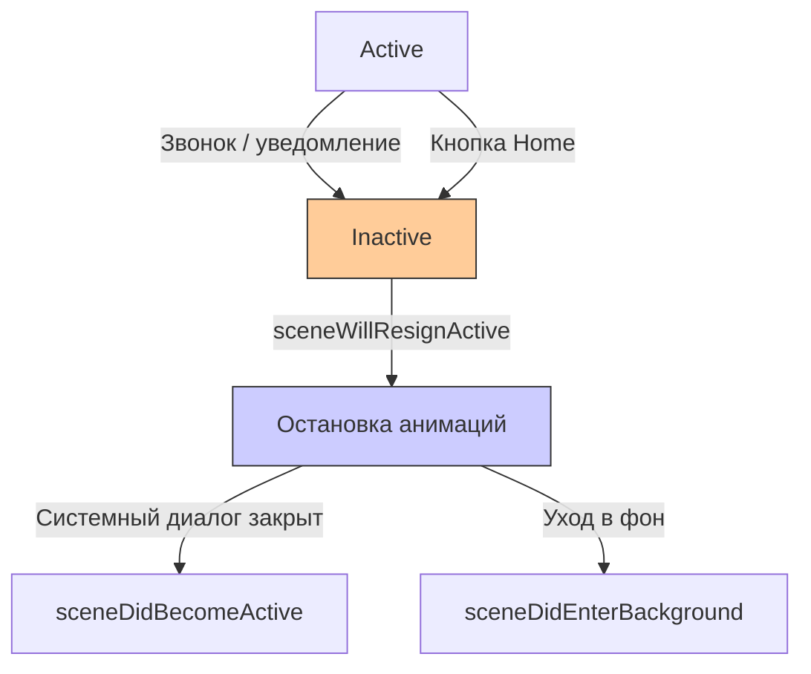
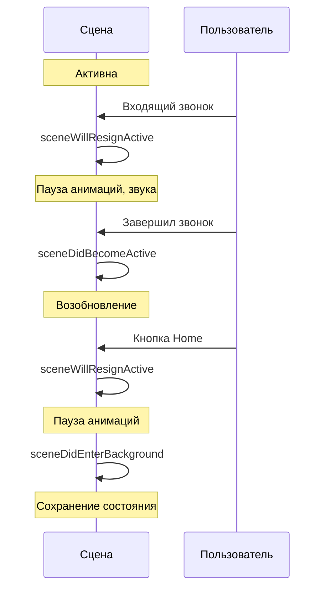

## sceneWillResignActive — Сцена теряет фокус

---
#ios #scenedelegate #app-lifecycle #inactive #background #swift

---

### Определение

**`sceneWillResignActive`** — это метод в [[SceneDelegate]], который вызывается, когда сцена (окно) **теряет активный статус** и перестаёт получать события от пользователя. Это происходит перед тем, как сцена перейдёт в фоновое состояние, а также при временных прерываниях (входящий звонок, уведомление, открытие шторки, разблокировка экрана).

```swift
func sceneWillResignActive(_ scene: UIScene) {
    print("⚠️ sceneWillResignActive — сцена теряет фокус")
}
```

**Ключевые факты:**
- Сцена становится **inactive** (не получает события, но всё ещё видима)
- Вызывается **перед** `sceneDidEnterBackground`
- Также вызывается при системных диалогах (звонок, Siri, уведомление)



---

### Зачем это знать iOS-разработчику?

| Сценарий | Почему это важно |
|---|---|
| **Пауза анимаций и игр** | Экономия ресурсов и батареи |
| **Пауза видео и аудио** | Пользователь ожидает, что звук замолкнет |
| **Остановка таймеров** | Не нужно обновлять UI в неактивном состоянии |
| **Сохранение текущего состояния** | Чтобы восстановить при возврате |
| **Отмена сетевых запросов** | Не тратить трафик, если приложение не активно |
| **Пауза захвата камеры / микрофона** | Освобождение оборудования |

---

### sceneWillResignActive vs sceneDidEnterBackground

| Аспект | `sceneWillResignActive` | `sceneDidEnterBackground` |
|---|---|---|
| **Вызывается** | При потере фокуса | При уходе в фон |
| **Состояние** | Inactive | Background |
| **Причина** | Звонок, уведомление, Home | Только Home или другое приложение |
| **Гарантия вызова** | Всегда (при потере фокуса) | Не всегда (если приложение не уходит в фон) |
| **Что делать** | Пауза анимаций, звука | Сохранение состояния, завершение задач |



---

### Полный пример использования

```swift
import UIKit

class SceneDelegate: UIResponder, UIWindowSceneDelegate {
    
    var window: UIWindow?
    private var activeTimers: [Timer] = []
    private var activeAnimations: [UIViewPropertyAnimator] = []
    
    // MARK: - Scene Lifecycle
    func sceneWillResignActive(_ scene: UIScene) {
        print("⚠️ sceneWillResignActive")
        print("   Scene: \(scene.session.persistentIdentifier)")
        
        // 1. Пауза анимаций
        pauseAnimations()
        
        // 2. Пауза видео и аудио
        pauseMediaPlayback()
        
        // 3. Остановка таймеров
        stopTimers()
        
        // 4. Отмена сетевых запросов
        cancelPendingRequests()
        
        // 5. Пауза захвата камеры/микрофона
        pauseCaptureSessions()
        
        // 6. Сохранение состояния (быстрое)
        saveCurrentState()
        
        // 7. Аналитика
        trackSessionEnd()
    }
    
    func sceneDidBecomeActive(_ scene: UIScene) {
        print("✅ sceneDidBecomeActive")
        
        // Возобновление при возврате
        resumeAnimations()
        resumeMediaPlayback()
        startTimers()
        resumeCaptureSessions()
        trackSessionStart()
    }
    
    // MARK: - Animations
    private func pauseAnimations() {
        for animator in activeAnimations {
            animator.pauseAnimation()
        }
        NotificationCenter.default.post(name: .pauseAnimations, object: nil)
        print("⏸ Animations paused")
    }
    
    private func resumeAnimations() {
        for animator in activeAnimations {
            animator.startAnimation()
        }
        NotificationCenter.default.post(name: .resumeAnimations, object: nil)
        print("▶️ Animations resumed")
    }
    
    // MARK: - Media
    private func pauseMediaPlayback() {
        NotificationCenter.default.post(name: .pauseVideo, object: nil)
        NotificationCenter.default.post(name: .pauseAudio, object: nil)
        AudioManager.shared.pause()
        print("⏸ Media playback paused")
    }
    
    private func resumeMediaPlayback() {
        // Аудио и видео не возобновляются автоматически
        // Пользователь должен сам решить
        print("▶️ Media playback can be resumed by user")
    }
    
    // MARK: - Timers
    private func stopTimers() {
        for timer in activeTimers {
            timer.invalidate()
        }
        activeTimers.removeAll()
        NotificationCenter.default.post(name: .timersStopped, object: nil)
        print("⏸ Timers stopped")
    }
    
    private func startTimers() {
        setupTimers()
        print("▶️ Timers started")
    }
    
    private func setupTimers() {
        // Пересоздание таймеров при необходимости
    }
    
    // MARK: - Network
    private func cancelPendingRequests() {
        NetworkQueue.shared.cancelNonCriticalRequests()
        print("🌐 Pending requests cancelled")
    }
    
    // MARK: - Capture
    private func pauseCaptureSessions() {
        CameraManager.shared.pauseSession()
        AudioRecorderManager.shared.pause()
        print("⏸ Capture sessions paused")
    }
    
    private func resumeCaptureSessions() {
        CameraManager.shared.resumeSession()
        print("▶️ Capture sessions resumed")
    }
    
    // MARK: - State
    private func saveCurrentState() {
        let state = SceneState(
            timestamp: Date(),
            currentScreen: NavigationManager.shared.currentScreen,
            scrollPositions: ScrollPositionManager.shared.getAll()
        )
        
        if let data = try? JSONEncoder().encode(state) {
            UserDefaults.standard.set(data, forKey: "sceneState")
            UserDefaults.standard.synchronize()
        }
        
        print("💾 Scene state saved")
    }
    
    // MARK: - Analytics
    private var sessionStartTime: Date?
    
    private func trackSessionStart() {
        sessionStartTime = Date()
        print("📊 Session started")
    }
    
    private func trackSessionEnd() {
        guard let startTime = sessionStartTime else { return }
        
        let duration = Date().timeIntervalSince(startTime)
        AnalyticsManager.shared.track(event: "session_end", parameters: [
            "duration": duration,
            "scene_id": getSceneIdentifier()
        ])
        
        print("📊 Session ended (duration: \(String(format: "%.1f", duration))s)")
    }
    
    private func getSceneIdentifier() -> String {
        return window?.windowScene?.session.persistentIdentifier ?? "unknown"
    }
}

// MARK: - Notifications
extension Notification.Name {
    static let pauseAnimations = Notification.Name("pauseAnimations")
    static let resumeAnimations = Notification.Name("resumeAnimations")
    static let pauseVideo = Notification.Name("pauseVideo")
    static let pauseAudio = Notification.Name("pauseAudio")
    static let timersStopped = Notification.Name("timersStopped")
}

// MARK: - Models
struct SceneState: Codable {
    let timestamp: Date
    let currentScreen: String
    let scrollPositions: [String: CGFloat]
}
```

---

### Игровой пример (важно для игр)

```swift
class GameViewController: UIViewController {
    
    private var gameLoop: CADisplayLink?
    private var isGamePaused = false
    
    override func viewDidLoad() {
        super.viewDidLoad()
        setupNotifications()
    }
    
    private func setupNotifications() {
        NotificationCenter.default.addObserver(
            self,
            selector: #selector(willResignActive),
            name: UIScene.willResignActiveNotification,
            object: nil
        )
        
        NotificationCenter.default.addObserver(
            self,
            selector: #selector(didBecomeActive),
            name: UIScene.didBecomeActiveNotification,
            object: nil
        )
    }
    
    @objc private func willResignActive() {
        guard !isGamePaused else { return }
        
        isGamePaused = true
        gameLoop?.isPaused = true
        
        // Сохранение состояния игры
        GameStateManager.shared.save()
        
        // Пауза фоновой музыки
        AudioManager.shared.pauseBackgroundMusic()
        
        print("🎮 Game paused")
    }
    
    @objc private func didBecomeActive() {
        guard isGamePaused else { return }
        
        isGamePaused = false
        gameLoop?.isPaused = false
        
        // Звук не возобновляется автоматически — пользователь должен сам решить
        // AudioManager.shared.resumeBackgroundMusic()
        
        print("🎮 Game can be resumed by user")
    }
}
```

---

### Распространённые ошибки

#### 1. Не паузится аудио

```swift
// ❌ Плохо — звук продолжает играть в фоне
func sceneWillResignActive(_ scene: UIScene) {
    // Ничего не делаем со звуком
}

// ✅ Хорошо — паузим звук
func sceneWillResignActive(_ scene: UIScene) {
    AudioManager.shared.pause()
    AVAudioSession.sharedInstance().setActive(false, options: .notifyOthersOnDeactivation)
}
```

#### 2. Игнорирование системных уведомлений

```swift
// ❌ Плохо — приложение не реагирует на временные прерывания
func sceneWillResignActive(_ scene: UIScene) {
    // Ничего не делаем
}

// ✅ Хорошо — корректная пауза
func sceneWillResignActive(_ scene: UIScene) {
    pauseGame()
    pauseVideo()
    stopTimers()
}
```

#### 3. Долгие синхронные операции

```swift
// ❌ Плохо — блокирует переход
func sceneWillResignActive(_ scene: UIScene) {
    saveLargeFileSync()  // Может занять секунды
}

// ✅ Хорошо — быстрое сохранение
func sceneWillResignActive(_ scene: UIScene) {
    saveCriticalDataSync()  // Только критичное
}
```

---

### Лучшие практики (2026)

| Практика | Почему |
|---|---|
| **Паузите анимации и игры** | Экономия ресурсов и батареи |
| **Паузите аудио и видео** | Пользователь ожидает тишины при звонке |
| **Останавливайте таймеры** | Не нужно обновлять UI в неактивном состоянии |
| **Сохраняйте состояние** | Чтобы восстановить при возврате |
| **Не делайте тяжёлых синхронных операций** | Не блокируйте переход |
| **Отменяйте некритичные сетевые запросы** | Экономия трафика |
| **Используйте уведомления для координации** | Чтобы другие компоненты тоже приостановились |

---

### Короткое правило

> **`sceneWillResignActive`** = сцена теряет фокус.  
> **Паузи анимации, видео, аудио, таймеры**.  
> **Сохрани состояние** (быстро).  
> **Не блокируй переход** (никаких долгих операций).  
> **Отмени некритичные сетевые запросы**.

---

### Итог

**`sceneWillResignActive`** — критически важный метод для корректной паузы сцены при потере фокуса:

| Аспект | Значение |
|---|---|
| **Вызывается** | При потере фокуса (звонок, уведомление, Home) |
| **Состояние** | Active → Inactive |
| **Назначение** | Пауза анимаций, звука, таймеров |
| **Обязательно** | Паузить медиа и сохранять состояние (быстро) |
| **Не делать** | Долгие синхронные операции |
| **Альтернатива** | `applicationWillResignActive` (глобальный уровень) |

**Главное правило:**
> При потере фокуса всегда паузи анимации, видео, аудио и таймеры. Пользователь ожидает, что звук замолкнет при звонке, а игра остановится. Сохраняй состояние быстро — только критичные данные. Не делай долгих синхронных операций — они заблокируют переход. Отменяй некритичные сетевые запросы, чтобы не тратить трафик. Используй уведомления для координации паузы между компонентами. Помни, что `sceneWillResignActive` вызывается всегда, а `sceneDidEnterBackground` — не всегда. 