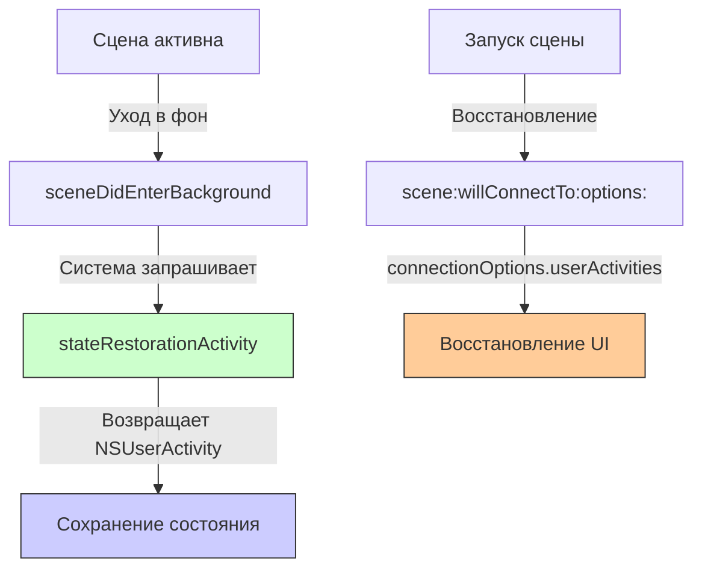
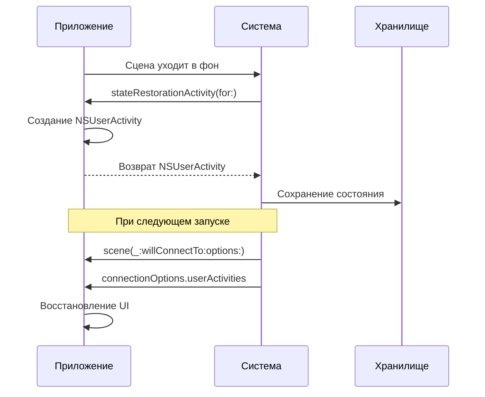

## stateRestorationActivity(for:) — Сохранение состояния сцены

---
#ios #scenedelegate #state-restoration #scene #ios13 #swift #uikit

---

### Определение

**`stateRestorationActivity(for:)`** — это метод в [[SceneDelegate]], который вызывается системой, когда сцена (окно) переходит в фоновое состояние и система хочет сохранить её состояние для последующего восстановления. Метод должен вернуть объект `NSUserActivity`, описывающий текущее состояние сцены.

```swift
func stateRestorationActivity(for scene: UIScene) -> NSUserActivity? {
    print("💾 stateRestorationActivity(for:) — сохранение состояния сцены")
    
    let activity = NSUserActivity(activityType: "com.example.app.sceneState")
    activity.userInfo = [
        "selectedTab": selectedTabIndex,
        "navigationStack": navigationStackIds
    ]
    
    return activity
}
```

**Ключевые факты:**
- Вызывается системой **автоматически** при уходе сцены в фон (не требует ручного вызова)
- Возвращает `NSUserActivity` с пользовательскими данными состояния
- Если вернуть `nil`, система не будет сохранять состояние
- Восстановление происходит в `scene(_:willConnectTo:options:)` через `connectionOptions.userActivities`



---

### Зачем это знать iOS-разработчику?

| Сценарий                                     | Почему это важно                                                                |
| -------------------------------------------- | ------------------------------------------------------------------------------- |
| **Восстановление после убийства приложения** | Пользователь ожидает, что после перезапуска приложение вернётся на тот же экран |
| **iPad Multitasking**                        | При переключении между окнами состояние каждого окна сохраняется отдельно       |
| **State Restoration для UIKit**              | Альтернатива ручному сохранению в [[UserDefaults]]                              |
| **Handoff поддержка**                        | Сохранённое состояние может быть передано на другое устройство                  |
| **Сценарии с несколькими окнами**            | Каждое окно (сцена) имеет своё независимое состояние                            |

---

### Как это работает



---

### Полный пример использования

```swift
import UIKit

class SceneDelegate: UIResponder, UIWindowSceneDelegate {
    
    var window: UIWindow?
    private var navigationController: UINavigationController?
    
    // MARK: - State Restoration
    override func stateRestorationActivity(for scene: UIScene) -> NSUserActivity? {
        print("💾 stateRestorationActivity(for:)")
        
        guard let navigationController = navigationController else {
            print("⚠️ No navigation controller to restore")
            return nil
        }
        
        // Создаём активность для восстановления
        let activity = NSUserActivity(activityType: "com.example.app.sceneState")
        activity.title = "Scene State"
        
        // Сохраняем данные состояния
        var stateInfo: [String: Any] = [:]
        
        // 1. Сохраняем стек навигации (идентификаторы контроллеров)
        let viewControllersIds = navigationController.viewControllers.map { vc in
            String(describing: type(of: vc))
        }
        stateInfo["viewControllers"] = viewControllersIds
        
        // 2. Сохраняем выбранную вкладку (если есть TabBarController)
        if let tabBarController = navigationController.tabBarController {
            stateInfo["selectedTab"] = tabBarController.selectedIndex
        }
        
        // 3. Сохраняем позиции скролла
        stateInfo["scrollPositions"] = getScrollPositions()
        
        // 4. Сохраняем введённые пользователем данные
        stateInfo["userInput"] = getUserInput()
        
        // 5. Сохраняем выбранные элементы
        stateInfo["selectedItemId"] = getSelectedItemId()
        
        activity.userInfo = stateInfo
        
        // Делаем активность доступной для Handoff (опционально)
        activity.isEligibleForHandoff = true
        
        return activity
    }
    
    func scene(_ scene: UIScene, willConnectTo session: UISceneSession, options connectionOptions: UIScene.ConnectionOptions) {
        print("🔗 scene(_:willConnectTo:options:)")
        
        guard let windowScene = scene as? UIWindowScene else { return }
        
        let window = UIWindow(windowScene: windowScene)
        
        // Проверяем, есть ли сохранённое состояние
        if let userActivity = connectionOptions.userActivities.first {
            print("🔄 Restoring from saved state")
            let rootViewController = restoreFromActivity(userActivity)
            window.rootViewController = rootViewController
        } else {
            print("🆕 Creating new scene")
            window.rootViewController = createDefaultRootViewController()
        }
        
        window.makeKeyAndVisible()
        self.window = window
        
        // Сохраняем ссылку на navigation controller
        if let navController = window.rootViewController as? UINavigationController {
            self.navigationController = navController
        } else if let tabBarController = window.rootViewController as? UITabBarController,
                  let navController = tabBarController.selectedViewController as? UINavigationController {
            self.navigationController = navController
        }
    }
    
    // MARK: - Restoration Helpers
    private func restoreFromActivity(_ activity: NSUserActivity) -> UIViewController {
        guard let userInfo = activity.userInfo else {
            return createDefaultRootViewController()
        }
        
        // 1. Восстанавливаем стек навигации
        let viewControllersIds = userInfo["viewControllers"] as? [String] ?? []
        let viewControllers = buildViewControllers(from: viewControllersIds)
        
        let navigationController = UINavigationController()
        navigationController.setViewControllers(viewControllers, animated: false)
        
        // 2. Восстанавливаем выбранную вкладку
        if let selectedTab = userInfo["selectedTab"] as? Int,
           let tabBarController = window?.rootViewController as? UITabBarController {
            tabBarController.selectedIndex = selectedTab
        }
        
        // 3. Восстанавливаем позиции скролла
        if let scrollPositions = userInfo["scrollPositions"] as? [String: CGFloat] {
            restoreScrollPositions(scrollPositions, in: navigationController)
        }
        
        // 4. Восстанавливаем введённые данные
        if let userInput = userInfo["userInput"] as? [String: String] {
            restoreUserInput(userInput, in: navigationController)
        }
        
        // 5. Восстанавливаем выбранные элементы
        if let selectedItemId = userInfo["selectedItemId"] as? String {
            restoreSelectedItem(selectedItemId, in: navigationController)
        }
        
        return navigationController
    }
    
    private func createDefaultRootViewController() -> UIViewController {
        let mainVC = MainViewController()
        return UINavigationController(rootViewController: mainVC)
    }
    
    private func buildViewControllers(from ids: [String]) -> [UIViewController] {
        var viewControllers: [UIViewController] = []
        
        for id in ids {
            switch id {
            case "MainViewController":
                viewControllers.append(MainViewController())
            case "ProfileViewController":
                viewControllers.append(ProfileViewController())
            case "SettingsViewController":
                viewControllers.append(SettingsViewController())
            case "DetailViewController":
                viewControllers.append(DetailViewController())
            default:
                viewControllers.append(MainViewController())
            }
        }
        
        return viewControllers
    }
    
    // MARK: - Data Collection
    private func getScrollPositions() -> [String: CGFloat] {
        var positions: [String: CGFloat] = [:]
        
        guard let navigationController = navigationController else { return positions }
        
        for viewController in navigationController.viewControllers {
            if let scrollable = viewController as? ScrollPositionProvider {
                positions[String(describing: type(of: viewController))] = scrollable.currentScrollOffset
            }
        }
        
        return positions
    }
    
    private func getUserInput() -> [String: String] {
        var input: [String: String] = [:]
        
        guard let navigationController = navigationController else { return input }
        
        for viewController in navigationController.viewControllers {
            if let form = viewController as? FormDataProvider {
                input[String(describing: type(of: viewController))] = form.userInput
            }
        }
        
        return input
    }
    
    private func getSelectedItemId() -> String? {
        guard let navigationController = navigationController,
              let topVC = navigationController.topViewController as? ItemSelectable else {
            return nil
        }
        return topVC.selectedItemId
    }
    
    // MARK: - Data Restoration
    private func restoreScrollPositions(_ positions: [String: CGFloat], in navigationController: UINavigationController) {
        for viewController in navigationController.viewControllers {
            let typeName = String(describing: type(of: viewController))
            if let position = positions[typeName],
               let scrollable = viewController as? ScrollPositionProvider {
                scrollable.restoreScrollPosition(position)
            }
        }
    }
    
    private func restoreUserInput(_ input: [String: String], in navigationController: UINavigationController) {
        for viewController in navigationController.viewControllers {
            let typeName = String(describing: type(of: viewController))
            if let data = input[typeName],
               let form = viewController as? FormDataProvider {
                form.restoreUserInput(data)
            }
        }
    }
    
    private func restoreSelectedItem(_ itemId: String, in navigationController: UINavigationController) {
        if let topVC = navigationController.topViewController as? ItemSelectable {
            topVC.selectItem(withId: itemId)
        }
    }
}

// MARK: - Protocols для восстановления состояния
protocol ScrollPositionProvider: AnyObject {
    var currentScrollOffset: CGFloat { get }
    func restoreScrollPosition(_ position: CGFloat)
}

protocol FormDataProvider: AnyObject {
    var userInput: String { get }
    func restoreUserInput(_ input: String)
}

protocol ItemSelectable: AnyObject {
    var selectedItemId: String? { get }
    func selectItem(withId id: String)
}
```

---

### Сохранение состояния ViewController

```swift
class ProfileViewController: UIViewController, ScrollPositionProvider, FormDataProvider, ItemSelectable {
    
    @IBOutlet weak var tableView: UITableView!
    @IBOutlet weak var nameTextField: UITextField!
    
    var selectedItemId: String?
    var currentScrollOffset: CGFloat {
        return tableView.contentOffset.y
    }
    
    var userInput: String {
        return nameTextField.text ?? ""
    }
    
    func restoreScrollPosition(_ position: CGFloat) {
        tableView.contentOffset.y = position
    }
    
    func restoreUserInput(_ input: String) {
        nameTextField.text = input
    }
    
    func selectItem(withId id: String) {
        selectedItemId = id
        // Загружаем детали выбранного элемента
        loadItemDetails(id: id)
    }
    
    private func loadItemDetails(id: String) { }
}
```

---

### Сохранение состояния для TabBarController

```swift
class TabBarController: UITabBarController {
    
    private var selectedTabIndex: Int {
        get { selectedIndex }
        set { selectedIndex = newValue }
    }
}

// В SceneDelegate
func stateRestorationActivity(for scene: UIScene) -> NSUserActivity? {
    let activity = NSUserActivity(activityType: "com.example.app.sceneState")
    
    var stateInfo: [String: Any] = [:]
    
    if let tabBarController = window?.rootViewController as? UITabBarController {
        stateInfo["selectedTab"] = tabBarController.selectedIndex
    }
    
    activity.userInfo = stateInfo
    return activity
}

func scene(_ scene: UIScene, willConnectTo session: UISceneSession, options connectionOptions: UIScene.ConnectionOptions) {
    // ... создание window
    
    if let userActivity = connectionOptions.userActivities.first,
       let selectedTab = userActivity.userInfo?["selectedTab"] as? Int,
       let tabBarController = window.rootViewController as? UITabBarController {
        tabBarController.selectedIndex = selectedTab
    }
}
```

---

### Тестирование восстановления состояния

Для тестирования state restoration в Xcode:

1. Запустите приложение
2. Перейдите на нужный экран
3. Нажмите Home (Cmd + Shift + H в симуляторе)
4. Остановите приложение в [[Xcode]] (Stop)
5. Снова запустите приложение

Приложение должно восстановиться на том же экране.

Для симуляции убийства приложения:

```bash
# В терминале
xcrun simctl terminate <device-id> <app-bundle-id>
```

---

### Распространённые ошибки

#### 1. Забыли вернуть activity

```swift
// ❌ Плохо — состояние не сохранится
func stateRestorationActivity(for scene: UIScene) -> NSUserActivity? {
    return nil
}

// ✅ Хорошо — возвращаем activity
func stateRestorationActivity(for scene: UIScene) -> NSUserActivity? {
    let activity = NSUserActivity(activityType: "com.example.app.sceneState")
    activity.userInfo = ["selectedTab": selectedIndex]
    return activity
}
```

#### 2. Не восстанавливаете в willConnectTo

```swift
// ❌ Плохо — игнорируем saved state
func scene(_ scene: UIScene, willConnectTo session: UISceneSession, options connectionOptions: UIScene.ConnectionOptions) {
    window?.rootViewController = MainViewController()
}

// ✅ Хорошо — восстанавливаем
func scene(_ scene: UIScene, willConnectTo session: UISceneSession, options connectionOptions: UIScene.ConnectionOptions) {
    if let userActivity = connectionOptions.userActivities.first {
        window?.rootViewController = restoreFromActivity(userActivity)
    } else {
        window?.rootViewController = MainViewController()
    }
}
```

#### 3. Сохранение слишком больших данных

```swift
// ❌ Плохо — сохраняем полные объекты
activity.userInfo = ["user": fullUserObject]  // Может быть слишком большим

// ✅ Хорошо — сохраняем только идентификаторы
activity.userInfo = ["userId": user.id]
```

---

### Лучшие практики (2026)

| Практика | Почему |
|---|---|
| **Сохраняйте только идентификаторы** | Не храните полные объекты |
| **Восстанавливайте асинхронно** | Не блокируйте запуск |
| **Используйте осмысленные типы активностей** | Для отладки |
| **Тестируйте сценарии восстановления** | Убивайте приложение в симуляторе |
| **Не сохраняйте чувствительные данные** | Безопасность |
| **Для SwiftUI используйте @SceneStorage** | Проще и безопаснее |

---

### SwiftUI альтернатива

В SwiftUI для сохранения состояния сцены используется `@SceneStorage`:

```swift
import SwiftUI

struct ContentView: View {
    @SceneStorage("selectedTab") var selectedTab: Int = 0
    @SceneStorage("scrollPosition") var scrollPosition: Double = 0
    
    var body: some View {
        TabView(selection: $selectedTab) {
            HomeView()
                .tabItem { Label("Home", systemImage: "house") }
                .tag(0)
            
            ProfileView()
                .tabItem { Label("Profile", systemImage: "person") }
                .tag(1)
        }
    }
}
```

---

### Короткое правило

> **`stateRestorationActivity(for:)`** = сохраняй состояние сцены при уходе в фон.  
> **Сохраняй только идентификаторы**, не полные объекты.  
> **Восстанавливай в `willConnectTo`** через `connectionOptions.userActivities`.  
> **Тестируй** убийством приложения в симуляторе.

---

### Итог

**`stateRestorationActivity(for:)`** — ключевой метод для сохранения состояния сцены:

| Аспект | Значение |
|---|---|
| **Вызывается** | Системой при уходе сцены в фон |
| **Назначение** | Сохранение состояния для восстановления |
| **Возвращает** | `NSUserActivity` с данными или `nil` |
| **Восстановление** | В `scene(_:willConnectTo:options:)` |
| **Альтернатива** | `@SceneStorage` в SwiftUI |

**Главное правило:**
> Используй `stateRestorationActivity(for:)` для сохранения состояния UIKit-сцен. Сохраняй только идентификаторы и минимально необходимые данные. Не храни чувствительную информацию. Восстанавливай состояние асинхронно, чтобы не блокировать запуск. Тестируй сценарии восстановления, убивая приложение в фоне. Для SwiftUI используй `@SceneStorage` — это проще и безопаснее. State Restoration значительно улучшает пользовательский опыт, особенно на iPad с многозадачностью.