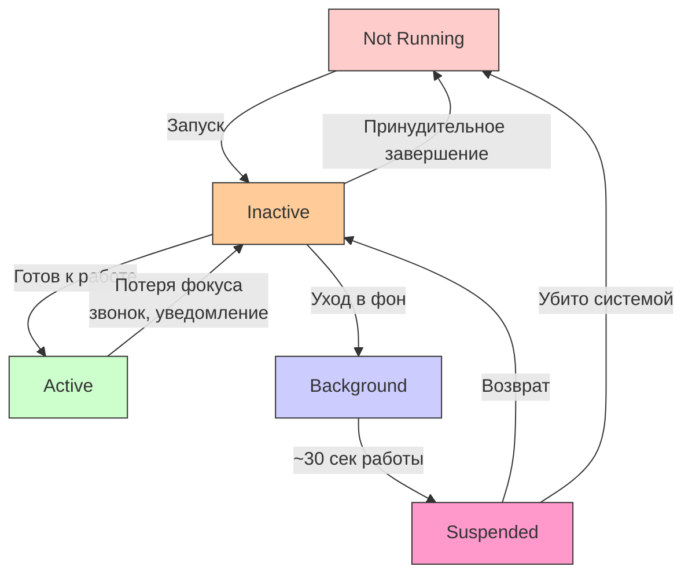

#ios #app-lifecycle #appdelegate #scenedelegate #swift #background #push-notifications

---

### Определение

**Application Life Cycle** — это последовательность **состояний** (states), через которые проходит приложение от момента запуска до его завершения или принудительного удаления из памяти. Он определяет, **когда** и **как** приложение может выполнять код, сохранять данные, реагировать на системные события и освобождать ресурсы.

Понимание жизненного цикла критически важно для:
- Корректной инициализации сервисов (Firebase, аналитика, базы данных)
- Сохранения состояния при уходе в фон
- Освобождения ресурсов при завершении
- Обработки push-уведомлений
- Оптимизации энергопотребления



---

### Основные состояния приложения (2026 актуально)

| Состояние       | Когда происходит                                                                                          | Может выполнять код?                                    | Что обычно делают в этом состоянии                                  |
| --------------- | --------------------------------------------------------------------------------------------------------- | ------------------------------------------------------- | ------------------------------------------------------------------- |
| **Not Running** | Приложение не запущено или было принудительно завершено                                                   | Нет                                                     | Ничего (приложение «мертво»)                                        |
| **Inactive**    | Запущено, но **не в фокусе** (входящий звонок, уведомление, переход между экранами, разблокировка экрана) | Да (очень коротко)                                      | Приостановить анимации, игры, видео                                 |
| **Active**      | Приложение на экране, пользователь взаимодействует                                                        | Да (полноценно)                                         | Основная работа: UI, сеть, анимации, звук                           |
| **Background**  | Приложение ушло в фон (Home, другое приложение впереди)                                                   | Да (ограниченное время ~30 сек, можно запросить больше) | Сохранение данных, завершение задач, отправка локальных уведомлений |
| **Suspended**   | Система заморозила приложение в фоне (нет [[CPU]])                                                        | Нет                                                     | Ничего (может быть убито системой в любой момент)                   |

---

### Переходы между состояниями (самая частая последовательность)

| Переход                             | Когда происходит                                     | Вызываемые методы                                               |
| ----------------------------------- | ---------------------------------------------------- | --------------------------------------------------------------- |
| **Not Running → Inactive**          | Пользователь тапнул по иконке                        | `didFinishLaunchingWithOptions`                                 |
| **Inactive → Active**               | Экран полностью загрузился                           | `applicationDidBecomeActive`                                    |
| **Active → Inactive**               | Входящий звонок / уведомление / разблокировка экрана | `applicationWillResignActive`                                   |
| **Inactive → Background**           | Нажата кнопка Home / другое приложение впереди       | `applicationDidEnterBackground`                                 |
| **Background → Suspended**          | Прошло ~30 секунд фоновой работы                     | нет (системная, без вызова)                                     |
| **Background / Suspended → Active** | Пользователь вернулся в приложение                   | `applicationWillEnterForeground` → `applicationDidBecomeActive` |
| **Suspended → Not Running**         | Система убила приложение из-за нехватки памяти       | `applicationWillTerminate` (редко вызывается)                   |

---

### Ключевые методы в AppDelegate / SceneDelegate (2026)

| Метод / Событие                                    | Когда вызывается                               | Где находится в 2026 году ([[UIKit]]) | Что обычно делают                                                |
| -------------------------------------------------- | ---------------------------------------------- | ------------------------------------- | ---------------------------------------------------------------- |
| **[[application(didFinishLaunchingWithOptions)]]** | Самый первый запуск приложения                 | AppDelegate                           | Инициализация Firebase, Amplitude, Crashlytics, регистрация push |
| **[[applicationDidBecomeActive]]**                 | Приложение стало видимым и активным            | AppDelegate / SceneDelegate           | Запуск анимаций, проверка токенов, обновление виджетов           |
| **[[applicationWillResignActive]]**                | Приложение теряет фокус (уведомление, звонок)  | [[AppDelegate]] / [[SceneDelegate]]   | Пауза игр, видео, таймеров                                       |
| **[[applicationDidEnterBackground]]**              | Приложение ушло в фон                          | AppDelegate / SceneDelegate           | Сохранение состояния, остановка задач, отправка аналитики        |
| **[[applicationWillEnterForeground]]**             | Приложение возвращается из фона                | AppDelegate / SceneDelegate           | Обновление данных, проверка авторизации                          |
| **[[applicationWillTerminate]]**                   | Приложение завершает работу (редко вызывается) | AppDelegate                           | Финальное сохранение (почти никогда не полагайтесь)              |

---

### Современный AppDelegate / SceneDelegate в 2026

#### AppDelegate (глобальная инициализация)

```swift
import UIKit
import Firebase
import UserNotifications

@main
class AppDelegate: UIResponder, UIApplicationDelegate {
    
    // MARK: - Application Lifecycle
    func application(_ application: UIApplication,
                     didFinishLaunchingWithOptions launchOptions: [UIApplication.LaunchOptionsKey: Any]?) -> Bool {
        
        print("🚀 1. didFinishLaunchingWithOptions")
        
        // 1. Инициализация сервисов
        FirebaseApp.configure()
        
        // 2. Настройка push-уведомлений
        UNUserNotificationCenter.current().delegate = self
        application.registerForRemoteNotifications()
        
        // 3. Настройка аналитики
        setupAnalytics()
        
        // 4. Настройка Crashlytics
        setupCrashlytics()
        
        // 5. Проверка первого запуска
        checkFirstLaunch()
        
        return true
    }
    
    func applicationDidBecomeActive(_ application: UIApplication) {
        print("✅ 5. applicationDidBecomeActive — приложение активно")
        
        // Обновление виджетов
        WidgetCenter.shared.reloadAllTimelines()
        
        // Проверка токена авторизации
        checkAuthToken()
    }
    
    func applicationWillResignActive(_ application: UIApplication) {
        print("⚠️ 2. applicationWillResignActive — приложение теряет фокус")
        
        // Пауза видео/игр
        pauseActiveAnimations()
    }
    
    func applicationDidEnterBackground(_ application: UIApplication) {
        print("⏸ 3. applicationDidEnterBackground — приложение ушло в фон")
        
        // Сохранение состояния
        saveAppState()
        
        // Отправка аналитики
        flushAnalytics()
    }
    
    func applicationWillEnterForeground(_ application: UIApplication) {
        print("🔄 4. applicationWillEnterForeground — возвращение из фона")
        
        // Обновление данных
        refreshData()
    }
    
    func applicationWillTerminate(_ application: UIApplication) {
        print("💀 applicationWillTerminate — приложение завершается")
        // Редко вызывается! Не полагайтесь на этот метод для критичных данных
    }
    
    // MARK: - Push Notifications
    func application(_ application: UIApplication,
                     didRegisterForRemoteNotificationsWithDeviceToken deviceToken: Data) {
        let token = deviceToken.map { String(format: "%02.2hhx", $0) }.joined()
        print("📱 Push token: \(token)")
        
        // Отправка токена на сервер
        sendPushTokenToServer(token)
    }
    
    func application(_ application: UIApplication,
                     didFailToRegisterForRemoteNotificationsWithError error: Error) {
        print("❌ Push registration failed: \(error)")
    }
    
    // MARK: - Private Methods
    private func setupAnalytics() { }
    private func setupCrashlytics() { }
    private func checkFirstLaunch() { }
    private func checkAuthToken() { }
    private func pauseActiveAnimations() { }
    private func saveAppState() { }
    private func flushAnalytics() { }
    private func refreshData() { }
    private func sendPushTokenToServer(_ token: String) { }
}

// MARK: - UNUserNotificationCenterDelegate
extension AppDelegate: UNUserNotificationCenterDelegate {
    
    func userNotificationCenter(_ center: UNUserNotificationCenter,
                                willPresent notification: UNNotification,
                                withCompletionHandler completionHandler: @escaping (UNNotificationPresentationOptions) -> Void) {
        // Показать уведомление даже когда приложение активно
        completionHandler([.banner, .sound, .badge])
    }
    
    func userNotificationCenter(_ center: UNUserNotificationCenter,
                                didReceive response: UNNotificationResponse,
                                withCompletionHandler completionHandler: @escaping () -> Void) {
        // Обработка нажатия на уведомление
        handleNotification(response.notification)
        completionHandler()
    }
    
    private func handleNotification(_ notification: UNNotification) { }
}
```

---

### SceneDelegate (iOS 13+, для UIKit с поддержкой нескольких сцен)

```swift
import UIKit

class SceneDelegate: UIResponder, UIWindowSceneDelegate {
    
    var window: UIWindow?
    
    func scene(_ scene: UIScene,
               willConnectTo session: UISceneSession,
               options connectionOptions: UIScene.ConnectionOptions) {
        print("🔗 Scene willConnectTo session")
        
        guard let windowScene = scene as? UIWindowScene else { return }
        window = UIWindow(windowScene: windowScene)
        window?.rootViewController = MainViewController()
        window?.makeKeyAndVisible()
    }
    
    func sceneDidBecomeActive(_ scene: UIScene) {
        print("✅ Scene didBecomeActive")
    }
    
    func sceneWillResignActive(_ scene: UIScene) {
        print("⚠️ Scene willResignActive")
    }
    
    func sceneDidEnterBackground(_ scene: UIScene) {
        print("⏸ Scene didEnterBackground")
    }
    
    func sceneWillEnterForeground(_ scene: UIScene) {
        print("🔄 Scene willEnterForeground")
    }
    
    func sceneDidDisconnect(_ scene: UIScene) {
        print("🔌 Scene didDisconnect")
    }
}
```

---

### Background Tasks (iOS 13+)

```swift
import BackgroundTasks

class BackgroundTaskManager {
    
    static func registerBackgroundTasks() {
        // Регистрация задачи
        BGTaskScheduler.shared.register(forTaskWithIdentifier: "com.app.refresh", using: nil) { task in
            handleAppRefresh(task: task as! BGAppRefreshTask)
        }
    }
    
    static func scheduleAppRefresh() {
        let request = BGAppRefreshTaskRequest(identifier: "com.app.refresh")
        request.earliestBeginDate = Date(timeIntervalSinceNow: 15 * 60) // 15 минут
        
        do {
            try BGTaskScheduler.shared.submit(request)
            print("📅 Background task scheduled")
        } catch {
            print("❌ Failed to schedule task: \(error)")
        }
    }
    
    private static func handleAppRefresh(task: BGAppRefreshTask) {
        // Создаём операцию
        let operation = RefreshDataOperation()
        
        task.expirationHandler = {
            operation.cancel()
            print("⏰ Background task expired")
        }
        
        operation.completionBlock = {
            let success = !operation.isCancelled
            task.setTaskCompleted(success: success)
            scheduleAppRefresh() // Планируем следующую
        }
        
        OperationQueue.main.addOperation(operation)
    }
}

class RefreshDataOperation: Operation {
    override func main() {
        guard !isCancelled else { return }
        // Обновление данных
        Thread.sleep(forTimeInterval: 2)
        print("🔄 Background data refreshed")
    }
}
```

---

### State Restoration (Восстановление состояния)

```swift
class ViewController: UIViewController {
    
    override func viewDidLoad() {
        super.viewDidLoad()
        
        // Восстановление состояния
        if let userActivity = NSUserActivity(activityType: "com.app.view") {
            userActivity.becomeCurrent()
        }
    }
    
    override func viewWillDisappear(_ animated: Bool) {
        super.viewWillDisappear(animated)
        
        // Сохранение состояния при уходе в фон
        let userActivity = NSUserActivity(activityType: "com.app.view")
        userActivity.userInfo = [
            "selectedItemId": selectedItemId,
            "scrollPosition": scrollPosition
        ]
        userActivity.becomeCurrent()
    }
    
    override func updateUserActivityState(_ activity: NSUserActivity) {
        super.updateUserActivityState(activity)
        activity.userInfo = [
            "selectedItemId": selectedItemId,
            "scrollPosition": scrollPosition
        ]
    }
}
```

---

### Сравнение AppDelegate и SceneDelegate

| Аспект | AppDelegate | SceneDelegate |
|---|---|---|
| **Появление** | iOS 2.0 | iOS 13+ |
| **Назначение** | Глобальная инициализация, push, URL-схемы | Управление отдельными окнами/сценами |
| **Количество** | Один на приложение | Может быть несколько (iPad multitasking) |
| **Обязательность** | ✅ Всегда | ⚠️ Для UIKit с поддержкой сцен |
| **SwiftUI** | ❌ Не используется | ✅ Используется |

---

### Утечки памяти и жизненный цикл

```swift
class LeakProneViewController: UIViewController {
    
    // ❌ Плохо: сильная ссылка на делегат
    var delegate: SomeDelegate?  // Должен быть weak
    deinit { print("Не вызовется — retain cycle!") }
}

// ✅ Хорошо
class SafeViewController: UIViewController {
    
    weak var delegate: SomeDelegate?  // weak
    private var cancellables = Set<AnyCancellable>()
    
    deinit {
        print("✅ SafeViewController deinitialized")
        cancellables.removeAll()
        NotificationCenter.default.removeObserver(self)
        timer?.invalidate()
    }
}
```

---

### Лучшие практики (2026)

| Практика | Почему |
|---|---|
| **Не делайте тяжёлых операций в `didFinishLaunchingWithOptions`** | Задерживает запуск приложения |
| **Используйте `SceneDelegate` для UI-логики** | AppDelegate — только для глобальной инициализации |
| **Сохраняйте состояние в `didEnterBackground`** | Приложение может быть убито в любой момент |
| **Не полагайтесь на `willTerminate`** | Вызывается редко, лучше сохранять в `didEnterBackground` |
| **Используйте Background Tasks для длительных операций** | В фоне есть только ~30 секунд |
| **Проверяйте `deinit` в сложных контроллерах** | Ловите retain cycles |

---

### Короткий девиз 2026

> Application Life Cycle — это когда приложение «рождается», «живёт», «засыпает», «просыпается» и «умирает».  
> В 2026 году AppDelegate всё ещё **обязателен** для глобальной инициализации (push, аналитика, сервисы), но большая часть управления сценами и окнами ушла в **SceneDelegate** и **SwiftUI @main**.  
> Главное — правильно обрабатывать `didFinishLaunching`, `DidBecomeActive`, `DidEnterBackground` и push.

---

### Итог

**Application Life Cycle** в iOS:

| Состояние | Когда | Что делать |
|---|---|---|
| **Not Running** | Приложение не запущено | — |
| **Inactive** | Кратковременно при запуске/возврате | Приостановить анимации |
| **Active** | Пользователь взаимодействует | Основная работа |
| **Background** | В фоне (~30 сек) | Сохранить состояние, завершить задачи |
| **Suspended** | Заморожено | Ничего (может быть убито) |

**Главное правило:**
> Всегда сохраняй состояние в `applicationDidEnterBackground` — это последний надёжный момент перед возможным уничтожением приложения. Никогда не полагайся на `applicationWillTerminate` — он может не вызваться. Используй Background Tasks для операций, требующих больше времени в фоне. Проверяй `deinit` в контроллерах — если не вызывается, ищи retain cycle. Для push-уведомлений реализуй `UNUserNotificationCenterDelegate`. Для нового кода используй `SceneDelegate`, AppDelegate оставь для глобальной инициализации.