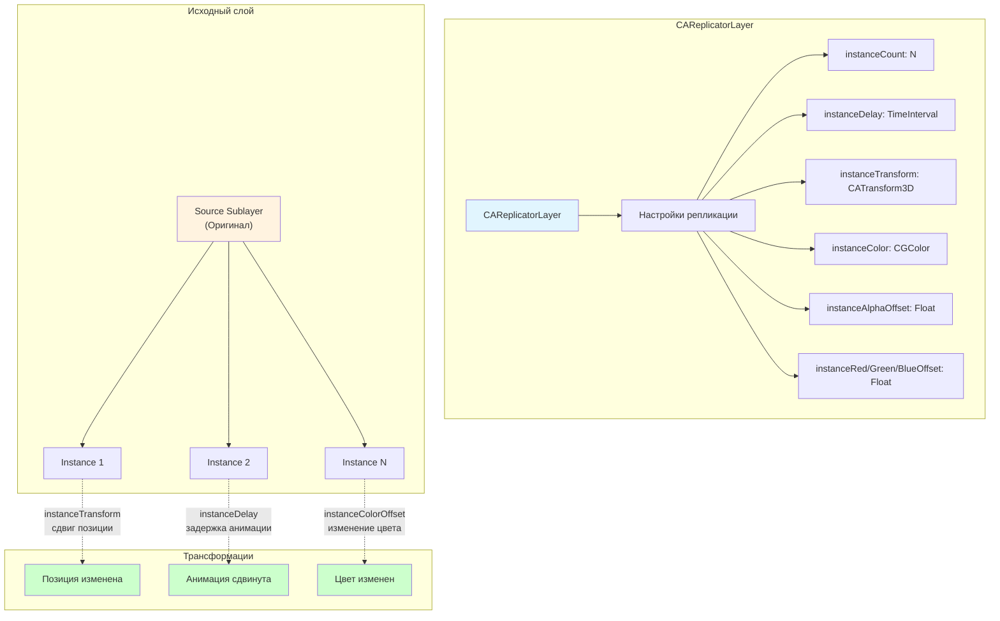

#core-animation #careplicatorlayer #animation #performance #ios #swift #metal

---

## CAReplicatorLayer — Создание повторяющихся элементов и эффектов

### Определение

**`CAReplicatorLayer`** — это подкласс [[CALayer]] в [[Core Animation]], который автоматически создает **копии (реплики)** своих подслоев (sublayers). Каждая реплика может быть сдвинута по позиции, времени, цвету, трансформации и другим параметрам относительно предыдущей .

Этот слой не выполняет никакой другой работы, кроме размножения своих дочерних элементов. Это чрезвычайно эффективный способ создания повторяющихся узоров, тайлов, очередей анимаций и специальных эффектов, так как вся работа выполняется на GPU.

### Зачем это знать iOS-разработчику?

1.  **Производительность:** Создание десятков или сотен однотипных элементов без необходимости создавать отдельные слои и управлять ими .
2.  **Эффекты "клонирования":** Следы за движущимся объектом, множественные копии спрайтов.
3.  **Повторяющиеся узоры:** Сетки, шахматные доски, орнаменты.
4.  **Очереди анимаций:** Задержка анимации для каждой последующей копии (например, волна).
5.  **Экономия памяти:** Один слой-источник реплицируется, а не создаётся N отдельных слоёв.

---

### Архитектура и ключевые свойства

`CAReplicatorLayer` — это контейнер, который берёт свои подслои и размножает их.



| Свойство                                                               | Тип                | Описание                                                                                        |
| ---------------------------------------------------------------------- | ------------------ | ----------------------------------------------------------------------------------------------- |
| **`instanceCount`**                                                    | [[Int]]            | Количество копий (включая оригинал). По умолчанию `0` (нет копий).                              |
| **`instanceDelay`**                                                    | [[CFTimeInterval]] | Задержка анимации между копиями. Используется для создания последовательных анимаций ("волна"). |
| **`instanceTransform`**                                                | [[CATransform3D]]  | Трансформация, применяемая к каждой последующей копии относительно предыдущей.                  |
| **`instanceRedOffset` / `instanceGreenOffset` / `instanceBlueOffset`** | [[Float]]          | Смещение цветовых компонентов для каждой копии.                                                 |
| **`instanceAlphaOffset`**                                              | `Float`            | Смещение прозрачности для каждой копии.                                                         |
| **`preservesDepth`**                                                   | [[Bool]]           | Сохраняет глубину 3D-трансформаций для копий.                                                   |

---

### Базовый пример: Линия из кругов

```swift
import UIKit

class ReplicatorLineViewController: UIViewController {
    override func viewDidLoad() {
        super.viewDidLoad()
        view.backgroundColor = .black
        
        // 1. Создаем репликатор
        let replicatorLayer = CAReplicatorLayer()
        replicatorLayer.frame = view.bounds
        view.layer.addSublayer(replicatorLayer)
        
        // 2. Создаем исходный слой (круг)
        let circleLayer = CALayer()
        circleLayer.bounds = CGRect(x: 0, y: 0, width: 30, height: 30)
        circleLayer.position = CGPoint(x: 50, y: 200)
        circleLayer.backgroundColor = UIColor.systemBlue.cgColor
        circleLayer.cornerRadius = 15
        
        // 3. Добавляем исходный слой в репликатор
        replicatorLayer.addSublayer(circleLayer)
        
        // 4. Настраиваем репликацию
        replicatorLayer.instanceCount = 10
        // Сдвиг каждой следующей копии на 40 пикселей вправо
        replicatorLayer.instanceTransform = CATransform3DMakeTranslation(40, 0, 0)
    }
}
```

---

### Пример 2: Сетка из квадратов

```swift
class GridReplicatorViewController: UIViewController {
    override func viewDidLoad() {
        super.viewDidLoad()
        
        let replicatorLayer = CAReplicatorLayer()
        replicatorLayer.frame = view.bounds
        view.layer.addSublayer(replicatorLayer)
        
        // Исходный квадрат
        let squareLayer = CALayer()
        squareLayer.bounds = CGRect(x: 0, y: 0, width: 40, height: 40)
        squareLayer.position = CGPoint(x: 50, y: 80)
        squareLayer.backgroundColor = UIColor.systemGreen.cgColor
        
        replicatorLayer.addSublayer(squareLayer)
        
        // Копируем по горизонтали
        replicatorLayer.instanceCount = 6
        replicatorLayer.instanceTransform = CATransform3DMakeTranslation(50, 0, 0)
        
        // Создаем второй репликатор для вертикального размножения
        let verticalReplicator = CAReplicatorLayer()
        verticalReplicator.frame = view.bounds
        verticalReplicator.instanceCount = 8
        verticalReplicator.instanceTransform = CATransform3DMakeTranslation(0, 50, 0)
        
        // Переносим существующие подслои в новый репликатор
        if let sublayers = replicatorLayer.sublayers {
            for layer in sublayers {
                replicatorLayer.removeFromSuperlayer()
                verticalReplicator.addSublayer(layer)
            }
        }
        
        verticalReplicator.addSublayer(replicatorLayer)
        view.layer.addSublayer(verticalReplicator)
    }
}
```

---

### Анимация "волна" (instanceDelay)

```swift
class WaveAnimationViewController: UIViewController {
    override func viewDidLoad() {
        super.viewDidLoad()
        
        let replicatorLayer = CAReplicatorLayer()
        replicatorLayer.frame = view.bounds
        view.layer.addSublayer(replicatorLayer)
        
        // Исходный круг
        let circleLayer = CALayer()
        circleLayer.bounds = CGRect(x: 0, y: 0, width: 30, height: 30)
        circleLayer.position = CGPoint(x: 50, y: 300)
        circleLayer.backgroundColor = UIColor.systemRed.cgColor
        circleLayer.cornerRadius = 15
        replicatorLayer.addSublayer(circleLayer)
        
        // Настройка репликации
        replicatorLayer.instanceCount = 15
        replicatorLayer.instanceTransform = CATransform3DMakeTranslation(40, 0, 0)
        replicatorLayer.instanceDelay = 0.1  // Задержка между копиями
        
        // Анимация для исходного слоя
        let scaleAnimation = CABasicAnimation(keyPath: "transform.scale")
        scaleAnimation.fromValue = 1.0
        scaleAnimation.toValue = 0.2
        scaleAnimation.duration = 0.5
        scaleAnimation.autoreverses = true
        scaleAnimation.repeatCount = .infinity
        
        circleLayer.add(scaleAnimation, forKey: "scale")
    }
}
```

---

### Эффект "след" (trail effect)

```swift
class TrailEffectViewController: UIViewController {
    var replicatorLayer: CAReplicatorLayer!
    var movingLayer: CALayer!
    var displayLink: CADisplayLink?
    var position: CGFloat = 50
    var direction: CGFloat = 3
    
    override func viewDidLoad() {
        super.viewDidLoad()
        
        // Репликатор для создания следов
        replicatorLayer = CAReplicatorLayer()
        replicatorLayer.frame = view.bounds
        view.layer.addSublayer(replicatorLayer)
        
        // Исходный объект (квадрат)
        movingLayer = CALayer()
        movingLayer.bounds = CGRect(x: 0, y: 0, width: 40, height: 40)
        movingLayer.backgroundColor = UIColor.systemYellow.cgColor
        movingLayer.cornerRadius = 8
        replicatorLayer.addSublayer(movingLayer)
        
        // Настройка репликации для следов
        replicatorLayer.instanceCount = 20
        replicatorLayer.instanceDelay = 0.05
        // Каждая копия становится прозрачнее
        replicatorLayer.instanceAlphaOffset = -0.05
        
        // Запускаем анимацию движения
        displayLink = CADisplayLink(target: self, selector: #selector(updatePosition))
        displayLink?.add(to: .main, forMode: .common)
    }
    
    @objc func updatePosition() {
        position += direction
        if position > view.bounds.width - 50 || position < 50 {
            direction *= -1
        }
        movingLayer.position = CGPoint(x: position, y: 200)
    }
    
    deinit {
        displayLink?.invalidate()
    }
}
```

---

### Изменение цвета и прозрачности копий

```swift
class ColorGradientReplicatorViewController: UIViewController {
    override func viewDidLoad() {
        super.viewDidLoad()
        
        let replicatorLayer = CAReplicatorLayer()
        replicatorLayer.frame = view.bounds
        view.layer.addSublayer(replicatorLayer)
        
        let lineLayer = CALayer()
        lineLayer.bounds = CGRect(x: 0, y: 0, width: 20, height: 100)
        lineLayer.position = CGPoint(x: 50, y: 200)
        lineLayer.backgroundColor = UIColor.systemBlue.cgColor
        replicatorLayer.addSublayer(lineLayer)
        
        replicatorLayer.instanceCount = 15
        replicatorLayer.instanceTransform = CATransform3DMakeTranslation(25, 0, 0)
        
        // Плавное изменение цвета от синего к красному
        replicatorLayer.instanceRedOffset = 0.05
        replicatorLayer.instanceGreenOffset = -0.03
        replicatorLayer.instanceBlueOffset = -0.05
        
        // Прозрачность уменьшается
        replicatorLayer.instanceAlphaOffset = -0.03
    }
}
```

---

### 3D-репликация (вокруг центра)

```swift
class RadialReplicatorViewController: UIViewController {
    override func viewDidLoad() {
        super.viewDidLoad()
        
        let replicatorLayer = CAReplicatorLayer()
        replicatorLayer.frame = view.bounds
        view.layer.addSublayer(replicatorLayer)
        
        // Исходный элемент — маленькая линия
        let lineLayer = CALayer()
        lineLayer.bounds = CGRect(x: 0, y: 0, width: 3, height: 80)
        lineLayer.position = CGPoint(x: view.bounds.midX, y: view.bounds.midY)
        lineLayer.backgroundColor = UIColor.systemCyan.cgColor
        lineLayer.cornerRadius = 1.5
        replicatorLayer.addSublayer(lineLayer)
        
        // Смещение якоря для вращения вокруг центра
        lineLayer.anchorPoint = CGPoint(x: 0.5, y: 1.0)
        lineLayer.position = CGPoint(x: view.bounds.midX, y: view.bounds.midY)
        
        // 36 копий (каждые 10 градусов)
        replicatorLayer.instanceCount = 36
        let angle = CGFloat(10 * .pi / 180)
        replicatorLayer.instanceTransform = CATransform3DMakeRotation(angle, 0, 0, 1)
        
        // Анимация вращения
        let rotation = CABasicAnimation(keyPath: "transform.rotation.z")
        rotation.fromValue = 0
        rotation.toValue = CGFloat.pi * 2
        rotation.duration = 4
        rotation.repeatCount = .infinity
        replicatorLayer.add(rotation, forKey: "rotation")
    }
}
```

---

### Комбинация с [[CAShapeLayer]] (узоры)

```swift
class PatternViewController: UIViewController {
    override func viewDidLoad() {
        super.viewDidLoad()
        
        let replicatorLayer = CAReplicatorLayer()
        replicatorLayer.frame = view.bounds
        view.layer.addSublayer(replicatorLayer)
        
        // Создаем путь для звезды
        let starPath = UIBezierPath()
        let center = CGPoint(x: 0, y: 0)
        let outerRadius: CGFloat = 20
        let innerRadius: CGFloat = 10
        let points = 5
        
        for i in 0..<points * 2 {
            let angle = CGFloat(i) * .pi / CGFloat(points) - .pi / 2
            let radius = i % 2 == 0 ? outerRadius : innerRadius
            let x = center.x + cos(angle) * radius
            let y = center.y + sin(angle) * radius
            if i == 0 {
                starPath.move(to: CGPoint(x: x, y: y))
            } else {
                starPath.addLine(to: CGPoint(x: x, y: y))
            }
        }
        starPath.close()
        
        let starLayer = CAShapeLayer()
        starLayer.path = starPath.cgPath
        starLayer.fillColor = UIColor.systemOrange.cgColor
        starLayer.position = CGPoint(x: 40, y: 80)
        replicatorLayer.addSublayer(starLayer)
        
        // Создаем сетку из звезд
        replicatorLayer.instanceCount = 6
        replicatorLayer.instanceTransform = CATransform3DMakeTranslation(60, 0, 0)
        
        let verticalReplicator = CAReplicatorLayer()
        verticalReplicator.frame = view.bounds
        verticalReplicator.instanceCount = 10
        verticalReplicator.instanceTransform = CATransform3DMakeTranslation(0, 70, 0)
        
        if let sublayers = replicatorLayer.sublayers {
            for layer in sublayers {
                verticalReplicator.addSublayer(layer)
            }
        }
        verticalReplicator.addSublayer(replicatorLayer)
        view.layer.addSublayer(verticalReplicator)
    }
}
```

---

### Производительность и ограничения

| Аспект                            | Оценка     | Примечание                                       |
| --------------------------------- | ---------- | ------------------------------------------------ |
| **Скорость**                      | ★★★★★      | Отрисовка на [[GPU]], один draw call             |
| **Память**                        | ★★★★★      | Очень экономно (один исходный слой)              |
| **Сложность анимации**            | ★★★★☆      | Поддерживает большинство анимаций Core Animation |
| **Максимальное количество копий** | ~1000-2000 | Зависит от сложности исходного слоя и устройства |
| **Интерактивность**               | ❌          | Нельзя взаимодействовать с отдельными копиями    |

---

### Лучшие практики

1.  **Используйте для статических узоров или повторяющихся анимаций:** Эффективнее, чем создавать N отдельных слоёв.
2.  **Для сложных 3D-эффектов комбинируйте с `CATransformLayer`.**
3.  **Не используйте для интерактивных элементов:** Нельзя определить, на какую копию нажал пользователь.
4.  **Контролируйте количество копий:** Слишком большое количество может повлиять на производительность.
5.  **`instanceDelay` + анимация = "волна":** Очень эффектный приём.

---

### Итог

**`CAReplicatorLayer`** — это мощный и недооценённый инструмент Core Animation. Он позволяет:

1.  **Экономить ресурсы** при создании повторяющихся элементов.
2.  **Создавать сложные узоры и сетки** без ручного позиционирования.
3.  **Реализовывать эффекты "волны", "следа" и "клонирования"** с минимальным кодом.
4.  **Анимировать множество объектов синхронно или с задержкой** (`instanceDelay`).
5.  **Изменять цвет и прозрачность** копий программно.

Используйте `CAReplicatorLayer` везде, где нужно много одинаковых визуальных элементов — от игровых эффектов до фоновых узоров.