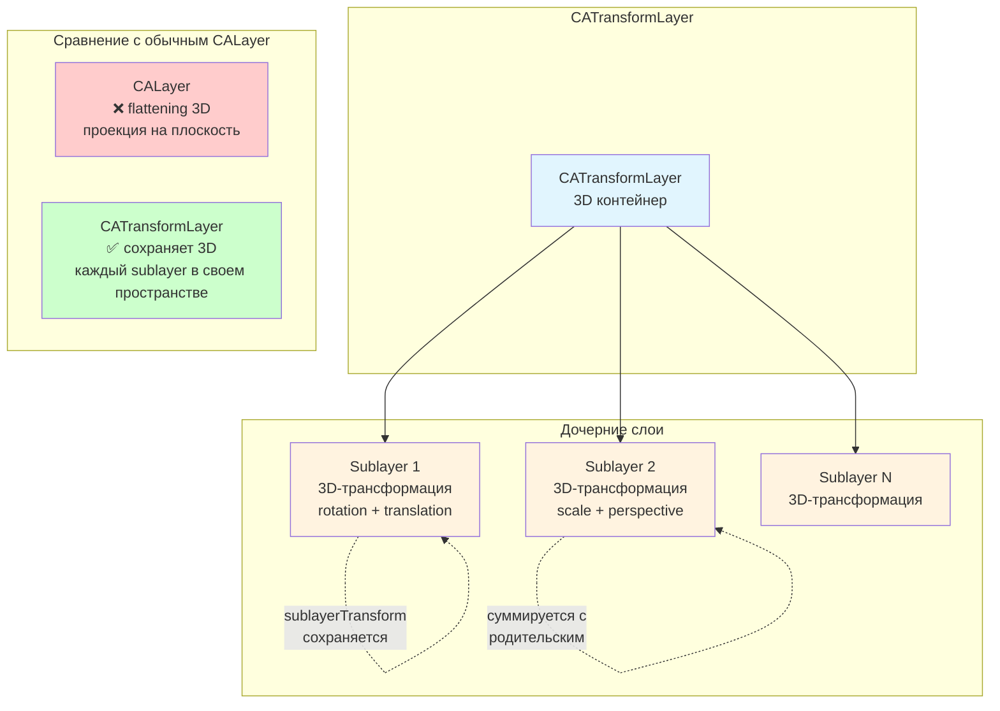

#core-animation #catransformlayer #3d #animation #ios #swift #layer

---

## CATransformLayer — Контейнер для 3D-иерархий

### Определение

**`CATransformLayer`** — это подкласс [[CALayer]] в [[Core Animation]], который служит **контейнером для 3D-трансформаций**. В отличие от обычного `CALayer`, `CATransformLayer` не сглаживает (flatten) трансформации своих дочерних слоёв в 2D-плоскость, а сохраняет их **трёхмерное положение и ориентацию** в пространстве .

Это делает `CATransformLayer` идеальным инструментом для создания сложных 3D-сцен, где каждый дочерний слой может быть независимо повёрнут, перемещён и масштабирован, а также наследовать трансформации родителя.

### Зачем это знать iOS-разработчику?

1.  **Создание 3D-сцен:** Построение объёмных объектов из нескольких слоёв (куб, пирамида, «карусель»).
2.  **Сохранение 3D-позиций:** Дочерние слои не проецируются на плоскость родителя.
3.  **Анимация групп:** Вращение всей группы объектов как единого целого.
4.  **Игровые движки:** Простые 3D-сцены без использования [[SceneKit]].
5.  **Спецэффекты:** 3D-галереи, вращающиеся ленты, «бесконечные» карусели.

---

### Архитектура и ключевые отличия от CALayer



| Характеристика | `CALayer` | `CATransformLayer` |
|---|---|---|
| **Сглаживание 3D** | ✅ (проецирует дочерние слои на плоскость) | ❌ (сохраняет 3D) |
| **Содержимое (contents)** | ✅ (может иметь изображение) | ❌ (только контейнер) |
| **Фон (backgroundColor)** | ✅ | ❌ |
| **Тень (shadow)** | ✅ | ❌ |
| **Геометрия** | 2D-прямоугольник | 3D-контейнер |

---

### Базовый пример: Плоский vs 3D-контейнер

```swift
import UIKit

class CompareLayersViewController: UIViewController {
    override func viewDidLoad() {
        super.viewDidLoad()
        
        // Обычный CALayer (сглаживает)
        let regularLayer = CALayer()
        regularLayer.frame = CGRect(x: 50, y: 100, width: 200, height: 200)
        regularLayer.backgroundColor = UIColor.lightGray.cgColor
        view.layer.addSublayer(regularLayer)
        
        let redLayer = CALayer()
        redLayer.frame = CGRect(x: 50, y: 50, width: 100, height: 100)
        redLayer.backgroundColor = UIColor.systemRed.cgColor
        regularLayer.addSublayer(redLayer)
        
        var regularTransform = CATransform3DIdentity
        regularTransform = CATransform3DRotate(regularTransform, .pi / 3, 0, 1, 0)
        regularLayer.transform = regularTransform
        
        // CATransformLayer (сохраняет 3D)
        let transformLayer = CATransformLayer()
        transformLayer.frame = CGRect(x: 50, y: 400, width: 200, height: 200)
        view.layer.addSublayer(transformLayer)
        
        let blueLayer = CALayer()
        blueLayer.frame = CGRect(x: 50, y: 50, width: 100, height: 100)
        blueLayer.backgroundColor = UIColor.systemBlue.cgColor
        transformLayer.addSublayer(blueLayer)
        
        var transform3D = CATransform3DIdentity
        transform3D = CATransform3DRotate(transform3D, .pi / 3, 0, 1, 0)
        transformLayer.transform = transform3D
    }
}
```

---

### Создание 3D-куба

```swift
class CubeViewController: UIViewController {
    var cubeLayer: CATransformLayer!
    
    override func viewDidLoad() {
        super.viewDidLoad()
        
        cubeLayer = CATransformLayer()
        cubeLayer.frame = CGRect(x: 100, y: 200, width: 200, height: 200)
        view.layer.addSublayer(cubeLayer)
        
        let size: CGFloat = 100
        let faceColors: [UIColor] = [.systemRed, .systemGreen, .systemBlue, .systemYellow, .systemOrange, .systemPurple]
        
        // Создаём 6 граней куба
        let front = createFace(size: size, color: faceColors[0])
        front.transform = CATransform3DMakeTranslation(0, 0, size / 2)
        cubeLayer.addSublayer(front)
        
        let back = createFace(size: size, color: faceColors[1])
        back.transform = CATransform3DMakeTranslation(0, 0, -size / 2)
        cubeLayer.addSublayer(back)
        
        let right = createFace(size: size, color: faceColors[2])
        right.transform = CATransform3DConcat(CATransform3DMakeTranslation(size / 2, 0, 0),
                                               CATransform3DMakeRotation(.pi / 2, 0, 1, 0))
        cubeLayer.addSublayer(right)
        
        let left = createFace(size: size, color: faceColors[3])
        left.transform = CATransform3DConcat(CATransform3DMakeTranslation(-size / 2, 0, 0),
                                              CATransform3DMakeRotation(-.pi / 2, 0, 1, 0))
        cubeLayer.addSublayer(left)
        
        let top = createFace(size: size, color: faceColors[4])
        top.transform = CATransform3DConcat(CATransform3DMakeTranslation(0, -size / 2, 0),
                                             CATransform3DMakeRotation(.pi / 2, 1, 0, 0))
        cubeLayer.addSublayer(top)
        
        let bottom = createFace(size: size, color: faceColors[5])
        bottom.transform = CATransform3DConcat(CATransform3DMakeTranslation(0, size / 2, 0),
                                                CATransform3DMakeRotation(-.pi / 2, 1, 0, 0))
        cubeLayer.addSublayer(bottom)
        
        // Перспектива
        var perspective = CATransform3DIdentity
        perspective.m34 = -1.0 / 500.0
        cubeLayer.transform = perspective
        
        // Анимация вращения куба
        let rotation = CABasicAnimation(keyPath: "transform.rotation.y")
        rotation.fromValue = 0
        rotation.toValue = CGFloat.pi * 2
        rotation.duration = 4
        rotation.repeatCount = .infinity
        cubeLayer.add(rotation, forKey: "rotateCube")
    }
    
    func createFace(size: CGFloat, color: UIColor) -> CALayer {
        let face = CALayer()
        face.frame = CGRect(x: -size / 2, y: -size / 2, width: size, height: size)
        face.backgroundColor = color.cgColor
        face.borderWidth = 1
        face.borderColor = UIColor.white.cgColor
        return face
    }
}
```

---

### 3D-Карусель изображений

```swift
class CarouselViewController: UIViewController {
    var carouselLayer: CATransformLayer!
    var imageViews: [CALayer] = []
    let itemCount = 8
    let radius: CGFloat = 150
    
    override func viewDidLoad() {
        super.viewDidLoad()
        
        carouselLayer = CATransformLayer()
        carouselLayer.frame = CGRect(x: view.bounds.midX - 150, y: 200, width: 300, height: 300)
        view.layer.addSublayer(carouselLayer)
        
        let angleStep = (2 * CGFloat.pi) / CGFloat(itemCount)
        
        for i in 0..<itemCount {
            let angle = angleStep * CGFloat(i)
            let imageLayer = CALayer()
            imageLayer.frame = CGRect(x: -60, y: -60, width: 120, height: 120)
            imageLayer.contents = UIImage(named: "image\(i+1)")?.cgImage
            imageLayer.cornerRadius = 12
            imageLayer.masksToBounds = true
            imageLayer.borderWidth = 2
            imageLayer.borderColor = UIColor.white.cgColor
            
            var transform = CATransform3DIdentity
            transform = CATransform3DTranslate(transform, 0, 0, -radius)
            transform = CATransform3DRotate(transform, angle, 0, 1, 0)
            imageLayer.transform = transform
            
            carouselLayer.addSublayer(imageLayer)
            imageViews.append(imageLayer)
        }
        
        var perspective = CATransform3DIdentity
        perspective.m34 = -1.0 / 500.0
        carouselLayer.transform = perspective
        
        let rotation = CABasicAnimation(keyPath: "transform.rotation.y")
        rotation.fromValue = 0
        rotation.toValue = CGFloat.pi * 2
        rotation.duration = 8
        rotation.repeatCount = .infinity
        carouselLayer.add(rotation, forKey: "carouselSpin")
    }
}
```

---

### Иерархия CATransformLayer (вложенные контейнеры)

```swift
class NestedTransformViewController: UIViewController {
    var rootLayer: CATransformLayer!
    var group1: CATransformLayer!
    var group2: CATransformLayer!
    
    override func viewDidLoad() {
        super.viewDidLoad()
        
        rootLayer = CATransformLayer()
        rootLayer.frame = view.bounds
        view.layer.addSublayer(rootLayer)
        
        group1 = CATransformLayer()
        group2 = CATransformLayer()
        
        rootLayer.addSublayer(group1)
        rootLayer.addSublayer(group2)
        
        // Красный кубик (группа 1)
        let redCube = createCube(size: 60, color: .systemRed)
        group1.addSublayer(redCube)
        
        // Синий кубик (группа 2)
        let blueCube = createCube(size: 60, color: .systemBlue)
        group2.addSublayer(blueCube)
        
        // Позиционируем группы
        group1.transform = CATransform3DMakeTranslation(-80, 0, 0)
        group2.transform = CATransform3DMakeTranslation(80, 0, 0)
        
        // Перспектива для всей сцены
        var perspective = CATransform3DIdentity
        perspective.m34 = -1.0 / 500.0
        perspective = CATransform3DRotate(perspective, .pi / 6, 0, 1, 0)
        rootLayer.transform = perspective
        
        // Анимация вращения групп
        let rotateGroup = CABasicAnimation(keyPath: "transform.rotation.y")
        rotateGroup.fromValue = 0
        rotateGroup.toValue = CGFloat.pi * 2
        rotateGroup.duration = 6
        rotateGroup.repeatCount = .infinity
        group1.add(rotateGroup, forKey: "rotateGroup1")
        group2.add(rotateGroup, forKey: "rotateGroup2")
    }
    
    func createCube(size: CGFloat, color: UIColor) -> CATransformLayer {
        let cube = CATransformLayer()
        let positions: [(x: CGFloat, y: CGFloat, z: CGFloat, rotX: CGFloat, rotY: CGFloat)] = [
            (0, 0, size/2, 0, 0),                      // front
            (0, 0, -size/2, 0, .pi),                   // back
            (size/2, 0, 0, 0, .pi/2),                  // right
            (-size/2, 0, 0, 0, -.pi/2),                // left
            (0, -size/2, 0, .pi/2, 0),                 // top
            (0, size/2, 0, -.pi/2, 0)                  // bottom
        ]
        
        for pos in positions {
            let face = CALayer()
            face.frame = CGRect(x: -size/2, y: -size/2, width: size, height: size)
            face.backgroundColor = color.cgColor
            face.borderWidth = 1
            face.borderColor = UIColor.white.cgColor
            
            var transform = CATransform3DIdentity
            transform = CATransform3DTranslate(transform, pos.x, pos.y, pos.z)
            transform = CATransform3DRotate(transform, pos.rotX, 1, 0, 0)
            transform = CATransform3DRotate(transform, pos.rotY, 0, 1, 0)
            face.transform = transform
            
            cube.addSublayer(face)
        }
        
        return cube
    }
}
```

---

### Анимация с изменением перспективы

```swift
class PerspectiveAnimationViewController: UIViewController {
    var transformLayer: CATransformLayer!
    var layers: [CALayer] = []
    
    override func viewDidLoad() {
        super.viewDidLoad()
        
        transformLayer = CATransformLayer()
        transformLayer.frame = CGRect(x: 50, y: 150, width: 300, height: 300)
        view.layer.addSublayer(transformLayer)
        
        for i in 0..<5 {
            let layer = CALayer()
            layer.frame = CGRect(x: -50, y: -50 + CGFloat(i) * 25, width: 100, height: 100)
            layer.backgroundColor = UIColor(hue: CGFloat(i) / 5, saturation: 0.8, brightness: 0.9, alpha: 1).cgColor
            layer.cornerRadius = 8
            transformLayer.addSublayer(layer)
            layers.append(layer)
        }
        
        // Начальная перспектива
        var perspective = CATransform3DIdentity
        perspective.m34 = -1.0 / 500.0
        transformLayer.transform = perspective
        
        let button = UIButton(frame: CGRect(x: 50, y: 500, width: 200, height: 50))
        button.setTitle("Изменить перспективу", for: .normal)
        button.backgroundColor = .systemBlue
        button.addTarget(self, action: #selector(animatePerspective), for: .touchUpInside)
        view.addSubview(button)
    }
    
    @objc func animatePerspective() {
        var newPerspective = CATransform3DIdentity
        newPerspective.m34 = -1.0 / 200.0  // Сильная перспектива
        
        let animation = CABasicAnimation(keyPath: "transform")
        animation.fromValue = transformLayer.transform
        animation.toValue = newPerspective
        animation.duration = 1.0
        animation.fillMode = .forwards
        animation.isRemovedOnCompletion = false
        
        transformLayer.add(animation, forKey: "perspectiveChange")
    }
}
```

---

### Лучшие практики

1.  **Используйте `CATransformLayer` только как контейнер** — он не имеет содержимого, фона, тени.
2.  **Для 3D-сцен всегда добавляйте перспективу** через `m34` на корневом слое.
3.  **Избегайте глубокой вложенности** `CATransformLayer` — это может снизить производительность.
4.  **Для анимации отдельных элементов комбинируйте `CATransformLayer` с `CABasicAnimation`.**
5.  **Если нужно интерактивное 3D, рассмотрите `SceneKit`** — он мощнее для сложных сцен.

---

### Итог

**`CATransformLayer`** — это специализированный слой для создания 3D-иерархий в Core Animation. Он позволяет:

1.  **Сохранять 3D-позиции** дочерних слоёв (не сглаживает их в плоскость).
2.  **Создавать объёмные объекты** (кубы, пирамиды, карусели).
3.  **Группировать трансформации** и анимировать группы как единое целое.
4.  **Строить сложные 3D-сцены** с вложенными контейнерами.
5.  **Работать в паре с `CATransform3D`** для полного контроля над трансформациями.

Понимание `CATransformLayer` необходимо для создания сложных 3D-эффектов и анимаций, которые невозможно реализовать с обычными `CALayer`.