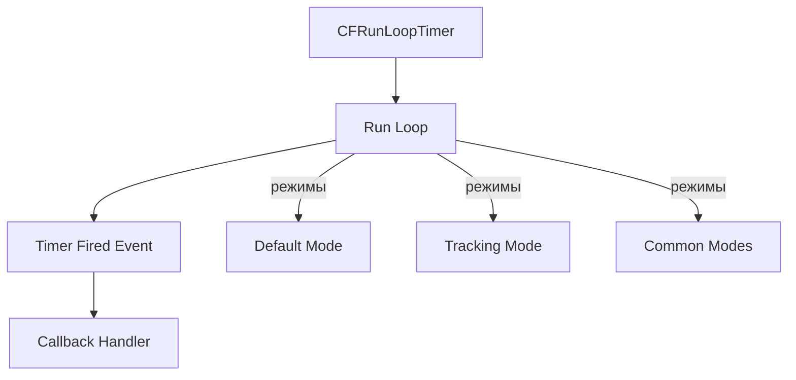

#core-foundation #cfrunlooptimer #timer #concurrency #ios #swift #runloop

---

## CFRunLoopTimer — Таймеры в [[Core Foundation]]

### Определение

**`CFRunLoopTimer`** — это таймер в Core Foundation (низкоуровневый C [[API]]), который привязан к **run loop**. Он генерирует события через заданные интервалы времени, позволяя выполнять код периодически или однократно с задержкой. В современной разработке на [[Swift]] чаще используется [[Timer]] (обёртка над `CFRunLoopTimer`), но прямой доступ к `CFRunLoopTimer` даёт больше контроля и используется в некоторых системных API.

### Зачем это знать iOS-разработчику?

1.  **Низкоуровневый контроль:** Прямое управление run loop, режимами, точностью.
2.  **Интеграция с Core Foundation:** Некоторые C-библиотеки требуют `CFRunLoopTimer`.
3.  **Понимание `Timer`:** `Timer` — это просто обёртка над `CFRunLoopTimer`.
4.  **Высокая точность:** Возможность задавать tolerance (допуск).
5.  **Работа с run loop:** Понимание того, как таймеры взаимодействуют с run loop.

---

### Архитектура



---

### Создание CFRunLoopTimer

#### 1. **С помощью `CFRunLoopTimerCreateWithHandler` (Swift)**

```swift
import Foundation

func createTimer() -> CFRunLoopTimer {
    let interval: CFTimeInterval = 2.0
    let fireDate = CFAbsoluteTimeGetCurrent() + interval
    
    let timer = CFRunLoopTimerCreateWithHandler(
        kCFAllocatorDefault,
        fireDate,
        interval,
        0,  // flags (резерв, всегда 0)
        0   // order (резерв)
    ) { timer in
        print("Timer fired at \(Date())")
    }
    
    return timer!
}
```

#### 2. **С помощью `CFRunLoopTimerCreate` (низкоуровневый C)**

```swift
func createTimerLowLevel() -> CFRunLoopTimer {
    var context = CFRunLoopTimerContext(
        version: 0,
        info: nil,
        retain: nil,
        release: nil,
        copyDescription: nil
    )
    
    let timer = CFRunLoopTimerCreate(
        kCFAllocatorDefault,
        CFAbsoluteTimeGetCurrent() + 1.0,  // fireDate
        1.0,                               // interval
        0,                                 // flags
        0,                                 // order
        { (timer, info) in                 // callback
            print("Low-level timer fired")
        },
        &context
    )
    
    return timer!
}
```

---

### Настройка таймера

| Параметр | Тип | Описание |
|---|---|---|
| **`fireDate`** | `CFAbsoluteTime` | Абсолютное время первого срабатывания (`CFAbsoluteTimeGetCurrent() + delay`). |
| **`interval`** | `CFTimeInterval` | Интервал между срабатываниями. `0` — однократный таймер. |
| **`tolerance`** | `CFTimeInterval` | Допуск на задержку (для оптимизации энергопотребления). |
| **`repeatCount`** | `CFIndex` | Количество повторений (можно установить через `CFRunLoopTimerSetRepeatCount`). |

---

### Управление таймером

#### 1. **Добавление в run loop**

```swift
let timer = createTimer()
let runLoop = CFRunLoopGetCurrent()
CFRunLoopAddTimer(runLoop, timer, .commonModes)
```

#### 2. **Остановка и инвалидация**

```swift
CFRunLoopTimerInvalidate(timer)  // Останавливает и удаляет из run loop
```

#### 3. **Проверка активности**

```swift
let isValid = CFRunLoopTimerIsValid(timer)
print("Timer is valid: \(isValid)")
```

#### 4. **Принудительный запуск**

```swift
CFRunLoopTimerFire(timer)  // Принудительно запускает таймер (обычно не нужно)
```

---

### Режимы run loop

| Режим | Описание |
|---|---|
| **`.defaultMode`** | Обычный режим (не во время скролла). |
| **`.trackingMode`** | Во время скролла (например, `UIScrollView`). |
| **`.commonModes`** | Комбинация default + tracking (таймер работает всегда). |

```swift
// Таймер не будет работать во время скролла
CFRunLoopAddTimer(runLoop, timer, .defaultMode)

// Таймер будет работать всегда (включая скролл)
CFRunLoopAddTimer(runLoop, timer, .commonModes)
```

---

### Примеры кода

#### 1. **Периодический таймер**

```swift
class PeriodicTimerViewController: UIViewController {
    var timer: CFRunLoopTimer?
    
    override func viewDidLoad() {
        super.viewDidLoad()
        startTimer()
    }
    
    func startTimer() {
        let interval: CFTimeInterval = 1.0
        let fireDate = CFAbsoluteTimeGetCurrent() + interval
        
        timer = CFRunLoopTimerCreateWithHandler(
            kCFAllocatorDefault,
            fireDate,
            interval,
            0, 0
        ) { [weak self] _ in
            print("Timer fired at \(Date())")
            self?.updateUI()
        }
        
        if let timer = timer {
            CFRunLoopAddTimer(CFRunLoopGetMain(), timer, .commonModes)
        }
    }
    
    func updateUI() {
        DispatchQueue.main.async {
            // Обновление UI
        }
    }
    
    deinit {
        if let timer = timer {
            CFRunLoopTimerInvalidate(timer)
        }
    }
}
```

#### 2. **Однократный таймер (delay)**

```swift
func delay(seconds: TimeInterval, completion: @escaping () -> Void) {
    let fireDate = CFAbsoluteTimeGetCurrent() + seconds
    let timer = CFRunLoopTimerCreateWithHandler(
        kCFAllocatorDefault,
        fireDate,
        0,  // interval = 0 → однократный
        0, 0
    ) { _ in
        completion()
    }
    
    if let timer = timer {
        CFRunLoopAddTimer(CFRunLoopGetMain(), timer, .commonModes)
    }
}

// Использование
delay(seconds: 2) {
    print("Executed after 2 seconds")
}
```

#### 3. **Таймер с tolerance (экономия энергии)**

```swift
func createEnergyEfficientTimer() -> CFRunLoopTimer {
    let interval: CFTimeInterval = 1.0
    let fireDate = CFAbsoluteTimeGetCurrent() + interval
    
    let timer = CFRunLoopTimerCreateWithHandler(
        kCFAllocatorDefault,
        fireDate,
        interval,
        0, 0
    ) { _ in
        print("Timer fired")
    }
    
    // Устанавливаем допуск до 0.1 секунды
    CFRunLoopTimerSetTolerance(timer!, 0.1)
    
    return timer!
}
```

#### 4. **Таймер с ограниченным количеством повторений**

```swift
func createLimitedTimer(repeatCount: Int) -> CFRunLoopTimer? {
    var counter = 0
    
    let fireDate = CFAbsoluteTimeGetCurrent() + 1.0
    let timer = CFRunLoopTimerCreateWithHandler(
        kCFAllocatorDefault,
        fireDate,
        1.0,
        0, 0
    ) { timer in
        counter += 1
        print("Fired \(counter) time(s)")
        
        if counter >= repeatCount {
            CFRunLoopTimerInvalidate(timer)
            print("Timer invalidated")
        }
    }
    
    return timer
}
```

---

### CFRunLoopTimer vs Timer (NSTimer)

| Характеристика | `Timer` (Swift) | `CFRunLoopTimer` (Core Foundation) |
|---|---|---|
| **Уровень API** | Высокоуровневый | Низкоуровневый (C) |
| **Управление памятью** | ARC | Ручное (CFRelease) |
| **Создание** | `Timer.scheduledTimer(...)` | `CFRunLoopTimerCreateWithHandler` |
| **Поддержка замыканий** | ✅ | ✅ (через `WithHandler`) |
| **Управление run loop** | Через `RunLoop` | Через `CFRunLoop` |
| **Tolerance** | ✅ | ✅ |
| **Интеграция с Swift** | ✅ (естественная) | ❌ (требует обёрток) |

**Рекомендация:** В 95% случаев используйте `Timer`. `CFRunLoopTimer` нужен только при работе с чистыми C-библиотеками или для очень тонкой настройки.

---

### Лучшие практики

1.  **Всегда инвалидируйте таймер в `deinit`**, чтобы избежать retain cycles.
2.  **Используйте `[weak self]` в замыканиях** для предотвращения утечек памяти.
3.  **Для повторяющихся UI-обновлений используйте `CADisplayLink`** — он синхронизирован с частотой кадров.
4.  **Для длительных фоновых задач используйте `DispatchQueue`**, а не таймеры.
5.  **Задавайте `tolerance`** для некритичных таймеров (экономия батареи).

```swift
// Правильно: слабая ссылка
let timer = CFRunLoopTimerCreateWithHandler(...) { [weak self] _ in
    self?.doSomething()
}

// Неправильно: сильная ссылка → утечка
let timer = CFRunLoopTimerCreateWithHandler(...) { _ in
    self.doSomething()  // retain cycle
}
```

---

### Распространённые ошибки

1.  **Забытая инвалидация таймера** → объект не освобождается.
2.  **Добавление таймера в run loop после инвалидации** → не работает.
3.  **Неправильный режим run loop** → таймер не срабатывает во время скролла.
4.  **Слишком маленький интервал** (< 0.01 сек) → нагрузка на [[CPU]].

---

### Итог

**`CFRunLoopTimer`** — это фундаментальный механизм таймеров в Core Foundation, лежащий в основе `Timer`. Он предоставляет:

1.  **Низкоуровневый контроль** над таймерами и run loop.
2.  **Гибкую настройку** (интервал, задержка, допуск, режимы).
3.  **Интеграцию с C API** и системными библиотеками.
4.  **Возможность привязки к run loop** для синхронизации с UI.

Несмотря на свою мощность, в повседневной разработке на Swift предпочтительнее использовать `Timer`. `CFRunLoopTimer` остаётся инструментом для специальных случаев: работа с чистыми C-библиотеками, низкоуровневая отладка или системное программирование.