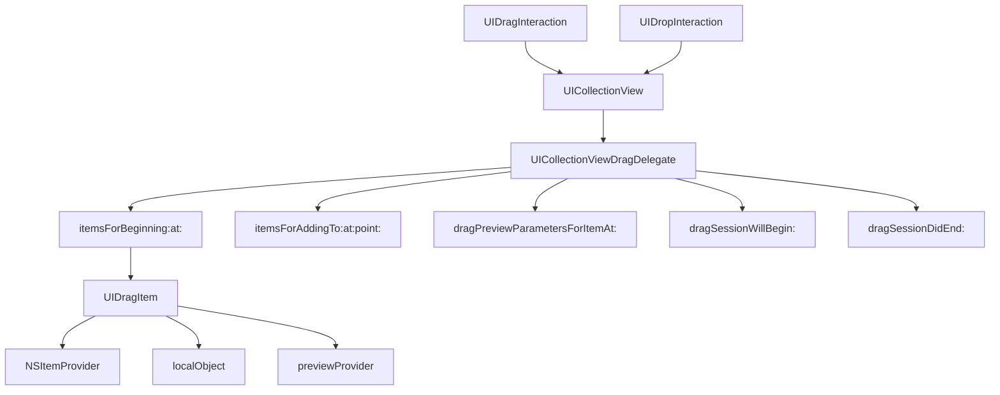

#UICollectionViewDragDelegate #UIKit #iOS #Swift #UICollectionView #DragAndDrop #iPad #NSItemProvider #UIDragItem

---
**(делегат перетаскивания для коллекции / управление Drag & Drop в [[UICollectionView]])**

`UICollectionViewDragDelegate` — это протокол из фреймворка **[[UIKit]]**, который позволяет **включить поддержку перетаскивания (Drag & Drop)** для `UICollectionView`. Он определяет методы для предоставления данных, настройки визуального отображения перетаскиваемых элементов и управления анимацией во время перетаскивания.

**Ключевые особенности (важно в 2026):**
- Появился в **[[iOS]] 11.0+** вместе с фреймворком Drag & Drop на iPad
- Работает в паре с `UICollectionViewDropDelegate` для приёма данных
- Позволяет перетаскивать элементы **внутри** коллекции, **между** коллекциями и **в другие приложения**
- Предоставляет гибкие методы для **кастомизации** внешнего вида во время перетаскивания
- Поддерживает **множественный выбор** элементов для перетаскивания

---

### Основные методы UICollectionViewDragDelegate

| Метод | Назначение | Обязательный |
|-------|------------|--------------|
| `collectionView(_:itemsForBeginning:at:)` | Предоставляет элементы для перетаскивания | ✅ Да |
| `collectionView(_:itemsForAddingTo:at:point:)` | Добавление элементов в существующую сессию | ❌ Нет |
| `collectionView(_:dragPreviewParametersForItemAt:)` | Настройка превью для перетаскиваемого элемента | ❌ Нет |
| `collectionView(_:dragSessionWillBegin:)` | Уведомление о начале сессии перетаскивания | ❌ Нет |
| `collectionView(_:dragSessionDidEnd:)` | Уведомление о завершении сессии | ❌ Нет |
| `collectionView(_:dragSessionAllowsMoveOperation:)` | Разрешение операции перемещения | ❌ Нет |
| `collectionView(_:dragSessionIsRestrictedToDraggingApplication:)` | Ограничение перетаскивания только внутри приложения | ❌ Нет |

---

### Схема взаимосвязей



---

### Примеры (от простого к сложному)

#### 1. Базовое перетаскивание в коллекции
```swift
import UIKit

class BasicDragCollectionViewController: UIViewController,
                                         UICollectionViewDataSource,
                                         UICollectionViewDelegate,
                                         UICollectionViewDragDelegate {
    
    private var collectionView: UICollectionView!
    private var items = ["Apple", "Banana", "Cherry", "Date", "Elderberry"]
    
    override func viewDidLoad() {
        super.viewDidLoad()
        setupCollectionView()
    }
    
    private func setupCollectionView() {
        let layout = UICollectionViewFlowLayout()
        layout.itemSize = CGSize(width: 100, height: 50)
        layout.scrollDirection = .vertical
        layout.sectionInset = UIEdgeInsets(top: 20, left: 20, bottom: 20, right: 20)
        
        collectionView = UICollectionView(frame: view.bounds, collectionViewLayout: layout)
        collectionView.backgroundColor = .systemBackground
        collectionView.dataSource = self
        collectionView.delegate = self
        collectionView.register(UICollectionViewCell.self, forCellWithReuseIdentifier: "Cell")
        
        // Включаем Drag & Drop
        collectionView.dragDelegate = self
        collectionView.dragInteractionEnabled = true
        
        view.addSubview(collectionView)
    }
    
    // MARK: - UICollectionViewDataSource
    
    func collectionView(_ collectionView: UICollectionView, numberOfItemsInSection section: Int) -> Int {
        return items.count
    }
    
    func collectionView(_ collectionView: UICollectionView, cellForItemAt indexPath: IndexPath) -> UICollectionViewCell {
        let cell = collectionView.dequeueReusableCell(withReuseIdentifier: "Cell", for: indexPath)
        cell.backgroundColor = .systemBlue
        cell.layer.cornerRadius = 8
        
        let label = UILabel(frame: cell.bounds)
        label.text = items[indexPath.item]
        label.textColor = .white
        label.textAlignment = .center
        label.font = .systemFont(ofSize: 16, weight: .medium)
        cell.contentView.addSubview(label)
        
        return cell
    }
    
    // MARK: - UICollectionViewDragDelegate
    
    func collectionView(_ collectionView: UICollectionView,
                        itemsForBeginning session: UIDragSession,
                        at indexPath: IndexPath) -> [UIDragItem] {
        // 1. Получаем данные для перетаскивания
        let item = items[indexPath.item]
        
        // 2. Создаем NSItemProvider
        let itemProvider = NSItemProvider(object: item as NSString)
        
        // 3. Создаем UIDragItem
        let dragItem = UIDragItem(itemProvider: itemProvider)
        
        // 4. Сохраняем индекс как локальный объект для быстрого доступа
        dragItem.localObject = indexPath
        
        return [dragItem]
    }
}
```

#### 2. Перетаскивание с поддержкой множественного выбора
```swift
class MultipleSelectionDragViewController: UIViewController,
                                           UICollectionViewDataSource,
                                           UICollectionViewDelegate,
                                           UICollectionViewDragDelegate {
    
    private var collectionView: UICollectionView!
    private var items = ["Item 1", "Item 2", "Item 3", "Item 4", "Item 5", "Item 6"]
    
    override func viewDidLoad() {
        super.viewDidLoad()
        setupCollectionView()
        
        // Включаем множественный выбор
        collectionView.allowsMultipleSelection = true
    }
    
    private func setupCollectionView() {
        let layout = UICollectionViewFlowLayout()
        layout.itemSize = CGSize(width: 120, height: 60)
        layout.scrollDirection = .vertical
        layout.sectionInset = UIEdgeInsets(top: 20, left: 20, bottom: 20, right: 20)
        
        collectionView = UICollectionView(frame: view.bounds, collectionViewLayout: layout)
        collectionView.backgroundColor = .systemBackground
        collectionView.dataSource = self
        collectionView.delegate = self
        collectionView.register(UICollectionViewCell.self, forCellWithReuseIdentifier: "Cell")
        collectionView.dragDelegate = self
        collectionView.dragInteractionEnabled = true
        view.addSubview(collectionView)
    }
    
    // MARK: - UICollectionViewDataSource
    
    func collectionView(_ collectionView: UICollectionView, numberOfItemsInSection section: Int) -> Int {
        return items.count
    }
    
    func collectionView(_ collectionView: UICollectionView, cellForItemAt indexPath: IndexPath) -> UICollectionViewCell {
        let cell = collectionView.dequeueReusableCell(withReuseIdentifier: "Cell", for: indexPath)
        cell.backgroundColor = .systemGreen
        cell.layer.cornerRadius = 8
        
        let label = UILabel(frame: cell.bounds)
        label.text = items[indexPath.item]
        label.textColor = .white
        label.textAlignment = .center
        label.font = .systemFont(ofSize: 16, weight: .medium)
        cell.contentView.addSubview(label)
        
        // Визуализация выбранного состояния
        let isSelected = collectionView.indexPathsForSelectedItems?.contains(indexPath) ?? false
        cell.layer.borderWidth = isSelected ? 3 : 0
        cell.layer.borderColor = isSelected ? UIColor.systemYellow.cgColor : nil
        
        return cell
    }
    
    // MARK: - UICollectionViewDragDelegate
    
    func collectionView(_ collectionView: UICollectionView,
                        itemsForBeginning session: UIDragSession,
                        at indexPath: IndexPath) -> [UIDragItem] {
        return createDragItems(for: [indexPath])
    }
    
    func collectionView(_ collectionView: UICollectionView,
                        itemsForAddingTo session: UIDragSession,
                        at indexPath: IndexPath,
                        point: CGPoint) -> [UIDragItem] {
        // 1. Получаем уже выбранные элементы
        let selectedIndexPaths = collectionView.indexPathsForSelectedItems ?? []
        
        // 2. Проверяем, не перетаскивается ли уже этот индекс
        let dragIndexPaths = session.items.compactMap { $0.localObject as? IndexPath }
        let allIndexPaths = Set(selectedIndexPaths + [indexPath])
        let newIndexPaths = allIndexPaths.filter { !dragIndexPaths.contains($0) }
        
        return createDragItems(for: Array(newIndexPaths))
    }
    
    private func createDragItems(for indexPaths: [IndexPath]) -> [UIDragItem] {
        return indexPaths.map { indexPath in
            let item = items[indexPath.item]
            let itemProvider = NSItemProvider(object: item as NSString)
            let dragItem = UIDragItem(itemProvider: itemProvider)
            dragItem.localObject = indexPath
            return dragItem
        }
    }
    
    func collectionView(_ collectionView: UICollectionView,
                        dragSessionWillBegin session: UIDragSession) {
        print("🔄 Сессия перетаскивания началась")
    }
    
    func collectionView(_ collectionView: UICollectionView,
                        dragSessionDidEnd session: UIDragSession) {
        print("✅ Сессия перетаскивания завершена")
    }
}
```

#### 3. Кастомизация превью при перетаскивании
```swift
class CustomPreviewDragViewController: UIViewController,
                                       UICollectionViewDataSource,
                                       UICollectionViewDelegate,
                                       UICollectionViewDragDelegate {
    
    private var collectionView: UICollectionView!
    private let colors: [UIColor] = [.systemRed, .systemBlue, .systemGreen, .systemOrange, .systemPurple]
    
    override func viewDidLoad() {
        super.viewDidLoad()
        setupCollectionView()
    }
    
    private func setupCollectionView() {
        let layout = UICollectionViewFlowLayout()
        layout.itemSize = CGSize(width: 80, height: 80)
        layout.scrollDirection = .vertical
        layout.sectionInset = UIEdgeInsets(top: 20, left: 20, bottom: 20, right: 20)
        
        collectionView = UICollectionView(frame: view.bounds, collectionViewLayout: layout)
        collectionView.backgroundColor = .systemBackground
        collectionView.dataSource = self
        collectionView.delegate = self
        collectionView.register(UICollectionViewCell.self, forCellWithReuseIdentifier: "Cell")
        collectionView.dragDelegate = self
        collectionView.dragInteractionEnabled = true
        view.addSubview(collectionView)
    }
    
    func collectionView(_ collectionView: UICollectionView, numberOfItemsInSection section: Int) -> Int {
        return colors.count
    }
    
    func collectionView(_ collectionView: UICollectionView, cellForItemAt indexPath: IndexPath) -> UICollectionViewCell {
        let cell = collectionView.dequeueReusableCell(withReuseIdentifier: "Cell", for: indexPath)
        cell.backgroundColor = colors[indexPath.item]
        cell.layer.cornerRadius = 40
        return cell
    }
    
    // MARK: - UICollectionViewDragDelegate
    
    func collectionView(_ collectionView: UICollectionView,
                        itemsForBeginning session: UIDragSession,
                        at indexPath: IndexPath) -> [UIDragItem] {
        let color = colors[indexPath.item]
        let itemProvider = NSItemProvider(object: color.description as NSString)
        let dragItem = UIDragItem(itemProvider: itemProvider)
        dragItem.localObject = indexPath
        
        // 1. Настраиваем кастомное превью
        dragItem.previewProvider = { [weak self] in
            guard let self = self else { return nil }
            
            let cell = self.collectionView.cellForItem(at: indexPath)
            
            // 2. Создаем превью с тенью
            let previewView = UIView()
            previewView.backgroundColor = self.colors[indexPath.item]
            previewView.frame = CGRect(x: 0, y: 0, width: 80, height: 80)
            previewView.layer.cornerRadius = 40
            previewView.layer.shadowColor = UIColor.black.cgColor
            previewView.layer.shadowOpacity = 0.4
            previewView.layer.shadowOffset = CGSize(width: 0, height: 6)
            previewView.layer.shadowRadius = 12
            
            // 3. Добавляем текст на превью
            let label = UILabel(frame: previewView.bounds)
            label.text = "🎨"
            label.textAlignment = .center
            label.font = .systemFont(ofSize: 40)
            previewView.addSubview(label)
            
            return UIDragPreview(view: previewView)
        }
        
        return [dragItem]
    }
    
    func collectionView(_ collectionView: UICollectionView,
                        dragPreviewParametersForItemAt indexPath: IndexPath) -> UIDragPreviewParameters? {
        // 4. Настраиваем параметры превью (например, скругление)
        let parameters = UIDragPreviewParameters()
        parameters.visiblePath = UIBezierPath(roundedRect: CGRect(x: 0, y: 0, width: 80, height: 80),
                                              cornerRadius: 40)
        return parameters
    }
}
```

#### 4. Перетаскивание между двумя коллекциями
```swift
class TwoCollectionDragViewController: UIViewController,
                                       UICollectionViewDataSource,
                                       UICollectionViewDelegate,
                                       UICollectionViewDragDelegate {
    
    private var leftCollectionView: UICollectionView!
    private var rightCollectionView: UICollectionView!
    private var leftItems = ["A1", "A2", "A3", "A4"]
    private var rightItems = ["B1", "B2", "B3"]
    
    override func viewDidLoad() {
        super.viewDidLoad()
        setupCollections()
    }
    
    private func setupCollections() {
        let layout = UICollectionViewFlowLayout()
        layout.itemSize = CGSize(width: 80, height: 50)
        layout.scrollDirection = .vertical
        layout.sectionInset = UIEdgeInsets(top: 10, left: 10, bottom: 10, right: 10)
        
        // Левая коллекция
        leftCollectionView = UICollectionView(frame: CGRect(x: 0, y: 0, width: view.bounds.width / 2, height: view.bounds.height),
                                              collectionViewLayout: layout)
        leftCollectionView.backgroundColor = .systemGray6
        leftCollectionView.dataSource = self
        leftCollectionView.delegate = self
        leftCollectionView.register(UICollectionViewCell.self, forCellWithReuseIdentifier: "LeftCell")
        leftCollectionView.dragDelegate = self
        leftCollectionView.dropDelegate = self as? UICollectionViewDropDelegate
        leftCollectionView.dragInteractionEnabled = true
        view.addSubview(leftCollectionView)
        
        // Правая коллекция
        rightCollectionView = UICollectionView(frame: CGRect(x: view.bounds.width / 2, y: 0, width: view.bounds.width / 2, height: view.bounds.height),
                                               collectionViewLayout: layout)
        rightCollectionView.backgroundColor = .systemGray5
        rightCollectionView.dataSource = self
        rightCollectionView.delegate = self
        rightCollectionView.register(UICollectionViewCell.self, forCellWithReuseIdentifier: "RightCell")
        rightCollectionView.dragDelegate = self
        rightCollectionView.dropDelegate = self as? UICollectionViewDropDelegate
        rightCollectionView.dragInteractionEnabled = true
        view.addSubview(rightCollectionView)
    }
    
    // MARK: - UICollectionViewDataSource
    
    func collectionView(_ collectionView: UICollectionView, numberOfItemsInSection section: Int) -> Int {
        if collectionView == leftCollectionView {
            return leftItems.count
        } else {
            return rightItems.count
        }
    }
    
    func collectionView(_ collectionView: UICollectionView, cellForItemAt indexPath: IndexPath) -> UICollectionViewCell {
        let isLeft = collectionView == leftCollectionView
        let cell = collectionView.dequeueReusableCell(withReuseIdentifier: isLeft ? "LeftCell" : "RightCell", for: indexPath)
        cell.backgroundColor = isLeft ? .systemBlue : .systemGreen
        cell.layer.cornerRadius = 8
        
        let label = UILabel(frame: cell.bounds)
        label.text = isLeft ? leftItems[indexPath.item] : rightItems[indexPath.item]
        label.textColor = .white
        label.textAlignment = .center
        label.font = .systemFont(ofSize: 14, weight: .medium)
        cell.contentView.addSubview(label)
        
        return cell
    }
    
    // MARK: - UICollectionViewDragDelegate
    
    func collectionView(_ collectionView: UICollectionView,
                        itemsForBeginning session: UIDragSession,
                        at indexPath: IndexPath) -> [UIDragItem] {
        let item: String
        if collectionView == leftCollectionView {
            item = leftItems[indexPath.item]
        } else {
            item = rightItems[indexPath.item]
        }
        
        let itemProvider = NSItemProvider(object: item as NSString)
        let dragItem = UIDragItem(itemProvider: itemProvider)
        dragItem.localObject = ["collection": collectionView == leftCollectionView ? "left" : "right",
                                "index": indexPath.item]
        return [dragItem]
    }
    
    func collectionView(_ collectionView: UICollectionView,
                        dragSessionIsRestrictedToDraggingApplication session: UIDragSession) -> Bool {
        // Ограничиваем перетаскивание только в пределах приложения
        return true
    }
    
    func collectionView(_ collectionView: UICollectionView,
                        dragSessionAllowsMoveOperation session: UIDragSession) -> Bool {
        // Разрешаем операцию перемещения
        return true
    }
}
```

#### 5. Перетаскивание с анимацией и обратной связью
```swift
class AnimatedDragViewController: UIViewController,
                                  UICollectionViewDataSource,
                                  UICollectionViewDelegate,
                                  UICollectionViewDragDelegate {
    
    private var collectionView: UICollectionView!
    private var items = ["⚽️", "🏀", "🏈", "⚾️", "🎾", "🏐"]
    
    override func viewDidLoad() {
        super.viewDidLoad()
        setupCollectionView()
    }
    
    private func setupCollectionView() {
        let layout = UICollectionViewFlowLayout()
        layout.itemSize = CGSize(width: 100, height: 100)
        layout.scrollDirection = .vertical
        layout.sectionInset = UIEdgeInsets(top: 20, left: 20, bottom: 20, right: 20)
        
        collectionView = UICollectionView(frame: view.bounds, collectionViewLayout: layout)
        collectionView.backgroundColor = .systemBackground
        collectionView.dataSource = self
        collectionView.delegate = self
        collectionView.register(UICollectionViewCell.self, forCellWithReuseIdentifier: "Cell")
        collectionView.dragDelegate = self
        collectionView.dragInteractionEnabled = true
        view.addSubview(collectionView)
    }
    
    func collectionView(_ collectionView: UICollectionView, numberOfItemsInSection section: Int) -> Int {
        return items.count
    }
    
    func collectionView(_ collectionView: UICollectionView, cellForItemAt indexPath: IndexPath) -> UICollectionViewCell {
        let cell = collectionView.dequeueReusableCell(withReuseIdentifier: "Cell", for: indexPath)
        cell.backgroundColor = .systemGray6
        cell.layer.cornerRadius = 50
        
        let label = UILabel(frame: cell.bounds)
        label.text = items[indexPath.item]
        label.textAlignment = .center
        label.font = .systemFont(ofSize: 40)
        cell.contentView.addSubview(label)
        
        return cell
    }
    
    // MARK: - UICollectionViewDragDelegate
    
    func collectionView(_ collectionView: UICollectionView,
                        itemsForBeginning session: UIDragSession,
                        at indexPath: IndexPath) -> [UIDragItem] {
        let item = items[indexPath.item]
        let itemProvider = NSItemProvider(object: item as NSString)
        let dragItem = UIDragItem(itemProvider: itemProvider)
        dragItem.localObject = indexPath
        
        // Анимация при начале перетаскивания
        UIView.animate(withDuration: 0.3) {
            if let cell = collectionView.cellForItem(at: indexPath) {
                cell.transform = CGAffineTransform(scaleX: 0.8, y: 0.8)
                cell.alpha = 0.5
            }
        }
        
        return [dragItem]
    }
    
    func collectionView(_ collectionView: UICollectionView,
                        dragSessionDidEnd session: UIDragSession) {
        // Восстанавливаем все ячейки после завершения перетаскивания
        UIView.animate(withDuration: 0.3) {
            for visibleCell in collectionView.visibleCells {
                visibleCell.transform = .identity
                visibleCell.alpha = 1.0
            }
        }
    }
}
```

#### 6. Полный пример с поддержкой Drop (полный цикл)
```swift
class FullDragDropViewController: UIViewController,
                                  UICollectionViewDataSource,
                                  UICollectionViewDelegate,
                                  UICollectionViewDragDelegate,
                                  UICollectionViewDropDelegate {
    
    private var collectionView: UICollectionView!
    private var items = ["Item 1", "Item 2", "Item 3", "Item 4", "Item 5"]
    
    override func viewDidLoad() {
        super.viewDidLoad()
        setupCollectionView()
    }
    
    private func setupCollectionView() {
        let layout = UICollectionViewFlowLayout()
        layout.itemSize = CGSize(width: 150, height: 60)
        layout.scrollDirection = .vertical
        layout.sectionInset = UIEdgeInsets(top: 20, left: 20, bottom: 20, right: 20)
        
        collectionView = UICollectionView(frame: view.bounds, collectionViewLayout: layout)
        collectionView.backgroundColor = .systemBackground
        collectionView.dataSource = self
        collectionView.delegate = self
        collectionView.register(UICollectionViewCell.self, forCellWithReuseIdentifier: "Cell")
        collectionView.dragDelegate = self
        collectionView.dropDelegate = self
        collectionView.dragInteractionEnabled = true
        view.addSubview(collectionView)
    }
    
    // MARK: - UICollectionViewDataSource
    
    func collectionView(_ collectionView: UICollectionView, numberOfItemsInSection section: Int) -> Int {
        return items.count
    }
    
    func collectionView(_ collectionView: UICollectionView, cellForItemAt indexPath: IndexPath) -> UICollectionViewCell {
        let cell = collectionView.dequeueReusableCell(withReuseIdentifier: "Cell", for: indexPath)
        cell.backgroundColor = .systemBlue
        cell.layer.cornerRadius = 8
        
        let label = UILabel(frame: cell.bounds)
        label.text = items[indexPath.item]
        label.textColor = .white
        label.textAlignment = .center
        label.font = .systemFont(ofSize: 16, weight: .medium)
        cell.contentView.addSubview(label)
        
        return cell
    }
    
    // MARK: - UICollectionViewDragDelegate
    
    func collectionView(_ collectionView: UICollectionView,
                        itemsForBeginning session: UIDragSession,
                        at indexPath: IndexPath) -> [UIDragItem] {
        let item = items[indexPath.item]
        let itemProvider = NSItemProvider(object: item as NSString)
        let dragItem = UIDragItem(itemProvider: itemProvider)
        dragItem.localObject = indexPath
        return [dragItem]
    }
    
    func collectionView(_ collectionView: UICollectionView,
                        dragSessionAllowsMoveOperation session: UIDragSession) -> Bool {
        return true
    }
    
    // MARK: - UICollectionViewDropDelegate
    
    func collectionView(_ collectionView: UICollectionView,
                        canHandle session: UIDropSession) -> Bool {
        return session.canLoadObjects(ofClass: NSString.self)
    }
    
    func collectionView(_ collectionView: UICollectionView,
                        dropSessionDidUpdate session: UIDropSession,
                        withDestinationIndexPath destinationIndexPath: IndexPath?) -> UICollectionViewDropProposal {
        if session.localDragSession != nil {
            // Перетаскивание внутри приложения
            return UICollectionViewDropProposal(operation: .move, intent: .insertAtDestinationIndexPath)
        } else {
            // Перетаскивание из другого приложения
            return UICollectionViewDropProposal(operation: .copy, intent: .insertAtDestinationIndexPath)
        }
    }
    
    func collectionView(_ collectionView: UICollectionView,
                        performDropWith coordinator: UICollectionViewDropCoordinator) {
        let destinationIndexPath = coordinator.destinationIndexPath ?? IndexPath(item: items.count, section: 0)
        
        for item in coordinator.items {
            if let sourceIndexPath = item.sourceIndexPath,
               let dragItem = item.dragItem,
               let localObject = dragItem.localObject as? IndexPath {
                
                // 1. Перемещение внутри коллекции
                collectionView.performBatchUpdates {
                    let sourceItem = items.remove(at: localObject.item)
                    let destinationItem = destinationIndexPath.item
                    
                    if destinationItem > items.count {
                        items.append(sourceItem)
                    } else {
                        items.insert(sourceItem, at: destinationItem)
                    }
                    
                    collectionView.deleteItems(at: [localObject])
                    collectionView.insertItems(at: [IndexPath(item: destinationItem, section: 0)])
                }
                
                // 2. Анимация завершения перетаскивания
                coordinator.drop(item.dragItem, toItemAt: destinationIndexPath)
            }
        }
    }
}
```

---

### Важные нюансы 2026 года

> [!warning]
> **Установка `dragInteractionEnabled = true`** обязательна для активации Drag & Drop в коллекции.
> 
> **`localObject` в `UIDragItem`** используется только в пределах одного приложения. Для внешних приложений данные передаются через `NSItemProvider`.
> 
> **Множественный выбор:** Для поддержки перетаскивания нескольких элементов используйте `itemsForAddingTo` и отслеживайте выбранные ячейки.
> 
> **Асинхронность:** Перетаскивание из другого приложения требует асинхронной загрузки данных через `NSItemProvider`.

---

### Лучшие практики 2026

1. **Всегда реализуйте `itemsForBeginning:at:`** — это основной метод для начала перетаскивания.
2. **Используйте `localObject`** для быстрой передачи данных внутри приложения.
3. **Настраивайте `dragPreviewParametersForItemAt`** для кастомизации внешнего вида превью.
4. **Для поддержки множественного выбора** реализуйте `itemsForAddingTo:at:point:`.
5. **Обновляйте UI** в `dragSessionWillBegin` и `dragSessionDidEnd` для обратной связи.

---

### Связь с другими темами

- [[UICollectionViewDropDelegate]] — приём данных
- [[UIDragItem]] — элемент перетаскивания
- [[UICollectionView]] — коллекция
- [[UIDragInteraction]] — взаимодействие перетаскивания
- [[UITableViewDragDelegate]] — аналог для таблиц