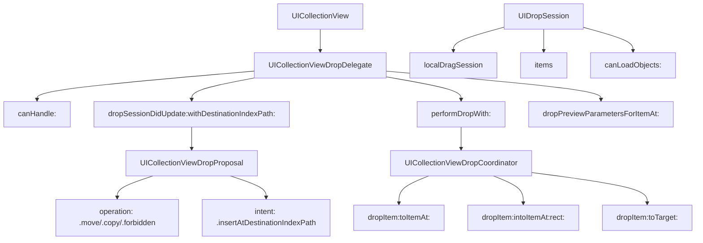

#UICollectionViewDropDelegate #UIKit #iOS #Swift #UICollectionView #DragAndDrop #iPad #NSItemProvider #UIDragItem #DropInteraction

---
**(делегат приёма перетаскивания для коллекции / управление Drop в [[UICollectionView]])**

`UICollectionViewDropDelegate` — это протокол из фреймворка **[[UIKit]]**, который позволяет **принимать и обрабатывать данные, перетаскиваемые в `UICollectionView`**. Он работает в паре с `UICollectionViewDragDelegate`, обеспечивая полный цикл Drag & Drop: от источника до цели.

**Ключевые особенности (важно в 2026):**
- Появился в **[[iOS]] 11.0+** вместе с фреймворком Drag & Drop на iPad
- Обрабатывает как **внутренние** (в пределах приложения), так и **внешние** (из других приложений) перетаскивания
- Позволяет **анимировать** вставку, перемещение и удаление элементов
- Поддерживает **разные операции**: `.move` (перемещение), `.copy` (копирование), `.forbidden` (запрет)
- Предоставляет **координатор** (`UICollectionViewDropCoordinator`) для управления анимацией

---

### Основные методы UICollectionViewDropDelegate

| Метод | Назначение | Обязательный |
|-------|------------|--------------|
| `collectionView(_:canHandle:)` | Проверка, может ли коллекция обработать данные | ❌ Нет (по умолчанию `true`) |
| `collectionView(_:dropSessionDidUpdate:withDestinationIndexPath:)` | Определение операции и поведения при падении | ✅ Да |
| `collectionView(_:performDropWith:)` | Выполнение операции падения (вставка/перемещение) | ✅ Да |
| `collectionView(_:dropSessionDidEnter:)` | Уведомление о входе в зону коллекции | ❌ Нет |
| `collectionView(_:dropSessionDidExit:)` | Уведомление о выходе из зоны коллекции | ❌ Нет |
| `collectionView(_:dropSessionDidEnd:)` | Уведомление о завершении сессии падения | ❌ Нет |
| `collectionView(_:dropPreviewParametersForItemAt:)` | Настройка превью для вставляемого элемента | ❌ Нет |

---

### Схема взаимосвязей



---

### Примеры (от простого к сложному)

#### 1. Базовый приём данных (перемещение внутри коллекции)
```swift
import UIKit

class BasicDropCollectionViewController: UIViewController,
                                         UICollectionViewDataSource,
                                         UICollectionViewDelegate,
                                         UICollectionViewDragDelegate,
                                         UICollectionViewDropDelegate {
    
    private var collectionView: UICollectionView!
    private var items = ["A", "B", "C", "D", "E"]
    
    override func viewDidLoad() {
        super.viewDidLoad()
        setupCollectionView()
    }
    
    private func setupCollectionView() {
        let layout = UICollectionViewFlowLayout()
        layout.itemSize = CGSize(width: 80, height: 80)
        layout.scrollDirection = .vertical
        layout.sectionInset = UIEdgeInsets(top: 20, left: 20, bottom: 20, right: 20)
        
        collectionView = UICollectionView(frame: view.bounds, collectionViewLayout: layout)
        collectionView.backgroundColor = .systemBackground
        collectionView.dataSource = self
        collectionView.delegate = self
        collectionView.register(UICollectionViewCell.self, forCellWithReuseIdentifier: "Cell")
        collectionView.dragDelegate = self
        collectionView.dropDelegate = self
        collectionView.dragInteractionEnabled = true
        view.addSubview(collectionView)
    }
    
    // MARK: - UICollectionViewDataSource
    
    func collectionView(_ collectionView: UICollectionView, numberOfItemsInSection section: Int) -> Int {
        return items.count
    }
    
    func collectionView(_ collectionView: UICollectionView, cellForItemAt indexPath: IndexPath) -> UICollectionViewCell {
        let cell = collectionView.dequeueReusableCell(withReuseIdentifier: "Cell", for: indexPath)
        cell.backgroundColor = .systemBlue
        cell.layer.cornerRadius = 40
        
        let label = UILabel(frame: cell.bounds)
        label.text = items[indexPath.item]
        label.textColor = .white
        label.textAlignment = .center
        label.font = .systemFont(ofSize: 24, weight: .bold)
        cell.contentView.addSubview(label)
        
        return cell
    }
    
    // MARK: - UICollectionViewDragDelegate
    
    func collectionView(_ collectionView: UICollectionView,
                        itemsForBeginning session: UIDragSession,
                        at indexPath: IndexPath) -> [UIDragItem] {
        let item = items[indexPath.item]
        let itemProvider = NSItemProvider(object: item as NSString)
        let dragItem = UIDragItem(itemProvider: itemProvider)
        dragItem.localObject = indexPath
        return [dragItem]
    }
    
    // MARK: - UICollectionViewDropDelegate
    
    func collectionView(_ collectionView: UICollectionView,
                        canHandle session: UIDropSession) -> Bool {
        // 1. Проверяем, можем ли мы обработать данные
        return session.canLoadObjects(ofClass: NSString.self)
    }
    
    func collectionView(_ collectionView: UICollectionView,
                        dropSessionDidUpdate session: UIDropSession,
                        withDestinationIndexPath destinationIndexPath: IndexPath?) -> UICollectionViewDropProposal {
        // 2. Определяем операцию
        if session.localDragSession != nil {
            // Внутреннее перетаскивание → перемещение
            return UICollectionViewDropProposal(operation: .move, intent: .insertAtDestinationIndexPath)
        } else {
            // Внешнее перетаскивание → копирование
            return UICollectionViewDropProposal(operation: .copy, intent: .insertAtDestinationIndexPath)
        }
    }
    
    func collectionView(_ collectionView: UICollectionView,
                        performDropWith coordinator: UICollectionViewDropCoordinator) {
        // 3. Выполняем операцию падения
        let destinationIndexPath = coordinator.destinationIndexPath ?? IndexPath(item: items.count, section: 0)
        
        for item in coordinator.items {
            if let sourceIndexPath = item.sourceIndexPath {
                // Внутреннее перемещение
                collectionView.performBatchUpdates {
                    let movedItem = items.remove(at: sourceIndexPath.item)
                    let destinationItem = destinationIndexPath.item
                    
                    if destinationItem > items.count {
                        items.append(movedItem)
                    } else {
                        items.insert(movedItem, at: destinationItem)
                    }
                    
                    collectionView.deleteItems(at: [sourceIndexPath])
                    collectionView.insertItems(at: [IndexPath(item: destinationItem, section: 0)])
                }
                
                // Анимация завершения
                coordinator.drop(item.dragItem, toItemAt: destinationIndexPath)
            } else {
                // Внешнее копирование
                let destinationItem = destinationIndexPath.item
                item.dragItem.itemProvider.loadObject(ofClass: NSString.self) { [weak self] (object, error) in
                    guard let self = self,
                          let text = object as? String else { return }
                    
                    DispatchQueue.main.async {
                        collectionView.performBatchUpdates {
                            if destinationItem > self.items.count {
                                self.items.append(text)
                            } else {
                                self.items.insert(text, at: destinationItem)
                            }
                            collectionView.insertItems(at: [IndexPath(item: destinationItem, section: 0)])
                        }
                    }
                }
            }
        }
    }
}
```

#### 2. Поддержка разных операций (Move, Copy, Forbidden)
```swift
class OperationDropCollectionViewController: UIViewController,
                                            UICollectionViewDataSource,
                                            UICollectionViewDelegate,
                                            UICollectionViewDragDelegate,
                                            UICollectionViewDropDelegate {
    
    private var collectionView: UICollectionView!
    private var items = ["📱", "💻", "⌚️", "🎧", "📷"]
    private var isDropAllowed = true
    
    override func viewDidLoad() {
        super.viewDidLoad()
        setupCollectionView()
        setupToggleButton()
    }
    
    private func setupCollectionView() {
        let layout = UICollectionViewFlowLayout()
        layout.itemSize = CGSize(width: 80, height: 80)
        layout.scrollDirection = .vertical
        layout.sectionInset = UIEdgeInsets(top: 20, left: 20, bottom: 20, right: 20)
        
        collectionView = UICollectionView(frame: view.bounds, collectionViewLayout: layout)
        collectionView.backgroundColor = .systemBackground
        collectionView.dataSource = self
        collectionView.delegate = self
        collectionView.register(UICollectionViewCell.self, forCellWithReuseIdentifier: "Cell")
        collectionView.dragDelegate = self
        collectionView.dropDelegate = self
        collectionView.dragInteractionEnabled = true
        view.addSubview(collectionView)
    }
    
    private func setupToggleButton() {
        let button = UIButton(type: .system)
        button.setTitle("Toggle Drop", for: .normal)
        button.addTarget(self, action: #selector(toggleDrop), for: .touchUpInside)
        button.frame = CGRect(x: view.bounds.width - 150, y: 40, width: 120, height: 40)
        view.addSubview(button)
    }
    
    @objc private func toggleDrop() {
        isDropAllowed.toggle()
        print("Drop разрешён: \(isDropAllowed)")
    }
    
    // MARK: - UICollectionViewDataSource
    
    func collectionView(_ collectionView: UICollectionView, numberOfItemsInSection section: Int) -> Int {
        return items.count
    }
    
    func collectionView(_ collectionView: UICollectionView, cellForItemAt indexPath: IndexPath) -> UICollectionViewCell {
        let cell = collectionView.dequeueReusableCell(withReuseIdentifier: "Cell", for: indexPath)
        cell.backgroundColor = .systemGray6
        cell.layer.cornerRadius = 40
        
        let label = UILabel(frame: cell.bounds)
        label.text = items[indexPath.item]
        label.textAlignment = .center
        label.font = .systemFont(ofSize: 32)
        cell.contentView.addSubview(label)
        
        return cell
    }
    
    // MARK: - UICollectionViewDragDelegate
    
    func collectionView(_ collectionView: UICollectionView,
                        itemsForBeginning session: UIDragSession,
                        at indexPath: IndexPath) -> [UIDragItem] {
        let item = items[indexPath.item]
        let itemProvider = NSItemProvider(object: item as NSString)
        let dragItem = UIDragItem(itemProvider: itemProvider)
        dragItem.localObject = indexPath
        return [dragItem]
    }
    
    // MARK: - UICollectionViewDropDelegate
    
    func collectionView(_ collectionView: UICollectionView,
                        canHandle session: UIDropSession) -> Bool {
        return session.canLoadObjects(ofClass: NSString.self) && isDropAllowed
    }
    
    func collectionView(_ collectionView: UICollectionView,
                        dropSessionDidUpdate session: UIDropSession,
                        withDestinationIndexPath destinationIndexPath: IndexPath?) -> UICollectionViewDropProposal {
        // 1. Проверяем, разрешён ли Drop
        guard isDropAllowed else {
            return UICollectionViewDropProposal(operation: .forbidden)
        }
        
        // 2. Определяем операцию на основе источника
        if session.localDragSession != nil {
            // Внутреннее перетаскивание → перемещение
            return UICollectionViewDropProposal(operation: .move, intent: .insertAtDestinationIndexPath)
        } else {
            // Внешнее перетаскивание → копирование
            return UICollectionViewDropProposal(operation: .copy, intent: .insertAtDestinationIndexPath)
        }
    }
    
    func collectionView(_ collectionView: UICollectionView,
                        performDropWith coordinator: UICollectionViewDropCoordinator) {
        let destinationIndexPath = coordinator.destinationIndexPath ?? IndexPath(item: items.count, section: 0)
        
        for item in coordinator.items {
            if let sourceIndexPath = item.sourceIndexPath {
                // 3. Перемещение
                collectionView.performBatchUpdates {
                    let movedItem = items.remove(at: sourceIndexPath.item)
                    items.insert(movedItem, at: destinationIndexPath.item)
                    
                    collectionView.deleteItems(at: [sourceIndexPath])
                    collectionView.insertItems(at: [destinationIndexPath])
                }
                coordinator.drop(item.dragItem, toItemAt: destinationIndexPath)
            } else {
                // 4. Копирование извне
                item.dragItem.itemProvider.loadObject(ofClass: NSString.self) { [weak self] (object, error) in
                    guard let self = self,
                          let text = object as? String else { return }
                    
                    DispatchQueue.main.async {
                        collectionView.performBatchUpdates {
                            self.items.insert(text, at: destinationIndexPath.item)
                            collectionView.insertItems(at: [destinationIndexPath])
                        }
                    }
                }
            }
        }
    }
}
```

#### 3. Кастомизация превью при падении
```swift
class CustomPreviewDropCollectionViewController: UIViewController,
                                                 UICollectionViewDataSource,
                                                 UICollectionViewDelegate,
                                                 UICollectionViewDragDelegate,
                                                 UICollectionViewDropDelegate {
    
    private var collectionView: UICollectionView!
    private var items = ["🍎", "🍌", "🍒", "🍇", "🍊"]
    
    override func viewDidLoad() {
        super.viewDidLoad()
        setupCollectionView()
    }
    
    private func setupCollectionView() {
        let layout = UICollectionViewFlowLayout()
        layout.itemSize = CGSize(width: 100, height: 100)
        layout.scrollDirection = .vertical
        layout.sectionInset = UIEdgeInsets(top: 20, left: 20, bottom: 20, right: 20)
        
        collectionView = UICollectionView(frame: view.bounds, collectionViewLayout: layout)
        collectionView.backgroundColor = .systemBackground
        collectionView.dataSource = self
        collectionView.delegate = self
        collectionView.register(UICollectionViewCell.self, forCellWithReuseIdentifier: "Cell")
        collectionView.dragDelegate = self
        collectionView.dropDelegate = self
        collectionView.dragInteractionEnabled = true
        view.addSubview(collectionView)
    }
    
    // MARK: - UICollectionViewDataSource
    
    func collectionView(_ collectionView: UICollectionView, numberOfItemsInSection section: Int) -> Int {
        return items.count
    }
    
    func collectionView(_ collectionView: UICollectionView, cellForItemAt indexPath: IndexPath) -> UICollectionViewCell {
        let cell = collectionView.dequeueReusableCell(withReuseIdentifier: "Cell", for: indexPath)
        cell.backgroundColor = .systemGray6
        cell.layer.cornerRadius = 50
        
        let label = UILabel(frame: cell.bounds)
        label.text = items[indexPath.item]
        label.textAlignment = .center
        label.font = .systemFont(ofSize: 40)
        cell.contentView.addSubview(label)
        
        return cell
    }
    
    // MARK: - UICollectionViewDragDelegate
    
    func collectionView(_ collectionView: UICollectionView,
                        itemsForBeginning session: UIDragSession,
                        at indexPath: IndexPath) -> [UIDragItem] {
        let item = items[indexPath.item]
        let itemProvider = NSItemProvider(object: item as NSString)
        let dragItem = UIDragItem(itemProvider: itemProvider)
        dragItem.localObject = indexPath
        return [dragItem]
    }
    
    // MARK: - UICollectionViewDropDelegate
    
    func collectionView(_ collectionView: UICollectionView,
                        dropSessionDidUpdate session: UIDropSession,
                        withDestinationIndexPath destinationIndexPath: IndexPath?) -> UICollectionViewDropProposal {
        return UICollectionViewDropProposal(operation: .move, intent: .insertAtDestinationIndexPath)
    }
    
    func collectionView(_ collectionView: UICollectionView,
                        performDropWith coordinator: UICollectionViewDropCoordinator) {
        let destinationIndexPath = coordinator.destinationIndexPath ?? IndexPath(item: items.count, section: 0)
        
        for item in coordinator.items {
            if let sourceIndexPath = item.sourceIndexPath {
                collectionView.performBatchUpdates {
                    let movedItem = items.remove(at: sourceIndexPath.item)
                    items.insert(movedItem, at: destinationIndexPath.item)
                    
                    collectionView.deleteItems(at: [sourceIndexPath])
                    collectionView.insertItems(at: [destinationIndexPath])
                }
                
                // 1. Кастомная анимация падения
                coordinator.drop(item.dragItem, toItemAt: destinationIndexPath)
            }
        }
    }
    
    func collectionView(_ collectionView: UICollectionView,
                        dropPreviewParametersForItemAt indexPath: IndexPath) -> UIDragPreviewParameters? {
        // 2. Настраиваем параметры превью для падения
        let parameters = UIDragPreviewParameters()
        let rect = CGRect(x: 0, y: 0, width: 100, height: 100)
        parameters.visiblePath = UIBezierPath(roundedRect: rect, cornerRadius: 50)
        return parameters
    }
}
```

#### 4. Перетаскивание между секциями
```swift
class SectionDropCollectionViewController: UIViewController,
                                          UICollectionViewDataSource,
                                          UICollectionViewDelegate,
                                          UICollectionViewDragDelegate,
                                          UICollectionViewDropDelegate {
    
    private var collectionView: UICollectionView!
    private var sections: [[String]] = [
        ["A1", "A2", "A3"],
        ["B1", "B2", "B3"],
        ["C1", "C2", "C3"]
    ]
    
    override func viewDidLoad() {
        super.viewDidLoad()
        setupCollectionView()
    }
    
    private func setupCollectionView() {
        let layout = UICollectionViewFlowLayout()
        layout.itemSize = CGSize(width: 80, height: 80)
        layout.scrollDirection = .vertical
        layout.sectionInset = UIEdgeInsets(top: 20, left: 20, bottom: 20, right: 20)
        layout.headerReferenceSize = CGSize(width: view.bounds.width, height: 40)
        
        collectionView = UICollectionView(frame: view.bounds, collectionViewLayout: layout)
        collectionView.backgroundColor = .systemBackground
        collectionView.dataSource = self
        collectionView.delegate = self
        collectionView.register(UICollectionViewCell.self, forCellWithReuseIdentifier: "Cell")
        collectionView.register(UICollectionReusableView.self,
                                forSupplementaryViewOfKind: UICollectionView.elementKindSectionHeader,
                                withReuseIdentifier: "Header")
        collectionView.dragDelegate = self
        collectionView.dropDelegate = self
        collectionView.dragInteractionEnabled = true
        view.addSubview(collectionView)
    }
    
    // MARK: - UICollectionViewDataSource
    
    func numberOfSections(in collectionView: UICollectionView) -> Int {
        return sections.count
    }
    
    func collectionView(_ collectionView: UICollectionView, numberOfItemsInSection section: Int) -> Int {
        return sections[section].count
    }
    
    func collectionView(_ collectionView: UICollectionView, cellForItemAt indexPath: IndexPath) -> UICollectionViewCell {
        let cell = collectionView.dequeueReusableCell(withReuseIdentifier: "Cell", for: indexPath)
        cell.backgroundColor = sectionColor(for: indexPath.section)
        cell.layer.cornerRadius = 40
        
        let label = UILabel(frame: cell.bounds)
        label.text = sections[indexPath.section][indexPath.item]
        label.textColor = .white
        label.textAlignment = .center
        label.font = .systemFont(ofSize: 18, weight: .bold)
        cell.contentView.addSubview(label)
        
        return cell
    }
    
    func collectionView(_ collectionView: UICollectionView,
                        viewForSupplementaryElementOfKind kind: String,
                        at indexPath: IndexPath) -> UICollectionReusableView {
        let header = collectionView.dequeueReusableSupplementaryView(ofKind: kind,
                                                                    withReuseIdentifier: "Header",
                                                                    for: indexPath)
        header.backgroundColor = sectionColor(for: indexPath.section)
        
        let label = UILabel(frame: header.bounds)
        label.text = "Секция \(indexPath.section + 1)"
        label.textColor = .white
        label.textAlignment = .center
        label.font = .systemFont(ofSize: 16, weight: .bold)
        header.addSubview(label)
        
        return header
    }
    
    private func sectionColor(for section: Int) -> UIColor {
        let colors: [UIColor] = [.systemRed, .systemBlue, .systemGreen]
        return colors[section % colors.count]
    }
    
    // MARK: - UICollectionViewDragDelegate
    
    func collectionView(_ collectionView: UICollectionView,
                        itemsForBeginning session: UIDragSession,
                        at indexPath: IndexPath) -> [UIDragItem] {
        let item = sections[indexPath.section][indexPath.item]
        let itemProvider = NSItemProvider(object: item as NSString)
        let dragItem = UIDragItem(itemProvider: itemProvider)
        dragItem.localObject = indexPath
        return [dragItem]
    }
    
    // MARK: - UICollectionViewDropDelegate
    
    func collectionView(_ collectionView: UICollectionView,
                        dropSessionDidUpdate session: UIDropSession,
                        withDestinationIndexPath destinationIndexPath: IndexPath?) -> UICollectionViewDropProposal {
        return UICollectionViewDropProposal(operation: .move, intent: .insertAtDestinationIndexPath)
    }
    
    func collectionView(_ collectionView: UICollectionView,
                        performDropWith coordinator: UICollectionViewDropCoordinator) {
        guard let destinationIndexPath = coordinator.destinationIndexPath else { return }
        
        for item in coordinator.items {
            guard let sourceIndexPath = item.sourceIndexPath else { continue }
            
            collectionView.performBatchUpdates {
                // 1. Получаем перемещаемый элемент
                let movedItem = sections[sourceIndexPath.section].remove(at: sourceIndexPath.item)
                
                // 2. Вставляем в секцию назначения
                sections[destinationIndexPath.section].insert(movedItem, at: destinationIndexPath.item)
                
                // 3. Обновляем коллекцию
                collectionView.deleteItems(at: [sourceIndexPath])
                collectionView.insertItems(at: [destinationIndexPath])
            }
            
            coordinator.drop(item.dragItem, toItemAt: destinationIndexPath)
        }
    }
}
```

#### 5. Работа с внешними данными (из других приложений)
```swift
class ExternalDropCollectionViewController: UIViewController,
                                           UICollectionViewDataSource,
                                           UICollectionViewDelegate,
                                           UICollectionViewDropDelegate {
    
    private var collectionView: UICollectionView!
    private var items: [String] = []
    
    override func viewDidLoad() {
        super.viewDidLoad()
        setupCollectionView()
        setupInstructions()
    }
    
    private func setupCollectionView() {
        let layout = UICollectionViewFlowLayout()
        layout.itemSize = CGSize(width: 100, height: 60)
        layout.scrollDirection = .vertical
        layout.sectionInset = UIEdgeInsets(top: 20, left: 20, bottom: 20, right: 20)
        
        collectionView = UICollectionView(frame: view.bounds, collectionViewLayout: layout)
        collectionView.backgroundColor = .systemBackground
        collectionView.dataSource = self
        collectionView.delegate = self
        collectionView.register(UICollectionViewCell.self, forCellWithReuseIdentifier: "Cell")
        collectionView.dropDelegate = self
        collectionView.dragInteractionEnabled = true
        view.addSubview(collectionView)
    }
    
    private func setupInstructions() {
        let label = UILabel()
        label.text = "Перетащите текст или изображения из других приложений"
        label.textAlignment = .center
        label.numberOfLines = 0
        label.font = .systemFont(ofSize: 16)
        label.textColor = .systemGray
        label.frame = CGRect(x: 20, y: 50, width: view.bounds.width - 40, height: 60)
        view.addSubview(label)
    }
    
    // MARK: - UICollectionViewDataSource
    
    func collectionView(_ collectionView: UICollectionView, numberOfItemsInSection section: Int) -> Int {
        return items.count
    }
    
    func collectionView(_ collectionView: UICollectionView, cellForItemAt indexPath: IndexPath) -> UICollectionViewCell {
        let cell = collectionView.dequeueReusableCell(withReuseIdentifier: "Cell", for: indexPath)
        cell.backgroundColor = .systemBlue
        cell.layer.cornerRadius = 8
        
        let label = UILabel(frame: cell.bounds)
        label.text = items[indexPath.item]
        label.textColor = .white
        label.textAlignment = .center
        label.font = .systemFont(ofSize: 14, weight: .medium)
        label.numberOfLines = 0
        cell.contentView.addSubview(label)
        
        return cell
    }
    
    // MARK: - UICollectionViewDropDelegate
    
    func collectionView(_ collectionView: UICollectionView,
                        canHandle session: UIDropSession) -> Bool {
        // 1. Проверяем, можно ли обработать данные
        return session.canLoadObjects(ofClass: NSString.self) ||
               session.canLoadObjects(ofClass: UIImage.self)
    }
    
    func collectionView(_ collectionView: UICollectionView,
                        dropSessionDidUpdate session: UIDropSession,
                        withDestinationIndexPath destinationIndexPath: IndexPath?) -> UICollectionViewDropProposal {
        // 2. Разрешаем копирование извне
        return UICollectionViewDropProposal(operation: .copy, intent: .insertAtDestinationIndexPath)
    }
    
    func collectionView(_ collectionView: UICollectionView,
                        performDropWith coordinator: UICollectionViewDropCoordinator) {
        let destinationIndexPath = coordinator.destinationIndexPath ?? IndexPath(item: items.count, section: 0)
        
        for item in coordinator.items {
            // 3. Проверяем, можно ли загрузить текст
            if item.dragItem.itemProvider.canLoadObject(ofClass: NSString.self) {
                item.dragItem.itemProvider.loadObject(ofClass: NSString.self) { [weak self] (object, error) in
                    guard let self = self,
                          let text = object as? String else { return }
                    
                    DispatchQueue.main.async {
                        collectionView.performBatchUpdates {
                            self.items.insert(text, at: destinationIndexPath.item)
                            collectionView.insertItems(at: [destinationIndexPath])
                        }
                    }
                }
            }
            
            // 4. Проверяем, можно ли загрузить изображение
            if item.dragItem.itemProvider.canLoadObject(ofClass: UIImage.self) {
                item.dragItem.itemProvider.loadObject(ofClass: UIImage.self) { [weak self] (object, error) in
                    guard let self = self,
                          let image = object as? UIImage else { return }
                    
                    DispatchQueue.main.async {
                        // Сохраняем изображение как файл и добавляем в коллекцию
                        self.saveImage(image, at: destinationIndexPath)
                    }
                }
            }
        }
    }
    
    private func saveImage(_ image: UIImage, at indexPath: IndexPath) {
        // 5. Сохраняем изображение и добавляем в коллекцию
        let imageName = "image_\(Date().timeIntervalSince1970).png"
        if let data = image.pngData() {
            let documentsURL = FileManager.default.urls(for: .documentDirectory, in: .userDomainMask).first!
            let fileURL = documentsURL.appendingPathComponent(imageName)
            try? data.write(to: fileURL)
            
            collectionView.performBatchUpdates {
                items.insert("📷 \(imageName)", at: indexPath.item)
                collectionView.insertItems(at: [indexPath])
            }
        }
    }
}
```

#### 6. Полный пример с Drag & Drop в секционированной коллекции
```swift
class FullDropSectionViewController: UIViewController,
                                     UICollectionViewDataSource,
                                     UICollectionViewDelegate,
                                     UICollectionViewDragDelegate,
                                     UICollectionViewDropDelegate {
    
    private var collectionView: UICollectionView!
    private var sections: [[String]] = [
        ["🍕", "🍔", "🌮"],
        ["🍣", "🍱", "🍜"],
        ["🧁", "🍩", "🍪"]
    ]
    
    override func viewDidLoad() {
        super.viewDidLoad()
        setupCollectionView()
    }
    
    private func setupCollectionView() {
        let layout = UICollectionViewFlowLayout()
        layout.itemSize = CGSize(width: 90, height: 90)
        layout.scrollDirection = .vertical
        layout.sectionInset = UIEdgeInsets(top: 20, left: 20, bottom: 20, right: 20)
        layout.headerReferenceSize = CGSize(width: view.bounds.width, height: 50)
        
        collectionView = UICollectionView(frame: view.bounds, collectionViewLayout: layout)
        collectionView.backgroundColor = .systemBackground
        collectionView.dataSource = self
        collectionView.delegate = self
        collectionView.register(UICollectionViewCell.self, forCellWithReuseIdentifier: "Cell")
        collectionView.register(UICollectionReusableView.self,
                                forSupplementaryViewOfKind: UICollectionView.elementKindSectionHeader,
                                withReuseIdentifier: "Header")
        collectionView.dragDelegate = self
        collectionView.dropDelegate = self
        collectionView.dragInteractionEnabled = true
        view.addSubview(collectionView)
    }
    
    // MARK: - UICollectionViewDataSource
    
    func numberOfSections(in collectionView: UICollectionView) -> Int {
        return sections.count
    }
    
    func collectionView(_ collectionView: UICollectionView, numberOfItemsInSection section: Int) -> Int {
        return sections[section].count
    }
    
    func collectionView(_ collectionView: UICollectionView, cellForItemAt indexPath: IndexPath) -> UICollectionViewCell {
        let cell = collectionView.dequeueReusableCell(withReuseIdentifier: "Cell", for: indexPath)
        cell.backgroundColor = sectionColor(for: indexPath.section)
        cell.layer.cornerRadius = 45
        
        let label = UILabel(frame: cell.bounds)
        label.text = sections[indexPath.section][indexPath.item]
        label.textAlignment = .center
        label.font = .systemFont(ofSize: 32)
        cell.contentView.addSubview(label)
        
        return cell
    }
    
    func collectionView(_ collectionView: UICollectionView,
                        viewForSupplementaryElementOfKind kind: String,
                        at indexPath: IndexPath) -> UICollectionReusableView {
        let header = collectionView.dequeueReusableSupplementaryView(ofKind: kind,
                                                                    withReuseIdentifier: "Header",
                                                                    for: indexPath)
        header.backgroundColor = sectionColor(for: indexPath.section)
        
        let label = UILabel(frame: header.bounds)
        label.text = ["Пицца 🍕", "Суши 🍣", "Десерты 🍩"][indexPath.section]
        label.textColor = .white
        label.textAlignment = .center
        label.font = .systemFont(ofSize: 20, weight: .bold)
        header.addSubview(label)
        
        return header
    }
    
    private func sectionColor(for section: Int) -> UIColor {
        let colors: [UIColor] = [.systemRed, .systemBlue, .systemGreen]
        return colors[section % colors.count]
    }
    
    // MARK: - UICollectionViewDragDelegate
    
    func collectionView(_ collectionView: UICollectionView,
                        itemsForBeginning session: UIDragSession,
                        at indexPath: IndexPath) -> [UIDragItem] {
        let item = sections[indexPath.section][indexPath.item]
        let itemProvider = NSItemProvider(object: item as NSString)
        let dragItem = UIDragItem(itemProvider: itemProvider)
        dragItem.localObject = indexPath
        return [dragItem]
    }
    
    // MARK: - UICollectionViewDropDelegate
    
    func collectionView(_ collectionView: UICollectionView,
                        canHandle session: UIDropSession) -> Bool {
        return session.canLoadObjects(ofClass: NSString.self)
    }
    
    func collectionView(_ collectionView: UICollectionView,
                        dropSessionDidUpdate session: UIDropSession,
                        withDestinationIndexPath destinationIndexPath: IndexPath?) -> UICollectionViewDropProposal {
        return UICollectionViewDropProposal(operation: .move, intent: .insertAtDestinationIndexPath)
    }
    
    func collectionView(_ collectionView: UICollectionView,
                        performDropWith coordinator: UICollectionViewDropCoordinator) {
        guard let destinationIndexPath = coordinator.destinationIndexPath else { return }
        
        for item in coordinator.items {
            guard let sourceIndexPath = item.sourceIndexPath else { continue }
            
            // 1. Получаем элемент
            let item = sections[sourceIndexPath.section][sourceIndexPath.item]
            
            // 2. Удаляем из источника
            sections[sourceIndexPath.section].remove(at: sourceIndexPath.item)
            
            // 3. Вставляем в место назначения
            sections[destinationIndexPath.section].insert(item, at: destinationIndexPath.item)
            
            // 4. Обновляем коллекцию
            collectionView.performBatchUpdates {
                collectionView.deleteItems(at: [sourceIndexPath])
                collectionView.insertItems(at: [destinationIndexPath])
            }
            
            // 5. Анимируем падение
            coordinator.drop(item.dragItem, toItemAt: destinationIndexPath)
            
            // 6. Обновляем заголовки при необходимости
            collectionView.reloadSections(IndexSet(integer: destinationIndexPath.section))
        }
    }
}
```

---

### Важные нюансы 2026 года

> [!warning]
> **`canHandle` должен быть быстрым:** Этот метод вызывается часто. Не выполняйте тяжёлых операций внутри него.
> 
> **`performDropWith` должен быть идемпотентным:** Может быть вызван несколько раз. Убедитесь, что ваш код корректно обрабатывает повторные вызовы.
> 
> **Координатор обеспечивает анимацию:** Всегда используйте методы `coordinator.drop(...)` для анимации падения элементов.
> 
> **Внешние данные загружаются асинхронно:** Используйте `loadObject(ofClass:)` с completion-блоком для загрузки данных из других приложений.
> 
> **Операции:** `.move` удаляет данные из источника, `.copy` оставляет их нетронутыми.

---

### Лучшие практики 2026

1. **Всегда реализуйте `dropSessionDidUpdate`** — определяет, что произойдёт при падении.
2. **Используйте `localObject`** для быстрого доступа к данным при внутреннем перетаскивании.
3. **Для внешних данных** всегда используйте асинхронную загрузку через `NSItemProvider`.
4. **Обновляйте модель данных** до обновления UI в `performBatchUpdates`.
5. **Используйте `coordinator.drop`** для анимации падения.
6. **Обрабатывайте ошибки** при загрузке внешних данных.

---

### Связь с другими темами

- [[UICollectionViewDragDelegate]] — источник данных
- [[UIDragItem]] — элемент перетаскивания
- [[UICollectionView]] — коллекция
- [[UITableView]] -  таблица