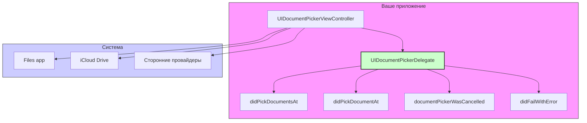

#uikit #document-picker #delegate #protocol #files #ios #swift #uidocumentpickerviewcontroller

---
### Определение
**UIDocumentPickerDelegate** — это протокол во фреймворке [[UIKit]], который определяет методы для обработки результатов выбора документов из системного пикера документов ([[UIDocumentPickerViewController]]). Он является основным механизмом получения обратной связи о том, какие файлы выбрал пользователь, а также об отмене или ошибках при работе с документ-пикером .

Протокол содержит методы для:
- Получения выбранных пользователем [[URL]]-адресов документов
- Обработки отмены выбора
- Обработки ошибок при доступе к документам

### Зачем это знать [[iOS]]-разработчику?
1.  **Получение результатов выбора:** Основной способ узнать, какие файлы выбрал пользователь.
2.  **Управление доступом к файлам:** Методы делегата позволяют корректно начать и завершить доступ к защищенным ресурсам (security-scoped).
3.  **Обработка отмены и ошибок:** Важно дать пользователю обратную связь и корректно обработать ошибки доступа.
4.  **Работа с множественным выбором:** Методы делегата поддерживают массивы URL, что позволяет обрабатывать выбор нескольких файлов одновременно.
5.  **Интеграция с легаси-кодом:** Понимание делегата необходимо для работы с `UIDocumentPickerViewController` в UIKit-проектах и при миграции на [[SwiftUI]].

---

### Архитектура и ключевые методы



### Методы протокола

#### 1. Основной метод для получения выбранных документов

```swift
optional func documentPicker(_ controller: UIDocumentPickerViewController, 
                              didPickDocumentsAt urls: [URL])
```

**Назначение:** Вызывается, когда пользователь успешно выбрал один или несколько документов.

**Параметры:**
- `controller`: Ссылка на экземпляр `UIDocumentPickerViewController`, который вызвал делегат.
- `urls`: Массив URL-адресов выбранных документов. Даже если множественный выбор отключен, метод возвращает массив с одним элементом.

#### 2. Устаревший метод для одного документа

```swift
@available(*, deprecated, message: "Use documentPicker:didPickDocumentsAt:")
optional func documentPicker(_ controller: UIDocumentPickerViewController, 
                              didPickDocumentAt url: URL)
```

**Примечание:** Этот метод устарел. Используйте версию с массивом `didPickDocumentsAt`.

#### 3. Обработка отмены

```swift
optional func documentPickerWasCancelled(_ controller: UIDocumentPickerViewController)
```

**Назначение:** Вызывается, когда пользователь закрыл пикер без выбора документа (нажал "Отмена" или закрыл жестом).

#### 4. Обработка ошибок

```swift
optional func documentPicker(_ controller: UIDocumentPickerViewController, 
                              didFailWithError error: Error)
```

**Назначение:** Вызывается при возникновении ошибки в процессе выбора документа (например, отсутствие доступа к файлу).

---

### Примеры от простого к сложному

#### Уровень 0: Базовая реализация делегата

```swift
import UIKit
import UniformTypeIdentifiers

class SimpleDocumentPickerViewController: UIViewController {
    
    @IBOutlet weak var statusLabel: UILabel!
    
    @IBAction func pickDocumentTapped(_ sender: UIButton) {
        let documentPicker = UIDocumentPickerViewController(forOpeningContentTypes: [.pdf, .plainText], asCopy: true)
        documentPicker.delegate = self
        documentPicker.allowsMultipleSelection = false
        
        present(documentPicker, animated: true)
    }
}

extension SimpleDocumentPickerViewController: UIDocumentPickerDelegate {
    
    func documentPicker(_ controller: UIDocumentPickerViewController, 
                        didPickDocumentsAt urls: [URL]) {
        
        guard let selectedURL = urls.first else { return }
        
        // Важно: для доступа к файлу за пределами песочницы нужно начать доступ
        guard selectedURL.startAccessingSecurityScopedResource() else {
            statusLabel.text = "Нет доступа к файлу"
            return
        }
        
        // Всегда освобождаем доступ, когда закончили
        defer { selectedURL.stopAccessingSecurityScopedResource() }
        
        statusLabel.text = "Выбран файл: \(selectedURL.lastPathComponent)"
        
        // Читаем содержимое файла
        do {
            let content = try String(contentsOf: selectedURL, encoding: .utf8)
            print("Содержимое файла: \(content)")
        } catch {
            print("Ошибка чтения файла: \(error)")
        }
    }
    
    func documentPickerWasCancelled(_ controller: UIDocumentPickerViewController) {
        statusLabel.text = "Выбор отменен"
    }
    
    func documentPicker(_ controller: UIDocumentPickerViewController, 
                        didFailWithError error: Error) {
        statusLabel.text = "Ошибка: \(error.localizedDescription)"
    }
}
```

#### Уровень 1: Множественный выбор с обработкой в фоне

```swift
import UIKit
import UniformTypeIdentifiers

class MultiSelectViewController: UIViewController {
    
    @IBOutlet weak var tableView: UITableView!
    @IBOutlet weak var activityIndicator: UIActivityIndicatorView!
    
    private var selectedFiles: [URL] = []
    
    @IBAction func pickMultipleFilesTapped(_ sender: UIButton) {
        let documentPicker = UIDocumentPickerViewController(forOpeningContentTypes: [.item], asCopy: false)
        documentPicker.delegate = self
        documentPicker.allowsMultipleSelection = true
        
        present(documentPicker, animated: true)
    }
}

extension MultiSelectViewController: UIDocumentPickerDelegate {
    
    func documentPicker(_ controller: UIDocumentPickerViewController, 
                        didPickDocumentsAt urls: [URL]) {
        
        activityIndicator.startAnimating()
        selectedFiles = urls
        
        // Обрабатываем файлы в фоне
        DispatchQueue.global(qos: .userInitiated).async { [weak self] in
            self?.processSelectedFiles(urls)
        }
    }
    
    private func processSelectedFiles(_ urls: [URL]) {
        var fileInfos: [(name: String, size: Int64)] = []
        
        for url in urls {
            // Начинаем доступ к защищенному ресурсу
            guard url.startAccessingSecurityScopedResource() else { continue }
            defer { url.stopAccessingSecurityScopedResource() }
            
            do {
                let attributes = try FileManager.default.attributesOfItem(atPath: url.path)
                let fileSize = attributes[.size] as? Int64 ?? 0
                fileInfos.append((name: url.lastPathComponent, size: fileSize))
            } catch {
                print("Ошибка получения атрибутов для \(url): \(error)")
            }
        }
        
        DispatchQueue.main.async { [weak self] in
            self?.activityIndicator.stopAnimating()
            self?.updateUI(with: fileInfos)
        }
    }
    
    private func updateUI(with fileInfos: [(name: String, size: Int64)]) {
        // Обновляем таблицу с информацией о файлах
        tableView.reloadData()
    }
}

extension MultiSelectViewController: UITableViewDataSource {
    
    func tableView(_ tableView: UITableView, numberOfRowsInSection section: Int) -> Int {
        return selectedFiles.count
    }
    
    func tableView(_ tableView: UITableView, cellForRowAt indexPath: IndexPath) -> UITableViewCell {
        let cell = tableView.dequeueReusableCell(withIdentifier: "FileCell", for: indexPath)
        let url = selectedFiles[indexPath.row]
        
        cell.textLabel?.text = url.lastPathComponent
        
        // Получаем размер файла (нужно обновлять асинхронно)
        DispatchQueue.global().async {
            guard url.startAccessingSecurityScopedResource() else { return }
            defer { url.stopAccessingSecurityScopedResource() }
            
            let attributes = try? FileManager.default.attributesOfItem(atPath: url.path)
            let fileSize = attributes?[.size] as? Int64 ?? 0
            
            DispatchQueue.main.async {
                cell.detailTextLabel?.text = ByteCountFormatter.string(fromByteCount: fileSize, countStyle: .file)
            }
        }
        
        return cell
    }
}
```

#### Уровень 2: Обработка ошибок с детализацией

```swift
import UIKit
import UniformTypeIdentifiers

class ErrorHandlingViewController: UIViewController {
    
    @IBOutlet weak var statusLabel: UILabel!
    
    @IBAction func pickDocumentTapped(_ sender: UIButton) {
        let documentPicker = UIDocumentPickerViewController(forOpeningContentTypes: [.pdf], asCopy: false)
        documentPicker.delegate = self
        present(documentPicker, animated: true)
    }
}

extension ErrorHandlingViewController: UIDocumentPickerDelegate {
    
    func documentPicker(_ controller: UIDocumentPickerViewController, 
                        didPickDocumentsAt urls: [URL]) {
        
        guard let url = urls.first else { return }
        
        do {
            // Пытаемся получить доступ к файлу
            let success = url.startAccessingSecurityScopedResource()
            defer { if success { url.stopAccessingSecurityScopedResource() } }
            
            if !success {
                throw NSError(domain: "FileAccessError", code: -1, 
                            userInfo: [NSLocalizedDescriptionKey: "Не удалось получить доступ к файлу"])
            }
            
            // Читаем файл
            let data = try Data(contentsOf: url)
            statusLabel.text = "Файл загружен: \(data.count) байт"
            
        } catch let error as NSError {
            handleError(error, for: url)
        }
    }
    
    func documentPicker(_ controller: UIDocumentPickerViewController, 
                        didFailWithError error: Error) {
        handlePickerError(error)
    }
    
    func documentPickerWasCancelled(_ controller: UIDocumentPickerViewController) {
        statusLabel.text = "Выбор отменен"
    }
    
    private func handleError(_ error: NSError, for url: URL) {
        var message = "Ошибка при работе с файлом \(url.lastPathComponent):\n"
        
        switch error.code {
        case 257: // NSFileReadNoPermissionError
            message += "Нет прав на чтение файла"
        case 260: // NSFileReadNoSuchFileError
            message += "Файл не существует"
        case NSFileReadCorruptFileError:
            message += "Файл поврежден"
        default:
            message += error.localizedDescription
        }
        
        statusLabel.text = message
        print("Детали ошибки: \(error)")
    }
    
    private func handlePickerError(_ error: Error) {
        let nsError = error as NSError
        var message = "Ошибка пикера документов: "
        
        switch nsError.code {
        case 30720: // Ошибка доступа к iCloud
            message += "Проблема с доступом к iCloud"
        default:
            message += nsError.localizedDescription
        }
        
        statusLabel.text = message
    }
}
```

#### Уровень 3: Сохранение закладок (bookmarks) для постоянного доступа

```swift
import UIKit
import UniformTypeIdentifiers

class BookmarkManagerViewController: UIViewController {
    
    @IBOutlet weak var bookmarksTableView: UITableView!
    
    private var bookmarks: [URL: Data] = [:]
    private let bookmarksKey = "SavedDocumentBookmarks"
    
    override func viewDidLoad() {
        super.viewDidLoad()
        loadBookmarks()
    }
    
    @IBAction func addFileTapped(_ sender: UIButton) {
        let documentPicker = UIDocumentPickerViewController(forOpeningContentTypes: [.item], asCopy: false)
        documentPicker.delegate = self
        documentPicker.allowsMultipleSelection = true
        
        present(documentPicker, animated: true)
    }
    
    private func loadBookmarks() {
        guard let savedData = UserDefaults.standard.dictionary(forKey: bookmarksKey) as? [String: Data] else { return }
        
        for (urlString, bookmarkData) in savedData {
            var isStale = false
            do {
                let url = try URL(resolvingBookmarkData: bookmarkData,
                                   options: .withSecurityScope,
                                   relativeTo: nil,
                                   bookmarkDataIsStale: &isStale)
                
                if !isStale {
                    bookmarks[url] = bookmarkData
                } else {
                    // Закладка устарела, нужно создать новую
                    try recreateBookmark(for: url)
                }
            } catch {
                print("Ошибка восстановления закладки для \(urlString): \(error)")
            }
        }
        
        bookmarksTableView.reloadData()
    }
    
    private func recreateBookmark(for url: URL) throws {
        guard url.startAccessingSecurityScopedResource() else { return }
        defer { url.stopAccessingSecurityScopedResource() }
        
        let newBookmark = try url.bookmarkData(options: .withSecurityScope,
                                                includingResourceValuesForKeys: nil,
                                                relativeTo: nil)
        
        bookmarks[url] = newBookmark
        saveBookmarksToUserDefaults()
    }
    
    private func saveBookmark(for url: URL) {
        do {
            guard url.startAccessingSecurityScopedResource() else { return }
            defer { url.stopAccessingSecurityScopedResource() }
            
            let bookmarkData = try url.bookmarkData(options: .withSecurityScope,
                                                     includingResourceValuesForKeys: nil,
                                                     relativeTo: nil)
            
            bookmarks[url] = bookmarkData
            saveBookmarksToUserDefaults()
            
        } catch {
            print("Ошибка создания закладки: \(error)")
        }
    }
    
    private func saveBookmarksToUserDefaults() {
        var dict: [String: Data] = [:]
        for (url, data) in bookmarks {
            dict[url.absoluteString] = data
        }
        UserDefaults.standard.set(dict, forKey: bookmarksKey)
    }
}

extension BookmarkManagerViewController: UIDocumentPickerDelegate {
    
    func documentPicker(_ controller: UIDocumentPickerViewController, 
                        didPickDocumentsAt urls: [URL]) {
        
        for url in urls {
            saveBookmark(for: url)
        }
        
        bookmarksTableView.reloadData()
    }
}

extension BookmarkManagerViewController: UITableViewDataSource {
    
    func tableView(_ tableView: UITableView, numberOfRowsInSection section: Int) -> Int {
        return bookmarks.keys.count
    }
    
    func tableView(_ tableView: UITableView, cellForRowAt indexPath: IndexPath) -> UITableViewCell {
        let cell = tableView.dequeueReusableCell(withIdentifier: "BookmarkCell", for: indexPath)
        let url = Array(bookmarks.keys)[indexPath.row]
        
        cell.textLabel?.text = url.lastPathComponent
        cell.detailTextLabel?.text = url.path
        
        return cell
    }
    
    func tableView(_ tableView: UITableView, commit editingStyle: UITableViewCell.EditingStyle, 
                   forRowAt indexPath: IndexPath) {
        if editingStyle == .delete {
            let url = Array(bookmarks.keys)[indexPath.row]
            bookmarks.removeValue(forKey: url)
            saveBookmarksToUserDefaults()
            tableView.deleteRows(at: [indexPath], with: .fade)
        }
    }
    
    func tableView(_ tableView: UITableView, didSelectRowAt indexPath: IndexPath) {
        tableView.deselectRow(at: indexPath, animated: true)
        
        let url = Array(bookmarks.keys)[indexPath.row]
        
        guard url.startAccessingSecurityScopedResource() else {
            print("Нет доступа к файлу")
            return
        }
        defer { url.stopAccessingSecurityScopedResource() }
        
        do {
            let content = try String(contentsOf: url, encoding: .utf8)
            let alert = UIAlertController(title: url.lastPathComponent, 
                                          message: content.prefix(500) + "...", 
                                          preferredStyle: .alert)
            alert.addAction(UIAlertAction(title: "OK", style: .default))
            present(alert, animated: true)
        } catch {
            print("Ошибка чтения: \(error)")
        }
    }
}
```

#### Уровень 4: Экспорт документов с делегатом

```swift
import UIKit
import UniformTypeIdentifiers

class ExportViewController: UIViewController {
    
    @IBOutlet weak var statusLabel: UILabel!
    
    @IBAction func exportFileTapped(_ sender: UIButton) {
        // Создаем временный файл для экспорта
        let tempURL = createTemporaryFile()
        
        let documentPicker = UIDocumentPickerViewController(forExporting: [tempURL], asCopy: true)
        documentPicker.delegate = self
        
        present(documentPicker, animated: true)
    }
    
    private func createTemporaryFile() -> URL {
        let tempDirectory = FileManager.default.temporaryDirectory
        let fileURL = tempDirectory.appendingPathComponent("export_\(Date().timeIntervalSince1970).txt")
        
        let content = "Это тестовый файл, созданный в приложении\nДата: \(Date())"
        try? content.write(to: fileURL, atomically: true, encoding: .utf8)
        
        return fileURL
    }
}

extension ExportViewController: UIDocumentPickerDelegate {
    
    func documentPicker(_ controller: UIDocumentPickerViewController, 
                        didPickDocumentsAt urls: [URL]) {
        
        guard let exportedURL = urls.first else { return }
        
        statusLabel.text = "Файл экспортирован в \(exportedURL.lastPathComponent)"
        
        // Очищаем временный файл
        if let tempURL = (controller as? UIDocumentPickerViewController)?.urls?.first {
            try? FileManager.default.removeItem(at: tempURL)
        }
    }
    
    func documentPickerWasCancelled(_ controller: UIDocumentPickerViewController) {
        statusLabel.text = "Экспорт отменен"
        
        // Очищаем временный файл
        if let tempURL = (controller as? UIDocumentPickerViewController)?.urls?.first {
            try? FileManager.default.removeItem(at: tempURL)
        }
    }
    
    func documentPicker(_ controller: UIDocumentPickerViewController, 
                        didFailWithError error: Error) {
        statusLabel.text = "Ошибка экспорта: \(error.localizedDescription)"
        
        // Очищаем временный файл
        if let tempURL = (controller as? UIDocumentPickerViewController)?.urls?.first {
            try? FileManager.default.removeItem(at: tempURL)
        }
    }
}

// Расширение для доступа к urls в пикере
extension UIDocumentPickerViewController {
    var urls: [URL]? {
        return value(forKey: "urls") as? [URL]
    }
}
```

#### Уровень 5: Интеграция со SwiftUI через [[Coordinator]]

```swift
import SwiftUI
import UIKit
import UniformTypeIdentifiers

struct DocumentPickerView: UIViewControllerRepresentable {
    @Binding var selectedFiles: [URL]
    @Binding var isPresented: Bool
    var contentTypes: [UTType]
    var allowsMultipleSelection: Bool
    var asCopy: Bool
    var onError: ((Error) -> Void)?
    
    func makeCoordinator() -> Coordinator {
        Coordinator(self)
    }
    
    func makeUIViewController(context: Context) -> UIDocumentPickerViewController {
        let picker = UIDocumentPickerViewController(forOpeningContentTypes: contentTypes, asCopy: asCopy)
        picker.delegate = context.coordinator
        picker.allowsMultipleSelection = allowsMultipleSelection
        return picker
    }
    
    func updateUIViewController(_ uiViewController: UIDocumentPickerViewController, context: Context) {}
    
    class Coordinator: NSObject, UIDocumentPickerDelegate {
        var parent: DocumentPickerView
        
        init(_ parent: DocumentPickerView) {
            self.parent = parent
        }
        
        func documentPicker(_ controller: UIDocumentPickerViewController, 
                            didPickDocumentsAt urls: [URL]) {
            parent.selectedFiles = urls
            parent.isPresented = false
        }
        
        func documentPickerWasCancelled(_ controller: UIDocumentPickerViewController) {
            parent.isPresented = false
        }
        
        func documentPicker(_ controller: UIDocumentPickerViewController, 
                            didFailWithError error: Error) {
            parent.onError?(error)
            parent.isPresented = false
        }
    }
}

// Пример использования в SwiftUI
struct ContentView: View {
    @State private var isPickerPresented = false
    @State private var selectedFiles: [URL] = []
    @State private var errorMessage: String?
    
    var body: some View {
        VStack {
            List(selectedFiles, id: \.self) { url in
                Text(url.lastPathComponent)
            }
            
            if let error = errorMessage {
                Text(error)
                    .foregroundColor(.red)
                    .padding()
            }
            
            Button("Выбрать файлы") {
                isPickerPresented = true
            }
            .padding()
        }
        .sheet(isPresented: $isPickerPresented) {
            DocumentPickerView(
                selectedFiles: $selectedFiles,
                isPresented: $isPickerPresented,
                contentTypes: [.pdf, .image, .plainText],
                allowsMultipleSelection: true,
                asCopy: true,
                onError: { error in
                    errorMessage = error.localizedDescription
                }
            )
        }
    }
}
```

#### Уровень 6: Комплексный менеджер документов с делегатом

```swift
import UIKit
import UniformTypeIdentifiers

protocol DocumentManagerDelegate: AnyObject {
    func documentManager(_ manager: DocumentManager, didSelect urls: [URL])
    func documentManagerDidCancel(_ manager: DocumentManager)
    func documentManager(_ manager: DocumentManager, didFailWith error: Error)
}

class DocumentManager: NSObject {
    
    static let shared = DocumentManager()
    
    private weak var presentingViewController: UIViewController?
    private weak var delegate: DocumentManagerDelegate?
    private var completionHandler: (([URL]) -> Void)?
    private var cancelHandler: (() -> Void)?
    private var errorHandler: ((Error) -> Void)?
    
    private override init() {
        super.init()
    }
    
    // MARK: - Методы с делегатом
    func pickDocuments(from viewController: UIViewController,
                       delegate: DocumentManagerDelegate,
                       contentTypes: [UTType] = [.item],
                       allowsMultiple: Bool = true,
                       asCopy: Bool = true) {
        
        self.presentingViewController = viewController
        self.delegate = delegate
        
        let picker = createPicker(contentTypes: contentTypes,
                                  allowsMultiple: allowsMultiple,
                                  asCopy: asCopy)
        
        viewController.present(picker, animated: true)
    }
    
    // MARK: - Методы с замыканиями (более современный подход)
    func pickDocuments(from viewController: UIViewController,
                       contentTypes: [UTType] = [.item],
                       allowsMultiple: Bool = true,
                       asCopy: Bool = true,
                       completion: @escaping ([URL]) -> Void,
                       cancel: (() -> Void)? = nil,
                       error: ((Error) -> Void)? = nil) {
        
        self.presentingViewController = viewController
        self.completionHandler = completion
        self.cancelHandler = cancel
        self.errorHandler = error
        
        let picker = createPicker(contentTypes: contentTypes,
                                  allowsMultiple: allowsMultiple,
                                  asCopy: asCopy)
        
        viewController.present(picker, animated: true)
    }
    
    private func createPicker(contentTypes: [UTType],
                              allowsMultiple: Bool,
                              asCopy: Bool) -> UIDocumentPickerViewController {
        
        let picker = UIDocumentPickerViewController(forOpeningContentTypes: contentTypes, asCopy: asCopy)
        picker.delegate = self
        picker.allowsMultipleSelection = allowsMultiple
        return picker
    }
    
    // MARK: - Экспорт
    func exportFile(at url: URL,
                    from viewController: UIViewController,
                    asCopy: Bool = true,
                    completion: @escaping (URL?) -> Void) {
        
        let picker = UIDocumentPickerViewController(forExporting: [url], asCopy: asCopy)
        
        let exportDelegate = ExportDelegate(originalURL: url, completion: completion)
        picker.delegate = exportDelegate
        
        // Сохраняем делегат, чтобы он не освобождался
        objc_setAssociatedObject(picker, "exportDelegate", exportDelegate, .OBJC_ASSOCIATION_RETAIN)
        
        viewController.present(picker, animated: true)
    }
}

// MARK: - UIDocumentPickerDelegate
extension DocumentManager: UIDocumentPickerDelegate {
    
    func documentPicker(_ controller: UIDocumentPickerViewController, 
                        didPickDocumentsAt urls: [URL]) {
        
        if let delegate = delegate {
            delegate.documentManager(self, didSelect: urls)
        } else if let completion = completionHandler {
            completion(urls)
        }
        
        cleanup()
    }
    
    func documentPickerWasCancelled(_ controller: UIDocumentPickerViewController) {
        delegate?.documentManagerDidCancel(self)
        cancelHandler?()
        cleanup()
    }
    
    func documentPicker(_ controller: UIDocumentPickerViewController, 
                        didFailWithError error: Error) {
        delegate?.documentManager(self, didFailWith: error)
        errorHandler?(error)
        cleanup()
    }
    
    private func cleanup() {
        presentingViewController = nil
        delegate = nil
        completionHandler = nil
        cancelHandler = nil
        errorHandler = nil
    }
}

// MARK: - Делегат для экспорта
private class ExportDelegate: NSObject, UIDocumentPickerDelegate {
    let originalURL: URL
    let completion: (URL?) -> Void
    
    init(originalURL: URL, completion: @escaping (URL?) -> Void) {
        self.originalURL = originalURL
        self.completion = completion
    }
    
    func documentPicker(_ controller: UIDocumentPickerViewController, 
                        didPickDocumentsAt urls: [URL]) {
        completion(urls.first)
        
        // Очищаем временный файл
        if originalURL.path.contains(NSTemporaryDirectory()) {
            try? FileManager.default.removeItem(at: originalURL)
        }
    }
    
    func documentPickerWasCancelled(_ controller: UIDocumentPickerViewController) {
        completion(nil)
        
        if originalURL.path.contains(NSTemporaryDirectory()) {
            try? FileManager.default.removeItem(at: originalURL)
        }
    }
    
    func documentPicker(_ controller: UIDocumentPickerViewController, 
                        didFailWithError error: Error) {
        completion(nil)
        
        if originalURL.path.contains(NSTemporaryDirectory()) {
            try? FileManager.default.removeItem(at: originalURL)
        }
    }
}

// Использование DocumentManager
class UsageViewController: UIViewController {
    
    @IBAction func pickWithDelegateTapped(_ sender: UIButton) {
        DocumentManager.shared.pickDocuments(from: self, delegate: self, contentTypes: [.pdf])
    }
    
    @IBAction func pickWithClosureTapped(_ sender: UIButton) {
        DocumentManager.shared.pickDocuments(from: self, contentTypes: [.image]) { urls in
            print("Выбрано файлов: \(urls.count)")
            for url in urls {
                print("  - \(url.lastPathComponent)")
            }
        } cancel: {
            print("Выбор отменен")
        } error: { error in
            print("Ошибка: \(error)")
        }
    }
}

extension UsageViewController: DocumentManagerDelegate {
    
    func documentManager(_ manager: DocumentManager, didSelect urls: [URL]) {
        print("Delegate: выбрано файлов: \(urls.count)")
    }
    
    func documentManagerDidCancel(_ manager: DocumentManager) {
        print("Delegate: выбор отменен")
    }
    
    func documentManager(_ manager: DocumentManager, didFailWith error: Error) {
        print("Delegate: ошибка: \(error)")
    }
}
```

---

### Важные нюансы и Best Practices

#### 1. **Security-Scoped Resources**
Всегда используйте `startAccessingSecurityScopedResource()` и `stopAccessingSecurityScopedResource()` для URL, полученных из пикера при `asCopy = false` .

```swift
func documentPicker(_ controller: UIDocumentPickerViewController, 
                    didPickDocumentsAt urls: [URL]) {
    for url in urls {
        guard url.startAccessingSecurityScopedResource() else { continue }
        defer { url.stopAccessingSecurityScopedResource() }
        
        // Работа с файлом
    }
}
```

#### 2. **Множественный выбор**
Даже если `allowsMultipleSelection = false`, метод `didPickDocumentsAt` возвращает массив. Всегда берите первый элемент.

#### 3. **Обработка ошибок**
Реализуйте `didFailWithError` для обработки ошибок доступа и других проблем.

#### 4. **Устаревшие методы**
Не используйте `didPickDocumentAt` (с одним URL), так как он устарел. Используйте версию с массивом.

#### 5. **Сохранение делегата**
Убедитесь, что делегат живет достаточно долго. Обычно это контроллер, который представил пикер.

#### 6. **Фоновые операции**
Тяжелые операции с файлами выполняйте в фоновых очередях, но не забывайте о security-scoped доступе.

```swift
DispatchQueue.global(qos: .userInitiated).async { [weak self] in
    url.startAccessingSecurityScopedResource()
    defer { url.stopAccessingSecurityScopedResource() }
    
    // Обработка файла
    
    DispatchQueue.main.async {
        // Обновление UI
    }
}
```

#### 7. **Очистка ресурсов**
При экспорте временных файлов не забывайте удалять их после завершения операции.

### Итог
**UIDocumentPickerDelegate** — это ключевой протокол для получения результатов от `UIDocumentPickerViewController`. Он обеспечивает:

1.  **Получение URL выбранных документов** с поддержкой множественного выбора.
2.  **Обработку отмены** и информирование пользователя.
3.  **Детальную обработку ошибок** при работе с файлами.
4.  **Корректное управление доступом** к security-scoped ресурсам.
5.  **Возможность интеграции** как с UIKit (через делегат), так и со SwiftUI (через Coordinator).

Ключевые навыки: правильное управление доступом к файлам, обработка массивов URL, работа с ошибками, создание удобных оберток для повторного использования, интеграция с современными подходами (замыкания, Combine, SwiftUI).