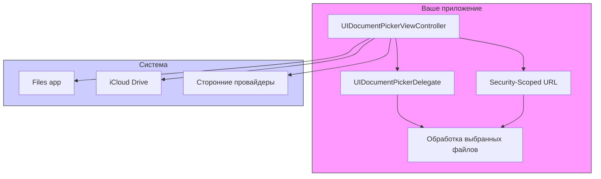

#uikit #document-picker #files #uidocumentpickerviewcontroller #file-management #ios #swift

---
### Определение
**UIDocumentPicker** — это системный контроллер, предоставляемый фреймворком [[UIKit]], который позволяет пользователям получать доступ к файлам и папкам за пределами песочницы (sandbox) вашего приложения . Он является частью инфраструктуры Document Picker и предоставляет безопасный способ работы с файлами из различных источников: iCloud Drive, локальное хранилище устройства, сторонние облачные сервисы (Dropbox, Google Drive и т.д.), интегрированные через File Provider расширения .

`UIDocumentPicker` позволяет приложению:
- **Импортировать** файлы (делать копию в свою песочницу).
- **Открывать** файлы (получать доступ к оригиналу по URL с помощью security-scoped bookmarks).
- **Экспортировать** файлы из своего приложения в другое место.
- **Перемещать** файлы между локациями.

### Зачем это знать iOS-разработчику?
1.  **Работа с файлами пользователя:** Позволяет приложению открывать и сохранять документы в общедоступных местах (например, пользователь выбирает [[PDF]] для просмотра).
2.  **Интеграция с облачными сервисами:** Автоматически работает со всеми провайдерами файлов, установленными на устройстве.
3.  **Безопасность:** Система сама управляет разрешениями через механизмы security-scoped bookmarks.
4.  **Поддержка Files app:** Ваше приложение может как открывать файлы из приложения "Файлы", так и сохранять в него.
5.  **UTI и типы файлов:** Можно ограничивать выбор только определенными типами документов (изображения, PDF, текст).

---

### Архитектура и ключевые компоненты



### Основные компоненты

#### 1. **[[UIDocumentPickerViewController]]**
Основной класс, представляющий системный интерфейс выбора документов.

**Инициализация:**
```swift
// Для импорта/открытия
init(forOpening contentTypes: [UTType], 
     asCopy: Bool = true)

// Для экспорта
init(forExporting urls: [URL], 
     asCopy: Bool = true)

// Для перемещения
init(forMoving urls: [URL], 
     copy: Bool = false)
```

#### 2. **[[UIDocumentPickerDelegate]]**
Протокол для получения результатов выбора пользователя.

```swift
protocol UIDocumentPickerDelegate: AnyObject {
    // Пользователь выбрал документы
    func documentPicker(_ controller: UIDocumentPickerViewController, 
                        didPickDocumentsAt urls: [URL])
    
    // Пользователь отменил выбор
    func documentPickerWasCancelled(_ controller: UIDocumentPickerViewController)
}
```

#### 3. **UTType (Uniform Type Identifiers)**
Система идентификации типов файлов (заменила устаревшие `kUTType` константы).

```swift
// Основные типы
UTType.pdf
UTType.image
UTType.plainText
UTType.movie
UTType.audio

// Кастомный тип по расширению
UTType(filenameExtension: "myappdata")
```

#### 4. **Security-Scoped Bookmarks**
Механизм для сохранения доступа к файлу между запусками приложения. Без этого доступ к файлу теряется после завершения работы приложения.

---

### Примеры от простого к сложному

#### Уровень 0: Настройка Info.plist

Для работы с iCloud Drive и файлами вне песочницы может потребоваться включить соответствующие возможности (Capabilities) в [[Xcode]]:

```xml
<!-- Info.plist -->
<key>LSSupportsOpeningDocumentsInPlace</key>
<true/>
<key>UISupportsDocumentBrowser</key>
<true/>
<key>UIFileSharingEnabled</key>
<true/> <!-- Для доступа к файлам приложения через iTunes -->
```

#### Уровень 1: Простой выбор одного документа

```swift
import UIKit
import UniformTypeIdentifiers

class SimpleDocumentPickerViewController: UIViewController {
    
    @IBOutlet weak var statusLabel: UILabel!
    
    @IBAction func pickDocumentTapped(_ sender: UIButton) {
        // Создаем пикер для открытия документов
        // asCopy: true - создаем копию в песочнице, false - получаем доступ к оригиналу
        let documentPicker = UIDocumentPickerViewController(forOpeningContentTypes: [.pdf, .plainText, .image], asCopy: true)
        documentPicker.delegate = self
        documentPicker.allowsMultipleSelection = false
        
        present(documentPicker, animated: true)
    }
}

extension SimpleDocumentPickerViewController: UIDocumentPickerDelegate {
    
    func documentPicker(_ controller: UIDocumentPickerViewController, 
                        didPickDocumentsAt urls: [URL]) {
        guard let selectedURL = urls.first else { return }
        
        // Важно: для доступа к файлу за пределами песочницы нужно начать доступ
        guard selectedURL.startAccessingSecurityScopedResource() else {
            statusLabel.text = "Нет доступа к файлу"
            return
        }
        
        // Всегда освобождаем доступ, когда закончили
        defer { selectedURL.stopAccessingSecurityScopedResource() }
        
        statusLabel.text = "Выбран файл: \(selectedURL.lastPathComponent)"
        
        // Здесь можно прочитать данные из файла
        do {
            let data = try Data(contentsOf: selectedURL)
            statusLabel.text? += "\nРазмер: \(data.count) байт"
        } catch {
            statusLabel.text = "Ошибка чтения файла: \(error.localizedDescription)"
        }
    }
    
    func documentPickerWasCancelled(_ controller: UIDocumentPickerViewController) {
        statusLabel.text = "Выбор отменен"
    }
}
```

#### Уровень 2: Множественный выбор с прогрессом

```swift
import UIKit
import UniformTypeIdentifiers

class MultiSelectDocumentPickerViewController: UIViewController {
    
    @IBOutlet weak var tableView: UITableView!
    @IBOutlet weak var progressView: UIProgressView!
    
    private var selectedFiles: [URL] = []
    private var fileData: [Data] = []
    
    @IBAction func pickMultipleDocumentsTapped(_ sender: UIButton) {
        let documentPicker = UIDocumentPickerViewController(forOpeningContentTypes: [.item], asCopy: true)
        documentPicker.delegate = self
        documentPicker.allowsMultipleSelection = true
        
        present(documentPicker, animated: true)
    }
}

extension MultiSelectDocumentPickerViewController: UIDocumentPickerDelegate {
    
    func documentPicker(_ controller: UIDocumentPickerViewController, 
                        didPickDocumentsAt urls: [URL]) {
        selectedFiles = urls
        fileData.removeAll()
        tableView.reloadData()
        
        // Загружаем файлы с индикацией прогресса
        loadFilesWithProgress(urls)
    }
    
    private func loadFilesWithProgress(_ urls: [URL]) {
        progressView.progress = 0
        progressView.isHidden = false
        
        let totalFiles = urls.count
        var loadedFiles = 0
        
        for url in urls {
            DispatchQueue.global(qos: .userInitiated).async { [weak self] in
                guard let self = self else { return }
                
                // Начинаем доступ к защищенному ресурсу
                guard url.startAccessingSecurityScopedResource() else { return }
                defer { url.stopAccessingSecurityScopedResource() }
                
                do {
                    let data = try Data(contentsOf: url)
                    
                    DispatchQueue.main.async {
                        self.fileData.append(data)
                        loadedFiles += 1
                        self.progressView.progress = Float(loadedFiles) / Float(totalFiles)
                        
                        if loadedFiles == totalFiles {
                            self.progressView.isHidden = true
                        }
                        
                        self.tableView.reloadData()
                    }
                } catch {
                    print("Ошибка загрузки \(url.lastPathComponent): \(error)")
                }
            }
        }
    }
}

extension MultiSelectDocumentPickerViewController: UITableViewDataSource {
    
    func tableView(_ tableView: UITableView, numberOfRowsInSection section: Int) -> Int {
        return selectedFiles.count
    }
    
    func tableView(_ tableView: UITableView, cellForRowAt indexPath: IndexPath) -> UITableViewCell {
        let cell = tableView.dequeueReusableCell(withIdentifier: "FileCell", for: indexPath)
        let fileURL = selectedFiles[indexPath.row]
        
        cell.textLabel?.text = fileURL.lastPathComponent
        
        if indexPath.row < fileData.count {
            let data = fileData[indexPath.row]
            cell.detailTextLabel?.text = "\(data.count) байт"
        } else {
            cell.detailTextLabel?.text = "Загрузка..."
        }
        
        return cell
    }
}
```

#### Уровень 3: Экспорт файла из приложения

```swift
import UIKit
import UniformTypeIdentifiers

class ExportDocumentViewController: UIViewController {
    
    @IBAction func createAndExportFileTapped(_ sender: UIButton) {
        // Создаем временный файл для экспорта
        let tempDirectory = FileManager.default.temporaryDirectory
        let fileURL = tempDirectory.appendingPathComponent("exported_data.txt")
        
        let content = "Это тестовый файл, созданный в приложении\nДата: \(Date())"
        
        do {
            try content.write(to: fileURL, atomically: true, encoding: .utf8)
            
            // Создаем пикер для экспорта
            let documentPicker = UIDocumentPickerViewController(forExporting: [fileURL], asCopy: true)
            documentPicker.delegate = self
            
            present(documentPicker, animated: true)
            
        } catch {
            showAlert("Ошибка создания файла: \(error.localizedDescription)")
        }
    }
    
    private func showAlert(_ message: String) {
        let alert = UIAlertController(title: "Экспорт", message: message, preferredStyle: .alert)
        alert.addAction(UIAlertAction(title: "OK", style: .default))
        present(alert, animated: true)
    }
}

extension ExportDocumentViewController: UIDocumentPickerDelegate {
    
    func documentPicker(_ controller: UIDocumentPickerViewController, 
                        didPickDocumentsAt urls: [URL]) {
        // После успешного экспорта
        showAlert("Файл успешно экспортирован в \(urls.first?.lastPathComponent ?? "неизвестно")")
        
        // Очищаем временный файл
        if let tempURL = urls.first?.deletingLastPathComponent().appendingPathComponent("exported_data.txt") {
            try? FileManager.default.removeItem(at: tempURL)
        }
    }
    
    func documentPickerWasCancelled(_ controller: UIDocumentPickerViewController) {
        showAlert("Экспорт отменен")
        
        // Очищаем временный файл
        let tempDirectory = FileManager.default.temporaryDirectory
        let tempURL = tempDirectory.appendingPathComponent("exported_data.txt")
        try? FileManager.default.removeItem(at: tempURL)
    }
}
```

#### Уровень 4: Работа с папками и перемещение файлов

```swift
import UIKit
import UniformTypeIdentifiers

class FolderOperationsViewController: UIViewController {
    
    @IBOutlet weak var logTextView: UITextView!
    
    // Выбор папки
    @IBAction func pickFolderTapped(_ sender: UIButton) {
        let documentPicker = UIDocumentPickerViewController(forOpeningContentTypes: [.folder], asCopy: false)
        documentPicker.delegate = self
        documentPicker.allowsMultipleSelection = false
        
        present(documentPicker, animated: true)
    }
    
    // Перемещение файла в выбранную папку
    @IBAction func moveFileTapped(_ sender: UIButton) {
        guard let fileToMove = createTestFile() else { return }
        
        let documentPicker = UIDocumentPickerViewController(forMoving: [fileToMove], copy: false)
        documentPicker.delegate = self
        documentPicker.allowsMultipleSelection = false
        
        present(documentPicker, animated: true)
    }
    
    private func createTestFile() -> URL? {
        let tempDirectory = FileManager.default.temporaryDirectory
        let fileURL = tempDirectory.appendingPathComponent("file_to_move.txt")
        
        let content = "Файл для перемещения \(Date())"
        
        do {
            try content.write(to: fileURL, atomically: true, encoding: .utf8)
            log("Создан тестовый файл: \(fileURL.path)")
            return fileURL
        } catch {
            log("Ошибка создания файла: \(error)")
            return nil
        }
    }
    
    private func log(_ message: String) {
        DispatchQueue.main.async {
            self.logTextView.text += "\n" + message
            let bottom = NSRange(location: self.logTextView.text.count - 1, length: 1)
            self.logTextView.scrollRangeToVisible(bottom)
        }
    }
}

extension FolderOperationsViewController: UIDocumentPickerDelegate {
    
    func documentPicker(_ controller: UIDocumentPickerViewController, 
                        didPickDocumentsAt urls: [URL]) {
        
        if controller.documentPickerMode == .open {
            // Выбрана папка
            guard let folderURL = urls.first else { return }
            
            guard folderURL.startAccessingSecurityScopedResource() else {
                log("Нет доступа к папке")
                return
            }
            defer { folderURL.stopAccessingSecurityScopedResource() }
            
            log("Выбрана папка: \(folderURL.path)")
            
            // Получаем содержимое папки
            do {
                let contents = try FileManager.default.contentsOfDirectory(at: folderURL,
                                                                           includingPropertiesForKeys: nil)
                log("Содержимое папки:")
                for item in contents {
                    log("  - \(item.lastPathComponent)")
                }
            } catch {
                log("Ошибка чтения папки: \(error)")
            }
            
        } else if controller.documentPickerMode == .move {
            // Файл перемещен
            guard let destinationURL = urls.first else { return }
            
            guard destinationURL.startAccessingSecurityScopedResource() else {
                log("Нет доступа к целевому файлу")
                return
            }
            defer { destinationURL.stopAccessingSecurityScopedResource() }
            
            log("Файл перемещен в: \(destinationURL.path)")
        }
    }
    
    func documentPickerWasCancelled(_ controller: UIDocumentPickerViewController) {
        log("Операция отменена")
    }
}
```

#### Уровень 5: Сохранение доступа с Security-Scoped Bookmarks

```swift
import UIKit
import UniformTypeIdentifiers

class BookmarkManagerViewController: UIViewController {
    
    @IBOutlet weak var bookmarksTableView: UITableView!
    
    private var bookmarkedURLs: [URL] = []
    private let bookmarksKey = "SavedDocumentBookmarks"
    
    override func viewDidLoad() {
        super.viewDidLoad()
        loadBookmarks()
    }
    
    @IBAction func addNewFileTapped(_ sender: UIButton) {
        let documentPicker = UIDocumentPickerViewController(forOpeningContentTypes: [.item], asCopy: false)
        documentPicker.delegate = self
        documentPicker.allowsMultipleSelection = true
        
        present(documentPicker, animated: true)
    }
    
    private func loadBookmarks() {
        guard let bookmarkDataArray = UserDefaults.standard.array(forKey: bookmarksKey) as? [Data] else { return }
        
        bookmarkedURLs = bookmarkDataArray.compactMap { bookmarkData in
            var isStale = false
            do {
                let url = try URL(resolvingBookmarkData: bookmarkData,
                                   options: .withSecurityScope,
                                   relativeTo: nil,
                                   bookmarkDataIsStale: &isStale)
                
                if isStale {
                    // Закладка устарела, нужно создать новую
                    return nil
                }
                
                return url
            } catch {
                print("Ошибка восстановления закладки: \(error)")
                return nil
            }
        }
        
        bookmarksTableView.reloadData()
    }
    
    private func saveBookmark(for url: URL) {
        guard !bookmarkedURLs.contains(url) else { return }
        
        do {
            let bookmarkData = try url.bookmarkData(options: .withSecurityScope,
                                                     includingResourceValuesForKeys: nil,
                                                     relativeTo: nil)
            
            // Сохраняем в UserDefaults
            var savedData = UserDefaults.standard.array(forKey: bookmarksKey) as? [Data] ?? []
            savedData.append(bookmarkData)
            UserDefaults.standard.set(savedData, forKey: bookmarksKey)
            
            bookmarkedURLs.append(url)
            bookmarksTableView.reloadData()
            
        } catch {
            print("Ошибка создания закладки: \(error)")
        }
    }
    
    private func readFile(at url: URL) {
        guard url.startAccessingSecurityScopedResource() else { return }
        defer { url.stopAccessingSecurityScopedResource() }
        
        do {
            let content = try String(contentsOf: url, encoding: .utf8)
            showAlert("Содержимое файла:\n\(content.prefix(200))...")
        } catch {
            showAlert("Ошибка чтения: \(error.localizedDescription)")
        }
    }
    
    private func showAlert(_ message: String) {
        let alert = UIAlertController(title: "Файл", message: message, preferredStyle: .alert)
        alert.addAction(UIAlertAction(title: "OK", style: .default))
        present(alert, animated: true)
    }
}

extension BookmarkManagerViewController: UIDocumentPickerDelegate {
    
    func documentPicker(_ controller: UIDocumentPickerViewController, 
                        didPickDocumentsAt urls: [URL]) {
        for url in urls {
            // Сохраняем закладку для постоянного доступа
            saveBookmark(for: url)
        }
    }
}

extension BookmarkManagerViewController: UITableViewDataSource {
    
    func tableView(_ tableView: UITableView, numberOfRowsInSection section: Int) -> Int {
        return bookmarkedURLs.count
    }
    
    func tableView(_ tableView: UITableView, cellForRowAt indexPath: IndexPath) -> UITableViewCell {
        let cell = tableView.dequeueReusableCell(withIdentifier: "BookmarkCell", for: indexPath)
        let url = bookmarkedURLs[indexPath.row]
        
        cell.textLabel?.text = url.lastPathComponent
        cell.detailTextLabel?.text = url.path
        
        return cell
    }
    
    func tableView(_ tableView: UITableView, commit editingStyle: UITableViewCell.EditingStyle, 
                   forRowAt indexPath: IndexPath) {
        if editingStyle == .delete {
            // Удаляем закладку
            bookmarkedURLs.remove(at: indexPath.row)
            
            // Обновляем UserDefaults
            var savedData = UserDefaults.standard.array(forKey: bookmarksKey) as? [Data] ?? []
            savedData.remove(at: indexPath.row)
            UserDefaults.standard.set(savedData, forKey: bookmarksKey)
            
            tableView.deleteRows(at: [indexPath], with: .fade)
        }
    }
    
    func tableView(_ tableView: UITableView, didSelectRowAt indexPath: IndexPath) {
        tableView.deselectRow(at: indexPath, animated: true)
        
        let url = bookmarkedURLs[indexPath.row]
        readFile(at: url)
    }
}
```

#### Уровень 6: Интеграция со [[SwiftUI]]

```swift
import SwiftUI
import UIKit
import UniformTypeIdentifiers

struct DocumentPicker: UIViewControllerRepresentable {
    let contentTypes: [UTType]
    let allowsMultipleSelection: Bool
    let asCopy: Bool
    let onPick: ([URL]) -> Void
    let onCancel: () -> Void
    
    func makeUIViewController(context: Context) -> UIDocumentPickerViewController {
        let picker = UIDocumentPickerViewController(forOpeningContentTypes: contentTypes, asCopy: asCopy)
        picker.delegate = context.coordinator
        picker.allowsMultipleSelection = allowsMultipleSelection
        return picker
    }
    
    func updateUIViewController(_ uiViewController: UIDocumentPickerViewController, context: Context) {}
    
    func makeCoordinator() -> Coordinator {
        Coordinator(onPick: onPick, onCancel: onCancel)
    }
    
    class Coordinator: NSObject, UIDocumentPickerDelegate {
        let onPick: ([URL]) -> Void
        let onCancel: () -> Void
        
        init(onPick: @escaping ([URL]) -> Void, onCancel: @escaping () -> Void) {
            self.onPick = onPick
            self.onCancel = onCancel
        }
        
        func documentPicker(_ controller: UIDocumentPickerViewController, 
                           didPickDocumentsAt urls: [URL]) {
            onPick(urls)
        }
        
        func documentPickerWasCancelled(_ controller: UIDocumentPickerViewController) {
            onCancel()
        }
    }
}

// Пример использования в SwiftUI
struct ContentView: View {
    @State private var isPickerPresented = false
    @State private var selectedFiles: [URL] = []
    @State private var fileContents: String = ""
    
    var body: some View {
        VStack {
            List(selectedFiles, id: \.self) { url in
                Text(url.lastPathComponent)
            }
            
            Text(fileContents)
                .padding()
                .frame(maxWidth: .infinity, maxHeight: .infinity)
            
            Button("Выбрать файлы") {
                isPickerPresented = true
            }
            .padding()
        }
        .sheet(isPresented: $isPickerPresented) {
            DocumentPicker(contentTypes: [.plainText, .pdf],
                          allowsMultipleSelection: true,
                          asCopy: true,
                          onPick: { urls in
                selectedFiles = urls
                loadFirstFile(urls.first)
                isPickerPresented = false
            },
                          onCancel: {
                isPickerPresented = false
            })
        }
    }
    
    private func loadFirstFile(_ url: URL?) {
        guard let url = url else { return }
        
        // Важно: в SwiftUI нужно управлять доступом
        guard url.startAccessingSecurityScopedResource() else { return }
        defer { url.stopAccessingSecurityScopedResource() }
        
        do {
            fileContents = try String(contentsOf: url, encoding: .utf8)
        } catch {
            fileContents = "Ошибка: \(error.localizedDescription)"
        }
    }
}
```

#### Уровень 7: Создание кастомного провайдера файлов (File Provider)

Это продвинутый пример для приложений, которые хотят предоставлять свои файлы через системный файловый менеджер.

```swift
import FileProvider
import UIKit

// Это упрощенный пример, полная реализация требует FileProviderExtension
class CustomFileProvider {
    
    static func registerFileProvider() {
        // В Info.plist нужно добавить расширение File Provider
        // и соответствующие entitlements
        
        let fileProviderManager = NSFileProviderManager.default
        fileProviderManager.signalEnumerator(for: .workingSet) { error in
            if let error = error {
                print("Ошибка сигнала: \(error)")
            }
        }
    }
    
    static func provideFile(at url: URL, completion: @escaping (URL?, Error?) -> Void) {
        // Создаем временную копию файла для доступа из других приложений
        let tempURL = FileManager.default.temporaryDirectory
            .appendingPathComponent(url.lastPathComponent)
        
        do {
            try FileManager.default.copyItem(at: url, to: tempURL)
            completion(tempURL, nil)
        } catch {
            completion(nil, error)
        }
    }
}

// Использование в приложении для предоставления файла другому приложению
class FileProviderIntegrationViewController: UIViewController {
    
    @IBAction func shareViaFileProvider(_ sender: UIButton) {
        // Создаем временный файл для шаринга
        let tempURL = FileManager.default.temporaryDirectory
            .appendingPathComponent("shared_data.dat")
        
        let data = "Данные для шаринга".data(using: .utf8)!
        try? data.write(to: tempURL)
        
        // Используем UIDocumentPicker для экспорта
        let documentPicker = UIDocumentPickerViewController(forExporting: [tempURL], asCopy: true)
        documentPicker.delegate = self
        
        present(documentPicker, animated: true)
    }
}

extension FileProviderIntegrationViewController: UIDocumentPickerDelegate {
    func documentPicker(_ controller: UIDocumentPickerViewController, 
                        didPickDocumentsAt urls: [URL]) {
        print("Файл экспортирован")
        
        // Очищаем временный файл
        let tempURL = FileManager.default.temporaryDirectory
            .appendingPathComponent("shared_data.dat")
        try? FileManager.default.removeItem(at: tempURL)
    }
}
```

#### Уровень 8: Комплексный менеджер документов

```swift
import UIKit
import UniformTypeIdentifiers

class DocumentManager {
    
    static let shared = DocumentManager()
    private let bookmarksKey = "DocumentManagerBookmarks"
    private var bookmarks: [URL: Data] = [:]
    
    private init() {
        loadBookmarks()
    }
    
    // MARK: - Выбор документов
    func pickDocuments(from viewController: UIViewController,
                       contentTypes: [UTType] = [.item],
                       allowsMultiple: Bool = true,
                       asCopy: Bool = true,
                       completion: @escaping ([URL]) -> Void) {
        
        let picker = UIDocumentPickerViewController(forOpeningContentTypes: contentTypes, asCopy: asCopy)
        picker.allowsMultipleSelection = allowsMultiple
        
        let delegate = DocumentPickerDelegate(completion: completion)
        picker.delegate = delegate
        
        // Сохраняем делегат, чтобы он не освобождался
        objc_setAssociatedObject(picker, "delegateKey", delegate, .OBJC_ASSOCIATION_RETAIN)
        
        viewController.present(picker, animated: true)
    }
    
    // MARK: - Экспорт документов
    func exportDocument(_ url: URL,
                        from viewController: UIViewController,
                        asCopy: Bool = true,
                        completion: @escaping (URL?) -> Void) {
        
        let picker = UIDocumentPickerViewController(forExporting: [url], asCopy: asCopy)
        let delegate = DocumentPickerExportDelegate(originalURL: url, completion: completion)
        picker.delegate = delegate
        
        objc_setAssociatedObject(picker, "delegateKey", delegate, .OBJC_ASSOCIATION_RETAIN)
        
        viewController.present(picker, animated: true)
    }
    
    // MARK: - Работа с закладками
    func saveBookmark(for url: URL) -> Bool {
        guard !bookmarks.keys.contains(url) else { return true }
        
        do {
            let bookmarkData = try url.bookmarkData(options: .withSecurityScope,
                                                     includingResourceValuesForKeys: nil,
                                                     relativeTo: nil)
            
            bookmarks[url] = bookmarkData
            
            // Сохраняем в UserDefaults
            var savedData = UserDefaults.standard.dictionary(forKey: bookmarksKey) ?? [:]
            savedData[url.absoluteString] = bookmarkData
            UserDefaults.standard.set(savedData, forKey: bookmarksKey)
            
            return true
        } catch {
            print("Ошибка создания закладки: \(error)")
            return false
        }
    }
    
    func accessFile(at url: URL, accessBlock: (URL) -> Void) {
        guard url.startAccessingSecurityScopedResource() else {
            print("Нет доступа к файлу")
            return
        }
        
        defer { url.stopAccessingSecurityScopedResource() }
        accessBlock(url)
    }
    
    private func loadBookmarks() {
        guard let savedData = UserDefaults.standard.dictionary(forKey: bookmarksKey) as? [String: Data] else { return }
        
        for (urlString, bookmarkData) in savedData {
            var isStale = false
            do {
                let url = try URL(resolvingBookmarkData: bookmarkData,
                                   options: .withSecurityScope,
                                   relativeTo: nil,
                                   bookmarkDataIsStale: &isStale)
                
                if !isStale {
                    bookmarks[url] = bookmarkData
                }
            } catch {
                print("Ошибка восстановления закладки: \(error)")
            }
        }
    }
    
    // MARK: - Вспомогательные методы
    func readTextFile(at url: URL) -> String? {
        var result: String?
        
        accessFile(at: url) { accessibleURL in
            result = try? String(contentsOf: accessibleURL, encoding: .utf8)
        }
        
        return result
    }
    
    func readData(at url: URL) -> Data? {
        var result: Data?
        
        accessFile(at: url) { accessibleURL in
            result = try? Data(contentsOf: accessibleURL)
        }
        
        return result
    }
}

// Вспомогательные классы делегатов
private class DocumentPickerDelegate: NSObject, UIDocumentPickerDelegate {
    let completion: ([URL]) -> Void
    
    init(completion: @escaping ([URL]) -> Void) {
        self.completion = completion
    }
    
    func documentPicker(_ controller: UIDocumentPickerViewController, 
                        didPickDocumentsAt urls: [URL]) {
        completion(urls)
    }
    
    func documentPickerWasCancelled(_ controller: UIDocumentPickerViewController) {
        completion([])
    }
}

private class DocumentPickerExportDelegate: NSObject, UIDocumentPickerDelegate {
    let originalURL: URL
    let completion: (URL?) -> Void
    
    init(originalURL: URL, completion: @escaping (URL?) -> Void) {
        self.originalURL = originalURL
        self.completion = completion
    }
    
    func documentPicker(_ controller: UIDocumentPickerViewController, 
                        didPickDocumentsAt urls: [URL]) {
        completion(urls.first)
        
        // Очищаем оригинальный файл, если это временный
        if originalURL.path.contains(NSTemporaryDirectory()) {
            try? FileManager.default.removeItem(at: originalURL)
        }
    }
    
    func documentPickerWasCancelled(_ controller: UIDocumentPickerViewController) {
        completion(nil)
        
        if originalURL.path.contains(NSTemporaryDirectory()) {
            try? FileManager.default.removeItem(at: originalURL)
        }
    }
}

// Использование DocumentManager
class DocumentManagerViewController: UIViewController {
    
    @IBAction func pickFileTapped(_ sender: UIButton) {
        DocumentManager.shared.pickDocuments(from: self, contentTypes: [.pdf, .image]) { urls in
            guard let url = urls.first else { return }
            
            // Сохраняем закладку для будущего доступа
            DocumentManager.shared.saveBookmark(for: url)
            
            // Читаем файл
            if let content = DocumentManager.shared.readTextFile(at: url) {
                print("Содержимое: \(content)")
            }
        }
    }
}
```

---

### Важные нюансы и Best Practices

#### 1. **Security-Scoped Resources**
Всегда используйте `startAccessingSecurityScopedResource()` и `stopAccessingSecurityScopedResource()` при работе с URL, полученными из Document Picker. Это обязательно для файлов вне песочницы .

```swift
guard url.startAccessingSecurityScopedResource() else { return }
defer { url.stopAccessingSecurityScopedResource() }
// Работа с файлом
```

#### 2. **Управление жизненным циклом URL**
URL, полученные из пикера, действительны только в течение текущего запуска приложения. Для постоянного доступа сохраняйте security-scoped bookmarks .

#### 3. **Типы контента (UTType)**
Используйте современный API `UTType` вместо устаревших `kUTType` констант.

#### 4. **Множественный выбор**
При `allowsMultipleSelection = true` всегда проверяйте массив `urls`, даже если ожидаете один файл.

#### 5. **Copy vs Open**
- `asCopy = true` — приложение получает копию файла в свою песочницу. Безопасно, не требует bookmarks.
- `asCopy = false` — приложение получает доступ к оригиналу. Требует security-scoped доступ и bookmarks для постоянного хранения.

#### 6. **Обработка ошибок**
Всегда обрабатывайте возможные ошибки при чтении файлов и создании закладок.

#### 7. **UI-поток**
Методы делегата вызываются на главном потоке, но чтение файлов лучше выполнять в фоне.

#### 8. **Совместимость**
`UIDocumentPicker` доступен с iOS 8.0, но для поддержки новых типов и режимов используйте iOS 14+.

### Итог
**UIDocumentPicker** — это мощный и безопасный инструмент для интеграции вашего приложения с файловой системой устройства и облачными хранилищами. Он позволяет:

1.  **Импортировать и экспортировать** документы.
2.  **Работать с папками** и перемещать файлы.
3.  **Сохранять постоянный доступ** через security-scoped bookmarks.
4.  **Интегрироваться со SwiftUI** через `UIViewControllerRepresentable`.
5.  **Ограничивать выбор** определенными типами файлов.

Ключевые навыки: понимание режимов работы (import/open/export/move), управление security-scoped доступом, работа с UTType, сохранение и восстановление закладок, обработка асинхронных результатов через делегат.