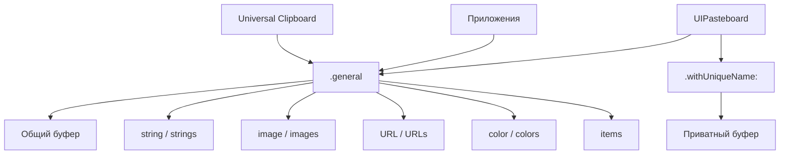

#UIPasteboard #UIKit #iOS #Swift #Clipboard #CopyPaste #GeneralPasteboard #UTI #DataTransfer #Security

---
**(системный буфер обмена / доступ к общей папке для копирования и вставки)**

**UIPasteboard** — это класс из фреймворка **[[UIKit]]**, который предоставляет доступ к **системному буферу обмена (clipboard)**, позволяя приложениям копировать, вставлять и обмениваться данными как внутри приложения, так и между разными приложениями на устройстве. 

**Ключевые особенности (важно в 2026):**
- Буфер обмена является **глобальным и общим** для всех приложений на устройстве (на iPad/iPhone) 
- Поддерживает **различные типы данных**: текст, изображения, [[URL]], цвета, пользовательские объекты и многие другие 
- Позволяет проверять **наличие данных** определённого типа без их загрузки 
- Существует **общий буфер** (`general`) и **буферы для конкретных приложений** (`withUniqueName:`) 
- Поддерживает **чтение данных по запросу** (lazy reading) для экономии памяти, когда данные ещё не загружены в память 
- Используется для реализации таких функций, как копирование в буфер обмена, вставка, перетаскивание и поддержка универсального буфера обмена (Universal Clipboard) между устройствами Apple 

---

### Основные свойства и методы UIPasteboard

| Свойство/Метод         | Тип                          | Назначение                                         |
| ---------------------- | ---------------------------- | -------------------------------------------------- |
| `general`              | `UIPasteboard` (статическое) | Получение общего системного буфера обмена          |
| `withUniqueName()`     | `UIPasteboard`               | Создание приватного буфера для приложения          |
| `string`               | [[String]]?                  | Получение/установка текстовых данных               |
| `strings`              | `[String]?`                  | Получение/установка нескольких текстовых элементов |
| `image`                | [[UIImage]]?                 | Получение/установка изображения                    |
| `images`               | `[UIImage]?`                 | Получение/установка нескольких изображений         |
| `URL`                  | `URL?`                       | Получение/установка URL                            |
| `URLs`                 | `[URL]?`                     | Получение/установка нескольких URL                 |
| `color`                | [[UIColor]]?                 | Получение/установка цвета                          |
| `colors`               | `[UIColor]?`                 | Получение/установка нескольких цветов              |
| `hasStrings`           | [[Bool]]                     | Проверка наличия текстовых данных (без загрузки)   |
| `hasImages`            | `Bool`                       | Проверка наличия изображений                       |
| `hasURLs`              | `Bool`                       | Проверка наличия URL                               |
| `numberOfItems`        | Int                          | Количество элементов в буфере                      |
| `items`                | `[[String: Any]]`            | Получение всех элементов в виде массива словарей   |
| `addItems(_:)`         | `() -> Void`                 | Добавление элементов в буфер (без очистки)         |
| `setItems(_:options:)` | `() -> Void`                 | Установка элементов (с возможностью очистки)       |

---

### Схема взаимосвязей



---

### Примеры (от простого к сложному)

#### 1. Базовое копирование и вставка текста
```swift
import UIKit

class BasicPasteboardViewController: UIViewController {
    
    private let textField = UITextField()
    private let displayLabel = UILabel()
    
    override func viewDidLoad() {
        super.viewDidLoad()
        setupUI()
    }
    
    private func setupUI() {
        // 1. Текстовое поле для ввода
        textField.placeholder = "Введите текст для копирования"
        textField.borderStyle = .roundedRect
        textField.frame = CGRect(x: 20, y: 100, width: view.bounds.width - 40, height: 44)
        view.addSubview(textField)
        
        // 2. Кнопка копирования
        let copyButton = UIButton(type: .system)
        copyButton.setTitle("📋 Копировать", for: .normal)
        copyButton.addTarget(self, action: #selector(copyText), for: .touchUpInside)
        copyButton.frame = CGRect(x: 20, y: 160, width: 120, height: 44)
        view.addSubview(copyButton)
        
        // 3. Кнопка вставки
        let pasteButton = UIButton(type: .system)
        pasteButton.setTitle("📄 Вставить", for: .normal)
        pasteButton.addTarget(self, action: #selector(pasteText), for: .touchUpInside)
        pasteButton.frame = CGRect(x: 160, y: 160, width: 120, height: 44)
        view.addSubview(pasteButton)
        
        // 4. Метка для отображения результата
        displayLabel.frame = CGRect(x: 20, y: 220, width: view.bounds.width - 40, height: 100)
        displayLabel.numberOfLines = 0
        displayLabel.textAlignment = .center
        displayLabel.font = .systemFont(ofSize: 18)
        displayLabel.backgroundColor = .systemGray6
        displayLabel.layer.cornerRadius = 8
        view.addSubview(displayLabel)
    }
    
    @objc private func copyText() {
        guard let text = textField.text, !text.isEmpty else { return }
        
        // 1. Получаем общий буфер обмена
        let pasteboard = UIPasteboard.general
        
        // 2. Записываем текст в буфер
        pasteboard.string = text
        
        displayLabel.text = "✅ Скопировано: \(text)"
        textField.text = ""
    }
    
    @objc private func pasteText() {
        // 1. Получаем общий буфер обмена
        let pasteboard = UIPasteboard.general
        
        // 2. Проверяем наличие текстовых данных
        guard pasteboard.hasStrings else {
            displayLabel.text = "⚠️ Нет текста для вставки"
            return
        }
        
        // 3. Читаем текст из буфера
        if let text = pasteboard.string {
            displayLabel.text = "📄 Вставлено: \(text)"
            textField.text = text
        }
    }
}
```

#### 2. Копирование и вставка изображений
```swift
class ImagePasteboardViewController: UIViewController {
    
    private let imageView = UIImageView()
    private let pasteboard = UIPasteboard.general
    
    override func viewDidLoad() {
        super.viewDidLoad()
        setupUI()
    }
    
    private func setupUI() {
        // 1. ImageView для отображения
        imageView.frame = CGRect(x: 50, y: 100, width: 200, height: 200)
        imageView.contentMode = .scaleAspectFit
        imageView.backgroundColor = .systemGray5
        imageView.layer.cornerRadius = 12
        imageView.layer.borderWidth = 2
        imageView.layer.borderColor = UIColor.systemGray3.cgColor
        view.addSubview(imageView)
        
        // 2. Кнопка копирования изображения
        let copyButton = UIButton(type: .system)
        copyButton.setTitle("🖼️ Копировать изображение", for: .normal)
        copyButton.addTarget(self, action: #selector(copyImage), for: .touchUpInside)
        copyButton.frame = CGRect(x: 20, y: 320, width: 180, height: 44)
        view.addSubview(copyButton)
        
        // 3. Кнопка вставки изображения
        let pasteButton = UIButton(type: .system)
        pasteButton.setTitle("📥 Вставить изображение", for: .normal)
        pasteButton.addTarget(self, action: #selector(pasteImage), for: .touchUpInside)
        pasteButton.frame = CGRect(x: 210, y: 320, width: 180, height: 44)
        view.addSubview(pasteButton)
        
        // 4. Создаём тестовое изображение
        let renderer = UIGraphicsImageRenderer(size: CGSize(width: 200, height: 200))
        let image = renderer.image { context in
            UIColor.systemBlue.setFill()
            context.fill(CGRect(x: 0, y: 0, width: 200, height: 200))
            
            UIColor.white.setFill()
            let text = "📸" as NSString
            text.draw(at: CGPoint(x: 70, y: 60), withAttributes: [
                .font: UIFont.systemFont(ofSize: 60)
            ])
        }
        imageView.image = image
    }
    
    @objc private func copyImage() {
        guard let image = imageView.image else { return }
        
        // 1. Записываем изображение в буфер
        pasteboard.image = image
        showAlert(title: "✅", message: "Изображение скопировано")
    }
    
    @objc private func pasteImage() {
        // 1. Проверяем наличие изображения
        guard pasteboard.hasImages else {
            showAlert(title: "⚠️", message: "Нет изображения для вставки")
            return
        }
        
        // 2. Читаем изображение из буфера
        if let image = pasteboard.image {
            imageView.image = image
            showAlert(title: "✅", message: "Изображение вставлено")
        }
    }
    
    private func showAlert(title: String, message: String) {
        let alert = UIAlertController(title: title, message: message, preferredStyle: .alert)
        alert.addAction(UIAlertAction(title: "OK", style: .default))
        present(alert, animated: true)
    }
}
```

#### 3. Копирование и вставка URL
```swift
class URLPasteboardViewController: UIViewController {
    
    private let urlTextField = UITextField()
    private let pasteboard = UIPasteboard.general
    
    override func viewDidLoad() {
        super.viewDidLoad()
        setupUI()
    }
    
    private func setupUI() {
        // 1. Текстовое поле для URL
        urlTextField.placeholder = "Введите URL (например, apple.com)"
        urlTextField.borderStyle = .roundedRect
        urlTextField.frame = CGRect(x: 20, y: 100, width: view.bounds.width - 40, height: 44)
        view.addSubview(urlTextField)
        
        // 2. Кнопка копирования URL
        let copyButton = UIButton(type: .system)
        copyButton.setTitle("🔗 Копировать URL", for: .normal)
        copyButton.addTarget(self, action: #selector(copyURL), for: .touchUpInside)
        copyButton.frame = CGRect(x: 20, y: 160, width: 140, height: 44)
        view.addSubview(copyButton)
        
        // 3. Кнопка вставки URL
        let pasteButton = UIButton(type: .system)
        pasteButton.setTitle("📥 Вставить URL", for: .normal)
        pasteButton.addTarget(self, action: #selector(pasteURL), for: .touchUpInside)
        pasteButton.frame = CGRect(x: 180, y: 160, width: 140, height: 44)
        view.addSubview(pasteButton)
        
        // 4. Кнопка открытия URL в Safari
        let openButton = UIButton(type: .system)
        openButton.setTitle("🌐 Открыть в Safari", for: .normal)
        openButton.addTarget(self, action: #selector(openURL), for: .touchUpInside)
        openButton.frame = CGRect(x: 20, y: 220, width: 300, height: 44)
        view.addSubview(openButton)
    }
    
    @objc private func copyURL() {
        guard let text = urlTextField.text, !text.isEmpty else { return }
        
        // 1. Создаём URL из строки
        var urlString = text
        if !urlString.hasPrefix("http://") && !urlString.hasPrefix("https://") {
            urlString = "https://" + urlString
        }
        
        guard let url = URL(string: urlString) else {
            showAlert(message: "Неверный формат URL")
            return
        }
        
        // 2. Записываем URL в буфер
        pasteboard.url = url
        showAlert(message: "✅ URL скопирован: \(url.absoluteString)")
    }
    
    @objc private func pasteURL() {
        guard pasteboard.hasURLs else {
            showAlert(message: "⚠️ Нет URL для вставки")
            return
        }
        
        if let url = pasteboard.url {
            urlTextField.text = url.absoluteString
            showAlert(message: "📥 URL вставлен: \(url.absoluteString)")
        }
    }
    
    @objc private func openURL() {
        guard let text = urlTextField.text, !text.isEmpty else { return }
        
        var urlString = text
        if !urlString.hasPrefix("http://") && !urlString.hasPrefix("https://") {
            urlString = "https://" + urlString
        }
        
        guard let url = URL(string: urlString) else {
            showAlert(message: "Неверный URL")
            return
        }
        
        UIApplication.shared.open(url) { success in
            if success {
                print("✅ URL открыт")
            } else {
                self.showAlert(message: "❌ Не удалось открыть URL")
            }
        }
    }
    
    private func showAlert(message: String) {
        let alert = UIAlertController(title: "Результат", message: message, preferredStyle: .alert)
        alert.addAction(UIAlertAction(title: "OK", style: .default))
        present(alert, animated: true)
    }
}
```

#### 4. Копирование нескольких элементов (текст + изображение)
```swift
class MultipleItemsPasteboardViewController: UIViewController {
    
    private let textField = UITextField()
    private let imageView = UIImageView()
    private let pasteboard = UIPasteboard.general
    
    override func viewDidLoad() {
        super.viewDidLoad()
        setupUI()
    }
    
    private func setupUI() {
        // 1. Текстовое поле
        textField.placeholder = "Введите текст"
        textField.borderStyle = .roundedRect
        textField.frame = CGRect(x: 20, y: 100, width: view.bounds.width - 40, height: 44)
        view.addSubview(textField)
        
        // 2. ImageView
        imageView.frame = CGRect(x: 50, y: 160, width: 150, height: 150)
        imageView.contentMode = .scaleAspectFit
        imageView.backgroundColor = .systemGray5
        imageView.layer.cornerRadius = 8
        view.addSubview(imageView)
        
        // 3. Кнопка копирования нескольких элементов
        let copyMultiButton = UIButton(type: .system)
        copyMultiButton.setTitle("📋 Копировать всё", for: .normal)
        copyMultiButton.addTarget(self, action: #selector(copyMultipleItems), for: .touchUpInside)
        copyMultiButton.frame = CGRect(x: 20, y: 330, width: 160, height: 44)
        view.addSubview(copyMultiButton)
        
        // 4. Кнопка вставки
        let pasteButton = UIButton(type: .system)
        pasteButton.setTitle("📥 Вставить всё", for: .normal)
        pasteButton.addTarget(self, action: #selector(pasteMultipleItems), for: .touchUpInside)
        pasteButton.frame = CGRect(x: 200, y: 330, width: 160, height: 44)
        view.addSubview(pasteButton)
        
        // 5. Создаём тестовое изображение
        let renderer = UIGraphicsImageRenderer(size: CGSize(width: 150, height: 150))
        let image = renderer.image { context in
            UIColor.systemGreen.setFill()
            context.fill(CGRect(x: 0, y: 0, width: 150, height: 150))
            
            UIColor.white.setFill()
            let text = "🖼️" as NSString
            text.draw(at: CGPoint(x: 40, y: 40), withAttributes: [
                .font: UIFont.systemFont(ofSize: 50)
            ])
        }
        imageView.image = image
    }
    
    @objc private func copyMultipleItems() {
        guard let text = textField.text, !text.isEmpty else {
            showAlert(message: "Введите текст")
            return
        }
        
        guard let image = imageView.image else {
            showAlert(message: "Нет изображения")
            return
        }
        
        // 1. Создаём массив элементов
        let items: [[String: Any]] = [
            [UTType.plainText.identifier: text],
            [UTType.image.identifier: image]
        ]
        
        // 2. Устанавливаем элементы в буфер
        pasteboard.setItems(items, options: [:])
        showAlert(message: "✅ Скопировано: текст + изображение")
    }
    
    @objc private func pasteMultipleItems() {
        // 1. Проверяем наличие элементов
        guard pasteboard.numberOfItems > 0 else {
            showAlert(message: "⚠️ Буфер пуст")
            return
        }
        
        var pasteMessage = "📥 Вставлено:"
        var hasText = false
        var hasImage = false
        
        // 2. Проверяем наличие текста
        if pasteboard.hasStrings {
            if let text = pasteboard.string {
                textField.text = text
                pasteMessage += "\n- Текст: \(text)"
                hasText = true
            }
        }
        
        // 3. Проверяем наличие изображения
        if pasteboard.hasImages {
            if let image = pasteboard.image {
                imageView.image = image
                pasteMessage += "\n- Изображение"
                hasImage = true
            }
        }
        
        if !hasText && !hasImage {
            showAlert(message: "⚠️ Нет поддерживаемых данных")
        } else {
            showAlert(message: pasteMessage)
        }
    }
    
    private func showAlert(message: String) {
        let alert = UIAlertController(title: "Результат", message: message, preferredStyle: .alert)
        alert.addAction(UIAlertAction(title: "OK", style: .default))
        present(alert, animated: true)
    }
}
```

#### 5. Копирование пользовательских объектов (через NSKeyedArchiver)
```swift
// 1. Определяем пользовательский объект, поддерживающий кодирование
class Person: NSObject, NSSecureCoding {
    static var supportsSecureCoding: Bool { return true }
    
    let name: String
    let age: Int
    
    init(name: String, age: Int) {
        self.name = name
        self.age = age
        super.init()
    }
    
    required init?(coder: NSCoder) {
        guard let name = coder.decodeObject(of: NSString.self, forKey: "name") as String? else { return nil }
        let age = coder.decodeInteger(forKey: "age")
        
        self.name = name
        self.age = age
    }
    
    func encode(with coder: NSCoder) {
        coder.encode(name as NSString, forKey: "name")
        coder.encode(age, forKey: "age")
    }
}

class CustomObjectPasteboardViewController: UIViewController {
    
    private let nameField = UITextField()
    private let ageField = UITextField()
    private let infoLabel = UILabel()
    private let pasteboard = UIPasteboard.general
    
    override func viewDidLoad() {
        super.viewDidLoad()
        setupUI()
    }
    
    private func setupUI() {
        // 1. Поле для имени
        nameField.placeholder = "Имя"
        nameField.borderStyle = .roundedRect
        nameField.frame = CGRect(x: 20, y: 100, width: view.bounds.width - 40, height: 44)
        view.addSubview(nameField)
        
        // 2. Поле для возраста
        ageField.placeholder = "Возраст"
        ageField.borderStyle = .roundedRect
        ageField.keyboardType = .numberPad
        ageField.frame = CGRect(x: 20, y: 160, width: view.bounds.width - 40, height: 44)
        view.addSubview(ageField)
        
        // 3. Информационная метка
        infoLabel.frame = CGRect(x: 20, y: 220, width: view.bounds.width - 40, height: 60)
        infoLabel.numberOfLines = 0
        infoLabel.textAlignment = .center
        infoLabel.font = .systemFont(ofSize: 16)
        view.addSubview(infoLabel)
        
        // 4. Кнопка копирования объекта
        let copyButton = UIButton(type: .system)
        copyButton.setTitle("📋 Копировать объект Person", for: .normal)
        copyButton.addTarget(self, action: #selector(copyPerson), for: .touchUpInside)
        copyButton.frame = CGRect(x: 20, y: 300, width: 200, height: 44)
        view.addSubview(copyButton)
        
        // 5. Кнопка вставки объекта
        let pasteButton = UIButton(type: .system)
        pasteButton.setTitle("📥 Вставить объект Person", for: .normal)
        pasteButton.addTarget(self, action: #selector(pastePerson), for: .touchUpInside)
        pasteButton.frame = CGRect(x: 230, y: 300, width: 200, height: 44)
        view.addSubview(pasteButton)
    }
    
    @objc private func copyPerson() {
        guard let name = nameField.text, !name.isEmpty else {
            showAlert(message: "Введите имя")
            return
        }
        
        guard let ageText = ageField.text, let age = Int(ageText) else {
            showAlert(message: "Введите возраст (число)")
            return
        }
        
        // 1. Создаём объект
        let person = Person(name: name, age: age)
        
        // 2. Архивируем объект в Data
        do {
            let data = try NSKeyedArchiver.archivedData(withRootObject: person, requiringSecureCoding: true)
            
            // 3. Создаём элемент с типом для пользовательского объекта
            let item = ["com.myapp.person": data]
            
            // 4. Записываем в буфер
            pasteboard.setItems([item], options: [:])
            
            infoLabel.text = "✅ Скопирован: \(person.name), \(person.age) лет"
        } catch {
            showAlert(message: "❌ Ошибка копирования: \(error.localizedDescription)")
        }
    }
    
    @objc private func pastePerson() {
        // 1. Проверяем наличие элемента с нашим типом
        let typeIdentifier = "com.myapp.person"
        
        guard let data = pasteboard.data(forPasteboardType: typeIdentifier) else {
            showAlert(message: "⚠️ Нет объекта Person в буфере")
            return
        }
        
        // 2. Деархивируем объект
        do {
            let person = try NSKeyedUnarchiver.unarchivedObject(ofClass: Person.self, from: data)
            
            if let person = person {
                nameField.text = person.name
                ageField.text = "\(person.age)"
                infoLabel.text = "📥 Вставлен: \(person.name), \(person.age) лет"
            } else {
                showAlert(message: "❌ Не удалось восстановить объект")
            }
        } catch {
            showAlert(message: "❌ Ошибка вставки: \(error.localizedDescription)")
        }
    }
    
    private func showAlert(message: String) {
        let alert = UIAlertController(title: "Результат", message: message, preferredStyle: .alert)
        alert.addAction(UIAlertAction(title: "OK", style: .default))
        present(alert, animated: true)
    }
}
```

#### 6. Мониторинг изменений в буфере обмена
```swift
class PasteboardMonitorViewController: UIViewController {
    
    private let pasteboard = UIPasteboard.general
    private let statusLabel = UILabel()
    private var observer: NSObjectProtocol?
    
    override func viewDidLoad() {
        super.viewDidLoad()
        setupUI()
        startMonitoring()
    }
    
    override func viewWillDisappear(_ animated: Bool) {
        super.viewWillDisappear(animated)
        stopMonitoring()
    }
    
    private func setupUI() {
        // 1. Статусная метка
        statusLabel.frame = CGRect(x: 20, y: 100, width: view.bounds.width - 40, height: 100)
        statusLabel.numberOfLines = 0
        statusLabel.textAlignment = .center
        statusLabel.font = .systemFont(ofSize: 16)
        statusLabel.backgroundColor = .systemGray6
        statusLabel.layer.cornerRadius = 8
        view.addSubview(statusLabel)
        
        // 2. Кнопка проверки буфера
        let checkButton = UIButton(type: .system)
        checkButton.setTitle("🔍 Проверить буфер", for: .normal)
        checkButton.addTarget(self, action: #selector(checkPasteboard), for: .touchUpInside)
        checkButton.frame = CGRect(x: 20, y: 220, width: 160, height: 44)
        view.addSubview(checkButton)
        
        // 3. Кнопка очистки буфера
        let clearButton = UIButton(type: .system)
        clearButton.setTitle("🗑️ Очистить буфер", for: .normal)
        clearButton.addTarget(self, action: #selector(clearPasteboard), for: .touchUpInside)
        clearButton.frame = CGRect(x: 200, y: 220, width: 160, height: 44)
        view.addSubview(clearButton)
        
        updateStatus()
    }
    
    private func startMonitoring() {
        // 1. Наблюдаем за изменениями в буфере
        observer = NotificationCenter.default.addObserver(
            forName: UIPasteboard.changedNotification,
            object: nil,
            queue: .main
        ) { [weak self] notification in
            self?.updateStatus()
        }
    }
    
    private func stopMonitoring() {
        if let observer = observer {
            NotificationCenter.default.removeObserver(observer)
            self.observer = nil
        }
    }
    
    @objc private func checkPasteboard() {
        updateStatus()
    }
    
    @objc private func clearPasteboard() {
        pasteboard.items = []
        updateStatus()
        showAlert(message: "✅ Буфер обмена очищен")
    }
    
    private func updateStatus() {
        let itemCount = pasteboard.numberOfItems
        
        var status = "📋 Буфер обмена:\n"
        status += "Элементов: \(itemCount)\n\n"
        
        if itemCount == 0 {
            status += "Пусто"
        } else {
            // 1. Проверяем наличие различных типов данных
            if pasteboard.hasStrings {
                status += "✅ Текст: \(pasteboard.string?.prefix(50) ?? "")\n"
            }
            if pasteboard.hasImages {
                status += "✅ Изображение\n"
            }
            if pasteboard.hasURLs {
                status += "✅ URL: \(pasteboard.url?.absoluteString ?? "")\n"
            }
            if pasteboard.hasColors {
                status += "✅ Цвет\n"
            }
            
            // 2. Показываем все типы из items
            status += "\nДетали:\n"
            for (index, item) in pasteboard.items.enumerated() {
                status += "  Элемент \(index + 1): \(item.keys.joined(separator: ", "))\n"
            }
        }
        
        statusLabel.text = status
    }
    
    private func showAlert(message: String) {
        let alert = UIAlertController(title: "Результат", message: message, preferredStyle: .alert)
        alert.addAction(UIAlertAction(title: "OK", style: .default))
        present(alert, animated: true)
    }
}
```

#### 7. Универсальный буфер обмена (Universal Clipboard)
```swift
class UniversalClipboardViewController: UIViewController {
    
    private let pasteboard = UIPasteboard.general
    private let textView = UITextView()
    private let infoLabel = UILabel()
    
    override func viewDidLoad() {
        super.viewDidLoad()
        setupUI()
        checkUniversalClipboardSupport()
    }
    
    private func setupUI() {
        // 1. Текстовое поле для ввода
        textView.frame = CGRect(x: 20, y: 100, width: view.bounds.width - 40, height: 150)
        textView.font = .systemFont(ofSize: 16)
        textView.layer.borderWidth = 1
        textView.layer.borderColor = UIColor.systemGray3.cgColor
        textView.layer.cornerRadius = 8
        view.addSubview(textView)
        
        // 2. Информационная метка
        infoLabel.frame = CGRect(x: 20, y: 270, width: view.bounds.width - 40, height: 60)
        infoLabel.numberOfLines = 0
        infoLabel.textAlignment = .center
        infoLabel.font = .systemFont(ofSize: 14)
        infoLabel.textColor = .systemGray
        view.addSubview(infoLabel)
        
        // 3. Кнопка копирования
        let copyButton = UIButton(type: .system)
        copyButton.setTitle("📋 Копировать", for: .normal)
        copyButton.addTarget(self, action: #selector(copyToClipboard), for: .touchUpInside)
        copyButton.frame = CGRect(x: 20, y: 350, width: 140, height: 44)
        view.addSubview(copyButton)
        
        // 4. Кнопка вставки
        let pasteButton = UIButton(type: .system)
        pasteButton.setTitle("📥 Вставить", for: .normal)
        pasteButton.addTarget(self, action: #selector(pasteFromClipboard), for: .touchUpInside)
        pasteButton.frame = CGRect(x: 180, y: 350, width: 140, height: 44)
        view.addSubview(pasteButton)
    }
    
    private func checkUniversalClipboardSupport() {
        // 1. Универсальный буфер работает через iCloud
        // Проверяем, авторизован ли пользователь в iCloud
        let isICloudAvailable = FileManager.default.ubiquityIdentityToken != nil
        
        infoLabel.text = """
        🌐 Universal Clipboard
        iCloud: \(isICloudAvailable ? "✅ Доступен" : "⚠️ Не доступен")
        \(isICloudAvailable ? "Копируйте на одном устройстве, вставляйте на другом!" : "Войдите в iCloud для использования Universal Clipboard")
        """
    }
    
    @objc private func copyToClipboard() {
        guard let text = textView.text, !text.isEmpty else {
            showAlert(message: "Введите текст для копирования")
            return
        }
        
        // 1. Записываем текст в буфер
        pasteboard.string = text
        
        // 2. Универсальный буфер автоматически синхронизируется с iCloud
        showAlert(message: "✅ Текст скопирован в буфер обмена\n(доступен на всех устройствах Apple)")

        // 3. Обновляем информацию
        infoLabel.text = """
        🌐 Universal Clipboard
        ✅ Скопировано: \(text.prefix(30))...
        Доступно на всех устройствах Apple
        """
    }
    
    @objc private func pasteFromClipboard() {
        guard pasteboard.hasStrings else {
            showAlert(message: "⚠️ Нет текста в буфере обмена")
            return
        }
        
        if let text = pasteboard.string {
            textView.text = text
            
            infoLabel.text = """
            🌐 Universal Clipboard
            📥 Вставлено: \(text.prefix(30))...
            Источник: \(getSourceDescription())
            """
        }
    }
    
    private func getSourceDescription() -> String {
        // 1. Проверяем, из какого приложения пришли данные
        // (это не всегда возможно, но можно определить по типам данных)
        if pasteboard.hasImages {
            return "изображение"
        } else if pasteboard.hasURLs {
            return "URL"
        } else {
            return "другое приложение"
        }
    }
    
    private func showAlert(message: String) {
        let alert = UIAlertController(title: "Результат", message: message, preferredStyle: .alert)
        alert.addAction(UIAlertAction(title: "OK", style: .default))
        present(alert, animated: true)
    }
}
```

#### 8. Обработка ошибок и безопасность
```swift
class SecurePasteboardViewController: UIViewController {
    
    private let pasteboard = UIPasteboard.general
    private let secureTextField = UITextField()
    private let displayLabel = UILabel()
    
    override func viewDidLoad() {
        super.viewDidLoad()
        setupUI()
    }
    
    private func setupUI() {
        // 1. Защищённое текстовое поле
        secureTextField.placeholder = "Введите конфиденциальный текст"
        secureTextField.borderStyle = .roundedRect
        secureTextField.isSecureTextEntry = true
        secureTextField.frame = CGRect(x: 20, y: 100, width: view.bounds.width - 40, height: 44)
        view.addSubview(secureTextField)
        
        // 2. Метка для отображения
        displayLabel.frame = CGRect(x: 20, y: 160, width: view.bounds.width - 40, height: 60)
        displayLabel.numberOfLines = 0
        displayLabel.textAlignment = .center
        displayLabel.font = .systemFont(ofSize: 14)
        displayLabel.textColor = .systemGray
        view.addSubview(displayLabel)
        
        // 3. Кнопка копирования с опциями
        let copyButton = UIButton(type: .system)
        copyButton.setTitle("📋 Копировать (безопасно)", for: .normal)
        copyButton.addTarget(self, action: #selector(copySecure), for: .touchUpInside)
        copyButton.frame = CGRect(x: 20, y: 240, width: 200, height: 44)
        view.addSubview(copyButton)
        
        // 4. Кнопка вставки с опциями
        let pasteButton = UIButton(type: .system)
        pasteButton.setTitle("📥 Вставить (безопасно)", for: .normal)
        pasteButton.addTarget(self, action: #selector(pasteSecure), for: .touchUpInside)
        pasteButton.frame = CGRect(x: 230, y: 240, width: 200, height: 44)
        view.addSubview(pasteButton)
        
        // 5. Кнопка очистки
        let clearButton = UIButton(type: .system)
        clearButton.setTitle("🗑️ Очистить", for: .normal)
        clearButton.addTarget(self, action: #selector(clearSecure), for: .touchUpInside)
        clearButton.frame = CGRect(x: 20, y: 300, width: 120, height: 44)
        view.addSubview(clearButton)
    }
    
    @objc private func copySecure() {
        guard let text = secureTextField.text, !text.isEmpty else {
            showAlert(message: "Введите текст для копирования")
            return
        }
        
        // 1. Копируем с ограничением времени (например, 60 секунд)
        let options: [UIPasteboard.OptionsKey: Any] = [
            .localOnly: false,          // Доступно на других устройствах
            .expirationDate: Date().addingTimeInterval(60) // Истекает через 60 секунд
        ]
        
        // 2. Записываем в буфер
        pasteboard.setItems(
            [[UTType.plainText.identifier: text]],
            options: options
        )
        
        displayLabel.text = "✅ Скопировано (истекает через 60 секунд)"
        showAlert(message: "✅ Текст скопирован с ограничением времени")
    }
    
    @objc private func pasteSecure() {
        // 1. Проверяем наличие текста
        guard pasteboard.hasStrings else {
            showAlert(message: "⚠️ Нет текста в буфере")
            return
        }
        
        // 2. Проверяем, не истёк ли срок действия
        if let items = pasteboard.items.first,
           let expirationDate = items["expirationDate"] as? Date,
           expirationDate < Date() {
            showAlert(message: "⚠️ Срок действия данных истёк")
            return
        }
        
        // 3. Читаем данные
        if let text = pasteboard.string {
            secureTextField.text = text
            displayLabel.text = "📥 Вставлено: \(text.prefix(20))..."
        }
    }
    
    @objc private func clearSecure() {
        // 1. Очищаем только наш буфер (если мы его используем)
        // Для общей очистки используем pasteboard.items = []
        // Но это удалит всё из буфера, что может быть нежелательно
        
        // 2. Вместо этого, можно удалить только наш элемент
        // (если мы знаем, как он выглядит)
        let filteredItems = pasteboard.items.filter { item in
            // Оставляем только элементы, которые не содержат наш текст
            return !item.keys.contains(UTType.plainText.identifier)
        }
        
        pasteboard.items = filteredItems
        displayLabel.text = "🗑️ Данные очищены"
        showAlert(message: "🗑️ Буфер очищен")
    }
    
    private func showAlert(message: String) {
        let alert = UIAlertController(title: "Результат", message: message, preferredStyle: .alert)
        alert.addAction(UIAlertAction(title: "OK", style: .default))
        present(alert, animated: true)
    }
}
```

---

### Важные нюансы 2026 года

> [!warning]
> **Асинхронность:** Некоторые методы `UIPasteboard` работают асинхронно, особенно при работе с большими данными (изображениями, видео). Всегда проверяйте наличие данных перед их загрузкой.
>
> **Безопасность:** Буфер обмена — это общий ресурс. Не храните в нём чувствительные данные (пароли, номера карт) без шифрования или ограничения времени жизни.
>
> **Universal Clipboard:** Данные в `UIPasteboard.general` автоматически синхронизируются между устройствами Apple через iCloud. Учтите это при работе с конфиденциальными данными.
>
> **Типы данных:** При работе с пользовательскими объектами используйте `NSSecureCoding` для безопасной архивации/деархивации.
>
> **Опции:** Используйте `expirationDate` для ограничения времени жизни данных и `localOnly` для запрета синхронизации через Universal Clipboard.

---

### Лучшие практики 2026

1. **Всегда проверяйте наличие данных** через `hasStrings`, `hasImages` и т.д. перед загрузкой.
2. **Используйте `NSSecureCoding`** для пользовательских объектов.
3. **Не храните чувствительные данные** в буфере обмена без ограничения времени жизни.
4. **Используйте `expirationDate`** для временных данных.
5. **Для приватного обмена** между приложениями используйте `withUniqueName()`.
6. **Поддерживайте разные типы данных** (текст, изображения, URL) для лучшей совместимости.

---

### Связь с другими темами

- [[UIMenuController]] — меню копирования/вставки
- [[UIDragItem]] — перетаскивание
- [[UIPasteboard]] — буфер обмена