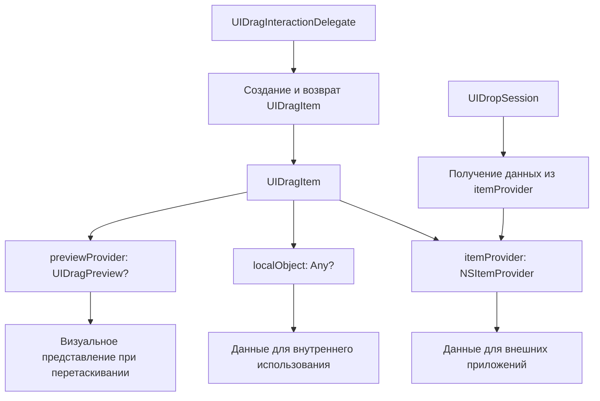

#UIDragItem #UIKit #iOS #Swift #DragAndDrop #NSItemProvider #iPad #UserInteraction #UIDragInteraction

---
**(элемент перетаскивания / представление данных при Drag & Drop)**

**UIDragItem** — это класс из фреймворка **[[UIKit]]**, который представляет **один элемент данных**, перетаскиваемый пользователем в рамках операции Drag & Drop . Он служит обёрткой вокруг `NSItemProvider`, содержащей фактические данные, и позволяет настраивать визуальное отображение элемента во время перетаскивания, а также связывать с ним локальные объекты в пределах одного приложения .

**Ключевые особенности (важно в 2026):**
- Появился в **iOS 11.0+** и является фундаментальной частью фреймворка Drag & Drop на iPad .
- Каждый `UIDragItem` связан с **`NSItemProvider`**, который отвечает за предоставление данных в различных форматах (например, текст, изображение, [[URL]]) .
- Позволяет через свойство **`localObject`** прикрепить к элементу **локальный объект** (видимый только внутри вашего приложения), что делает обработку перемещения данных внутри одного приложения очень быстрой и эффективной .
- Свойство **`previewProvider`** позволяет задать **кастомную визуальную "тень"** элемента, которая будет следовать за пальцем пользователя во время перетаскивания .
- Для обновления внешнего вида элемента во время анимации падения используется метод **`setNeedsDropPreviewUpdate()`** .

---

### Основные свойства и методы

| Компонент | Тип | Назначение |
|-----------|-----|------------|
| `init(itemProvider:)` | `NSItemProvider` | Инициализатор с указанным провайдером данных  |
| `itemProvider` | `NSItemProvider` | Провайдер данных, связанный с элементом перетаскивания  |
| `localObject` | `Any?` | Кастомный объект для быстрого обмена данными внутри одного приложения  |
| `previewProvider` | `(() -> UIDragPreview?)?` | Блок для создания кастомного визуального превью элемента  |
| `setNeedsDropPreviewUpdate()` | `()` | Уведомляет систему о необходимости обновить превью элемента при анимации падения  |

---

### Схема взаимосвязей



---

### Примеры (от простого к сложному)

#### 1. Создание базового элемента перетаскивания для текста
```swift
import UIKit

class BasicDragViewController: UIViewController, UIDragInteractionDelegate {
    
    private let draggableLabel = UILabel()
    
    override func viewDidLoad() {
        super.viewDidLoad()
        setupDraggableLabel()
    }
    
    private func setupDraggableLabel() {
        draggableLabel.text = "Перетащи меня!"
        draggableLabel.textAlignment = .center
        draggableLabel.backgroundColor = .systemBlue
        draggableLabel.textColor = .white
        draggableLabel.frame = CGRect(x: 50, y: 100, width: 200, height: 60)
        draggableLabel.layer.cornerRadius = 8
        draggableLabel.clipsToBounds = true
        view.addSubview(draggableLabel)
        
        // 1. Включаем возможность взаимодействия
        draggableLabel.isUserInteractionEnabled = true
        
        // 2. Создаем и добавляем Drag-взаимодействие
        let dragInteraction = UIDragInteraction(delegate: self)
        draggableLabel.addInteraction(dragInteraction)
    }
    
    // MARK: - UIDragInteractionDelegate
    
    func dragInteraction(_ interaction: UIDragInteraction,
                         itemsForBeginning session: UIDragSession) -> [UIDragItem] {
        // 3. Создаем NSItemProvider с текстовыми данными
        let itemProvider = NSItemProvider(object: "Привет из приложения!" as NSString)
        
        // 4. Создаем UIDragItem и оборачиваем в него провайдер
        let dragItem = UIDragItem(itemProvider: itemProvider)
        
        // 5. Устанавливаем локальный объект для быстрого доступа внутри приложения
        dragItem.localObject = "Привет из приложения!" as NSString
        
        return [dragItem]
    }
}
```

#### 2. Создание элемента перетаскивания для изображения (из [[UIKit]]-примера) 
```swift
class ImageDragViewController: UIViewController, UIDragInteractionDelegate {
    
    private let imageView = UIImageView()
    
    override func viewDidLoad() {
        super.viewDidLoad()
        setupImageView()
    }
    
    private func setupImageView() {
        // Загружаем изображение
        imageView.image = UIImage(systemName: "photo")
        imageView.contentMode = .scaleAspectFit
        imageView.backgroundColor = .systemGray5
        imageView.frame = CGRect(x: 50, y: 100, width: 200, height: 200)
        imageView.isUserInteractionEnabled = true
        view.addSubview(imageView)
        
        // Добавляем Drag-взаимодействие
        let dragInteraction = UIDragInteraction(delegate: self)
        imageView.addInteraction(dragInteraction)
    }
    
    func dragInteraction(_ interaction: UIDragInteraction,
                         itemsForBeginning session: UIDragSession) -> [UIDragItem] {
        // 1. Проверяем наличие изображения
        guard let image = imageView.image else { return [] }
        
        // 2. Создаем провайдер для изображения
        let itemProvider = NSItemProvider(object: image)
        let dragItem = UIDragItem(itemProvider: itemProvider)
        
        // 3. Сохраняем ссылку на изображение как локальный объект
        dragItem.localObject = image
        
        // 4. Возвращаем массив с одним элементом
        return [dragItem]
    }
}
```

#### 3. Настройка кастомного превью во время перетаскивания 
```swift
class CustomPreviewDragViewController: UIViewController, UIDragInteractionDelegate {
    
    private let draggableView = UIView()
    
    override func viewDidLoad() {
        super.viewDidLoad()
        setupDraggableView()
    }
    
    private func setupDraggableView() {
        draggableView.backgroundColor = .systemPurple
        draggableView.frame = CGRect(x: 50, y: 100, width: 150, height: 150)
        draggableView.layer.cornerRadius = 20
        draggableView.isUserInteractionEnabled = true
        view.addSubview(draggableView)
        
        let dragInteraction = UIDragInteraction(delegate: self)
        draggableView.addInteraction(dragInteraction)
    }
    
    func dragInteraction(_ interaction: UIDragInteraction,
                         itemsForBeginning session: UIDragSession) -> [UIDragItem] {
        let itemProvider = NSItemProvider(object: "Кастомное превью" as NSString)
        let dragItem = UIDragItem(itemProvider: itemProvider)
        
        // 1. Устанавливаем кастомный previewProvider
        dragItem.previewProvider = { [weak self] in
            guard let self = self else { return nil }
            
            // 2. Создаем превью на основе текущего вида
            let previewView = UIView()
            previewView.backgroundColor = .systemPurple
            previewView.frame = CGRect(x: 0, y: 0, width: 100, height: 100)
            previewView.layer.cornerRadius = 20
            previewView.layer.shadowColor = UIColor.black.cgColor
            previewView.layer.shadowOpacity = 0.3
            previewView.layer.shadowOffset = CGSize(width: 0, height: 4)
            previewView.layer.shadowRadius = 8
            
            // 3. Добавляем иконку на превью
            let icon = UIImageView(image: UIImage(systemName: "arrow.up.circle"))
            icon.tintColor = .white
            icon.frame = CGRect(x: 30, y: 30, width: 40, height: 40)
            previewView.addSubview(icon)
            
            return UIDragPreview(view: previewView)
        }
        
        return [dragItem]
    }
}
```

#### 4. Использование localObject для быстрого перемещения внутри приложения 
```swift
class LocalObjectDragViewController: UIViewController,
                                     UIDragInteractionDelegate,
                                     UIDropInteractionDelegate {
    
    private let sourceView = UIView()
    private let destinationView = UIView()
    private let dataModel = ["Элемент 1", "Элемент 2", "Элемент 3"]
    
    override func viewDidLoad() {
        super.viewDidLoad()
        setupViews()
    }
    
    private func setupViews() {
        // Настраиваем источник
        sourceView.backgroundColor = .systemBlue
        sourceView.frame = CGRect(x: 20, y: 100, width: 150, height: 80)
        sourceView.isUserInteractionEnabled = true
        view.addSubview(sourceView)
        
        let label = UILabel(frame: sourceView.bounds)
        label.text = "Перетащи меня"
        label.textColor = .white
        label.textAlignment = .center
        sourceView.addSubview(label)
        
        // Настраиваем приемник
        destinationView.backgroundColor = .systemGreen
        destinationView.frame = CGRect(x: 220, y: 100, width: 150, height: 80)
        destinationView.isUserInteractionEnabled = true
        view.addSubview(destinationView)
        
        let destLabel = UILabel(frame: destinationView.bounds)
        destLabel.text = "Сюда"
        destLabel.textColor = .white
        destLabel.textAlignment = .center
        destinationView.addSubview(destLabel)
        
        // Добавляем взаимодействия
        sourceView.addInteraction(UIDragInteraction(delegate: self))
        destinationView.addInteraction(UIDropInteraction(delegate: self))
    }
    
    // MARK: - UIDragInteractionDelegate
    
    func dragInteraction(_ interaction: UIDragInteraction,
                         itemsForBeginning session: UIDragSession) -> [UIDragItem] {
        // 1. Создаем dragItem с данными
        let provider = NSItemProvider(object: dataModel.first ?? "" as NSString)
        let dragItem = UIDragItem(itemProvider: provider)
        
        // 2. Устанавливаем localObject для быстрой передачи внутри приложения
        dragItem.localObject = dataModel.first
        
        return [dragItem]
    }
    
    // MARK: - UIDropInteractionDelegate
    
    func dropInteraction(_ interaction: UIDropInteraction,
                         canHandle session: UIDropSession) -> Bool {
        // 3. Проверяем, можно ли обработать drop
        return session.hasItemsConforming(toTypeIdentifiers: [UTType.text.identifier])
    }
    
    func dropInteraction(_ interaction: UIDropInteraction,
                         sessionDidUpdate session: UIDropSession) -> UIDropProposal {
        // 4. Предлагаем операцию перемещения
        return UIDropProposal(operation: .move)
    }
    
    func dropInteraction(_ interaction: UIDropInteraction,
                         performDrop session: UIDropSession) {
        // 5. Проверяем наличие localObject для быстрого доступа
        if let dragItem = session.items.first,
           let localData = dragItem.localObject as? String {
            // 6. Используем локальный объект мгновенно
            print("Получены данные через localObject: \(localData)")
            updateDestinationView(with: localData)
            return
        }
        
        // 7. Если localObject отсутствует, загружаем данные через itemProvider
        session.loadObjects(ofClass: NSString.self) { items in
            if let data = items.first as? String {
                self.updateDestinationView(with: data)
            }
        }
    }
    
    private func updateDestinationView(with data: String) {
        DispatchQueue.main.async {
            // Обновляем UI с полученными данными
            if let label = self.destinationView.subviews.first as? UILabel {
                label.text = data
            }
            self.destinationView.backgroundColor = .systemYellow
        }
    }
}
```

#### 5. Поддержка множественных представлений данных (UTI) 
```swift
class MultiRepresentationDragViewController: UIViewController, UIDragInteractionDelegate {
    
    private let draggableView = UIView()
    
    override func viewDidLoad() {
        super.viewDidLoad()
        setupDraggableView()
    }
    
    private func setupDraggableView() {
        draggableView.backgroundColor = .systemOrange
        draggableView.frame = CGRect(x: 50, y: 100, width: 200, height: 100)
        draggableView.isUserInteractionEnabled = true
        view.addSubview(draggableView)
        
        let label = UILabel(frame: draggableView.bounds)
        label.text = "Данные в разных форматах"
        label.textColor = .white
        label.textAlignment = .center
        label.numberOfLines = 0
        draggableView.addSubview(label)
        
        draggableView.addInteraction(UIDragInteraction(delegate: self))
    }
    
    func dragInteraction(_ interaction: UIDragInteraction,
                         itemsForBeginning session: UIDragSession) -> [UIDragItem] {
        let itemProvider = NSItemProvider()
        
        // 1. Регистрируем представление данных как HTML
        let htmlString = "<h1>Заголовок</h1><p>Текст для перетаскивания</p>"
        let htmlData = htmlString.data(using: .utf8)
        itemProvider.registerDataRepresentation(forTypeIdentifier: UTType.html.identifier,
                                                visibility: .all) { completion in
            completion(htmlData, nil)
            return nil
        }
        
        // 2. Регистрируем представление как обычный текст
        let plainText = "Текст для перетаскивания"
        itemProvider.registerDataRepresentation(forTypeIdentifier: UTType.plainText.identifier,
                                                visibility: .all) { completion in
            completion(plainText.data(using: .utf8), nil)
            return nil
        }
        
        // 3. Регистрируем представление как URL (для drag&drop в Finder, например) 
        if let url = URL(string: "https://example.com") {
            itemProvider.registerDataRepresentation(forTypeIdentifier: UTType.url.identifier,
                                                    visibility: .all) { completion in
                completion(url.absoluteString.data(using: .utf8), nil)
                return nil
            }
        }
        
        // 4. Создаем dragItem с провайдером
        let dragItem = UIDragItem(itemProvider: itemProvider)
        // 5. Сохраняем локальный объект для быстрого доступа
        dragItem.localObject = htmlString
        
        return [dragItem]
    }
}
```

#### 6. Drag & Drop в таблице (адаптация под структуру проекта) 
```swift
class TableDragViewController: UIViewController,
                               UITableViewDataSource,
                               UITableViewDelegate,
                               UIDragInteractionDelegate {
    
    private let tableView = UITableView()
    private var items = ["Элемент A", "Элемент B", "Элемент C", "Элемент D"]
    
    override func viewDidLoad() {
        super.viewDidLoad()
        setupTableView()
    }
    
    private func setupTableView() {
        tableView.frame = view.bounds
        tableView.dataSource = self
        tableView.delegate = self
        tableView.register(UITableViewCell.self, forCellReuseIdentifier: "Cell")
        view.addSubview(tableView)
        
        // Включаем Drag & Drop для таблицы
        tableView.dragDelegate = self as? UITableViewDragDelegate
        tableView.dropDelegate = self as? UITableViewDropDelegate
        tableView.dragInteractionEnabled = true
    }
    
    // MARK: - UITableViewDataSource
    
    func tableView(_ tableView: UITableView, numberOfRowsInSection section: Int) -> Int {
        return items.count
    }
    
    func tableView(_ tableView: UITableView, cellForRowAt indexPath: IndexPath) -> UITableViewCell {
        let cell = tableView.dequeueReusableCell(withIdentifier: "Cell", for: indexPath)
        cell.textLabel?.text = items[indexPath.row]
        return cell
    }
}

// MARK: - UITableViewDragDelegate
extension TableDragViewController: UITableViewDragDelegate {
    
    func tableView(_ tableView: UITableView,
                   itemsForBeginning session: UIDragSession,
                   at indexPath: IndexPath) -> [UIDragItem] {
        // 1. Получаем данные для перетаскивания
        let item = items[indexPath.row]
        
        // 2. Создаем NSItemProvider
        let itemProvider = NSItemProvider(object: item as NSString)
        
        // 3. Создаем UIDragItem и сохраняем индекс для локального использования
        let dragItem = UIDragItem(itemProvider: itemProvider)
        dragItem.localObject = indexPath
        
        return [dragItem]
    }
    
    func tableView(_ tableView: UITableView,
                   itemsForAddingTo session: UIDragSession,
                   at indexPath: IndexPath,
                   point: CGPoint) -> [UIDragItem] {
        // 4. Поддержка добавления новых элементов в существующую сессию перетаскивания
        let item = items[indexPath.row]
        let itemProvider = NSItemProvider(object: item as NSString)
        let dragItem = UIDragItem(itemProvider: itemProvider)
        dragItem.localObject = indexPath
        return [dragItem]
    }
}
```

---

### Важные нюансы 2026 года

> [!warning]
> **UIDragItem не создается напрямую без `NSItemProvider`:** Инициализатор `init(itemProvider:)` является единственным публичным способом создания объекта, и он требует валидный `NSItemProvider` .
>
> **LocalObject предназначен только для внутреннего использования:** Это свойство полезно для быстрой передачи данных в рамках одного приложения, но оно **не сериализуется** и не передается другим приложениям. Другие приложения получают только данные из `itemProvider` .
>
> **Превью создается асинхронно:** Блок `previewProvider` вызывается системой по мере необходимости. Если вернуть `nil`, превью будет скрыто .
>
> **Обновление превью:** `setNeedsDropPreviewUpdate()` используется в основном во время анимации падения (drop animation) для обновления внешнего вида элемента .

---

### Лучшие практики 2026

1. **Всегда используйте `localObject` для быстрой передачи данных внутри приложения**, чтобы избежать задержек на сериализацию/десериализацию .
2. **Регистрируйте несколько UTI-представлений** в `NSItemProvider` для обеспечения совместимости с разными приложениями (текст, HTML, URL, изображение) .
3. **Настраивайте `previewProvider`** для создания красивых и информативных превью, которые улучшают пользовательский опыт.
4. **Для сложных структур данных** внедряйте протокол `NSItemProviderWriting` в ваши модели данных, чтобы упростить создание `NSItemProvider` .
5. **В UIKit-приложениях** используйте встроенные `dragDelegate` и `dropDelegate` для таблиц и коллекций вместо ручной настройки `UIDragInteraction`.

---

### Связь с другими темами

- [[UIDragInteraction]] — взаимодействие для источника перетаскивания
- [[UIDropInteraction]] — взаимодействие для цели перетаскивания
- [[UITableViewDragDelegate]] — делегат для таблиц
- [[UICollectionViewDragDelegate]] — делегат для коллекций