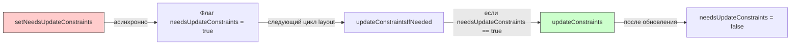
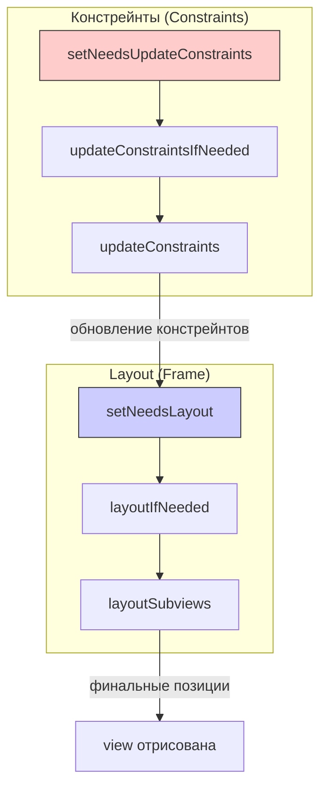

#uikit #autolayout #constraints #layout #ios #swift

---

### Определение

**`setNeedsUpdateConstraints`** — это метод класса [[UIView]], который **асинхронно помечает** вью как требующее обновления своих констрейнтов (ограничений Auto Layout). Вызов этого метода не приводит к немедленному обновлению, а лишь устанавливает флаг, который будет обработан в следующем цикле обновления layout.

Вместе с `updateConstraintsIfNeeded()` и `updateConstraints()` этот метод образует систему отложенного (ленивого) обновления констрейнтов, аналогичную системе обновления layout через [[setNeedsLayout]] / [[layoutIfNeeded]].



---

### Зачем это знать iOS-разработчику?

| Сценарий                                | Почему это важно                                                                                              |
| --------------------------------------- | ------------------------------------------------------------------------------------------------------------- |
| **Динамическое изменение констрейнтов** | Когда констрейнты зависят от внешних условий (анимация, смена данных)                                         |
| **Производительность**                  | Позволяет группировать несколько изменений констрейнтов в одно обновление                                     |
| **Анимация констрейнтов**               | Для анимированного изменения констрейнтов нужно вызывать [[layoutIfNeeded]] после `setNeedsUpdateConstraints` |
| **Кастомные констрейнты**               | При создании кастомных вью с собственной логикой констрейнтов                                                 |
| **Оптимизация**                         | Вместо немедленного пересчёта констрейнтов при каждом изменении                                               |

---

### Основные методы для работы с констрейнтами

| Метод | Тип | Описание |
|---|---|---|
| **`setNeedsUpdateConstraints()`** | Асинхронный | Помечает вью как требующее обновления констрейнтов |
| **`updateConstraintsIfNeeded()`** | Синхронный | Немедленно обновляет констрейнты, если есть пометка |
| **`updateConstraints()`** | Переопределяемый | Здесь выполняется фактическое обновление констрейнтов |
| **`needsUpdateConstraints()`** | Свойство | Возвращает `true`, если вью помечено для обновления |

---

### Базовый пример

#### Проблема: частые изменения констрейнтов

```swift
// ❌ Плохо: каждый раз напрямую меняем констрейнты
class BadExampleView: UIView {
    
    var isExpanded = false {
        didSet {
            if isExpanded {
                heightConstraint.constant = 200
                widthConstraint.constant = 200
            } else {
                heightConstraint.constant = 100
                widthConstraint.constant = 100
            }
            // Нет группировки, каждый раз срабатывает layout
        }
    }
}
```

#### Решение: использование setNeedsUpdateConstraints

```swift
// ✅ Хорошо: группируем изменения через setNeedsUpdateConstraints
class OptimizedView: UIView {
    
    private var heightConstraint: NSLayoutConstraint!
    private var widthConstraint: NSLayoutConstraint!
    
    var isExpanded = false {
        didSet {
            // Просто помечаем, что констрейнты нужно обновить
            setNeedsUpdateConstraints()
        }
    }
    
    override func updateConstraints() {
        // Обновляем констрейнты в одном месте
        if isExpanded {
            heightConstraint.constant = 200
            widthConstraint.constant = 200
        } else {
            heightConstraint.constant = 100
            widthConstraint.constant = 100
        }
        
        // Всегда вызываем super в конце
        super.updateConstraints()
    }
}
```

---

### Сравнение с системой обновления layout

| Система                     | Для констрейнтов              | Для layout (frame) |
| --------------------------- | ----------------------------- | ------------------ |
| **Пометить для обновления** | `setNeedsUpdateConstraints()` | [[setNeedsLayout]] |
| **Немедленное обновление**  | `updateConstraintsIfNeeded()` | [[layoutIfNeeded]] |
| **Переопределяемый метод**  | `updateConstraints()`         | [[layoutSubviews]] |



---

### Полный пример: кастомная вью с динамическими констрейнтами

```swift
class CollapsibleSectionView: UIView {
    
    // MARK: - UI Elements
    private let titleLabel = UILabel()
    private let contentStack = UIStackView()
    private let toggleButton = UIButton(type: .system)
    
    // MARK: - Constraints
    private var contentHeightConstraint: NSLayoutConstraint?
    private var contentHeight: CGFloat = 200
    
    // MARK: - State
    var isExpanded = true {
        didSet {
            setNeedsUpdateConstraints()
            // Анимируем изменение
            UIView.animate(withDuration: 0.3) {
                self.layoutIfNeeded()
            }
        }
    }
    
    // MARK: - Init
    override init(frame: CGRect) {
        super.init(frame: frame)
        setupUI()
        setupConstraints()
    }
    
    required init?(coder: NSCoder) {
        super.init(coder: coder)
        setupUI()
        setupConstraints()
    }
    
    // MARK: - Setup
    private func setupUI() {
        titleLabel.text = "Заголовок секции"
        toggleButton.setTitle("▼", for: .normal)
        toggleButton.addTarget(self, action: #selector(toggleExpanded), for: .touchUpInside)
        
        contentStack.axis = .vertical
        contentStack.spacing = 8
        contentStack.addArrangedSubview(UILabel())
        contentStack.addArrangedSubview(UIButton())
        
        addSubview(titleLabel)
        addSubview(toggleButton)
        addSubview(contentStack)
    }
    
    private func setupConstraints() {
        titleLabel.translatesAutoresizingMaskIntoConstraints = false
        toggleButton.translatesAutoresizingMaskIntoConstraints = false
        contentStack.translatesAutoresizingMaskIntoConstraints = false
        
        NSLayoutConstraint.activate([
            titleLabel.topAnchor.constraint(equalTo: topAnchor, constant: 12),
            titleLabel.leadingAnchor.constraint(equalTo: leadingAnchor, constant: 16),
            
            toggleButton.centerYAnchor.constraint(equalTo: titleLabel.centerYAnchor),
            toggleButton.trailingAnchor.constraint(equalTo: trailingAnchor, constant: -16),
            
            contentStack.topAnchor.constraint(equalTo: titleLabel.bottomAnchor, constant: 16),
            contentStack.leadingAnchor.constraint(equalTo: leadingAnchor, constant: 16),
            contentStack.trailingAnchor.constraint(equalTo: trailingAnchor, constant: -16),
            contentStack.bottomAnchor.constraint(equalTo: bottomAnchor, constant: -16)
        ])
        
        // Сохраняем констрейнт высоты для анимации
        contentHeightConstraint = contentStack.heightAnchor.constraint(equalToConstant: contentHeight)
        contentHeightConstraint?.priority = .defaultHigh
        contentHeightConstraint?.isActive = true
    }
    
    // MARK: - Update Constraints
    override func updateConstraints() {
        // Обновляем констрейнты в зависимости от состояния
        if isExpanded {
            contentHeightConstraint?.constant = contentHeight
            contentStack.isHidden = false
        } else {
            contentHeightConstraint?.constant = 0
            contentStack.isHidden = true
        }
        
        super.updateConstraints()
    }
    
    @objc private func toggleExpanded() {
        isExpanded.toggle()
        toggleButton.setTitle(isExpanded ? "▲" : "▼", for: .normal)
    }
}
```

---

### Анимация изменения констрейнтов

Чтобы анимировать изменение констрейнтов, нужно:
1. Вызвать `setNeedsUpdateConstraints()` (или изменить констрейнты напрямую)
2. Вызвать `layoutIfNeeded()` внутри анимационного блока

```swift
class AnimatedConstraintView: UIView {
    
    private var leadingConstraint: NSLayoutConstraint!
    private var isPositionedRight = false
    
    func animatePositionChange() {
        // 1. Помечаем, что констрейнты нужно обновить
        setNeedsUpdateConstraints()
        
        // 2. Анимируем изменение
        UIView.animate(withDuration: 0.3, animations: {
            // 3. Принудительно применяем изменения
            self.layoutIfNeeded()
        })
    }
    
    override func updateConstraints() {
        // Обновляем констрейнты
        if isPositionedRight {
            leadingConstraint.constant = bounds.width - 100
        } else {
            leadingConstraint.constant = 20
        }
        
        super.updateConstraints()
    }
}
```

---

### Переопределение [[updateConstraints]]: best practices

#### Правильно:

```swift
class CustomView: UIView {
    
    private var didSetupConstraints = false
    
    override func updateConstraints() {
        // Устанавливаем констрейнты только один раз
        if !didSetupConstraints {
            setupConstraints()
            didSetupConstraints = true
        }
        
        // Обновляем динамические констрейнты
        updateDynamicConstraints()
        
        // Всегда вызываем super в конце!
        super.updateConstraints()
    }
    
    private func setupConstraints() {
        // Статические констрейнты
    }
    
    private func updateDynamicConstraints() {
        // Констрейнты, которые меняются во время работы
    }
}
```

#### ⚠️ Осторожно: не вызывайте setNeedsUpdateConstraints внутри updateConstraints

```swift
// ❌ Плохо — бесконечный цикл
override func updateConstraints() {
    super.updateConstraints()
    setNeedsUpdateConstraints()  // Бесконечный цикл!
}
```

---

### Сравнение подходов

| Подход | Когда использовать | Преимущества | Недостатки |
|---|---|---|---|
| **Прямое изменение констрейнтов** | Простые случаи, единичные изменения | Простота, понятность | Может вызвать множественные layout passes |
| **setNeedsUpdateConstraints** | Сложные зависимости, множественные изменения | Группировка, производительность | Требует переопределения updateConstraints |
| **invalidateIntrinsicContentSize** | Когда меняется intrinsic content size | Автоматическое обновление | Только для intrinsic size |

---

### Распространённые ошибки

#### 1. Забытый вызов super.updateConstraints()

```swift
// ❌ Неправильно
override func updateConstraints() {
    // ... обновления констрейнтов
    // super.updateConstraints() не вызван!
}

// ✅ Правильно
override func updateConstraints() {
    // ... обновления констрейнтов
    super.updateConstraints()  // Всегда вызываем!
}
```

#### 2. Бесконечный цикл

```swift
// ❌ Неправильно — бесконечный цикл
override func updateConstraints() {
    super.updateConstraints()
    setNeedsUpdateConstraints()  // Вызовет повторный updateConstraints
}
```

#### 3. Обновление статических констрейнтов при каждом вызове

```swift
// ❌ Неэффективно
override func updateConstraints() {
    // Эти констрейнты не меняются, но пересоздаются при каждом вызове
    NSLayoutConstraint.activate([...])  // Дублирование!
    super.updateConstraints()
}

// ✅ Эффективно
private var didSetupConstraints = false

override func updateConstraints() {
    if !didSetupConstraints {
        NSLayoutConstraint.activate([...])
        didSetupConstraints = true
    }
    super.updateConstraints()
}
```

---

### setNeedsUpdateConstraints vs invalidateIntrinsicContentSize

| Метод | Назначение | Когда использовать |
|---|---|---|
| **`setNeedsUpdateConstraints`** | Пересчёт всех констрейнтов | Когда меняются зависимости между элементами |
| **`invalidateIntrinsicContentSize`** | Пересчёт intrinsic content size | Когда меняется естественный размер вью (текст, изображение) |

```swift
class TextView: UIView {
    
    var text: String = "" {
        didSet {
            // Меняется естественный размер из-за текста
            invalidateIntrinsicContentSize()
            
            // Могут измениться констрейнты (например, высота)
            setNeedsUpdateConstraints()
        }
    }
    
    override var intrinsicContentSize: CGSize {
        // Возвращаем размер на основе текста
        let height = text.height(withConstrainedWidth: bounds.width)
        return CGSize(width: UIView.noIntrinsicMetric, height: height)
    }
}
```

---

### Производительность и оптимизация

| Сценарий | Рекомендация |
|---|---|
| **Одиночное изменение констрейнта** | Можно менять напрямую (не обязательно `setNeedsUpdateConstraints`) |
| **Множественные изменения** | Использовать `setNeedsUpdateConstraints` для группировки |
| **Изменения внутри анимации** | `setNeedsUpdateConstraints` + `layoutIfNeeded()` в анимационном блоке |
| **Кастомные вью с комплексными констрейнтами** | Переопределить `updateConstraints` |
| **Вью с динамическим содержимым** | Комбинировать `invalidateIntrinsicContentSize` и `setNeedsUpdateConstraints` |

---

### Короткое правило

> **`setNeedsUpdateConstraints`** = «я изменил что-то, что влияет на констрейнты, но не обновляй их сразу, подожди следующего цикла layout».  
> **`updateConstraints`** = «здесь я реально обновляю констрейнты (переопределить для кастомной логики)».  
> **`layoutIfNeeded()`** = «хочу применить изменения прямо сейчас (обычно внутри анимации)».  
> Всегда вызывай `super.updateConstraints()` в конце переопределённого метода.

---

### Итог

**`setNeedsUpdateConstraints`** — ключевой метод для эффективного управления динамическими констрейнтами:

| Аспект | Значение |
|---|---|
| **Вызов** | Асинхронный, неблокирующий |
| **Назначение** | Пометить вью для обновления констрейнтов |
| **Совместно с** | `updateConstraints()`, `updateConstraintsIfNeeded()` |
| **Анимация** | Требует `layoutIfNeeded()` внутри анимационного блока |
| **Производительность** | Позволяет группировать несколько изменений |

**Главное правило:**
> Используй `setNeedsUpdateConstraints` для группировки нескольких изменений констрейнтов. Переопределяй `updateConstraints()` для кастомной логики обновления. Всегда вызывай `super.updateConstraints()` в конце. Для анимации изменений не забывай вызывать `layoutIfNeeded()` внутри анимационного блока. Для простых случаев (один констрейнт) можно менять констрейнты напрямую без `setNeedsUpdateConstraints`.