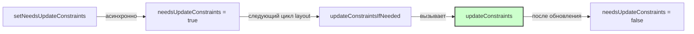

#uikit #autolayout #constraints #layout #ios #swift

---

### Определение

**`updateConstraints()`** — это метод класса [[UIView]], который вызывается системой для **фактического обновления** констрейнтов (ограничений Auto Layout) вью. Он является частью механизма отложенного обновления констрейнтов вместе с `setNeedsUpdateConstraints()` и `updateConstraintsIfNeeded()`.

Этот метод предназначен для **переопределения** в кастомных вью, где требуется сложная логика обновления констрейнтов, зависящая от внутреннего состояния вью.



---

### Зачем переопределять updateConstraints?

| Сценарий | Почему это важно |
|---|---|
| **Сложная логика констрейнтов** | Когда констрейнты зависят от состояния вью (флаги, размеры, данные) |
| **Производительность** | Группировка нескольких изменений констрейнтов в одном месте |
| **Динамические констрейнты** | Когда констрейнты нужно включать/отключать в зависимости от условий |
| **Оптимизация** | Вместо постоянного создания/удаления констрейнтов |
| **Кастомные вью** | При создании переиспользуемых компонентов со сложной версткой |

---

### Основные методы для работы с констрейнтами

| Метод                             | Тип              | Описание                                              |
| --------------------------------- | ---------------- | ----------------------------------------------------- |
| **[[setNeedsUpdateConstraints]]** | Асинхронный      | Помечает вью как требующее обновления констрейнтов    |
| **`updateConstraintsIfNeeded()`** | Синхронный       | Немедленно обновляет констрейнты, если есть пометка   |
| **`updateConstraints()`**         | Переопределяемый | Здесь выполняется фактическое обновление констрейнтов |
| **`needsUpdateConstraints`**      | Свойство         | Возвращает `true`, если вью помечено для обновления   |

---

### Базовый пример использования

```swift
class CustomView: UIView {
    
    private var didSetupConstraints = false
    private var heightConstraint: NSLayoutConstraint?
    
    var isExpanded = false {
        didSet {
            // Помечаем, что констрейнты нужно обновить
            setNeedsUpdateConstraints()
        }
    }
    
    override func updateConstraints() {
        // Устанавливаем констрейнты один раз
        if !didSetupConstraints {
            setupConstraints()
            didSetupConstraints = true
        }
        
        // Обновляем динамические констрейнты
        updateDynamicConstraints()
        
        // ВАЖНО: всегда вызываем super в конце
        super.updateConstraints()
    }
    
    private func setupConstraints() {
        // Статические констрейнты
        translatesAutoresizingMaskIntoConstraints = false
        // ...
    }
    
    private func updateDynamicConstraints() {
        // Обновляем констрейнты в зависимости от состояния
        if isExpanded {
            heightConstraint?.constant = 200
            heightConstraint?.isActive = true
        } else {
            heightConstraint?.constant = 100
        }
    }
}
```

---

### Почему нельзя просто менять констрейнты напрямую?

#### ❌ Неоптимально: прямое изменение при каждом свойстве

```swift
class InefficientView: UIView {
    
    var isExpanded = false {
        didSet {
            // Прямое изменение констрейнта
            heightConstraint.constant = isExpanded ? 200 : 100
            
            // Потенциально вызывает немедленный пересчёт layout
            // Если несколько свойств меняются подряд — каждый раз layout
        }
    }
    
    var isHighlighted = false {
        didSet {
            // Другое свойство — ещё одно изменение
            backgroundColorConstraint?.constant = isHighlighted ? 50 : 20
            // Опять потенциальный пересчёт
        }
    }
}
```

#### ✅ Оптимально: группировка через updateConstraints

```swift
class EfficientView: UIView {
    
    var isExpanded = false {
        didSet { setNeedsUpdateConstraints() }
    }
    
    var isHighlighted = false {
        didSet { setNeedsUpdateConstraints() }
    }
    
    override func updateConstraints() {
        // Оба изменения применятся за один раз
        heightConstraint.constant = isExpanded ? 200 : 100
        backgroundColorConstraint?.constant = isHighlighted ? 50 : 20
        
        super.updateConstraints()
    }
}
```

---

### Полный пример: кастомная вью с комплексными констрейнтами

```swift
class ProfileCardView: UIView {
    
    // MARK: - UI Elements
    private let avatarImageView = UIImageView()
    private let nameLabel = UILabel()
    private let roleLabel = UILabel()
    private let descriptionLabel = UILabel()
    private let actionButton = UIButton(type: .system)
    
    // MARK: - State
    var showActionButton = false {
        didSet { setNeedsUpdateConstraints() }
    }
    
    var hasDescription = false {
        didSet { setNeedsUpdateConstraints() }
    }
    
    var role: String? {
        didSet { setNeedsUpdateConstraints() }
    }
    
    // MARK: - Constraints
    private var actionButtonHeightConstraint: NSLayoutConstraint?
    private var descriptionHeightConstraint: NSLayoutConstraint?
    private var roleTopConstraint: NSLayoutConstraint?
    
    // MARK: - Init
    override init(frame: CGRect) {
        super.init(frame: frame)
        setupUI()
        // Не вызываем setupConstraints здесь!
    }
    
    required init?(coder: NSCoder) {
        super.init(coder: coder)
        setupUI()
    }
    
    // MARK: - Setup
    private func setupUI() {
        // Настройка элементов
        avatarImageView.backgroundColor = .systemGray5
        avatarImageView.layer.cornerRadius = 30
        avatarImageView.clipsToBounds = true
        
        nameLabel.font = .boldSystemFont(ofSize: 18)
        roleLabel.font = .systemFont(ofSize: 14)
        roleLabel.textColor = .secondaryLabel
        descriptionLabel.font = .systemFont(ofSize: 14)
        descriptionLabel.numberOfLines = 0
        
        actionButton.setTitle("Подробнее", for: .normal)
        actionButton.backgroundColor = .systemBlue
        actionButton.setTitleColor(.white, for: .normal)
        actionButton.layer.cornerRadius = 8
        
        [avatarImageView, nameLabel, roleLabel, descriptionLabel, actionButton].forEach {
            $0.translatesAutoresizingMaskIntoConstraints = false
            addSubview($0)
        }
    }
    
    // MARK: - Update Constraints
    override func updateConstraints() {
        // Базовая структура констрейнтов (один раз)
        setupInitialConstraintsIfNeeded()
        
        // Динамические констрейнты
        updateDynamicConstraints()
        
        super.updateConstraints()
    }
    
    private var didSetupInitialConstraints = false
    
    private func setupInitialConstraintsIfNeeded() {
        guard !didSetupInitialConstraints else { return }
        
        NSLayoutConstraint.activate([
            // Avatar
            avatarImageView.topAnchor.constraint(equalTo: topAnchor, constant: 16),
            avatarImageView.leadingAnchor.constraint(equalTo: leadingAnchor, constant: 16),
            avatarImageView.widthAnchor.constraint(equalToConstant: 60),
            avatarImageView.heightAnchor.constraint(equalToConstant: 60),
            
            // Name
            nameLabel.topAnchor.constraint(equalTo: topAnchor, constant: 16),
            nameLabel.leadingAnchor.constraint(equalTo: avatarImageView.trailingAnchor, constant: 12),
            nameLabel.trailingAnchor.constraint(equalTo: trailingAnchor, constant: -16),
            
            // Role
            roleLabel.leadingAnchor.constraint(equalTo: nameLabel.leadingAnchor),
            roleLabel.trailingAnchor.constraint(equalTo: trailingAnchor, constant: -16),
            
            // Description
            descriptionLabel.leadingAnchor.constraint(equalTo: nameLabel.leadingAnchor),
            descriptionLabel.trailingAnchor.constraint(equalTo: trailingAnchor, constant: -16),
            
            // Action Button
            actionButton.leadingAnchor.constraint(equalTo: leadingAnchor, constant: 16),
            actionButton.trailingAnchor.constraint(equalTo: trailingAnchor, constant: -16),
            actionButton.bottomAnchor.constraint(equalTo: bottomAnchor, constant: -16)
        ])
        
        // Сохраняем динамические констрейнты
        actionButtonHeightConstraint = actionButton.heightAnchor.constraint(equalToConstant: 44)
        descriptionHeightConstraint = descriptionLabel.heightAnchor.constraint(equalToConstant: 0)
        
        // Связь между role и description
        roleTopConstraint = roleLabel.topAnchor.constraint(equalTo: nameLabel.bottomAnchor, constant: 4)
        
        didSetupInitialConstraints = true
    }
    
    private func updateDynamicConstraints() {
        // 1. Action Button: показываем/скрываем
        if showActionButton {
            actionButtonHeightConstraint?.constant = 44
            actionButton.isHidden = false
        } else {
            actionButtonHeightConstraint?.constant = 0
            actionButton.isHidden = true
        }
        actionButtonHeightConstraint?.isActive = true
        
        // 2. Description: показываем/скрываем
        if hasDescription {
            descriptionHeightConstraint?.constant = UIView.noIntrinsicMetric
            descriptionLabel.numberOfLines = 0
        } else {
            descriptionHeightConstraint?.constant = 0
            descriptionLabel.numberOfLines = 0
        }
        descriptionHeightConstraint?.isActive = true
        
        // 3. Role: обновляем текст и отступы
        if let role = role, !role.isEmpty {
            roleLabel.text = role
            roleLabel.isHidden = false
            roleTopConstraint?.constant = 4
        } else {
            roleLabel.isHidden = true
            roleTopConstraint?.constant = 0
        }
        roleTopConstraint?.isActive = true
    }
}
```

---

### updateConstraints и анимация

Для анимированного изменения констрейнтов через `updateConstraints`:

```swift
class AnimatedConstraintView: UIView {
    
    var isExpanded = false {
        didSet {
            setNeedsUpdateConstraints()
            animateConstraints()
        }
    }
    
    private func animateConstraints() {
        UIView.animate(withDuration: 0.3, animations: {
            // Применяем изменения немедленно
            self.layoutIfNeeded()
        })
    }
    
    override func updateConstraints() {
        // Обновляем констрейнты в зависимости от состояния
        if isExpanded {
            heightConstraint.constant = 200
            widthConstraint.constant = 200
        } else {
            heightConstraint.constant = 100
            widthConstraint.constant = 100
        }
        
        super.updateConstraints()
    }
}
```

---

### updateConstraints vs invalidateIntrinsicContentSize

| Метод | Назначение | Когда использовать |
|---|---|---|
| **`updateConstraints`** | Пересчёт всех констрейнтов | Когда меняются зависимости между элементами |
| **`invalidateIntrinsicContentSize`** | Пересчёт intrinsic content size | Когда меняется естественный размер вью (текст, изображение) |

```swift
class DynamicTextView: UIView {
    
    var text: String = "" {
        didSet {
            // Меняется intrinsic size
            invalidateIntrinsicContentSize()
            // Могут измениться констрейнты
            setNeedsUpdateConstraints()
        }
    }
    
    override var intrinsicContentSize: CGSize {
        let height = text.height(withConstrainedWidth: bounds.width)
        return CGSize(width: UIView.noIntrinsicMetric, height: height)
    }
    
    override func updateConstraints() {
        // Обновляем констрейнты на основе текста
        textLabelHeightConstraint?.constant = text.isEmpty ? 0 : 30
        super.updateConstraints()
    }
}
```

---

### Распространённые ошибки

#### 1. Забытый вызов super.updateConstraints()

```swift
// ❌ Неправильно
override func updateConstraints() {
    // ... обновления констрейнтов
    // super.updateConstraints() не вызван!
}

// ✅ Правильно
override func updateConstraints() {
    // ... обновления констрейнтов
    super.updateConstraints()  // Всегда вызываем!
}
```

#### 2. Бесконечный цикл

```swift
// ❌ Неправильно — бесконечный цикл
override func updateConstraints() {
    super.updateConstraints()
    setNeedsUpdateConstraints()  // Вызовет повторный updateConstraints
}
```

#### 3. Повторное создание статических констрейнтов

```swift
// ❌ Неэффективно
override func updateConstraints() {
    NSLayoutConstraint.activate([
        // Статические констрейнты пересоздаются при каждом вызове
        leadingAnchor.constraint(equalTo: leadingAnchor, constant: 16),
        trailingAnchor.constraint(equalTo: trailingAnchor, constant: -16)
    ])
    super.updateConstraints()
}

// ✅ Эффективно
private var didSetupConstraints = false

override func updateConstraints() {
    if !didSetupConstraints {
        NSLayoutConstraint.activate([...])
        didSetupConstraints = true
    }
    super.updateConstraints()
}
```

#### 4. Вызов updateConstraints напрямую

```swift
// ❌ Неправильно — не вызывайте напрямую
func someMethod() {
    updateConstraints()  // Не делайте так!
}

// ✅ Правильно — используйте setNeedsUpdateConstraints
func someMethod() {
    setNeedsUpdateConstraints()
    // или для немедленного обновления:
    updateConstraintsIfNeeded()
}
```

---

### Сравнение подходов к обновлению констрейнтов

| Подход | Когда использовать | Преимущества | Недостатки |
|---|---|---|---|
| **Прямое изменение констрейнтов** | Простые случаи, единичные изменения | Простота | Может вызвать множественные layout passes |
| **setNeedsUpdateConstraints + updateConstraints** | Сложные зависимости, множественные изменения | Группировка, производительность | Требует переопределения updateConstraints |
| **invalidateIntrinsicContentSize** | Когда меняется intrinsic content size | Автоматическое обновление | Только для intrinsic size |

---

### Производительность и оптимизация

| Сценарий | Рекомендация |
|---|---|
| **Статические констрейнты** | Установить один раз, не пересоздавать |
| **Динамические констрейнты (1-2)** | Можно менять напрямую |
| **Сложная логика (много констрейнтов)** | Использовать `updateConstraints` |
| **Изменения внутри анимации** | `setNeedsUpdateConstraints` + `layoutIfNeeded()` в анимационном блоке |
| **Кастомные вью с комплексной версткой** | Переопределить `updateConstraints` |

---

### Лучшие практики

1. **Всегда вызывайте `super.updateConstraints()`** в конце переопределённого метода
2. **Используйте флаг `didSetupConstraints`** для однократной установки статических констрейнтов
3. **Не вызывайте `updateConstraints()` напрямую** — используйте `setNeedsUpdateConstraints()` или `updateConstraintsIfNeeded()`
4. **Не вызывайте `setNeedsUpdateConstraints()` внутри `updateConstraints()`** — это создаст бесконечный цикл
5. **Для простых случаев (один констрейнт) можно менять напрямую** без `setNeedsUpdateConstraints()`

```swift
// Паттерн для кастомного вью
class CustomView: UIView {
    
    private var didSetupConstraints = false
    
    override func updateConstraints() {
        if !didSetupConstraints {
            // Статические констрейнты — один раз
            setupStaticConstraints()
            didSetupConstraints = true
        }
        
        // Динамические констрейнты — каждый раз
        updateDynamicConstraints()
        
        super.updateConstraints()
    }
    
    private func setupStaticConstraints() { }
    private func updateDynamicConstraints() { }
}
```

---

### Короткое правило

> **`updateConstraints`** = место, где происходит реальное обновление констрейнтов.  
> **Переопределяй** для кастомных вью со сложной логикой.  
> **Не вызывай напрямую** — используй `setNeedsUpdateConstraints()`.  
> **Всегда вызывай `super.updateConstraints()`** в конце.

---

### Итог

**`updateConstraints`** — ключевой метод для эффективного управления динамическими констрейнтами:

| Аспект | Значение |
|---|---|
| **Вызов** | Автоматический (через `updateConstraintsIfNeeded`) |
| **Назначение** | Фактическое обновление констрейнтов |
| **Переопределение** | Для кастомных вью со сложной логикой |
| **Совместно с** | `setNeedsUpdateConstraints()`, `updateConstraintsIfNeeded()` |
| **Производительность** | Позволяет группировать несколько изменений |

**Главное правило:**
> Переопределяй `updateConstraints()` для кастомных вью, где констрейнты зависят от состояния. Никогда не вызывай его напрямую — используй `setNeedsUpdateConstraints()`. Всегда вызывай `super.updateConstraints()` в конце переопределённого метода. Для простых случаев (один констрейнт) можно менять констрейнты напрямую без этого механизма. Статические констрейнты устанавливай один раз, используя флаг `didSetupConstraints`.