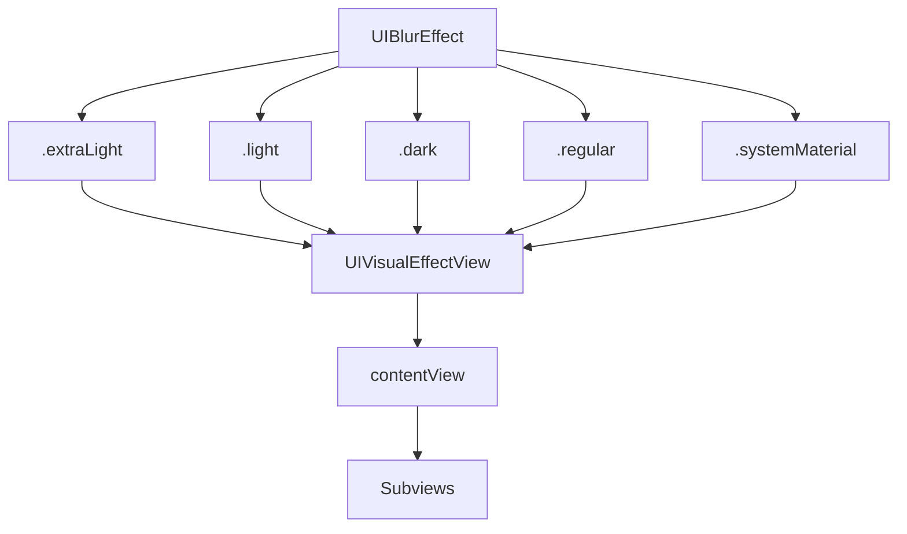

#UIBlurEffect #UIKit #iOS #Swift #UIVisualEffect #Blur #Glassmorphism #SFSymbols #iOS8

---
**(эффект размытия / создание матового стекла в [[iOS]])**

**UIBlurEffect** — это подкласс `UIVisualEffect`, который создает **эффект размытия** (blur) для фонового контента, имитируя эффект матового стекла, известный как "стекломорфизм" (glassmorphism). При его использовании контент, расположенный **под** `UIVisualEffectView`, становится размытым, создавая иллюзию глубины и контекста.

**Ключевые особенности (важно в 2026):**
- Применяется исключительно через `UIVisualEffectView`.
- Предлагает несколько **стилей** размытия, адаптирующихся под светлую или темную тему системы: `.extraLight`, `.light`, `.dark`, `.regular`, `.prominent` и другие (доступны с iOS 10).
- Стили `.systemUltraThinMaterial`, `.systemThinMaterial`, `.systemMaterial`, `.systemThickMaterial`, `.systemChromeMaterial` (iOS 13+) динамически адаптируются к смене светлой/темной темы.
- Не предназначен для размытия отдельных `UIImage` или `UIView` напрямую (для этого используется `CIFilter`). `UIBlurEffect` работает только на уровне наложения поверх контента в иерархии вью.

---

### Основные свойства и методы UIBlurEffect

| Компонент | Тип | Назначение |
|-----------|-----|------------|
| `init(style:)` | `UIBlurEffect` | Создание эффекта с определенным стилем |
| `style` | `UIBlurEffect.Style` | Стиль размытия (enum) |

**Стили UIBlurEffect.Style**:

| Стиль (iOS 8+) | Стиль (iOS 10+) | Стили (iOS 13+, Material) |
|----------------|-----------------|---------------------------|
| `.extraLight` | `.regular` | `.systemUltraThinMaterial` |
| `.light` | `.prominent` | `.systemThinMaterial` |
| `.dark` | | `.systemMaterial` |
| | | `.systemThickMaterial` |
| | | `.systemChromeMaterial` |

---

### Схема взаимосвязей



---

### Примеры (от простого к сложному)

#### 1. Базовое создание размытия
```swift
import UIKit

class BasicBlurViewController: UIViewController {
    
    override func viewDidLoad() {
        super.viewDidLoad()
        
        // 1. Создаем фон
        let imageView = UIImageView(image: UIImage(named: "background"))
        imageView.frame = view.bounds
        imageView.contentMode = .scaleAspectFill
        view.addSubview(imageView)
        
        // 2. Создаем эффект размытия
        let blurEffect = UIBlurEffect(style: .light)
        
        // 3. Создаем visual effect view
        let blurView = UIVisualEffectView(effect: blurEffect)
        blurView.frame = view.bounds
        view.addSubview(blurView)
        
        // 4. Добавляем контент поверх размытия
        let label = UILabel()
        label.text = "Размытый фон"
        label.textColor = .white
        label.font = .systemFont(ofSize: 24, weight: .bold)
        label.textAlignment = .center
        label.frame = CGRect(x: 0, y: 200, width: view.bounds.width, height: 100)
        blurView.contentView.addSubview(label)
    }
}
```

#### 2. Все стили размытия в одном экране
```swift
class AllBlurStylesViewController: UIViewController {
    
    override func viewDidLoad() {
        super.viewDidLoad()
        
        // Фоновое изображение
        let imageView = UIImageView(image: UIImage(named: "background"))
        imageView.frame = view.bounds
        imageView.contentMode = .scaleAspectFill
        view.addSubview(imageView)
        
        // Стили для демонстрации
        let styles: [(UIBlurEffect.Style, String)] = [
            (.extraLight, "Extra Light"),
            (.light, "Light"),
            (.dark, "Dark"),
            (.regular, "Regular"),
            (.prominent, "Prominent")
        ]
        
        // Создаем секции для каждого стиля
        let itemHeight = view.bounds.height / CGFloat(styles.count)
        
        for (index, (style, title)) in styles.enumerated() {
            let yOffset = CGFloat(index) * itemHeight
            
            let blurEffect = UIBlurEffect(style: style)
            let blurView = UIVisualEffectView(effect: blurEffect)
            blurView.frame = CGRect(x: 0, y: yOffset,
                                    width: view.bounds.width,
                                    height: itemHeight)
            view.addSubview(blurView)
            
            // Добавляем подпись
            let label = UILabel()
            label.text = title
            label.textColor = .white
            label.font = .boldSystemFont(ofSize: 18)
            label.textAlignment = .center
            label.frame = blurView.bounds
            blurView.contentView.addSubview(label)
        }
    }
}
```

#### 3. Material-стили (адаптируются к темной/светлой теме)
```swift
class MaterialBlurViewController: UIViewController {
    
    override func viewDidLoad() {
        super.viewDidLoad()
        
        // Фон с градиентом
        let gradientLayer = CAGradientLayer()
        gradientLayer.frame = view.bounds
        gradientLayer.colors = [UIColor.systemBlue.cgColor, UIColor.systemPurple.cgColor]
        view.layer.addSublayer(gradientLayer)
        
        // Material-стили
        let materials: [(UIBlurEffect.Style, String)] = [
            (.systemUltraThinMaterial, "Ultra Thin"),
            (.systemThinMaterial, "Thin"),
            (.systemMaterial, "Regular"),
            (.systemThickMaterial, "Thick"),
            (.systemChromeMaterial, "Chrome")
        ]
        
        let itemHeight = view.bounds.height / CGFloat(materials.count + 1)
        
        for (index, (style, title)) in materials.enumerated() {
            let yOffset = CGFloat(index + 1) * itemHeight
            
            let blurEffect = UIBlurEffect(style: style)
            let blurView = UIVisualEffectView(effect: blurEffect)
            blurView.frame = CGRect(x: 20, y: yOffset,
                                    width: view.bounds.width - 40,
                                    height: itemHeight - 10)
            blurView.layer.cornerRadius = 12
            blurView.layer.masksToBounds = true
            view.addSubview(blurView)
            
            let label = UILabel()
            label.text = title
            label.textColor = .label // Адаптируется к теме
            label.font = .boldSystemFont(ofSize: 16)
            label.textAlignment = .center
            label.frame = blurView.bounds
            blurView.contentView.addSubview(label)
        }
    }
}
```

#### 4. Анимированное появление/исчезновение размытия
```swift
class AnimatedBlurViewController: UIViewController {
    
    private var blurView: UIVisualEffectView!
    private let blurEffect = UIBlurEffect(style: .regular)
    private var isBlurred = false
    
    override func viewDidLoad() {
        super.viewDidLoad()
        
        // Фоновое изображение
        let imageView = UIImageView(image: UIImage(named: "background"))
        imageView.frame = view.bounds
        imageView.contentMode = .scaleAspectFill
        view.addSubview(imageView)
        
        // Изначально без размытия (effect = nil)
        blurView = UIVisualEffectView(effect: nil)
        blurView.frame = view.bounds
        view.addSubview(blurView)
        
        // Кнопка управления
        let button = UIButton(type: .system)
        button.setTitle("Включить размытие", for: .normal)
        button.setTitleColor(.white, for: .normal)
        button.backgroundColor = UIColor.black.withAlphaComponent(0.5)
        button.layer.cornerRadius = 12
        button.addTarget(self, action: #selector(toggleBlur), for: .touchUpInside)
        button.frame = CGRect(x: 50, y: view.bounds.height - 120,
                              width: view.bounds.width - 100, height: 50)
        blurView.contentView.addSubview(button)
    }
    
    @objc private func toggleBlur() {
        isBlurred.toggle()
        
        // Анимируем переход
        UIView.animate(withDuration: 0.6, delay: 0, options: .curveEaseInOut) {
            self.blurView.effect = self.isBlurred ? self.blurEffect : nil
        }
        
        // Обновляем текст кнопки
        if let button = blurView.contentView.subviews.first as? UIButton {
            button.setTitle(isBlurred ? "Выключить размытие" : "Включить размытие", for: .normal)
        }
    }
}
```

#### 5. Размытие с эффектом Vibrancy (яркий текст)
```swift
class BlurWithVibrancyViewController: UIViewController {
    
    override func viewDidLoad() {
        super.viewDidLoad()
        
        // Фоновое изображение
        let imageView = UIImageView(image: UIImage(named: "background"))
        imageView.frame = view.bounds
        imageView.contentMode = .scaleAspectFill
        view.addSubview(imageView)
        
        // 1. Создаем размытие
        let blurEffect = UIBlurEffect(style: .dark)
        let blurView = UIVisualEffectView(effect: blurEffect)
        blurView.frame = view.bounds
        view.addSubview(blurView)
        
        // 2. Создаем эффект яркости
        let vibrancyEffect = UIVibrancyEffect(blurEffect: blurEffect)
        let vibrancyView = UIVisualEffectView(effect: vibrancyEffect)
        vibrancyView.frame = view.bounds
        
        // 3. Добавляем контент в vibrancyView (он будет ярким)
        let label = UILabel()
        label.text = "Яркий текст на размытом фоне"
        label.font = .systemFont(ofSize: 28, weight: .bold)
        label.textAlignment = .center
        label.numberOfLines = 0
        label.frame = CGRect(x: 20, y: 200, width: view.bounds.width - 40, height: 200)
        vibrancyView.contentView.addSubview(label)
        
        let button = UIButton(type: .system)
        button.setTitle("Нажми меня", for: .normal)
        button.titleLabel?.font = .systemFont(ofSize: 20, weight: .semibold)
        button.frame = CGRect(x: 100, y: 420, width: 200, height: 50)
        vibrancyView.contentView.addSubview(button)
        
        // 4. Добавляем vibrancyView поверх blurView
        blurView.contentView.addSubview(vibrancyView)
    }
}
```

#### 6. Стеклянные карточки (Glassmorphism) с размытием
```swift
class GlassCardViewController: UIViewController {
    
    override func viewDidLoad() {
        super.viewDidLoad()
        
        // Фон с градиентом
        let gradientLayer = CAGradientLayer()
        gradientLayer.frame = view.bounds
        gradientLayer.colors = [
            UIColor.systemTeal.cgColor,
            UIColor.systemBlue.cgColor,
            UIColor.systemPurple.cgColor
        ]
        gradientLayer.startPoint = CGPoint(x: 0, y: 0)
        gradientLayer.endPoint = CGPoint(x: 1, y: 1)
        view.layer.addSublayer(gradientLayer)
        
        // Добавляем декоративные элементы
        addDecorativeCircles()
        
        // Создаем стеклянные карточки
        let card1 = createGlassCard(title: "Карточка 1",
                                    description: "Это стеклянная карточка с эффектом размытия")
        card1.frame = CGRect(x: 20, y: 100, width: view.bounds.width - 40, height: 150)
        view.addSubview(card1)
        
        let card2 = createGlassCard(title: "Карточка 2",
                                    description: "Вторая карточка с другим стилем размытия")
        card2.frame = CGRect(x: 20, y: 280, width: view.bounds.width - 40, height: 150)
        view.addSubview(card2)
        
        let card3 = createGlassCard(title: "Карточка 3",
                                    description: "Третья карточка с эффектом яркости")
        card3.frame = CGRect(x: 20, y: 460, width: view.bounds.width - 40, height: 150)
        view.addSubview(card3)
    }
    
    private func addDecorativeCircles() {
        let colors: [UIColor] = [.systemRed, .systemYellow, .systemGreen]
        
        for (index, color) in colors.enumerated() {
            let circle = UIView()
            circle.backgroundColor = color.withAlphaComponent(0.3)
            circle.layer.cornerRadius = 60
            circle.frame = CGRect(x: 50 + CGFloat(index) * 100,
                                  y: 200 + CGFloat(index) * 80,
                                  width: 120, height: 120)
            view.addSubview(circle)
        }
    }
    
    private func createGlassCard(title: String, description: String) -> UIView {
        // 1. Базовый контейнер
        let container = UIView()
        container.backgroundColor = .clear
        
        // 2. Размытие
        let blurEffect = UIBlurEffect(style: .light)
        let blurView = UIVisualEffectView(effect: blurEffect)
        blurView.frame = container.bounds
        blurView.autoresizingMask = [.flexibleWidth, .flexibleHeight]
        blurView.layer.cornerRadius = 20
        blurView.layer.masksToBounds = true
        
        // 3. Добавляем Vibrancy для текста
        let vibrancyEffect = UIVibrancyEffect(blurEffect: blurEffect)
        let vibrancyView = UIVisualEffectView(effect: vibrancyEffect)
        vibrancyView.frame = blurView.bounds
        vibrancyView.autoresizingMask = [.flexibleWidth, .flexibleHeight]
        
        // 4. Контент
        let titleLabel = UILabel()
        titleLabel.text = title
        titleLabel.font = .systemFont(ofSize: 20, weight: .bold)
        titleLabel.frame = CGRect(x: 20, y: 15, width: container.bounds.width - 40, height: 30)
        vibrancyView.contentView.addSubview(titleLabel)
        
        let descLabel = UILabel()
        descLabel.text = description
        descLabel.font = .systemFont(ofSize: 14)
        descLabel.numberOfLines = 0
        descLabel.frame = CGRect(x: 20, y: 55, width: container.bounds.width - 40, height: 60)
        vibrancyView.contentView.addSubview(descLabel)
        
        // 5. Собираем вместе
        blurView.contentView.addSubview(vibrancyView)
        container.addSubview(blurView)
        
        // 6. Добавляем обводку для стеклянного эффекта
        container.layer.borderWidth = 1
        container.layer.borderColor = UIColor.white.withAlphaComponent(0.2).cgColor
        container.layer.cornerRadius = 20
        container.layer.masksToBounds = true
        
        return container
    }
}
```

#### 7. Размытие в Navigation Bar
```swift
class NavigationBarBlurViewController: UIViewController {
    
    override func viewDidLoad() {
        super.viewDidLoad()
        
        view.backgroundColor = .systemBackground
        
        // 1. Создаем фон с изображением
        let imageView = UIImageView(image: UIImage(named: "background"))
        imageView.frame = view.bounds
        imageView.contentMode = .scaleAspectFill
        view.addSubview(imageView)
        
        // 2. Создаем размытие для navigation bar
        let blurEffect = UIBlurEffect(style: .regular)
        let blurView = UIVisualEffectView(effect: blurEffect)
        blurView.frame = CGRect(x: 0, y: 0,
                                width: view.bounds.width,
                                height: 100) // Высота навбара + статус бар
        
        // 3. Добавляем контент в навбар
        let titleLabel = UILabel()
        titleLabel.text = "Размытый навбар"
        titleLabel.font = .systemFont(ofSize: 20, weight: .bold)
        titleLabel.textColor = .label
        titleLabel.textAlignment = .center
        titleLabel.frame = CGRect(x: 0, y: 50,
                                  width: view.bounds.width, height: 40)
        blurView.contentView.addSubview(titleLabel)
        
        view.addSubview(blurView)
        
        // 4. Основной контент
        let contentLabel = UILabel()
        contentLabel.text = "Контент под размытым навбаром"
        contentLabel.textColor = .white
        contentLabel.textAlignment = .center
        contentLabel.numberOfLines = 0
        contentLabel.frame = CGRect(x: 20, y: 200,
                                    width: view.bounds.width - 40, height: 100)
        view.addSubview(contentLabel)
    }
}
```

#### 8. Динамическое изменение стиля размытия при смене темы
```swift
class DynamicBlurViewController: UIViewController {
    
    private var blurView: UIVisualEffectView!
    private var currentStyle: UIBlurEffect.Style = .light
    
    override func viewDidLoad() {
        super.viewDidLoad()
        
        // Фоновое изображение
        let imageView = UIImageView(image: UIImage(named: "background"))
        imageView.frame = view.bounds
        imageView.contentMode = .scaleAspectFill
        view.addSubview(imageView)
        
        // Создаем blur view
        let blurEffect = UIBlurEffect(style: currentStyle)
        blurView = UIVisualEffectView(effect: blurEffect)
        blurView.frame = view.bounds
        view.addSubview(blurView)
        
        // Кнопки для смены стиля
        let styles: [(UIBlurEffect.Style, String, CGFloat)] = [
            (.extraLight, "Extra Light", 0.1),
            (.light, "Light", 0.3),
            (.dark, "Dark", 0.7),
            (.regular, "Regular", 0.5),
            (.prominent, "Prominent", 0.9)
        ]
        
        let buttonHeight: CGFloat = 44
        let spacing: CGFloat = 8
        let totalHeight = CGFloat(styles.count) * (buttonHeight + spacing)
        let startY = (view.bounds.height - totalHeight) / 2
        
        for (index, (style, title, _)) in styles.enumerated() {
            let button = UIButton(type: .system)
            button.setTitle(title, for: .normal)
            button.setTitleColor(.white, for: .normal)
            button.backgroundColor = UIColor.black.withAlphaComponent(0.3)
            button.layer.cornerRadius = 8
            button.tag = index
            button.addTarget(self, action: #selector(changeStyle(_:)), for: .touchUpInside)
            
            let yOffset = startY + CGFloat(index) * (buttonHeight + spacing)
            button.frame = CGRect(x: 40, y: yOffset,
                                  width: view.bounds.width - 80, height: buttonHeight)
            blurView.contentView.addSubview(button)
        }
    }
    
    @objc private func changeStyle(_ sender: UIButton) {
        let styles: [UIBlurEffect.Style] = [
            .extraLight, .light, .dark, .regular, .prominent
        ]
        
        guard sender.tag < styles.count else { return }
        let newStyle = styles[sender.tag]
        
        // Анимируем переход между стилями
        UIView.animate(withDuration: 0.5) {
            self.blurView.effect = UIBlurEffect(style: newStyle)
        }
    }
}
```

---

### Важные нюансы 2026 года

> [!warning]
> **Прозрачность (альфа-канал):** Установка `alpha` менее 1.0 для `UIVisualEffectView` или его супервью может привести к тому, что эффект размытия отобразится некорректно или вовсе исчезнет. Эффекты должны быть полностью непрозрачными для корректной работы.
>
> **`contentView`:** **Никогда** не добавляйте сабвью напрямую в `UIVisualEffectView`. Всегда используйте его свойство `contentView`. В противном случае эффект размытия не будет применён.
>
> **Обрезка (маски):** Применение маски к супервью `UIVisualEffectView` может привести к ошибке. Маски должны применяться непосредственно к самому `UIVisualEffectView` или к его `contentView`.
>
> **Material-стили (iOS 13+):** Стили `.systemUltraThinMaterial`, `.systemThinMaterial`, `.systemMaterial`, `.systemThickMaterial`, `.systemChromeMaterial` автоматически адаптируются к светлой/темной теме системы. Используйте их для динамического интерфейса.
>
> **Производительность:** Размытие — дорогостоящая операция. Избегайте наложения множества `UIVisualEffectView` друг на друга, так как это может снизить производительность.

---

### Лучшие практики 2026

1. **Для текста поверх размытого фона** всегда используйте `UIVibrancyEffect` — это сделает текст ярким и читабельным.
2. **Всегда добавляйте сабвью в `contentView`**, а не в сам `UIVisualEffectView`.
3. **Не используйте прозрачность** для `UIVisualEffectView`. Если нужен менее интенсивный эффект, используйте `UIBlurEffect` с другим стилем.
4. **Анимируйте эффект** через `UIView.animate`, изменяя свойство `effect` между `nil` и желаемым эффектом.
5. **На iOS 13+ используйте Material-стили** для автоматической адаптации к светлой/темной теме.

---

### Связь с другими темами

- [[UIVisualEffect]] — абстрактный класс эффектов
- [[UIVisualEffectView]] — контейнер для эффектов
- [[UIKit]] — фреймворк
- [[UIVisualEffectView]] — работа с эффектами