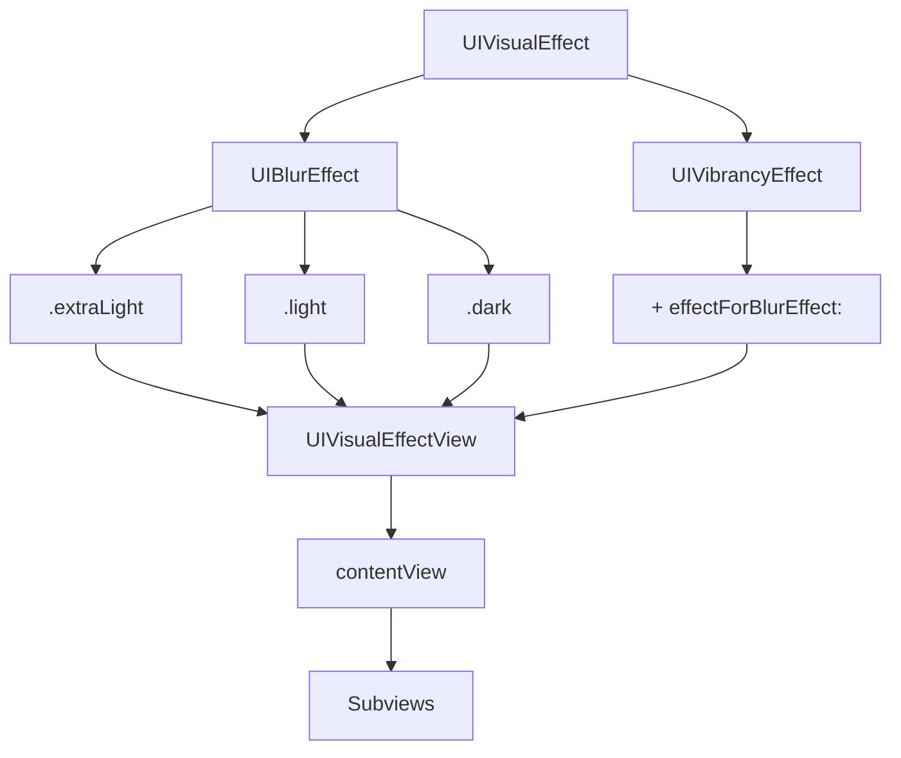

#UIVisualEffect #UIKit #iOS #Swift #UIVisualEffectView #BlurEffect #Vibrancy #Glassmorphism #iOS8

---
**(класс визуального эффекта / основа для размытия и яркости)**

**UIVisualEffect** — это абстрактный класс из фреймворка **[[UIKit]]**, который представляет собой **базовый тип для визуальных эффектов** в [[iOS]]. Он используется исключительно как родительский класс для конкретных эффектов: [[UIBlurEffect]] (размытие) и `UIVibrancyEffect` (яркость), и не предназначен для непосредственного создания экземпляров .

Само понятие "эффект" тесно связано с **`UIVisualEffectView`** — специальным контейнером, который накладывает эти эффекты на фоновый контент. `UIVisualEffectView` служит холстом, на который вы накладываете объект `UIVisualEffect` (конкретный стиль размытия или яркости) .

**Ключевые особенности (важно в 2026):**
- Является **абстрактным классом**: вы никогда не работаете с `UIVisualEffect` напрямую, а только с его подклассами `UIBlurEffect` и `UIVibrancyEffect` .
- Используется исключительно для создания эффектов **размытия** (`UIBlurEffect`) и **повышения яркости/читаемости** (`UIVibrancyEffect`) .
- `UIBlurEffect` создает эффект матового стекла ("glassmorphism") для фона, который находится **под** `UIVisualEffectView` .
- `UIVibrancyEffect` применяется в сочетании с `UIBlurEffect`, чтобы сделать текст и элементы интерфейса, наложенные на размытый фон, более яркими и читаемыми .
- Эффект может применяться только к контенту, размещенному в специальном свойстве `contentView` у `UIVisualEffectView`. Добавление сабвью напрямую во `UIVisualEffectView` приводит к неправильной работе эффекта .

---

### Основные подклассы UIVisualEffect

| Класс | Назначение | Стили (enum) |
|-------|------------|--------------|
| `UIBlurEffect` | Создает эффект размытия (blur) фонового контента | `.extraLight`, `.light`, `.dark` ; с iOS 10 также доступны `.regular`, `.prominent` и другие |
| `UIVibrancyEffect` | Усиливает яркость и контрастность текста/иконок, размещенных на размытом фоне | Наследует стиль от родительского `UIVisualEffectView` |

---

### Схема взаимосвязей



---

### Примеры (от простого к сложному)

#### 1. Базовое создание эффекта размытия (Blur)
```swift
import UIKit

class BlurEffectViewController: UIViewController {
    
    override func viewDidLoad() {
        super.viewDidLoad()
        
        // 1. Создаем фон (изображение или другой контент)
        let imageView = UIImageView(image: UIImage(named: "background"))
        imageView.frame = view.bounds
        imageView.contentMode = .scaleAspectFill
        view.addSubview(imageView)
        
        // 2. Создаем объект эффекта (подкласс UIVisualEffect)
        let blurEffect = UIBlurEffect(style: .light) // .extraLight, .light, .dark
        
        // 3. Создаем визуальный эффект-вью и передаем ему эффект
        let visualEffectView = UIVisualEffectView(effect: blurEffect)
        visualEffectView.frame = view.bounds
        // visualEffectView.alpha = 0.9 // ⚠️ Осторожно: альфа может исказить эффект 
        
        // 4. Добавляем поверх фона
        view.addSubview(visualEffectView)
        
        // 5. Добавляем контент (текст) поверх размытия
        let label = UILabel()
        label.text = "Эффект размытия"
        label.textColor = .white
        label.font = .systemFont(ofSize: 24, weight: .bold)
        label.textAlignment = .center
        label.frame = CGRect(x: 0, y: 200, width: view.bounds.width, height: 100)
        // Важно: добавляем в contentView, а не в сам visualEffectView 
        visualEffectView.contentView.addSubview(label)
    }
}
```

#### 2. Настройка различных стилей размытия
```swift
class AllBlurStylesViewController: UIViewController {
    
    override func viewDidLoad() {
        super.viewDidLoad()
        
        let background = UIImageView(image: UIImage(named: "background"))
        background.frame = view.bounds
        background.contentMode = .scaleAspectFill
        view.addSubview(background)
        
        // Стили размытия
        let styles: [(UIBlurEffectStyle, String)] = [
            (.extraLight, "Extra Light"),
            (.light, "Light"),
            (.dark, "Dark")
        ]
        
        // Создаем 3 горизонтальные секции
        for (index, (style, title)) in styles.enumerated() {
            let yOffset = CGFloat(index) * (view.bounds.height / 3)
            
            let blurEffect = UIBlurEffect(style: style)
            let blurView = UIVisualEffectView(effect: blurEffect)
            blurView.frame = CGRect(x: 0, y: yOffset, 
                                    width: view.bounds.width, 
                                    height: view.bounds.height / 3)
            view.addSubview(blurView)
            
            // Добавляем подпись
            let label = UILabel()
            label.text = title
            label.textColor = .white
            label.font = .boldSystemFont(ofSize: 20)
            label.textAlignment = .center
            label.frame = blurView.bounds
            blurView.contentView.addSubview(label)
        }
    }
}
```

#### 3. Использование Vibrancy для ярких текстов
```swift
class VibrancyEffectViewController: UIViewController {
    
    override func viewDidLoad() {
        super.viewDidLoad()
        
        // 1. Фон
        let imageView = UIImageView(image: UIImage(named: "background"))
        imageView.frame = view.bounds
        imageView.contentMode = .scaleAspectFill
        view.addSubview(imageView)
        
        // 2. Размытие
        let blurEffect = UIBlurEffect(style: .dark)
        let blurView = UIVisualEffectView(effect: blurEffect)
        blurView.frame = view.bounds
        view.addSubview(blurView)
        
        // 3. Создаем эффект яркости (Vibrancy)
        let vibrancyEffect = UIVibrancyEffect(blurEffect: blurEffect)
        let vibrancyView = UIVisualEffectView(effect: vibrancyEffect)
        vibrancyView.frame = view.bounds
        
        // 4. Добавляем яркий контент в vibrancyView
        let label = UILabel()
        label.text = "Яркий текст на размытом фоне"
        label.font = .systemFont(ofSize: 28, weight: .bold)
        label.textAlignment = .center
        label.numberOfLines = 0
        label.frame = CGRect(x: 20, y: 200, width: view.bounds.width - 40, height: 200)
        vibrancyView.contentView.addSubview(label)
        
        let button = UIButton(type: .system)
        button.setTitle("Нажми меня", for: .normal)
        button.titleLabel?.font = .systemFont(ofSize: 20, weight: .semibold)
        button.frame = CGRect(x: 100, y: 400, width: 200, height: 50)
        vibrancyView.contentView.addSubview(button)
        
        // 5. Добавляем vibrancyView поверх blurView
        blurView.contentView.addSubview(vibrancyView)
    }
}
```

#### 4. Анимированное появление эффекта
```swift
class AnimatedBlurViewController: UIViewController {
    
    private var visualEffectView: UIVisualEffectView!
    private var blurEffect = UIBlurEffect(style: .light)
    
    override func viewDidLoad() {
        super.viewDidLoad()
        
        // Фон
        let imageView = UIImageView(image: UIImage(named: "background"))
        imageView.frame = view.bounds
        imageView.contentMode = .scaleAspectFill
        view.addSubview(imageView)
        
        // Изначально без эффекта (effect = nil)
        visualEffectView = UIVisualEffectView(effect: nil)
        visualEffectView.frame = view.bounds
        view.addSubview(visualEffectView)
        
        // Кнопка для включения эффекта
        let button = UIButton(type: .system)
        button.setTitle("Включить размытие", for: .normal)
        button.addTarget(self, action: #selector(toggleBlur), for: .touchUpInside)
        button.frame = CGRect(x: 100, y: 400, width: 200, height: 50)
        visualEffectView.contentView.addSubview(button)
    }
    
    @objc private func toggleBlur() {
        // Анимируем появление эффекта
        UIView.animate(withDuration: 0.8) {
            if self.visualEffectView.effect == nil {
                self.visualEffectView.effect = self.blurEffect
            } else {
                self.visualEffectView.effect = nil
            }
        }
    }
}
```

#### 5. Создание стеклянного эффекта (Glassmorphism) с кастомными параметрами
```swift
class GlassEffectViewController: UIViewController {
    
    override func viewDidLoad() {
        super.viewDidLoad()
        
        // 1. Фон с градиентом
        let gradientLayer = CAGradientLayer()
        gradientLayer.frame = view.bounds
        gradientLayer.colors = [UIColor.systemBlue.cgColor, UIColor.systemPurple.cgColor]
        view.layer.addSublayer(gradientLayer)
        
        // 2. Создаем "стеклянную" карточку
        let cardFrame = CGRect(x: 40, y: 150, width: view.bounds.width - 80, height: 300)
        let cardView = createGlassCard(frame: cardFrame)
        view.addSubview(cardView)
    }
    
    private func createGlassCard(frame: CGRect) -> UIView {
        // Контейнер с эффектом размытия
        let blurEffect = UIBlurEffect(style: .light)
        let blurView = UIVisualEffectView(effect: blurEffect)
        blurView.frame = frame
        blurView.layer.cornerRadius = 20
        blurView.layer.masksToBounds = true
        
        // Эффект яркости для текста
        let vibrancyEffect = UIVibrancyEffect(blurEffect: blurEffect)
        let vibrancyView = UIVisualEffectView(effect: vibrancyEffect)
        vibrancyView.frame = blurView.bounds
        
        // Добавляем контент
        let titleLabel = UILabel()
        titleLabel.text = "✨ Стеклянный эффект"
        titleLabel.font = .systemFont(ofSize: 24, weight: .bold)
        titleLabel.textAlignment = .center
        titleLabel.frame = CGRect(x: 20, y: 30, width: frame.width - 40, height: 40)
        vibrancyView.contentView.addSubview(titleLabel)
        
        let descriptionLabel = UILabel()
        descriptionLabel.text = "Этот эффект создан с помощью UIVisualEffectView и напоминает матовое стекло."
        descriptionLabel.numberOfLines = 0
        descriptionLabel.textAlignment = .center
        descriptionLabel.font = .systemFont(ofSize: 16)
        descriptionLabel.frame = CGRect(x: 20, y: 80, width: frame.width - 40, height: 120)
        vibrancyView.contentView.addSubview(descriptionLabel)
        
        let actionButton = UIButton(type: .system)
        actionButton.setTitle("Нажми меня", for: .normal)
        actionButton.titleLabel?.font = .systemFont(ofSize: 18, weight: .semibold)
        actionButton.frame = CGRect(x: 60, y: 210, width: frame.width - 120, height: 50)
        vibrancyView.contentView.addSubview(actionButton)
        
        blurView.contentView.addSubview(vibrancyView)
        return blurView
    }
}
```

---

### Важные нюансы 2026 года

> [!warning]
> **Прозрачность (альфа-канал):** Установка `alpha` менее 1.0 для `UIVisualEffectView` или его супервью может привести к тому, что эффект отобразится некорректно или вовсе исчезнет. Эффекты должны быть полностью непрозрачными для корректной работы .
> 
> **`contentView`:** **Никогда** не добавляйте сабвью напрямую в `UIVisualEffectView`. Всегда используйте его свойство `contentView`. В противном случае эффект не будет применён .
> 
> **Абстрактный класс:** `UIVisualEffect` нельзя создать напрямую. Используйте `UIBlurEffect` или `UIVibrancyEffect` .
> 
> **Обрезка (маски):** Применение маски к супервью `UIVisualEffectView` может привести к ошибке. Маски должны применяться непосредственно к самому `UIVisualEffectView` или к его `contentView` .

---

### Лучшие практики 2026

1.  **Для простого размытия фона** используйте `UIBlurEffect` и `UIVisualEffectView`.
2.  **Для текста поверх размытого фона** всегда используйте `UIVibrancyEffect` — это сделает текст ярким и читабельным.
3.  **Всегда добавляйте сабвью в `contentView`**, а не в сам `UIVisualEffectView`.
4.  **Не используйте прозрачность** для `UIVisualEffectView`. Если нужен менее интенсивный эффект, используйте `UIBlurEffect` с другим стилем.
5.  **Анимируйте эффект** через `UIView.animate`, изменяя свойство `effect` между `nil` и желаемым эффектом.

---

### Связь с другими темами

- [[UIVisualEffectView]] — контейнер для эффектов
- [[UIBlurEffect]] — размытие
- [[UIVisualEffect]] — абстрактный класс эффектов
- [[UIKit]] — фреймворк