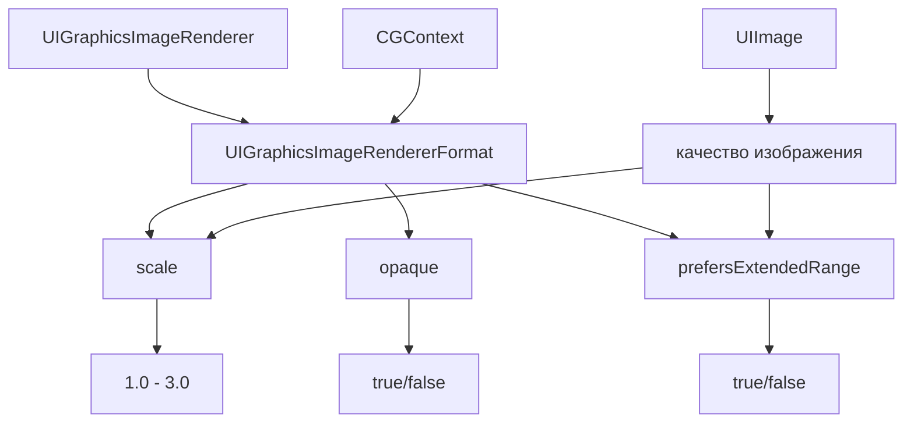

#UIGraphicsImageRendererFormat #UIKit #iOS #Swift #Graphics #ImageRendering #Scale #DisplayP3 #GPUAcceleration #Drawing

---
**(формат графического рендерера / настройки для создания изображений)**

**UIGraphicsImageRendererFormat** — это класс из фреймворка **[[UIKit]]**, который определяет **формат и параметры** для создания изображений через `UIGraphicsImageRenderer`. Он позволяет настраивать масштаб, цветовое пространство, прозрачность и другие свойства при рендеринге графики.

**Ключевые особенности (важно в 2026):**
- Используется вместе с `UIGraphicsImageRenderer` для настройки вывода
- Позволяет задавать **масштаб** (соответствие retina-экранам)
- Поддерживает **широкий цветовой диапазон** (Display P3)
- Управляет **прозрачностью** (`opaque` vs `transparent`)
- Автоматически адаптируется под экран устройства через `default()` 

---

### Основные свойства UIGraphicsImageRendererFormat

| Свойство               | Тип         | Назначение                                                      |
| ---------------------- | ----------- | --------------------------------------------------------------- |
| `scale`                | [[CGFloat]] | Масштаб изображения (1.0 = @1x, 2.0 = @2x, 3.0 = @3x)           |
| `opaque`               | [[Bool]]    | Непрозрачность изображения (`true` — без альфа-канала, быстрее) |
| `prefersExtendedRange` | `Bool`      | Использовать широкий цветовой диапазон (Display P3)             |
| `bounds`               | `CGRect`    | Границы изображения (задаётся при создании)                     |

**Фабричные методы**:
- `default()` — формат, соответствующий текущему экрану
- `forDrawing()` — оптимизирован для рисования 

---

### Схема взаимосвязей



---

### Примеры (от простого к сложному)

#### 1. Базовое создание с форматом по умолчанию
```swift
import UIKit

class BasicFormatViewController: UIViewController {
    
    override func viewDidLoad() {
        super.viewDidLoad()
        
        // 1. Получаем формат по умолчанию
        let format = UIGraphicsImageRendererFormat.default()
        
        print("📊 Формат по умолчанию:")
        print("   Масштаб: \(format.scale)")    // 2.0 или 3.0
        print("   Непрозрачный: \(format.opaque)")
        print("   Extended Range: \(format.prefersExtendedRange)")
        
        // 2. Создаём рендерер
        let renderer = UIGraphicsImageRenderer(size: CGSize(width: 200, height: 200), 
                                               format: format)
        
        // 3. Рисуем
        let image = renderer.image { context in
            UIColor.systemBlue.setFill()
            context.fill(CGRect(x: 0, y: 0, width: 200, height: 200))
        }
        
        // 4. Используем изображение
        let imageView = UIImageView(image: image)
        imageView.center = view.center
        view.addSubview(imageView)
    }
}
```

#### 2. Настройка масштаба вручную
```swift
class ScaleFormatViewController: UIViewController {
    
    override func viewDidLoad() {
        super.viewDidLoad()
        
        // 1. Создаём формат с @1x
        let format1x = UIGraphicsImageRendererFormat()
        format1x.scale = 1.0
        format1x.opaque = true
        
        // 2. Формат с @2x
        let format2x = UIGraphicsImageRendererFormat()
        format2x.scale = 2.0
        
        // 3. Формат с @3x
        let format3x = UIGraphicsImageRendererFormat()
        format3x.scale = 3.0
        
        // 4. Сравнение размеров
        let size = CGSize(width: 100, height: 100)
        
        let renderer1x = UIGraphicsImageRenderer(size: size, format: format1x)
        let renderer2x = UIGraphicsImageRenderer(size: size, format: format2x)
        let renderer3x = UIGraphicsImageRenderer(size: size, format: format3x)
        
        let image1x = renderer1x.image { ctx in
            UIColor.red.setFill()
            ctx.fill(CGRect(origin: .zero, size: size))
        }
        let image2x = renderer2x.image { ctx in
            UIColor.green.setFill()
            ctx.fill(CGRect(origin: .zero, size: size))
        }
        let image3x = renderer3x.image { ctx in
            UIColor.blue.setFill()
            ctx.fill(CGRect(origin: .zero, size: size))
        }
        
        print("📏 Размеры изображений:")
        print("   @1x: \(image1x.size) (scale: \(image1x.scale))")
        print("   @2x: \(image2x.size) (scale: \(image2x.scale))")
        print("   @3x: \(image3x.size) (scale: \(image3x.scale))")
        print("   Количество пикселей: \(image2x.size.width * image2x.scale) x \(image2x.size.height * image2x.scale)")
    }
}
```

#### 3. Управление прозрачностью
```swift
class OpaqueFormatViewController: UIViewController {
    
    override func viewDidLoad() {
        super.viewDidLoad()
        
        // 1. Непрозрачное изображение (быстрее, меньше памяти)
        let opaqueFormat = UIGraphicsImageRendererFormat()
        opaqueFormat.opaque = true
        opaqueFormat.scale = UIScreen.main.scale
        
        // 2. Прозрачное изображение (поддерживает альфа-канал)
        let transparentFormat = UIGraphicsImageRendererFormat()
        transparentFormat.opaque = false
        transparentFormat.scale = UIScreen.main.scale
        
        // 3. Рисуем непрозрачное изображение
        let opaqueRenderer = UIGraphicsImageRenderer(size: CGSize(width: 200, height: 200),
                                                     format: opaqueFormat)
        let opaqueImage = opaqueRenderer.image { ctx in
            // Заливаем красным
            UIColor.red.setFill()
            ctx.fill(CGRect(x: 0, y: 0, width: 200, height: 200))
            
            // Рисуем полупрозрачный круг
            UIColor.blue.withAlphaComponent(0.5).setFill()
            ctx.fillEllipse(in: CGRect(x: 50, y: 50, width: 100, height: 100))
        }
        
        // 4. Рисуем прозрачное изображение
        let transparentRenderer = UIGraphicsImageRenderer(size: CGSize(width: 200, height: 200),
                                                          format: transparentFormat)
        let transparentImage = transparentRenderer.image { ctx in
            // Заливаем красным (прозрачность сохранится)
            UIColor.red.setFill()
            ctx.fill(CGRect(x: 0, y: 0, width: 200, height: 200))
            
            // Рисуем полупрозрачный круг
            UIColor.blue.withAlphaComponent(0.5).setFill()
            ctx.fillEllipse(in: CGRect(x: 50, y: 50, width: 100, height: 100))
        }
        
        print("📊 Сравнение:")
        print("   Непрозрачное: \(opaqueImage.cgImage?.alphaInfo?.rawValue ?? 0)")
        print("   Прозрачное: \(transparentImage.cgImage?.alphaInfo?.rawValue ?? 0)")
        
        // Отображаем оба изображения
        let stackView = UIStackView(arrangedSubviews: [
            createImageView(opaqueImage, title: "Непрозрачное"),
            createImageView(transparentImage, title: "Прозрачное")
        ])
        stackView.axis = .vertical
        stackView.spacing = 20
        stackView.center = view.center
        view.addSubview(stackView)
    }
    
    private func createImageView(_ image: UIImage, title: String) -> UIView {
        let container = UIView()
        let imageView = UIImageView(image: image)
        imageView.contentMode = .scaleAspectFit
        container.addSubview(imageView)
        
        let label = UILabel()
        label.text = title
        label.textAlignment = .center
        container.addSubview(label)
        
        // Layout (упрощённо)
        return container
    }
}
```

#### 4. Использование широкого цветового диапазона (Display P3)
```swift
class WideColorViewController: UIViewController {
    
    override func viewDidLoad() {
        super.viewDidLoad()
        
        // 1. Стандартный цветовой диапазон (sRGB)
        let sRGBFormat = UIGraphicsImageRendererFormat()
        sRGBFormat.prefersExtendedRange = false
        
        // 2. Широкий диапазон (Display P3)
        let p3Format = UIGraphicsImageRendererFormat()
        p3Format.prefersExtendedRange = true
        
        // 3. Рисуем изображение с ярким цветом
        let size = CGSize(width: 200, height: 200)
        
        // Ярко-зелёный цвет (в P3 выглядит насыщеннее)
        let brightGreen = UIColor(red: 0.0, green: 1.0, blue: 0.0, alpha: 1.0)
        
        let sRGBRenderer = UIGraphicsImageRenderer(size: size, format: sRGBFormat)
        let sRGBImage = sRGBRenderer.image { ctx in
            brightGreen.setFill()
            ctx.fill(CGRect(origin: .zero, size: size))
        }
        
        let p3Renderer = UIGraphicsImageRenderer(size: size, format: p3Format)
        let p3Image = p3Renderer.image { ctx in
            brightGreen.setFill()
            ctx.fill(CGRect(origin: .zero, size: size))
        }
        
        print("📊 Цветовые профили:")
        print("   sRGB: \(sRGBImage.cgImage?.colorSpace?.name ?? "unknown")")
        print("   P3: \(p3Image.cgImage?.colorSpace?.name ?? "unknown")")
        
        // Отображаем изображения на устройствах с поддержкой P3
        let stackView = UIStackView(arrangedSubviews: [
            createImageView(sRGBImage, title: "sRGB"),
            createImageView(p3Image, title: "Display P3")
        ])
        stackView.axis = .vertical
        stackView.spacing = 20
        stackView.center = view.center
        view.addSubview(stackView)
    }
    
    private func createImageView(_ image: UIImage, title: String) -> UIView {
        let container = UIView()
        let imageView = UIImageView(image: image)
        imageView.contentMode = .scaleAspectFit
        container.addSubview(imageView)
        
        let label = UILabel()
        label.text = title
        label.textAlignment = .center
        container.addSubview(label)
        
        return container
    }
}
```

#### 5. Создание рендерера с кастомным форматом
```swift
class CustomFormatViewController: UIViewController {
    
    override func viewDidLoad() {
        super.viewDidLoad()
        
        // 1. Создаём кастомный формат
        let format = UIGraphicsImageRendererFormat()
        format.scale = UIScreen.main.scale * 1.5 // Супер-ретина
        format.opaque = false
        format.prefersExtendedRange = true
        
        // 2. Создаём рендерер
        let size = CGSize(width: 300, height: 300)
        let renderer = UIGraphicsImageRenderer(size: size, format: format)
        
        // 3. Рисуем сложное изображение
        let image = renderer.image { context in
            let cgContext = context.cgContext
            
            // Градиент
            let colors = [UIColor.systemBlue.cgColor, UIColor.systemPurple.cgColor]
            let gradient = CGGradient(colorsSpace: nil, colors: colors as CFArray, locations: nil)
            cgContext.drawLinearGradient(gradient!,
                                         start: CGPoint(x: 0, y: 0),
                                         end: CGPoint(x: size.width, y: size.height),
                                         options: .drawsBeforeStartLocation)
            
            // Круг
            UIColor.white.setFill()
            cgContext.fillEllipse(in: CGRect(x: 50, y: 50, width: 200, height: 200))
            
            // Текст
            let text = "Кастомный\nформат"
            let attributes: [NSAttributedString.Key: Any] = [
                .font: UIFont.systemFont(ofSize: 30, weight: .bold),
                .foregroundColor: UIColor.systemBlue,
                .paragraphStyle: {
                    let style = NSMutableParagraphStyle()
                    style.alignment = .center
                    return style
                }()
            ]
            text.draw(in: CGRect(x: 70, y: 120, width: 160, height: 80),
                      withAttributes: attributes)
        }
        
        // 4. Отображаем
        let imageView = UIImageView(image: image)
        imageView.contentMode = .scaleAspectFit
        imageView.frame = CGRect(x: 50, y: 100, width: 300, height: 300)
        view.addSubview(imageView)
        
        print("📊 Кастомный формат:")
        print("   Масштаб: \(format.scale)")
        print("   Непрозрачный: \(format.opaque)")
        print("   Extended Range: \(format.prefersExtendedRange)")
        print("   Размер изображения: \(image.size)")
    }
}
```

#### 6. Использование forDrawing() для оптимизации
```swift
class DrawingOptimizedViewController: UIViewController {
    
    override func viewDidLoad() {
        super.viewDidLoad()
        
        // 1. Формат для рисования (оптимизирован для производительности)
        let drawingFormat = UIGraphicsImageRendererFormat.forDrawing()
        
        // 2. Сравнение с дефолтным
        let defaultFormat = UIGraphicsImageRendererFormat.default()
        
        print("📊 Сравнение форматов:")
        print("   Default:")
        print("     Scale: \(defaultFormat.scale)")
        print("     Opaque: \(defaultFormat.opaque)")
        print("     Extended Range: \(defaultFormat.prefersExtendedRange)")
        print("   forDrawing():")
        print("     Scale: \(drawingFormat.scale)")
        print("     Opaque: \(drawingFormat.opaque)")
        print("     Extended Range: \(drawingFormat.prefersExtendedRange)")
        
        // 3. Создаём изображение с оптимизированным форматом
        let size = CGSize(width: 400, height: 400)
        let renderer = UIGraphicsImageRenderer(size: size, format: drawingFormat)
        
        let image = renderer.image { context in
            // Рисуем диаграмму
            let colors: [UIColor] = [.systemRed, .systemBlue, .systemGreen, .systemYellow]
            let values: [CGFloat] = [0.3, 0.5, 0.2, 0.4]
            
            var startAngle: CGFloat = -.pi / 2
            
            for (index, value) in values.enumerated() {
                let endAngle = startAngle + (value * .pi * 2)
                
                let path = UIBezierPath()
                path.move(to: CGPoint(x: 200, y: 200))
                path.addArc(withCenter: CGPoint(x: 200, y: 200),
                           radius: 150,
                           startAngle: startAngle,
                           endAngle: endAngle,
                           clockwise: true)
                path.close()
                
                colors[index].setFill()
                path.fill()
                
                startAngle = endAngle
            }
        }
        
        let imageView = UIImageView(image: image)
        imageView.contentMode = .scaleAspectFit
        imageView.frame = CGRect(x: 50, y: 100, width: 400, height: 400)
        view.addSubview(imageView)
    }
}
```

#### 7. Формат с прозрачностью и широким диапазоном
```swift
class AdvancedFormatViewController: UIViewController {
    
    override func viewDidLoad() {
        super.viewDidLoad()
        
        // 1. Конфигурируем формат для качественного изображения
        let format = UIGraphicsImageRendererFormat()
        format.scale = UIScreen.main.scale // 2x или 3x
        format.opaque = false              // Прозрачность для наложения
        format.prefersExtendedRange = true // Широкий цветовой диапазон
        
        // 2. Рендерим изображение
        let size = CGSize(width: 500, height: 500)
        let renderer = UIGraphicsImageRenderer(size: size, format: format)
        
        let image = renderer.image { context in
            // Задний фон (полупрозрачный градиент)
            let gradientColors = [
                UIColor.systemBlue.withAlphaComponent(0.3).cgColor,
                UIColor.systemPurple.withAlphaComponent(0.3).cgColor
            ]
            let gradient = CGGradient(colorsSpace: nil,
                                     colors: gradientColors as CFArray,
                                     locations: nil)
            context.cgContext.drawLinearGradient(gradient!,
                                                start: CGPoint.zero,
                                                end: CGPoint(x: size.width, y: size.height),
                                                options: .drawsBeforeStartLocation)
            
            // Основные фигуры с эффектами
            drawCircle(in: context, at: CGPoint(x: 150, y: 150), radius: 100, color: .systemRed)
            drawCircle(in: context, at: CGPoint(x: 350, y: 150), radius: 100, color: .systemGreen)
            drawCircle(in: context, at: CGPoint(x: 250, y: 350), radius: 100, color: .systemBlue)
            
            // Текст с тенью
            let text = "✨ Качество"
            let shadow = NSShadow()
            shadow.shadowColor = UIColor.black.withAlphaComponent(0.3)
            shadow.shadowOffset = CGSize(width: 2, height: 2)
            shadow.shadowBlurRadius = 4
            
            let attributes: [NSAttributedString.Key: Any] = [
                .font: UIFont.systemFont(ofSize: 40, weight: .bold),
                .foregroundColor: UIColor.white,
                .shadow: shadow
            ]
            text.draw(at: CGPoint(x: 150, y: 400), withAttributes: attributes)
        }
        
        // 3. Отображаем
        let imageView = UIImageView(image: image)
        imageView.contentMode = .scaleAspectFit
        imageView.frame = CGRect(x: 50, y: 100, width: 500, height: 500)
        view.addSubview(imageView)
        
        // 4. Выводим информацию
        print("📊 Качественный формат:")
        print("   Масштаб: \(format.scale)")
        print("   Непрозрачный: \(format.opaque)")
        print("   Extended Range: \(format.prefersExtendedRange)")
        print("   CGColorSpace: \(image.cgImage?.colorSpace?.name ?? "unknown")")
        print("   Alpha Info: \(image.cgImage?.alphaInfo?.rawValue ?? 0)")
    }
    
    private func drawCircle(in context: UIGraphicsImageRendererContext,
                           at center: CGPoint,
                           radius: CGFloat,
                           color: UIColor) {
        let path = UIBezierPath(arcCenter: center,
                               radius: radius,
                               startAngle: 0,
                               endAngle: .pi * 2,
                               clockwise: true)
        
        // Полупрозрачная заливка
        color.withAlphaComponent(0.7).setFill()
        path.fill()
        
        // Обводка
        UIColor.white.withAlphaComponent(0.5).setStroke()
        path.lineWidth = 3
        path.stroke()
    }
}
```

#### 8. Проверка поддержки Extended Range на устройстве
```swift
class ExtendedRangeCheckViewController: UIViewController {
    
    override func viewDidLoad() {
        super.viewDidLoad()
        
        // 1. Проверяем поддержку широкого диапазона на устройстве
        let screen = UIScreen.main
        let supportsP3 = screen.traitCollection.displayGamut == .P3
        
        print("📱 Информация об устройстве:")
        print("   Поддержка Display P3: \(supportsP3)")
        print("   Масштаб экрана: \(screen.scale)")
        
        // 2. Создаём форматы с учётом возможностей устройства
        let format = UIGraphicsImageRendererFormat()
        format.scale = screen.scale
        format.prefersExtendedRange = supportsP3 // Включаем только если поддерживается
        
        // 3. Тестируем с ярким цветом
        let size = CGSize(width: 200, height: 200)
        let renderer = UIGraphicsImageRenderer(size: size, format: format)
        
        let image = renderer.image { context in
            // Яркий зелёный (в P3 будет ярче, в sRGB будет по стандарту)
            UIColor(red: 0.0, green: 1.0, blue: 0.0, alpha: 1.0).setFill()
            context.fill(CGRect(origin: .zero, size: size))
        }
        
        // 4. Проверяем цветовое пространство полученного изображения
        let colorSpace = image.cgImage?.colorSpace
        let colorSpaceName = colorSpace?.name as? String ?? "unknown"
        
        print("📊 Результирующее изображение:")
        print("   Цветовое пространство: \(colorSpaceName)")
        print("   Масштаб: \(image.scale)")
        
        // 5. Отображаем
        let imageView = UIImageView(image: image)
        imageView.center = view.center
        view.addSubview(imageView)
    }
}
```

---

### Важные нюансы 2026 года

> [!warning]
> **Масштаб:** Устанавливайте `scale` в соответствии с экраном устройства. `UIScreen.main.scale` даёт корректное значение.
>
> **Opaque vs Transparent:** Непрозрачные изображения (`opaque = true`) рендерятся быстрее и занимают меньше памяти. Используйте только если изображение полностью заполняет область.
>
> **Extended Range:** Включайте `prefersExtendedRange = true` только на устройствах с поддержкой Display P3 (iPhone 7 и новее). На старых устройствах это может вызвать проблемы.
>
> **forDrawing():** Используйте `UIGraphicsImageRendererFormat.forDrawing()` для оптимизации рендеринга. Он адаптируется под текущий контекст рисования.
>
> **Память:** Большие изображения с высоким масштабом занимают много памяти. Всегда освобождайте ресурсы после использования.

---

### Лучшие практики 2026

1. **Используйте `default()`** для большинства случаев
2. **Для производительности** используйте `forDrawing()`
3. **Для прозрачных изображений** устанавливайте `opaque = false`
4. **Для iOS 13+** используйте `prefersExtendedRange` для поддержки P3
5. **Проверяйте поддержку P3** на устройстве перед включением
6. **Освобождайте рендереры и контексты** после использования

---

### Связь с другими темами

- [[UIGraphicsImageRenderer]] — основной рендерер
- [[UIImage]] — результирующее изображение
- [[UIScreen]] — информация об экране
- [[UITraitCollection]] — поддержка цветовых профилей
- [[Core Graphics]] — нижний уровень графики