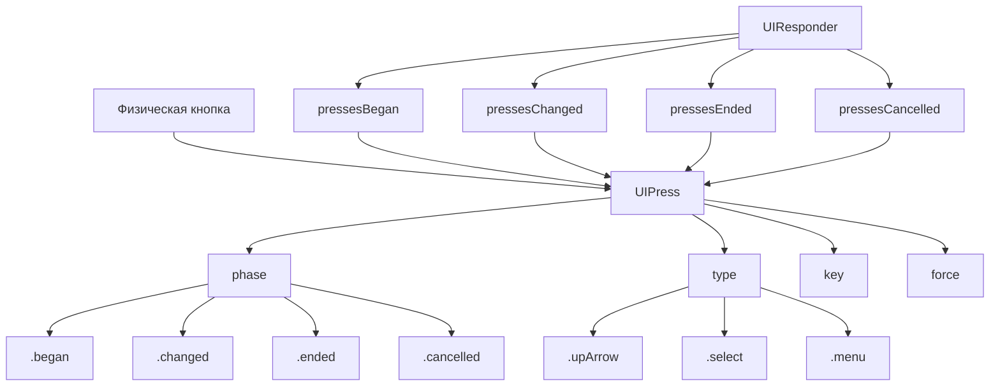

#UIPress #UIKit #iOS #Swift #tvOS #PhysicalButtons #HardwareInput #AppleTV #GameControllers #UIResponder

---
**(объект нажатия кнопки / информация о физическом нажатии)**

**UIPress** — это класс из фреймворка **[[UIKit]]**, который представляет **нажатие физической кнопки** на устройстве или подключённом аксессуаре (пульт Apple TV, клавиатура, геймпад). Он содержит информацию о кнопке, фазе нажатия, силе и времени события .

**Ключевые особенности (важно в 2026):**
- Поддерживается на **iOS, tvOS, macOS Catalyst и visionOS** 
- Представляет **реальные физические кнопки** на пультах, контроллерах и клавиатурах 
- Используется в **[[UIResponder]]** (`pressesBegan`, `pressesMoved`, `pressesEnded`, `pressesCancelled`)
- Для клавиатурных событий содержит свойство `key` типа `UIKey` 
- Поддерживает **аналоговые значения** (сила нажатия, триггеры) через `phase .changed` 

---

### Основные свойства UIPress

| Свойство             | Тип                      | Назначение                                                  |
| -------------------- | ------------------------ | ----------------------------------------------------------- |
| `phase`              | `UIPress.Phase`          | Фаза нажатия (began, changed, stationary, ended, cancelled) |
| `type`               | `UIPress.PressType`      | Тип кнопки (стрелки, Select, Menu, Play/Pause и др.)        |
| `key`                | `UIKey?`                 | Клавиша на физической клавиатуре                            |
| `force`              | [[CGFloat]]              | Сила нажатия кнопки                                         |
| `timestamp`          | [[TimeInterval]]         | Время возникновения события                                 |
| `window`             | [[UIWindow]]?            | Окно, в котором произошло нажатие                           |
| `gestureRecognizers` | `[UIGestureRecognizer]?` | Жесты, обрабатывающие данное нажатие                        |

**UIPress.Phase** :
- `.began` — кнопка нажата
- `.changed` — изменилось значение (сила, позиция) 
- `.stationary` — кнопка удерживается без изменений
- `.ended` — кнопка отпущена
- `.cancelled` — нажатие отменено системой

**UIPress.PressType** :
- `.upArrow`, `.downArrow`, `.leftArrow`, `.rightArrow` — стрелки
- `.select` — кнопка выбора
- `.menu` — кнопка Menu (Apple TV)
- `.playPause` — кнопка воспроизведения/паузы
- `.pageUp`, `.pageDown` — страничные кнопки

---

### Схема взаимосвязей



---

### Примеры (от простого к сложному)

#### 1. Базовое получение нажатий в [[UIViewController]]
```swift
import UIKit

class BasicPressViewController: UIViewController {
    
    override func pressesBegan(_ presses: Set<UIPress>, with event: UIPressesEvent?) {
        for press in presses {
            print("👆 Кнопка нажата:")
            print("   Тип: \(press.type)")
            print("   Фаза: \(press.phase)")
            print("   Время: \(press.timestamp)")
            
            // Для клавиатурных событий
            if let key = press.key {
                print("   Клавиша: \(key.keyCode) (\(key.characters ?? ""))")
            }
        }
    }
    
    override func pressesEnded(_ presses: Set<UIPress>, with event: UIPressesEvent?) {
        for press in presses {
            print("✅ Кнопка отпущена: \(press.type)")
        }
    }
    
    override func pressesCancelled(_ presses: Set<UIPress>, with event: UIPressesEvent?) {
        print("❌ Нажатие отменено")
    }
}
```

#### 2. Обработка аналоговых изменений силы (триггеры геймпада)
```swift
class GamepadViewController: UIViewController {
    
    override func pressesChanged(_ presses: Set<UIPress>, with event: UIPressesEvent?) {
        for press in presses {
            // Аналоговое изменение (например, триггер L2/R2)
            print("🔄 Изменение силы:")
            print("   Кнопка: \(press.type)")
            print("   Сила: \(press.force)")
        }
    }
}
```

#### 3. Навигация по кнопкам на Apple TV
```swift
class TVNavigationViewController: UIViewController {
    
    override func pressesBegan(_ presses: Set<UIPress>, with event: UIPressesEvent?) {
        for press in presses {
            switch press.type {
            case .upArrow:
                print("⬆️ Вверх")
                navigateUp()
            case .downArrow:
                print("⬇️ Вниз")
                navigateDown()
            case .leftArrow:
                print("⬅️ Влево")
                navigateLeft()
            case .rightArrow:
                print("➡️ Вправо")
                navigateRight()
            case .select:
                print("✅ Выбор")
                selectItem()
            case .menu:
                print("📋 Меню")
                showMenu()
            case .playPause:
                print("▶️ Воспроизведение/Пауза")
                togglePlayback()
            default:
                print("Неизвестная кнопка: \(press.type)")
            }
        }
    }
    
    private func navigateUp() { /* ... */ }
    private func navigateDown() { /* ... */ }
    private func navigateLeft() { /* ... */ }
    private func navigateRight() { /* ... */ }
    private func selectItem() { /* ... */ }
    private func showMenu() { /* ... */ }
    private func togglePlayback() { /* ... */ }
}
```

#### 4. Обработка нажатий клавиатуры на iPad
```swift
class KeyboardViewController: UIViewController {
    
    override var canBecomeFirstResponder: Bool {
        return true
    }
    
    override func viewDidAppear(_ animated: Bool) {
        super.viewDidAppear(animated)
        becomeFirstResponder()
    }
    
    override func pressesBegan(_ presses: Set<UIPress>, with event: UIPressesEvent?) {
        for press in presses {
            guard let key = press.key else { continue }
            
            switch key.keyCode {
            case .keyboardReturn:
                print("↵ Enter нажат")
                handleReturn()
            case .keyboardSpace:
                print("␣ Пробел")
                handleSpace()
            case .keyboardEscape:
                print("⎋ ESC")
                handleEscape()
            case .keyboardDelete:
                print("⌫ Delete")
                handleDelete()
            case .keyboardUpArrow, .keyboardDownArrow,
                 .keyboardLeftArrow, .keyboardRightArrow:
                print("Стрелка: \(key.keyCode)")
                handleArrow(key.keyCode)
            default:
                print("Клавиша: \(key.characters ?? "unknown")")
            }
        }
    }
}
```

#### 5. Сочетание клавиш (Ctrl+S, Cmd+C и т.д.)
```swift
class KeyboardShortcutsViewController: UIViewController {
    
    override var canBecomeFirstResponder: Bool {
        return true
    }
    
    override func viewDidAppear(_ animated: Bool) {
        super.viewDidAppear(animated)
        becomeFirstResponder()
    }
    
    override func pressesBegan(_ presses: Set<UIPress>, with event: UIPressesEvent?) {
        for press in presses {
            guard let key = press.key else { continue }
            
            let modifierFlags = key.modifierFlags
            
            // Cmd + S
            if modifierFlags.contains(.command),
               key.keyCode == .keyboardS {
                print("⌘S сохранение")
                saveDocument()
                return
            }
            
            // Cmd + C
            if modifierFlags.contains(.command),
               key.keyCode == .keyboardC {
                print("⌘C копирование")
                copySelected()
                return
            }
            
            // Ctrl + Shift + A (специальное сочетание)
            if modifierFlags.contains(.control),
               modifierFlags.contains(.shift),
               key.keyCode == .keyboardA {
                print("⌃⇧A специальное действие")
                specialAction()
                return
            }
        }
    }
    
    private func saveDocument() { /* ... */ }
    private func copySelected() { /* ... */ }
    private func specialAction() { /* ... */ }
}
```

#### 6. Управление воспроизведением на Apple TV
```swift
class TVPlayerViewController: UIViewController {
    
    private var isPlaying = false
    
    override func pressesBegan(_ presses: Set<UIPress>, with event: UIPressesEvent?) {
        for press in presses {
            switch press.type {
            case .playPause:
                togglePlayback()
            case .select:
                showInfo()
            case .menu:
                dismiss(animated: true)
            default:
                break
            }
        }
    }
    
    private func togglePlayback() {
        isPlaying.toggle()
        print(isPlaying ? "▶️ Воспроизведение" : "⏸️ Пауза")
    }
    
    private func showInfo() {
        print("ℹ️ Показать информацию")
    }
}
```

#### 7. Обработка длительного нажатия на Apple TV
```swift
class LongPressTVViewController: UIViewController {
    
    private var pressTimer: Timer?
    
    override func pressesBegan(_ presses: Set<UIPress>, with event: UIPressesEvent?) {
        for press in presses {
            if press.type == .select {
                // Запускаем таймер для определения длительного нажатия
                pressTimer = Timer.scheduledTimer(withTimeInterval: 0.8, repeats: false) { _ in
                    self.handleLongPress()
                }
            }
        }
    }
    
    override func pressesEnded(_ presses: Set<UIPress>, with event: UIPressesEvent?) {
        for press in presses {
            if press.type == .select {
                pressTimer?.invalidate()
                pressTimer = nil
                // Короткое нажатие
                handleShortPress()
            }
        }
    }
    
    private func handleShortPress() {
        print("👆 Короткое нажатие")
    }
    
    private func handleLongPress() {
        print("⏱️ Длительное нажатие")
    }
}
```

#### 8. Полный обработчик нажатий для Apple TV
```swift
class FullTVHandler: UIViewController {
    
    override func viewDidLoad() {
        super.viewDidLoad()
        // Фокус для получения событий
        #if os(tvOS)
        view.focusGroupIdentifier = "mainGroup"
        #endif
    }
    
    override func pressesBegan(_ presses: Set<UIPress>, with event: UIPressesEvent?) {
        for press in presses {
            handlePress(press, phase: .began)
        }
    }
    
    override func pressesChanged(_ presses: Set<UIPress>, with event: UIPressesEvent?) {
        for press in presses {
            handlePress(press, phase: .changed)
        }
    }
    
    override func pressesEnded(_ presses: Set<UIPress>, with event: UIPressesEvent?) {
        for press in presses {
            handlePress(press, phase: .ended)
        }
    }
    
    override func pressesCancelled(_ presses: Set<UIPress>, with event: UIPressesEvent?) {
        print("❌ Нажатие отменено")
    }
    
    private func handlePress(_ press: UIPress, phase: UIPress.Phase) {
        #if os(tvOS)
        // Для Apple TV — физические кнопки пульта
        switch (phase, press.type) {
        case (.began, .upArrow):
            print("⬆️ Нажата кнопка вверх")
        case (.began, .downArrow):
            print("⬇️ Нажата кнопка вниз")
        case (.began, .leftArrow):
            print("⬅️ Нажата кнопка влево")
        case (.began, .rightArrow):
            print("➡️ Нажата кнопка вправо")
        case (.began, .select):
            print("✅ Выбор")
        case (.began, .menu):
            print("📋 Меню")
        case (.began, .playPause):
            print("▶️ Play/Pause")
        default:
            print("Кнопка: \(press.type), фаза: \(phase)")
        }
        #endif
    }
}
```

---

### Важные нюансы 2026 года

> [!warning]
> **Платформозависимость:** `UIPress` в основном используется на **Apple TV** и для подключенных клавиатур/геймпадов. На iPhone без внешних аксессуаров события `pressesBegan` возникают редко.
>
> **Фокус:** На tvOS для получения событий нажатий view должен быть в фокусе (`focusGroupIdentifier`, `canBecomeFocused`).
>
> **UIKey:** Для клавиатурных событий используйте свойство `key` для получения детальной информации о клавише.
>
> **Аналоговые значения:** События `.changed` возникают при изменении силы нажатия (триггеры геймпадов) .

---

### Лучшие практики 2026

1. **Используйте `switch` по `press.type`** для обработки разных кнопок
2. **Проверяйте `press.key`** для клавиатурных событий
3. **Не забывайте про `pressesCancelled`** для отмены действий
4. **Для длительных нажатий** используйте таймеры в `pressesBegan` и отменяйте в `pressesEnded`
5. **На tvOS убедитесь**, что view в фокусе для получения событий

---

### Связь с другими темами

- [[UIResponder]] — обработка нажатий
- [[UITouch]] — касания экрана
- [[UIGestureRecognizer]] — распознавание жестов