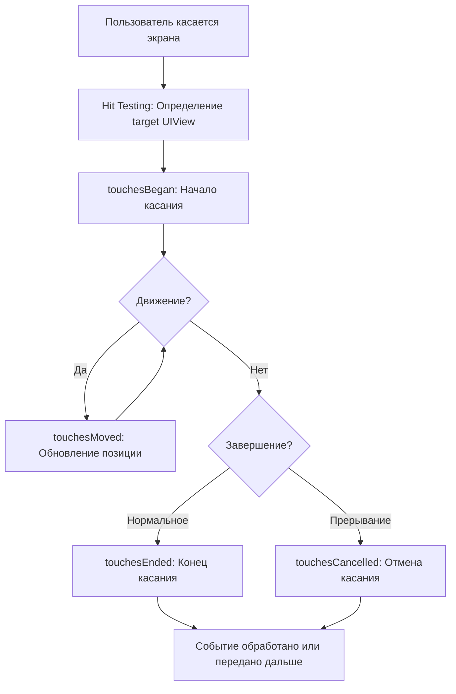

**`UIResponder`** — это фундаментальный абстрактный класс в фреймворке [[UIKit]], который служит основой для обработки событий в приложениях для [[iOS]] и других платформ Apple (таких как iPadOS, tvOS и visionOS). Он определяет интерфейс для объектов, способных реагировать на пользовательские взаимодействия, включая касания экрана (touches), жесты (gestures), движения устройства (motion events), нажатия клавиш (keyboard input), команды из меню (menu actions) и удаленные события (remote control events).

От класса `UIResponder` наследуются ключевые компоненты UIKit, такие как:
- **[[UIView]]**: Представления, которые отображают контент и могут напрямую взаимодействовать с касаниями.
- **[[UIViewController]]**: Контроллеры представлений, управляющие логикой и координирующие события на уровне экрана.
- **[[UIWindow]]**: Окна, которые являются корневыми контейнерами для представлений и событий.
- **[[UIApplication]]**: Само приложение, которое является конечной точкой в цепочке респондентов для необработанных событий.

`UIResponder` относится к разделу **UIKit → Event Handling** и реализует паттерн "Chain of Responsibility" (цепочка ответственности), где события передаются по иерархии объектов до тех пор, пока не будут обработаны или не достигнут конца цепочки.

### Ключевые концепции
- **[[Responder Chain]] (Цепочка респондентов)**: Это динамическая последовательность объектов `UIResponder`, начиная от первого респондента (first responder) и поднимаясь вверх по иерархии представлений и контроллеров. Если объект не обрабатывает событие, оно передается следующему (`next` responder).
- **First Responder**: Объект, который в данный момент получает события (например, активное текстовое поле или фокусированное представление). Можно установить с помощью метода `becomeFirstResponder()` или `resignFirstResponder()`.
- **Event Types**: Поддерживает различные типы событий:
  - Touch events (касания): Основные для мобильных устройств.
  - Motion events: Shake (тряска), accelerometer data.
  - Keyboard events: Для аппаратной клавиатуры или виртуальной.
  - Remote control: Для медиа-контроля (например, наушники).
  - Menu commands: Для контекстных меню и UIMenu.

`UIResponder` не имеет визуального представления — это чисто поведенческий класс, который можно расширять для кастомной логики.

---
## 🔹 Жизненный цикл нажатия на экран (Touch Lifecycle)
Касания экрана — один из самых распространенных типов событий в [[iOS]]. [[UIKit]] обрабатывает их через последовательность методов в `UIResponder`, которые вызываются в зависимости от фазы касания. Это позволяет отслеживать начало, движение, завершение или отмену касания.

### Основные фазы жизненного цикла касания:
1. **touchesBegan(_:with:)**: Вызывается, когда палец (или стилус) касается экрана. Здесь начинается отслеживание касания.
2. **touchesMoved(_:with:)**: Вызывается при перемещении пальца по экрану. Может вызываться многократно для обновления позиции.
3. **touchesEnded(_:with:)**: Вызывается, когда палец отрывается от экрана нормально (без отмены).
4. **touchesCancelled(_:with:)**: Вызывается, если касание прерывается системой (например, из-за входящего звонка, жеста системы или если приложение уходит в фон).

Эти методы принимают:
- `touches`: Множество [[UITouch]] объектов (каждый представляет отдельное касание).
- `event`: Объект [[UIEvent]], содержащий контекст события (время, тип и т.д.).

#### Важные замечания:
- **Мультитач**: iOS поддерживает несколько касаний одновременно (multitouch). Методы вызываются для всех активных касаний.
- **Hit Testing**: Перед вызовом методов UIKit выполняет "[[hitTest]]" — определяет, какое представление ([[UIView]]) получит событие, начиная от UIWindow и спускаясь по иерархии subviews.
- **Gesture Recognizers**: Часто касания перехватываются [[UIGestureRecognizer]] (например, tap, swipe), которые могут "поглощать" события, предотвращая вызов touches-методов в responder.
- **Передача событий**: Если метод не переопределяется или вызывает `super`, событие передается следующему responder в цепочке.
- **Performance**: Эти методы вызываются на main thread; избегайте тяжелых вычислений, чтобы не блокировать UI.

### Схема жизненного цикла


Эта схема показывает поток от начала касания до его завершения. 

#### Пример полного цикла в коде:
```swift
import UIKit

class TouchView: UIView {
    override func touchesBegan(_ touches: Set<UITouch>, with event: UIEvent?) {
        super.touchesBegan(touches, with: event)
        print("Начало касания: \(touches.first?.location(in: self) ?? .zero)")
    }
    
    override func touchesMoved(_ touches: Set<UITouch>, with event: UIEvent?) {
        super.touchesMoved(touches, with: event)
        print("Движение: \(touches.first?.location(in: self) ?? .zero)")
    }
    
    override func touchesEnded(_ touches: Set<UITouch>, with event: UIEvent?) {
        super.touchesEnded(touches, with: event)
        print("Конец касания")
    }
    
    override func touchesCancelled(_ touches: Set<UITouch>, with event: UIEvent?) {
        super.touchesCancelled(touches, with: event)
        print("Касание отменено")
    }
}
```

---
## 🔹 Цепочка респондентов ([[Responder Chain]]) в деталях
События не всегда обрабатываются первым объектом — они могут "всплывать" вверх по цепочке. Цепочка строится на основе иерархии представлений и контроллеров.

### Как строится цепочка:
1. **Начало**: Событие доставляется первому responder (обычно UIView, где произошло касание).
2. **Передача**: Если не обработано, передается `next` responder:
   - Для UIView: Родительский [[UIView]] (superview).
   - Если достигнут root view: [[UIViewController]].
   - Затем: [[UIWindow]].
   - Наконец: [[UIApplication]] (или [[AppDelegate]]).
1. **Специальные случаи**:
   - Для клавиатурных событий: Цепочка начинается от first responder.
   - Можно вручную отправить событие: `UIApplication.shared.sendAction(#selector(action), to: target, from: sender, for: event)`.

### Схема цепочки респондентов (ASCII-арт для простоты)
```
UIApplication
    |
UIWindow
    |
UIViewController (root)
    |
UIView (main view)
    |
Subview (custom view)  <-- First Responder (начало касания)
```

Если событие не обработано в Subview, оно идет вверх: Subview → Main View → UIViewController → UIWindow → UIApplication.

#### Методы для работы с цепочкой:
- `var next: UIResponder?`: Следующий responder.
- `func becomeFirstResponder() -> Bool`: Стать first responder.
- `func resignFirstResponder() -> Bool`: Отказаться от статуса.
- `func canPerformAction(_ action: Selector, withSender sender: Any?) -> Bool`: Проверка, может ли responder выполнить действие (для меню).

---
## 🔹 Примеры кода (расширенные)
### 1. Переопределение метода касания (из оригинала, с добавлением)
```swift
import UIKit

class CustomView: UIView {
    override func touchesBegan(_ touches: Set<UITouch>, with event: UIEvent?) {
        super.touchesBegan(touches, with: event)
        print("Касание началось в \(self)")
        // Можно добавить анимацию или изменить состояние
        backgroundColor = .red
    }
    
    override func touchesEnded(_ touches: Set<UITouch>, with event: UIEvent?) {
        super.touchesEnded(touches, with: event)
        backgroundColor = .clear
    }
}
```

### 2. Передача события следующему респонденту (из оригинала)
```swift
class MyView: UIView {
    override func touchesBegan(_ touches: Set<UITouch>, with event: UIEvent?) {
        print("Свой обработчик в \(self)")
        // Логика: обработать, если нужно, иначе передать
        if someCondition {
            // Обработать здесь
        } else {
            super.touchesBegan(touches, with: event) // Передача дальше
        }
    }
}
```

### 3. Получение цепочки респондентов (из оригинала, с расширением)
```swift
let view = UIView()
let controller = UIViewController()
view.next // Обычно superview или nil
controller.next // UIWindow или nil

// Полный traversal цепочки
func printResponderChain(from responder: UIResponder?) {
    var current = responder
    while current != nil {
        print(current!)
        current = current?.next
    }
}
printResponderChain(from: someView)
```

### 4. Обработка событий клавиатуры в UIResponder (из оригинала)
```swift
class MyTextField: UITextField {
    override var canBecomeFirstResponder: Bool {
        return true // Разрешить стать first responder
    }
    
    override func keyCommands() -> [UIKeyCommand]? {
        return [UIKeyCommand(input: "C", modifierFlags: .command, action: #selector(copyText))]
    }
    
    @objc func copyText() {
        print("Скопировали текст")
    }
}
```

### 5. Создание UIResponder цепочки для событий (из оригинала)
```swift
let window = UIWindow()
let viewController = UIViewController()
window.rootViewController = viewController
let customView = CustomView(frame: CGRect(x: 0, y: 0, width: 100, height: 100))
viewController.view.addSubview(customView)
// Касания в customView могут передаваться вверх по цепочке: CustomView -> UIView (viewController.view) -> UIViewController -> UIWindow -> UIApplication
```

### 6. Новый пример: Обработка жестов через Responder
```swift
class GestureView: UIView {
    override func awakeFromNib() {
        let tapGesture = UITapGestureRecognizer(target: self, action: #selector(handleTap))
        addGestureRecognizer(tapGesture)
    }
    
    @objc func handleTap(_ gesture: UITapGestureRecognizer) {
        print("Жест тапа обработан")
        // Gesture recognizer может отменить touches-методы
    }
}
```

---
## 🔹 Лучшие практики и советы
- **Избегайте блокировки**: Обрабатывайте события быстро; используйте [[GCD]] для фоновых задач.
- **Тестирование**: Используйте Simulator для симуляции multitouch и motion.
- **Accessibility**: `UIResponder` интегрируется с VoiceOver; переопределяйте `accessibilityActivate()` для кастомных действий.
- **Миграция на SwiftUI**: В SwiftUI аналогичная логика реализуется через Gestures и Environment, но без прямого доступа к UIResponder.
- **Документация**: Официальная от Apple: [UIResponder Class Reference](https://developer.apple.com/documentation/uikit/uiresponder).
