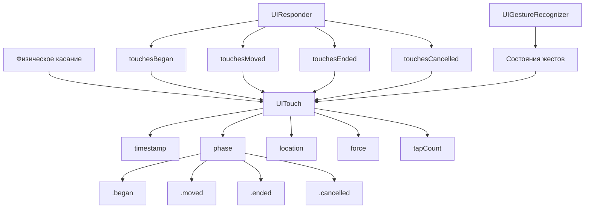

#UITouch #UIKit #iOS #Swift #TouchEvents #Multitouch #GestureRecognizer #UserInteraction #ForceTouch #ApplePencil

---
**(объект касания / информация о прикосновении пользователя)**

**UITouch** — это класс из фреймворка **[[UIKit]]**, который представляет **физическое прикосновение** пользователя к экрану. Он содержит всю информацию о касании: его положение, силу нажатия, время, фазу (начало, перемещение, окончание) и многое другое.

**Ключевые особенности (важно в 2026):**
- Каждое касание на экране представлено отдельным объектом `UITouch`
- Поддерживает **мультитач** — несколько касаний одновременно
- Содержит информацию о **силе нажатия** (`force` — для 3D Touch и Haptic Touch)
- Поддерживает **Apple Pencil** (свойства: `altitudeAngle`, `azimuthAngle`, `type`)
- Используется в **[[UIResponder]]** (`touchesBegan`, `touchesMoved`, `touchesEnded`, `touchesCancelled`) и **UIGestureRecognizer**

---

### Основные свойства UITouch

| Свойство                | Тип                 | Назначение                                                |
| ----------------------- | ------------------- | --------------------------------------------------------- |
| `timestamp`             | [[TimeInterval]]    | Время возникновения касания                               |
| `phase`                 | `UITouch.Phase`     | Фаза касания (began, moved, ended, cancelled, stationary) |
| `location(in:)`         | `CGPoint`           | Позиция касания в указанном view                          |
| `previousLocation(in:)` | [[CGPoint]]         | Предыдущая позиция касания                                |
| `view`                  | [[UIView]]?         | View, в котором произошло касание                         |
| `window`                | [[UIWindow]]?       | Окно, в котором произошло касание                         |
| `tapCount`              | [[Int]]             | Количество тапов (для распознавания двойного тапа)        |
| `force`                 | [[CGFloat]]         | Сила нажатия (0.0 - 6.67)                                 |
| `maximumPossibleForce`  | `CGFloat`           | Максимальная возможная сила                               |
| `altitudeAngle`         | `CGFloat`           | Угол наклона Apple Pencil                                 |
| `azimuthAngle`          | `CGFloat`           | Азимутальный угол Apple Pencil                            |
| `type`                  | `UITouch.TouchType` | Тип касания (direct, stylus, indirectPointer)             |
| `radius`                | `CGFloat`           | Радиус контакта (для Apple Pencil)                        |

**UITouch.Phase**:
- `.began` — касание началось
- `.moved` — палец перемещается
- `.stationary` — палец неподвижен, но другие пальцы двигаются
- `.ended` — палец поднят
- `.cancelled` — касание отменено (например, при системном событии)

---

### Схема взаимосвязей



---

### Примеры (от простого к сложному)

#### 1. Базовое получение касаний в UIView
```swift
import UIKit

class TouchableView: UIView {
    
    override func touchesBegan(_ touches: Set<UITouch>, with event: UIEvent?) {
        guard let touch = touches.first else { return }
        let location = touch.location(in: self)
        
        print("👆 Касание началось в: \(location)")
        print("   Время: \(touch.timestamp)")
        print("   Количество тапов: \(touch.tapCount)")
    }
    
    override func touchesMoved(_ touches: Set<UITouch>, with event: UIEvent?) {
        guard let touch = touches.first else { return }
        let location = touch.location(in: self)
        let previousLocation = touch.previousLocation(in: self)
        
        print("✋ Перемещение из \(previousLocation) в \(location)")
    }
    
    override func touchesEnded(_ touches: Set<UITouch>, with event: UIEvent?) {
        guard let touch = touches.first else { return }
        let location = touch.location(in: self)
        
        print("✅ Касание завершено в: \(location)")
    }
    
    override func touchesCancelled(_ touches: Set<UITouch>, with event: UIEvent?) {
        print("❌ Касание отменено (например, при скролле)")
    }
}
```

#### 2. Работа с мультитач
```swift
class MultitouchView: UIView {
    
    override func touchesBegan(_ touches: Set<UITouch>, with event: UIEvent?) {
        print("👆 Начало касаний: \(touches.count) пальцев")
        
        for (index, touch) in touches.enumerated() {
            let location = touch.location(in: self)
            print("   Палец \(index + 1): \(location)")
        }
    }
    
    override func touchesMoved(_ touches: Set<UITouch>, with event: UIEvent?) {
        print("✋ Перемещение: \(touches.count) пальцев")
        
        for (index, touch) in touches.enumerated() {
            let location = touch.location(in: self)
            print("   Палец \(index + 1): \(location)")
        }
    }
    
    override func touchesEnded(_ touches: Set<UITouch>, with event: UIEvent?) {
        print("✅ Завершение: \(touches.count) пальцев")
    }
}
```

#### 3. Распознавание силы нажатия (3D Touch / Haptic Touch)
```swift
class ForceTouchView: UIView {
    
    override func touchesBegan(_ touches: Set<UITouch>, with event: UIEvent?) {
        handleForce(touches)
    }
    
    override func touchesMoved(_ touches: Set<UITouch>, with event: UIEvent?) {
        handleForce(touches)
    }
    
    private func handleForce(_ touches: Set<UITouch>) {
        guard let touch = touches.first else { return }
        
        let force = touch.force
        let maxForce = touch.maximumPossibleForce
        
        // Сила нажатия от 0.0 до 6.67 (для iPhone 6s и новее)
        print("💪 Сила нажатия: \(force) / \(maxForce)")
        
        // Нормализованная сила (0.0 - 1.0)
        let normalizedForce = force / maxForce
        print("   Нормализованная сила: \(normalizedForce * 100)%")
        
        // Применяем силу к UI
        applyForceEffect(normalizedForce)
    }
    
    private func applyForceEffect(_ force: CGFloat) {
        // Пример: масштабирование при нажатии
        let scale = 0.8 + (0.2 * force)
        transform = CGAffineTransform(scaleX: scale, y: scale)
        
        // Пример: изменение цвета
        let alpha = 0.5 + (0.5 * force)
        backgroundColor = UIColor.red.withAlphaComponent(alpha)
    }
}
```

#### 4. Распознавание двойного тапа через tapCount
```swift
class DoubleTapView: UIView {
    
    override func touchesBegan(_ touches: Set<UITouch>, with event: UIEvent?) {
        guard let touch = touches.first else { return }
        
        if touch.tapCount == 2 {
            print("👆👆 Двойной тап!")
            handleDoubleTap(at: touch.location(in: self))
        }
    }
    
    private func handleDoubleTap(at location: CGPoint) {
        // Создаём анимацию для двойного тапа
        let circle = UIView(frame: CGRect(x: location.x - 20, y: location.y - 20, 
                                          width: 40, height: 40))
        circle.backgroundColor = UIColor.systemBlue.withAlphaComponent(0.3)
        circle.layer.cornerRadius = 20
        self.addSubview(circle)
        
        UIView.animate(withDuration: 0.5, animations: {
            circle.transform = CGAffineTransform(scaleX: 3, y: 3)
            circle.alpha = 0
        }) { _ in
            circle.removeFromSuperview()
        }
    }
}
```

#### 5. Работа с Apple Pencil
```swift
class PencilView: UIView {
    
    override func touchesBegan(_ touches: Set<UITouch>, with event: UIEvent?) {
        guard let touch = touches.first else { return }
        
        if touch.type == .stylus {
            print("✏️ Apple Pencil касание")
            handlePencilTouch(touch)
        } else {
            print("👆 Обычное касание")
        }
    }
    
    override func touchesMoved(_ touches: Set<UITouch>, with event: UIEvent?) {
        guard let touch = touches.first, touch.type == .stylus else { return }
        handlePencilTouch(touch)
    }
    
    private func handlePencilTouch(_ touch: UITouch) {
        let location = touch.location(in: self)
        let altitude = touch.altitudeAngle  // Угол наклона (0 = перпендикулярно)
        let azimuth = touch.azimuthAngle    // Азимутальный угол
        
        let radius = touch.radius           // Радиус контакта
        let force = touch.force             // Сила нажатия
        
        print("✏️ Apple Pencil:")
        print("   Позиция: \(location)")
        print("   Наклон: \(altitude * 180 / .pi)°")
        print("   Азимут: \(azimuth * 180 / .pi)°")
        print("   Радиус: \(radius)pt")
        print("   Сила: \(force)")
        
        // Рисуем линию с учётом наклона и давления
        drawPencilLine(at: location, force: force, altitude: altitude)
    }
    
    private func drawPencilLine(at location: CGPoint, force: CGFloat, altitude: CGFloat) {
        // Определяем толщину линии на основе силы и наклона
        let lineWidth = 2.0 + force * 10.0
        let opacity = 1.0 - (altitude / .pi) * 0.5
        
        // ... рисование линии
    }
}
```

#### 6. Отслеживание всех касаний в приложении
```swift
class TouchTracker {
    static let shared = TouchTracker()
    
    private var activeTouches: [UITouch] = []
    
    func touchBegan(_ touch: UITouch) {
        activeTouches.append(touch)
        print("🟢 Касание начато. Всего активных: \(activeTouches.count)")
    }
    
    func touchMoved(_ touch: UITouch) {
        print("🟡 Касание перемещается. Всего активных: \(activeTouches.count)")
    }
    
    func touchEnded(_ touch: UITouch) {
        activeTouches.removeAll { $0 == touch }
        print("🔴 Касание завершено. Всего активных: \(activeTouches.count)")
    }
    
    func touchCancelled(_ touch: UITouch) {
        activeTouches.removeAll { $0 == touch }
        print("⚪️ Касание отменено. Всего активных: \(activeTouches.count)")
    }
    
    func getActiveTouches() -> [UITouch] {
        return activeTouches
    }
}

// Использование в UIViewController
class TouchTrackingViewController: UIViewController {
    
    override func touchesBegan(_ touches: Set<UITouch>, with event: UIEvent?) {
        super.touchesBegan(touches, with: event)
        touches.forEach { TouchTracker.shared.touchBegan($0) }
    }
    
    override func touchesMoved(_ touches: Set<UITouch>, with event: UIEvent?) {
        super.touchesMoved(touches, with: event)
        touches.forEach { TouchTracker.shared.touchMoved($0) }
    }
    
    override func touchesEnded(_ touches: Set<UITouch>, with event: UIEvent?) {
        super.touchesEnded(touches, with: event)
        touches.forEach { TouchTracker.shared.touchEnded($0) }
    }
    
    override func touchesCancelled(_ touches: Set<UITouch>, with event: UIEvent?) {
        super.touchesCancelled(touches, with: event)
        touches.forEach { TouchTracker.shared.touchCancelled($0) }
    }
}
```

#### 7. Игнорирование касаний в дочерних views ([[hitTest]])
```swift
class IgnoreTouchView: UIView {
    
    // Переопределяем hitTest для игнорирования касаний
    override func hitTest(_ point: CGPoint, with event: UIEvent?) -> UIView? {
        // Все касания проходят сквозь этот view
        return nil
    }
}

class PartialHitTestView: UIView {
    
    override func hitTest(_ point: CGPoint, with event: UIEvent?) -> UIView? {
        // Проверяем, находится ли точка в определённой области
        let touchRect = CGRect(x: bounds.midX - 50, y: bounds.midY - 50, 
                               width: 100, height: 100)
        
        if touchRect.contains(point) {
            return self // Обрабатываем касание
        } else {
            return nil // Игнорируем касание
        }
    }
}
```

#### 8. Обработка касаний в UIResponder с перехватом
```swift
class TouchInterceptViewController: UIViewController {
    
    override func touchesBegan(_ touches: Set<UITouch>, with event: UIEvent?) {
        super.touchesBegan(touches, with: event)
        
        // Перехватываем все касания на уровне ViewController
        guard let touch = touches.first else { return }
        let location = touch.location(in: view)
        
        print("🌐 ViewController перехватил касание в: \(location)")
        
        // Проверяем, касание ли это в UIButton
        for subview in view.subviews {
            if let button = subview as? UIButton {
                let buttonLocation = touch.location(in: button)
                if button.bounds.contains(buttonLocation) {
                    print("   Кнопка нажата: \(button.title(for: .normal) ?? "")")
                }
            }
        }
    }
}
```

#### 9. Комплексная обработка с жестами
```swift
class GestureTouchViewController: UIViewController {
    
    override func viewDidLoad() {
        super.viewDidLoad()
        setupGestures()
    }
    
    private func setupGestures() {
        // 1. Tap Gesture
        let tapGesture = UITapGestureRecognizer(target: self, action: #selector(handleTap))
        view.addGestureRecognizer(tapGesture)
        
        // 2. Double Tap
        let doubleTap = UITapGestureRecognizer(target: self, action: #selector(handleDoubleTap))
        doubleTap.numberOfTapsRequired = 2
        view.addGestureRecognizer(doubleTap)
        
        // 3. Long Press
        let longPress = UILongPressGestureRecognizer(target: self, action: #selector(handleLongPress))
        longPress.minimumPressDuration = 0.5
        view.addGestureRecognizer(longPress)
        
        // 4. Pan (перемещение)
        let panGesture = UIPanGestureRecognizer(target: self, action: #selector(handlePan))
        view.addGestureRecognizer(panGesture)
        
        // 5. Pinch (масштабирование)
        let pinchGesture = UIPinchGestureRecognizer(target: self, action: #selector(handlePinch))
        view.addGestureRecognizer(pinchGesture)
        
        // 6. Rotation (поворот)
        let rotationGesture = UIRotationGestureRecognizer(target: self, action: #selector(handleRotation))
        view.addGestureRecognizer(rotationGesture)
    }
    
    @objc private func handleTap(_ gesture: UITapGestureRecognizer) {
        let location = gesture.location(in: view)
        print("👆 Тап в: \(location)")
        
        let touch = gesture.touches.first
        if let touch = touch {
            print("   Сила нажатия: \(touch.force)")
        }
    }
    
    @objc private func handleDoubleTap(_ gesture: UITapGestureRecognizer) {
        print("👆👆 Двойной тап!")
    }
    
    @objc private func handleLongPress(_ gesture: UILongPressGestureRecognizer) {
        if gesture.state == .began {
            let location = gesture.location(in: view)
            print("⏱️ Долгое нажатие в: \(location)")
            
            // Визуальный эффект
            let pulse = CASpringAnimation(keyPath: "transform.scale")
            pulse.duration = 0.3
            pulse.fromValue = 1.0
            pulse.toValue = 0.9
            gesture.view?.layer.add(pulse, forKey: nil)
        }
    }
    
    @objc private func handlePan(_ gesture: UIPanGestureRecognizer) {
        let translation = gesture.translation(in: view)
        let velocity = gesture.velocity(in: view)
        
        print("🖐️ Панорамирование: \(translation)")
        print("   Скорость: \(velocity)")
    }
    
    @objc private func handlePinch(_ gesture: UIPinchGestureRecognizer) {
        let scale = gesture.scale
        let velocity = gesture.velocity
        
        print("🔍 Масштаб: \(scale) (скорость: \(velocity))")
    }
    
    @objc private func handleRotation(_ gesture: UIRotationGestureRecognizer) {
        let rotation = gesture.rotation
        print("🔄 Поворот: \(rotation * 180 / .pi)°")
    }
}
```

#### 10. Полный трекер касаний с аналитикой
```swift
class TouchAnalyticsView: UIView {
    
    private var touchStartTime: TimeInterval = 0
    private var touchStartLocation: CGPoint = .zero
    private var touchDuration: TimeInterval = 0
    private var touchDistance: CGFloat = 0
    private var previousTouchLocation: CGPoint = .zero
    
    override func touchesBegan(_ touches: Set<UITouch>, with event: UIEvent?) {
        guard let touch = touches.first else { return }
        
        touchStartTime = touch.timestamp
        touchStartLocation = touch.location(in: self)
        previousTouchLocation = touchStartLocation
        touchDistance = 0
        
        print("📊 Касание начато:")
        print("   Время: \(touchStartTime)")
        print("   Позиция: \(touchStartLocation)")
        print("   Сила: \(touch.force)")
        print("   Тип: \(touch.type == .stylus ? "Apple Pencil" : "Палец")")
    }
    
    override func touchesMoved(_ touches: Set<UITouch>, with event: UIEvent?) {
        guard let touch = touches.first else { return }
        
        let currentLocation = touch.location(in: self)
        let delta = distance(from: previousTouchLocation, to: currentLocation)
        touchDistance += delta
        previousTouchLocation = currentLocation
        
        print("📊 Перемещение:")
        print("   Текущая позиция: \(currentLocation)")
        print("   Пройденное расстояние: \(touchDistance)pt")
    }
    
    override func touchesEnded(_ touches: Set<UITouch>, with event: UIEvent?) {
        guard let touch = touches.first else { return }
        
        touchDuration = touch.timestamp - touchStartTime
        let endLocation = touch.location(in: self)
        
        // Анализируем жест
        let isTap = touchDistance < 10 && touchDuration < 0.3
        let isSwipe = touchDistance > 50 && touchDuration < 0.5
        let isHold = touchDuration > 0.5 && touchDistance < 20
        let isDrag = touchDistance > 50 && touchDuration > 0.5
        
        print("📊 Касание завершено:")
        print("   Продолжительность: \(touchDuration)с")
        print("   Начало: \(touchStartLocation)")
        print("   Конец: \(endLocation)")
        print("   Общее расстояние: \(touchDistance)pt")
        print("   Тип жеста: \(describeGesture(isTap: isTap, isSwipe: isSwipe, isHold: isHold, isDrag: isDrag))")
        
        // Отправляем аналитику
        sendAnalytics(touch: touch, duration: touchDuration, distance: touchDistance)
    }
    
    private func distance(from: CGPoint, to: CGPoint) -> CGFloat {
        return sqrt(pow(to.x - from.x, 2) + pow(to.y - from.y, 2))
    }
    
    private func describeGesture(isTap: Bool, isSwipe: Bool, isHold: Bool, isDrag: Bool) -> String {
        if isTap { return "Тап" }
        if isSwipe { return "Свайп" }
        if isHold { return "Удержание" }
        if isDrag { return "Перетаскивание" }
        return "Неопределённый жест"
    }
    
    private func sendAnalytics(touch: UITouch, duration: TimeInterval, distance: CGFloat) {
        let event: [String: Any] = [
            "touchType": touch.type == .stylus ? "stylus" : "finger",
            "duration": duration,
            "distance": distance,
            "force": touch.force,
            "tapCount": touch.tapCount,
            "timestamp": Date().timeIntervalSince1970
        ]
        
        print("📤 Отправка аналитики: \(event)")
        // Отправляем на сервер или в аналитическую систему
    }
}
```

---

### Важные нюансы 2026 года

> [!warning]
> **Set vs Array:** `touches` передаётся как `Set<UITouch>`. Используйте `.first` или итерацию для работы с каждым касанием.
> 
> **Обработка только в активном view:** Касания обрабатываются только в том view, которое находится на переднем плане и не перекрыто другими view.
> 
> **Перехват касаний:** Используйте `hitTest` для изменения логики обработки касаний.
> 
> **Жесты и касания:** Если вы используете `UIGestureRecognizer`, он может перехватывать касания до `touchesBegan` в view.
> 
> **Слабая ссылка:** `UITouch` не хранит сильную ссылку на view. Всегда проверяйте `touch.view` перед использованием.

---

### Лучшие практики 2026

1. **Всегда вызывайте `super`** при переопределении методов касаний
2. **Используйте `UIGestureRecognizer`** для сложной логики жестов
3. **Проверяйте `touch.view`** перед использованием
4. **Используйте `location(in:)`** с правильным view для координат
5. **Для кастомной логики** переопределяйте `touchesBegan`, `touchesMoved`, `touchesEnded`, `touchesCancelled`
6. **Используйте `tapCount`** для распознавания двойных/множественных тапов
7. **Для Apple Pencil** всегда проверяйте `touch.type == .stylus`

---

### Связь с другими темами

- [[UIResponder]] — обработка касаний
- [[UIGestureRecognizer]] — распознавание жестов
- [[UIView]] — получение координат касаний
- [[UIEvent]] — событие касания
- [[UIPress]] — обработка физических кнопок