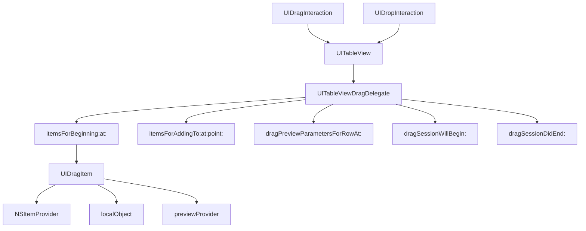

#UITableViewDragDelegate #UIKit #iOS #Swift #UITableView #DragAndDrop #iPad #NSItemProvider #UIDragItem

---
**(делегат перетаскивания для таблицы / управление Drag & Drop в [[UITableView]])**

`UITableViewDragDelegate` — это протокол из фреймворка **[[UIKit]]**, который позволяет **включить поддержку перетаскивания (Drag & Drop)** для `UITableView`. Он определяет методы для предоставления данных, настройки визуального отображения перетаскиваемых строк и управления анимацией во время перетаскивания.

**Ключевые особенности (важно в 2026):**
- Появился в **[[iOS]] 11.0+** вместе с фреймворком Drag & Drop на iPad
- Работает в паре с [[UITableViewDropDelegate]] для приёма данных
- Позволяет перетаскивать строки **внутри** таблицы, **между** таблицами и **в другие приложения**
- Поддерживает **множественный выбор** строк для перетаскивания
- Интегрируется с `UITableView` через свойство `dragDelegate`

---

### Основные методы UITableViewDragDelegate

| Метод | Назначение | Обязательный |
|-------|------------|--------------|
| `tableView(_:itemsForBeginning:at:)` | Предоставляет элементы для перетаскивания | ✅ Да |
| `tableView(_:itemsForAddingTo:at:point:)` | Добавление элементов в существующую сессию | ❌ Нет |
| `tableView(_:dragPreviewParametersForRowAt:)` | Настройка превью для перетаскиваемой строки | ❌ Нет |
| `tableView(_:dragSessionWillBegin:)` | Уведомление о начале сессии перетаскивания | ❌ Нет |
| `tableView(_:dragSessionDidEnd:)` | Уведомление о завершении сессии | ❌ Нет |
| `tableView(_:dragSessionAllowsMoveOperation:)` | Разрешение операции перемещения | ❌ Нет |
| `tableView(_:dragSessionIsRestrictedToDraggingApplication:)` | Ограничение перетаскивания только внутри приложения | ❌ Нет |

---

### Схема взаимосвязей



---

### Примеры (от простого к сложному)

#### 1. Базовое перетаскивание в таблице
```swift
import UIKit

class BasicDragTableViewController: UIViewController,
                                   UITableViewDataSource,
                                   UITableViewDelegate,
                                   UITableViewDragDelegate {
    
    private var tableView: UITableView!
    private var items = ["Apple", "Banana", "Cherry", "Date", "Elderberry", "Fig", "Grape"]
    
    override func viewDidLoad() {
        super.viewDidLoad()
        setupTableView()
    }
    
    private func setupTableView() {
        tableView = UITableView(frame: view.bounds, style: .plain)
        tableView.dataSource = self
        tableView.delegate = self
        tableView.register(UITableViewCell.self, forCellReuseIdentifier: "Cell")
        
        // 1. Включаем Drag & Drop
        tableView.dragDelegate = self
        tableView.dragInteractionEnabled = true
        
        view.addSubview(tableView)
    }
    
    // MARK: - UITableViewDataSource
    
    func tableView(_ tableView: UITableView, numberOfRowsInSection section: Int) -> Int {
        return items.count
    }
    
    func tableView(_ tableView: UITableView, cellForRowAt indexPath: IndexPath) -> UITableViewCell {
        let cell = tableView.dequeueReusableCell(withIdentifier: "Cell", for: indexPath)
        cell.textLabel?.text = items[indexPath.row]
        cell.backgroundColor = .systemBlue.withAlphaComponent(0.1)
        return cell
    }
    
    // MARK: - UITableViewDragDelegate
    
    func tableView(_ tableView: UITableView,
                   itemsForBeginning session: UIDragSession,
                   at indexPath: IndexPath) -> [UIDragItem] {
        // 2. Получаем данные для перетаскивания
        let item = items[indexPath.row]
        
        // 3. Создаем NSItemProvider
        let itemProvider = NSItemProvider(object: item as NSString)
        
        // 4. Создаем UIDragItem
        let dragItem = UIDragItem(itemProvider: itemProvider)
        
        // 5. Сохраняем индекс как локальный объект для быстрого доступа
        dragItem.localObject = indexPath
        
        return [dragItem]
    }
}
```

#### 2. Перетаскивание с поддержкой множественного выбора
```swift
class MultipleSelectionDragTableViewController: UIViewController,
                                                UITableViewDataSource,
                                                UITableViewDelegate,
                                                UITableViewDragDelegate {
    
    private var tableView: UITableView!
    private var items = ["Item 1", "Item 2", "Item 3", "Item 4", "Item 5", "Item 6", "Item 7"]
    
    override func viewDidLoad() {
        super.viewDidLoad()
        setupTableView()
        
        // 1. Включаем множественный выбор
        tableView.allowsMultipleSelection = true
        tableView.allowsMultipleSelectionDuringEditing = true
        tableView.isEditing = true // Режим редактирования для перетаскивания
    }
    
    private func setupTableView() {
        tableView = UITableView(frame: view.bounds, style: .plain)
        tableView.dataSource = self
        tableView.delegate = self
        tableView.register(UITableViewCell.self, forCellReuseIdentifier: "Cell")
        tableView.dragDelegate = self
        tableView.dragInteractionEnabled = true
        view.addSubview(tableView)
    }
    
    // MARK: - UITableViewDataSource
    
    func tableView(_ tableView: UITableView, numberOfRowsInSection section: Int) -> Int {
        return items.count
    }
    
    func tableView(_ tableView: UITableView, cellForRowAt indexPath: IndexPath) -> UITableViewCell {
        let cell = tableView.dequeueReusableCell(withIdentifier: "Cell", for: indexPath)
        cell.textLabel?.text = items[indexPath.row]
        
        // 2. Визуализация выбранного состояния
        let isSelected = tableView.indexPathsForSelectedRows?.contains(indexPath) ?? false
        cell.accessoryType = isSelected ? .checkmark : .none
        cell.backgroundColor = isSelected ? .systemGreen.withAlphaComponent(0.2) : .systemBlue.withAlphaComponent(0.1)
        
        return cell
    }
    
    func tableView(_ tableView: UITableView, editingStyleForRowAt indexPath: IndexPath) -> UITableViewCell.EditingStyle {
        return .none // Отключаем стандартные кнопки редактирования
    }
    
    func tableView(_ tableView: UITableView, shouldIndentWhileEditingRowAt indexPath: IndexPath) -> Bool {
        return false
    }
    
    // MARK: - UITableViewDragDelegate
    
    func tableView(_ tableView: UITableView,
                   itemsForBeginning session: UIDragSession,
                   at indexPath: IndexPath) -> [UIDragItem] {
        return createDragItems(for: [indexPath])
    }
    
    func tableView(_ tableView: UITableView,
                   itemsForAddingTo session: UIDragSession,
                   at indexPath: IndexPath,
                   point: CGPoint) -> [UIDragItem] {
        // 3. Получаем выбранные строки
        let selectedIndexPaths = tableView.indexPathsForSelectedRows ?? []
        
        // 4. Проверяем, какие строки уже перетаскиваются
        let dragIndexPaths = session.items.compactMap { $0.localObject as? IndexPath }
        let allIndexPaths = Set(selectedIndexPaths + [indexPath])
        let newIndexPaths = allIndexPaths.filter { !dragIndexPaths.contains($0) }
        
        return createDragItems(for: Array(newIndexPaths))
    }
    
    private func createDragItems(for indexPaths: [IndexPath]) -> [UIDragItem] {
        return indexPaths.map { indexPath in
            let item = items[indexPath.row]
            let itemProvider = NSItemProvider(object: item as NSString)
            let dragItem = UIDragItem(itemProvider: itemProvider)
            dragItem.localObject = indexPath
            return dragItem
        }
    }
    
    func tableView(_ tableView: UITableView,
                   dragSessionWillBegin session: UIDragSession) {
        print("🔄 Сессия перетаскивания началась")
    }
    
    func tableView(_ tableView: UITableView,
                   dragSessionDidEnd session: UIDragSession) {
        print("✅ Сессия перетаскивания завершена")
        // Сбрасываем выбор после завершения перетаскивания
        tableView.indexPathsForSelectedRows?.forEach { tableView.deselectRow(at: $0, animated: true) }
    }
}
```

#### 3. Кастомизация превью при перетаскивании
```swift
class CustomPreviewDragTableViewController: UIViewController,
                                            UITableViewDataSource,
                                            UITableViewDelegate,
                                            UITableViewDragDelegate {
    
    private var tableView: UITableView!
    private let emojis = ["😀", "😎", "🥳", "🤩", "😺", "🦊", "🐼"]
    
    override func viewDidLoad() {
        super.viewDidLoad()
        setupTableView()
    }
    
    private func setupTableView() {
        tableView = UITableView(frame: view.bounds, style: .plain)
        tableView.dataSource = self
        tableView.delegate = self
        tableView.register(UITableViewCell.self, forCellReuseIdentifier: "Cell")
        tableView.dragDelegate = self
        tableView.dragInteractionEnabled = true
        view.addSubview(tableView)
    }
    
    func tableView(_ tableView: UITableView, numberOfRowsInSection section: Int) -> Int {
        return emojis.count
    }
    
    func tableView(_ tableView: UITableView, cellForRowAt indexPath: IndexPath) -> UITableViewCell {
        let cell = tableView.dequeueReusableCell(withIdentifier: "Cell", for: indexPath)
        cell.textLabel?.text = emojis[indexPath.row]
        cell.textLabel?.font = .systemFont(ofSize: 24)
        cell.backgroundColor = .systemGray6
        return cell
    }
    
    // MARK: - UITableViewDragDelegate
    
    func tableView(_ tableView: UITableView,
                   itemsForBeginning session: UIDragSession,
                   at indexPath: IndexPath) -> [UIDragItem] {
        let emoji = emojis[indexPath.row]
        let itemProvider = NSItemProvider(object: emoji as NSString)
        let dragItem = UIDragItem(itemProvider: itemProvider)
        dragItem.localObject = indexPath
        
        // 1. Настраиваем кастомное превью
        dragItem.previewProvider = { [weak self] in
            guard let self = self else { return nil }
            
            // 2. Создаем превью с тенью
            let previewView = UIView()
            previewView.backgroundColor = .systemBlue
            previewView.frame = CGRect(x: 0, y: 0, width: 100, height: 60)
            previewView.layer.cornerRadius = 12
            previewView.layer.shadowColor = UIColor.black.cgColor
            previewView.layer.shadowOpacity = 0.3
            previewView.layer.shadowOffset = CGSize(width: 0, height: 4)
            previewView.layer.shadowRadius = 8
            
            // 3. Добавляем эмодзи на превью
            let label = UILabel(frame: previewView.bounds)
            label.text = self.emojis[indexPath.row]
            label.textAlignment = .center
            label.font = .systemFont(ofSize: 32)
            previewView.addSubview(label)
            
            return UIDragPreview(view: previewView)
        }
        
        return [dragItem]
    }
    
    func tableView(_ tableView: UITableView,
                   dragPreviewParametersForRowAt indexPath: IndexPath) -> UIDragPreviewParameters? {
        // 4. Настраиваем параметры превью
        let parameters = UIDragPreviewParameters()
        
        // Скругление для превью
        let rect = CGRect(x: 0, y: 0, width: 100, height: 60)
        parameters.visiblePath = UIBezierPath(roundedRect: rect, cornerRadius: 12)
        
        return parameters
    }
}
```

#### 4. Перетаскивание между двумя таблицами
```swift
class TwoTableDragViewController: UIViewController,
                                  UITableViewDataSource,
                                  UITableViewDelegate,
                                  UITableViewDragDelegate {
    
    private var leftTableView: UITableView!
    private var rightTableView: UITableView!
    private var leftItems = ["A1", "A2", "A3", "A4", "A5"]
    private var rightItems = ["B1", "B2", "B3", "B4"]
    
    override func viewDidLoad() {
        super.viewDidLoad()
        setupTables()
    }
    
    private func setupTables() {
        let tableWidth = view.bounds.width / 2
        
        // Левая таблица
        leftTableView = UITableView(frame: CGRect(x: 0, y: 0, width: tableWidth, height: view.bounds.height),
                                    style: .plain)
        leftTableView.dataSource = self
        leftTableView.delegate = self
        leftTableView.register(UITableViewCell.self, forCellReuseIdentifier: "LeftCell")
        leftTableView.dragDelegate = self
        leftTableView.dropDelegate = self as? UITableViewDropDelegate
        leftTableView.dragInteractionEnabled = true
        leftTableView.backgroundColor = .systemGray6
        view.addSubview(leftTableView)
        
        // Правая таблица
        rightTableView = UITableView(frame: CGRect(x: tableWidth, y: 0, width: tableWidth, height: view.bounds.height),
                                     style: .plain)
        rightTableView.dataSource = self
        rightTableView.delegate = self
        rightTableView.register(UITableViewCell.self, forCellReuseIdentifier: "RightCell")
        rightTableView.dragDelegate = self
        rightTableView.dropDelegate = self as? UITableViewDropDelegate
        rightTableView.dragInteractionEnabled = true
        rightTableView.backgroundColor = .systemGray5
        view.addSubview(rightTableView)
    }
    
    // MARK: - UITableViewDataSource
    
    func tableView(_ tableView: UITableView, numberOfRowsInSection section: Int) -> Int {
        if tableView == leftTableView {
            return leftItems.count
        } else {
            return rightItems.count
        }
    }
    
    func tableView(_ tableView: UITableView, cellForRowAt indexPath: IndexPath) -> UITableViewCell {
        let isLeft = tableView == leftTableView
        let cell = tableView.dequeueReusableCell(withIdentifier: isLeft ? "LeftCell" : "RightCell", for: indexPath)
        
        let item = isLeft ? leftItems[indexPath.row] : rightItems[indexPath.row]
        cell.textLabel?.text = item
        cell.backgroundColor = isLeft ? .systemBlue.withAlphaComponent(0.1) : .systemGreen.withAlphaComponent(0.1)
        
        return cell
    }
    
    // MARK: - UITableViewDragDelegate
    
    func tableView(_ tableView: UITableView,
                   itemsForBeginning session: UIDragSession,
                   at indexPath: IndexPath) -> [UIDragItem] {
        let item: String
        if tableView == leftTableView {
            item = leftItems[indexPath.row]
        } else {
            item = rightItems[indexPath.row]
        }
        
        let itemProvider = NSItemProvider(object: item as NSString)
        let dragItem = UIDragItem(itemProvider: itemProvider)
        
        // Сохраняем информацию об источнике
        dragItem.localObject = [
            "source": tableView == leftTableView ? "left" : "right",
            "index": indexPath.row
        ]
        
        return [dragItem]
    }
    
    func tableView(_ tableView: UITableView,
                   dragSessionIsRestrictedToDraggingApplication session: UIDragSession) -> Bool {
        // Ограничиваем перетаскивание только в пределах приложения
        return true
    }
    
    func tableView(_ tableView: UITableView,
                   dragSessionAllowsMoveOperation session: UIDragSession) -> Bool {
        // Разрешаем операцию перемещения
        return true
    }
}
```

#### 5. Перетаскивание с анимацией и обратной связью
```swift
class AnimatedDragTableViewController: UIViewController,
                                       UITableViewDataSource,
                                       UITableViewDelegate,
                                       UITableViewDragDelegate {
    
    private var tableView: UITableView!
    private var items = ["⚽️ Футбол", "🏀 Баскетбол", "🏈 Американский футбол", 
                         "⚾️ Бейсбол", "🎾 Теннис", "🏐 Волейбол"]
    
    override func viewDidLoad() {
        super.viewDidLoad()
        setupTableView()
    }
    
    private func setupTableView() {
        tableView = UITableView(frame: view.bounds, style: .plain)
        tableView.dataSource = self
        tableView.delegate = self
        tableView.register(UITableViewCell.self, forCellReuseIdentifier: "Cell")
        tableView.dragDelegate = self
        tableView.dragInteractionEnabled = true
        view.addSubview(tableView)
    }
    
    func tableView(_ tableView: UITableView, numberOfRowsInSection section: Int) -> Int {
        return items.count
    }
    
    func tableView(_ tableView: UITableView, cellForRowAt indexPath: IndexPath) -> UITableViewCell {
        let cell = tableView.dequeueReusableCell(withIdentifier: "Cell", for: indexPath)
        cell.textLabel?.text = items[indexPath.row]
        cell.textLabel?.font = .systemFont(ofSize: 18)
        return cell
    }
    
    // MARK: - UITableViewDragDelegate
    
    func tableView(_ tableView: UITableView,
                   itemsForBeginning session: UIDragSession,
                   at indexPath: IndexPath) -> [UIDragItem] {
        let item = items[indexPath.row]
        let itemProvider = NSItemProvider(object: item as NSString)
        let dragItem = UIDragItem(itemProvider: itemProvider)
        dragItem.localObject = indexPath
        
        // 1. Анимация при начале перетаскивания
        UIView.animate(withDuration: 0.3) {
            if let cell = tableView.cellForRow(at: indexPath) {
                cell.transform = CGAffineTransform(scaleX: 0.95, y: 0.95)
                cell.backgroundColor = .systemYellow.withAlphaComponent(0.3)
            }
        }
        
        return [dragItem]
    }
    
    func tableView(_ tableView: UITableView,
                   dragSessionDidEnd session: UIDragSession) {
        // 2. Восстанавливаем все ячейки после завершения перетаскивания
        UIView.animate(withDuration: 0.3) {
            for visibleCell in tableView.visibleCells {
                visibleCell.transform = .identity
                visibleCell.backgroundColor = .clear
            }
        }
    }
}
```

#### 6. Полный пример с поддержкой Drop (полный цикл)
```swift
class FullDragDropTableViewController: UIViewController,
                                       UITableViewDataSource,
                                       UITableViewDelegate,
                                       UITableViewDragDelegate,
                                       UITableViewDropDelegate {
    
    private var tableView: UITableView!
    private var items = ["Элемент 1", "Элемент 2", "Элемент 3", "Элемент 4", "Элемент 5"]
    
    override func viewDidLoad() {
        super.viewDidLoad()
        setupTableView()
    }
    
    private func setupTableView() {
        tableView = UITableView(frame: view.bounds, style: .plain)
        tableView.dataSource = self
        tableView.delegate = self
        tableView.register(UITableViewCell.self, forCellReuseIdentifier: "Cell")
        tableView.dragDelegate = self
        tableView.dropDelegate = self
        tableView.dragInteractionEnabled = true
        view.addSubview(tableView)
    }
    
    // MARK: - UITableViewDataSource
    
    func tableView(_ tableView: UITableView, numberOfRowsInSection section: Int) -> Int {
        return items.count
    }
    
    func tableView(_ tableView: UITableView, cellForRowAt indexPath: IndexPath) -> UITableViewCell {
        let cell = tableView.dequeueReusableCell(withIdentifier: "Cell", for: indexPath)
        cell.textLabel?.text = items[indexPath.row]
        return cell
    }
    
    // MARK: - UITableViewDragDelegate
    
    func tableView(_ tableView: UITableView,
                   itemsForBeginning session: UIDragSession,
                   at indexPath: IndexPath) -> [UIDragItem] {
        let item = items[indexPath.row]
        let itemProvider = NSItemProvider(object: item as NSString)
        let dragItem = UIDragItem(itemProvider: itemProvider)
        dragItem.localObject = indexPath
        return [dragItem]
    }
    
    func tableView(_ tableView: UITableView,
                   dragSessionAllowsMoveOperation session: UIDragSession) -> Bool {
        return true
    }
    
    // MARK: - UITableViewDropDelegate
    
    func tableView(_ tableView: UITableView,
                   canHandle session: UIDropSession) -> Bool {
        return session.canLoadObjects(ofClass: NSString.self)
    }
    
    func tableView(_ tableView: UITableView,
                   dropSessionDidUpdate session: UIDropSession,
                   withDestinationIndexPath destinationIndexPath: IndexPath?) -> UITableViewDropProposal {
        if session.localDragSession != nil {
            // 1. Перетаскивание внутри приложения
            return UITableViewDropProposal(operation: .move, intent: .insertAtDestinationIndexPath)
        } else {
            // 2. Перетаскивание из другого приложения
            return UITableViewDropProposal(operation: .copy, intent: .insertAtDestinationIndexPath)
        }
    }
    
    func tableView(_ tableView: UITableView,
                   performDropWith coordinator: UITableViewDropCoordinator) {
        let destinationIndexPath = coordinator.destinationIndexPath ?? IndexPath(row: items.count, section: 0)
        
        for item in coordinator.items {
            if let sourceIndexPath = item.sourceIndexPath,
               let dragItem = item.dragItem,
               let localObject = dragItem.localObject as? IndexPath {
                
                // 3. Перемещение внутри таблицы
                tableView.performBatchUpdates {
                    let sourceItem = items.remove(at: localObject.row)
                    let destinationRow = destinationIndexPath.row
                    
                    if destinationRow > items.count {
                        items.append(sourceItem)
                    } else {
                        items.insert(sourceItem, at: destinationRow)
                    }
                    
                    tableView.deleteRows(at: [localObject], with: .automatic)
                    tableView.insertRows(at: [IndexPath(row: destinationRow, section: 0)], with: .automatic)
                }
                
                // 4. Анимация завершения перетаскивания
                coordinator.drop(item.dragItem, toRowAt: destinationIndexPath)
            }
        }
    }
}
```

#### 7. Drag с поддержкой внешних приложений
```swift
class ExternalDragTableViewController: UIViewController,
                                       UITableViewDataSource,
                                       UITableViewDelegate,
                                       UITableViewDragDelegate {
    
    private var tableView: UITableView!
    private var items = ["https://apple.com", "https://google.com", "https://github.com"]
    
    override func viewDidLoad() {
        super.viewDidLoad()
        setupTableView()
    }
    
    private func setupTableView() {
        tableView = UITableView(frame: view.bounds, style: .plain)
        tableView.dataSource = self
        tableView.delegate = self
        tableView.register(UITableViewCell.self, forCellReuseIdentifier: "Cell")
        tableView.dragDelegate = self
        tableView.dragInteractionEnabled = true
        view.addSubview(tableView)
    }
    
    func tableView(_ tableView: UITableView, numberOfRowsInSection section: Int) -> Int {
        return items.count
    }
    
    func tableView(_ tableView: UITableView, cellForRowAt indexPath: IndexPath) -> UITableViewCell {
        let cell = tableView.dequeueReusableCell(withIdentifier: "Cell", for: indexPath)
        cell.textLabel?.text = items[indexPath.row]
        cell.textLabel?.textColor = .systemBlue
        return cell
    }
    
    // MARK: - UITableViewDragDelegate
    
    func tableView(_ tableView: UITableView,
                   itemsForBeginning session: UIDragSession,
                   at indexPath: IndexPath) -> [UIDragItem] {
        let urlString = items[indexPath.row]
        
        // 1. Создаем провайдер с URL
        let itemProvider = NSItemProvider()
        
        // 2. Регистрируем URL для внешних приложений
        if let url = URL(string: urlString) {
            itemProvider.registerObject(url, visibility: .all)
        }
        
        // 3. Регистрируем строку как текст
        itemProvider.registerObject(urlString as NSString, visibility: .all)
        
        let dragItem = UIDragItem(itemProvider: itemProvider)
        dragItem.localObject = indexPath
        
        return [dragItem]
    }
}
```

---

### Важные нюансы 2026 года

> [!warning]
> **Установка `dragInteractionEnabled = true`** обязательна для активации Drag & Drop в таблице.
> 
> **Режим редактирования:** Для перетаскивания строк не обязательно включать `isEditing = true`, но это помогает пользователю понять, что строки можно перетаскивать.
> 
> **`localObject` в `UIDragItem`** используется только в пределах одного приложения. Для внешних приложений данные передаются через `NSItemProvider`.
> 
> **Множественный выбор:** Для поддержки перетаскивания нескольких строк используйте `itemsForAddingTo` и отслеживайте выбранные строки через `indexPathsForSelectedRows`.
> 
> **Асинхронность:** Перетаскивание из другого приложения требует асинхронной загрузки данных через `NSItemProvider`.

---

### Лучшие практики 2026

1. **Всегда реализуйте `itemsForBeginning:at:`** — это основной метод для начала перетаскивания.
2. **Используйте `localObject`** для быстрой передачи данных внутри приложения.
3. **Настраивайте `dragPreviewParametersForRowAt`** для кастомизации внешнего вида превью.
4. **Для поддержки множественного выбора** реализуйте `itemsForAddingTo:at:point:`.
5. **Обновляйте UI** в `dragSessionWillBegin` и `dragSessionDidEnd` для обратной связи.
6. **Регистрируйте несколько UTI-представлений** в `NSItemProvider` для совместимости с разными приложениями.

---

### Связь с другими темами

- [[UITableViewDropDelegate]] — приём данных
- [[UIDragItem]] — элемент перетаскивания
- [[UITableView]] — таблица
- [[UIDragInteraction]] — взаимодействие перетаскивания
- [[UICollectionViewDragDelegate]] — аналог для коллекций