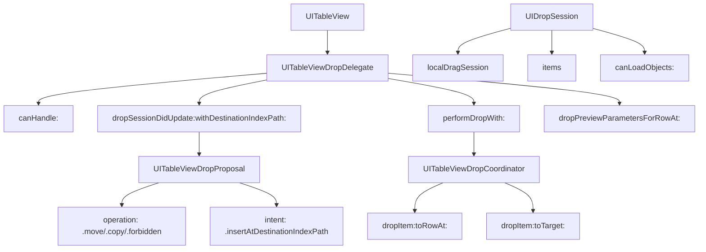

#UITableViewDropDelegate #UIKit #iOS #Swift #UITableView #DragAndDrop #iPad #NSItemProvider #UIDragItem #DropInteraction

---
**(делегат приёма перетаскивания для таблицы / управление Drop в [[UITableView]])**

`UITableViewDropDelegate` — это протокол из фреймворка **[[UIKit]]**, который позволяет **принимать и обрабатывать данные, перетаскиваемые в `UITableView`**. Он работает в паре с `UITableViewDragDelegate`, обеспечивая полный цикл Drag & Drop: от источника до цели. 

**Ключевые особенности (важно в 2026):**
- Появился в **[[iOS]] 11.0+** вместе с фреймворком Drag & Drop на iPad
- Обрабатывает как **внутренние** (в пределах приложения), так и **внешние** (из других приложений) перетаскивания
- Позволяет **анимировать** вставку, перемещение и удаление строк
- Поддерживает **разные операции**: `.move` (перемещение), `.copy` (копирование), `.forbidden` (запрет)
- Предоставляет **координатор** (`UITableViewDropCoordinator`) для управления анимацией

---

### Основные методы UITableViewDropDelegate

| Метод | Назначение | Обязательный |
|-------|------------|--------------|
| `tableView(_:canHandle:)` | Проверка, может ли таблица обработать данные | ❌ Нет (по умолчанию `true`) |
| `tableView(_:dropSessionDidUpdate:withDestinationIndexPath:)` | Определение операции и поведения при падении | ✅ Да |
| `tableView(_:performDropWith:)` | Выполнение операции падения (вставка/перемещение) | ✅ Да |
| `tableView(_:dropSessionDidEnter:)` | Уведомление о входе в зону таблицы | ❌ Нет |
| `tableView(_:dropSessionDidExit:)` | Уведомление о выходе из зоны таблицы | ❌ Нет |
| `tableView(_:dropSessionDidEnd:)` | Уведомление о завершении сессии падения | ❌ Нет |
| `tableView(_:dropPreviewParametersForRowAt:)` | Настройка превью для вставляемой строки | ❌ Нет |

---

### Схема взаимосвязей



---

### Примеры (от простого к сложному)

#### 1. Базовый приём данных (перемещение внутри таблицы)
```swift
import UIKit

class BasicDropTableViewController: UIViewController,
                                    UITableViewDataSource,
                                    UITableViewDelegate,
                                    UITableViewDragDelegate,
                                    UITableViewDropDelegate {
    
    private var tableView: UITableView!
    private var items = ["A", "B", "C", "D", "E"]
    
    override func viewDidLoad() {
        super.viewDidLoad()
        setupTableView()
    }
    
    private func setupTableView() {
        tableView = UITableView(frame: view.bounds, style: .plain)
        tableView.dataSource = self
        tableView.delegate = self
        tableView.register(UITableViewCell.self, forCellReuseIdentifier: "Cell")
        tableView.dragDelegate = self
        tableView.dropDelegate = self
        tableView.dragInteractionEnabled = true
        view.addSubview(tableView)
    }
    
    // MARK: - UITableViewDataSource
    
    func tableView(_ tableView: UITableView, numberOfRowsInSection section: Int) -> Int {
        return items.count
    }
    
    func tableView(_ tableView: UITableView, cellForRowAt indexPath: IndexPath) -> UITableViewCell {
        let cell = tableView.dequeueReusableCell(withIdentifier: "Cell", for: indexPath)
        cell.textLabel?.text = items[indexPath.row]
        cell.textLabel?.font = .systemFont(ofSize: 20, weight: .medium)
        cell.backgroundColor = .systemBlue.withAlphaComponent(0.1)
        return cell
    }
    
    // MARK: - UITableViewDragDelegate
    
    func tableView(_ tableView: UITableView,
                   itemsForBeginning session: UIDragSession,
                   at indexPath: IndexPath) -> [UIDragItem] {
        let item = items[indexPath.row]
        let itemProvider = NSItemProvider(object: item as NSString)
        let dragItem = UIDragItem(itemProvider: itemProvider)
        dragItem.localObject = indexPath
        return [dragItem]
    }
    
    // MARK: - UITableViewDropDelegate
    
    func tableView(_ tableView: UITableView,
                   canHandle session: UIDropSession) -> Bool {
        // 1. Проверяем, можем ли мы обработать данные
        return session.canLoadObjects(ofClass: NSString.self)
    }
    
    func tableView(_ tableView: UITableView,
                   dropSessionDidUpdate session: UIDropSession,
                   withDestinationIndexPath destinationIndexPath: IndexPath?) -> UITableViewDropProposal {
        // 2. Определяем операцию
        if session.localDragSession != nil {
            // Внутреннее перетаскивание → перемещение
            return UITableViewDropProposal(operation: .move, intent: .insertAtDestinationIndexPath)
        } else {
            // Внешнее перетаскивание → копирование
            return UITableViewDropProposal(operation: .copy, intent: .insertAtDestinationIndexPath)
        }
    }
    
    func tableView(_ tableView: UITableView,
                   performDropWith coordinator: UITableViewDropCoordinator) {
        // 3. Выполняем операцию падения
        let destinationIndexPath = coordinator.destinationIndexPath ?? IndexPath(row: items.count, section: 0)
        
        for item in coordinator.items {
            if let sourceIndexPath = item.sourceIndexPath {
                // Внутреннее перемещение
                tableView.performBatchUpdates {
                    let movedItem = items.remove(at: sourceIndexPath.row)
                    items.insert(movedItem, at: destinationIndexPath.row)
                    
                    tableView.deleteRows(at: [sourceIndexPath], with: .automatic)
                    tableView.insertRows(at: [destinationIndexPath], with: .automatic)
                }
                
                // Анимация завершения
                coordinator.drop(item.dragItem, toRowAt: destinationIndexPath)
            } else {
                // Внешнее копирование
                let destinationRow = destinationIndexPath.row
                item.dragItem.itemProvider.loadObject(ofClass: NSString.self) { [weak self] (object, error) in
                    guard let self = self,
                          let text = object as? String else { return }
                    
                    DispatchQueue.main.async {
                        tableView.performBatchUpdates {
                            self.items.insert(text, at: destinationRow)
                            tableView.insertRows(at: [IndexPath(row: destinationRow, section: 0)], with: .automatic)
                        }
                    }
                }
            }
        }
    }
}
```

#### 2. Поддержка разных операций (Move, Copy, Forbidden)
```swift
class OperationDropTableViewController: UIViewController,
                                       UITableViewDataSource,
                                       UITableViewDelegate,
                                       UITableViewDragDelegate,
                                       UITableViewDropDelegate {
    
    private var tableView: UITableView!
    private var items = ["📱 iPhone", "💻 MacBook", "⌚️ Apple Watch", "🎧 AirPods", "📷 Camera"]
    private var isDropAllowed = true
    
    override func viewDidLoad() {
        super.viewDidLoad()
        setupTableView()
        setupToggleButton()
    }
    
    private func setupTableView() {
        tableView = UITableView(frame: view.bounds, style: .plain)
        tableView.dataSource = self
        tableView.delegate = self
        tableView.register(UITableViewCell.self, forCellReuseIdentifier: "Cell")
        tableView.dragDelegate = self
        tableView.dropDelegate = self
        tableView.dragInteractionEnabled = true
        view.addSubview(tableView)
    }
    
    private func setupToggleButton() {
        let button = UIButton(type: .system)
        button.setTitle("Toggle Drop", for: .normal)
        button.addTarget(self, action: #selector(toggleDrop), for: .touchUpInside)
        button.frame = CGRect(x: view.bounds.width - 150, y: 40, width: 120, height: 40)
        view.addSubview(button)
    }
    
    @objc private func toggleDrop() {
        isDropAllowed.toggle()
        print("Drop разрешён: \(isDropAllowed)")
    }
    
    // MARK: - UITableViewDataSource
    
    func tableView(_ tableView: UITableView, numberOfRowsInSection section: Int) -> Int {
        return items.count
    }
    
    func tableView(_ tableView: UITableView, cellForRowAt indexPath: IndexPath) -> UITableViewCell {
        let cell = tableView.dequeueReusableCell(withIdentifier: "Cell", for: indexPath)
        cell.textLabel?.text = items[indexPath.row]
        cell.textLabel?.font = .systemFont(ofSize: 18)
        return cell
    }
    
    // MARK: - UITableViewDragDelegate
    
    func tableView(_ tableView: UITableView,
                   itemsForBeginning session: UIDragSession,
                   at indexPath: IndexPath) -> [UIDragItem] {
        let item = items[indexPath.row]
        let itemProvider = NSItemProvider(object: item as NSString)
        let dragItem = UIDragItem(itemProvider: itemProvider)
        dragItem.localObject = indexPath
        return [dragItem]
    }
    
    // MARK: - UITableViewDropDelegate
    
    func tableView(_ tableView: UITableView,
                   canHandle session: UIDropSession) -> Bool {
        return session.canLoadObjects(ofClass: NSString.self) && isDropAllowed
    }
    
    func tableView(_ tableView: UITableView,
                   dropSessionDidUpdate session: UIDropSession,
                   withDestinationIndexPath destinationIndexPath: IndexPath?) -> UITableViewDropProposal {
        // 1. Проверяем, разрешён ли Drop
        guard isDropAllowed else {
            return UITableViewDropProposal(operation: .forbidden)
        }
        
        // 2. Определяем операцию на основе источника
        if session.localDragSession != nil {
            // Внутреннее перетаскивание → перемещение
            return UITableViewDropProposal(operation: .move, intent: .insertAtDestinationIndexPath)
        } else {
            // Внешнее перетаскивание → копирование
            return UITableViewDropProposal(operation: .copy, intent: .insertAtDestinationIndexPath)
        }
    }
    
    func tableView(_ tableView: UITableView,
                   performDropWith coordinator: UITableViewDropCoordinator) {
        let destinationIndexPath = coordinator.destinationIndexPath ?? IndexPath(row: items.count, section: 0)
        
        for item in coordinator.items {
            if let sourceIndexPath = item.sourceIndexPath {
                // 3. Перемещение
                tableView.performBatchUpdates {
                    let movedItem = items.remove(at: sourceIndexPath.row)
                    items.insert(movedItem, at: destinationIndexPath.row)
                    
                    tableView.deleteRows(at: [sourceIndexPath], with: .automatic)
                    tableView.insertRows(at: [destinationIndexPath], with: .automatic)
                }
                coordinator.drop(item.dragItem, toRowAt: destinationIndexPath)
            } else {
                // 4. Копирование извне
                item.dragItem.itemProvider.loadObject(ofClass: NSString.self) { [weak self] (object, error) in
                    guard let self = self,
                          let text = object as? String else { return }
                    
                    DispatchQueue.main.async {
                        tableView.performBatchUpdates {
                            self.items.insert(text, at: destinationIndexPath.row)
                            tableView.insertRows(at: [destinationIndexPath], with: .automatic)
                        }
                    }
                }
            }
        }
    }
}
```

#### 3. Кастомизация превью при падении
```swift
class CustomPreviewDropTableViewController: UIViewController,
                                            UITableViewDataSource,
                                            UITableViewDelegate,
                                            UITableViewDragDelegate,
                                            UITableViewDropDelegate {
    
    private var tableView: UITableView!
    private var items = ["🍎 Apple", "🍌 Banana", "🍒 Cherry", "🍇 Grape", "🍊 Orange"]
    
    override func viewDidLoad() {
        super.viewDidLoad()
        setupTableView()
    }
    
    private func setupTableView() {
        tableView = UITableView(frame: view.bounds, style: .plain)
        tableView.dataSource = self
        tableView.delegate = self
        tableView.register(UITableViewCell.self, forCellReuseIdentifier: "Cell")
        tableView.dragDelegate = self
        tableView.dropDelegate = self
        tableView.dragInteractionEnabled = true
        view.addSubview(tableView)
    }
    
    // MARK: - UITableViewDataSource
    
    func tableView(_ tableView: UITableView, numberOfRowsInSection section: Int) -> Int {
        return items.count
    }
    
    func tableView(_ tableView: UITableView, cellForRowAt indexPath: IndexPath) -> UITableViewCell {
        let cell = tableView.dequeueReusableCell(withIdentifier: "Cell", for: indexPath)
        cell.textLabel?.text = items[indexPath.row]
        cell.textLabel?.font = .systemFont(ofSize: 18)
        cell.backgroundColor = .systemGreen.withAlphaComponent(0.1)
        return cell
    }
    
    // MARK: - UITableViewDragDelegate
    
    func tableView(_ tableView: UITableView,
                   itemsForBeginning session: UIDragSession,
                   at indexPath: IndexPath) -> [UIDragItem] {
        let item = items[indexPath.row]
        let itemProvider = NSItemProvider(object: item as NSString)
        let dragItem = UIDragItem(itemProvider: itemProvider)
        dragItem.localObject = indexPath
        return [dragItem]
    }
    
    // MARK: - UITableViewDropDelegate
    
    func tableView(_ tableView: UITableView,
                   dropSessionDidUpdate session: UIDropSession,
                   withDestinationIndexPath destinationIndexPath: IndexPath?) -> UITableViewDropProposal {
        return UITableViewDropProposal(operation: .move, intent: .insertAtDestinationIndexPath)
    }
    
    func tableView(_ tableView: UITableView,
                   performDropWith coordinator: UITableViewDropCoordinator) {
        let destinationIndexPath = coordinator.destinationIndexPath ?? IndexPath(row: items.count, section: 0)
        
        for item in coordinator.items {
            if let sourceIndexPath = item.sourceIndexPath {
                tableView.performBatchUpdates {
                    let movedItem = items.remove(at: sourceIndexPath.row)
                    items.insert(movedItem, at: destinationIndexPath.row)
                    
                    tableView.deleteRows(at: [sourceIndexPath], with: .automatic)
                    tableView.insertRows(at: [destinationIndexPath], with: .automatic)
                }
                
                // 1. Кастомная анимация падения
                coordinator.drop(item.dragItem, toRowAt: destinationIndexPath)
            }
        }
    }
    
    func tableView(_ tableView: UITableView,
                   dropPreviewParametersForRowAt indexPath: IndexPath) -> UIDragPreviewParameters? {
        // 2. Настраиваем параметры превью для падения
        let parameters = UIDragPreviewParameters()
        
        // Скругление для превью
        let cell = tableView.cellForRow(at: indexPath)
        let rect = cell?.bounds ?? CGRect(x: 0, y: 0, width: tableView.bounds.width, height: 44)
        parameters.visiblePath = UIBezierPath(roundedRect: rect, cornerRadius: 12)
        
        return parameters
    }
}
```

#### 4. Работа с внешними данными (из других приложений)
```swift
class ExternalDropTableViewController: UIViewController,
                                      UITableViewDataSource,
                                      UITableViewDelegate,
                                      UITableViewDropDelegate {
    
    private var tableView: UITableView!
    private var items: [String] = []
    
    override func viewDidLoad() {
        super.viewDidLoad()
        setupTableView()
        setupInstructions()
    }
    
    private func setupTableView() {
        tableView = UITableView(frame: view.bounds, style: .plain)
        tableView.dataSource = self
        tableView.delegate = self
        tableView.register(UITableViewCell.self, forCellReuseIdentifier: "Cell")
        tableView.dropDelegate = self
        tableView.dragInteractionEnabled = true
        view.addSubview(tableView)
    }
    
    private func setupInstructions() {
        let label = UILabel()
        label.text = "Перетащите текст или изображения из других приложений"
        label.textAlignment = .center
        label.numberOfLines = 0
        label.font = .systemFont(ofSize: 16)
        label.textColor = .systemGray
        label.frame = CGRect(x: 20, y: 50, width: view.bounds.width - 40, height: 60)
        view.addSubview(label)
    }
    
    // MARK: - UITableViewDataSource
    
    func tableView(_ tableView: UITableView, numberOfRowsInSection section: Int) -> Int {
        return items.count
    }
    
    func tableView(_ tableView: UITableView, cellForRowAt indexPath: IndexPath) -> UITableViewCell {
        let cell = tableView.dequeueReusableCell(withIdentifier: "Cell", for: indexPath)
        cell.textLabel?.text = items[indexPath.row]
        cell.backgroundColor = .systemBlue.withAlphaComponent(0.1)
        return cell
    }
    
    // MARK: - UITableViewDropDelegate
    
    func tableView(_ tableView: UITableView,
                   canHandle session: UIDropSession) -> Bool {
        // 1. Проверяем, можно ли обработать данные
        return session.canLoadObjects(ofClass: NSString.self) ||
               session.canLoadObjects(ofClass: UIImage.self) ||
               session.canLoadObjects(ofClass: URL.self)
    }
    
    func tableView(_ tableView: UITableView,
                   dropSessionDidUpdate session: UIDropSession,
                   withDestinationIndexPath destinationIndexPath: IndexPath?) -> UITableViewDropProposal {
        // 2. Разрешаем копирование извне
        return UITableViewDropProposal(operation: .copy, intent: .insertAtDestinationIndexPath)
    }
    
    func tableView(_ tableView: UITableView,
                   performDropWith coordinator: UITableViewDropCoordinator) {
        let destinationIndexPath = coordinator.destinationIndexPath ?? IndexPath(row: items.count, section: 0)
        
        for item in coordinator.items {
            // 3. Проверяем, можно ли загрузить текст
            if item.dragItem.itemProvider.canLoadObject(ofClass: NSString.self) {
                item.dragItem.itemProvider.loadObject(ofClass: NSString.self) { [weak self] (object, error) in
                    guard let self = self,
                          let text = object as? String else { return }
                    
                    DispatchQueue.main.async {
                        tableView.performBatchUpdates {
                            self.items.insert(text, at: destinationIndexPath.row)
                            tableView.insertRows(at: [destinationIndexPath], with: .automatic)
                        }
                    }
                }
            }
            
            // 4. Проверяем, можно ли загрузить URL
            if item.dragItem.itemProvider.canLoadObject(ofClass: URL.self) {
                item.dragItem.itemProvider.loadObject(ofClass: URL.self) { [weak self] (object, error) in
                    guard let self = self,
                          let url = object as? URL else { return }
                    
                    DispatchQueue.main.async {
                        tableView.performBatchUpdates {
                            self.items.insert("🔗 \(url.absoluteString)", at: destinationIndexPath.row)
                            tableView.insertRows(at: [destinationIndexPath], with: .automatic)
                        }
                    }
                }
            }
            
            // 5. Проверяем, можно ли загрузить изображение
            if item.dragItem.itemProvider.canLoadObject(ofClass: UIImage.self) {
                item.dragItem.itemProvider.loadObject(ofClass: UIImage.self) { [weak self] (object, error) in
                    guard let self = self,
                          let image = object as? UIImage else { return }
                    
                    DispatchQueue.main.async {
                        // Сохраняем изображение как файл и добавляем в таблицу
                        let imageName = "image_\(Date().timeIntervalSince1970).png"
                        if let data = image.pngData() {
                            let documentsURL = FileManager.default.urls(for: .documentDirectory, in: .userDomainMask).first!
                            let fileURL = documentsURL.appendingPathComponent(imageName)
                            try? data.write(to: fileURL)
                            
                            tableView.performBatchUpdates {
                                self.items.insert("📷 \(imageName)", at: destinationIndexPath.row)
                                tableView.insertRows(at: [destinationIndexPath], with: .automatic)
                            }
                        }
                    }
                }
            }
        }
    }
}
```

#### 5. Перетаскивание между секциями
```swift
class SectionDropTableViewController: UIViewController,
                                     UITableViewDataSource,
                                     UITableViewDelegate,
                                     UITableViewDragDelegate,
                                     UITableViewDropDelegate {
    
    private var tableView: UITableView!
    private var sections: [[String]] = [
        ["A1", "A2", "A3"],
        ["B1", "B2", "B3"],
        ["C1", "C2", "C3"]
    ]
    
    override func viewDidLoad() {
        super.viewDidLoad()
        setupTableView()
    }
    
    private func setupTableView() {
        tableView = UITableView(frame: view.bounds, style: .grouped)
        tableView.dataSource = self
        tableView.delegate = self
        tableView.register(UITableViewCell.self, forCellReuseIdentifier: "Cell")
        tableView.dragDelegate = self
        tableView.dropDelegate = self
        tableView.dragInteractionEnabled = true
        view.addSubview(tableView)
    }
    
    // MARK: - UITableViewDataSource
    
    func numberOfSections(in tableView: UITableView) -> Int {
        return sections.count
    }
    
    func tableView(_ tableView: UITableView, numberOfRowsInSection section: Int) -> Int {
        return sections[section].count
    }
    
    func tableView(_ tableView: UITableView, cellForRowAt indexPath: IndexPath) -> UITableViewCell {
        let cell = tableView.dequeueReusableCell(withIdentifier: "Cell", for: indexPath)
        cell.textLabel?.text = sections[indexPath.section][indexPath.row]
        cell.backgroundColor = sectionColor(for: indexPath.section)
        return cell
    }
    
    func tableView(_ tableView: UITableView, titleForHeaderInSection section: Int) -> String? {
        return ["Секция 1", "Секция 2", "Секция 3"][section]
    }
    
    private func sectionColor(for section: Int) -> UIColor {
        let colors: [UIColor] = [
            .systemRed.withAlphaComponent(0.1),
            .systemBlue.withAlphaComponent(0.1),
            .systemGreen.withAlphaComponent(0.1)
        ]
        return colors[section % colors.count]
    }
    
    // MARK: - UITableViewDragDelegate
    
    func tableView(_ tableView: UITableView,
                   itemsForBeginning session: UIDragSession,
                   at indexPath: IndexPath) -> [UIDragItem] {
        let item = sections[indexPath.section][indexPath.row]
        let itemProvider = NSItemProvider(object: item as NSString)
        let dragItem = UIDragItem(itemProvider: itemProvider)
        dragItem.localObject = indexPath
        return [dragItem]
    }
    
    // MARK: - UITableViewDropDelegate
    
    func tableView(_ tableView: UITableView,
                   dropSessionDidUpdate session: UIDropSession,
                   withDestinationIndexPath destinationIndexPath: IndexPath?) -> UITableViewDropProposal {
        return UITableViewDropProposal(operation: .move, intent: .insertAtDestinationIndexPath)
    }
    
    func tableView(_ tableView: UITableView,
                   performDropWith coordinator: UITableViewDropCoordinator) {
        guard let destinationIndexPath = coordinator.destinationIndexPath else { return }
        
        for item in coordinator.items {
            guard let sourceIndexPath = item.sourceIndexPath else { continue }
            
            tableView.performBatchUpdates {
                // 1. Получаем перемещаемый элемент
                let movedItem = sections[sourceIndexPath.section].remove(at: sourceIndexPath.row)
                
                // 2. Вставляем в секцию назначения
                sections[destinationIndexPath.section].insert(movedItem, at: destinationIndexPath.row)
                
                // 3. Обновляем таблицу
                tableView.deleteRows(at: [sourceIndexPath], with: .automatic)
                tableView.insertRows(at: [destinationIndexPath], with: .automatic)
            }
            
            coordinator.drop(item.dragItem, toRowAt: destinationIndexPath)
        }
    }
}
```

#### 6. Полный пример с анимацией и обратной связью
```swift
class FullDragDropTableViewController: UIViewController,
                                       UITableViewDataSource,
                                       UITableViewDelegate,
                                       UITableViewDragDelegate,
                                       UITableViewDropDelegate {
    
    private var tableView: UITableView!
    private var items = ["Элемент 1", "Элемент 2", "Элемент 3", "Элемент 4", "Элемент 5"]
    
    override func viewDidLoad() {
        super.viewDidLoad()
        setupTableView()
    }
    
    private func setupTableView() {
        tableView = UITableView(frame: view.bounds, style: .plain)
        tableView.dataSource = self
        tableView.delegate = self
        tableView.register(UITableViewCell.self, forCellReuseIdentifier: "Cell")
        tableView.dragDelegate = self
        tableView.dropDelegate = self
        tableView.dragInteractionEnabled = true
        view.addSubview(tableView)
    }
    
    // MARK: - UITableViewDataSource
    
    func tableView(_ tableView: UITableView, numberOfRowsInSection section: Int) -> Int {
        return items.count
    }
    
    func tableView(_ tableView: UITableView, cellForRowAt indexPath: IndexPath) -> UITableViewCell {
        let cell = tableView.dequeueReusableCell(withIdentifier: "Cell", for: indexPath)
        cell.textLabel?.text = items[indexPath.row]
        cell.backgroundColor = .systemBlue.withAlphaComponent(0.1)
        return cell
    }
    
    // MARK: - UITableViewDragDelegate
    
    func tableView(_ tableView: UITableView,
                   itemsForBeginning session: UIDragSession,
                   at indexPath: IndexPath) -> [UIDragItem] {
        let item = items[indexPath.row]
        let itemProvider = NSItemProvider(object: item as NSString)
        let dragItem = UIDragItem(itemProvider: itemProvider)
        dragItem.localObject = indexPath
        
        // 1. Визуальная обратная связь при начале перетаскивания
        UIView.animate(withDuration: 0.3) {
            if let cell = tableView.cellForRow(at: indexPath) {
                cell.transform = CGAffineTransform(scaleX: 0.95, y: 0.95)
                cell.backgroundColor = .systemYellow.withAlphaComponent(0.3)
            }
        }
        
        return [dragItem]
    }
    
    func tableView(_ tableView: UITableView,
                   dragSessionWillBegin session: UIDragSession) {
        print("🔄 Сессия перетаскивания началась")
    }
    
    func tableView(_ tableView: UITableView,
                   dragSessionDidEnd session: UIDragSession) {
        // 2. Восстанавливаем ячейки после завершения перетаскивания
        UIView.animate(withDuration: 0.3) {
            for visibleCell in tableView.visibleCells {
                visibleCell.transform = .identity
                visibleCell.backgroundColor = .systemBlue.withAlphaComponent(0.1)
            }
        }
        print("✅ Сессия перетаскивания завершена")
    }
    
    // MARK: - UITableViewDropDelegate
    
    func tableView(_ tableView: UITableView,
                   canHandle session: UIDropSession) -> Bool {
        return session.canLoadObjects(ofClass: NSString.self)
    }
    
    func tableView(_ tableView: UITableView,
                   dropSessionDidUpdate session: UIDropSession,
                   withDestinationIndexPath destinationIndexPath: IndexPath?) -> UITableViewDropProposal {
        // 3. Визуальная обратная связь при падении
        if let destinationIndexPath = destinationIndexPath,
           let cell = tableView.cellForRow(at: destinationIndexPath) {
            UIView.animate(withDuration: 0.2) {
                cell.backgroundColor = .systemGreen.withAlphaComponent(0.3)
            }
        }
        
        if session.localDragSession != nil {
            return UITableViewDropProposal(operation: .move, intent: .insertAtDestinationIndexPath)
        } else {
            return UITableViewDropProposal(operation: .copy, intent: .insertAtDestinationIndexPath)
        }
    }
    
    func tableView(_ tableView: UITableView,
                   dropSessionDidExit session: UIDropSession) {
        // 4. Убираем визуальную обратную связь при выходе
        for visibleCell in tableView.visibleCells {
            UIView.animate(withDuration: 0.2) {
                visibleCell.backgroundColor = .systemBlue.withAlphaComponent(0.1)
            }
        }
    }
    
    func tableView(_ tableView: UITableView,
                   performDropWith coordinator: UITableViewDropCoordinator) {
        let destinationIndexPath = coordinator.destinationIndexPath ?? IndexPath(row: items.count, section: 0)
        
        for item in coordinator.items {
            if let sourceIndexPath = item.sourceIndexPath {
                // 5. Перемещение с анимацией
                tableView.performBatchUpdates {
                    let movedItem = items.remove(at: sourceIndexPath.row)
                    items.insert(movedItem, at: destinationIndexPath.row)
                    
                    tableView.deleteRows(at: [sourceIndexPath], with: .automatic)
                    tableView.insertRows(at: [destinationIndexPath], with: .automatic)
                }
                
                coordinator.drop(item.dragItem, toRowAt: destinationIndexPath)
            } else {
                // 6. Копирование извне
                let destinationRow = destinationIndexPath.row
                item.dragItem.itemProvider.loadObject(ofClass: NSString.self) { [weak self] (object, error) in
                    guard let self = self,
                          let text = object as? String else { return }
                    
                    DispatchQueue.main.async {
                        tableView.performBatchUpdates {
                            self.items.insert(text, at: destinationRow)
                            tableView.insertRows(at: [IndexPath(row: destinationRow, section: 0)], with: .automatic)
                        }
                    }
                }
            }
        }
    }
}
```

---

### Важные нюансы 2026 года

> [!warning]
> **`canHandle` должен быть быстрым:** Этот метод вызывается часто. Не выполняйте тяжёлых операций внутри него.
> 
> **`performDropWith` должен быть идемпотентным:** Может быть вызван несколько раз. Убедитесь, что ваш код корректно обрабатывает повторные вызовы.
> 
> **Координатор обеспечивает анимацию:** Всегда используйте методы `coordinator.drop(...)` для анимации падения элементов.
> 
> **Внешние данные загружаются асинхронно:** Используйте `loadObject(ofClass:)` с completion-блоком для загрузки данных из других приложений.
> 
> **Операции:** `.move` удаляет данные из источника, `.copy` оставляет их нетронутыми.

---

### Лучшие практики 2026

1. **Всегда реализуйте `dropSessionDidUpdate`** — определяет, что произойдёт при падении.
2. **Используйте `localObject`** для быстрого доступа к данным при внутреннем перетаскивании.
3. **Для внешних данных** всегда используйте асинхронную загрузку через `NSItemProvider`.
4. **Обновляйте модель данных** до обновления UI в `performBatchUpdates`.
5. **Используйте `coordinator.drop`** для анимации падения.
6. **Обрабатывайте ошибки** при загрузке внешних данных.
7. **Добавляйте визуальную обратную связь** для улучшения пользовательского опыта.

---

### Связь с другими темами

- [[UITableViewDragDelegate]] — источник данных
- [[UIDragItem]] — элемент перетаскивания
- [[UITableView]] — таблица
- [[UICollectionViewDropDelegate]] — аналог для коллекций