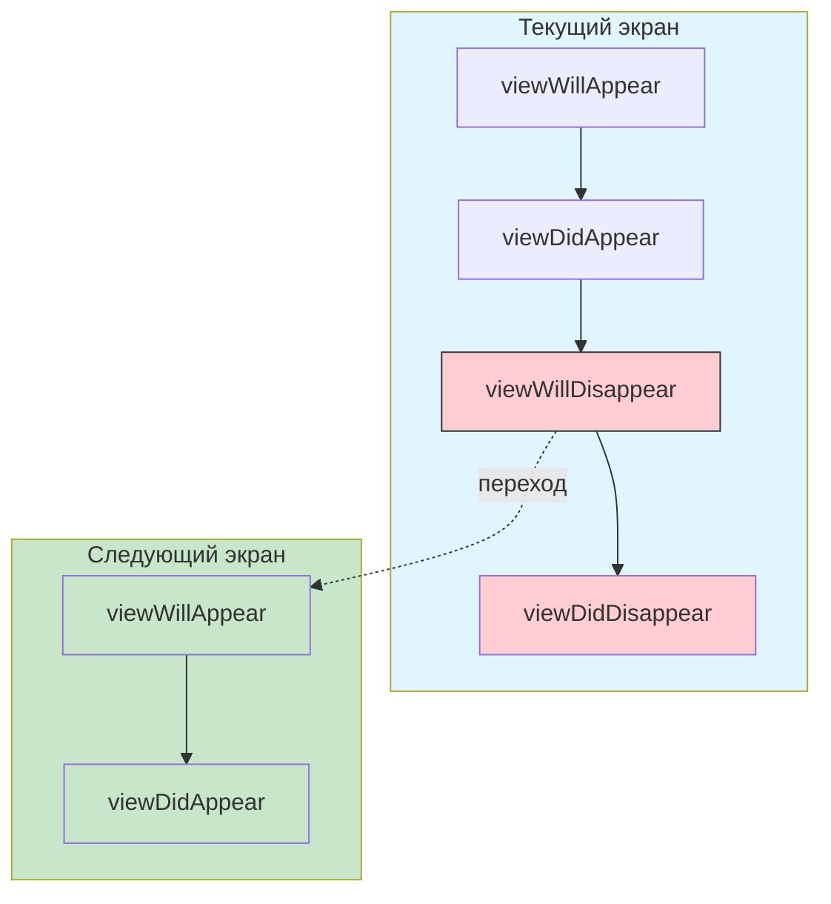

**viewWillDisappear(_:)** — это один из ключевых методов **жизненного цикла** [[UIViewController]] в [[UIKit]].

Он вызывается **каждый раз**, когда контроллер представления **вот-вот перестанет быть видимым** на экране (перед анимацией ухода).

### Когда именно вызывается viewWillDisappear

| Событие / Действие                            | viewWillDisappear вызывается?        | Сколько раз за жизнь контроллера       | Примечание / важные детали                     |
| --------------------------------------------- | ------------------------------------ | -------------------------------------- | ---------------------------------------------- |
| Переход на другой экран (push / present)      | **Да**                               | Каждый раз при уходе                   | Перед анимацией ухода                          |
| Возврат назад (pop / dismiss)                 | **Да** (на уходящем контроллере)     | Каждый раз при уходе                   | На том контроллере, который покидает экран     |
| Переключение вкладки в [[UITabBarController]] | **Да** (на скрываемой вкладке)       | При каждом переключении вкладки        | Перед скрытием вкладки                         |
| Показ модального контроллера сверху           | **Да** (на нижнем контроллере)       | Каждый раз при показе модального       | Перед тем, как модальный экран закроет текущий |
| Приложение уходит в фон (background)          | **Да** (если контроллер был видимым) | Каждый раз при сворачивании приложения | [[UIApplication]].willResignActiveNotification |
| Контроллер удалён как child                   | **Да**                               | При удалении из иерархии               | После removeFromParent()                       |
| Поворот экрана / изменение размеров           | **Нет** (если не был скрыт)          | —                                      | Обычно viewWillTransition(to:with:)            |

### Порядок вызовов (самая частая последовательность)



### Что обычно делают в viewWillDisappear в 2026 году

| Действие                                                  | Почему именно здесь (а не в [[viewDidDisappear]])                    | Пример кода (современный стиль)                     |
| --------------------------------------------------------- | -------------------------------------------------------------------- | --------------------------------------------------- |
| **Отписка от уведомлений** ([[NotificationCenter]])       | Экран ещё виден → можно безопасно отреагировать на последнее событие | `NotificationCenter.default.removeObserver(self)`   |
| **Остановка анимаций / таймеров / наблюдателей**          | Перед уходом → чтобы не тратить ресурсы на невидимый экран           | `timer?.invalidate()` / `displayLink?.invalidate()` |
| **Пауза воспроизведения** ([[AVPlayer]], аудио, видео)    | Чтобы не играть звук/видео после ухода экрана                        | `player?.pause()`                                   |
| **Сохранение состояния** (scroll position, text input)    | Последний шанс сохранить перед уходом                                | `saveScrollPosition()` / `saveDraftText()`          |
| **Аналитика** (screen exit start)                         | Точное время начала ухода с экрана                                   | `Analytics.trackScreenExitStart("Profile")`         |
| **Очистка временных ресурсов** (большие изображения, кэш) | Экран уходит → можно начать освобождать память                       | `imageCache.removeExpired()`                        |
| **Остановка сетевых запросов / cancel tasks**             | Чтобы не тратить трафик/батарею на невидимый экран                   | `task?.cancel()` / `cancellable?.cancel()`          |

### Самый современный паттерн 2026 ([[@MainActor]] + [[async]]/[[await]])

```swift
@MainActor
class ProfileViewController: UIViewController {
    
    private var observationToken: Any?
    private var timer: Timer?
    private var player: AVPlayer?
    private var dataTask: URLSessionDataTask?
    
    override func viewDidLoad() {
        super.viewDidLoad()
        
        // Подписка на уведомление (пример)
        observationToken = NotificationCenter.default.addObserver(
            forName: .userDidUpdateProfile,
            object: nil,
            queue: .main
        ) { [weak self] _ in
            self?.refreshProfile()
        }
        
        timer = Timer.scheduledTimer(withTimeInterval: 5.0, repeats: true) { _ in
            print("Таймер тикает")
        }
        
        player = AVPlayer(url: videoURL)
        player?.play()
    }
    
    override func viewWillDisappear(_ animated: Bool) {
        super.viewWillDisappear(animated)
        
        // 1. Отписка от уведомлений (пока экран ещё виден)
        if let token = observationToken {
            NotificationCenter.default.removeObserver(token)
            observationToken = nil
        }
        
        // 2. Остановка таймера
        timer?.invalidate()
        timer = nil
        
        // 3. Пауза плеера
        player?.pause()
        player = nil
        
        // 4. Отмена сетевых задач
        dataTask?.cancel()
        dataTask = nil
        
        // 5. Сохранение состояния перед уходом
        saveCurrentScrollPosition()
        
        // 6. Аналитика ухода с экрана
        Analytics.trackScreenExit("Profile")
    }
    
    private func refreshProfile() {
        // обновление UI
    }
    
    private func saveCurrentScrollPosition() {
        // сохранение scrollView.contentOffset в UserDefaults или ViewModel
    }
}
```

### Лучшие практики viewWillDisappear в Swift 2026

- **Всегда вызывай super.viewWillDisappear(animated)** — в начале метода  
- **Отписывайся от всего**, что подписался в [[viewWillAppear]] / [[viewDidAppear]]  
- **Останавливай ресурсоёмкие процессы** (таймеры, плееры, анимации, запросы)  
- **Сохраняй состояние** — последний шанс перед уходом экрана  
- **@MainActor** — весь контроллер или метод — на главном акторе  
- **Swift 6 strict concurrency** — все UI-операции и отписки — в `@MainActor`  
- **Не делай тяжёлую работу** — это не место для сетевых запросов или сложных вычислений  
- **Документируйте** — пиши комментарий «viewWillDisappear — отписка, пауза ресурсов и сохранение состояния перед уходом экрана»

**Короткий девиз 2026**:
> «viewWillDisappear — это когда экран **вот-вот исчезнет**, и пора срочно убрать за собой: отписаться от уведомлений, остановить таймеры/плееры/запросы, сохранить состояние и трекнуть уход.  
> Делай здесь всё, что должно происходить **при каждом** уходе экрана, пока он ещё виден пользователю.  
> Всегда вызывай super в начале и не блокируй UI тяжёлыми операциями.»
