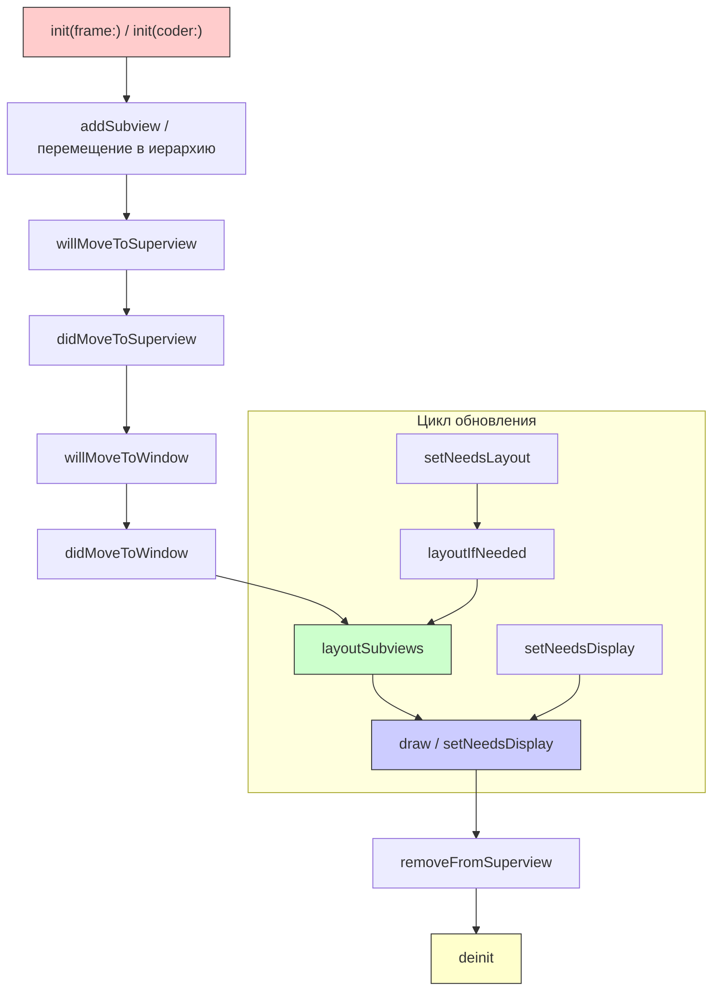
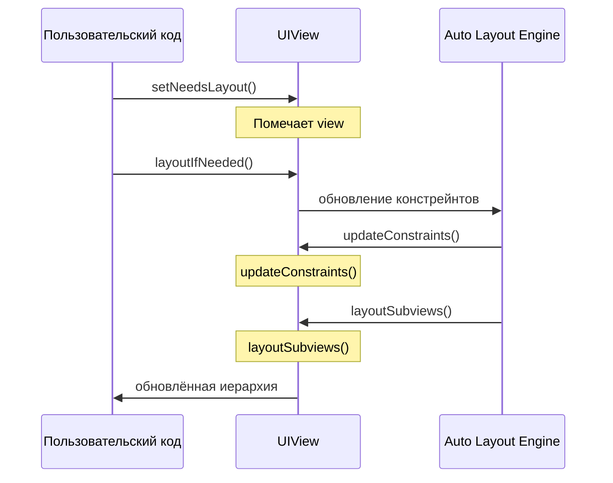

#uikit #uiview #ios #lifecycle #layout #drawing

---

### Определение

**Жизненный цикл UIView** — это последовательность событий, через которые проходит любой экземпляр `UIView` от момента его создания до момента уничтожения. Понимание этого цикла критически важно для правильной настройки интерфейса, оптимизации производительности и предотвращения распространённых ошибок, связанных с размерами и отрисовкой элементов.

В отличие от `UIViewController`, у `UIView` нет такого же набора методов, как `viewDidLoad` или `viewWillAppear`. Его жизненный цикл сосредоточен вокруг фаз **инициализации**, **верстки (layout)**, **отрисовки (drawing)** и **удаления**.



---

### Основные этапы жизненного цикла

| Этап | Методы | Что происходит |
|---|---|---|
| **Создание** | `init(frame:)`, `init(coder:)` | Выделение памяти, начальная настройка |
| **Добавление в иерархию** | `willMove(toSuperview:)`, `didMoveToSuperview()` | Привязка к родительскому вью |
| **Привязка к окну** | `willMove(toWindow:)`, `didMoveToWindow()` | Вью становится видимым |
| **Вёрстка** | `layoutSubviews()`, `setNeedsLayout()`, `layoutIfNeeded()` | Определение позиций и размеров дочерних вью |
| **Отрисовка** | `draw(_:)`, `setNeedsDisplay()` | Отображение содержимого |
| **Удаление** | `willMove(toSuperview:)` (с nil), `removeFromSuperview()` | Освобождение памяти |

---

## 1. Создание (Initialization)

Вью может быть создан двумя способами: программно или из Storyboard/XIB.

### 1.1. Программное создание

```swift
class CustomView: UIView {
    
    override init(frame: CGRect) {
        super.init(frame: frame)
        setup()
    }
    
    required init?(coder: NSCoder) {
        super.init(coder: coder)
        setup()
    }
    
    private func setup() {
        // Настройка внешнего вида и добавление сабвью
        backgroundColor = .white
        setupSubviews()
    }
    
    private func setupSubviews() {
        let label = UILabel()
        label.text = "Hello"
        addSubview(label)
    }
}

// Использование
let view = CustomView(frame: CGRect(x: 0, y: 0, width: 200, height: 100))
```

### 1.2. Особенности при использовании XIB/Storyboard

```swift
class StoryboardView: UIView {
    
    @IBOutlet weak var titleLabel: UILabel!
    
    override func awakeFromNib() {
        super.awakeFromNib()
        // Здесь все IBOutlet уже подключены
        // Это аналог viewDidLoad для UIView
        setup()
    }
    
    private func setup() {
        titleLabel.textColor = .blue
    }
}
```

---

## 2. Добавление в иерархию (Adding to Hierarchy)

Когда вью добавляется в качестве дочернего элемента, вызываются методы уведомления о перемещении.

### 2.1. Методы перемещения

```swift
class TrackingView: UIView {
    
    override func willMove(toSuperview newSuperview: UIView?) {
        super.willMove(toSuperview: newSuperview)
        print("willMove to superview: \(String(describing: newSuperview))")
        // В этот момент view еще не добавлен в иерархию
        // newSuperview == nil — view будет удалён
    }
    
    override func didMoveToSuperview() {
        super.didMoveToSuperview()
        print("didMove to superview: \(String(describing: superview))")
        // Здесь view уже добавлен, можно безопасно обращаться к superview
        if superview != nil {
            // Вью добавлен в иерархию
            setupConstraints()
        }
    }
    
    override func willMove(toWindow newWindow: UIWindow?) {
        super.willMove(toWindow: newWindow)
        print("willMove to window: \(String(describing: newWindow))")
    }
    
    override func didMoveToWindow() {
        super.didMoveToWindow()
        print("didMove to window: \(String(describing: window))")
        if window != nil {
            // Вью стал видимым (добавлен в окно приложения)
            startAnimations()
        } else {
            // Вью стал невидимым (удалён из окна)
            stopAnimations()
        }
    }
}
```

### 2.2. Практический пример

```swift
class AnimatedButton: UIButton {
    
    private var animator: UIViewPropertyAnimator?
    
    override func didMoveToWindow() {
        super.didMoveToWindow()
        
        if window != nil {
            // Вью видим — запускаем анимацию
            startBreathingAnimation()
        } else {
            // Вью скрыт — останавливаем анимацию (экономия ресурсов)
            stopBreathingAnimation()
        }
    }
    
    private func startBreathingAnimation() {
        animator = UIViewPropertyAnimator(duration: 1.0, curve: .easeInOut) {
            self.transform = CGAffineTransform(scaleX: 1.05, y: 1.05)
        }
        animator?.addCompletion { _ in
            UIView.animate(withDuration: 1.0) {
                self.transform = .identity
            } completion: { _ in
                self.startBreathingAnimation()
            }
        }
        animator?.startAnimation()
    }
    
    private func stopBreathingAnimation() {
        animator?.stopAnimation(true)
        animator = nil
        transform = .identity
    }
}
```

---

## 3. Вёрстка (Layout)

Это одна из самых важных фаз жизненного цикла. Она определяет, как и где будут расположены дочерние элементы.

### 3.1. Основные методы

| Метод | Вызов | Что делает |
|---|---|---|
| `layoutSubviews()` | Автоматически, когда нужно обновить вёрстку | Переопределить для ручного позиционирования субвью |
| `setNeedsLayout()` | Асинхронный | Помечает вью как "требующий обновления вёрстки" |
| `layoutIfNeeded()` | Синхронный | Немедленно обновляет вёрстку, если есть пометка |
| `setNeedsUpdateConstraints()` | Асинхронный | Помечает вью как "требующий обновления констрейнтов" |
| `updateConstraints()` | Автоматически | Переопределить для обновления констрейнтов |

### 3.2. Последовательность вызовов при обновлении вёрстки



### 3.3. Пример переопределения layoutSubviews

```swift
class CustomContainerView: UIView {
    
    let headerView = UIView()
    let contentView = UIView()
    let footerView = UIView()
    
    override init(frame: CGRect) {
        super.init(frame: frame)
        setupSubviews()
    }
    
    required init?(coder: NSCoder) {
        super.init(coder: coder)
        setupSubviews()
    }
    
    private func setupSubviews() {
        addSubview(headerView)
        addSubview(contentView)
        addSubview(footerView)
        
        headerView.backgroundColor = .red
        contentView.backgroundColor = .blue
        footerView.backgroundColor = .green
    }
    
    override func layoutSubviews() {
        super.layoutSubviews()  // ВСЕГДА вызывайте super!
        
        let headerHeight: CGFloat = 60
        let footerHeight: CGFloat = 50
        let contentHeight = bounds.height - headerHeight - footerHeight
        
        headerView.frame = CGRect(
            x: 0, y: 0,
            width: bounds.width,
            height: headerHeight
        )
        
        contentView.frame = CGRect(
            x: 0, y: headerHeight,
            width: bounds.width,
            height: contentHeight
        )
        
        footerView.frame = CGRect(
            x: 0, y: headerHeight + contentHeight,
            width: bounds.width,
            height: footerHeight
        )
    }
}
```

### 3.4. Использование Auto Layout с UIView

```swift
class AutoLayoutView: UIView {
    
    private let titleLabel = UILabel()
    private let descriptionLabel = UILabel()
    
    override init(frame: CGRect) {
        super.init(frame: frame)
        setupViews()
        setupConstraints()
    }
    
    required init?(coder: NSCoder) {
        super.init(coder: coder)
        setupViews()
        setupConstraints()
    }
    
    private func setupViews() {
        titleLabel.text = "Заголовок"
        descriptionLabel.text = "Описание"
        titleLabel.translatesAutoresizingMaskIntoConstraints = false
        descriptionLabel.translatesAutoresizingMaskIntoConstraints = false
        addSubview(titleLabel)
        addSubview(descriptionLabel)
    }
    
    private func setupConstraints() {
        NSLayoutConstraint.activate([
            titleLabel.topAnchor.constraint(equalTo: topAnchor, constant: 16),
            titleLabel.leadingAnchor.constraint(equalTo: leadingAnchor, constant: 16),
            titleLabel.trailingAnchor.constraint(equalTo: trailingAnchor, constant: -16),
            
            descriptionLabel.topAnchor.constraint(equalTo: titleLabel.bottomAnchor, constant: 8),
            descriptionLabel.leadingAnchor.constraint(equalTo: leadingAnchor, constant: 16),
            descriptionLabel.trailingAnchor.constraint(equalTo: trailingAnchor, constant: -16),
            descriptionLabel.bottomAnchor.constraint(lessThanOrEqualTo: bottomAnchor, constant: -16)
        ])
    }
}
```

### 3.5. Анимация изменения размера

```swift
class ExpandableView: UIView {
    
    private var heightConstraint: NSLayoutConstraint!
    private var isExpanded = false
    
    override init(frame: CGRect) {
        super.init(frame: frame)
        setupConstraints()
    }
    
    required init?(coder: NSCoder) {
        super.init(coder: coder)
        setupConstraints()
    }
    
    private func setupConstraints() {
        translatesAutoresizingMaskIntoConstraints = false
        heightConstraint = heightAnchor.constraint(equalToConstant: 100)
        heightConstraint.isActive = true
    }
    
    func toggleExpand() {
        isExpanded.toggle()
        
        let targetHeight: CGFloat = isExpanded ? 300 : 100
        
        // Анимация изменения размера
        UIView.animate(withDuration: 0.3) {
            self.heightConstraint.constant = targetHeight
            self.layoutIfNeeded()  // Немедленно применяем изменения для анимации
            self.superview?.layoutIfNeeded()
        }
    }
}
```

---

## 4. Отрисовка (Drawing)

Этот этап отвечает за визуальное содержимое вью.

### 4.1. Основные методы

| Метод | Вызов | Что делает |
|---|---|---|
| `draw(_:)` | Автоматически при первом отображении или после `setNeedsDisplay()` | Рисование содержимого (Core Graphics) |
| `setNeedsDisplay()` | Асинхронный | Помечает вью как "требующий перерисовки" |
| `setNeedsDisplay(_:)` | Асинхронный | Помечает конкретную область для перерисовки |
| `layer.setNeedsDisplay()` | Асинхронный | Перерисовка слоя (альтернатива) |

### 4.2. Пример переопределения draw

```swift
class GradientView: UIView {
    
    var startColor: UIColor = .red {
        didSet { setNeedsDisplay() }
    }
    
    var endColor: UIColor = .blue {
        didSet { setNeedsDisplay() }
    }
    
    override func draw(_ rect: CGRect) {
        guard let context = UIGraphicsGetCurrentContext() else { return }
        
        // Создаём градиент
        let colors = [startColor.cgColor, endColor.cgColor]
        let colorSpace = CGColorSpaceCreateDeviceRGB()
        let locations: [CGFloat] = [0.0, 1.0]
        
        guard let gradient = CGGradient(
            colorsSpace: colorSpace,
            colors: colors as CFArray,
            locations: locations
        ) else { return }
        
        // Рисуем градиент от верхнего левого к нижнему правому
        let startPoint = CGPoint(x: 0, y: 0)
        let endPoint = CGPoint(x: bounds.width, y: bounds.height)
        
        context.drawLinearGradient(
            gradient,
            start: startPoint,
            end: endPoint,
            options: []
        )
    }
}
```

### 4.3. Оптимизация с помощью setNeedsDisplay(_:)

```swift
class ProgressView: UIView {
    
    var progress: CGFloat = 0 {
        didSet {
            // Перерисовываем только область с прогрессом
            let dirtyRect = CGRect(
                x: 0,
                y: 0,
                width: bounds.width * progress,
                height: bounds.height
            )
            setNeedsDisplay(dirtyRect)
        }
    }
    
    override func draw(_ rect: CGRect) {
        guard let context = UIGraphicsGetCurrentContext() else { return }
        
        // Заливаем фон
        UIColor.lightGray.setFill()
        context.fill(bounds)
        
        // Рисуем прогресс
        UIColor.green.setFill()
        let progressRect = CGRect(
            x: 0,
            y: 0,
            width: bounds.width * progress,
            height: bounds.height
        )
        context.fill(progressRect)
        
        // Рисуем границу
        UIColor.black.setStroke()
        context.setLineWidth(2)
        context.stroke(bounds)
    }
}
```

---

## 5. Удаление (Removal)

Когда вью больше не нужен, он удаляется из иерархии и освобождается из памяти.

### 5.1. Процесс удаления

```swift
class RemovableView: UIView {
    
    override func willMove(toSuperview newSuperview: UIView?) {
        super.willMove(toSuperview: newSuperview)
        
        if newSuperview == nil {
            print("View будет удалён")
            // Останавливаем анимации, таймеры, убираем наблюдателей
            cleanup()
        }
    }
    
    override func didMoveToSuperview() {
        super.didMoveToSuperview()
        
        if superview == nil {
            print("View удалён из иерархии")
            // В этот момент view уже удалён
        }
    }
    
    override func didMoveToWindow() {
        super.didMoveToWindow()
        
        if window == nil {
            print("View больше не виден")
        }
    }
    
    deinit {
        print("View освобождён из памяти")
        // Финальная очистка (обычно не требуется, ARC уже всё сделал)
    }
    
    private func cleanup() {
        // Остановка анимаций
        layer.removeAllAnimations()
        // Отписка от уведомлений
        NotificationCenter.default.removeObserver(self)
    }
}

// Удаление
parentView.removeFromSuperview()  // Запускает цепочку удаления
```

---

## 6. Практические примеры

### 6.1. Загрузка изображения с прогрессом

```swift
class AsyncImageView: UIView {
    
    private let imageView = UIImageView()
    private let progressView = UIProgressView()
    private var currentTask: URLSessionDataTask?
    
    override init(frame: CGRect) {
        super.init(frame: frame)
        setupSubviews()
    }
    
    required init?(coder: NSCoder) {
        super.init(coder: coder)
        setupSubviews()
    }
    
    private func setupSubviews() {
        addSubview(imageView)
        addSubview(progressView)
        
        imageView.contentMode = .scaleAspectFill
        imageView.clipsToBounds = true
        
        progressView.isHidden = true
    }
    
    override func layoutSubviews() {
        super.layoutSubviews()
        imageView.frame = bounds
        progressView.frame = CGRect(
            x: 20,
            y: bounds.height - 40,
            width: bounds.width - 40,
            height: 20
        )
    }
    
    override func didMoveToWindow() {
        super.didMoveToWindow()
        
        if window != nil, let url = currentURL {
            startLoading(from: url)
        }
    }
    
    private var currentURL: URL?
    
    func loadImage(from url: URL) {
        currentURL = url
        if window != nil {
            startLoading(from: url)
        }
    }
    
    private func startLoading(from url: URL) {
        progressView.isHidden = false
        progressView.progress = 0
        
        currentTask?.cancel()
        currentTask = URLSession.shared.dataTask(with: url) { [weak self] data, _, _ in
            guard let data, let image = UIImage(data: data) else { return }
            
            DispatchQueue.main.async {
                self?.imageView.image = image
                self?.progressView.isHidden = true
            }
        }
        currentTask?.resume()
    }
    
    override func willMove(toSuperview newSuperview: UIView?) {
        if newSuperview == nil {
            currentTask?.cancel()
            currentTask = nil
        }
    }
}
```

### 6.2. Вью с анимацией появления

```swift
class AnimatedPresentingView: UIView {
    
    override func didMoveToWindow() {
        super.didMoveToWindow()
        
        if window != nil {
            appear()
        }
    }
    
    private func appear() {
        alpha = 0
        transform = CGAffineTransform(scaleX: 0.8, y: 0.8)
        
        UIView.animate(
            withDuration: 0.3,
            delay: 0,
            usingSpringWithDamping: 0.7,
            initialSpringVelocity: 0.5
        ) {
            self.alpha = 1
            self.transform = .identity
        }
    }
    
    override func willMove(toSuperview newSuperview: UIView?) {
        super.willMove(toSuperview: newSuperview)
        
        if newSuperview == nil {
            // Анимация исчезновения
            UIView.animate(
                withDuration: 0.2,
                animations: {
                    self.alpha = 0
                    self.transform = CGAffineTransform(scaleX: 0.9, y: 0.9)
                }
            )
        }
    }
}
```

### 6.3. Оптимизация с помощью isHidden вместо removeFromSuperview

```swift
class ViewPool {
    
    private var pool: [UIView] = []
    private let maxPoolSize = 10
    
    func getView<T: UIView>(of type: T.Type) -> T {
        if let view = pool.first(where: { $0 is T }) {
            pool.removeFirst()
            view.isHidden = false
            return view as! T
        }
        return T()
    }
    
    func recycleView(_ view: UIView) {
        if pool.count < maxPoolSize {
            view.isHidden = true
            pool.append(view)
        } else {
            view.removeFromSuperview()
        }
    }
}
```

---

## 7. Распространённые ошибки

### 7.1. Забыт вызов super

```swift
// ❌ Неправильно
override func layoutSubviews() {
    // супер не вызван
    childView.frame = bounds
}

// ✅ Правильно
override func layoutSubviews() {
    super.layoutSubviews()  // Всегда вызывайте super!
    childView.frame = bounds
}
```

### 7.2. Неправильное использование setNeedsLayout

```swift
// ❌ Синхронный вызов в цикле
for i in 0..<1000 {
    view.setNeedsLayout()
}
view.layoutIfNeeded()  // Всё равно обновится один раз

// ✅ Просто пометить
view.setNeedsLayout()
```

### 7.3. Обращение к frame в init

```swift
// ❌ В init frame может быть не финальным
override init(frame: CGRect) {
    super.init(frame: frame)
    print(bounds)  // Может быть .zero, если позже размер изменится
}

// ✅ В layoutSubviews
override func layoutSubviews() {
    super.layoutSubviews()
    print(bounds)  // Корректный размер
}
```

---

## 8. Шпаргалка по методам

| Ситуация | Что использовать |
|---|---|
| **Начальная настройка после создания** | `init(frame:)` или `awakeFromNib()` |
| **Реакция на добавление в иерархию** | `didMoveToSuperview()` |
| **Реакция на появление на экране** | `didMoveToWindow()` |
| **Обновление позиций дочерних вью** | `layoutSubviews()` |
| **Запрос на перерасчёт вёрстки** | `setNeedsLayout()` |
| **Немедленное обновление вёрстки** | `layoutIfNeeded()` |
| **Рисование кастомного содержимого** | `draw(_:)` |
| **Запрос на перерисовку** | `setNeedsDisplay()` |
| **Очистка перед удалением** | `willMove(toSuperview:)` с nil |
| **Освобождение ресурсов** | `deinit` |

---

### Короткое правило

> **Создание** → `init`  
> **Добавление** → `didMoveToSuperview` / `didMoveToWindow`  
> **Вёрстка** → `layoutSubviews` (вызывается много раз)  
> **Отрисовка** → `draw(_:)` (вызывается один раз, если не вызван `setNeedsDisplay`)  
> **Удаление** → `willMove(toSuperview:)` с nil → `deinit`

---

### Итог

**Жизненный цикл UIView** можно разделить на три основные фазы:

| Фаза | Ключевые методы | Что нужно знать |
|---|---|---|
| **Инициализация** | `init(frame:)`, `awakeFromNib()` | Добавление субвью, настройка внешнего вида |
| **Вёрстка** | `layoutSubviews()`, `setNeedsLayout()` | Изменение размеров и позиций, Auto Layout |
| **Отрисовка** | `draw(_:)`, `setNeedsDisplay()` | Рисование кастомного содержимого |
| **Удаление** | `willMove(toSuperview:)`, `deinit` | Очистка ресурсов |

**Главное правило:**
> Всегда вызывай `super` при переопределении методов жизненного цикла. Не обращайся к `bounds`/`frame` в `init` — используй `layoutSubviews` для позиционирования. Для оптимизации используй `setNeedsLayout` вместо прямого вызова `layoutSubviews`. При удалении вью не забудь остановить анимации и таймеры.