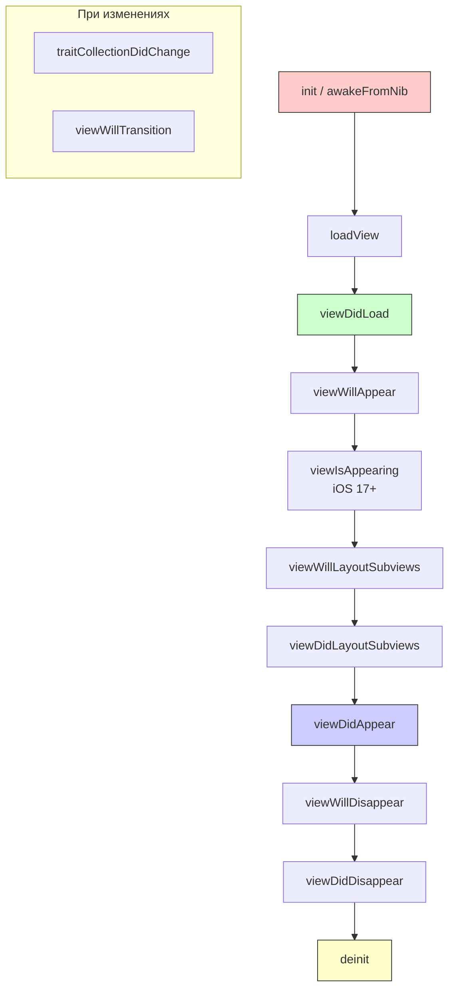

#uikit #uiviewcontroller #ios #lifecycle #swift #ios-development

---

### Определение

**Жизненный цикл UIViewController** — это строго определённая последовательность вызовов методов, через которые проходит любой контроллер от момента создания до полного уничтожения. Понимание этого цикла критически важно для правильной настройки интерфейса, эффективного управления памятью и предотвращения распространённых ошибок.

`UIViewController` — центральный элемент архитектуры [[MVC (Model-View-Controller) Architecture|MVC]] в iOS. Он управляет иерархией вью (`view` и её сабвью) и реагирует на события системы: появление экрана, поворот устройства, смену темы, уведомления о памяти и т.д.



---

### Полная таблица методов жизненного цикла

| Метод                            | Когда вызывается                              | Что делать                                           | Что НЕ делать                                       |
| -------------------------------- | --------------------------------------------- | ---------------------------------------------------- | --------------------------------------------------- |
| **[[init(coder)]]**              | При создании из storyboard / XIB              | Декодирование кастомных данных                       | Работа с `view` или `IBOutlets`                     |
| **[[init(nibName bundle)]]**     | При программном создании                      | Инициализация свойств                                | Работа с `view` (ещё не создана)                    |
| **[[awakeFromNib]]**             | После загрузки из NIB/storyboard              | Настройка IBOutlet **до** загрузки view              | Работа с геометрией (frame может быть не финальным) |
| **[[loadView]]**                 | При первом обращении к `view`, если она `nil` | Создание корневой вью (программно)                   | Вызывать `super.loadView()` без необходимости       |
| **[[viewDidLoad]]**              | После загрузки view в память (один раз)       | Настройка UI, добавление субвью, загрузка данных     | Работа с геометрией (frame/bounds — не финальные)   |
| **[[viewWillAppear]]**           | Перед появлением view на экране (каждый раз)  | Обновление данных, подписка на уведомления           | Тяжёлые операции (блокируют анимацию)               |
| **[[viewIsAppearing]]**          | iOS 17+ — между `willAppear` и `didAppear`    | Анимации, которые должны начаться во время появления | —                                                   |
| **[[viewWillLayoutSubviews]]**   | Перед вызовом `layoutSubviews()`              | Ручная корректировка layout перед Auto Layout        | —                                                   |
| **[[viewDidLayoutSubviews]]**    | После того, как субвью разместились           | Финальная настройка после Auto Layout                | —                                                   |
| **[[viewDidAppear]]**            | После полного появления view                  | Аналитика, запуск таймеров/анимаций, фокус           | —                                                   |
| **[[viewWillDisappear]]**        | Перед исчезновением view                      | Сохранение состояния, остановка таймеров             | —                                                   |
| **[[viewDidDisappear]]**         | После полного исчезновения view               | Очистка, отписка от уведомлений                      | —                                                   |
| **[[willMove]]**                 | Перед добавлением/удалением в container       | —                                                    | —                                                   |
| **[[didMove]]**                  | После добавления/удаления в container         | —                                                    | —                                                   |
| **[[traitCollectionDidChange]]** | При изменении trait'ов                        | Адаптация к тёмной теме, динамическому типу          | —                                                   |
| **[[viewWillTransition]]**       | Перед поворотом экрана                        | Адаптация layout под новую ориентацию                | —                                                   |
| **[[didReceiveMemoryWarning]]**  | При нехватке памяти                           | Освобождение некритичных ресурсов                    | Вызывать `super` в конце                            |
| **[[deinit]]**                   | При освобождении контроллера (ARC)            | Отписка от уведомлений, invalidate таймеров          | —                                                   |

---

## 1. Инициализация (Init и [[awakeFromNib]])

### 1.1. init(coder:) — создание из [[storyboard]] / [[XIB]]

Вызывается автоматически при загрузке контроллера из storyboard или XIB-файла. Используется редко — обычно только если нужно декодировать кастомные данные.

```swift
class CustomViewController: UIViewController {
    
    @IBOutlet weak var titleLabel: UILabel!
    
    // Вызывается при создании из storyboard/XIB
    required init?(coder: NSCoder) {
        // Сначала декодируем кастомные данные (если есть)
        // let customValue = coder.decodeObject(forKey: "customKey") as? String
        super.init(coder: coder)
        // Здесь НЕЛЬЗЯ обращаться к IBOutlet (они ещё не подключены)
        setup()
    }
    
    private func setup() {
        // Настройка свойств
        modalPresentationStyle = .fullScreen
    }
}
```

### 1.2. init(nibName:bundle:) — программное создание

Самый частый способ программного создания контроллера.

```swift
class MyViewController: UIViewController {
    
    // Программное создание
    override init(nibName nibNameOrNil: String?, bundle nibBundleOrNil: Bundle?) {
        super.init(nibName: nibNameOrNil, bundle: nibBundleOrNil)
        setup()
    }
    
    required init?(coder: NSCoder) {
        super.init(coder: coder)
        setup()
    }
    
    private func setup() {
        title = "Мой экран"
        view.backgroundColor = .white
    }
}

// Использование
let vc = MyViewController()  // вызывает init(nibName:nil, bundle:nil)
```

### 1.3. awakeFromNib() — после загрузки из NIB

Вызывается после загрузки из storyboard/XIB, но **до** `viewDidLoad`. Подходит для настройки IBOutlet, которые ещё не привязаны к иерархии.

```swift
class ProfileViewController: UIViewController {
    
    @IBOutlet weak var avatarImageView: UIImageView!
    @IBOutlet weak var nameLabel: UILabel!
    
    override func awakeFromNib() {
        super.awakeFromNib()
        // IBOutlet уже подключены, но view ещё не загружена
        // Можно настраивать свойства элементов
        avatarImageView.layer.cornerRadius = 25
        avatarImageView.clipsToBounds = true
    }
    
    override func viewDidLoad() {
        super.viewDidLoad()
        // Здесь можно работать с фреймами и добавлять субвью
        nameLabel.text = "Иван Петров"
    }
}
```

---

## 2. Загрузка view (loadView)

Вызывается при первом обращении к свойству `view`, если оно равно `nil`. **Обычно этот метод не нужно переопределять**, если вы используете storyboard или XIB.

### 2.1. Когда нужен loadView

```swift
class ProgrammaticViewController: UIViewController {
    
    override func loadView() {
        // Создаём корневую вью программно
        let customView = CustomBackgroundView()
        customView.backgroundColor = .systemBackground
        self.view = customView  // Присваиваем свойству view
        // Не вызываем super.loadView()!
    }
    
    override func viewDidLoad() {
        super.viewDidLoad()
        // view уже создана и имеет тип CustomBackgroundView
        guard let customView = view as? CustomBackgroundView else { return }
        customView.setupGradient()
    }
}
```

### 2.2. Ошибки при loadView

```swift
// ❌ Неправильно
override func loadView() {
    super.loadView()  // Если переопределяете, super не вызывайте!
    let myView = UIView()
    myView.backgroundColor = .red
    view = myView
}

// ✅ Правильно
override func loadView() {
    let myView = UIView()
    myView.backgroundColor = .red
    view = myView
}
```

---

## 3. viewDidLoad — основная настройка

Вызывается **один раз** за жизнь контроллера — после того, как view загружена в память. Это самое популярное место для настройки интерфейса.

### 3.1. Что обычно делают в viewDidLoad

```swift
class MainViewController: UIViewController {
    
    @IBOutlet weak var tableView: UITableView!
    @IBOutlet weak var activityIndicator: UIActivityIndicatorView!
    
    private let viewModel = MainViewModel()
    
    override func viewDidLoad() {
        super.viewDidLoad()
        
        // 1. Настройка внешнего вида
        title = "Главная"
        view.backgroundColor = .systemBackground
        navigationController?.navigationBar.prefersLargeTitles = true
        
        // 2. Настройка таблицы/коллекции
        setupTableView()
        
        // 3. Настройка ViewModel (замыкания, делегаты)
        setupViewModel()
        
        // 4. Добавление субвью (если программно)
        setupSubviews()
        
        // 5. Настройка жестов и уведомлений
        setupGestures()
        
        // 6. Загрузка начальных данных
        loadInitialData()
    }
    
    private func setupTableView() {
        tableView.delegate = self
        tableView.dataSource = self
        tableView.register(UITableViewCell.self, forCellReuseIdentifier: "Cell")
    }
    
    private func setupViewModel() {
        viewModel.onDataUpdated = { [weak self] in
            self?.tableView.reloadData()
        }
    }
    
    private func setupSubviews() {
        let button = UIButton(type: .system)
        button.setTitle("Нажми", for: .normal)
        button.frame = CGRect(x: 100, y: 100, width: 100, height: 50)
        view.addSubview(button)
    }
    
    private func setupGestures() {
        let tapGesture = UITapGestureRecognizer(target: self, action: #selector(handleTap))
        view.addGestureRecognizer(tapGesture)
    }
    
    @objc private func handleTap() { }
    
    private func loadInitialData() {
        activityIndicator.startAnimating()
        viewModel.loadData { [weak self] in
            self?.activityIndicator.stopAnimating()
        }
    }
}
```

### 3.2. Чего НЕ стоит делать в viewDidLoad

```swift
override func viewDidLoad() {
    super.viewDidLoad()
    
    // ❌ Не работайте с геометрией — frame может быть .zero
    print(view.frame)  // Может быть (0,0,0,0) или нефинальным
    
    // ❌ Не делайте тяжёлых вычислений, если они не критичны для старта
    
    // ❌ Не запускайте долгие анимации — они будут видны при появлении
}
```

---

## 4. Появление на экране (Appearing)

### 4.1. viewWillAppear — перед появлением

Вызывается **перед** тем, как view станет видимым. Это место для обновления данных перед показом.

```swift
class ProfileViewController: UIViewController {
    
    override func viewWillAppear(_ animated: Bool) {
        super.viewWillAppear(animated)
        
        // 1. Обновление данных
        loadUserProfile()
        
        // 2. Обновление UI на основе изменённых данных
        updateUI()
        
        // 3. Настройка навигации
        navigationController?.setNavigationBarHidden(false, animated: animated)
        
        // 4. Подписка на уведомления (если нужны только когда экран видим)
        startObservingKeyboardNotifications()
        
        // 5. Аналитика начала показа
        logScreenView()
    }
    
    override func viewWillDisappear(_ animated: Bool) {
        super.viewWillDisappear(animated)
        stopObservingKeyboardNotifications()
    }
}
```

### 4.2. viewIsAppearing — [[iOS]] 17+ (новое!)

Вызывается **между** `viewWillAppear` и `viewDidAppear`. Идеально для анимаций, которые должны начаться **во время** появления.

```swift
@available(iOS 17.0, *)
class ModernViewController: UIViewController {
    
    override func viewIsAppearing(_ animated: Bool) {
        super.viewIsAppearing(animated)
        
        // Анимации, которые синхронизированы с появлением контроллера
        // Это лучшее место для старта анимаций, которые должны быть видны
        // сразу при появлении экрана
        startIntroAnimation()
    }
    
    private func startIntroAnimation() {
        let views = [titleLabel, subtitleLabel, button]
        views.forEach { $0?.alpha = 0 }
        
        UIView.animate(withDuration: 0.3, delay: 0, options: .curveEaseOut) {
            views.forEach { $0?.alpha = 1 }
        }
    }
}
```

### 4.3. viewDidAppear — после появления

Вызывается **после** того, как view стал полностью видимым.

```swift
class OnboardingViewController: UIViewController {
    
    override func viewDidAppear(_ animated: Bool) {
        super.viewDidAppear(animated)
        
        // 1. Аналитика (screen view)
        AnalyticsManager.shared.trackScreen("Onboarding")
        
        // 2. Запуск анимаций
        startIntroAnimation()
        
        // 3. Показ алерта (после полной загрузки интерфейса)
        showWelcomeAlert()
        
        // 4. Запуск таймера
        startTimer()
        
        // 5. Запрос разрешений
        requestNotificationPermission()
    }
}
```

---

## 5. Верстка (Layout)

### 5.1. viewWillLayoutSubviews

Вызывается **перед** тем, как система начнёт layout'ить субвью.

```swift
class ResponsiveViewController: UIViewController {
    
    @IBOutlet weak var contentViewWidthConstraint: NSLayoutConstraint!
    
    override func viewWillLayoutSubviews() {
        super.viewWillLayoutSubviews()
        
        // Изменение констрейнтов перед layout'ом
        if traitCollection.horizontalSizeClass == .regular {
            contentViewWidthConstraint.constant = 600  // iPad
        } else {
            contentViewWidthConstraint.constant = view.bounds.width - 32  // iPhone
        }
    }
}
```

### 5.2. viewDidLayoutSubviews

Вызывается **после** того, как система заlayout'ила все субвью. Здесь можно получить финальные фреймы.

```swift
class GradientViewController: UIViewController {
    
    private let gradientLayer = CAGradientLayer()
    
    override func viewDidLoad() {
        super.viewDidLoad()
        view.layer.addSublayer(gradientLayer)
    }
    
    override func viewDidLayoutSubviews() {
        super.viewDidLayoutSubviews()
        
        // Финальные размеры view уже известны
        gradientLayer.frame = view.bounds
        gradientLayer.colors = [UIColor.red.cgColor, UIColor.blue.cgColor]
    }
}
```

---

## 6. Container и Parent (willMove / didMove)

Эти методы вызываются при добавлении/удалении контроллера в контейнер (UINavigationController, UITabBarController).

```swift
class ChildViewController: UIViewController {
    
    override func willMove(toParent parent: UIViewController?) {
        super.willMove(toParent: parent)
        if parent == nil {
            print("Контроллер будет удалён из контейнера")
        }
    }
    
    override func didMove(toParent parent: UIViewController?) {
        super.didMove(toParent: parent)
        if parent != nil {
            print("Контроллер добавлен в контейнер")
        }
    }
}

// Добавление как дочернего контроллера
let childVC = ChildViewController()
addChild(childVC)
view.addSubview(childVC.view)
childVC.didMove(toParent: self)  // Важно: вызвать вручную!

// Удаление
childVC.willMove(toParent: nil)
childVC.view.removeFromSuperview()
childVC.removeFromParent()
```

---

## 7. Адаптация к изменениям

### 7.1. traitCollectionDidChange — смена темы, шрифтов

```swift
class ThemeAwareViewController: UIViewController {
    
    override func traitCollectionDidChange(_ previousTraitCollection: UITraitCollection?) {
        super.traitCollectionDidChange(previousTraitCollection)
        
        // Адаптация к тёмной/светлой теме
        if traitCollection.hasDifferentColorAppearance(comparedTo: previousTraitCollection) {
            updateColorsForCurrentTheme()
        }
        
        // Адаптация к динамическому типу
        if traitCollection.preferredContentSizeCategory != previousTraitCollection?.preferredContentSizeCategory {
            updateFontsForContentSizeCategory()
        }
    }
    
    private func updateColorsForCurrentTheme() {
        view.backgroundColor = .systemBackground
        // обновление цветов элементов
    }
    
    private func updateFontsForContentSizeCategory() {
        titleLabel.font = .preferredFont(forTextStyle: .headline)
    }
}
```

### 7.2. viewWillTransition — поворот экрана

```swift
class RotatingViewController: UIViewController {
    
    override func viewWillTransition(to size: CGSize, with coordinator: UIViewControllerTransitionCoordinator) {
        super.viewWillTransition(to: size, with: coordinator)
        
        coordinator.animate(alongsideTransition: { [weak self] context in
            // Анимация во время поворота
            self?.adjustLayoutForNewSize(size)
        }, completion: { _ in
            // Завершение поворота
            print("Rotation completed")
        })
    }
    
    private func adjustLayoutForNewSize(_ size: CGSize) {
        if size.width > size.height {
            // landscape
        } else {
            // portrait
        }
    }
}
```

---

## 8. Управление памятью

### 8.1. didReceiveMemoryWarning

Вызывается системой при нехватке памяти.

```swift
class HeavyViewController: UIViewController {
    
    private var cachedImages: [String: UIImage] = [:]
    private var largeData: Data?
    private let imageCache = NSCache<NSString, UIImage>()
    
    override func didReceiveMemoryWarning() {
        super.didReceiveMemoryWarning()
        
        // 1. Очистка кеша изображений
        cachedImages.removeAll()
        imageCache.removeAllObjects()
        
        // 2. Освобождение больших данных
        largeData = nil
        
        // 3. Очистка невидимых субвью
        for subview in view.subviews where subview.isHidden {
            subview.removeFromSuperview()
        }
        
        // super в конце!
        super.didReceiveMemoryWarning()
    }
}
```

### 8.2. deinit — финальная очистка

```swift
class ObservableViewController: UIViewController {
    
    private var cancellables = Set<AnyCancellable>()
    private var timer: Timer?
    private var observer: NSObjectProtocol?
    
    deinit {
        print("\(Self.self) deinitialized")
        
        // Остановка таймера
        timer?.invalidate()
        
        // Отписка от Combine
        cancellables.removeAll()
        
        // Отписка от уведомлений
        if let observer = observer {
            NotificationCenter.default.removeObserver(observer)
        }
        NotificationCenter.default.removeObserver(self)
    }
}
```

---

## 9. Полный пример с логами

```swift
class LifecycleTestViewController: UIViewController {
    
    // MARK: - Init
    override init(nibName nibNameOrNil: String?, bundle nibBundleOrNil: Bundle?) {
        super.init(nibName: nibNameOrNil, bundle: nibBundleOrNil)
        print("📌 init(nibName:bundle:)")
    }
    
    required init?(coder: NSCoder) {
        super.init(coder: coder)
        print("📌 init(coder:)")
    }
    
    override func awakeFromNib() {
        super.awakeFromNib()
        print("📌 awakeFromNib")
    }
    
    // MARK: - View Lifecycle
    override func loadView() {
        super.loadView()
        print("1️⃣ loadView")
    }
    
    override func viewDidLoad() {
        super.viewDidLoad()
        print("2️⃣ viewDidLoad")
        view.backgroundColor = .white
    }
    
    override func viewWillAppear(_ animated: Bool) {
        super.viewWillAppear(animated)
        print("3️⃣ viewWillAppear")
    }
    
    override func viewIsAppearing(_ animated: Bool) {
        super.viewIsAppearing(animated)
        print("3️⃣.5️⃣ viewIsAppearing (iOS 17+)")
    }
    
    override func viewWillLayoutSubviews() {
        super.viewWillLayoutSubviews()
        print("4️⃣ viewWillLayoutSubviews")
    }
    
    override func viewDidLayoutSubviews() {
        super.viewDidLayoutSubviews()
        print("5️⃣ viewDidLayoutSubviews")
    }
    
    override func viewDidAppear(_ animated: Bool) {
        super.viewDidAppear(animated)
        print("6️⃣ viewDidAppear")
    }
    
    override func viewWillDisappear(_ animated: Bool) {
        super.viewWillDisappear(animated)
        print("7️⃣ viewWillDisappear")
    }
    
    override func viewDidDisappear(_ animated: Bool) {
        super.viewDidDisappear(animated)
        print("8️⃣ viewDidDisappear")
    }
    
    override func willMove(toParent parent: UIViewController?) {
        super.willMove(toParent: parent)
        print("willMove(toParent:)")
    }
    
    override func didMove(toParent parent: UIViewController?) {
        super.didMove(toParent: parent)
        print("didMove(toParent:)")
    }
    
    override func traitCollectionDidChange(_ previousTraitCollection: UITraitCollection?) {
        super.traitCollectionDidChange(previousTraitCollection)
        print("traitCollectionDidChange")
    }
    
    override func viewWillTransition(to size: CGSize, with coordinator: UIViewControllerTransitionCoordinator) {
        super.viewWillTransition(to: size, with: coordinator)
        print("viewWillTransition")
    }
    
    override func didReceiveMemoryWarning() {
        super.didReceiveMemoryWarning()
        print("⚠️ didReceiveMemoryWarning")
    }
    
    deinit {
        print("♻️ deinit")
    }
}
```

**Вывод при первом открытии:**
```
📌 init(nibName:bundle:)
1️⃣ loadView
2️⃣ viewDidLoad
3️⃣ viewWillAppear
3️⃣.5️⃣ viewIsAppearing (iOS 17+)
4️⃣ viewWillLayoutSubviews
5️⃣ viewDidLayoutSubviews
6️⃣ viewDidAppear
```

**Вывод при закрытии:**
```
7️⃣ viewWillDisappear
8️⃣ viewDidDisappear
willMove(toParent:)
didMove(toParent:)
♻️ deinit
```

---

## 10. Шпаргалка

| Ситуация | Что использовать |
|---|---|
| **Настройка IBOutlet до загрузки view** | `awakeFromNib()` |
| **Программное создание корневой вью** | `loadView()` |
| **Настройка UI (один раз)** | `viewDidLoad()` |
| **Обновление данных перед показом** | `viewWillAppear()` |
| **Анимации во время появления** | `viewIsAppearing()` (iOS 17+) |
| **Запуск анимаций после появления** | `viewDidAppear()` |
| **Изменение констрейнтов под размер** | `viewWillLayoutSubviews()` |
| **Работа с финальными фреймами** | `viewDidLayoutSubviews()` |
| **Адаптация к тёмной теме** | `traitCollectionDidChange()` |
| **Адаптация к повороту** | `viewWillTransition(to:with:)` |
| **Сохранение состояния** | `viewWillDisappear()` |
| **Очистка при нехватке памяти** | `didReceiveMemoryWarning()` |
| **Финальная очистка** | `deinit` |

---

### Короткое правило

> **init / awakeFromNib** → создание  
> **loadView** → создание корневой вью (редко)  
> **viewDidLoad** → настройка UI (один раз)  
> **viewWillAppear** → обновление данных (каждый раз)  
> **viewIsAppearing** → анимации во время появления (iOS 17+)  
> **viewDidAppear** → аналитика, запуск таймеров  
> **viewWillDisappear** → сохранение состояния  
> **viewDidDisappear** → остановка процессов  
> **deinit** → освобождение ресурсов

---

### Итог

**Жизненный цикл UIViewController**:

| Фаза | Ключевые методы |
|---|---|
| **Создание** | `init`, `awakeFromNib`, `loadView`, `viewDidLoad` |
| **Появление** | `viewWillAppear`, `viewIsAppearing`, `viewDidAppear` |
| **Вёрстка** | `viewWillLayoutSubviews`, `viewDidLayoutSubviews` |
| **Адаптация** | `traitCollectionDidChange`, `viewWillTransition` |
| **Исчезновение** | `viewWillDisappear`, `viewDidDisappear` |
| **Память** | `didReceiveMemoryWarning` |
| **Удаление** | `willMove(toParent:)`, `didMove(toParent:)`, `deinit` |

**Главное правило:**
> Всегда вызывай `super` при переопределении методов жизненного цикла. `viewDidLoad` — один раз, всё остальное — каждый раз при появлении/исчезновении. `deinit` — единственное место, где можно быть уверенным, что контроллер точно умер. Не делай тяжёлых операций в `viewWillAppear` — они задержат анимацию перехода. Для анализа утечек добавь `print` в `deinit` — если он не вызывается, ищи retain cycle.