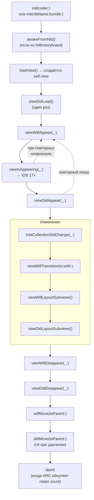

1. **[[init(coder)]]**  
   Вызывается при создании контроллера из storyboard / XIB / NSCoder.  
   Используется редко (обычно только если нужно декодировать кастомные данные).

2. **[[init(nibName bundle)]]**  
   Вызывается при программном создании контроллера с NIB-файлом.  
   Самый частый programmatic init.

3. **[[awakeFromNib]]()**  
   Вызывается после загрузки из NIB/storyboard, но **до** `viewDidLoad`.  
   Подходит для настройки IBOutlet до загрузки view.

4. **[[loadView]]()**  
   Вызывается, если view ещё не создана ([[nil]]).  
   Здесь вы **должны** создать и присвоить `self.view`.  
   Если не переопределить — вызывается дефолтная реализация (пустой [[UIView]]).

5. **[[viewDidLoad]]()**  
   Вызывается **один раз** после того, как view загружена в память.  
   Классическое место для:  
   - настройки UI (цвета, шрифты, добавление subviews)  
   - начальной загрузки данных  
   - регистрации наблюдателей

5. **[[viewWillAppear]](_:)**  
   Вызывается **перед** появлением view на экране (каждый раз).  
   Подходит для:  
   - обновления данных перед показом  
   - запуска анимаций  
   - подписки на уведомления

5. **[[viewIsAppearing]](_:)** (новое в iOS 17+)  
   Вызывается **между** `viewWillAppear` и `viewDidAppear`.  
   Идеально для анимаций, которые должны начаться **во время** появления.

6. **[[viewDidAppear]](_:)**  
   Вызывается **после** того, как view полностью появилась.  
   Подходит для:  
   - аналитики (screen view)  
   - запуска таймеров/анимаций  
   - фокуса на input

6. **[[viewWillDisappear]](_:)**  
   Вызывается **перед** тем, как view исчезнет с экрана.  
   Подходит для:  
   - сохранения состояния  
   - остановки анимаций/таймеров  
   - отписки от уведомлений

6. **[[viewDidDisappear]](_:)**  
    Вызывается **после** того, как view полностью скрылась.  
    Подходит для:  
    - окончательной очистки  
    - остановки сетевых запросов  
    - аналитики (screen exit)

7. **[[viewWillLayoutSubviews]]()**  
    Вызывается **перед** вызовом `layoutSubviews()` на view.  
    Подходит для:  
    - ручной корректировки layout перед Auto Layout

8. **[[viewDidLayoutSubviews]]()**  
    Вызывается **после** того, как подвиды разместились.  
    Подходит для:  
    - финальной настройки после Auto Layout  
    - расчёта размеров динамических элементов

9. **[[willMove]](toParent:)**  
    Вызывается **перед** добавлением/удалением контроллера в container ([[UINavigationController]], [[UITabBarController]] и т.д.).

10. **[[didMove]](toParent:)**  
    Вызывается **после** добавления/удаления в container.

11. **[[traitCollectionDidChange]](_:)**  
    Вызывается при изменении trait’ов (размер класса, тёмная/светлая тема, динамический тип и т.д.).

12. **[[viewWillTransition]](to:with:)**  
    Вызывается перед поворотом экрана (изменением размера).

13. **[[deinit]]**  
    Вызывается при **полном освобождении** контроллера из памяти ([[ARC]]).  
    Подходит для:  
    - отписки от [[NotificationCenter]]  
    - invalidate таймеров  
    - закрытия соединений  
    - логирования (проверка утечек)

### Порядок вызова (самый полный)

### Короткие рекомендации (2026)

- **[[viewDidLoad]]** — настройка UI и начальная загрузка данных
- **[[viewWillAppear]]** — обновление данных перед показом
- **[[viewDidAppear]]** — аналитика, запуск анимаций, фокус
- **[[viewWillDisappear]]** — сохранение состояния, остановка анимаций
- **[[viewDidDisappear]]** — отписка от уведомлений, очистка
- **[[deinit]]** — финальная очистка (таймеры, NotificationCenter)
- **[[viewDidLayoutSubviews]]** — финальная корректировка после Auto Layout

**Главное правило**:
> «viewDidLoad — один раз, всё остальное — каждый раз при появлении/исчезновении.  
> deinit — единственное место, где можно быть уверенным, что контроллер точно умер.»
