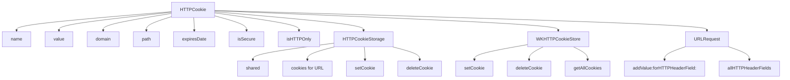

#HTTPCookie #Foundation #iOS #Swift #Cookies #HTTP #Networking #URLSession #WebKit #Security #Persistence

---
**(объект HTTP-куки / управление куками в iOS)**

**HTTPCookie** — это класс из фреймворка **Foundation**, который представляет **[[HTTP]]-куку** — небольшой фрагмент данных, который сервер отправляет браузеру/клиенту и который сохраняется для последующих запросов. В [[iOS]] используется для управления сессиями, аутентификацией, трекингом и хранением пользовательских предпочтений.

**Ключевые особенности (важно в 2026):**
- Класс является **неизменяемым** (`immutable`) — после создания свойства нельзя изменить
- Поддерживает все стандартные атрибуты кук: `domain`, `path`, `expires`, `secure`, `httpOnly`
- Используется как в `URLSession`, так и в [[WKHTTPCookieStore]]
- **Автоматически** управляется `HTTPCookieStorage` для [[URLSession]]
- Требует ручного управления при работе с `WKWebView`

---

### Основные свойства HTTPCookie

| Свойство        | Тип           | Назначение                                    |
| --------------- | ------------- | --------------------------------------------- |
| `name`          | [[String]]    | Имя куки                                      |
| `value`         | `String`      | Значение куки                                 |
| `domain`        | `String`      | Домен, к которому применяется кука            |
| `path`          | `String`      | Путь, для которого действует кука             |
| `expiresDate`   | [[Date]]?     | Дата истечения (nil = сессионная кука)        |
| `isSecure`      | [[Bool]]      | Передавать только по HTTPS                    |
| `isHTTPOnly`    | `Bool`        | Доступна только для HTTP-запросов (не для JS) |
| `comment`       | `String?`     | Комментарий (устаревший)                      |
| `commentURL`    | [[URL]]?      | URL для комментария (устаревший)              |
| `portList`      | `[NSNumber]?` | Список портов (устаревший)                    |
| `version`       | [[Int]]       | Версия куки (0 = Netscape, 1 = RFC 2109)      |
| `isSessionOnly` | `Bool`        | Является ли кука сессионной (без expiresDate) |

---

### Схема взаимосвязей



---

### Примеры (от простого к сложному)

#### 1. Создание сессионной куки (базовый)
```swift
import Foundation

// Самый простой способ - через словарь свойств
let cookieProperties: [HTTPCookiePropertyKey: Any] = [
    .name: "sessionId",
    .value: "abc123xyz789",
    .domain: "example.com",
    .path: "/"
]

if let cookie = HTTPCookie(properties: cookieProperties) {
    print("Кука создана: \(cookie.name) = \(cookie.value)")
    print("Домен: \(cookie.domain)")
    print("Сессионная: \(cookie.isSessionOnly)")
}
```

#### 2. Создание персистентной куки с датой истечения
```swift
let cookieProperties: [HTTPCookiePropertyKey: Any] = [
    .name: "userToken",
    .value: "eyJhbGciOiJIUzI1NiIsInR5cCI6IkpXVCJ9...",
    .domain: ".example.com",  // точка перед доменом = все поддомены
    .path: "/",
    .expires: Date().addingTimeInterval(3600 * 24 * 30), // 30 дней
    .secure: true,            // только по HTTPS
    .httpOnly: true           // недоступна для JavaScript
]

if let cookie = HTTPCookie(properties: cookieProperties) {
    print("Персистентная кука создана")
    print("Истекает: \(cookie.expiresDate?.description ?? "никогда")")
    print("Secure: \(cookie.isSecure)")
    print("HTTP Only: \(cookie.isHTTPOnly)")
}
```

#### 3. Создание куки из строки Set-Cookie
```swift
// Сервер обычно отдаёт куки в заголовке Set-Cookie
let setCookieString = "sessionid=abc123; Domain=.example.com; Path=/; Expires=Wed, 21 Oct 2026 07:28:00 GMT; Secure; HttpOnly"

if let cookie = HTTPCookie.cookies(withResponseHeaderFields: ["Set-Cookie": setCookieString], for: URL(string: "https://example.com")!).first {
    print("Кука из Set-Cookie: \(cookie.name) = \(cookie.value)")
    print("Домен: \(cookie.domain)")
    print("Истекает: \(cookie.expiresDate?.description ?? "сессионная")")
    print("Secure: \(cookie.isSecure)")
    print("HTTP Only: \(cookie.isHTTPOnly)")
}
```

#### 4. Получение всех кук для URL
```swift
let url = URL(string: "https://example.com")!

// Добавляем несколько кук в хранилище
let cookie1 = HTTPCookie(properties: [
    .name: "user",
    .value: "john_doe",
    .domain: ".example.com",
    .path: "/"
])!

let cookie2 = HTTPCookie(properties: [
    .name: "preferences",
    .value: "theme=dark",
    .domain: ".example.com",
    .path: "/"
])!

HTTPCookieStorage.shared.setCookie(cookie1)
HTTPCookieStorage.shared.setCookie(cookie2)

// Получаем все куки для конкретного URL
if let cookies = HTTPCookieStorage.shared.cookies(for: url) {
    for cookie in cookies {
        print("Кука для \(url): \(cookie.name) = \(cookie.value)")
    }
}
```

#### 5. Использование кук в [[URLRequest]]
```swift
let url = URL(string: "https://api.example.com/profile")!
var request = URLRequest(url: url)

// Способ 1: Ручное добавление кук в заголовки
if let cookies = HTTPCookieStorage.shared.cookies(for: url) {
    let cookieHeader = HTTPCookie.requestHeaderFields(with: cookies)
    request.allHTTPHeaderFields = cookieHeader
}

// Способ 2: Автоматическое добавление (если используется HTTPCookieStorage)
URLSession.shared.dataTask(with: request) { data, response, error in
    // Куки автоматически добавляются, если URLSession использует HTTPCookieStorage.shared
    // (по умолчанию использует)
    if let httpResponse = response as? HTTPURLResponse,
       let setCookieHeader = httpResponse.allHeaderFields["Set-Cookie"] as? String {
        // Сервер может вернуть новые куки
        print("Set-Cookie: \(setCookieHeader)")
    }
}.resume()
```

#### 6. Создание куки с ограничением по порту
```swift
let cookieProperties: [HTTPCookiePropertyKey: Any] = [
    .name: "secureSession",
    .value: "xyz789",
    .domain: "example.com",
    .path: "/secure",
    .portList: [443, 8443], // только для указанных портов
    .secure: true
]

if let cookie = HTTPCookie(properties: cookieProperties) {
    print("Кука ограничена портами: \(cookie.portList?.description ?? "нет")")
}
```

#### 7. Управление куками в HTTPCookieStorage
```swift
let storage = HTTPCookieStorage.shared

// Установка куки
storage.setCookie(cookie)

// Получение всех кук
if let allCookies = storage.cookies {
    print("Всего кук: \(allCookies.count)")
}

// Получение кук для домена
if let domainCookies = storage.cookies(for: URL(string: "https://example.com")!) {
    print("Кук для example.com: \(domainCookies.count)")
}

// Удаление конкретной куки
storage.deleteCookie(cookie)

// Очистка всех кук
if let allCookies = storage.cookies {
    for cookie in allCookies {
        storage.deleteCookie(cookie)
    }
}

// Проверка, принимает ли хранилище куки
let acceptsCookies = storage.cookieAcceptPolicy
print("Политика приёма кук: \(acceptsCookies.rawValue)")
```

#### 8. Куки в [[WKWebView]] (синхронизация)
```swift
import WebKit

class WebViewController: UIViewController {
    private var webView: WKWebView!
    private let cookieStore = WKWebsiteDataStore.default().httpCookieStore
    
    override func viewDidLoad() {
        super.viewDidLoad()
        
        // Синхронизируем куки из HTTPCookieStorage в WKWebView
        syncCookiesToWebView()
        
        // Настраиваем webView
        let config = WKWebViewConfiguration()
        config.websiteDataStore = .default()
        webView = WKWebView(frame: view.bounds, configuration: config)
        view.addSubview(webView)
        
        // Загружаем страницу
        if let url = URL(string: "https://example.com") {
            webView.load(URLRequest(url: url))
        }
    }
    
    private func syncCookiesToWebView() {
        guard let url = URL(string: "https://example.com"),
              let cookies = HTTPCookieStorage.shared.cookies(for: url) else {
            return
        }
        
        let cookieStore = WKWebsiteDataStore.default().httpCookieStore
        let group = DispatchGroup()
        
        for cookie in cookies {
            group.enter()
            cookieStore.setCookie(cookie) { _ in
                group.leave()
            }
        }
        
        group.notify(queue: .main) {
            print("Синхронизировано \(cookies.count) кук")
        }
    }
}
```

#### 9. Фильтрация и поиск кук
```swift
class CookieHelper {
    static func getCookie(named name: String, from storage: HTTPCookieStorage = .shared) -> HTTPCookie? {
        return storage.cookies?.first { $0.name == name }
    }
    
    static func getCookies(for domain: String, from storage: HTTPCookieStorage = .shared) -> [HTTPCookie] {
        guard let url = URL(string: "https://\(domain)") else { return [] }
        return storage.cookies(for: url) ?? []
    }
    
    static func getSessionCookies(from storage: HTTPCookieStorage = .shared) -> [HTTPCookie] {
        return storage.cookies?.filter { $0.isSessionOnly } ?? []
    }
    
    static func getPersistentCookies(from storage: HTTPCookieStorage = .shared) -> [HTTPCookie] {
        return storage.cookies?.filter { !$0.isSessionOnly } ?? []
    }
    
    static func deleteCookies(for domain: String, from storage: HTTPCookieStorage = .shared) {
        let cookies = getCookies(for: domain, from: storage)
        for cookie in cookies {
            storage.deleteCookie(cookie)
        }
        print("Удалено \(cookies.count) кук для домена \(domain)")
    }
}

// Использование
if let userCookie = CookieHelper.getCookie(named: "user") {
    print("Найдена кука пользователя: \(userCookie.value)")
}

let sessionCookies = CookieHelper.getSessionCookies()
print("Сессионных кук: \(sessionCookies.count)")
```

#### 10. Полный менеджер кук с обработкой ошибок
```swift
class CookieManager {
    static let shared = CookieManager()
    private let storage = HTTPCookieStorage.shared
    
    private init() {}
    
    // Установка куки с валидацией
    func setCookie(name: String, value: String, domain: String, path: String = "/", 
                   expires: Date? = nil, secure: Bool = false, httpOnly: Bool = false) throws {
        var properties: [HTTPCookiePropertyKey: Any] = [
            .name: name,
            .value: value,
            .domain: domain,
            .path: path
        ]
        
        if let expires = expires {
            properties[.expires] = expires
        }
        
        if secure {
            properties[.secure] = true
        }
        
        if httpOnly {
            properties[.httpOnly] = true
        }
        
        guard let cookie = HTTPCookie(properties: properties) else {
            throw CookieError.invalidProperties
        }
        
        storage.setCookie(cookie)
        print("✅ Кука установлена: \(name)=\(value) для \(domain)")
    }
    
    // Получение куки по имени
    func getCookie(name: String) -> HTTPCookie? {
        return storage.cookies?.first { $0.name == name }
    }
    
    // Получение куки с проверкой валидности
    func getValidCookie(name: String, domain: String) -> HTTPCookie? {
        guard let cookies = storage.cookies(for: URL(string: "https://\(domain)")!) else {
            return nil
        }
        
        return cookies.first { cookie in
            cookie.name == name && 
            (cookie.expiresDate == nil || cookie.expiresDate! > Date())
        }
    }
    
    // Обновление куки
    func updateCookie(name: String, value: String, domain: String) throws {
        // Удаляем старую
        if let oldCookie = getCookie(name: name) {
            storage.deleteCookie(oldCookie)
        }
        
        // Создаём новую
        try setCookie(name: name, value: value, domain: domain)
    }
    
    // Очистка всех кук для домена
    func clearCookies(for domain: String) {
        guard let url = URL(string: "https://\(domain)"),
              let cookies = storage.cookies(for: url) else {
            return
        }
        
        for cookie in cookies {
            storage.deleteCookie(cookie)
        }
        print("🗑️ Удалено \(cookies.count) кук для \(domain)")
    }
    
    // Полная очистка всех кук
    func clearAllCookies() {
        guard let cookies = storage.cookies else { return }
        for cookie in cookies {
            storage.deleteCookie(cookie)
        }
        print("🗑️ Удалено \(cookies.count) кук")
    }
    
    // Получение всех кук в виде словаря
    func getAllCookiesDictionary() -> [String: String] {
        var dict: [String: String] = [:]
        storage.cookies?.forEach { dict[$0.name] = $0.value }
        return dict
    }
}

enum CookieError: Error {
    case invalidProperties
}

// Использование
do {
    try CookieManager.shared.setCookie(
        name: "auth",
        value: "token123",
        domain: ".example.com",
        expires: Date().addingTimeInterval(3600),
        secure: true,
        httpOnly: true
    )
    
    if let cookie = CookieManager.shared.getCookie(name: "auth") {
        print("Кука найдена: \(cookie.name)=\(cookie.value)")
    }
    
    let allCookies = CookieManager.shared.getAllCookiesDictionary()
    print("Все куки: \(allCookies)")
} catch {
    print("Ошибка: \(error)")
}
```

#### 11. Сериализация и десериализация кук
```swift
// Сохранение кук в UserDefaults
class CookiePersistence {
    static func saveCookies(_ cookies: [HTTPCookie]) {
        let cookieData = cookies.map { cookie in
            return [
                "name": cookie.name,
                "value": cookie.value,
                "domain": cookie.domain,
                "path": cookie.path,
                "expires": cookie.expiresDate?.timeIntervalSince1970 ?? 0
            ]
        }
        UserDefaults.standard.set(cookieData, forKey: "savedCookies")
    }
    
    static func loadCookies() -> [HTTPCookie] {
        guard let cookieData = UserDefaults.standard.array(forKey: "savedCookies") as? [[String: Any]] else {
            return []
        }
        
        return cookieData.compactMap { dict in
            var properties: [HTTPCookiePropertyKey: Any] = [
                .name: dict["name"]!,
                .value: dict["value"]!,
                .domain: dict["domain"]!,
                .path: dict["path"]!
            ]
            
            if let expiresInterval = dict["expires"] as? TimeInterval, expiresInterval > 0 {
                properties[.expires] = Date(timeIntervalSince1970: expiresInterval)
            }
            
            return HTTPCookie(properties: properties)
        }
    }
}

// Использование
let cookies = HTTPCookieStorage.shared.cookies ?? []
CookiePersistence.saveCookies(cookies)

let loadedCookies = CookiePersistence.loadCookies()
for cookie in loadedCookies {
    HTTPCookieStorage.shared.setCookie(cookie)
}
```

---

### Важные нюансы 2026 года

> [!warning]
> **Неизменяемость:** HTTPCookie — **immutable** объект. Для изменения значения нужно создать новый объект и удалить старый.
> 
> **Домен:** Если домен начинается с точки (`.example.com`), кука действует на все поддомены. Без точки — только на точный домен.
> 
> **Secure:** Куки с флагом `secure` передаются только по HTTPS. В iOS 16+ это строгое требование.
> 
> **HTTPOnly:** Куки с флагом `httpOnly` недоступны для JavaScript в `WKWebView`. Это **защита от XSS-атак**.
> 
> **Сессионные куки:** Не имеют `expiresDate` и удаляются при завершении сессии (закрытии приложения).
> 
> **URLSession vs WKWebView:** `HTTPCookieStorage.shared` автоматически управляет куками для `URLSession`, но **не синхронизируется** с `WKWebView`.
> 
> **Максимальный размер:** Кука может хранить до **4 КБ** данных. Храните только идентификаторы, не данные пользователя.
> 
> **SameSite:** Нативно не поддерживается в `HTTPCookie` (используйте заголовки или `WKWebView` через JS).
> 
> **Ограничения App Store:** Не храните чувствительные данные (пароли, токены) в куках без шифрования. Используйте **Keychain** для важных данных.

---

### Лучшие практики 2026

1. **Всегда проверяйте** `expiresDate` перед использованием куки
2. **Используйте `secure` и `httpOnly`** для всех аутентификационных кук
3. **Не храните большие данные** в куках (используйте `UserDefaults` или `CoreData`)
4. **Очищайте куки** при выходе пользователя из аккаунта
5. **Синхронизируйте куки** между `URLSession` и `WKWebView`, если используете оба
6. **Используйте `Keychain`** для токенов вместо кук, если это критично для безопасности
7. **Документируйте** все куки с комментариями об их назначении

---

### Связь с другими темами

- [[WKHTTPCookieStore]] — хранилище кук для WKWebView
- [[WKWebsiteDataStore]] — контейнер для cookieStore
- [[URLSession]] — автоматическое управление куками
- [[WKWebViewConfiguration]] — настройка webView с куками
- [[Keychain]] — альтернатива для чувствительных данных