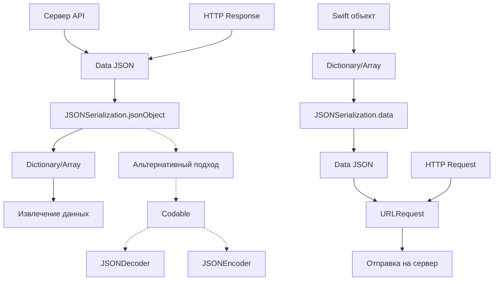

#JSONSerialization #Foundation #iOS #Swift #JSON #DataParsing #Networking #API #Serialization #Deserialization

---
**(сериализация JSON / преобразование JSON в объекты Swift и обратно)**

**JSONSerialization** — это класс из фреймворка **[[Foundation]]**, который предоставляет методы для **преобразования между JSON-данными и объектами Swift** (словари, массивы, строки, числа). Это основной механизм для работы с [[JSON]]-ответами от серверов, отправки JSON-запросов и обмена данными между [[Swift]] и веб-сервисами.

**Ключевые особенности (важно в 2026):**
- Поддерживает **все JSON-типы**: строки, числа, булевы значения, массивы, словари, null
- Работает синхронно — **блокирует поток** (используйте фоновые очереди)
- Поддерживает **опции форматирования** для красивого вывода
- Может обрабатывать **нестандартные JSON** (невалидный или с дублирующимися ключами)
- Является **предшественником** `JSONDecoder`/`JSONEncoder` ([[Codable]]) — но всё ещё широко используется для динамических данных

---

### Основные методы JSONSerialization

| Метод                                        | Назначение                          | Возвращаемый тип |
| -------------------------------------------- | ----------------------------------- | ---------------- |
| `jsonObject(with:options:)`                  | Парсинг Data → Any (словарь/массив) | [[Any]]          |
| `data(withJSONObject:options:)`              | Сериализация Any → Data             | [[Data]]         |
| `isValidJSONObject(_:)`                      | Проверка валидности JSON            | [[Bool]]         |
| `writeJSONObject(_:toStream:options:error:)` | Запись JSON в поток                 | [[Int]]          |

**Опции парсинга (reading options):**
- `.mutableContainers` — изменяемые массивы/словари
- `.mutableLeaves` — изменяемые строки
- `.fragmentsAllowed` — разрешить фрагменты (неполный JSON)
- `.json5Allowed` — разрешить JSON5 (комментарии, trailing commas) — iOS 15+

**Опции сериализации (writing options):**
- `.prettyPrinted` — форматирование с отступами
- `.sortedKeys` — сортировка ключей
- `.withoutEscapingSlashes` — не экранировать слэши
- `.fragmentsAllowed` — разрешить фрагменты

---

### Схема взаимосвязей



---

### Примеры (от простого к сложному)

#### 1. Базовый парсинг JSON из Data
```swift
import Foundation

class BasicJSONParsing {
    
    static func parseSimpleJSON() {
        // 1. JSON-строка
        let jsonString = """
        {
            "name": "Алексей",
            "age": 28,
            "isStudent": false,
            "skills": ["Swift", "Python", "JavaScript"]
        }
        """
        
        // 2. Преобразуем в Data
        guard let jsonData = jsonString.data(using: .utf8) else {
            print("Ошибка: не удалось создать Data")
            return
        }
        
        // 3. Парсим JSON
        do {
            let jsonObject = try JSONSerialization.jsonObject(with: jsonData, options: [])
            
            // 4. Приводим к словарю
            if let dictionary = jsonObject as? [String: Any] {
                print("✅ JSON распарсен успешно!")
                print("Имя: \(dictionary["name"] ?? "неизвестно")")
                print("Возраст: \(dictionary["age"] ?? 0)")
                print("Студент: \(dictionary["isStudent"] ?? false)")
                
                if let skills = dictionary["skills"] as? [String] {
                    print("Навыки: \(skills.joined(separator: ", "))")
                }
            }
        } catch {
            print("❌ Ошибка парсинга: \(error)")
        }
    }
}
```

#### 2. Парсинг массива JSON-объектов
```swift
class ArrayJSONParsing {
    
    static func parseArrayJSON() {
        let jsonString = """
        [
            {
                "id": 1,
                "name": "Иван",
                "email": "ivan@example.com"
            },
            {
                "id": 2,
                "name": "Мария",
                "email": "maria@example.com"
            },
            {
                "id": 3,
                "name": "Петр",
                "email": "petr@example.com"
            }
        ]
        """
        
        guard let jsonData = jsonString.data(using: .utf8) else { return }
        
        do {
            // Парсим массив
            let jsonArray = try JSONSerialization.jsonObject(with: jsonData, options: [])
            
            if let usersArray = jsonArray as? [[String: Any]] {
                print("📊 Найдено пользователей: \(usersArray.count)")
                
                for (index, user) in usersArray.enumerated() {
                    let id = user["id"] as? Int ?? 0
                    let name = user["name"] as? String ?? "без имени"
                    let email = user["email"] as? String ?? "без email"
                    
                    print("Пользователь #\(index + 1):")
                    print("  ID: \(id)")
                    print("  Имя: \(name)")
                    print("  Email: \(email)")
                    print("---")
                }
            }
        } catch {
            print("❌ Ошибка: \(error)")
        }
    }
}
```

#### 3. Работа с вложенными структурами
```swift
class NestedJSONParsing {
    
    static func parseNestedJSON() {
        let jsonString = """
        {
            "status": "success",
            "data": {
                "user": {
                    "id": 42,
                    "profile": {
                        "firstName": "Анна",
                        "lastName": "Смирнова",
                        "age": 25,
                        "address": {
                            "city": "Москва",
                            "street": "Тверская",
                            "house": 12,
                            "apartment": 45
                        }
                    },
                    "contacts": {
                        "email": "anna@example.com",
                        "phone": "+7 999 123-45-67"
                    }
                },
                "posts": [
                    {
                        "id": 101,
                        "title": "Первый пост",
                        "likes": 15
                    },
                    {
                        "id": 102,
                        "title": "Второй пост",
                        "likes": 8
                    }
                ]
            }
        }
        """
        
        guard let jsonData = jsonString.data(using: .utf8) else { return }
        
        do {
            let json = try JSONSerialization.jsonObject(with: jsonData, options: [])
            
            guard let root = json as? [String: Any],
                  let data = root["data"] as? [String: Any],
                  let user = data["user"] as? [String: Any],
                  let profile = user["profile"] as? [String: Any],
                  let address = profile["address"] as? [String: Any],
                  let contacts = user["contacts"] as? [String: String],
                  let posts = data["posts"] as? [[String: Any]] else {
                print("❌ Неверная структура JSON")
                return
            }
            
            // Извлекаем данные пользователя
            let firstName = profile["firstName"] as? String ?? ""
            let lastName = profile["lastName"] as? String ?? ""
            let age = profile["age"] as? Int ?? 0
            let city = address["city"] as? String ?? ""
            let street = address["street"] as? String ?? ""
            let house = address["house"] as? Int ?? 0
            let apartment = address["apartment"] as? Int ?? 0
            let email = contacts["email"] ?? ""
            let phone = contacts["phone"] ?? ""
            
            print("👤 Пользователь: \(firstName) \(lastName)")
            print("Возраст: \(age) лет")
            print("Адрес: \(city), ул. \(street), д. \(house), кв. \(apartment)")
            print("Email: \(email)")
            print("Телефон: \(phone)")
            
            // Извлекаем посты
            print("\n📝 Посты пользователя:")
            for post in posts {
                let id = post["id"] as? Int ?? 0
                let title = post["title"] as? String ?? ""
                let likes = post["likes"] as? Int ?? 0
                print("  #\(id): \(title) (❤️ \(likes))")
            }
            
        } catch {
            print("❌ Ошибка: \(error)")
        }
    }
}
```

#### 4. Гибкий парсинг с обработкой разных типов
```swift
class FlexibleJSONParsing {
    
    static func parseFlexibleJSON() {
        let jsonString = """
        {
            "name": "Сергей",
            "age": "30",          // Число как строка
            "isActive": 1,        // Булево как число
            "scores": [100, 95, 88],
            "metadata": null,     // null значение
            "tags": "swift,ios"   // Строка вместо массива
        }
        """
        
        guard let jsonData = jsonString.data(using: .utf8) else { return }
        
        do {
            let json = try JSONSerialization.jsonObject(with: jsonData, options: [])
            
            guard let dict = json as? [String: Any] else { return }
            
            // Гибкое извлечение с обработкой разных типов
            let name = dict["name"] as? String ?? ""
            
            // age может быть числом или строкой
            let age: Int
            if let ageNumber = dict["age"] as? Int {
                age = ageNumber
            } else if let ageString = dict["age"] as? String, let ageInt = Int(ageString) {
                age = ageInt
            } else {
                age = 0
            }
            
            // isActive может быть булевым или числом
            let isActive: Bool
            if let activeBool = dict["isActive"] as? Bool {
                isActive = activeBool
            } else if let activeNumber = dict["isActive"] as? Int {
                isActive = activeNumber != 0
            } else {
                isActive = false
            }
            
            // scores всегда массив
            let scores = dict["scores"] as? [Int] ?? []
            
            // metadata может быть null
            let metadata = dict["metadata"]
            let hasMetadata = !(metadata is NSNull)
            
            // tags может быть строкой или массивом
            var tags: [String] = []
            if let tagsArray = dict["tags"] as? [String] {
                tags = tagsArray
            } else if let tagsString = dict["tags"] as? String {
                tags = tagsString.split(separator: ",").map { String($0).trimmingCharacters(in: .whitespaces) }
            }
            
            print("👤 Имя: \(name)")
            print("Возраст: \(age) лет")
            print("Активен: \(isActive)")
            print("Очки: \(scores)")
            print("Метаданные: \(hasMetadata ? "есть" : "null")")
            print("Теги: \(tags.joined(separator: ", "))")
            
        } catch {
            print("❌ Ошибка: \(error)")
        }
    }
}
```

#### 5. Создание JSON из Swift объектов
```swift
class JSONCreation {
    
    static func createJSON() {
        // 1. Создаём словарь с данными
        let userData: [String: Any] = [
            "id": 1001,
            "username": "john_doe",
            "email": "john@example.com",
            "isActive": true,
            "age": 28,
            "scores": [85, 92, 78, 95],
            "profile": [
                "firstName": "John",
                "lastName": "Doe",
                "city": "New York"
            ],
            "tags": ["developer", "swift", "ios"],
            "preferences": [
                "notifications": true,
                "theme": "dark"
            ]
        ]
        
        // 2. Сериализуем в Data
        do {
            let jsonData = try JSONSerialization.data(withJSONObject: userData, options: .prettyPrinted)
            
            // 3. Преобразуем в строку для вывода
            if let jsonString = String(data: jsonData, encoding: .utf8) {
                print("✅ JSON создан успешно:")
                print(jsonString)
            }
            
            // 4. Можно использовать для отправки на сервер
            let url = URL(string: "https://api.example.com/users")!
            var request = URLRequest(url: url)
            request.httpMethod = "POST"
            request.httpBody = jsonData
            request.setValue("application/json", forHTTPHeaderField: "Content-Type")
            
            print("\n📤 Request готов к отправке")
            print("Body: \(jsonData.count) байт")
            
        } catch {
            print("❌ Ошибка сериализации: \(error)")
        }
    }
    
    static func createJSONWithCustomOptions() {
        let data: [String: Any] = [
            "name": "Тест",
            "value": 42
        ]
        
        // Разные опции сериализации
        let options: [JSONSerialization.WritingOptions] = [
            .prettyPrinted,           // Красивое форматирование
            .sortedKeys,              // Сортировка ключей
            .withoutEscapingSlashes   // Без экранирования /
        ]
        
        for option in options {
            do {
                let jsonData = try JSONSerialization.data(withJSONObject: data, options: option)
                let jsonString = String(data: jsonData, encoding: .utf8) ?? ""
                print("Опция: \(option)")
                print(jsonString)
                print("---")
            } catch {
                print("❌ Ошибка: \(error)")
            }
        }
    }
}
```

#### 6. Обработка ошибок и валидация
```swift
class JSONErrorHandling {
    
    static func validateAndParse() {
        // 1. Проверка валидности JSON-объекта
        let validDict: [String: Any] = ["name": "Test", "value": 42]
        let isValid = JSONSerialization.isValidJSONObject(validDict)
        print("Валидный объект: \(isValid)")
        
        // 2. Некорректный объект (дата — не JSON-тип)
        let invalidDict: [String: Any] = ["date": Date()]
        let isInvalid = JSONSerialization.isValidJSONObject(invalidDict)
        print("Невалидный объект: \(isInvalid)")
        
        // 3. Парсинг с обработкой ошибок
        let jsonString = """
        {
            "name": "Тест",
            "value": "not a number"
        }
        """
        
        guard let jsonData = jsonString.data(using: .utf8) else { return }
        
        do {
            let json = try JSONSerialization.jsonObject(with: jsonData, options: [])
            
            guard let dict = json as? [String: Any] else {
                throw NSError(domain: "ParsingError", code: 1, userInfo: [NSLocalizedDescriptionKey: "Неверный формат"])
            }
            
            let name = dict["name"] as? String ?? ""
            let value = dict["value"] as? Int ?? 0
            
            print("Имя: \(name)")
            print("Значение: \(value)")
            
        } catch {
            print("❌ Ошибка: \(error.localizedDescription)")
            
            // Детальный анализ ошибки
            if let nsError = error as NSError? {
                print("Код ошибки: \(nsError.code)")
                print("Домен: \(nsError.domain)")
                if let underlying = nsError.userInfo[NSUnderlyingErrorKey] {
                    print("Underlying: \(underlying)")
                }
            }
        }
    }
}
```

#### 7. Парсинг JSON5 (iOS 15+)
```swift
@available(iOS 15.0, *)
class JSON5Parsing {
    
    static func parseJSON5() {
        // JSON5 поддерживает комментарии и trailing commas
        let json5String = """
        {
            // Это комментарий в JSON5
            name: "Тест",  // Можно без кавычек
            age: 30,
            tags: [
                "swift",
                "ios",
                "json5",  // trailing comma разрешена
            ],
            // trailing comma в объекте тоже разрешена
            metadata: null,
        }
        """
        
        guard let json5Data = json5String.data(using: .utf8) else { return }
        
        do {
            // Используем опцию .json5Allowed
            let json = try JSONSerialization.jsonObject(
                with: json5Data,
                options: .json5Allowed
            )
            
            if let dict = json as? [String: Any] {
                print("✅ JSON5 распарсен успешно!")
                print("Имя: \(dict["name"] ?? "неизвестно")")
                print("Возраст: \(dict["age"] ?? 0)")
                
                if let tags = dict["tags"] as? [String] {
                    print("Теги: \(tags.joined(separator: ", "))")
                }
            }
        } catch {
            print("❌ Ошибка парсинга JSON5: \(error)")
        }
    }
}
```

#### 8. Парсинг фрагментов (неполный JSON)
```swift
class FragmentParsing {
    
    static func parseFragments() {
        let fragments = [
            "Простая строка",
            "42",
            "true",
            "null",
            "[1, 2, 3]",
            "{\"key\": \"value\"}"
        ]
        
        for fragment in fragments {
            guard let data = fragment.data(using: .utf8) else { continue }
            
            do {
                // .fragmentsAllowed позволяет парсить неполный JSON
                let result = try JSONSerialization.jsonObject(
                    with: data,
                    options: .fragmentsAllowed
                )
                
                print("Фрагмент: \(fragment)")
                print("Тип: \(type(of: result))")
                print("Значение: \(result)")
                print("---")
                
            } catch {
                print("❌ Ошибка парсинга фрагмента: \(fragment)")
            }
        }
    }
}
```

#### 9. Сериализация с изменяемыми контейнерами
```swift
class MutableContainersExample {
    
    static func demonstrateMutableContainers() {
        let jsonString = """
        {
            "users": [
                {"name": "Иван", "age": 25},
                {"name": "Мария", "age": 30}
            ]
        }
        """
        
        guard let jsonData = jsonString.data(using: .utf8) else { return }
        
        do {
            // .mutableContainers позволяет изменять структуру
            var json = try JSONSerialization.jsonObject(
                with: jsonData,
                options: .mutableContainers
            )
            
            if var dict = json as? [String: Any],
               var users = dict["users"] as? [[String: Any]] {
                
                // Добавляем нового пользователя
                let newUser: [String: Any] = ["name": "Анна", "age": 28]
                users.append(newUser)
                dict["users"] = users
                json = dict
                
                // Сериализуем обратно
                let updatedData = try JSONSerialization.data(withJSONObject: json, options: .prettyPrinted)
                if let updatedString = String(data: updatedData, encoding: .utf8) {
                    print("✅ Обновлённый JSON:")
                    print(updatedString)
                }
            }
        } catch {
            print("❌ Ошибка: \(error)")
        }
    }
}
```

#### 10. Работа с потоковым JSON (streaming)
```swift
class StreamJSONExample {
    
    static func writeJSONToStream() {
        // 1. Создаём поток в памяти
        let outputStream = OutputStream.toMemory()
        outputStream.open()
        
        // 2. Данные для сериализации
        let jsonObject: [String: Any] = [
            "id": 1,
            "name": "Стрим-тест",
            "items": [1, 2, 3, 4, 5],
            "metadata": [
                "version": "1.0",
                "timestamp": Date().timeIntervalSince1970
            ]
        ]
        
        // 3. Пишем JSON в поток
        do {
            let bytesWritten = try JSONSerialization.writeJSONObject(
                jsonObject,
                to: outputStream,
                options: .prettyPrinted
            )
            
            print("✅ Записано \(bytesWritten) байт в поток")
            
            // 4. Читаем из потока
            if let data = outputStream.property(forKey: .dataWrittenToMemoryStreamKey) as? Data,
               let jsonString = String(data: data, encoding: .utf8) {
                print("📄 Содержимое потока:")
                print(jsonString)
            }
            
        } catch {
            print("❌ Ошибка записи в поток: \(error)")
        }
        
        outputStream.close()
    }
}
```

#### 11. Сравнение JSONSerialization с Codable
```swift
// MARK: - Codable подход (рекомендуемый для статических структур)
struct User: Codable {
    let id: Int
    let name: String
    let email: String
    let age: Int
    let isActive: Bool
}

class JSONSerializationVsCodable {
    
    static func compareApproaches() {
        let jsonData = """
        {
            "id": 1,
            "name": "Алексей",
            "email": "alex@example.com",
            "age": 28,
            "isActive": true
        }
        """.data(using: .utf8)!
        
        // 1. JSONSerialization (ручной парсинг)
        print("=== JSONSerialization ===")
        do {
            let json = try JSONSerialization.jsonObject(with: jsonData, options: [])
            if let dict = json as? [String: Any] {
                let id = dict["id"] as? Int ?? 0
                let name = dict["name"] as? String ?? ""
                let email = dict["email"] as? String ?? ""
                let age = dict["age"] as? Int ?? 0
                let isActive = dict["isActive"] as? Bool ?? false
                
                print("ID: \(id)")
                print("Имя: \(name)")
                print("Email: \(email)")
                print("Возраст: \(age)")
                print("Активен: \(isActive)")
            }
        } catch {
            print("Ошибка: \(error)")
        }
        
        // 2. Codable (структурированный парсинг)
        print("\n=== Codable ===")
        do {
            let decoder = JSONDecoder()
            let user = try decoder.decode(User.self, from: jsonData)
            print("ID: \(user.id)")
            print("Имя: \(user.name)")
            print("Email: \(user.email)")
            print("Возраст: \(user.age)")
            print("Активен: \(user.isActive)")
        } catch {
            print("Ошибка: \(error)")
        }
        
        // Преимущества Codable:
        // ✅ Типобезопасность
        // ✅ Меньше кода
        // ✅ Компилятор проверяет структуру
        
        // Преимущества JSONSerialization:
        // ✅ Гибкость (динамические ключи)
        // ✅ Работа с нестандартными структурами
        // ✅ Контроль каждого поля
    }
}
```

#### 12. Полный пример парсинга API-ответа
```swift
class APIClient {
    
    enum APIError: Error {
        case invalidURL
        case noData
        case parsingError(String)
        case networkError(Error)
    }
    
    static func fetchUsers(completion: @escaping (Result<[[String: Any]], APIError>) -> Void) {
        let urlString = "https://jsonplaceholder.typicode.com/users"
        
        guard let url = URL(string: urlString) else {
            completion(.failure(.invalidURL))
            return
        }
        
        URLSession.shared.dataTask(with: url) { data, response, error in
            // 1. Проверка ошибок сети
            if let error = error {
                completion(.failure(.networkError(error)))
                return
            }
            
            // 2. Проверка наличия данных
            guard let data = data else {
                completion(.failure(.noData))
                return
            }
            
            // 3. Парсинг JSON
            do {
                let json = try JSONSerialization.jsonObject(with: data, options: [])
                
                guard let users = json as? [[String: Any]] else {
                    completion(.failure(.parsingError("Неверный формат: ожидается массив")))
                    return
                }
                
                completion(.success(users))
                
            } catch {
                completion(.failure(.parsingError(error.localizedDescription)))
            }
        }.resume()
    }
}

class APITestViewController {
    
    func testAPI() {
        APIClient.fetchUsers { result in
            switch result {
            case .success(let users):
                print("✅ Получено \(users.count) пользователей")
                
                for user in users.prefix(3) {
                    let id = user["id"] as? Int ?? 0
                    let name = user["name"] as? String ?? ""
                    let email = user["email"] as? String ?? ""
                    
                    print("Пользователь #\(id): \(name) (\(email))")
                    
                    if let address = user["address"] as? [String: Any],
                       let city = address["city"] as? String {
                        print("  Город: \(city)")
                    }
                    print("---")
                }
                
            case .failure(let error):
                print("❌ Ошибка API: \(error)")
            }
        }
    }
}
```

---

### Важные нюансы 2026 года

> [!warning]
> **Синхронность:** `JSONSerialization` блокирует текущий поток. Всегда выполняйте на фоновых очередях.
> 
> **Типы данных:** JSON поддерживает только `String`, `Int`, `Double`, `Bool`, `Array`, `Dictionary` и `null`. `Date`, `URL`, `Data` напрямую не поддерживаются.
> 
> **Float vs Double:** Все числа парсятся как `Double` для совместимости.
> 
> **Null значения:** В Swift `null` преобразуется в `NSNull`. Проверяйте `is NSNull`.
> 
> **Память:** Большие JSON-файлы могут потреблять много памяти. Используйте потоковую обработку для больших данных.
> 
> **iOS 15+:** `JSON5Allowed` доступен только с iOS 15. Для более старых версий используйте сторонние библиотеки.

---

### Лучшие практики 2026

1. **Используйте фоновые очереди** для парсинга JSON
2. **Всегда обрабатывайте ошибки** через `do-catch`
3. **Проверяйте типы** при извлечении данных (`as? Type`)
4. **Используйте `guard`** для раннего выхода при ошибках
5. **Для статических структур используйте `Codable`**
6. **Для динамических данных используйте `JSONSerialization`**
7. **Валидируйте JSON** перед парсингом (опционально)
8. **Логируйте ошибки** для отладки

---

### Связь с другими темами

- [[Codable]] — типобезопасный парсинг
- [[JSONDecoder]] — декодирование в структуры
- [[JSONEncoder]] — кодирование структур в JSON
- [[URLSession]] — сетевые запросы
- [[WKScriptMessage]] — получение JSON из JS
- [[HTTPCookie]] — работа с куками
- [[URLRequest]] — отправка данных на сервер