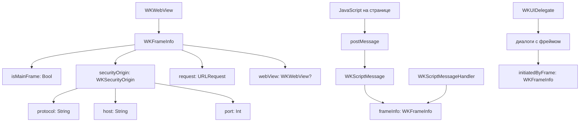

#WKFrameInfo #WebKit #iOS #Swift #WKWebView #Frames #Iframe #Security #JavaScript #WebContent

---
**(информация о фрейме / контекст выполнения в WKWebView)**

**WKFrameInfo** — это класс из фреймворка **[[WebKit]]**, который предоставляет **информацию о фрейме (контексте выполнения)** внутри [[WKWebView]]. Фрейм может быть как **главным** (основное окно), так и **дочерним** (iframe). Этот класс используется для идентификации источника сообщений от JavaScript, определения контекста выполнения скриптов, проверки безопасности и работы с вложенными документами.

**Ключевые особенности (важно в 2026):**
- Позволяет определить, является ли фрейм **главным** или **дочерним**
- Содержит информацию о **безопасном источнике** (`securityOrigin`)
- Предоставляет доступ к **запросу** (`request`), который инициировал загрузку фрейма
- Даёт доступ к **веб-представлению** (`webView`), которому принадлежит фрейм
- Используется в делегатах и обработчиках для принятия решений на основе контекста

---

### Основные свойства WKFrameInfo

| Свойство         | Тип                | Назначение                                                   |
| ---------------- | ------------------ | ------------------------------------------------------------ |
| `isMainFrame`    | [[Bool]]           | Является ли фрейм главным (`true`) или дочерним (iframe)     |
| `securityOrigin` | `WKSecurityOrigin` | Протокол, хост и порт источника фрейма (безопасный контекст) |
| `request`        | [[URLRequest]]     | Запрос, используемый для загрузки содержимого фрейма         |
| `webView`        | `WKWebView?`       | Слабая ссылка на веб-представление, содержащее фрейм         |

---

### Схема взаимосвязей



---

### Примеры (от простого к сложному)

#### 1. Базовое получение информации о фрейме из WKScriptMessage
```swift
import UIKit
import WebKit

class FrameInfoViewController: UIViewController, WKScriptMessageHandler {
    
    private var webView: WKWebView!
    
    override func viewDidLoad() {
        super.viewDidLoad()
        
        let contentController = WKUserContentController()
        contentController.add(self, name: "frameInfoHandler")
        
        let config = WKWebViewConfiguration()
        config.userContentController = contentController
        
        webView = WKWebView(frame: view.bounds, configuration: config)
        view.addSubview(webView)
        
        let html = """
        <html>
        <body>
            <button onclick="sendFromMain()">Отправить из главного фрейма</button>
            <iframe srcdoc="
                <button onclick='sendFromIframe()'>Отправить из iframe</button>
                <script>
                    function sendFromIframe() {
                        window.parent.webkit.messageHandlers.frameInfoHandler.postMessage('Сообщение из iframe');
                    }
                <\/script>
            "></iframe>
            <script>
                function sendFromMain() {
                    window.webkit.messageHandlers.frameInfoHandler.postMessage('Сообщение из главного фрейма');
                }
            </script>
        </body>
        </html>
        """
        webView.loadHTMLString(html, baseURL: nil)
    }
    
    func userContentController(_ userContentController: WKUserContentController,
                               didReceive message: WKScriptMessage) {
        // Извлекаем информацию о фрейме
        let frameInfo = message.frameInfo
        
        print("📩 Получено сообщение: \(message.body)")
        print("📐 Информация о фрейме:")
        print("  isMainFrame: \(frameInfo.isMainFrame)")
        print("  securityOrigin: \(frameInfo.securityOrigin)")
        print("  request: \(frameInfo.request.url?.absoluteString ?? "nil")")
        print("  webView: \(frameInfo.webView?.description ?? "nil")")
        
        if frameInfo.isMainFrame {
            print("  ✅ Это главный фрейм")
        } else {
            print("  ⚠️ Это дочерний фрейм (iframe)")
        }
        
        // Дополнительная информация
        let origin = frameInfo.securityOrigin
        print("  Протокол: \(origin.protocol)")
        print("  Хост: \(origin.host)")
        print("  Порт: \(origin.port)")
    }
    
    deinit {
        webView?.configuration.userContentController.removeScriptMessageHandler(forName: "frameInfoHandler")
    }
}
```

#### 2. Безопасная обработка сообщений с проверкой источника
```swift
class SecurityFrameViewController: UIViewController, WKScriptMessageHandler {
    
    private var webView: WKWebView!
    private let allowedDomains = ["example.com", "localhost"]
    private let allowedProtocols = ["https", "http"]
    
    override func viewDidLoad() {
        super.viewDidLoad()
        
        let contentController = WKUserContentController()
        contentController.add(self, name: "secureMessageHandler")
        
        let config = WKWebViewConfiguration()
        config.userContentController = contentController
        
        webView = WKWebView(frame: view.bounds, configuration: config)
        view.addSubview(webView)
        
        // Загружаем страницу с известным доменом
        if let url = URL(string: "https://example.com") {
            webView.load(URLRequest(url: url))
        }
    }
    
    func userContentController(_ userContentController: WKUserContentController,
                               didReceive message: WKScriptMessage) {
        let frameInfo = message.frameInfo
        let origin = frameInfo.securityOrigin
        
        print("🔐 Проверка источника сообщения...")
        print("  Протокол: \(origin.protocol)")
        print("  Хост: \(origin.host)")
        print("  Порт: \(origin.port)")
        
        // 1. Проверка протокола (только HTTPS для безопасности)
        guard allowedProtocols.contains(origin.protocol) else {
            print("🚫 Неразрешённый протокол: \(origin.protocol)")
            return
        }
        
        // 2. Проверка домена (только разрешённые)
        let isAllowed = allowedDomains.contains { domain in
            origin.host.contains(domain)
        }
        
        guard isAllowed else {
            print("🚫 Неразрешённый домен: \(origin.host)")
            return
        }
        
        // 3. Проверка главного фрейма (можно разрешить только главный)
        guard frameInfo.isMainFrame else {
            print("🚫 Сообщение из iframe игнорируется")
            return
        }
        
        // 4. Проверка URL запроса
        guard let requestURL = frameInfo.request.url,
              requestURL.scheme == "https" else {
            print("🚫 Небезопасный запрос")
            return
        }
        
        // 5. Обработка безопасного сообщения
        print("✅ Сообщение прошло все проверки!")
        print("📩 Обработка: \(message.body)")
        processSecureMessage(message.body)
    }
    
    private func processSecureMessage(_ body: Any) {
        // Безопасная обработка
        print("🔄 Обработка безопасного сообщения...")
    }
    
    deinit {
        webView?.configuration.userContentController.removeScriptMessageHandler(forName: "secureMessageHandler")
    }
}
```

#### 3. Использование WKFrameInfo в [[WKUIDelegate]] для диалогов
```swift
class UIFrameDialogViewController: UIViewController, WKUIDelegate {
    
    private var webView: WKWebView!
    
    override func viewDidLoad() {
        super.viewDidLoad()
        
        let config = WKWebViewConfiguration()
        webView = WKWebView(frame: view.bounds, configuration: config)
        webView.uiDelegate = self
        view.addSubview(webView)
        
        let html = """
        <html>
        <body>
            <button onclick="alert('Главное окно')">Alert из главного</button>
            <iframe srcdoc="
                <button onclick='alert(\"Alert из iframe\")'>Alert из iframe</button>
            "></iframe>
        </body>
        </html>
        """
        webView.loadHTMLString(html, baseURL: nil)
    }
    
    func webView(_ webView: WKWebView,
                 runJavaScriptAlertPanelWithMessage message: String,
                 initiatedByFrame frame: WKFrameInfo,
                 completionHandler: @escaping () -> Void) {
        
        // Определяем источник диалога
        let source = frame.isMainFrame ? "главного окна" : "iframe"
        let origin = frame.securityOrigin
        
        print("📢 Alert из \(source)")
        print("  Хост: \(origin.host)")
        print("  Протокол: \(origin.protocol)")
        print("  Сообщение: \(message)")
        
        // Показываем кастомный диалог с информацией
        let alert = UIAlertController(
            title: "Сообщение из \(source)",
            message: """
                Источник: \(origin.host)
                Сообщение: \(message)
                """,
            preferredStyle: .alert
        )
        alert.addAction(UIAlertAction(title: "OK", style: .default) { _ in
            completionHandler()
        })
        present(alert, animated: true)
    }
}
```

#### 4. Работа с фреймами в [[WKNavigationDelegate]]
```swift
class NavigationFrameViewController: UIViewController, WKNavigationDelegate {
    
    private var webView: WKWebView!
    
    override func viewDidLoad() {
        super.viewDidLoad()
        
        let config = WKWebViewConfiguration()
        webView = WKWebView(frame: view.bounds, configuration: config)
        webView.navigationDelegate = self
        view.addSubview(webView)
        
        let html = """
        <html>
        <body>
            <h1>Главная страница</h1>
            <iframe src="https://example.com"></iframe>
        </body>
        </html>
        """
        webView.loadHTMLString(html, baseURL: nil)
    }
    
    // MARK: - WKNavigationDelegate
    
    func webView(_ webView: WKWebView,
                 decidePolicyFor navigationAction: WKNavigationAction,
                 decisionHandler: @escaping (WKNavigationActionPolicy) -> Void) {
        
        let frameInfo = navigationAction.targetFrame
        
        if let frameInfo = frameInfo {
            print("🔍 Навигация во фрейме:")
            print("  isMainFrame: \(frameInfo.isMainFrame)")
            print("  URL: \(navigationAction.request.url?.absoluteString ?? "nil")")
            
            if frameInfo.isMainFrame {
                print("  ✅ Навигация в главном фрейме")
                decisionHandler(.allow)
            } else {
                print("  ⚠️ Навигация в дочернем фрейме")
                decisionHandler(.allow) // Можно запретить .cancel
            }
        } else {
            print("⚠️ Нет информации о фрейме")
            decisionHandler(.allow)
        }
    }
    
    func webView(_ webView: WKWebView,
                 didFinish navigation: WKNavigation!) {
        print("✅ Загрузка завершена")
    }
    
    func webView(_ webView: WKWebView,
                 didFail navigation: WKNavigation!,
                 withError error: Error) {
        print("❌ Ошибка: \(error)")
    }
}
```

#### 5. Проверка securityOrigin для фильтрации iframe
```swift
class IframeFilterViewController: UIViewController, WKNavigationDelegate {
    
    private var webView: WKWebView!
    private let allowedIframeDomains = ["youtube.com", "vimeo.com"]
    
    override func viewDidLoad() {
        super.viewDidLoad()
        
        let config = WKWebViewConfiguration()
        webView = WKWebView(frame: view.bounds, configuration: config)
        webView.navigationDelegate = self
        view.addSubview(webView)
        
        if let url = URL(string: "https://example.com") {
            webView.load(URLRequest(url: url))
        }
    }
    
    func webView(_ webView: WKWebView,
                 decidePolicyFor navigationAction: WKNavigationAction,
                 decisionHandler: @escaping (WKNavigationActionPolicy) -> Void) {
        
        guard let frameInfo = navigationAction.targetFrame,
              !frameInfo.isMainFrame else {
            decisionHandler(.allow)
            return
        }
        
        // Это iframe
        let origin = frameInfo.securityOrigin
        
        print("🔍 Проверка iframe:")
        print("  Хост: \(origin.host)")
        print("  Протокол: \(origin.protocol)")
        
        // Проверяем, разрешён ли домен
        let isAllowed = allowedIframeDomains.contains { allowedDomain in
            origin.host.contains(allowedDomain)
        }
        
        if isAllowed {
            print("  ✅ Разрешённый iframe")
            decisionHandler(.allow)
        } else {
            print("  🚫 Заблокированный iframe")
            decisionHandler(.cancel)
            
            // Показываем уведомление пользователю
            let alert = UIAlertController(
                title: "Блокировка",
                message: "Контент из \(origin.host) заблокирован",
                preferredStyle: .alert
            )
            alert.addAction(UIAlertAction(title: "OK", style: .default))
            present(alert, animated: true)
        }
    }
}
```

#### 6. Извлечение данных из WKFrameInfo для логирования
```swift
class FrameInfoLogger {
    
    static func logFrameInfo(_ frameInfo: WKFrameInfo, prefix: String = "📐") {
        print("\(prefix) Информация о фрейме:")
        print("  \(prefix) isMainFrame: \(frameInfo.isMainFrame)")
        
        let origin = frameInfo.securityOrigin
        print("  \(prefix) Security Origin:")
        print("    Протокол: \(origin.protocol)")
        print("    Хост: \(origin.host)")
        print("    Порт: \(origin.port)")
        
        print("  \(prefix) Request:")
        print("    URL: \(frameInfo.request.url?.absoluteString ?? "nil")")
        print("    Method: \(frameInfo.request.httpMethod ?? "nil")")
        print("    Headers: \(frameInfo.request.allHTTPHeaderFields ?? [:])")
        
        if let webView = frameInfo.webView {
            print("  \(prefix) WebView: \(webView)")
            print("    URL: \(webView.url?.absoluteString ?? "nil")")
            print("    Title: \(webView.title ?? "nil")")
        } else {
            print("  \(prefix) WebView: nil (возможно, уничтожен)")
        }
    }
    
    static func logFrameInfoCompact(_ frameInfo: WKFrameInfo) -> String {
        let origin = frameInfo.securityOrigin
        let type = frameInfo.isMainFrame ? "MAIN" : "IFRAME"
        return "[\(type)] \(origin.protocol)://\(origin.host):\(origin.port) \(frameInfo.request.url?.path ?? "/")"
    }
}

// Использование
class LoggingViewController: UIViewController, WKScriptMessageHandler {
    
    private var webView: WKWebView!
    
    override func viewDidLoad() {
        super.viewDidLoad()
        
        let contentController = WKUserContentController()
        contentController.add(self, name: "logHandler")
        
        let config = WKWebViewConfiguration()
        config.userContentController = contentController
        
        webView = WKWebView(frame: view.bounds, configuration: config)
        view.addSubview(webView)
        
        let html = """
        <html>
        <body>
            <button onclick="send()">Отправить</button>
            <script>
                function send() {
                    window.webkit.messageHandlers.logHandler.postMessage('Тест');
                }
            </script>
        </body>
        </html>
        """
        webView.loadHTMLString(html, baseURL: nil)
    }
    
    func userContentController(_ userContentController: WKUserContentController,
                               didReceive message: WKScriptMessage) {
        // Полное логирование
        FrameInfoLogger.logFrameInfo(message.frameInfo)
        
        // Компактное логирование
        let compact = FrameInfoLogger.logFrameInfoCompact(message.frameInfo)
        print("📝 Компактно: \(compact)")
    }
    
    deinit {
        webView?.configuration.userContentController.removeScriptMessageHandler(forName: "logHandler")
    }
}
```

#### 7. Сравнение фреймов для предотвращения атак
```swift
class FrameComparisonViewController: UIViewController, WKScriptMessageHandler {
    
    private var webView: WKWebView!
    private var mainFrameSecurityOrigin: WKSecurityOrigin?
    
    override func viewDidLoad() {
        super.viewDidLoad()
        
        let contentController = WKUserContentController()
        contentController.add(self, name: "compareHandler")
        
        let config = WKWebViewConfiguration()
        config.userContentController = contentController
        
        webView = WKWebView(frame: view.bounds, configuration: config)
        view.addSubview(webView)
        
        // Сохраняем источник главного фрейма при загрузке
        webView.evaluateJavaScript("window.location.origin") { [weak self] result, error in
            if let originString = result as? String,
               let url = URL(string: originString) {
                self?.mainFrameSecurityOrigin = WKSecurityOrigin(
                    protocol: url.scheme ?? "",
                    host: url.host ?? "",
                    port: url.port ?? 0
                )
            }
        }
        
        if let url = URL(string: "https://example.com") {
            webView.load(URLRequest(url: url))
        }
    }
    
    func userContentController(_ userContentController: WKUserContentController,
                               didReceive message: WKScriptMessage) {
        let frameInfo = message.frameInfo
        let origin = frameInfo.securityOrigin
        
        guard let mainOrigin = mainFrameSecurityOrigin else {
            print("⚠️ Главный источник не определён")
            return
        }
        
        // Сравниваем источники
        let isSameOrigin = origin.protocol == mainOrigin.protocol &&
                           origin.host == mainOrigin.host &&
                           origin.port == mainOrigin.port
        
        if isSameOrigin {
            print("✅ Сообщение из того же источника (same-origin)")
            processSameOriginMessage(message.body)
        } else {
            print("⚠️ Сообщение из другого источника (cross-origin)")
            print("  Главный: \(mainOrigin.protocol)://\(mainOrigin.host):\(mainOrigin.port)")
            print("  Текущий: \(origin.protocol)://\(origin.host):\(origin.port)")
            
            // Блокируем cross-origin сообщения
            print("🚫 Сообщение заблокировано!")
        }
    }
    
    private func processSameOriginMessage(_ body: Any) {
        print("🔄 Обработка сообщения из того же источника")
    }
    
    deinit {
        webView?.configuration.userContentController.removeScriptMessageHandler(forName: "compareHandler")
    }
}
```

#### 8. Создание WKSecurityOrigin (расширение)
```swift
extension WKSecurityOrigin {
    // Удобный инициализатор из строки
    convenience init?(urlString: String) {
        guard let url = URL(string: urlString),
              let scheme = url.scheme,
              let host = url.host else {
            return nil
        }
        self.init(protocol: scheme, host: host, port: url.port ?? 0)
    }
    
    // Проверка, является ли источник безопасным
    func isSecure() -> Bool {
        return protocol == "https" || host == "localhost"
    }
    
    // Получение полной строки источника
    func fullString() -> String {
        return "\(protocol)://\(host):\(port)"
    }
}

// Использование
class ExtendedSecurityViewController: UIViewController, WKScriptMessageHandler {
    
    private var webView: WKWebView!
    
    override func viewDidLoad() {
        super.viewDidLoad()
        
        let contentController = WKUserContentController()
        contentController.add(self, name: "extendedHandler")
        
        let config = WKWebViewConfiguration()
        config.userContentController = contentController
        
        webView = WKWebView(frame: view.bounds, configuration: config)
        view.addSubview(webView)
        
        let html = """
        <html>
        <body>
            <button onclick="test()">Тест</button>
            <script>
                function test() {
                    window.webkit.messageHandlers.extendedHandler.postMessage('Test');
                }
            </script>
        </body>
        </html>
        """
        webView.loadHTMLString(html, baseURL: nil)
    }
    
    func userContentController(_ userContentController: WKUserContentController,
                               didReceive message: WKScriptMessage) {
        let frameInfo = message.frameInfo
        let origin = frameInfo.securityOrigin
        
        // Используем расширения
        print("📍 Источник: \(origin.fullString())")
        print("🔒 Безопасный: \(origin.isSecure())")
        
        // Создаём из URL
        if let customOrigin = WKSecurityOrigin(urlString: "https://api.example.com:443") {
            print("🔧 Кастомный источник: \(customOrigin.fullString())")
        }
    }
    
    deinit {
        webView?.configuration.userContentController.removeScriptMessageHandler(forName: "extendedHandler")
    }
}
```

---

### Важные нюансы 2026 года

> [!warning]
> **Слабая ссылка на webView:** Свойство `webView` является слабой ссылкой (`weak`), поэтому к моменту получения `WKFrameInfo` `webView` может быть `nil`. Всегда проверяйте перед использованием.
>
> **Security Origin:** `WKSecurityOrigin` — это неизменяемый объект, содержащий протокол, хост и порт. Используйте его для проверки источника контента.
>
> **IFrame:** Фреймы из iframe имеют **собственный** `securityOrigin`, который может отличаться от главного. Всегда проверяйте источник для безопасной обработки.
>
> **Совместное использование:** `WKFrameInfo` используется в нескольких делегатах (`WKNavigationDelegate`, `WKUIDelegate`, `WKScriptMessageHandler`). Всегда используйте его для принятия решений на основе контекста.

---

### Лучшие практики 2026

1. **Всегда проверяйте `isMainFrame`** для определения источника сообщений
2. **Проверяйте `securityOrigin`** для валидации домена и протокола
3. **Не доверяйте сообщениям** из iframe без дополнительной проверки
4. **Используйте `securityOrigin`** для реализации политики same-origin
5. **Логируйте информацию о фреймах** для отладки
6. **Проверяйте `webView` на `nil`** перед использованием
7. **Создавайте расширения** для удобной работы с `WKSecurityOrigin`

---

### Связь с другими темами

- [[WKScriptMessage]] — содержит `frameInfo`
- [[WKNavigationDelegate]] — навигация во фреймах
- [[WKUIDelegate]] — диалоги из фреймов
- [[WKWebView]] — контейнер для фреймов
- [[WKUserScript]] — внедрение скриптов с учётом фреймов