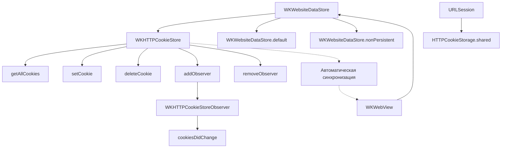

#WKHTTPCookieStore #WebKit #iOS #Swift #Cookies #HTTP #SessionManagement #WKWebsiteDataStore #Security #Persistence

---
**(хранилище HTTP-кук / управление куками в WKWebView)**

**WKHTTPCookieStore** — это класс из фреймворка **[[WebKit]]**, который предоставляет программный доступ к **хранилищу [[HTTP]]-кук** для [[WKWebView]]. Он позволяет управлять куками: читать, добавлять, удалять и наблюдать за их изменениями.

**Ключевые особенности (важно в 2026):**
- Каждый `WKWebsiteDataStore` имеет свой экземпляр `WKHTTPCookieStore`
- Куки автоматически синхронизируются между всеми `WKWebView`, использующими один [[WKWebsiteDataStore]]
- Поддерживает **наблюдение за изменениями** через `add(_: WKHTTPCookieStoreObserver)`
- Работает асинхронно (все методы с completion-блоками или замыканиями)
- **Не сохраняет куки** в `URLSession.shared` (это отдельные хранилища!)

---

### Основные методы WKHTTPCookieStore

| Метод | Назначение | Асинхронность |
|-------|------------|---------------|
| `getAllCookies(_:)` | Получить все куки в хранилище | Да (completion) |
| `setCookie(_:completionHandler:)` | Добавить/обновить куку | Да (completion) |
| `deleteCookie(_:completionHandler:)` | Удалить конкретную куку | Да (completion) |
| `add(_ observer: WKHTTPCookieStoreObserver)` | Подписаться на изменения кук | Нет |
| `remove(_ observer: WKHTTPCookieStoreObserver)` | Отписаться от изменений | Нет |

---

### Схема взаимосвязей



---

### Примеры (от простого к сложному)

#### 1. Получение всех кук из хранилища
```swift
import WebKit

// Получаем хранилище кук из дефолтного data store
let cookieStore = WKWebsiteDataStore.default().httpCookieStore

// Асинхронно получаем все куки
cookieStore.getAllCookies { cookies in
    for cookie in cookies {
        print("Кука: \(cookie.name) = \(cookie.value)")
        print("Домен: \(cookie.domain)")
        print("Путь: \(cookie.path)")
        print("Истекает: \(cookie.expiresDate?.description ?? "сессионная")")
        print("---")
    }
}
```

#### 2. Добавление новой куки
```swift
let cookieStore = WKWebsiteDataStore.default().httpCookieStore

// Создаём HTTPCookie
let properties: [HTTPCookiePropertyKey: Any] = [
    .name: "userSession",
    .value: "abc123xyz",
    .domain: ".example.com",
    .path: "/",
    .expires: Date().addingTimeInterval(3600 * 24 * 7) // 7 дней
]

if let cookie = HTTPCookie(properties: properties) {
    cookieStore.setCookie(cookie) { error in
        if let error = error {
            print("Ошибка при установке куки: \(error)")
        } else {
            print("Кука успешно добавлена!")
        }
    }
}
```

#### 3. Удаление конкретной куки
```swift
let cookieStore = WKWebsiteDataStore.default().httpCookieStore

// Сначала находим куку по имени
cookieStore.getAllCookies { cookies in
    if let cookieToDelete = cookies.first(where: { $0.name == "userSession" }) {
        cookieStore.deleteCookie(cookieToDelete) { error in
            if let error = error {
                print("Ошибка удаления: \(error)")
            } else {
                print("Кука удалена!")
            }
        }
    }
}
```

#### 4. Очистка всех кук
```swift
let cookieStore = WKWebsiteDataStore.default().httpCookieStore

cookieStore.getAllCookies { cookies in
    let group = DispatchGroup()
    
    for cookie in cookies {
        group.enter()
        cookieStore.deleteCookie(cookie) { _ in
            group.leave()
        }
    }
    
    group.notify(queue: .main) {
        print("Все куки удалены! Всего: \(cookies.count)")
    }
}
```

#### 5. Наблюдение за изменениями кук (Observer)
```swift
class CookieManager: NSObject, WKHTTPCookieStoreObserver {
    private let cookieStore = WKWebsiteDataStore.default().httpCookieStore
    
    override init() {
        super.init()
        // Подписываемся на изменения
        cookieStore.add(self)
    }
    
    // Этот метод вызывается при любом изменении кук
    func cookiesDidChange(in cookieStore: WKHTTPCookieStore) {
        print("🔄 Куки изменились!")
        cookieStore.getAllCookies { cookies in
            print("Текущее количество кук: \(cookies.count)")
        }
    }
    
    deinit {
        // ВАЖНО! Отписываемся при уничтожении
        cookieStore.remove(self)
    }
}
```

#### 6. Установка кук до загрузки WKWebView
```swift
class WebViewController: UIViewController {
    private var webView: WKWebView!
    private let cookieStore = WKWebsiteDataStore.default().httpCookieStore
    
    override func viewDidLoad() {
        super.viewDidLoad()
        
        // 1. Настраиваем WKWebView
        let config = WKWebViewConfiguration()
        config.websiteDataStore = .default()
        webView = WKWebView(frame: view.bounds, configuration: config)
        view.addSubview(webView)
        
        // 2. Устанавливаем куки ДО загрузки страницы
        setAuthCookies { [weak self] in
            // 3. Загружаем страницу после установки кук
            if let url = URL(string: "https://example.com/dashboard") {
                self?.webView.load(URLRequest(url: url))
            }
        }
    }
    
    private func setAuthCookies(completion: @escaping () -> Void) {
        let cookieProperties: [HTTPCookiePropertyKey: Any] = [
            .name: "authToken",
            .value: "eyJhbGciOiJIUzI1NiIs...",
            .domain: ".example.com",
            .path: "/",
            .secure: true,
            .expires: Date().addingTimeInterval(3600)
        ]
        
        guard let cookie = HTTPCookie(properties: cookieProperties) else {
            completion()
            return
        }
        
        cookieStore.setCookie(cookie) { _ in
            completion()
        }
    }
}
```

#### 7. Синхронизация кук между WKWebView и URLSession
```swift
class SessionSyncManager {
    private let cookieStore = WKWebsiteDataStore.default().httpCookieStore
    private let urlSession = URLSession.shared
    
    // Синхронизируем куки из WKWebView в URLSession
    func syncWebViewCookiesToURLSession(completion: @escaping () -> Void) {
        cookieStore.getAllCookies { cookies in
            let httpCookieStorage = HTTPCookieStorage.shared
            for cookie in cookies {
                httpCookieStorage.setCookie(cookie)
            }
            completion()
        }
    }
    
    // Синхронизируем куки из URLSession в WKWebView
    func syncURLSessionCookiesToWebView(completion: @escaping () -> Void) {
        guard let cookies = HTTPCookieStorage.shared.cookies else {
            completion()
            return
        }
        
        let group = DispatchGroup()
        for cookie in cookies {
            group.enter()
            self.cookieStore.setCookie(cookie) { _ in
                group.leave()
            }
        }
        
        group.notify(queue: .main) {
            completion()
        }
    }
}
```

#### 8. Использование временного хранилища (куки не сохраняются)
```swift
class PrivateBrowserViewController: UIViewController {
    private var webView: WKWebView!
    
    override func viewDidLoad() {
        super.viewDidLoad()
        
        // Создаём временное хранилище (in-memory)
        let config = WKWebViewConfiguration()
        config.websiteDataStore = WKWebsiteDataStore.nonPersistent()
        // Куки будут жить только пока жив webView
        
        webView = WKWebView(frame: view.bounds, configuration: config)
        view.addSubview(webView)
        
        // Куки из временного хранилища недоступны вне этого webView
        let tempCookieStore = config.websiteDataStore.httpCookieStore
        
        // Устанавливаем куку для сессии
        if let cookie = HTTPCookie(properties: [
            .name: "tempSession",
            .value: UUID().uuidString,
            .domain: "example.com",
            .path: "/"
        ]) {
            tempCookieStore.setCookie(cookie)
        }
    }
}
```

#### 9. Обработка ошибок и повторные попытки
```swift
class RobustCookieManager {
    private let cookieStore = WKWebsiteDataStore.default().httpCookieStore
    
    func setCookieWithRetry(_ cookie: HTTPCookie, maxRetries: Int = 3) {
        setCookieRecursive(cookie, retriesLeft: maxRetries)
    }
    
    private func setCookieRecursive(_ cookie: HTTPCookie, retriesLeft: Int) {
        cookieStore.setCookie(cookie) { [weak self] error in
            if let error = error {
                print("Ошибка установки куки: \(error)")
                
                if retriesLeft > 0 {
                    print("Повторная попытка... осталось: \(retriesLeft)")
                    DispatchQueue.global().asyncAfter(deadline: .now() + 0.5) {
                        self?.setCookieRecursive(cookie, retriesLeft: retriesLeft - 1)
                    }
                } else {
                    print("Не удалось установить куку после всех попыток")
                }
            } else {
                print("Кука успешно установлена!")
            }
        }
    }
}
```

#### 10. Полный менеджер кук с наблюдателем
```swift
class CookieManager: NSObject {
    static let shared = CookieManager()
    
    private let cookieStore = WKWebsiteDataStore.default().httpCookieStore
    private var observers: [UUID: (HTTPCookie) -> Void] = [:]
    
    private override init() {
        super.init()
        cookieStore.add(self)
    }
    
    // Получение куки по имени
    func getCookie(named name: String, completion: @escaping (HTTPCookie?) -> Void) {
        cookieStore.getAllCookies { cookies in
            completion(cookies.first { $0.name == name })
        }
    }
    
    // Установка куки с дополнительными параметрами
    func setCookie(name: String, value: String, domain: String, expiresIn seconds: TimeInterval = 3600) {
        let properties: [HTTPCookiePropertyKey: Any] = [
            .name: name,
            .value: value,
            .domain: domain,
            .path: "/",
            .expires: Date().addingTimeInterval(seconds),
            .secure: true
        ]
        
        if let cookie = HTTPCookie(properties: properties) {
            cookieStore.setCookie(cookie)
        }
    }
    
    // Очистка кук для конкретного домена
    func deleteCookies(for domain: String, completion: @escaping () -> Void) {
        cookieStore.getAllCookies { cookies in
            let group = DispatchGroup()
            
            for cookie in cookies where cookie.domain.contains(domain) {
                group.enter()
                self.cookieStore.deleteCookie(cookie) { _ in
                    group.leave()
                }
            }
            
            group.notify(queue: .main) {
                completion()
            }
        }
    }
    
    deinit {
        cookieStore.remove(self)
    }
}

// MARK: - WKHTTPCookieStoreObserver
extension CookieManager: WKHTTPCookieStoreObserver {
    func cookiesDidChange(in cookieStore: WKHTTPCookieStore) {
        NotificationCenter.default.post(name: .cookiesDidChange, object: nil)
    }
}

extension Notification.Name {
    static let cookiesDidChange = Notification.Name("cookiesDidChange")
}
```

---

### Важные нюансы 2026 года

> [!warning]
> **Асинхронность:** Все методы `WKHTTPCookieStore` работают асинхронно. Не пытайтесь получить куки синхронно — это вызовет зависание.
> 
> **Синхронизация с URLSession:** Куки в `WKHTTPCookieStore` и `HTTPCookieStorage.shared` — это **разные хранилища**. Они не синхронизируются автоматически!
> 
> **Память:** При использовании `WKWebsiteDataStore.nonPersistent()` куки хранятся только в памяти и теряются при уничтожении webView.
> 
> **Безопасность:** Используйте `.secure = true` и `.httpOnly = true` для чувствительных кук.
> 
> **Утечки памяти:** Всегда отписывайтесь от наблюдателя (`remove(_:)`) в `deinit`.
> 
> **iOS 11+:** `WKHTTPCookieStore` доступен с iOS 11. Для более старых версий используйте `HTTPCookieStorage`.

---

### Связь с другими темами

- [[WKWebsiteDataStore]] — контейнер для cookieStore
- [[WKWebViewConfiguration]] — настройка dataStore при создании webView
- [[HTTPCookie]] — объект куки
- [[URLSession]] — синхронизация с сетью
- [[WKUserContentController]] — обмен данными через JS