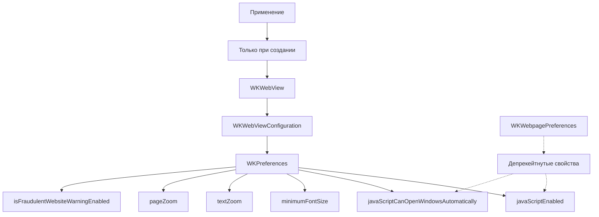

#WKPreferences #WebKit #iOS #Swift #WKWebView #JavaScript #Performance #Accessibility #TextSettings #WebContent

---
**(настройки веб-движка / конфигурация поведения WKWebView)**

**WKPreferences** — это класс из фреймворка **[[WebKit]]**, который содержит **настройки поведения** для `WKWebView`: включение/отключение JavaScript, управление шрифтами, масштабированием текста, настройки доступности и другие параметры рендеринга веб-контента.

**Ключевые особенности (важно в 2026):**
- Является частью `WKWebViewConfiguration`
- Применяется **только при создании** [[WKWebView]]
- В iOS 16+ некоторые свойства **депрекейтнуты** в пользу `WKWebpagePreferences`
- **Неизменяемый** после создания webView
- Влияет на производительность и безопасность

---

### Основные свойства WKPreferences

| Свойство                                | Тип         | Назначение                                                      | iOS версия |
| --------------------------------------- | ----------- | --------------------------------------------------------------- | ---------- |
| `javaScriptEnabled`                     | [[Bool]]    | Включение/отключение JavaScript                                 | 8.0+       |
| `javaScriptCanOpenWindowsAutomatically` | `Bool`      | Разрешить JS открывать окна (через `window.open()`)             | 8.0+       |
| `minimumFontSize`                       | [[CGFloat]] | Минимальный размер шрифта (полезно для доступности)             | 8.0+       |
| `isFraudulentWebsiteWarningEnabled`     | `Bool`      | Включить предупреждения о мошеннических сайтах (Safari-функция) | 14.0+      |
| `tabFocusesLinks`                       | `Bool`      | Переключение между ссылками через Tab (для клавиатуры)          | 15.0+      |
| `textZoom`                              | `CGFloat`   | Масштаб текста (100% = 1.0)                                     | 15.0+      |
| `pageZoom`                              | `CGFloat`   | Масштаб всей страницы                                           | 16.0+      |
| `isSiteSpecificQuirksModeEnabled`       | `Bool`      | Режим совместимости с конкретными сайтами                       | 16.0+      |
| `isElementFullscreenEnabled`            | `Bool`      | Разрешить полноэкранный режим для элементов                     | 16.0+      |
| `isDeveloperExtrasEnabled`              | `Bool`      | Включить инструменты разработчика (только в симуляторе)         | 16.4+      |

---

### Схема взаимосвязей



---

### Примеры (от простого к сложному)

#### 1. Базовые настройки (включение/отключение JS)
```swift
import UIKit
import WebKit

class BasicPreferencesViewController: UIViewController {
    
    private var webView: WKWebView!
    
    override func viewDidLoad() {
        super.viewDidLoad()
        
        let config = WKWebViewConfiguration()
        
        // Настройка preferences
        let preferences = WKPreferences()
        preferences.javaScriptEnabled = true  // Включаем JS (по умолчанию true)
        preferences.javaScriptCanOpenWindowsAutomatically = false // Запрещаем открытие окон
        
        config.preferences = preferences
        
        webView = WKWebView(frame: view.bounds, configuration: config)
        view.addSubview(webView)
        
        // Попытка выполнить JS
        let html = """
        <html>
        <body>
            <h1>Тест JavaScript</h1>
            <div id="result"></div>
            <script>
                document.getElementById('result').textContent = 
                    'JavaScript работает! Время: ' + new Date().toLocaleTimeString();
            </script>
        </body>
        </html>
        """
        webView.loadHTMLString(html, baseURL: nil)
    }
}
```

#### 2. Отключение JavaScript (безопасность/производительность)
```swift
class JavaScriptDisabledViewController: UIViewController {
    
    private var webView: WKWebView!
    
    override func viewDidLoad() {
        super.viewDidLoad()
        
        let config = WKWebViewConfiguration()
        
        // Отключаем JavaScript
        let preferences = WKPreferences()
        preferences.javaScriptEnabled = false
        
        config.preferences = preferences
        
        webView = WKWebView(frame: view.bounds, configuration: config)
        view.addSubview(webView)
        
        // JS не будет выполняться
        let html = """
        <html>
        <body>
            <div id="jsTest"></div>
            <script>
                document.getElementById('jsTest').textContent = 'Этот текст не появится';
            </script>
            <p>Если вы видите этот текст, JS отключён ✅</p>
        </body>
        </html>
        """
        webView.loadHTMLString(html, baseURL: nil)
    }
}
```

#### 3. Настройка минимального размера шрифта (доступность)
```swift
class AccessibilityViewController: UIViewController {
    
    private var webView: WKWebView!
    
    override func viewDidLoad() {
        super.viewDidLoad()
        
        let config = WKWebViewConfiguration()
        
        let preferences = WKPreferences()
        preferences.minimumFontSize = 14.0 // Минимальный размер шрифта
        // Даже если в HTML указан меньший размер, будет 14pt
        
        config.preferences = preferences
        
        webView = WKWebView(frame: view.bounds, configuration: config)
        view.addSubview(webView)
        
        let html = """
        <html>
        <body>
            <p style="font-size: 8px;">Этот текст 8px, но будет отображаться 14pt</p>
            <p style="font-size: 20px;">Этот текст 20px, будет 20pt</p>
            <p>Обычный текст (по умолчанию 16px)</p>
        </body>
        </html>
        """
        webView.loadHTMLString(html, baseURL: nil)
    }
}
```

#### 4. Настройка масштаба текста (textZoom)
```swift
class TextZoomViewController: UIViewController {
    
    private var webView: WKWebView!
    
    override func viewDidLoad() {
        super.viewDidLoad()
        
        let config = WKWebViewConfiguration()
        
        let preferences = WKPreferences()
        preferences.textZoom = 1.5 // 150% от нормального размера
        
        config.preferences = preferences
        
        webView = WKWebView(frame: view.bounds, configuration: config)
        view.addSubview(webView)
        
        let html = """
        <html>
        <body>
            <h1>Масштаб текста 150%</h1>
            <p>Весь текст будет увеличен на 50%</p>
            <p style="font-size: 16px;">Этот текст 16px будет выглядеть как 24px</p>
        </body>
        </html>
        """
        webView.loadHTMLString(html, baseURL: nil)
    }
}
```

#### 5. Настройка масштаба страницы (pageZoom - iOS 16+)
```swift
@available(iOS 16.0, *)
class PageZoomViewController: UIViewController {
    
    private var webView: WKWebView!
    
    override func viewDidLoad() {
        super.viewDidLoad()
        
        let config = WKWebViewConfiguration()
        
        let preferences = WKPreferences()
        preferences.pageZoom = 0.8 // 80% от нормального размера
        
        config.preferences = preferences
        
        webView = WKWebView(frame: view.bounds, configuration: config)
        view.addSubview(webView)
        
        let html = """
        <html>
        <body>
            <h1>Масштаб страницы 80%</h1>
            <p>Вся страница уменьшена до 80%</p>
            <rect width='200' height='100' fill='red'/></svg>" />
        </body>
        </html>
        """
        webView.loadHTMLString(html, baseURL: nil)
    }
}
```

#### 6. Включение предупреждений о мошеннических сайтах
```swift
class FraudulentWebsiteWarningViewController: UIViewController, WKNavigationDelegate {
    
    private var webView: WKWebView!
    
    override func viewDidLoad() {
        super.viewDidLoad()
        
        let config = WKWebViewConfiguration()
        
        let preferences = WKPreferences()
        if #available(iOS 14.0, *) {
            preferences.isFraudulentWebsiteWarningEnabled = true
        }
        
        config.preferences = preferences
        
        webView = WKWebView(frame: view.bounds, configuration: config)
        webView.navigationDelegate = self
        view.addSubview(webView)
        
        // При загрузке подозрительного сайта Safari покажет предупреждение
        // (работает только с Safari-движком)
        if let url = URL(string: "https://example.com") {
            webView.load(URLRequest(url: url))
        }
    }
}
```

#### 7. Включение разработческих инструментов (iOS 16.4+)
```swift
@available(iOS 16.4, *)
class DeveloperExtrasViewController: UIViewController {
    
    private var webView: WKWebView!
    
    override func viewDidLoad() {
        super.viewDidLoad()
        
        let config = WKWebViewConfiguration()
        
        let preferences = WKPreferences()
        // Включаем инструменты разработчика (работает только в симуляторе)
        preferences.isDeveloperExtrasEnabled = true
        
        config.preferences = preferences
        
        webView = WKWebView(frame: view.bounds, configuration: config)
        view.addSubview(webView)
        
        // Теперь можно использовать Safari Web Inspector
        // (в симуляторе → Safari → Develop → Simulator)
        
        let html = """
        <html>
        <body>
            <h1>Откройте Web Inspector</h1>
            <p>В симуляторе: Safari → Develop → Simulator</p>
            <div id="test">Инспектируйте этот элемент</div>
        </body>
        </html>
        """
        webView.loadHTMLString(html, baseURL: nil)
    }
}
```

#### 8. Полная конфигурация для продакшена
```swift
class ProductionPreferencesViewController: UIViewController {
    
    private var webView: WKWebView!
    
    override func viewDidLoad() {
        super.viewDidLoad()
        
        let config = WKWebViewConfiguration()
        let preferences = WKPreferences()
        
        // Базовые настройки
        preferences.javaScriptEnabled = true
        preferences.javaScriptCanOpenWindowsAutomatically = false
        
        // Доступность
        preferences.minimumFontSize = 12.0
        
        // Масштабирование (iOS 15+)
        if #available(iOS 15.0, *) {
            preferences.textZoom = 1.0
        }
        
        // Безопасность (iOS 14+)
        if #available(iOS 14.0, *) {
            preferences.isFraudulentWebsiteWarningEnabled = true
        }
        
        // Производительность (iOS 16+)
        if #available(iOS 16.0, *) {
            preferences.isSiteSpecificQuirksModeEnabled = true
            preferences.pageZoom = 1.0
        }
        
        // Дебаг (только в Debug)
        #if DEBUG
        if #available(iOS 16.4, *) {
            preferences.isDeveloperExtrasEnabled = true
        }
        #endif
        
        config.preferences = preferences
        
        webView = WKWebView(frame: view.bounds, configuration: config)
        view.addSubview(webView)
        
        if let url = URL(string: "https://example.com") {
            webView.load(URLRequest(url: url))
        }
    }
}
```

#### 9. Динамическое изменение настроек (через пересоздание)
```swift
class DynamicPreferencesViewController: UIViewController {
    
    private var webView: WKWebView!
    private var currentUrl: URL?
    
    override func viewDidLoad() {
        super.viewDidLoad()
        setupWebView(jsEnabled: true)
    }
    
    private func setupWebView(jsEnabled: Bool) {
        // Удаляем старый webView
        webView?.removeFromSuperview()
        
        // Создаём новую конфигурацию
        let config = WKWebViewConfiguration()
        let preferences = WKPreferences()
        preferences.javaScriptEnabled = jsEnabled
        config.preferences = preferences
        
        webView = WKWebView(frame: view.bounds, configuration: config)
        webView.autoresizingMask = [.flexibleWidth, .flexibleHeight]
        view.addSubview(webView)
        
        // Перезагружаем текущую страницу
        if let url = currentUrl {
            webView.load(URLRequest(url: url))
        }
    }
    
    @IBAction func toggleJavaScript(_ sender: UISwitch) {
        setupWebView(jsEnabled: sender.isOn)
    }
    
    @IBAction func loadPage(_ sender: Any) {
        currentUrl = URL(string: "https://example.com")
        if let url = currentUrl {
            webView.load(URLRequest(url: url))
        }
    }
}
```

#### 10. Использование с WKWebpagePreferences (iOS 16+)
```swift
@available(iOS 16.0, *)
class WebpagePreferencesViewController: UIViewController, WKNavigationDelegate {
    
    private var webView: WKWebView!
    
    override func viewDidLoad() {
        super.viewDidLoad()
        
        // 1. Настройка через WKPreferences (глобальные)
        let config = WKWebViewConfiguration()
        let preferences = WKPreferences()
        preferences.javaScriptEnabled = true
        config.preferences = preferences
        
        webView = WKWebView(frame: view.bounds, configuration: config)
        webView.navigationDelegate = self
        view.addSubview(webView)
        
        if let url = URL(string: "https://example.com") {
            webView.load(URLRequest(url: url))
        }
    }
    
    // 2. Настройка через WKWebpagePreferences (для конкретной навигации)
    func webView(_ webView: WKWebView, 
                 decidePolicyFor navigationAction: WKNavigationAction,
                 preferences: WKWebpagePreferences) async -> (WKNavigationActionPolicy, WKWebpagePreferences) {
        
        // Можно настроить поведение для конкретной страницы
        let customPreferences = WKWebpagePreferences()
        customPreferences.preferredContentMode = .mobile // Мобильный режим
        
        // Для определённых URL используем десктопный режим
        if let url = navigationAction.request.url,
           url.host == "desktop.example.com" {
            customPreferences.preferredContentMode = .desktop
        }
        
        return (.allow, customPreferences)
    }
}
```

#### 11. Полный менеджер преференсов
```swift
class PreferencesManager {
    
    // Настройки по умолчанию для приложения
    static func defaultPreferences() -> WKPreferences {
        let preferences = WKPreferences()
        
        // Безопасность
        preferences.javaScriptEnabled = true
        preferences.javaScriptCanOpenWindowsAutomatically = false
        
        // Доступность
        preferences.minimumFontSize = 12.0
        
        if #available(iOS 14.0, *) {
            preferences.isFraudulentWebsiteWarningEnabled = true
        }
        
        if #available(iOS 15.0, *) {
            preferences.textZoom = 1.0
            preferences.tabFocusesLinks = true
        }
        
        if #available(iOS 16.0, *) {
            preferences.pageZoom = 1.0
            preferences.isElementFullscreenEnabled = true
        }
        
        #if DEBUG
        if #available(iOS 16.4, *) {
            preferences.isDeveloperExtrasEnabled = true
        }
        #endif
        
        return preferences
    }
    
    // Настройки для минималистичного режима (только текст)
    static func minimalPreferences() -> WKPreferences {
        let preferences = WKPreferences()
        preferences.javaScriptEnabled = false
        preferences.minimumFontSize = 16.0
        
        if #available(iOS 15.0, *) {
            preferences.textZoom = 1.2
        }
        
        return preferences
    }
    
    // Настройки для высокопроизводительного режима
    static func performancePreferences() -> WKPreferences {
        let preferences = WKPreferences()
        preferences.javaScriptEnabled = true
        preferences.javaScriptCanOpenWindowsAutomatically = false
        
        if #available(iOS 16.0, *) {
            preferences.isSiteSpecificQuirksModeEnabled = false // Отключаем для производительности
        }
        
        return preferences
    }
    
    // Настройки для режима разработчика
    static func developerPreferences() -> WKPreferences {
        let preferences = defaultPreferences()
        
        #if DEBUG
        if #available(iOS 16.4, *) {
            preferences.isDeveloperExtrasEnabled = true
        }
        #endif
        
        preferences.javaScriptCanOpenWindowsAutomatically = true
        
        return preferences
    }
}

// Использование
class MainWebViewController: UIViewController {
    
    override func viewDidLoad() {
        super.viewDidLoad()
        
        let config = WKWebViewConfiguration()
        config.preferences = PreferencesManager.defaultPreferences()
        
        let webView = WKWebView(frame: view.bounds, configuration: config)
        // ...
    }
}
```

#### 12. Отслеживание изменений настроек (рекомендации)
```swift
class SettingsViewController: UIViewController {
    
    private var webView: WKWebView!
    
    // Обновляем настройки при изменении в Settings
    override func viewWillAppear(_ animated: Bool) {
        super.viewWillAppear(animated)
        
        let userDefaults = UserDefaults.standard
        let isJSEnabled = userDefaults.bool(forKey: "jsEnabled")
        let fontSize = userDefaults.double(forKey: "minFontSize")
        
        // Пересоздаём webView с новыми настройками
        recreateWebView(jsEnabled: isJSEnabled, minFontSize: fontSize)
    }
    
    private func recreateWebView(jsEnabled: Bool, minFontSize: Double) {
        // Сохраняем текущий URL
        let currentURL = webView?.url
        
        // Удаляем старый
        webView?.removeFromSuperview()
        
        // Создаём новый с новыми настройками
        let config = WKWebViewConfiguration()
        let preferences = WKPreferences()
        preferences.javaScriptEnabled = jsEnabled
        preferences.minimumFontSize = CGFloat(minFontSize)
        config.preferences = preferences
        
        webView = WKWebView(frame: view.bounds, configuration: config)
        webView.autoresizingMask = [.flexibleWidth, .flexibleHeight]
        view.addSubview(webView)
        
        // Перезагружаем страницу
        if let url = currentURL {
            webView.load(URLRequest(url: url))
        }
    }
}
```

---

### Важные нюансы 2026 года

> [!warning]
> **Неизменяемость:** Настройки применяются **только при создании** `WKWebView` и не могут быть изменены после.
> 
> **Депрекейтнутые свойства:** В iOS 16+ некоторые свойства `WKPreferences` депрекейтнуты в пользу `WKWebpagePreferences`.
> 
> **Зависимость от версии:** Многие свойства доступны только с определённых версий iOS. Используйте `@available` или проверки.
> 
> **Производительность:** Отключение JavaScript улучшает производительность и безопасность, но ломает современные сайты.
> 
> **Доступность:** `minimumFontSize` и `textZoom` помогают пользователям с ограниченными возможностями.
> 
> **Безопасность:** `isFraudulentWebsiteWarningEnabled` защищает от фишинга (работает только на реальном устройстве).

---

### Лучшие практики 2026

1. **Используйте `@available`** для проверки версий iOS
2. **Создавайте шаблоны настроек** (`default`, `minimal`, `performance`)
3. **Пересоздавайте webView** при изменении настроек
4. **Отключайте JavaScript** для страниц, где он не нужен
5. **Включайте предупреждения** о мошеннических сайтах в продакшене
6. **Используйте минимальный размер шрифта** для доступности
7. **Тестируйте** с разными настройками
8. **Включайте `isDeveloperExtrasEnabled`** только в Debug

---

### Связь с другими темами

- [[WKWebViewConfiguration]] — контейнер для preferences
- [[WKWebpagePreferences]] — альтернатива для отдельных страниц (iOS 16+)
- [[WKWebView]] — основная вьюшка
- [[WebKit]] — общий фреймворк