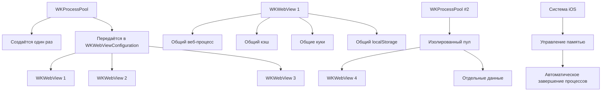

#WKProcessPool #WebKit #iOS #Swift #WKWebView #Performance #MemoryManagement #SessionSharing #ProcessIsolation #WebContent

---
**(пул процессов / общий веб-движок для [[WKWebView]])**

**WKProcessPool** — это класс из фреймворка **[[WebKit]]**, который представляет собой **общий пул веб-процессов** для нескольких экземпляров `WKWebView`. Он позволяет разделять между вьюшками один и тот же процесс (или пул процессов), что обеспечивает **общее хранилище** (куки, localStorage, кэш) и **экономию памяти**.

**Ключевые особенности (важно в 2026):**
- Создаётся **один раз** и используется для всех `WKWebView`, которым нужна общая сессия
- **Неизменяемый** объект — после создания его нельзя модифицировать
- Каждый [[WKProcessPool]] изолирован от других — данные не пересекаются
- **Автоматически** управляет жизненным циклом веб-процессов
- При уничтожении всех `WKWebView` процесс может быть завершён системой

---

### Основные свойства и методы WKProcessPool

| Компонент | Тип | Назначение |
|-----------|-----|------------|
| `init()` | `WKProcessPool` | Создание нового пула процессов |
| `processPool` (свойство в конфигурации) | `WKProcessPool?` | Привязка пула к конфигурации |

> **Важно:** У `WKProcessPool` нет публичных методов или свойств для доступа к данным. Он работает как "чёрный ящик" — вы просто передаёте его в конфигурацию, а WebKit сам управляет процессами.

---

### Схема взаимосвязей



---

### Примеры (от простого к сложному)

#### 1. Базовое использование (общий пул для двух вьюшек)
```swift
import WebKit

class SharedProcessViewController: UIViewController {
    private var webView1: WKWebView!
    private var webView2: WKWebView!
    
    override func viewDidLoad() {
        super.viewDidLoad()
        
        // 1. Создаём ОДИН процесс-пул на всё приложение
        let sharedPool = WKProcessPool()
        
        // 2. Создаём конфигурации с общим пулом
        let config1 = WKWebViewConfiguration()
        config1.processPool = sharedPool
        
        let config2 = WKWebViewConfiguration()
        config2.processPool = sharedPool
        
        // 3. Создаём две вьюшки с общей конфигурацией
        webView1 = WKWebView(frame: CGRect(x: 0, y: 0, width: 400, height: 300), 
                            configuration: config1)
        webView2 = WKWebView(frame: CGRect(x: 0, y: 350, width: 400, height: 300), 
                            configuration: config2)
        
        // 4. Теперь куки, localStorage и кэш общие для обеих вьюшек
        view.addSubview(webView1)
        view.addSubview(webView2)
        
        // Загружаем сайт в первой вьюшке
        if let url = URL(string: "https://example.com") {
            webView1.load(URLRequest(url: url))
        }
        
        // Вторая вьюшка получит те же куки/сессию автоматически
        DispatchQueue.main.asyncAfter(deadline: .now() + 2) {
            if let url = URL(string: "https://example.com/profile") {
                self.webView2.load(URLRequest(url: url))
            }
        }
    }
}
```

#### 2. Одиночный пул через синглтон (рекомендуемый подход)
```swift
class WebProcessManager {
    static let shared = WebProcessManager()
    
    // Один пул на всё приложение
    let sharedProcessPool: WKProcessPool
    
    private init() {
        sharedProcessPool = WKProcessPool()
        print("✅ WKProcessPool создан")
    }
}

// Использование в любом месте приложения
class ViewController1: UIViewController {
    override func viewDidLoad() {
        super.viewDidLoad()
        
        let config = WKWebViewConfiguration()
        config.processPool = WebProcessManager.shared.sharedProcessPool
        
        let webView = WKWebView(frame: view.bounds, configuration: config)
        // ... загрузка
    }
}

class ViewController2: UIViewController {
    override func viewDidLoad() {
        super.viewDidLoad()
        
        let config = WKWebViewConfiguration()
        config.processPool = WebProcessManager.shared.sharedProcessPool
        
        let webView = WKWebView(frame: view.bounds, configuration: config)
        // ... загрузка
    }
}
```

#### 3. Изолированные пулы (разные сессии)
```swift
class IsolatedPoolsViewController: UIViewController {
    private var guestWebView: WKWebView!
    private var userWebView: WKWebView!
    
    override func viewDidLoad() {
        super.viewDidLoad()
        
        // Пул для гостя (без сессии)
        let guestPool = WKProcessPool()
        let guestConfig = WKWebViewConfiguration()
        guestConfig.processPool = guestPool
        guestConfig.websiteDataStore = WKWebsiteDataStore.nonPersistent() // нет сохранения
        
        guestWebView = WKWebView(frame: CGRect(x: 0, y: 0, width: 400, height: 300), 
                                configuration: guestConfig)
        
        // Пул для авторизованного пользователя
        let userPool = WKProcessPool()
        let userConfig = WKWebViewConfiguration()
        userConfig.processPool = userPool
        userConfig.websiteDataStore = .default() // сохраняем данные
        
        userWebView = WKWebView(frame: CGRect(x: 0, y: 350, width: 400, height: 300), 
                               configuration: userConfig)
        
        // Каждая вьюшка имеет ИЗОЛИРОВАННЫЕ куки и localStorage
        view.addSubview(guestWebView)
        view.addSubview(userWebView)
        
        // Загружаем разные страницы с разными сессиями
        guestWebView.load(URLRequest(url: URL(string: "https://example.com")!))
        userWebView.load(URLRequest(url: URL(string: "https://example.com/profile")!))
    }
}
```

#### 4. Совместное использование кук и авторизации
```swift
class AuthWebViewController: UIViewController {
    private var authWebView: WKWebView!
    private var apiWebView: WKWebView!
    private let sharedPool = WKProcessPool()
    
    override func viewDidLoad() {
        super.viewDidLoad()
        
        // Обе вьюшки используют ОДИН процесс-пул
        let config1 = WKWebViewConfiguration()
        config1.processPool = sharedPool
        authWebView = WKWebView(frame: CGRect(x: 0, y: 0, width: 400, height: 250), 
                               configuration: config1)
        
        let config2 = WKWebViewConfiguration()
        config2.processPool = sharedPool
        apiWebView = WKWebView(frame: CGRect(x: 0, y: 300, width: 400, height: 250), 
                              configuration: config2)
        
        view.addSubview(authWebView)
        view.addSubview(apiWebView)
        
        // Шаг 1: Авторизация в первой вьюшке
        authWebView.load(URLRequest(url: URL(string: "https://example.com/login")!))
        
        // Шаг 2: После авторизации куки сохраняются в общем процессе
        // Шаг 3: Вторая вьюшка автоматически использует те же куки для API-запросов
        DispatchQueue.main.asyncAfter(deadline: .now() + 5) {
            // Загружаем защищённый API эндпоинт
            self.apiWebView.load(URLRequest(url: URL(string: "https://example.com/api/user")!))
        }
    }
}
```

#### 5. Управление памятью с WKProcessPool
```swift
class MemoryManager {
    static func createLightweightWebView() -> WKWebView {
        // Используем общий пул для экономии памяти
        let config = WKWebViewConfiguration()
        config.processPool = WebProcessManager.shared.sharedProcessPool
        
        // Отключаем ненужные функции
        let preferences = WKPreferences()
        preferences.javaScriptEnabled = true
        config.preferences = preferences
        
        // Используем общее хранилище
        config.websiteDataStore = .default()
        
        return WKWebView(frame: .zero, configuration: config)
    }
    
    // Создаём несколько вьюшек с общим пулом
    static func createMultipleWebViews(count: Int) -> [WKWebView] {
        var webViews: [WKWebView] = []
        let pool = WebProcessManager.shared.sharedProcessPool
        
        for _ in 0..<count {
            let config = WKWebViewConfiguration()
            config.processPool = pool
            let webView = WKWebView(frame: .zero, configuration: config)
            webViews.append(webView)
        }
        
        return webViews
    }
}

// Использование
class ViewController: UIViewController {
    private var webViews: [WKWebView] = []
    
    override func viewDidLoad() {
        super.viewDidLoad()
        
        // Создаём 5 вьюшек с одним процессом
        webViews = MemoryManager.createMultipleWebViews(count: 5)
        
        // Располагаем их в сетке
        for (index, webView) in webViews.enumerated() {
            webView.frame = CGRect(x: 0, y: CGFloat(index * 100), 
                                  width: 400, height: 90)
            view.addSubview(webView)
            
            if let url = URL(string: "https://example.com/page/\(index)") {
                webView.load(URLRequest(url: url))
            }
        }
        
        // Все 5 вьюшек используют ОДИН процесс → экономия памяти до 70%
        print("Общий процесс-пул используется для \(webViews.count) вьюшек")
    }
}
```

#### 6. Очистка данных при использовании общего пула
```swift
class CacheManager {
    private let processPool = WebProcessManager.shared.sharedProcessPool
    
    func clearSharedData(completion: @escaping () -> Void) {
        // 1. Очищаем веб-данные
        let websiteDataTypes = WKWebsiteDataStore.allWebsiteDataTypes()
        let date = Date(timeIntervalSince1970: 0)
        
        WKWebsiteDataStore.default().removeData(
            ofTypes: websiteDataTypes,
            modifiedSince: date
        ) {
            print("🗑️ Веб-данные очищены")
            
            // 2. Очищаем куки из HTTPCookieStorage
            if let cookies = HTTPCookieStorage.shared.cookies {
                for cookie in cookies {
                    HTTPCookieStorage.shared.deleteCookie(cookie)
                }
            }
            
            // 3. Создаём НОВЫЙ пул процессов (старый больше не используется)
            // Но мы не можем пересоздать существующий пул
            // Поэтому при необходимости создаём новый и заменяем в синглтоне
            WebProcessManager.shared.replacePool(with: WKProcessPool())
            
            completion()
        }
    }
}

// Расширение для замены пула в синглтоне
extension WebProcessManager {
    func replacePool(with newPool: WKProcessPool) {
        // В реальном приложении нужно обновить все вьюшки
        // или пересоздать их с новым пулом
        // sharedProcessPool = newPool // (нельзя, так как константа)
        // Поэтому лучше использовать var и менять
    }
}
```

#### 7. Отладка и мониторинг процессов
```swift
class ProcessMonitor {
    static func logProcessInfo() {
        // К сожалению, WKProcessPool не даёт прямого доступа к информации о процессах
        // Но можно отслеживать использование памяти через Instruments
        
        print("📊 Мониторинг WKProcessPool:")
        print("• Пул создан: \(WebProcessManager.shared.sharedProcessPool)")
        print("• Пул неизменяемый и не даёт информации о процессах")
        print("• Для отладки используйте Instruments → Allocations")
        
        // Проверяем количество живых webView (косвенно)
        let webViewCount = UIApplication.shared.windows
            .flatMap { $0.subviews }
            .filter { $0 is WKWebView }
            .count
        
        print("• Активных WKWebView: \(webViewCount)")
    }
}

// Использование
ProcessMonitor.logProcessInfo()
```

#### 8. Полноценная архитектура с WKProcessPool (production)
```swift
// MARK: - Менеджер процессов
final class ProcessPoolManager {
    static let shared = ProcessPoolManager()
    
    // Основной пул для пользовательской сессии
    let userSessionPool: WKProcessPool
    
    // Пулы для изолированных задач
    private var isolatedPools: [String: WKProcessPool] = [:]
    private let lock = NSLock()
    
    private init() {
        userSessionPool = WKProcessPool()
        print("✅ Создан основной WKProcessPool для пользовательской сессии")
    }
    
    // Получение изолированного пула
    func getIsolatedPool(id: String) -> WKProcessPool {
        lock.lock()
        defer { lock.unlock() }
        
        if let existingPool = isolatedPools[id] {
            return existingPool
        }
        
        let newPool = WKProcessPool()
        isolatedPools[id] = newPool
        print("🆕 Создан изолированный пул для: \(id)")
        return newPool
    }
    
    // Очистка изолированного пула
    func clearIsolatedPool(id: String) {
        lock.lock()
        defer { lock.unlock() }
        
        isolatedPools.removeValue(forKey: id)
        print("🗑️ Удалён изолированный пул для: \(id)")
    }
}

// MARK: - Базовый контроллер с webView
class BaseWebViewController: UIViewController {
    var webView: WKWebView!
    let processPool: WKProcessPool
    
    init(processPool: WKProcessPool) {
        self.processPool = processPool
        super.init(nibName: nil, bundle: nil)
    }
    
    required init?(coder: NSCoder) {
        fatalError("init(coder:) has not been implemented")
    }
    
    override func viewDidLoad() {
        super.viewDidLoad()
        
        let config = WKWebViewConfiguration()
        config.processPool = processPool
        config.websiteDataStore = .default()
        
        webView = WKWebView(frame: view.bounds, configuration: config)
        webView.autoresizingMask = [.flexibleWidth, .flexibleHeight]
        view.addSubview(webView)
    }
}

// MARK: - Использование
class DashboardViewController: BaseWebViewController {
    init() {
        super.init(processPool: ProcessPoolManager.shared.userSessionPool)
    }
    
    required init?(coder: NSCoder) {
        fatalError("init(coder:) has not been implemented")
    }
    
    override func viewDidLoad() {
        super.viewDidLoad()
        // Загружаем дашборд с пользовательской сессией
        webView.load(URLRequest(url: URL(string: "https://app.example.com/dashboard")!))
    }
}

class PrivateBrowserViewController: BaseWebViewController {
    private let sessionId = UUID().uuidString
    
    init() {
        let isolatedPool = ProcessPoolManager.shared.getIsolatedPool(id: UUID().uuidString)
        super.init(processPool: isolatedPool)
    }
    
    required init?(coder: NSCoder) {
        fatalError("init(coder:) has not been implemented")
    }
    
    override func viewDidLoad() {
        super.viewDidLoad()
        // Изолированная сессия — не влияет на основную
        webView.load(URLRequest(url: URL(string: "https://example.com")!))
    }
    
    deinit {
        // Очищаем пул при уничтожении
        ProcessPoolManager.shared.clearIsolatedPool(id: sessionId)
    }
}
```

---

### Важные нюансы 2026 года

> [!warning]
> **Неизменяемость:** `WKProcessPool` создаётся один раз и не может быть изменён. Для смены пула нужно пересоздавать `WKWebView`.
> 
> **Общие данные:** Все `WKWebView` с одним `WKProcessPool` разделяют куки, localStorage, sessionStorage и кэш.
> 
> **Безопасность:** Для изолированных сессий (например, гостевой режим) всегда используйте **разные** `WKProcessPool`.
> 
> **Память:** Чем больше `WKProcessPool` — тем больше памяти использует приложение. Обычно достаточно **одного** основного пула.
> 
> **Утечки памяти:** `WKProcessPool` не вызывает утечек, но если `WKWebView` не удаляются, процессы могут оставаться в памяти.
> 
> **iOS 16+:** В новых версиях iOS WebKit более агрессивно управляет процессами, может завершать неиспользуемые.
> 
> **Отладка:** Нет прямого доступа к процессам через API. Используйте **Instruments** (Allocations, Leaks) для мониторинга.

---

### Лучшие практики 2026

1. **Создавайте один глобальный пул** для всей пользовательской сессии
2. **Используйте синглтон** для доступа к пулу из любого места приложения
3. **Создавайте отдельные пулы** для инкогнито/гостевых режимов
4. **Очищайте изолированные пулы** при выходе из режима
5. **Не создавайте пулы для каждой вьюшки** — это убивает производительность
6. **Сочетайте с `WKWebsiteDataStore`**: 
   - `.default()` + общий пул = общие данные
   - `.nonPersistent()` + общий пул = общий процесс, но данные не сохраняются
7. **Мониторьте память** через `didReceiveMemoryWarning()` и освобождайте ненужные вьюшки

---

### Связь с другими темами

- [[WKWebViewConfiguration]] — передача processPool при создании
- [[WKWebsiteDataStore]] — управление данными в процессе
- [[WKHTTPCookieStore]] — куки в общем процессе
- [[WKPreferences]] — настройки для процесса
- [[WebKit]] — общий фреймворк