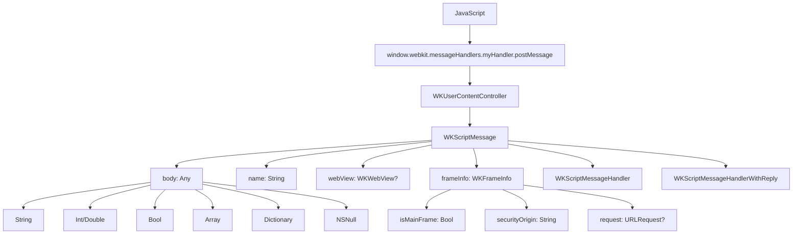

#WKScriptMessage #WebKit #iOS #Swift #JavaScriptBridge #WKUserContentController #ScriptMessageHandler #Communication #WebContent

---
**(сообщение из JavaScript / объект данных от веб-контента)**

**WKScriptMessage** — это класс из фреймворка **[[WebKit]]**, который представляет собой **сообщение**, отправленное из JavaScript в нативный код через [[WKScriptMessageHandler]] или [[WKScriptMessageHandlerWithReply]]. Этот объект содержит данные от веб-страницы, информацию об отправителе и контекст выполнения.

**Ключевые особенности (важно в 2026):**
- Содержит **данные** из JavaScript (`body`) — могут быть строкой, числом, массивом, словарём
- Хранит **имя обработчика** (`name`), через которое было отправлено сообщение
- Содержит **ссылку на [[WKWebView]]**, отправившую сообщение
- Включает **информацию о фрейме** (`frameInfo`) — главный или дочерний
- Используется как параметр в обоих протоколах: `WKScriptMessageHandler` и `WKScriptMessageHandlerWithReply`

---

### Структура WKScriptMessage

```swift
class WKScriptMessage : NSObject {
    // Данные из JavaScript (Any — может быть String, Int, Bool, Array, Dictionary, NSNull)
    var body: Any { get }
    
    // Имя обработчика (то, что указано в add(_:name:))
    var name: String { get }
    
    // Ссылка на WKWebView, отправившую сообщение (слабая)
    weak var webView: WKWebView? { get }
    
    // Информация о фрейме (главный/дочерний)
    var frameInfo: WKFrameInfo { get }
}
```

---

### Схема взаимосвязей



---

### Примеры (от простого к сложному)

#### 1. Базовое получение сообщения (все свойства)
```swift
import UIKit
import WebKit

class ScriptMessageViewController: UIViewController, WKScriptMessageHandler {
    
    private var webView: WKWebView!
    
    override func viewDidLoad() {
        super.viewDidLoad()
        
        let contentController = WKUserContentController()
        contentController.add(self, name: "testHandler")
        
        let config = WKWebViewConfiguration()
        config.userContentController = contentController
        
        webView = WKWebView(frame: view.bounds, configuration: config)
        view.addSubview(webView)
        
        let html = """
        <html>
        <body>
            <button onclick="sendMessage()">Отправить сообщение</button>
            <script>
                function sendMessage() {
                    window.webkit.messageHandlers.testHandler.postMessage({
                        text: 'Привет из JS!',
                        timestamp: Date.now()
                    });
                }
            </script>
        </body>
        </html>
        """
        webView.loadHTMLString(html, baseURL: nil)
    }
    
    func userContentController(_ userContentController: WKUserContentController,
                               didReceive message: WKScriptMessage) {
        // Анализируем все свойства WKScriptMessage
        print("📩 Получено сообщение!")
        print("Имя обработчика: \(message.name)")
        print("Тип body: \(type(of: message.body))")
        print("Содержимое body: \(message.body)")
        print("WebView: \(message.webView?.description ?? "nil")")
        print("Главный фрейм: \(message.frameInfo.isMainFrame)")
        print("Security Origin: \(message.frameInfo.securityOrigin)")
        
        if let dict = message.body as? [String: Any] {
            print("Текст: \(dict["text"] ?? "nil")")
            print("Timestamp: \(dict["timestamp"] ?? "nil")")
        }
    }
    
    deinit {
        webView?.configuration.userContentController.removeScriptMessageHandler(forName: "testHandler")
    }
}
```

#### 2. Обработка различных типов данных в body
```swift
class DataTypesHandlerViewController: UIViewController, WKScriptMessageHandler {
    
    private var webView: WKWebView!
    private var resultsLabel: UILabel!
    
    override func viewDidLoad() {
        super.viewDidLoad()
        setupUI()
        setupWebView()
        loadHTML()
    }
    
    private func setupUI() {
        resultsLabel = UILabel(frame: CGRect(x: 20, y: 100, width: view.bounds.width - 40, height: 400))
        resultsLabel.numberOfLines = 0
        resultsLabel.font = .systemFont(ofSize: 14)
        view.addSubview(resultsLabel)
    }
    
    private func setupWebView() {
        let contentController = WKUserContentController()
        contentController.add(self, name: "dataHandler")
        
        let config = WKWebViewConfiguration()
        config.userContentController = contentController
        
        webView = WKWebView(frame: CGRect(x: 0, y: 500, width: view.bounds.width, height: 200),
                           configuration: config)
        view.addSubview(webView)
    }
    
    private func loadHTML() {
        let html = """
        <html>
        <body>
            <button onclick="sendAllTypes()">Отправить все типы</button>
            <script>
                function sendAllTypes() {
                    // 1. Строка
                    window.webkit.messageHandlers.dataHandler.postMessage('Простая строка');
                    
                    // 2. Число (Int)
                    window.webkit.messageHandlers.dataHandler.postMessage(42);
                    
                    // 3. Число с плавающей точкой
                    window.webkit.messageHandlers.dataHandler.postMessage(3.14159);
                    
                    // 4. Булево значение
                    window.webkit.messageHandlers.dataHandler.postMessage(true);
                    
                    // 5. Массив
                    window.webkit.messageHandlers.dataHandler.postMessage([1, 2, 3, 'четыре', true]);
                    
                    // 6. Объект (словарь)
                    window.webkit.messageHandlers.dataHandler.postMessage({
                        name: 'Иван',
                        age: 30,
                        isActive: true,
                        scores: [100, 95, 88]
                    });
                    
                    // 7. Null
                    window.webkit.messageHandlers.dataHandler.postMessage(null);
                    
                    // 8. Вложенные структуры
                    window.webkit.messageHandlers.dataHandler.postMessage({
                        user: {
                            id: 1,
                            profile: {
                                name: 'Анна',
                                contacts: ['email', 'phone']
                            }
                        },
                        metadata: {
                            version: '1.0',
                            timestamp: Date.now()
                        }
                    });
                }
            </script>
        </body>
        </html>
        """
        webView.loadHTMLString(html, baseURL: nil)
    }
    
    func userContentController(_ userContentController: WKUserContentController,
                               didReceive message: WKScriptMessage) {
        var resultText = "📩 Сообщение: \(message.name)\n"
        resultText += "Тип: \(type(of: message.body))\n"
        
        switch message.body {
        case let string as String:
            resultText += "Строка: \"\(string)\"\n"
            
        case let int as Int:
            resultText += "Целое число: \(int)\n"
            
        case let double as Double:
            resultText += "Double: \(double)\n"
            
        case let bool as Bool:
            resultText += "Булево: \(bool)\n"
            
        case let array as [Any]:
            resultText += "Массив:\n"
            for (index, element) in array.enumerated() {
                resultText += "  [\(index)]: \(element) (\(type(of: element)))\n"
            }
            
        case let dict as [String: Any]:
            resultText += "Словарь:\n"
            for (key, value) in dict {
                resultText += "  \(key): \(value) (\(type(of: value)))\n"
            }
            
        case is NSNull:
            resultText += "Значение: null\n"
            
        default:
            resultText += "Неизвестный тип\n"
        }
        
        // Обновляем UI на главном потоке
        DispatchQueue.main.async {
            self.resultsLabel.text = resultText
        }
    }
    
    deinit {
        webView?.configuration.userContentController.removeScriptMessageHandler(forName: "dataHandler")
    }
}
```

#### 3. Извлечение информации о фрейме и безопасности
```swift
class SecurityCheckViewController: UIViewController, WKScriptMessageHandler {
    
    private var webView: WKWebView!
    private let allowedDomains = ["example.com", "localhost"]
    
    override func viewDidLoad() {
        super.viewDidLoad()
        
        let contentController = WKUserContentController()
        contentController.add(self, name: "secureHandler")
        
        let config = WKWebViewConfiguration()
        config.userContentController = contentController
        
        webView = WKWebView(frame: view.bounds, configuration: config)
        view.addSubview(webView)
        
        let html = """
        <html>
        <body>
            <iframe src="about:blank" id="iframe"></iframe>
            <button onclick="sendFromMain()">Отправить из главного</button>
            <script>
                function sendFromMain() {
                    window.webkit.messageHandlers.secureHandler.postMessage({
                        source: 'main',
                        data: 'Сообщение из главного фрейма'
                    });
                }
                
                const iframe = document.getElementById('iframe');
                const doc = iframe.contentDocument || iframe.contentWindow.document;
                doc.write(`
                    <button onclick="sendFromIframe()">Отправить из iframe</button>
                    <script>
                        function sendFromIframe() {
                            window.parent.webkit.messageHandlers.secureHandler.postMessage({
                                source: 'iframe',
                                data: 'Сообщение из дочернего фрейма'
                            });
                        }
                    <\/script>
                `);
            </script>
        </body>
        </html>
        """
        webView.loadHTMLString(html, baseURL: nil)
    }
    
    func userContentController(_ userContentController: WKUserContentController,
                               didReceive message: WKScriptMessage) {
        print("📩 Сообщение получено")
        
        // 1. Проверяем, из главного ли фрейма
        if message.frameInfo.isMainFrame {
            print("✅ Сообщение из главного фрейма")
        } else {
            print("⚠️ Сообщение из дочернего фрейма (iframe)")
        }
        
        // 2. Проверяем источник (security origin)
        let securityOrigin = message.frameInfo.securityOrigin
        print("Security Origin: \(securityOrigin)")
        
        // 3. Проверяем, разрешён ли источник
        let isAllowed = allowedDomains.contains { domain in
            securityOrigin.contains(domain)
        }
        
        if !isAllowed {
            print("🚫 Сообщение из НЕРАЗРЕШЁННОГО источника!")
            return
        }
        
        // 4. Проверяем структуру данных
        guard let data = message.body as? [String: String],
              let source = data["source"],
              let content = data["data"] else {
            print("🚫 Неверный формат сообщения")
            return
        }
        
        // 5. Обрабатываем безопасное сообщение
        print("✅ Безопасное сообщение от \(source): \(content)")
        
        // 6. Можно ответить в JS (если нужно)
        if let webView = message.webView {
            webView.evaluateJavaScript("console.log('Сообщение получено Swift!')")
        }
    }
    
    deinit {
        webView?.configuration.userContentController.removeScriptMessageHandler(forName: "secureHandler")
    }
}
```

#### 4. Парсинг JSON из сложных структур
```swift
class JSONParsingViewController: UIViewController, WKScriptMessageHandler {
    
    private var webView: WKWebView!
    
    override func viewDidLoad() {
        super.viewDidLoad()
        
        let contentController = WKUserContentController()
        contentController.add(self, name: "jsonHandler")
        
        let config = WKWebViewConfiguration()
        config.userContentController = contentController
        
        webView = WKWebView(frame: view.bounds, configuration: config)
        view.addSubview(webView)
        
        let html = """
        <html>
        <body>
            <button onclick="sendJSON()">Отправить JSON</button>
            <script>
                function sendJSON() {
                    // Сложный JSON-объект
                    const data = {
                        users: [
                            {
                                id: 1,
                                name: 'Алексей',
                                age: 28,
                                skills: ['Swift', 'Python', 'JavaScript'],
                                address: {
                                    city: 'Москва',
                                    street: 'Тверская',
                                    house: 12
                                }
                            },
                            {
                                id: 2,
                                name: 'Мария',
                                age: 25,
                                skills: ['Java', 'C++', 'React'],
                                address: {
                                    city: 'Санкт-Петербург',
                                    street: 'Невский',
                                    house: 34
                                }
                            }
                        ],
                        total: 2,
                        timestamp: Date.now()
                    };
                    window.webkit.messageHandlers.jsonHandler.postMessage(data);
                }
            </script>
        </body>
        </html>
        """
        webView.loadHTMLString(html, baseURL: nil)
    }
    
    // Структуры для парсинга
    struct User {
        let id: Int
        let name: String
        let age: Int
        let skills: [String]
        let address: Address
    }
    
    struct Address {
        let city: String
        let street: String
        let house: Int
    }
    
    func userContentController(_ userContentController: WKUserContentController,
                               didReceive message: WKScriptMessage) {
        guard let json = message.body as? [String: Any] else {
            print("❌ Не JSON")
            return
        }
        
        do {
            // Парсим JSON вручную
            let users = try parseUsers(from: json)
            let total = json["total"] as? Int ?? 0
            
            print("📊 Всего пользователей: \(total)")
            for user in users {
                print("👤 \(user.name), \(user.age) лет, г. \(user.address.city)")
                print("   Навыки: \(user.skills.joined(separator: ", "))")
                print("   Адрес: \(user.address.street), д. \(user.address.house)")
                print("---")
            }
            
            // Или с помощью Codable
            let jsonData = try JSONSerialization.data(withJSONObject: json)
            let decoder = JSONDecoder()
            let decoded = try decoder.decode(UsersResponse.self, from: jsonData)
            print("✅ Декодировано через Codable: \(decoded.users.count) пользователей")
            
        } catch {
            print("❌ Ошибка парсинга: \(error)")
        }
    }
    
    private func parseUsers(from json: [String: Any]) throws -> [User] {
        guard let usersArray = json["users"] as? [[String: Any]] else {
            throw NSError(domain: "ParseError", code: 1, userInfo: nil)
        }
        
        return usersArray.compactMap { userDict -> User? in
            guard let id = userDict["id"] as? Int,
                  let name = userDict["name"] as? String,
                  let age = userDict["age"] as? Int,
                  let skills = userDict["skills"] as? [String],
                  let addressDict = userDict["address"] as? [String: Any],
                  let city = addressDict["city"] as? String,
                  let street = addressDict["street"] as? String,
                  let house = addressDict["house"] as? Int else {
                return nil
            }
            
            let address = Address(city: city, street: street, house: house)
            return User(id: id, name: name, age: age, skills: skills, address: address)
        }
    }
    
    deinit {
        webView?.configuration.userContentController.removeScriptMessageHandler(forName: "jsonHandler")
    }
}

// Codable структуры
struct UsersResponse: Codable {
    let users: [UserCodable]
    let total: Int
}

struct UserCodable: Codable {
    let id: Int
    let name: String
    let age: Int
    let skills: [String]
    let address: AddressCodable
}

struct AddressCodable: Codable {
    let city: String
    let street: String
    let house: Int
}
```

#### 5. Отправка ответа через WKScriptMessage в WKScriptMessageHandlerWithReply
```swift
@available(iOS 14.0, *)
class WithReplyViewController: UIViewController, WKScriptMessageHandlerWithReply {
    
    private var webView: WKWebView!
    
    override func viewDidLoad() {
        super.viewDidLoad()
        
        let contentController = WKUserContentController()
        contentController.addScriptMessageHandlerWithReply(
            self,
            contentWorld: .page,
            name: "replyHandler"
        )
        
        let config = WKWebViewConfiguration()
        config.userContentController = contentController
        
        webView = WKWebView(frame: view.bounds, configuration: config)
        view.addSubview(webView)
        
        let html = """
        <html>
        <body>
            <button onclick="makeRequest()">Запрос с ответом</button>
            <div id="result"></div>
            <script>
                async function makeRequest() {
                    try {
                        const request = {
                            action: 'calculate',
                            numbers: [10, 20, 30]
                        };
                        const result = await window.webkit.messageHandlers.replyHandler.postMessage(request);
                        document.getElementById('result').textContent = 
                            'Результат: ' + JSON.stringify(result);
                        console.log('Ответ Swift:', result);
                    } catch(error) {
                        document.getElementById('result').textContent = 
                            'Ошибка: ' + error;
                        console.error('Ошибка:', error);
                    }
                }
            </script>
        </body>
        </html>
        """
        webView.loadHTMLString(html, baseURL: nil)
    }
    
    func userContentController(_ userContentController: WKUserContentController,
                               didReceive message: WKScriptMessage,
                               replyHandler: @escaping (Any?, String?) -> Void) {
        print("📩 Получен запрос с replyHandler")
        print("Имя: \(message.name)")
        print("Body: \(message.body)")
        
        guard let request = message.body as? [String: Any],
              let action = request["action"] as? String else {
            replyHandler(nil, "Неверный формат запроса")
            return
        }
        
        switch action {
        case "calculate":
            if let numbers = request["numbers"] as? [Int] {
                let sum = numbers.reduce(0, +)
                let average = Double(sum) / Double(numbers.count)
                
                let result: [String: Any] = [
                    "sum": sum,
                    "average": average,
                    "count": numbers.count,
                    "original": numbers
                ]
                
                replyHandler(result, nil) // Успешный ответ
            } else {
                replyHandler(nil, "Неверный формат чисел")
            }
            
        default:
            replyHandler(nil, "Неизвестное действие")
        }
    }
    
    deinit {
        webView?.configuration.userContentController.removeScriptMessageHandler(
            forName: "replyHandler",
            contentWorld: .page
        )
    }
}
```

#### 6. Обработка body с проверкой на null и undefined
```swift
class NullCheckViewController: UIViewController, WKScriptMessageHandler {
    
    private var webView: WKWebView!
    private var logTextView: UITextView!
    
    override func viewDidLoad() {
        super.viewDidLoad()
        setupUI()
        setupWebView()
        loadHTML()
    }
    
    private func setupUI() {
        logTextView = UITextView(frame: CGRect(x: 20, y: 100, width: view.bounds.width - 40, height: 300))
        logTextView.font = .monospacedSystemFont(ofSize: 14, weight: .regular)
        logTextView.isEditable = false
        view.addSubview(logTextView)
    }
    
    private func setupWebView() {
        let contentController = WKUserContentController()
        contentController.add(self, name: "nullHandler")
        
        let config = WKWebViewConfiguration()
        config.userContentController = contentController
        
        webView = WKWebView(frame: CGRect(x: 0, y: 420, width: view.bounds.width, height: 200),
                           configuration: config)
        view.addSubview(webView)
    }
    
    private func loadHTML() {
        let html = """
        <html>
        <body>
            <button onclick="sendValues()">Отправить значения</button>
            <script>
                function sendValues() {
                    let undefinedValue; // Не определена
                    
                    // Отправляем разные значения
                    const values = [
                        null,
                        undefined,
                        '',
                        'текст',
                        0,
                        false,
                        NaN,
                        Infinity
                    ];
                    
                    values.forEach((value, index) => {
                        window.webkit.messageHandlers.nullHandler.postMessage({
                            index: index,
                            value: value,
                            type: typeof value
                        });
                    });
                }
            </script>
        </body>
        </html>
        """
        webView.loadHTMLString(html, baseURL: nil)
    }
    
    func userContentController(_ userContentController: WKUserContentController,
                               didReceive message: WKScriptMessage) {
        var log = ""
        
        if let data = message.body as? [String: Any] {
            let index = data["index"] as? Int ?? -1
            let type = data["type"] as? String ?? "unknown"
            let value = data["value"]
            
            log += "Сообщение #\(index):\n"
            log += "  Тип (JS): \(type)\n"
            log += "  Тип (Swift): \(type(of: value))\n"
            
            // Проверка на null/undefined
            if value is NSNull {
                log += "  Значение: null\n"
            } else if value == nil {
                log += "  Значение: nil\n"
            } else {
                log += "  Значение: \(value ?? "nil")\n"
            }
            
            // Дополнительная проверка
            if let string = value as? String {
                log += "  Длина строки: \(string.count)\n"
            } else if let number = value as? Double {
                if number.isNaN {
                    log += "  Это NaN!\n"
                } else if number.isInfinite {
                    log += "  Это Infinity!\n"
                }
            }
            
            log += "---\n"
        }
        
        DispatchQueue.main.async {
            self.logTextView.text += log
        }
    }
    
    deinit {
        webView?.configuration.userContentController.removeScriptMessageHandler(forName: "nullHandler")
    }
}
```

#### 7. Валидация и очистка данных из body
```swift
class DataValidationViewController: UIViewController, WKScriptMessageHandler {
    
    private var webView: WKWebView!
    
    override func viewDidLoad() {
        super.viewDidLoad()
        
        let contentController = WKUserContentController()
        contentController.add(self, name: "validationHandler")
        
        let config = WKWebViewConfiguration()
        config.userContentController = contentController
        
        webView = WKWebView(frame: view.bounds, configuration: config)
        view.addSubview(webView)
        
        let html = """
        <html>
        <body>
            <button onclick="sendUserData()">Отправить данные</button>
            <script>
                function sendUserData() {
                    window.webkit.messageHandlers.validationHandler.postMessage({
                        email: 'user@example.com',
                        password: '12345678',
                        age: 25,
                        isAdmin: false
                    });
                }
            </script>
        </body>
        </html>
        """
        webView.loadHTMLString(html, baseURL: nil)
    }
    
    // Валидируемая структура
    struct UserData {
        let email: String
        let password: String
        let age: Int
        let isAdmin: Bool
        
        var isValid: Bool {
            return !email.isEmpty &&
                   email.contains("@") &&
                   password.count >= 8 &&
                   age >= 18 &&
                   age <= 100
        }
    }
    
    func userContentController(_ userContentController: WKUserContentController,
                               didReceive message: WKScriptMessage) {
        // 1. Проверка наличия данных
        guard let rawData = message.body as? [String: Any] else {
            print("❌ Нет данных")
            return
        }
        
        // 2. Очистка и валидация каждого поля
        let email = (rawData["email"] as? String)?.trimmingCharacters(in: .whitespacesAndNewlines) ?? ""
        let password = (rawData["password"] as? String)?.trimmingCharacters(in: .whitespacesAndNewlines) ?? ""
        let age = (rawData["age"] as? Int) ?? 0
        let isAdmin = (rawData["isAdmin"] as? Bool) ?? false
        
        // 3. Создаём объект
        let userData = UserData(
            email: email,
            password: password,
            age: age,
            isAdmin: isAdmin
        )
        
        // 4. Проверяем валидность
        if userData.isValid {
            print("✅ Данные валидны:")
            print("Email: \(email)")
            print("Возраст: \(age)")
            print("Admin: \(isAdmin)")
            
            // Сохраняем данные
            saveUser(userData)
        } else {
            print("❌ Данные невалидны:")
            if email.isEmpty || !email.contains("@") {
                print("  - Неверный email")
            }
            if password.count < 8 {
                print("  - Пароль слишком короткий (мин 8 символов)")
            }
            if age < 18 {
                print("  - Возраст меньше 18")
            }
            if age > 100 {
                print("  - Возраст больше 100")
            }
        }
    }
    
    private func saveUser(_ user: UserData) {
        // Сохранение в UserDefaults или базе данных
        print("💾 Пользователь сохранён")
    }
    
    deinit {
        webView?.configuration.userContentController.removeScriptMessageHandler(forName: "validationHandler")
    }
}
```

#### 8. Логирование всех входящих сообщений
```swift
class LoggerViewController: UIViewController, WKScriptMessageHandler {
    
    private var webView: WKWebView!
    private var logEntries: [(date: Date, name: String, body: Any)] = []
    
    override func viewDidLoad() {
        super.viewDidLoad()
        
        let contentController = WKUserContentController()
        // Добавляем несколько обработчиков
        contentController.add(self, name: "logHandler")
        contentController.add(self, name: "analyticsHandler")
        contentController.add(self, name: "errorHandler")
        
        let config = WKWebViewConfiguration()
        config.userContentController = contentController
        
        webView = WKWebView(frame: view.bounds, configuration: config)
        view.addSubview(webView)
        
        let html = """
        <html>
        <body>
            <button onclick="sendLog()">Лог</button>
            <button onclick="sendAnalytics()">Аналитика</button>
            <button onclick="sendError()">Ошибка</button>
            <script>
                function sendLog() {
                    window.webkit.messageHandlers.logHandler.postMessage('Это лог-сообщение');
                }
                function sendAnalytics() {
                    window.webkit.messageHandlers.analyticsHandler.postMessage({ event: 'click', time: Date.now() });
                }
                function sendError() {
                    window.webkit.messageHandlers.errorHandler.postMessage({ code: 404, message: 'Not Found' });
                }
            </script>
        </body>
        </html>
        """
        webView.loadHTMLString(html, baseURL: nil)
    }
    
    func userContentController(_ userContentController: WKUserContentController,
                               didReceive message: WKScriptMessage) {
        // Логируем все сообщения
        let entry = (date: Date(), name: message.name, body: message.body)
        logEntries.append(entry)
        
        // Выводим в консоль
        let formatter = DateFormatter()
        formatter.dateFormat = "HH:mm:ss.SSS"
        let timestamp = formatter.string(from: Date())
        
        print("[\(timestamp)] 📩 \(message.name): \(message.body)")
        
        // Отправляем в аналитическую систему
        switch message.name {
        case "analyticsHandler":
            sendToAnalytics(message.body)
        case "errorHandler":
            handleError(message.body)
        default:
            // Просто лог
            break
        }
        
        // Показываем количество логов
        print("📊 Всего логов: \(logEntries.count)")
    }
    
    private func sendToAnalytics(_ data: Any) {
        print("📊 Отправка в аналитику: \(data)")
    }
    
    private func handleError(_ data: Any) {
        print("⚠️ Ошибка получена: \(data)")
    }
    
    deinit {
        let controller = webView?.configuration.userContentController
        controller?.removeScriptMessageHandler(forName: "logHandler")
        controller?.removeScriptMessageHandler(forName: "analyticsHandler")
        controller?.removeScriptMessageHandler(forName: "errorHandler")
    }
}
```

---

### Важные нюансы 2026 года

> [!warning]
> **Типы данных:** `body` может быть только JSON-сериализуемыми типами. Сложные объекты (функции, DOM-элементы) не передаются.
>
> **Слабая ссылка на webView:** `webView` объявлен как `weak`, поэтому может быть `nil` к моменту обработки сообщения. Всегда проверяйте на `nil`.
>
> **Асинхронность:** Сообщения приходят асинхронно на фоновом потоке. При работе с UI переключайтесь на главный поток.
>
> **NSNull vs nil:** JavaScript `null` превращается в `NSNull`, а не в `nil` Swift. Используйте проверку `is NSNull`.
>
> **undefined:** JavaScript `undefined` не может быть отправлен в Swift (будет ошибка). Всегда проверяйте данные перед отправкой.

---

### Лучшие практики 2026

1. **Всегда проверяйте `frameInfo.isMainFrame`** для безопасности
2. **Проверяйте `securityOrigin`** для валидации источника
3. **Используйте `guard` и `if let`** для безопасного извлечения данных
4. **Обрабатывайте `NSNull`** отдельно от других типов
5. **Логируйте все сообщения** для отладки
6. **Документируйте форматы сообщений** в комментариях
7. **Используйте `Codable`** для сложных структур

---

### Связь с другими темами

- [[WKScriptMessageHandler]] — приём сообщений без ответа
- [[WKScriptMessageHandlerWithReply]] — приём с ответом
- [[WKUserContentController]] — регистрация обработчиков
- [[WKFrameInfo]] — информация о фрейме
- [[WKWebView]] — отправляющая вьюшка
- [[JSONSerialization]] — парсинг JSON
- [[Codable]] — декодирование структур