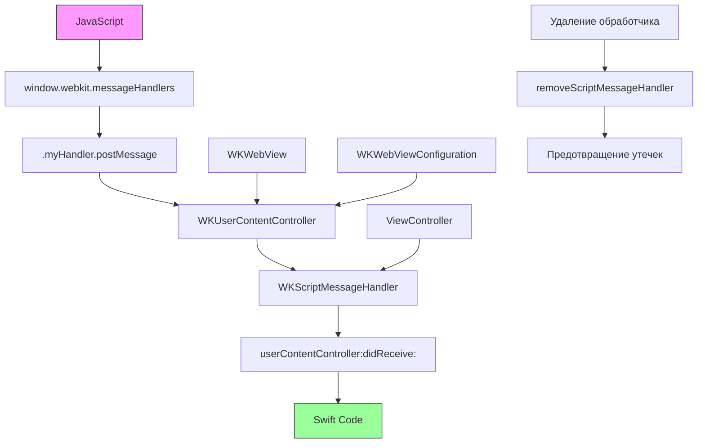

#WKScriptMessageHandler #WebKit #iOS #Swift #JavaScriptBridge #WKUserContentController #Communication #HybridApps #MemoryManagement #ScriptMessage

---
**(обработчик сообщений из JavaScript / мост между JS и Swift)**

**WKScriptMessageHandler** — это протокол из фреймворка **[[WebKit]]**, который позволяет принимать **сообщения из JavaScript**, отправленные через `window.webkit.messageHandlers.<name>.postMessage()` в [[WKWebView]]. Это основной механизм для **двусторонней коммуникации** между веб-контентом и нативным кодом Swift.

**Ключевые особенности (важно в 2026):**
- Позволяет JavaScript **вызывать [[Swift]]-код** и передавать данные
- Сообщения приходят асинхронно через метод `userContentController(_:didReceive:)`
- Каждый обработчик привязан к имени (идентификатору) через [[WKUserContentController]]
- **Обязательно** удалять обработчики для предотвращения утечек памяти
- Поддерживает передачу примитивных типов: [[String]], [[Int]], [[Bool]], [[Array]], [[Dictionary]]

---

### Структура протокола

```swift
protocol WKScriptMessageHandler : NSObjectProtocol {
    func userContentController(
        _ userContentController: WKUserContentController,
        didReceive message: WKScriptMessage
    )
}
```

**WKScriptMessage** содержит:
- `body: Any` — данные из JS (может быть строкой, числом, массивом, словарём)
- `name: String` — имя обработчика (как в `add(_:name:)`)
- `webView: WKWebView?` — ссылка на вьюшку, отправившую сообщение
- `frameInfo: WKFrameInfo` — информация о фрейме (главный/дочерний)

---

### Схема взаимосвязей



---

### Примеры (от простого к сложному)

#### 1. Базовое использование (один обработчик)
```swift
import UIKit
import WebKit

class ViewController: UIViewController, WKScriptMessageHandler {
    
    private var webView: WKWebView!
    
    override func viewDidLoad() {
        super.viewDidLoad()
        setupWebView()
        loadHTML()
    }
    
    private func setupWebView() {
        // 1. Создаём контроллер контента
        let contentController = WKUserContentController()
        
        // 2. Добавляем обработчик с именем "swiftHandler"
        contentController.add(self, name: "swiftHandler")
        
        // 3. Конфигурируем webView
        let config = WKWebViewConfiguration()
        config.userContentController = contentController
        
        webView = WKWebView(frame: view.bounds, configuration: config)
        webView.autoresizingMask = [.flexibleWidth, .flexibleHeight]
        view.addSubview(webView)
    }
    
    private func loadHTML() {
        let html = """
        <html>
        <body>
            <button onclick="sendMessage()">Отправить сообщение в Swift</button>
            <script>
                function sendMessage() {
                    window.webkit.messageHandlers.swiftHandler.postMessage('Привет из JavaScript!');
                }
            </script>
        </body>
        </html>
        """
        webView.loadHTMLString(html, baseURL: nil)
    }
    
    // MARK: - WKScriptMessageHandler
    func userContentController(_ userContentController: WKUserContentController, 
                               didReceive message: WKScriptMessage) {
        print("Получено сообщение: \(message.body)")
        print("Имя обработчика: \(message.name)")
        print("WebView: \(message.webView?.description ?? "nil")")
        
        // Показываем алерт
        DispatchQueue.main.async {
            let alert = UIAlertController(title: "Сообщение из JS", 
                                         message: "\(message.body)", 
                                         preferredStyle: .alert)
            alert.addAction(UIAlertAction(title: "OK", style: .default))
            self.present(alert, animated: true)
        }
    }
    
    deinit {
        // ВАЖНО! Удаляем обработчик при уничтожении
        webView?.configuration.userContentController.removeScriptMessageHandler(forName: "swiftHandler")
        print("🔴 Обработчик удалён")
    }
}
```

#### 2. Передача различных типов данных из JS
```swift
class DataTypesViewController: UIViewController, WKScriptMessageHandler {
    
    private var webView: WKWebView!
    
    override func viewDidLoad() {
        super.viewDidLoad()
        
        let contentController = WKUserContentController()
        contentController.add(self, name: "dataHandler")
        
        let config = WKWebViewConfiguration()
        config.userContentController = contentController
        
        webView = WKWebView(frame: view.bounds, configuration: config)
        view.addSubview(webView)
        
        let html = """
        <html>
        <body>
            <button onclick="sendAllTypes()">Отправить все типы данных</button>
            <script>
                function sendAllTypes() {
                    // 1. Строка
                    window.webkit.messageHandlers.dataHandler.postMessage('Простая строка');
                    
                    // 2. Число
                    window.webkit.messageHandlers.dataHandler.postMessage(42);
                    
                    // 3. Булево
                    window.webkit.messageHandlers.dataHandler.postMessage(true);
                    
                    // 4. Массив
                    window.webkit.messageHandlers.dataHandler.postMessage([1, 2, 3, 'четыре']);
                    
                    // 5. Объект (словарь)
                    window.webkit.messageHandlers.dataHandler.postMessage({
                        name: 'Иван',
                        age: 30,
                        isActive: true,
                        hobbies: ['спорт', 'чтение']
                    });
                    
                    // 6. Null
                    window.webkit.messageHandlers.dataHandler.postMessage(null);
                }
            </script>
        </body>
        </html>
        """
        webView.loadHTMLString(html, baseURL: nil)
    }
    
    func userContentController(_ userContentController: WKUserContentController, 
                               didReceive message: WKScriptMessage) {
        print("📩 Получен тип данных: \(type(of: message.body))")
        print("📩 Значение: \(message.body)")
        
        // Обработка разных типов
        switch message.body {
        case let string as String:
            print("Строка: \(string)")
        case let number as Int:
            print("Число: \(number)")
        case let bool as Bool:
            print("Булево: \(bool)")
        case let array as [Any]:
            print("Массив: \(array)")
            // Можно распарсить JSON из массива
        case let dict as [String: Any]:
            print("Словарь: \(dict)")
            // Работаем как с обычным Dictionary
            if let name = dict["name"] as? String {
                print("Имя: \(name)")
            }
        case is NSNull:
            print("Получен null")
        default:
            print("Неизвестный тип: \(message.body)")
        }
    }
    
    deinit {
        webView?.configuration.userContentController.removeScriptMessageHandler(forName: "dataHandler")
    }
}
```

#### 3. Несколько обработчиков (разные имена)
```swift
class MultipleHandlersViewController: UIViewController, WKScriptMessageHandler {
    
    private var webView: WKWebView!
    
    override func viewDidLoad() {
        super.viewDidLoad()
        
        let contentController = WKUserContentController()
        
        // Регистрируем несколько обработчиков с разными именами
        contentController.add(self, name: "authHandler")
        contentController.add(self, name: "profileHandler")
        contentController.add(self, name: "analyticsHandler")
        
        let config = WKWebViewConfiguration()
        config.userContentController = contentController
        
        webView = WKWebView(frame: view.bounds, configuration: config)
        view.addSubview(webView)
        
        let html = """
        <html>
        <body>
            <button onclick="doAuth()">Авторизоваться</button>
            <button onclick="getProfile()">Получить профиль</button>
            <button onclick="trackEvent()">Отправить аналитику</button>
            
            <script>
                function doAuth() {
                    const data = { login: 'user@email.com', password: '123456' };
                    window.webkit.messageHandlers.authHandler.postMessage(data);
                }
                
                function getProfile() {
                    window.webkit.messageHandlers.profileHandler.postMessage('Запрос профиля');
                }
                
                function trackEvent() {
                    const event = { name: 'button_click', timestamp: Date.now() };
                    window.webkit.messageHandlers.analyticsHandler.postMessage(event);
                }
            </script>
        </body>
        </html>
        """
        webView.loadHTMLString(html, baseURL: nil)
    }
    
    func userContentController(_ userContentController: WKUserContentController, 
                               didReceive message: WKScriptMessage) {
        // Обрабатываем в зависимости от имени обработчика
        switch message.name {
        case "authHandler":
            handleAuth(message.body)
        case "profileHandler":
            handleProfile(message.body)
        case "analyticsHandler":
            handleAnalytics(message.body)
        default:
            print("Неизвестный обработчик: \(message.name)")
        }
    }
    
    private func handleAuth(_ body: Any) {
        print("🔐 Авторизация: \(body)")
        if let credentials = body as? [String: String] {
            let login = credentials["login"] ?? ""
            let password = credentials["password"] ?? ""
            // Выполняем авторизацию
            print("Логин: \(login), Пароль: \(password)")
        }
    }
    
    private func handleProfile(_ body: Any) {
        print("👤 Запрос профиля: \(body)")
        // Отправляем данные обратно в JS
        webView.evaluateJavaScript("showProfile('Сергей', 25)") { result, error in
            if let error = error {
                print("Ошибка: \(error)")
            }
        }
    }
    
    private func handleAnalytics(_ body: Any) {
        print("📊 Аналитика: \(body)")
        // Отправляем в аналитическую систему
    }
    
    deinit {
        let controller = webView?.configuration.userContentController
        controller?.removeScriptMessageHandler(forName: "authHandler")
        controller?.removeScriptMessageHandler(forName: "profileHandler")
        controller?.removeScriptMessageHandler(forName: "analyticsHandler")
        print("🔴 Все обработчики удалены")
    }
}
```

#### 4. Передача сложных JSON-структур (с парсингом)
```swift
class ComplexDataViewController: UIViewController, WKScriptMessageHandler {
    
    private var webView: WKWebView!
    
    override func viewDidLoad() {
        super.viewDidLoad()
        
        let contentController = WKUserContentController()
        contentController.add(self, name: "orderHandler")
        
        let config = WKWebViewConfiguration()
        config.userContentController = contentController
        
        webView = WKWebView(frame: view.bounds, configuration: config)
        view.addSubview(webView)
        
        let html = """
        <html>
        <body>
            <button onclick="createOrder()">Создать заказ</button>
            <script>
                function createOrder() {
                    const order = {
                        id: 'ORD-2026-001',
                        customer: {
                            name: 'Алексей Смирнов',
                            email: 'alex@example.com',
                            phone: '+7 999 123-45-67'
                        },
                        items: [
                            { name: 'iPhone 16', price: 99900, quantity: 1 },
                            { name: 'Чехол', price: 2990, quantity: 2 }
                        ],
                        total: 105880,
                        paymentMethod: 'card',
                        delivery: {
                            address: 'Москва, ул. Тверская, 12',
                            date: '2026-07-30'
                        }
                    };
                    window.webkit.messageHandlers.orderHandler.postMessage(order);
                }
            </script>
        </body>
        </html>
        """
        webView.loadHTMLString(html, baseURL: nil)
    }
    
    func userContentController(_ userContentController: WKUserContentController, 
                               didReceive message: WKScriptMessage) {
        guard let orderData = message.body as? [String: Any] else {
            print("Ошибка: данные не являются словарём")
            return
        }
        
        // Парсим сложную структуру
        processOrder(orderData)
    }
    
    private func processOrder(_ data: [String: Any]) {
        struct Order {
            let id: String
            let customerName: String
            let customerEmail: String
            let customerPhone: String
            let total: Double
            let paymentMethod: String
            let items: [(name: String, price: Double, quantity: Int)]
            let deliveryAddress: String
            let deliveryDate: String
        }
        
        guard let id = data["id"] as? String,
              let customer = data["customer"] as? [String: String],
              let itemsData = data["items"] as? [[String: Any]],
              let total = data["total"] as? Double,
              let paymentMethod = data["paymentMethod"] as? String,
              let delivery = data["delivery"] as? [String: String] else {
            print("❌ Ошибка парсинга заказа")
            return
        }
        
        let items = itemsData.compactMap { item -> (String, Double, Int)? in
            guard let name = item["name"] as? String,
                  let price = item["price"] as? Double,
                  let quantity = item["quantity"] as? Int else {
                return nil
            }
            return (name, price, quantity)
        }
        
        let order = Order(
            id: id,
            customerName: customer["name"] ?? "",
            customerEmail: customer["email"] ?? "",
            customerPhone: customer["phone"] ?? "",
            total: total,
            paymentMethod: paymentMethod,
            items: items,
            deliveryAddress: delivery["address"] ?? "",
            deliveryDate: delivery["date"] ?? ""
        )
        
        print("📦 Заказ получен:")
        print("ID: \(order.id)")
        print("Покупатель: \(order.customerName) (\(order.customerEmail))")
        print("Сумма: \(order.total) ₽")
        print("Способ оплаты: \(order.paymentMethod)")
        print("Товары: \(order.items.count)")
        print("Адрес доставки: \(order.deliveryAddress)")
        print("Дата доставки: \(order.deliveryDate)")
        
        // Отправляем подтверждение в JS
        webView.evaluateJavaScript("confirmOrder('\(order.id)')")
    }
    
    deinit {
        webView?.configuration.userContentController.removeScriptMessageHandler(forName: "orderHandler")
    }
}
```

#### 5. Отправка данных из [[Swift]] в JS (обратная связь)
```swift
class TwoWayCommunicationViewController: UIViewController, WKScriptMessageHandler {
    
    private var webView: WKWebView!
    
    override func viewDidLoad() {
        super.viewDidLoad()
        
        let contentController = WKUserContentController()
        contentController.add(self, name: "requestHandler")
        
        let config = WKWebViewConfiguration()
        config.userContentController = contentController
        
        webView = WKWebView(frame: view.bounds, configuration: config)
        view.addSubview(webView)
        
        let html = """
        <html>
        <body>
            <div id="status">Нажмите кнопку</div>
            <button onclick="requestData()">Запросить данные из Swift</button>
            
            <script>
                function requestData() {
                    document.getElementById('status').textContent = 'Запрос отправлен...';
                    window.webkit.messageHandlers.requestHandler.postMessage('getUserInfo');
                }
                
                function receiveUserInfo(user) {
                    document.getElementById('status').textContent = 
                        'Получены данные: ' + JSON.stringify(user);
                    console.log('Получен пользователь:', user);
                }
            </script>
        </body>
        </html>
        """
        webView.loadHTMLString(html, baseURL: nil)
    }
    
    func userContentController(_ userContentController: WKUserContentController, 
                               didReceive message: WKScriptMessage) {
        guard let command = message.body as? String else { return }
        
        if command == "getUserInfo" {
            // Имитация получения данных из базы
            let userInfo: [String: Any] = [
                "id": 12345,
                "name": "Екатерина Иванова",
                "age": 28,
                "city": "Санкт-Петербург",
                "isPremium": true
            ]
            
            // Отправляем данные обратно в JS
            do {
                let jsonData = try JSONSerialization.data(withJSONObject: userInfo)
                if let jsonString = String(data: jsonData, encoding: .utf8) {
                    // Вызываем JS-функцию с данными
                    webView.evaluateJavaScript("receiveUserInfo(\(jsonString))") { result, error in
                        if let error = error {
                            print("❌ Ошибка отправки в JS: \(error)")
                        } else {
                            print("✅ Данные отправлены в JS")
                        }
                    }
                }
            } catch {
                print("❌ Ошибка сериализации: \(error)")
            }
        }
    }
    
    deinit {
        webView?.configuration.userContentController.removeScriptMessageHandler(forName: "requestHandler")
    }
}
```

#### 6. Асинхронные запросы с колбэками (promise-подход)
```swift
class AsyncCallbackViewController: UIViewController, WKScriptMessageHandler {
    
    private var webView: WKWebView!
    private var pendingCallbacks: [String: (Any) -> Void] = [:]
    private let callbackQueue = DispatchQueue(label: "callbackQueue")
    
    override func viewDidLoad() {
        super.viewDidLoad()
        
        let contentController = WKUserContentController()
        contentController.add(self, name: "asyncHandler")
        
        let config = WKWebViewConfiguration()
        config.userContentController = contentController
        
        webView = WKWebView(frame: view.bounds, configuration: config)
        view.addSubview(webView)
        
        let html = """
        <html>
        <body>
            <div id="result"></div>
            <button onclick="makeAsyncRequest()">Асинхронный запрос</button>
            
            <script>
                const callbacks = {};
                let callbackId = 0;
                
                function makeAsyncRequest() {
                    const id = ++callbackId;
                    document.getElementById('result').textContent = 'Запрос #' + id + ' выполняется...';
                    
                    // Создаём Promise
                    const promise = new Promise((resolve, reject) => {
                        callbacks[id] = { resolve, reject };
                        
                        // Отправляем запрос в Swift с callbackId
                        window.webkit.messageHandlers.asyncHandler.postMessage({
                            action: 'fetchUserData',
                            callbackId: id,
                            params: { userId: 42 }
                        });
                    });
                    
                    // Обрабатываем результат
                    promise.then(result => {
                        document.getElementById('result').textContent = 
                            '✅ Результат: ' + JSON.stringify(result);
                        console.log('Успех:', result);
                    }).catch(error => {
                        document.getElementById('result').textContent = 
                            '❌ Ошибка: ' + error;
                        console.error('Ошибка:', error);
                    });
                }
                
                function resolveAsync(callbackId, result) {
                    if (callbacks[callbackId]) {
                        callbacks[callbackId].resolve(result);
                        delete callbacks[callbackId];
                    }
                }
                
                function rejectAsync(callbackId, error) {
                    if (callbacks[callbackId]) {
                        callbacks[callbackId].reject(error);
                        delete callbacks[callbackId];
                    }
                }
            </script>
        </body>
        </html>
        """
        webView.loadHTMLString(html, baseURL: nil)
    }
    
    func userContentController(_ userContentController: WKUserContentController, 
                               didReceive message: WKScriptMessage) {
        guard let data = message.body as? [String: Any],
              let action = data["action"] as? String,
              let callbackId = data["callbackId"] as? Int else {
            return
        }
        
        if action == "fetchUserData" {
            // Имитация асинхронной операции (например, сетевой запрос)
            DispatchQueue.global().asyncAfter(deadline: .now() + 2) { [weak self] in
                guard let self = self else { return }
                
                let userData: [String: Any] = [
                    "id": 42,
                    "name": "Анна Петрова",
                    "email": "anna@example.com",
                    "createdAt": Date().timeIntervalSince1970
                ]
                
                // Отправляем результат обратно в JS
                do {
                    let jsonData = try JSONSerialization.data(withJSONObject: userData)
                    if let jsonString = String(data: jsonData, encoding: .utf8) {
                        self.webView.evaluateJavaScript(
                            "resolveAsync(\(callbackId), \(jsonString))"
                        ) { _, error in
                            if let error = error {
                                print("❌ Ошибка resolve: \(error)")
                            } else {
                                print("✅ Resolve выполнен для callbackId: \(callbackId)")
                            }
                        }
                    }
                } catch {
                    print("❌ Ошибка сериализации: \(error)")
                    self.webView.evaluateJavaScript(
                        "rejectAsync(\(callbackId), 'Ошибка сериализации')"
                    )
                }
            }
        }
    }
    
    deinit {
        webView?.configuration.userContentController.removeScriptMessageHandler(forName: "asyncHandler")
    }
}
```

#### 7. Безопасная обработка с проверкой фреймов
```swift
class SecureHandlerViewController: UIViewController, WKScriptMessageHandler {
    
    private var webView: WKWebView!
    
    override func viewDidLoad() {
        super.viewDidLoad()
        
        let contentController = WKUserContentController()
        contentController.add(self, name: "secureHandler")
        
        let config = WKWebViewConfiguration()
        config.userContentController = contentController
        
        webView = WKWebView(frame: view.bounds, configuration: config)
        view.addSubview(webView)
        
        // Загружаем локальный HTML (безопасный источник)
        if let url = Bundle.main.url(forResource: "secure_page", withExtension: "html") {
            webView.loadFileURL(url, allowingReadAccessTo: url.deletingLastPathComponent())
        }
    }
    
    func userContentController(_ userContentController: WKUserContentController, 
                               didReceive message: WKScriptMessage) {
        // 1. Проверяем, что сообщение пришло из главного фрейма
        guard message.frameInfo.isMainFrame else {
            print("⚠️ Сообщение из дочернего фрейма игнорируется")
            return
        }
        
        // 2. Проверяем источник (безопасный домен)
        guard let requestURL = message.webView?.url,
              requestURL.scheme == "https",
              requestURL.host == "example.com" || requestURL.host == "localhost" else {
            print("⚠️ Сообщение из небезопасного источника: \(message.webView?.url?.host ?? "unknown")")
            return
        }
        
        // 3. Проверяем тип данных
        guard let command = message.body as? [String: Any] else {
            print("⚠️ Неверный формат сообщения")
            return
        }
        
        // 4. Валидация команды
        guard let action = command["action"] as? String,
              let token = command["token"] as? String else {
            print("⚠️ Отсутствуют обязательные поля")
            return
        }
        
        // 5. Проверка токена
        guard token == UserSessionManager.shared.currentToken else {
            print("⚠️ Неверный токен")
            return
        }
        
        // 6. Обработка безопасной команды
        print("✅ Безопасная команда: \(action)")
        processSecureCommand(action, params: command["params"])
    }
    
    private func processSecureCommand(_ command: String, params: Any?) {
        switch command {
        case "getUserData":
            // Безопасная операция
            break
        case "deleteAccount":
            // Требует подтверждения
            break
        default:
            print("⚠️ Неизвестная команда")
        }
    }
    
    deinit {
        webView?.configuration.userContentController.removeScriptMessageHandler(forName: "secureHandler")
    }
}

// Простой менеджер сессии
class UserSessionManager {
    static let shared = UserSessionManager()
    var currentToken: String = ""
    private init() {}
}
```

#### 8. Обработка ошибок и логирование
```swift
class RobustHandlerViewController: UIViewController, WKScriptMessageHandler {
    
    private var webView: WKWebView!
    
    override func viewDidLoad() {
        super.viewDidLoad()
        
        let contentController = WKUserContentController()
        contentController.add(self, name: "robustHandler")
        
        let config = WKWebViewConfiguration()
        config.userContentController = contentController
        
        webView = WKWebView(frame: view.bounds, configuration: config)
        view.addSubview(webView)
        
        let html = """
        <html>
        <body>
            <button onclick="testError()">Протестировать ошибку</button>
            <button onclick="testTimeout()">Протестировать таймаут</button>
            <script>
                function testError() {
                    window.webkit.messageHandlers.robustHandler.postMessage({
                        action: 'crash',
                        data: null
                    });
                }
                
                function testTimeout() {
                    window.webkit.messageHandlers.robustHandler.postMessage({
                        action: 'slowOperation',
                        data: { delay: 5000 }
                    });
                }
            </script>
        </body>
        </html>
        """
        webView.loadHTMLString(html, baseURL: nil)
    }
    
    func userContentController(_ userContentController: WKUserContentController, 
                               didReceive message: WKScriptMessage) {
        do {
            try handleMessage(message)
        } catch let error as MessageError {
            print("❌ Ошибка обработки: \(error.localizedDescription)")
            
            // Отправляем ошибку обратно в JS
            webView.evaluateJavaScript(
                "console.error('Ошибка: \(error.localizedDescription)')"
            )
        } catch {
            print("❌ Неизвестная ошибка: \(error)")
        }
    }
    
    private func handleMessage(_ message: WKScriptMessage) throws {
        // Проверяем наличие body
        guard let data = message.body as? [String: Any] else {
            throw MessageError.invalidData("Body не является словарём")
        }
        
        // Проверяем наличие action
        guard let action = data["action"] as? String else {
            throw MessageError.missingField("action")
        }
        
        // Проверяем наличие токена (если требуется)
        if let token = data["token"] as? String {
            guard token == "valid_token_123" else {
                throw MessageError.invalidToken
            }
        }
        
        // Обработка действий
        switch action {
        case "crash":
            throw MessageError.criticalError("Команда 'crash' запрещена")
            
        case "slowOperation":
            if let delay = data["data"] as? [String: Any],
               let seconds = delay["delay"] as? Int {
                if seconds > 3 {
                    throw MessageError.timeout("Операция слишком долгая (\(seconds)с)")
                }
            }
            
        default:
            print("✅ Команда '\(action)' выполнена")
        }
    }
    
    deinit {
        webView?.configuration.userContentController.removeScriptMessageHandler(forName: "robustHandler")
    }
}

// MARK: - Ошибки
enum MessageError: Error {
    case invalidData(String)
    case missingField(String)
    case invalidToken
    case timeout(String)
    case criticalError(String)
}

extension MessageError: LocalizedError {
    var errorDescription: String? {
        switch self {
        case .invalidData(let msg): return "Неверные данные: \(msg)"
        case .missingField(let field): return "Отсутствует поле: \(field)"
        case .invalidToken: return "Неверный токен"
        case .timeout(let msg): return "Таймаут: \(msg)"
        case .criticalError(let msg): return "Критическая ошибка: \(msg)"
        }
    }
}
```

---

### Важные нюансы 2026 года

> [!warning]
> **Утечки памяти:** Объект, реализующий `WKScriptMessageHandler`, **должен быть удалён** через `removeScriptMessageHandler(forName:)` в `deinit`, иначе возникает **strong reference cycle**.
> 
> **Слабая ссылка:** `WKUserContentController` хранит **сильную** ссылку на обработчик. Используйте отдельный объект-обработчик, чтобы избежать утечек.
> 
> **Типы данных:** `postMessage` поддерживает только **сериализуемые** типы. Передавайте JSON-совместимые объекты.
> 
> **Асинхронность:** Сообщения приходят асинхронно на **любом фоне**. Всегда переключайтесь на `DispatchQueue.main` при работе с UI.
> 
> **Безопасность:** Всегда проверяйте `message.frameInfo.isMainFrame` и **домен источника**, чтобы избежать XSS-атак через iframe.
> 
> **iOS 14+:** Для проверки источника используйте `WKFrameInfo.securityOrigin`.

---

### Лучшие практики 2026

1. **Создавайте отдельный объект-обработчик** вместо использования `self` для избежания утечек
2. **Всегда удаляйте обработчики** в `deinit` или при закрытии экрана
3. **Проверяйте главный фрейм** (`message.frameInfo.isMainFrame`)
4. **Проверяйте источник** сообщений (домен, схема)
5. **Используйте enum для команд** для типобезопасности
6. **Передавайте данные в JSON-формате** (словари/массивы)
7. **Логируйте** все сообщения для отладки
8. **Обрабатывайте ошибки** и отправляйте их обратно в JS

---

### Связь с другими темами

- [[WKUserContentController]] — регистрация обработчиков
- [[WKWebViewConfiguration]] — передача контроллера контента
- [[WKScriptMessageHandlerWithReply]] — обработчик с ответом (iOS 14+)
- [[WKUserScript]] — внедрение JS-скриптов