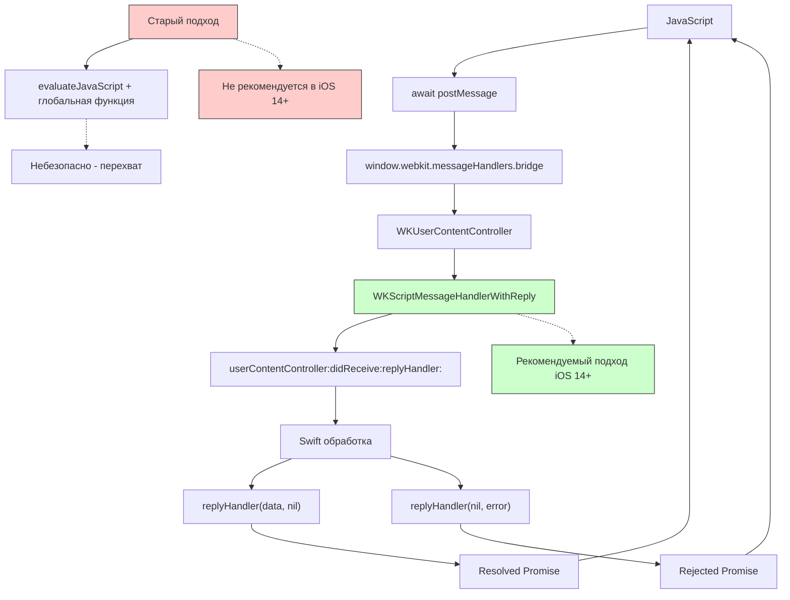

#WKScriptMessageHandlerWithReply #WebKit #iOS #Swift #JavaScriptBridge #AsyncAwait #Promises #WKUserContentController #Communication #Security

---
**(обработчик сообщений с ответом / двусторонний синхронный мост между JS и Swift)**

**WKScriptMessageHandlerWithReply** — это протокол из фреймворка **[[WebKit]]**, который расширяет возможности [[WKScriptMessageHandler]], позволяя не только **принимать сообщения** из JavaScript, но и **возвращать ответ** напрямую в вызывающий JS-код через механизм **Promise**. Это обеспечивает синхронный (в асинхронном стиле) двусторонний обмен данными между Swift и JavaScript.

**Ключевые особенности (важно в 2026):**
- Представлен в **iOS 14+** как эволюция `WKScriptMessageHandler`
- Использует **асинхронный ответ** через `replyHandler`, вызываемый в Swift
- На JS-стороне работает с **`await`** и **`Promise`**, делая код чистым и предсказуемым 
- **Безопаснее** старого подхода с `evaluateJavaScript` — ответ идёт напрямую в контекст вызвавшего, а не через глобальную функцию 
- **Изолирован** от глобальной области видимости страницы — никакой код не может перехватить ответ 

---

### Структура протокола

```swift
protocol WKScriptMessageHandlerWithReply : NSObjectProtocol {
    func userContentController(
        _ userContentController: WKUserContentController,
        didReceive message: WKScriptMessage,
        replyHandler: @escaping (Any?, String?) -> Void
    )
}
```

**Параметры `replyHandler`**:
- `Any?` — данные для ответа (сериализуемые в JSON)
- `String?` — строка ошибки (если передать, Promise на JS-стороне будет отклонён)

---

### Схема взаимосвязей



---

### Примеры (от простого к сложному)

#### 1. Базовое использование (приветствие с ответом)
```swift
import UIKit
import WebKit

class ViewController: UIViewController, WKScriptMessageHandlerWithReply {
    
    private var webView: WKWebView!
    
    override func viewDidLoad() {
        super.viewDidLoad()
        setupWebView()
        loadHTML()
    }
    
    private func setupWebView() {
        let contentController = WKUserContentController()
        
        // Регистрируем обработчик с поддержкой ответа
        contentController.addScriptMessageHandlerWithReply(
            self,
            contentWorld: .page,
            name: "greetingHandler"
        )
        
        let config = WKWebViewConfiguration()
        config.userContentController = contentController
        
        webView = WKWebView(frame: view.bounds, configuration: config)
        webView.autoresizingMask = [.flexibleWidth, .flexibleHeight]
        view.addSubview(webView)
    }
    
    private func loadHTML() {
        let html = """
        <html>
        <body>
            <button onclick="callSwift()">Поздороваться со Swift</button>
            <div id="result"></div>
            <script>
                async function callSwift() {
                    const result = await window.webkit.messageHandlers.greetingHandler.postMessage('Привет!');
                    document.getElementById('result').textContent = 'Ответ Swift: ' + result;
                }
            </script>
        </body>
        </html>
        """
        webView.loadHTMLString(html, baseURL: nil)
    }
    
    // MARK: - WKScriptMessageHandlerWithReply
    func userContentController(_ userContentController: WKUserContentController, 
                               didReceive message: WKScriptMessage,
                               replyHandler: @escaping (Any?, String?) -> Void) {
        print("Получено: \(message.body)")
        
        // Формируем ответ
        let response = "Привет из Swift! Получил: \(message.body)"
        replyHandler(response, nil) // Первый параметр — данные, второй — ошибка (nil = успех)
    }
    
    deinit {
        webView?.configuration.userContentController.removeScriptMessageHandler(
            forName: "greetingHandler",
            contentWorld: .page
        )
    }
}
```

#### 2. Возврат сложных данных ([[JSON]]-объект)
```swift
class UserDataHandler: UIViewController, WKScriptMessageHandlerWithReply {
    
    private var webView: WKWebView!
    
    override func viewDidLoad() {
        super.viewDidLoad()
        
        let contentController = WKUserContentController()
        contentController.addScriptMessageHandlerWithReply(
            self,
            contentWorld: .page,
            name: "userHandler"
        )
        
        let config = WKWebViewConfiguration()
        config.userContentController = contentController
        
        webView = WKWebView(frame: view.bounds, configuration: config)
        view.addSubview(webView)
        
        let html = """
        <html>
        <body>
            <button onclick="fetchUser()">Получить данные пользователя</button>
            <div id="userInfo"></div>
            <script>
                async function fetchUser() {
                    const result = await window.webkit.messageHandlers.userHandler.postMessage({ 
                        action: 'getUser', 
                        userId: 42 
                    });
                    document.getElementById('userInfo').innerHTML = 
                        'Имя: ' + result.name + '<br>' +
                        'Email: ' + result.email + '<br>' +
                        'Возраст: ' + result.age;
                    console.log('Получен пользователь:', result);
                }
            </script>
        </body>
        </html>
        """
        webView.loadHTMLString(html, baseURL: nil)
    }
    
    func userContentController(_ userContentController: WKUserContentController, 
                               didReceive message: WKScriptMessage,
                               replyHandler: @escaping (Any?, String?) -> Void) {
        // Парсим запрос
        guard let data = message.body as? [String: Any],
              let action = data["action"] as? String else {
            replyHandler(nil, "Неверный формат запроса")
            return
        }
        
        if action == "getUser" {
            // Имитация получения данных из базы
            let user: [String: Any] = [
                "id": 42,
                "name": "Алексей Иванов",
                "email": "alex@example.com",
                "age": 28,
                "isActive": true,
                "createdAt": Date().timeIntervalSince1970
            ]
            
            // Возвращаем словарь — WebKit сам преобразует в JSON
            replyHandler(user, nil)
        } else {
            replyHandler(nil, "Неизвестное действие: \(action)")
        }
    }
    
    deinit {
        webView?.configuration.userContentController.removeScriptMessageHandler(
            forName: "userHandler",
            contentWorld: .page
        )
    }
}
```

#### 3. Асинхронная обработка (сетевой запрос)
```swift
class AsyncNetworkHandler: UIViewController, WKScriptMessageHandlerWithReply {
    
    private var webView: WKWebView!
    
    override func viewDidLoad() {
        super.viewDidLoad()
        
        let contentController = WKUserContentController()
        contentController.addScriptMessageHandlerWithReply(
            self,
            contentWorld: .page,
            name: "networkHandler"
        )
        
        let config = WKWebViewConfiguration()
        config.userContentController = contentController
        
        webView = WKWebView(frame: view.bounds, configuration: config)
        view.addSubview(webView)
        
        let html = """
        <html>
        <body>
            <button onclick="fetchData()">Загрузить данные</button>
            <div id="status">Ожидание...</div>
            <div id="result"></div>
            <script>
                async function fetchData() {
                    document.getElementById('status').textContent = 'Загрузка...';
                    try {
                        const data = await window.webkit.messageHandlers.networkHandler.postMessage({
                            url: 'https://api.example.com/data'
                        });
                        document.getElementById('status').textContent = '✅ Загружено!';
                        document.getElementById('result').textContent = JSON.stringify(data);
                    } catch(error) {
                        document.getElementById('status').textContent = '❌ Ошибка: ' + error;
                    }
                }
            </script>
        </body>
        </html>
        """
        webView.loadHTMLString(html, baseURL: nil)
    }
    
    func userContentController(_ userContentController: WKUserContentController, 
                               didReceive message: WKScriptMessage,
                               replyHandler: @escaping (Any?, String?) -> Void) {
        guard let params = message.body as? [String: Any],
              let urlString = params["url"] as? String,
              let url = URL(string: urlString) else {
            replyHandler(nil, "Неверный URL")
            return
        }
        
        // Асинхронный сетевой запрос
        DispatchQueue.global().async {
            do {
                let data = try Data(contentsOf: url)
                if let json = try JSONSerialization.jsonObject(with: data) as? [String: Any] {
                    // Возвращаем результат в главном потоке
                    DispatchQueue.main.async {
                        replyHandler(json, nil)
                    }
                } else {
                    DispatchQueue.main.async {
                        replyHandler(nil, "Неверный формат данных")
                    }
                }
            } catch {
                DispatchQueue.main.async {
                    replyHandler(nil, "Ошибка сети: \(error.localizedDescription)")
                }
            }
        }
    }
    
    deinit {
        webView?.configuration.userContentController.removeScriptMessageHandler(
            forName: "networkHandler",
            contentWorld: .page
        )
    }
}
```

#### 4. Обработка ошибок (reject Promise)
```swift
class ErrorHandler: UIViewController, WKScriptMessageHandlerWithReply {
    
    private var webView: WKWebView!
    
    override func viewDidLoad() {
        super.viewDidLoad()
        
        let contentController = WKUserContentController()
        contentController.addScriptMessageHandlerWithReply(
            self,
            contentWorld: .page,
            name: "errorHandler"
        )
        
        let config = WKWebViewConfiguration()
        config.userContentController = contentController
        
        webView = WKWebView(frame: view.bounds, configuration: config)
        view.addSubview(webView)
        
        let html = """
        <html>
        <body>
            <button onclick="testError()">Протестировать ошибку</button>
            <div id="result"></div>
            <script>
                async function testError() {
                    try {
                        const result = await window.webkit.messageHandlers.errorHandler.postMessage({
                            action: 'invalidAction'
                        });
                        document.getElementById('result').textContent = 'Успех: ' + result;
                    } catch(error) {
                        document.getElementById('result').textContent = '❌ ' + error;
                        console.error('Ошибка:', error);
                    }
                }
            </script>
        </body>
        </html>
        """
        webView.loadHTMLString(html, baseURL: nil)
    }
    
    func userContentController(_ userContentController: WKUserContentController, 
                               didReceive message: WKScriptMessage,
                               replyHandler: @escaping (Any?, String?) -> Void) {
        guard let data = message.body as? [String: Any],
              let action = data["action"] as? String else {
            // Передаём ошибку — на JS-стороне Promise будет отклонён
            replyHandler(nil, "Неверный формат запроса")
            return
        }
        
        switch action {
        case "validAction":
            replyHandler(["status": "success", "data": "OK"], nil)
            
        case "invalidAction":
            // Возвращаем ошибку с подробным описанием
            replyHandler(nil, "Действие 'invalidAction' не поддерживается")
            
        default:
            replyHandler(nil, "Неизвестное действие: \(action)")
        }
    }
    
    deinit {
        webView?.configuration.userContentController.removeScriptMessageHandler(
            forName: "errorHandler",
            contentWorld: .page
        )
    }
}
```

#### 5. Несколько обработчиков с разными мирами
```swift
@available(iOS 14.0, *)
class MultipleWorldsHandler: UIViewController, WKScriptMessageHandlerWithReply {
    
    private var webView: WKWebView!
    
    override func viewDidLoad() {
        super.viewDidLoad()
        
        let contentController = WKUserContentController()
        
        // Обработчик в мире страницы (главный контекст)
        contentController.addScriptMessageHandlerWithReply(
            self,
            contentWorld: .page,
            name: "mainHandler"
        )
        
        // Обработчик в изолированном мире (для безопасности)
        contentController.addScriptMessageHandlerWithReply(
            self,
            contentWorld: .world(name: "isolatedWorld"),
            name: "secureHandler"
        )
        
        let config = WKWebViewConfiguration()
        config.userContentController = contentController
        
        webView = WKWebView(frame: view.bounds, configuration: config)
        view.addSubview(webView)
        
        let html = """
        <html>
        <body>
            <button onclick="callMain()">Вызвать mainHandler</button>
            <button onclick="callSecure()">Вызвать secureHandler</button>
            <div id="result"></div>
            <script>
                async function callMain() {
                    const result = await window.webkit.messageHandlers.mainHandler.postMessage('test');
                    document.getElementById('result').textContent = 'Main: ' + result;
                }
                
                async function callSecure() {
                    const result = await window.webkit.messageHandlers.secureHandler.postMessage('secure test');
                    document.getElementById('result').textContent = 'Secure: ' + result;
                }
            </script>
        </body>
        </html>
        """
        webView.loadHTMLString(html, baseURL: nil)
    }
    
    func userContentController(_ userContentController: WKUserContentController, 
                               didReceive message: WKScriptMessage,
                               replyHandler: @escaping (Any?, String?) -> Void) {
        switch message.name {
        case "mainHandler":
            replyHandler("Ответ из главного мира", nil)
        case "secureHandler":
            replyHandler("Ответ из изолированного мира 🔒", nil)
        default:
            replyHandler(nil, "Неизвестный обработчик")
        }
    }
    
    deinit {
        let controller = webView?.configuration.userContentController
        controller?.removeScriptMessageHandler(forName: "mainHandler", contentWorld: .page)
        controller?.removeScriptMessageHandler(forName: "secureHandler", contentWorld: .world(name: "isolatedWorld"))
    }
}
```

#### 6. Замена старого подхода на новый (безопасность)
```swift
// ⚠️ СТАРЫЙ ПОДХОД — НЕ БЕЗОПАСНЫЙ
class OldApproach: UIViewController, WKScriptMessageHandler {
    func userContentController(_ userContentController: WKUserContentController, 
                               didReceive message: WKScriptMessage) {
        let secret = "VerySecret123"
        // ❌ Уязвимость: любая страница может переопределить window.receiveSecret
        let js = "window.receiveSecret('\(secret)')"
        message.webView?.evaluateJavaScript(js, completionHandler: nil)
    }
}

// ✅ НОВЫЙ ПОДХОД — БЕЗОПАСНЫЙ (iOS 14+)
class NewSecureApproach: UIViewController, WKScriptMessageHandlerWithReply {
    func userContentController(_ userContentController: WKUserContentController, 
                               didReceive message: WKScriptMessage,
                               replyHandler: @escaping (Any?, String?) -> Void) {
        let secret = "VerySecret123"
        // ✅ Ответ идёт напрямую в Promise вызвавшей функции
        replyHandler(secret, nil)
    }
}
```

---

### Преимущества WKScriptMessageHandlerWithReply над старым подходом

| Характеристика | Старый подход (evaluateJavaScript) | WKScriptMessageHandlerWithReply |
|----------------|-------------------------------------|----------------------------------|
| **Безопасность** | ❌ Глобальная функция может быть перехвачена  | ✅ Ответ напрямую в Promise, недоступен для перехвата  |
| **Код на JS** | ❌ Требует глобальных колбэков | ✅ Простой `await`  |
| **Контекст** | ❌ Выполняется в глобальной области страницы | ✅ Выполняется в контексте вызвавшего  |
| **Ошибки** | ❌ Сложно обрабатывать | ✅ try/catch с ошибками от Swift  |
| **Производительность** | ⚠️ Дополнительный evaluateJavaScript | ✅ Прямая коммуникация |

---

### Важные нюансы 2026 года

> [!warning]
> **iOS 14+:** Протокол доступен только с iOS 14. Для поддержки более старых версий используйте `WKScriptMessageHandler` + `evaluateJavaScript` с осторожностью.
>
> **Удаление обработчика:** Всегда используйте `removeScriptMessageHandler(forName:contentWorld:)` в `deinit` .
>
> **Безопасность:** Ответ возвращается напрямую в контекст вызвавшего JS, что предотвращает перехват другими скриптами на странице .
>
> **Типы данных:** `replyHandler` принимает только JSON-сериализуемые объекты (словари, массивы, строки, числа).
>
> **Асинхронность:** `replyHandler` должен быть вызван **один раз** в течение времени жизни обработчика. Повторный вызов игнорируется.

---

### Лучшие практики 2026

1. **Используйте новый протокол** вместо старого для всех новых проектов (iOS 14+)
2. **Всегда удаляйте обработчики** в [[deinit]] с указанием `contentWorld`
3. **Передавайте словари** для сложных данных (они автоматически преобразуются в JSON)
4. **Используйте try/catch** на JS-стороне для обработки ошибок от Swift
5. **Документируйте** все обработчики с указанием ожидаемых форматов
6. **Не задерживайте вызов `replyHandler`** — это может привести к таймаутам
7. **Проверяйте `message.body`** перед обработкой (валидация входных данных)

---

### Связь с другими темами

- [[WKScriptMessageHandler]] — предшественник без поддержки ответа
- [[WKUserContentController]] — регистрация обработчиков
- [[WKWebViewConfiguration]] — передача контроллера контента
- [[WKScriptMessage]] — объект сообщения