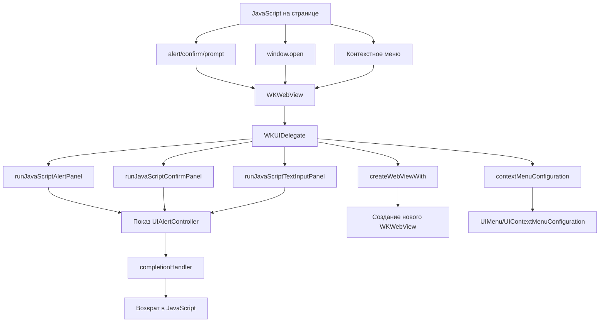

#WKUIDelegate #WebKit #iOS #Swift #WKWebView #UI #UserInterface #JavaScriptDialogs #WebContent #NativeUI

---
**(делегат пользовательского интерфейса / управление UI-элементами [[WKWebView]])**

**WKUIDelegate** — это протокол из фреймворка **[[WebKit]]**, который предоставляет методы для **управления пользовательским интерфейсом** `WKWebView`. Он позволяет обрабатывать JavaScript-диалоги (`alert`, `confirm`, `prompt`), создавать новые окна (`window.open`), управлять панелями инструментов и другими UI-элементами, которые инициируются веб-контентом.

**Ключевые особенности (важно в 2026):**
- Отвечает за **все UI-взаимодействия**, инициированные JavaScript
- Позволяет **заменять нативные диалоги** на кастомные (или отключать их)
- Управляет **созданием новых окон/вкладок** через JavaScript
- Контролирует **контекстные меню** и **действия при выделении текста**
- В отличие от [[WKNavigationDelegate]], отвечает именно за **интерфейс**, а не за навигацию

---

### Основные методы WKUIDelegate

| Метод | Назначение | iOS версия |
|-------|------------|------------|
| `webView(_:createWebViewWith:for:windowFeatures:)` | Создание нового окна через `window.open()` | 8.0+ |
| `webView(_:runJavaScriptAlertPanelWithMessage:initiatedByFrame:completionHandler:)` | Обработка `alert()` | 8.0+ |
| `webView(_:runJavaScriptConfirmPanelWithMessage:initiatedByFrame:completionHandler:)` | Обработка `confirm()` | 8.0+ |
| `webView(_:runJavaScriptTextInputPanelWithPrompt:defaultText:initiatedByFrame:completionHandler:)` | Обработка `prompt()` | 8.0+ |
| `webView(_:contextMenuConfigurationFor:element:completionHandler:)` | Настройка контекстного меню | 13.0+ |
| `webView(_:contextMenuWillPresentFor:with:animator:)` | Кастомизация контекстного меню перед показом | 13.0+ |
| `webView(_:contextMenuFor:willCommitWith:animator:)` | Обработка выбора пункта контекстного меню | 13.0+ |
| `webView(_:contextMenuDidEndFor:with:animator:)` | Завершение работы контекстного меню | 13.0+ |
| `webView(_:didCreateWebView:with:for:windowFeatures:)` | Уведомление о создании нового окна | 14.0+ |

---

### Схема взаимосвязей



---

### Примеры (от простого к сложному)

#### 1. Базовый делегат с обработкой диалогов
```swift
import UIKit
import WebKit

class BasicUIDelegateViewController: UIViewController, WKUIDelegate {
    
    private var webView: WKWebView!
    
    override func viewDidLoad() {
        super.viewDidLoad()
        
        let config = WKWebViewConfiguration()
        webView = WKWebView(frame: view.bounds, configuration: config)
        webView.uiDelegate = self // Устанавливаем делегата
        
        view.addSubview(webView)
        
        // Тестовый HTML с диалогами
        let html = """
        <html>
        <body>
            <button onclick="alert('Привет из Alert!')">Alert</button>
            <button onclick="confirm('Вы согласны?')">Confirm</button>
            <button onclick="prompt('Как вас зовут?', 'Иван')">Prompt</button>
        </body>
        </html>
        """
        webView.loadHTMLString(html, baseURL: nil)
    }
    
    // MARK: - WKUIDelegate
    
    // Обработка alert
    func webView(_ webView: WKWebView, 
                 runJavaScriptAlertPanelWithMessage message: String,
                 initiatedByFrame frame: WKFrameInfo,
                 completionHandler: @escaping () -> Void) {
        let alert = UIAlertController(title: "Сообщение от страницы",
                                     message: message,
                                     preferredStyle: .alert)
        alert.addAction(UIAlertAction(title: "OK", style: .default) { _ in
            completionHandler() // Обязательно вызываем по завершении
        })
        present(alert, animated: true)
    }
    
    // Обработка confirm
    func webView(_ webView: WKWebView,
                 runJavaScriptConfirmPanelWithMessage message: String,
                 initiatedByFrame frame: WKFrameInfo,
                 completionHandler: @escaping (Bool) -> Void) {
        let alert = UIAlertController(title: "Подтверждение",
                                     message: message,
                                     preferredStyle: .alert)
        alert.addAction(UIAlertAction(title: "OK", style: .default) { _ in
            completionHandler(true)
        })
        alert.addAction(UIAlertAction(title: "Отмена", style: .cancel) { _ in
            completionHandler(false)
        })
        present(alert, animated: true)
    }
    
    // Обработка prompt
    func webView(_ webView: WKWebView,
                 runJavaScriptTextInputPanelWithPrompt prompt: String,
                 defaultText: String?,
                 initiatedByFrame frame: WKFrameInfo,
                 completionHandler: @escaping (String?) -> Void) {
        let alert = UIAlertController(title: "Ввод текста",
                                     message: prompt,
                                     preferredStyle: .alert)
        alert.addTextField { textField in
            textField.text = defaultText
        }
        alert.addAction(UIAlertAction(title: "OK", style: .default) { _ in
            completionHandler(alert.textFields?.first?.text)
        })
        alert.addAction(UIAlertAction(title: "Отмена", style: .cancel) { _ in
            completionHandler(nil)
        })
        present(alert, animated: true)
    }
}
```

#### 2. Кастомные диалоги с красивым UI
```swift
class CustomDialogViewController: UIViewController, WKUIDelegate {
    
    private var webView: WKWebView!
    
    override func viewDidLoad() {
        super.viewDidLoad()
        
        let config = WKWebViewConfiguration()
        webView = WKWebView(frame: view.bounds, configuration: config)
        webView.uiDelegate = self
        view.addSubview(webView)
        
        let html = """
        <html>
        <body>
            <button onclick="alert('Кастомное сообщение')">Кастомный Alert</button>
        </body>
        </html>
        """
        webView.loadHTMLString(html, baseURL: nil)
    }
    
    func webView(_ webView: WKWebView, 
                 runJavaScriptAlertPanelWithMessage message: String,
                 initiatedByFrame frame: WKFrameInfo,
                 completionHandler: @escaping () -> Void) {
        // Создаём кастомное вью для алерта
        let customView = CustomAlertView(frame: view.bounds)
        customView.configure(title: "Уведомление", message: message)
        customView.onDismiss = {
            completionHandler()
            customView.removeFromSuperview()
        }
        view.addSubview(customView)
    }
}

// Пример кастомного алерта
class CustomAlertView: UIView {
    var onDismiss: (() -> Void)?
    
    override init(frame: CGRect) {
        super.init(frame: frame)
        setupUI()
    }
    
    required init?(coder: NSCoder) {
        fatalError("init(coder:) has not been implemented")
    }
    
    private func setupUI() {
        backgroundColor = UIColor.black.withAlphaComponent(0.5)
        
        let containerView = UIView()
        containerView.backgroundColor = .white
        containerView.layer.cornerRadius = 12
        containerView.translatesAutoresizingMaskIntoConstraints = false
        addSubview(containerView)
        
        // ... настройка констрейнтов и UI-элементов
        
        let button = UIButton(type: .system)
        button.setTitle("OK", for: .normal)
        button.addTarget(self, action: #selector(dismissAlert), for: .touchUpInside)
        containerView.addSubview(button)
    }
    
    @objc private func dismissAlert() {
        onDismiss?()
    }
}
```

#### 3. Создание новых окон (window.open)
```swift
class PopupWindowViewController: UIViewController, WKUIDelegate, WKNavigationDelegate {
    
    private var webView: WKWebView!
    private var popupWebView: WKWebView?
    private var popupVC: UIViewController?
    
    override func viewDidLoad() {
        super.viewDidLoad()
        
        let config = WKWebViewConfiguration()
        webView = WKWebView(frame: view.bounds, configuration: config)
        webView.uiDelegate = self
        webView.navigationDelegate = self
        view.addSubview(webView)
        
        let html = """
        <html>
        <body>
            <button onclick="window.open('https://example.com', '_blank')">
                Открыть новое окно
            </button>
        </body>
        </html>
        """
        webView.loadHTMLString(html, baseURL: nil)
    }
    
    // MARK: - WKUIDelegate
    
    func webView(_ webView: WKWebView,
                 createWebViewWith configuration: WKWebViewConfiguration,
                 for navigationAction: WKNavigationAction,
                 windowFeatures: WKWindowFeatures) -> WKWebView? {
        // Создаём новую вьюшку для всплывающего окна
        let newWebView = WKWebView(frame: .zero, configuration: configuration)
        newWebView.uiDelegate = self
        newWebView.navigationDelegate = self
        
        // Сохраняем ссылку
        popupWebView = newWebView
        
        // Показываем в отдельном контроллере
        let vc = UIViewController()
        vc.view.backgroundColor = .white
        vc.view.addSubview(newWebView)
        newWebView.frame = vc.view.bounds
        newWebView.autoresizingMask = [.flexibleWidth, .flexibleHeight]
        
        // Добавляем кнопку закрытия
        let closeButton = UIBarButtonItem(barButtonSystemItem: .close,
                                         target: self,
                                         action: #selector(closePopup))
        vc.navigationItem.rightBarButtonItem = closeButton
        
        let navVC = UINavigationController(rootViewController: vc)
        popupVC = vc
        present(navVC, animated: true)
        
        return newWebView
    }
    
    @objc private func closePopup() {
        popupVC?.dismiss(animated: true)
        popupWebView = nil
        popupVC = nil
    }
    
    // Также можно контролировать, должен ли открываться popup
    func webView(_ webView: WKWebView,
                 shouldCreateWebViewWith configuration: WKWebViewConfiguration,
                 for navigationAction: WKNavigationAction,
                 windowFeatures: WKWindowFeatures) -> Bool {
        // Например, разрешаем открывать только определённые сайты
        if let url = navigationAction.request.url {
            if url.host == "example.com" {
                return true
            }
        }
        return false
    }
}
```

#### 4. Настройка контекстного меню (iOS 13+)
```swift
@available(iOS 13.0, *)
class ContextMenuViewController: UIViewController, WKUIDelegate {
    
    private var webView: WKWebView!
    
    override func viewDidLoad() {
        super.viewDidLoad()
        
        let config = WKWebViewConfiguration()
        webView = WKWebView(frame: view.bounds, configuration: config)
        webView.uiDelegate = self
        view.addSubview(webView)
        
        let html = """
        <html>
        <body>
            <a href="https://example.com">Ссылка с контекстным меню</a>
            <p>Нажмите и удерживайте на ссылке</p>
        </body>
        </html>
        """
        webView.loadHTMLString(html, baseURL: nil)
    }
    
    // MARK: - WKUIDelegate (Context Menu)
    
    func webView(_ webView: WKWebView,
                 contextMenuConfigurationFor element: WKContextMenuElementInfo,
                 completionHandler: @escaping (UIContextMenuConfiguration?) -> Void) {
        // Создаём конфигурацию контекстного меню
        let configuration = UIContextMenuConfiguration(identifier: nil, previewProvider: {
            // Можно вернуть PreviewViewController
            let previewVC = UIViewController()
            previewVC.view.backgroundColor = .lightGray
            previewVC.preferredContentSize = CGSize(width: 300, height: 200)
            return previewVC
        }) { suggestedActions in
            // Создаём actions
            let open = UIAction(title: "Открыть", image: UIImage(systemName: "safari")) { _ in
                if let url = element.linkURL {
                    UIApplication.shared.open(url)
                }
            }
            
            let copy = UIAction(title: "Копировать ссылку", image: UIImage(systemName: "doc.on.doc")) { _ in
                UIPasteboard.general.url = element.linkURL
            }
            
            let share = UIAction(title: "Поделиться", image: UIImage(systemName: "square.and.arrow.up")) { _ in
                if let url = element.linkURL {
                    let activityVC = UIActivityViewController(activityItems: [url], applicationActivities: nil)
                    self.present(activityVC, animated: true)
                }
            }
            
            return UIMenu(title: "", children: [open, copy, share])
        }
        
        completionHandler(configuration)
    }
    
    func webView(_ webView: WKWebView,
                 contextMenuWillPresentFor element: WKContextMenuElementInfo,
                 with animator: UIContextMenuInteractionAnimating) {
        print("Контекстное меню появится")
    }
    
    func webView(_ webView: WKWebView,
                 contextMenuFor element: WKContextMenuElementInfo,
                 willCommitWith animator: UIContextMenuInteractionCommitAnimating) {
        print("Выбран элемент контекстного меню")
    }
    
    func webView(_ webView: WKWebView,
                 contextMenuDidEndFor element: WKContextMenuElementInfo,
                 with animator: UIContextMenuInteractionAnimating?) {
        print("Контекстное меню закрылось")
    }
}
```

#### 5. Обработка диалогов из iframe
```swift
class IframeDialogViewController: UIViewController, WKUIDelegate {
    
    private var webView: WKWebView!
    
    override func viewDidLoad() {
        super.viewDidLoad()
        
        let config = WKWebViewConfiguration()
        webView = WKWebView(frame: view.bounds, configuration: config)
        webView.uiDelegate = self
        view.addSubview(webView)
        
        let html = """
        <html>
        <body>
            <iframe src="about:blank" id="myIframe"></iframe>
            <script>
                const iframe = document.getElementById('myIframe');
                const doc = iframe.contentDocument || iframe.contentWindow.document;
                doc.write(`
                    <button onclick="parent.alert('Сообщение из iframe')">
                        Alert из iframe
                    </button>
                `);
            </script>
        </body>
        </html>
        """
        webView.loadHTMLString(html, baseURL: nil)
    }
    
    func webView(_ webView: WKWebView,
                 runJavaScriptAlertPanelWithMessage message: String,
                 initiatedByFrame frame: WKFrameInfo,
                 completionHandler: @escaping () -> Void) {
        // Проверяем, из какого фрейма пришло сообщение
        let source = frame.isMainFrame ? "главного окна" : "iframe"
        
        let alert = UIAlertController(title: "Сообщение из \(source)",
                                     message: message,
                                     preferredStyle: .alert)
        alert.addAction(UIAlertAction(title: "OK", style: .default) { _ in
            completionHandler()
        })
        present(alert, animated: true)
    }
}
```

#### 6. Отключение всех диалогов (для автоматизации)
```swift
class NoDialogsViewController: UIViewController, WKUIDelegate {
    
    private var webView: WKWebView!
    
    override func viewDidLoad() {
        super.viewDidLoad()
        
        let config = WKWebViewConfiguration()
        webView = WKWebView(frame: view.bounds, configuration: config)
        webView.uiDelegate = self
        view.addSubview(webView)
        
        let html = """
        <html>
        <body>
            <button onclick="alert('Этот alert не покажется')">Без диалогов</button>
        </body>
        </html>
        """
        webView.loadHTMLString(html, baseURL: nil)
    }
    
    // Отключаем все диалоги — просто вызываем completionHandler без UI
    func webView(_ webView: WKWebView,
                 runJavaScriptAlertPanelWithMessage message: String,
                 initiatedByFrame frame: WKFrameInfo,
                 completionHandler: @escaping () -> Void) {
        print("Alert подавлен: \(message)")
        completionHandler()
    }
    
    func webView(_ webView: WKWebView,
                 runJavaScriptConfirmPanelWithMessage message: String,
                 initiatedByFrame frame: WKFrameInfo,
                 completionHandler: @escaping (Bool) -> Void) {
        print("Confirm подавлен: \(message)")
        completionHandler(true) // Всегда отвечаем true
    }
    
    func webView(_ webView: WKWebView,
                 runJavaScriptTextInputPanelWithPrompt prompt: String,
                 defaultText: String?,
                 initiatedByFrame frame: WKFrameInfo,
                 completionHandler: @escaping (String?) -> Void) {
        print("Prompt подавлен: \(prompt)")
        completionHandler("") // Возвращаем пустую строку
    }
}
```

#### 7. Управление контекстным меню через [[UIAction]] (iOS 14+)
```swift
@available(iOS 14.0, *)
class ActionMenuViewController: UIViewController, WKUIDelegate {
    
    private var webView: WKWebView!
    
    override func viewDidLoad() {
        super.viewDidLoad()
        
        let config = WKWebViewConfiguration()
        webView = WKWebView(frame: view.bounds, configuration: config)
        webView.uiDelegate = self
        view.addSubview(webView)
        
        let html = """
        <html>
        <body>
            <rect width='200' height='200' fill='blue'/></svg>" />
        </body>
        </html>
        """
        webView.loadHTMLString(html, baseURL: nil)
    }
    
    func webView(_ webView: WKWebView,
                 contextMenuConfigurationFor element: WKContextMenuElementInfo,
                 completionHandler: @escaping (UIContextMenuConfiguration?) -> Void) {
        var actions: [UIAction] = []
        
        // Добавляем действия
        actions.append(UIAction(title: "Сохранить", image: UIImage(systemName: "square.and.arrow.down")) { _ in
            print("Сохраняем изображение...")
        })
        
        actions.append(UIAction(title: "Поделиться", image: UIImage(systemName: "square.and.arrow.up")) { _ in
            print("Открываем шер...")
        })
        
        actions.append(UIAction(title: "Скопировать", image: UIImage(systemName: "doc.on.doc")) { _ in
            print("Копируем...")
        })
        
        // Подменю
        let editActions = [
            UIAction(title: "Обрезать", image: UIImage(systemName: "crop")) { _ in
                print("Обрезаем...")
            },
            UIAction(title: "Повернуть", image: UIImage(systemName: "rotate.right")) { _ in
                print("Поворачиваем...")
            }
        ]
        let editMenu = UIMenu(title: "Редактировать", children: editActions)
        
        // Главное меню
        let menu = UIMenu(title: "", children: actions + [editMenu])
        let configuration = UIContextMenuConfiguration(identifier: nil, previewProvider: nil) { _ in
            return menu
        }
        
        completionHandler(configuration)
    }
}
```

#### 8. Полный делегат с поддержкой всех функций
```swift
class FullUIDelegateViewController: UIViewController, WKUIDelegate {
    
    private var webView: WKWebView!
    private var popupWebViews: [WKWebView] = []
    
    override func viewDidLoad() {
        super.viewDidLoad()
        
        let config = WKWebViewConfiguration()
        webView = WKWebView(frame: view.bounds, configuration: config)
        webView.uiDelegate = self
        view.addSubview(webView)
        
        if let url = URL(string: "https://example.com") {
            webView.load(URLRequest(url: url))
        }
    }
    
    // MARK: - WKUIDelegate - Диалоги
    
    func webView(_ webView: WKWebView,
                 runJavaScriptAlertPanelWithMessage message: String,
                 initiatedByFrame frame: WKFrameInfo,
                 completionHandler: @escaping () -> Void) {
        showAlert(title: "Alert", message: message, actions: [
            UIAlertAction(title: "OK", style: .default) { _ in
                completionHandler()
            }
        ])
    }
    
    func webView(_ webView: WKWebView,
                 runJavaScriptConfirmPanelWithMessage message: String,
                 initiatedByFrame frame: WKFrameInfo,
                 completionHandler: @escaping (Bool) -> Void) {
        showAlert(title: "Confirm", message: message, actions: [
            UIAlertAction(title: "OK", style: .default) { _ in
                completionHandler(true)
            },
            UIAlertAction(title: "Cancel", style: .cancel) { _ in
                completionHandler(false)
            }
        ])
    }
    
    func webView(_ webView: WKWebView,
                 runJavaScriptTextInputPanelWithPrompt prompt: String,
                 defaultText: String?,
                 initiatedByFrame frame: WKFrameInfo,
                 completionHandler: @escaping (String?) -> Void) {
        let alert = UIAlertController(title: "Prompt", message: prompt, preferredStyle: .alert)
        alert.addTextField { textField in
            textField.text = defaultText
        }
        alert.addAction(UIAlertAction(title: "OK", style: .default) { _ in
            completionHandler(alert.textFields?.first?.text)
        })
        alert.addAction(UIAlertAction(title: "Cancel", style: .cancel) { _ in
            completionHandler(nil)
        })
        present(alert, animated: true)
    }
    
    // MARK: - WKUIDelegate - Popup окна
    
    func webView(_ webView: WKWebView,
                 createWebViewWith configuration: WKWebViewConfiguration,
                 for navigationAction: WKNavigationAction,
                 windowFeatures: WKWindowFeatures) -> WKWebView? {
        let newWebView = WKWebView(frame: .zero, configuration: configuration)
        newWebView.uiDelegate = self
        popupWebViews.append(newWebView)
        
        // Показываем в модальном контроллере
        let vc = UIViewController()
        vc.view.backgroundColor = .white
        vc.view.addSubview(newWebView)
        newWebView.frame = vc.view.bounds
        newWebView.autoresizingMask = [.flexibleWidth, .flexibleHeight]
        
        let nav = UINavigationController(rootViewController: vc)
        vc.navigationItem.rightBarButtonItem = UIBarButtonItem(
            barButtonSystemItem: .close,
            target: self,
            action: #selector(closePopup(_:))
        )
        present(nav, animated: true)
        
        return newWebView
    }
    
    @objc private func closePopup(_ sender: UIBarButtonItem) {
        dismiss(animated: true)
        popupWebViews.removeAll()
    }
    
    // MARK: - WKUIDelegate - Контекстное меню (iOS 13+)
    
    @available(iOS 13.0, *)
    func webView(_ webView: WKWebView,
                 contextMenuConfigurationFor element: WKContextMenuElementInfo,
                 completionHandler: @escaping (UIContextMenuConfiguration?) -> Void) {
        let configuration = UIContextMenuConfiguration(identifier: nil, previewProvider: {
            // Быстрый превью
            let previewVC = UIViewController()
            previewVC.view.backgroundColor = .white
            previewVC.preferredContentSize = CGSize(width: 300, height: 300)
            
            let label = UILabel(frame: previewVC.view.bounds)
            label.text = "Превью"
            label.textAlignment = .center
            previewVC.view.addSubview(label)
            
            return previewVC
        }) { _ in
            // Действия
            let openAction = UIAction(title: "Открыть", image: UIImage(systemName: "safari")) { _ in
                if let url = element.linkURL {
                    UIApplication.shared.open(url)
                }
            }
            let copyAction = UIAction(title: "Копировать", image: UIImage(systemName: "doc.on.doc")) { _ in
                UIPasteboard.general.url = element.linkURL
            }
            return UIMenu(title: "", children: [openAction, copyAction])
        }
        
        completionHandler(configuration)
    }
    
    // MARK: - Вспомогательные методы
    
    private func showAlert(title: String, message: String, actions: [UIAlertAction]) {
        let alert = UIAlertController(title: title, message: message, preferredStyle: .alert)
        actions.forEach { alert.addAction($0) }
        present(alert, animated: true)
    }
}
```

---

### Важные нюансы 2026 года

> [!warning]
> **Обязательный вызов [[completionHandler]]:** Всегда вызывайте `completionHandler` после завершения UI-операций, иначе JavaScript заблокируется.
> 
> **Взаимодействие с другими делегатами:** `WKUIDelegate` работает вместе с `WKNavigationDelegate`. Разделение ответственности: навигация — в `WKNavigationDelegate`, UI — в `WKUIDelegate`.
> 
> **Контекстное меню:** Доступно с iOS 13. Для более старых версий используйте `UIMenuController` или аналоги.
> 
> **Popup-окна:** Не все методы создания окон вызываются для всех типов навигации. Проверяйте `navigationAction.targetFrame` для определения, нужен ли popup.
> 
> **Безопасность:** Всегда проверяйте `frame` и источник сообщения для предотвращения XSS-атак через iframe.

---

### Лучшие практики 2026

1. **Всегда устанавливайте `uiDelegate`** при создании `WKWebView`
2. **Обрабатывайте все диалоги** — не оставляйте их без реализации
3. **Вызывайте completionHandler** в конце каждого метода
4. **Проверяйте frame** для определения источника диалогов
5. **Используйте слабые ссылки** для делегата (при необходимости)
6. **Кастомизируйте UI** в соответствии с дизайн-системой приложения
7. **Логируйте все UI-события** для отладки

---

### Связь с другими темами

- [[WKNavigationDelegate]] — навигационный делегат
- [[WKWebView]] — основная вьюшка
- [[WKScriptMessageHandler]] — обработка JS-сообщений
- [[WKWebViewConfiguration]] — конфигурация webView
- [[UIAlertController]] — стандартные диалоги в iOS
- [[UIMenu]] — меню с действиями (iOS 14+)