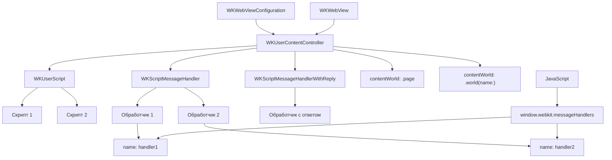

#WKUserContentController #WebKit #iOS #Swift #JavaScriptBridge #WKUserScript #WKScriptMessageHandler #Communication #Security #ContentWorld

---
**(контроллер пользовательского контента / управление взаимодействием с JavaScript)**

**WKUserContentController** — это класс из фреймворка **[[WebKit]]**, который предоставляет **централизованный механизм** для управления взаимодействием между Swift и JavaScript в `WKWebView`. Он позволяет внедрять пользовательские скрипты (`WKUserScript`), регистрировать обработчики сообщений ([[WKScriptMessageHandler]]), управлять контекстами выполнения и фильтрацией контента.

**Ключевые особенности (важно в 2026):**
- Является частью [[WKWebViewConfiguration]]
- **Неизменяемый** после создания webView
- Поддерживает **несколько обработчиков** с разными именами
- Управляет **пользовательскими скриптами** с привязкой к времени выполнения
- Поддерживает **изолированные миры** (`contentWorld`) для безопасности (iOS 14+)
- Все скрипты и обработчики добавляются **до создания** webView

---

### Основные свойства и методы WKUserContentController

| Компонент                                                | Тип                               | Назначение                                      |
| -------------------------------------------------------- | --------------------------------- | ----------------------------------------------- |
| `addUserScript(_:)`                                      | `WKUserScript`                    | Добавление пользовательского скрипта            |
| `removeAllUserScripts()`                                 | `()`                              | Удаление всех скриптов                          |
| `add(_:name:)`                                           | `WKScriptMessageHandler`          | Регистрация обработчика (старый способ)         |
| `addScriptMessageHandler(_:contentWorld:name:)`          | `WKScriptMessageHandler`          | Регистрация с указанием мира (iOS 14+)          |
| `addScriptMessageHandlerWithReply(_:contentWorld:name:)` | `WKScriptMessageHandlerWithReply` | Регистрация обработчика с ответом ([[iOS]] 14+) |
| `removeScriptMessageHandler(forName:contentWorld:)`      | `()`                              | Удаление обработчика по имени и миру            |
| `removeAllScriptMessageHandlers()`                       | `()`                              | Удаление всех обработчиков                      |
| `add(_:scriptMessageHandler:name:)`                      | `WKUserContentController`         | Добавление обработчика через объект-посредник   |

---

### Схема взаимосвязей



---

### Примеры (от простого к сложному)

#### 1. Базовое создание и настройка
```swift
import UIKit
import WebKit

class BasicUserContentControllerViewController: UIViewController {
    
    private var webView: WKWebView!
    private let contentController = WKUserContentController()
    
    override func viewDidLoad() {
        super.viewDidLoad()
        
        // 1. Создаём и настраиваем контроллер
        contentController.add(self, name: "basicHandler")
        
        // 2. Добавляем пользовательский скрипт
        let script = WKUserScript(
            source: "console.log('WKUserContentController создан!');",
            injectionTime: .atDocumentStart,
            forMainFrameOnly: true
        )
        contentController.addUserScript(script)
        
        // 3. Создаём конфигурацию
        let config = WKWebViewConfiguration()
        config.userContentController = contentController
        
        // 4. Создаём webView
        webView = WKWebView(frame: view.bounds, configuration: config)
        view.addSubview(webView)
        
        // 5. Загружаем HTML
        let html = """
        <html>
        <body>
            <h1>WKUserContentController Demo</h1>
            <button onclick="sendMessage()">Отправить сообщение</button>
            <script>
                function sendMessage() {
                    window.webkit.messageHandlers.basicHandler.postMessage('Привет из JS!');
                }
            </script>
        </body>
        </html>
        """
        webView.loadHTMLString(html, baseURL: nil)
    }
}

extension BasicUserContentControllerViewController: WKScriptMessageHandler {
    func userContentController(_ userContentController: WKUserContentController,
                               didReceive message: WKScriptMessage) {
        print("Получено сообщение: \(message.body)")
    }
}
```

#### 2. Добавление нескольких пользовательских скриптов
```swift
class MultipleScriptsViewController: UIViewController {
    
    private var webView: WKWebView!
    
    override func viewDidLoad() {
        super.viewDidLoad()
        
        let contentController = WKUserContentController()
        
        // 1. Скрипт, выполняемый в начале загрузки
        let initScript = WKUserScript(
            source: """
                window.myApp = {
                    version: '1.0.0',
                    platform: 'iOS',
                    startTime: Date.now()
                };
                console.log('App initialized:', window.myApp);
            """,
            injectionTime: .atDocumentStart,
            forMainFrameOnly: true
        )
        contentController.addUserScript(initScript)
        
        // 2. Скрипт, выполняемый после загрузки DOM
        let domScript = WKUserScript(
            source: """
                document.body.style.backgroundColor = '#f0f8ff';
                const style = document.createElement('style');
                style.textContent = `
                    button {
                        background: #007bff;
                        color: white;
                        padding: 10px 20px;
                        border: none;
                        border-radius: 5px;
                        font-size: 16px;
                    }
                    button:hover {
                        background: #0056b3;
                    }
                `;
                document.head.appendChild(style);
            """,
            injectionTime: .atDocumentEnd,
            forMainFrameOnly: true
        )
        contentController.addUserScript(domScript)
        
        // 3. Скрипт для всех фреймов
        let allFramesScript = WKUserScript(
            source: "console.log('Скрипт выполнен во всех фреймах');",
            injectionTime: .atDocumentEnd,
            forMainFrameOnly: false
        )
        contentController.addUserScript(allFramesScript)
        
        // Настройка webView
        let config = WKWebViewConfiguration()
        config.userContentController = contentController
        
        webView = WKWebView(frame: view.bounds, configuration: config)
        view.addSubview(webView)
        
        let html = """
        <html>
        <body>
            <h1>Стили применены через скрипт</h1>
            <button onclick="alert('Hello!')">Стилизованная кнопка</button>
            <p id="info"></p>
            <script>
                document.getElementById('info').textContent = 
                    'App: ' + window.myApp.version + ', Platform: ' + window.myApp.platform;
            </script>
        </body>
        </html>
        """
        webView.loadHTMLString(html, baseURL: nil)
    }
}
```

#### 3. Регистрация обработчиков с разными именами
```swift
class MultipleHandlersViewController: UIViewController {
    
    private var webView: WKWebView!
    
    override func viewDidLoad() {
        super.viewDidLoad()
        
        let contentController = WKUserContentController()
        
        // Регистрируем несколько обработчиков
        contentController.add(self, name: "authHandler")
        contentController.add(self, name: "dataHandler")
        contentController.add(self, name: "analyticsHandler")
        
        let config = WKWebViewConfiguration()
        config.userContentController = contentController
        
        webView = WKWebView(frame: view.bounds, configuration: config)
        view.addSubview(webView)
        
        let html = """
        <html>
        <body>
            <button onclick="sendAuth()">Авторизация</button>
            <button onclick="sendData()">Данные</button>
            <button onclick="sendAnalytics()">Аналитика</button>
            <script>
                function sendAuth() {
                    window.webkit.messageHandlers.authHandler.postMessage({ 
                        login: 'user@example.com', 
                        password: '123456' 
                    });
                }
                function sendData() {
                    window.webkit.messageHandlers.dataHandler.postMessage('Запрос данных');
                }
                function sendAnalytics() {
                    window.webkit.messageHandlers.analyticsHandler.postMessage({ 
                        event: 'button_click', 
                        time: Date.now() 
                    });
                }
            </script>
        </body>
        </html>
        """
        webView.loadHTMLString(html, baseURL: nil)
    }
}

extension MultipleHandlersViewController: WKScriptMessageHandler {
    func userContentController(_ userContentController: WKUserContentController,
                               didReceive message: WKScriptMessage) {
        switch message.name {
        case "authHandler":
            print("🔐 Авторизация: \(message.body)")
        case "dataHandler":
            print("📊 Запрос данных: \(message.body)")
        case "analyticsHandler":
            print("📈 Аналитика: \(message.body)")
        default:
            print("⚠️ Неизвестный обработчик: \(message.name)")
        }
    }
}
```

#### 4. Использование с WKScriptMessageHandlerWithReply (iOS 14+)
```swift
@available(iOS 14.0, *)
class HandlerWithReplyViewController: UIViewController {
    
    private var webView: WKWebView!
    
    override func viewDidLoad() {
        super.viewDidLoad()
        
        let contentController = WKUserContentController()
        
        // Регистрируем обработчик с поддержкой ответа
        contentController.addScriptMessageHandlerWithReply(
            self,
            contentWorld: .page,
            name: "calculator"
        )
        
        let config = WKWebViewConfiguration()
        config.userContentController = contentController
        
        webView = WKWebView(frame: view.bounds, configuration: config)
        view.addSubview(webView)
        
        let html = """
        <html>
        <body>
            <button onclick="calculate()">Посчитать сумму</button>
            <div id="result"></div>
            <script>
                async function calculate() {
                    try {
                        const numbers = [10, 20, 30, 40, 50];
                        const result = await window.webkit.messageHandlers.calculator.postMessage({
                            action: 'sum',
                            numbers: numbers
                        });
                        document.getElementById('result').textContent = 
                            'Сумма чисел ' + numbers.join(' + ') + ' = ' + result.sum;
                        console.log('Результат:', result);
                    } catch(error) {
                        document.getElementById('result').textContent = 'Ошибка: ' + error;
                        console.error('Ошибка:', error);
                    }
                }
            </script>
        </body>
        </html>
        """
        webView.loadHTMLString(html, baseURL: nil)
    }
}

@available(iOS 14.0, *)
extension HandlerWithReplyViewController: WKScriptMessageHandlerWithReply {
    func userContentController(_ userContentController: WKUserContentController,
                               didReceive message: WKScriptMessage,
                               replyHandler: @escaping (Any?, String?) -> Void) {
        guard let data = message.body as? [String: Any],
              let action = data["action"] as? String else {
            replyHandler(nil, "Неверный формат")
            return
        }
        
        if action == "sum", let numbers = data["numbers"] as? [Int] {
            let sum = numbers.reduce(0, +)
            replyHandler(["sum": sum, "count": numbers.count], nil)
        } else {
            replyHandler(nil, "Неизвестное действие")
        }
    }
}
```

#### 5. Изолированные миры (contentWorld) для безопасности
```swift
@available(iOS 14.0, *)
class ContentWorldsViewController: UIViewController {
    
    private var webView: WKWebView!
    
    override func viewDidLoad() {
        super.viewDidLoad()
        
        let contentController = WKUserContentController()
        
        // 1. Обработчик в мире страницы (доступен глобально)
        contentController.addScriptMessageHandler(
            self,
            contentWorld: .page,
            name: "mainHandler"
        )
        
        // 2. Обработчик в изолированном мире (безопаснее)
        contentController.addScriptMessageHandler(
            self,
            contentWorld: .world(name: "secureWorld"),
            name: "secureHandler"
        )
        
        // 3. Обработчик с ответом в изолированном мире
        contentController.addScriptMessageHandlerWithReply(
            self,
            contentWorld: .world(name: "replyWorld"),
            name: "replyHandler"
        )
        
        // 4. Пользовательский скрипт в изолированном мире
        let secureScript = WKUserScript(
            source: "console.log('Скрипт в изолированном мире');",
            injectionTime: .atDocumentStart,
            forMainFrameOnly: true,
            in: .world(name: "secureWorld")
        )
        contentController.addUserScript(secureScript)
        
        let config = WKWebViewConfiguration()
        config.userContentController = contentController
        
        webView = WKWebView(frame: view.bounds, configuration: config)
        view.addSubview(webView)
        
        let html = """
        <html>
        <body>
            <button onclick="callMain()">Вызвать mainHandler</button>
            <button onclick="callSecure()">Вызвать secureHandler</button>
            <button onclick="callReply()">Вызвать replyHandler</button>
            <div id="result"></div>
            <script>
                async function callMain() {
                    window.webkit.messageHandlers.mainHandler.postMessage('Главный мир');
                }
                async function callSecure() {
                    window.webkit.messageHandlers.secureHandler.postMessage('Изолированный мир');
                }
                async function callReply() {
                    const result = await window.webkit.messageHandlers.replyHandler.postMessage('Запрос');
                    document.getElementById('result').textContent = 'Ответ: ' + result;
                }
            </script>
        </body>
        </html>
        """
        webView.loadHTMLString(html, baseURL: nil)
    }
}

@available(iOS 14.0, *)
extension ContentWorldsViewController: WKScriptMessageHandler {
    func userContentController(_ userContentController: WKUserContentController,
                               didReceive message: WKScriptMessage) {
        // Сообщение приходит с информацией о мире
        print("Получено из мира: \(message.name)")
        print("Тело: \(message.body)")
    }
}

@available(iOS 14.0, *)
extension ContentWorldsViewController: WKScriptMessageHandlerWithReply {
    func userContentController(_ userContentController: WKUserContentController,
                               didReceive message: WKScriptMessage,
                               replyHandler: @escaping (Any?, String?) -> Void) {
        replyHandler("Ответ из replyWorld", nil)
    }
}
```

#### 6. Динамическое управление скриптами и обработчиками
```swift
class DynamicContentController: UIViewController {
    
    private var webView: WKWebView!
    private let contentController = WKUserContentController()
    
    override func viewDidLoad() {
        super.viewDidLoad()
        
        // Добавляем начальные скрипты и обработчики
        setupInitialContent()
        
        let config = WKWebViewConfiguration()
        config.userContentController = contentController
        
        webView = WKWebView(frame: view.bounds, configuration: config)
        view.addSubview(webView)
        
        loadHTML()
    }
    
    private func setupInitialContent() {
        // 1. Добавляем обработчик
        contentController.add(self, name: "dynamicHandler")
        
        // 2. Добавляем скрипт для инъекции переменной
        let script = WKUserScript(
            source: "window.dynamicVariable = 'initial';",
            injectionTime: .atDocumentStart,
            forMainFrameOnly: true
        )
        contentController.addUserScript(script)
    }
    
    private func loadHTML() {
        let html = """
        <html>
        <body>
            <h1>Динамическое управление</h1>
            <div id="status">Начальное состояние</div>
            <button onclick="addScript()">Добавить скрипт</button>
            <button onclick="removeScripts()">Удалить все скрипты</button>
            <button onclick="addHandler()">Добавить обработчик</button>
            <button onclick="removeHandler()">Удалить обработчик</button>
            <script>
                function addScript() {
                    window.dynamicVariable = 'updated';
                    document.getElementById('status').textContent = 
                        'Скрипт добавлен, переменная: ' + window.dynamicVariable;
                }
                function removeScripts() {
                    // Нельзя удалить скрипты из JS, только из Swift
                    document.getElementById('status').textContent = 
                        'Для удаления скриптов вызовите Swift';
                    window.webkit.messageHandlers.dynamicHandler.postMessage('removeScripts');
                }
                function addHandler() {
                    window.webkit.messageHandlers.dynamicHandler.postMessage('addHandler');
                }
                function removeHandler() {
                    window.webkit.messageHandlers.dynamicHandler.postMessage('removeHandler');
                }
            </script>
        </body>
        </html>
        """
        webView.loadHTMLString(html, baseURL: nil)
    }
    
    @IBAction func removeAllScripts() {
        contentController.removeAllUserScripts()
        print("🗑️ Все скрипты удалены")
    }
    
    @IBAction func addNewScript() {
        let script = WKUserScript(
            source: "document.body.style.backgroundColor = 'lightgreen';",
            injectionTime: .atDocumentEnd,
            forMainFrameOnly: true
        )
        contentController.addUserScript(script)
        print("✅ Добавлен новый скрипт")
    }
    
    @IBAction func removeHandler() {
        contentController.removeScriptMessageHandler(forName: "dynamicHandler")
        print("🗑️ Обработчик dynamicHandler удалён")
    }
}

extension DynamicContentController: WKScriptMessageHandler {
    func userContentController(_ userContentController: WKUserContentController,
                               didReceive message: WKScriptMessage) {
        if let command = message.body as? String {
            switch command {
            case "removeScripts":
                contentController.removeAllUserScripts()
                print("🗑️ Скрипты удалены по запросу JS")
            case "addHandler":
                // Нельзя добавить обработчик из JS, но можно показать сообщение
                print("📩 Запрос на добавление обработчика")
            case "removeHandler":
                contentController.removeScriptMessageHandler(forName: "dynamicHandler")
                print("🗑️ Обработчик удалён по запросу JS")
            default:
                print("⚠️ Неизвестная команда: \(command)")
            }
        }
    }
}
```

#### 7. Обёртка для безопасного добавления обработчиков
```swift
class SafeContentControllerManager {
    
    private let contentController: WKUserContentController
    private var activeHandlers: Set<String> = []
    
    init(contentController: WKUserContentController) {
        self.contentController = contentController
    }
    
    // Безопасное добавление обработчика
    func addHandler<T: WKScriptMessageHandler>(
        _ handler: T,
        name: String,
        contentWorld: WKContentWorld = .page
    ) {
        // Проверяем, не зарегистрирован ли уже обработчик
        if activeHandlers.contains(name) {
            print("⚠️ Обработчик \(name) уже зарегистрирован")
            return
        }
        
        if #available(iOS 14.0, *) {
            contentController.addScriptMessageHandler(
                handler,
                contentWorld: contentWorld,
                name: name
            )
        } else {
            contentController.add(handler, name: name)
        }
        
        activeHandlers.insert(name)
        print("✅ Обработчик \(name) зарегистрирован")
    }
    
    // Безопасное удаление обработчика
    func removeHandler(name: String, contentWorld: WKContentWorld = .page) {
        guard activeHandlers.contains(name) else {
            print("⚠️ Обработчик \(name) не найден")
            return
        }
        
        if #available(iOS 14.0, *) {
            contentController.removeScriptMessageHandler(
                forName: name,
                contentWorld: contentWorld
            )
        } else {
            contentController.removeScriptMessageHandler(forName: name)
        }
        
        activeHandlers.remove(name)
        print("🗑️ Обработчик \(name) удалён")
    }
    
    // Получить список активных обработчиков
    func getActiveHandlers() -> [String] {
        return Array(activeHandlers)
    }
}

// Использование
class SafeViewController: UIViewController {
    
    private var webView: WKWebView!
    private let contentController = WKUserContentController()
    private var manager: SafeContentControllerManager!
    
    override func viewDidLoad() {
        super.viewDidLoad()
        
        manager = SafeContentControllerManager(contentController: contentController)
        
        // Безопасно добавляем обработчики
        manager.addHandler(self, name: "safeHandler1")
        manager.addHandler(self, name: "safeHandler2")
        
        // Попытка добавить существующий
        manager.addHandler(self, name: "safeHandler1") // ⚠️ Предупреждение
        
        let config = WKWebViewConfiguration()
        config.userContentController = contentController
        
        webView = WKWebView(frame: view.bounds, configuration: config)
        view.addSubview(webView)
        
        print("Активные обработчики: \(manager.getActiveHandlers())")
    }
    
    deinit {
        // Удаляем все обработчики при уничтожении
        manager.getActiveHandlers().forEach { name in
            manager.removeHandler(name: name)
        }
    }
}

extension SafeViewController: WKScriptMessageHandler {
    func userContentController(_ userContentController: WKUserContentController,
                               didReceive message: WKScriptMessage) {
        print("Получено от \(message.name): \(message.body)")
    }
}
```

#### 8. Полный менеджер с поддержкой всех функций
```swift
class UserContentControllerManager {
    
    private let contentController: WKUserContentController
    private var scriptHandlers: [String: Any] = [:]
    private var userScripts: [WKUserScript] = []
    
    init() {
        contentController = WKUserContentController()
    }
    
    // MARK: - Скрипты
    
    func addScript(source: String,
                   injectionTime: WKUserScriptInjectionTime = .atDocumentEnd,
                   forMainFrameOnly: Bool = true,
                   contentWorld: WKContentWorld = .page) {
        let script = WKUserScript(
            source: source,
            injectionTime: injectionTime,
            forMainFrameOnly: forMainFrameOnly,
            in: contentWorld
        )
        userScripts.append(script)
        contentController.addUserScript(script)
        print("✅ Добавлен скрипт (время: \(injectionTime.rawValue))")
    }
    
    func removeAllScripts() {
        userScripts.removeAll()
        contentController.removeAllUserScripts()
        print("🗑️ Все скрипты удалены")
    }
    
    // MARK: - Обработчики
    
    func addHandler<T: WKScriptMessageHandler>(
        _ handler: T,
        name: String,
        contentWorld: WKContentWorld = .page
    ) {
        guard scriptHandlers[name] == nil else {
            print("⚠️ Обработчик \(name) уже существует")
            return
        }
        
        if #available(iOS 14.0, *) {
            contentController.addScriptMessageHandler(
                handler,
                contentWorld: contentWorld,
                name: name
            )
        } else {
            contentController.add(handler, name: name)
        }
        
        scriptHandlers[name] = handler
        print("✅ Добавлен обработчик: \(name)")
    }
    
    func addHandlerWithReply<T: WKScriptMessageHandlerWithReply>(
        _ handler: T,
        name: String,
        contentWorld: WKContentWorld = .page
    ) {
        guard scriptHandlers[name] == nil else {
            print("⚠️ Обработчик \(name) уже существует")
            return
        }
        
        if #available(iOS 14.0, *) {
            contentController.addScriptMessageHandlerWithReply(
                handler,
                contentWorld: contentWorld,
                name: name
            )
        } else {
            print("⚠️ WKScriptMessageHandlerWithReply доступен с iOS 14")
            return
        }
        
        scriptHandlers[name] = handler
        print("✅ Добавлен обработчик с ответом: \(name)")
    }
    
    func removeHandler(name: String, contentWorld: WKContentWorld = .page) {
        guard scriptHandlers[name] != nil else {
            print("⚠️ Обработчик \(name) не найден")
            return
        }
        
        if #available(iOS 14.0, *) {
            contentController.removeScriptMessageHandler(
                forName: name,
                contentWorld: contentWorld
            )
        } else {
            contentController.removeScriptMessageHandler(forName: name)
        }
        
        scriptHandlers.removeValue(forKey: name)
        print("🗑️ Удалён обработчик: \(name)")
    }
    
    func removeAllHandlers() {
        let names = Array(scriptHandlers.keys)
        names.forEach { name in
            if #available(iOS 14.0, *) {
                contentController.removeScriptMessageHandler(
                    forName: name,
                    contentWorld: .page
                )
            } else {
                contentController.removeScriptMessageHandler(forName: name)
            }
        }
        scriptHandlers.removeAll()
        print("🗑️ Все обработчики удалены")
    }
    
    // MARK: - Получение контроллера
    
    func getContentController() -> WKUserContentController {
        return contentController
    }
    
    // MARK: - Информация
    
    func getActiveHandlers() -> [String] {
        return Array(scriptHandlers.keys)
    }
    
    func getScriptsCount() -> Int {
        return userScripts.count
    }
}

// Использование
class FullManagerExampleViewController: UIViewController, WKScriptMessageHandler {
    
    private var webView: WKWebView!
    private let manager = UserContentControllerManager()
    
    override func viewDidLoad() {
        super.viewDidLoad()
        
        // 1. Добавляем скрипты
        manager.addScript(
            source: "console.log('Приложение запущено');",
            injectionTime: .atDocumentStart
        )
        
        manager.addScript(
            source: "document.body.style.backgroundColor = '#e6f3ff';",
            injectionTime: .atDocumentEnd
        )
        
        // 2. Добавляем обработчики
        manager.addHandler(self, name: "testHandler")
        
        // 3. Получаем контроллер
        let contentController = manager.getContentController()
        
        // 4. Создаём конфигурацию
        let config = WKWebViewConfiguration()
        config.userContentController = contentController
        
        // 5. Создаём webView
        webView = WKWebView(frame: view.bounds, configuration: config)
        view.addSubview(webView)
        
        // 6. Загружаем HTML
        let html = """
        <html>
        <body>
            <h1>Полный менеджер</h1>
            <button onclick="test()">Тест</button>
            <script>
                function test() {
                    window.webkit.messageHandlers.testHandler.postMessage('Hello!');
                }
            </script>
        </body>
        </html>
        """
        webView.loadHTMLString(html, baseURL: nil)
        
        // 7. Выводим информацию
        print("Активные обработчики: \(manager.getActiveHandlers())")
        print("Количество скриптов: \(manager.getScriptsCount())")
    }
    
    func userContentController(_ userContentController: WKUserContentController,
                               didReceive message: WKScriptMessage) {
        print("Получено: \(message.body)")
    }
}
```

#### 9. Удаление обработчиков через делегат
```swift
class CleanupViewController: UIViewController, WKScriptMessageHandler {
    
    private var webView: WKWebView!
    private let contentController = WKUserContentController()
    
    override func viewDidLoad() {
        super.viewDidLoad()
        
        // Добавляем обработчики
        contentController.add(self, name: "handler1")
        contentController.add(self, name: "handler2")
        contentController.add(self, name: "handler3")
        
        let config = WKWebViewConfiguration()
        config.userContentController = contentController
        
        webView = WKWebView(frame: view.bounds, configuration: config)
        view.addSubview(webView)
    }
    
    func userContentController(_ userContentController: WKUserContentController,
                               didReceive message: WKScriptMessage) {
        print("Получено от \(message.name): \(message.body)")
        
        // Удаляем обработчик после получения сообщения
        if message.name == "handler1" {
            contentController.removeScriptMessageHandler(forName: "handler1")
            print("🗑️ Обработчик handler1 удалён после первого сообщения")
        }
    }
    
    override func viewWillDisappear(_ animated: Bool) {
        super.viewWillDisappear(animated)
        
        // Удаляем все обработчики при уходе с экрана
        contentController.removeAllScriptMessageHandlers()
        print("🗑️ Все обработчики удалены при закрытии экрана")
    }
    
    deinit {
        // Дополнительная очистка
        contentController.removeAllUserScripts()
        print("🗑️ Полная очистка ресурсов")
    }
}
```

#### 10. Обход сильных ссылок через слабый объект-посредник
```swift
// Слабый посредник для избежания утечек памяти
class WeakScriptMessageHandler: NSObject, WKScriptMessageHandler {
    weak var delegate: WKScriptMessageHandler?
    
    init(delegate: WKScriptMessageHandler) {
        self.delegate = delegate
        super.init()
    }
    
    func userContentController(_ userContentController: WKUserContentController,
                               didReceive message: WKScriptMessage) {
        delegate?.userContentController(userContentController, didReceive: message)
    }
}

// Безопасный контроллер без утечек
class SafeFromRetainCycleViewController: UIViewController, WKScriptMessageHandler {
    
    private var webView: WKWebView!
    
    override func viewDidLoad() {
        super.viewDidLoad()
        
        let contentController = WKUserContentController()
        
        // Используем слабый посредник вместо self
        let handler = WeakScriptMessageHandler(delegate: self)
        contentController.add(handler, name: "safeHandler")
        
        let config = WKWebViewConfiguration()
        config.userContentController = contentController
        
        webView = WKWebView(frame: view.bounds, configuration: config)
        view.addSubview(webView)
        
        // Сохраняем ссылку на обработчик, чтобы он не был удалён
        objc_setAssociatedObject(self, "handler", handler, .OBJC_ASSOCIATION_RETAIN_NONATOMIC)
    }
    
    func userContentController(_ userContentController: WKUserContentController,
                               didReceive message: WKScriptMessage) {
        print("Безопасное получение: \(message.body)")
    }
    
    deinit {
        // Обработчик удалится автоматически вместе с webView
        print("🔴 Controller уничтожен, утечек нет")
    }
}
```

---

### Важные нюансы 2026 года

> [!warning]
> **Сильные ссылки:** `WKUserContentController` хранит **сильные** ссылки на обработчики. Всегда используйте слабые ссылки или отдельный объект-посредник для избежания утечек.
>
> **Неизменяемость:** Все скрипты и обработчики должны быть добавлены **до создания** `WKWebView`. После создания webView изменения невозможны.
>
> **iOS 14+:** Используйте `contentWorld` для изоляции скриптов и обработчиков — это повышает безопасность.
>
> **Удаление обработчиков:** Всегда удаляйте обработчики в `deinit` через `removeScriptMessageHandler` или `removeAllScriptMessageHandlers`.
>
> **Порядок выполнения:** Скрипты выполняются в порядке добавления.
>
> **`forMainFrameOnly`:** Если установить `false`, скрипт будет выполняться во всех фреймах (включая iframe).

---

### Лучшие практики 2026

1. **Используйте отдельный объект-посредник** для избежания retain cycle
2. **Всегда удаляйте обработчики** в [[deinit]] или [[viewWillDisappear]]
3. **Используйте `contentWorld`** для изоляции (iOS 14+)
4. **Добавляйте скрипты до создания** webView
5. **Логируйте регистрацию/удаление** обработчиков для отладки
6. **Используйте `injectionTime`** правильно:
   - `.atDocumentStart` — для инициализации переменных
   - `.atDocumentEnd` — для модификации DOM
7. **Проверяйте существование** обработчика перед добавлением

---

### Связь с другими темами

- [[WKUserScript]] — пользовательские скрипты
- [[WKScriptMessageHandler]] — обработка сообщений
- [[WKScriptMessageHandlerWithReply]] — обработка с ответом
- [[WKWebViewConfiguration]] — конфигурация webView
- [[WKContentWorld]] — изолированные миры (iOS 14+)
- [[WKScriptMessage]] — объект сообщения