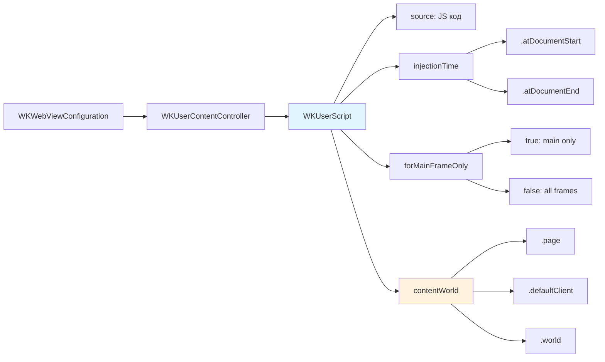

#WKUserScript #WebKit #iOS #Swift #JavaScript #WKWebView #WKContentWorld #ScriptInjection #DOM #iOS14

---
**(пользовательский скрипт / внедрение JavaScript в WKWebView)**

**WKUserScript** — это класс из фреймворка **[[WebKit]]**, который представляет собой **JavaScript-код**, внедряемый в веб-страницу в процессе загрузки. Он позволяет выполнять произвольный JS-код до или после загрузки DOM, изменять стили, внедрять переменные, перехватывать события и создавать мосты между нативным кодом и веб-контентом.

**Ключевые особенности (важно в 2026):**
- Выполняется **всего один раз** при загрузке страницы (или фрейма)
- Может быть внедрён как в **главный фрейм**, так и во **все дочерние фреймы** (iframe)
- Поддерживает **изолированные миры** ([[WKContentWorld]]) начиная с iOS 14
- Выполняется в **контексте страницы**, имея доступ к её DOM и глобальным объектам
- Порядок выполнения определяется **временем внедрения** и порядком добавления

---

### Структура WKUserScript

```swift
class WKUserScript : NSObject {
    // Исходный код JavaScript
    var source: String { get }
    
    // Время внедрения: .atDocumentStart (до загрузки DOM) или .atDocumentEnd (после загрузки DOM)
    var injectionTime: WKUserScriptInjectionTime { get }
    
    // Выполнять только в главном фрейме (true) или во всех фреймах (false)
    var forMainFrameOnly: Bool { get }
    
    // Инициализатор (iOS 8+)
    init(source: String, 
         injectionTime: WKUserScriptInjectionTime, 
         forMainFrameOnly: Bool)
    
    // Инициализатор с указанием мира (iOS 14+)
    @available(iOS 14.0, *)
    init(source: String, 
         injectionTime: WKUserScriptInjectionTime, 
         forMainFrameOnly: Bool, 
         in contentWorld: WKContentWorld)
}
```

**WKUserScriptInjectionTime**:
- `.atDocumentStart` — внедрение до загрузки DOM (до события `DOMContentLoaded`) — для инициализации
- `.atDocumentEnd` — внедрение после загрузки DOM (после `DOMContentLoaded`) — для модификации страницы

---

### Схема взаимосвязей



---

### Примеры (от простого к сложному)

#### 1. Базовое внедрение скрипта (изменение фона)
```swift
import UIKit
import WebKit

class BasicUserScriptViewController: UIViewController {
    
    private var webView: WKWebView!
    
    override func viewDidLoad() {
        super.viewDidLoad()
        
        let contentController = WKUserContentController()
        
        // 1. Создаём скрипт
        let script = WKUserScript(
            source: "document.body.style.backgroundColor = 'lightblue';",
            injectionTime: .atDocumentEnd, // После загрузки DOM
            forMainFrameOnly: true // Только главный фрейм
        )
        
        // 2. Добавляем скрипт в контроллер
        contentController.addUserScript(script)
        
        let config = WKWebViewConfiguration()
        config.userContentController = contentController
        
        webView = WKWebView(frame: view.bounds, configuration: config)
        view.addSubview(webView)
        
        // 3. Загружаем страницу
        let html = """
        <html>
        <body>
            <h1>Страница с синим фоном</h1>
            <p>Фон изменён через WKUserScript</p>
        </body>
        </html>
        """
        webView.loadHTMLString(html, baseURL: nil)
    }
}
```

#### 2. Скрипт до загрузки DOM (инициализация переменных)
```swift
class InitScriptViewController: UIViewController {
    
    private var webView: WKWebView!
    
    override func viewDidLoad() {
        super.viewDidLoad()
        
        let contentController = WKUserContentController()
        
        // 1. Скрипт выполняется ДО загрузки DOM
        let initScript = WKUserScript(
            source: """
                // Создаём глобальный объект приложения
                window.MyApp = {
                    version: '1.0.0',
                    platform: 'iOS',
                    buildDate: new Date().toISOString(),
                    features: {
                        darkMode: true,
                        analytics: false
                    }
                };
                
                // Перехватываем console.log для логирования
                const originalLog = console.log;
                console.log = function(...args) {
                    // Отправляем логи в Swift
                    try {
                        window.webkit.messageHandlers.logHandler.postMessage(args.join(' '));
                    } catch(e) {
                        // Игнорируем ошибки
                    }
                    originalLog.apply(console, args);
                };
                
                console.log('✅ Приложение инициализировано');
            """,
            injectionTime: .atDocumentStart, // ДО загрузки DOM
            forMainFrameOnly: true
        )
        
        contentController.addUserScript(initScript)
        contentController.add(self, name: "logHandler")
        
        let config = WKWebViewConfiguration()
        config.userContentController = contentController
        
        webView = WKWebView(frame: view.bounds, configuration: config)
        view.addSubview(webView)
        
        // 2. Загружаем страницу, которая использует MyApp
        let html = """
        <html>
        <body>
            <h1>Приложение версии: <span id="version"></span></h1>
            <p>Платформа: <span id="platform"></span></p>
            <p>Тёмная тема: <span id="darkMode"></span></p>
            <script>
                // Используем инициализированный объект
                document.getElementById('version').textContent = window.MyApp.version;
                document.getElementById('platform').textContent = window.MyApp.platform;
                document.getElementById('darkMode').textContent = 
                    window.MyApp.features.darkMode ? 'Включена' : 'Выключена';
                
                console.log('Страница загружена!');
            </script>
        </body>
        </html>
        """
        webView.loadHTMLString(html, baseURL: nil)
    }
}

extension InitScriptViewController: WKScriptMessageHandler {
    func userContentController(_ userContentController: WKUserContentController,
                               didReceive message: WKScriptMessage) {
        if message.name == "logHandler" {
            print("📝 JS Log: \(message.body)")
        }
    }
}
```

#### 3. Скрипт для всех фреймов (включая iframe)
```swift
class AllFramesScriptViewController: UIViewController {
    
    private var webView: WKWebView!
    
    override func viewDidLoad() {
        super.viewDidLoad()
        
        let contentController = WKUserContentController()
        
        // 1. Скрипт выполняется во ВСЕХ фреймах
        let allFramesScript = WKUserScript(
            source: """
                // Добавляем рамку для всех фреймов
                document.body.style.border = '2px solid red';
                
                // Добавляем информацию о фрейме
                const infoDiv = document.createElement('div');
                infoDiv.textContent = '🔲 ' + (window === window.top ? 'Главный фрейм' : 'Дочерний фрейм');
                infoDiv.style.cssText = 'background: #333; color: white; padding: 5px; font-size: 12px;';
                document.body.prepend(infoDiv);
            """,
            injectionTime: .atDocumentEnd,
            forMainFrameOnly: false // Выполняется во всех фреймах!
        )
        
        contentController.addUserScript(allFramesScript)
        
        let config = WKWebViewConfiguration()
        config.userContentController = contentController
        
        webView = WKWebView(frame: view.bounds, configuration: config)
        view.addSubview(webView)
        
        // 2. Страница с iframe
        let html = """
        <html>
        <body>
            <h1>Главная страница</h1>
            <iframe srcdoc="
                <h2>Содержимое iframe</h2>
                <p>Это дочерний фрейм</p>
            " style="width:100%;height:200px;border:1px solid #ccc;"></iframe>
            <p>Скрипт добавил рамки и метки на все фреймы</p>
        </body>
        </html>
        """
        webView.loadHTMLString(html, baseURL: nil)
    }
}
```

#### 4. Множественные скрипты (порядок выполнения)
```swift
class MultipleScriptsViewController: UIViewController {
    
    private var webView: WKWebView!
    
    override func viewDidLoad() {
        super.viewDidLoad()
        
        let contentController = WKUserContentController()
        
        // 1. Скрипт 1: Создаём объект
        let script1 = WKUserScript(
            source: "window.counter = { value: 0 }; console.log('Скрипт 1: объект создан');",
            injectionTime: .atDocumentStart,
            forMainFrameOnly: true
        )
        contentController.addUserScript(script1)
        
        // 2. Скрипт 2: Изменяем объект
        let script2 = WKUserScript(
            source: "window.counter.value = 10; console.log('Скрипт 2: значение изменено');",
            injectionTime: .atDocumentStart,
            forMainFrameOnly: true
        )
        contentController.addUserScript(script2)
        
        // 3. Скрипт 3: Используем объект после загрузки DOM
        let script3 = WKUserScript(
            source: """
                document.addEventListener('DOMContentLoaded', function() {
                    document.getElementById('counter').textContent = 'Значение: ' + window.counter.value;
                    console.log('Скрипт 3: DOM обновлён');
                });
            """,
            injectionTime: .atDocumentEnd,
            forMainFrameOnly: true
        )
        contentController.addUserScript(script3)
        
        let config = WKWebViewConfiguration()
        config.userContentController = contentController
        
        webView = WKWebView(frame: view.bounds, configuration: config)
        view.addSubview(webView)
        
        let html = """
        <html>
        <body>
            <h1>Множественные скрипты</h1>
            <p id="counter">Ожидание...</p>
            <p>Скрипты выполняются в порядке добавления</p>
        </body>
        </html>
        """
        webView.loadHTMLString(html, baseURL: nil)
    }
}
```

#### 5. Инъекция CSS через JavaScript
```swift
class CSSInjectionViewController: UIViewController {
    
    private var webView: WKWebView!
    
    override func viewDidLoad() {
        super.viewDidLoad()
        
        let contentController = WKUserContentController()
        
        // 1. Инъекция CSS стилей через JS
        let cssScript = WKUserScript(
            source: """
                // Создаём <style> элемент
                const styleElement = document.createElement('style');
                styleElement.textContent = `
                    /* Кастомные стили для приложения */
                    body {
                        font-family: -apple-system, BlinkMacSystemFont, 'Segoe UI', Roboto, sans-serif;
                        background: linear-gradient(135deg, #667eea 0%, #764ba2 100%);
                        color: white;
                        padding: 20px;
                    }
                    h1 {
                        color: #ffd700;
                        text-shadow: 2px 2px 4px rgba(0,0,0,0.3);
                    }
                    .custom-button {
                        background: #ffd700;
                        color: #333;
                        padding: 10px 20px;
                        border: none;
                        border-radius: 25px;
                        font-size: 16px;
                        font-weight: bold;
                        cursor: pointer;
                        transition: transform 0.2s;
                    }
                    .custom-button:hover {
                        transform: scale(1.05);
                    }
                    .custom-card {
                        background: rgba(255,255,255,0.1);
                        backdrop-filter: blur(10px);
                        padding: 20px;
                        border-radius: 15px;
                        margin: 10px 0;
                    }
                `;
                document.head.appendChild(styleElement);
                
                // Добавляем классы к элементам
                document.querySelectorAll('button').forEach(btn => {
                    btn.classList.add('custom-button');
                });
                document.querySelectorAll('.card').forEach(card => {
                    card.classList.add('custom-card');
                });
            """,
            injectionTime: .atDocumentEnd,
            forMainFrameOnly: true
        )
        
        contentController.addUserScript(cssScript)
        
        let config = WKWebViewConfiguration()
        config.userContentController = contentController
        
        webView = WKWebView(frame: view.bounds, configuration: config)
        view.addSubview(webView)
        
        // 2. Страница с базовым HTML
        let html = """
        <html>
        <body>
            <h1>Стилизованная страница</h1>
            <div class="card">
                <p>Это карточка с кастомным стилем</p>
                <button onclick="alert('Привет!')">Нажми меня</button>
            </div>
            <div class="card">
                <p>Ещё одна карточка с другим стилем</p>
                <button onclick="alert('Hello!')">Press me</button>
            </div>
        </body>
        </html>
        """
        webView.loadHTMLString(html, baseURL: nil)
    }
}
```

#### 6. Использование с [[WKContentWorld]] (iOS 14+)
```swift
@available(iOS 14.0, *)
class ContentWorldScriptViewController: UIViewController {
    
    private var webView: WKWebView!
    
    override func viewDidLoad() {
        super.viewDidLoad()
        
        let contentController = WKUserContentController()
        
        // 1. Скрипт в изолированном мире приложения
        let appWorldScript = WKUserScript(
            source: """
                // Эта переменная видна ТОЛЬКО в мире приложения
                window.appSecret = 'VerySecretToken123';
                console.log('Секрет установлен в мире приложения');
            """,
            injectionTime: .atDocumentStart,
            forMainFrameOnly: true,
            in: .defaultClient // Изолированный мир
        )
        contentController.addUserScript(appWorldScript)
        
        // 2. Скрипт в мире страницы (виден странице)
        let pageWorldScript = WKUserScript(
            source: """
                // Эта переменная видна странице
                window.pageVariable = 'Visible to page';
                console.log('Переменная установлена в мире страницы');
            """,
            injectionTime: .atDocumentStart,
            forMainFrameOnly: true,
            in: .page // Мир страницы
        )
        contentController.addUserScript(pageWorldScript)
        
        // 3. Скрипт для проверки изоляции
        let checkScript = WKUserScript(
            source: """
                document.addEventListener('DOMContentLoaded', function() {
                    const info = document.createElement('div');
                    info.innerHTML = `
                        <h3>Проверка изоляции</h3>
                        <p>pageVariable: ${typeof window.pageVariable !== 'undefined' ? window.pageVariable : 'не определена'}</p>
                        <p>appSecret: ${typeof window.appSecret !== 'undefined' ? window.appSecret : 'не определена'}</p>
                        <p style="color: ${typeof window.appSecret !== 'undefined' ? 'red' : 'green'}">
                            ${typeof window.appSecret !== 'undefined' ? '⚠️ Секрет доступен странице!' : '✅ Секрет изолирован!'}
                        </p>
                    `;
                    document.body.prepend(info);
                });
            """,
            injectionTime: .atDocumentEnd,
            forMainFrameOnly: true,
            in: .page // Выполняется в мире страницы
        )
        contentController.addUserScript(checkScript)
        
        let config = WKWebViewConfiguration()
        config.userContentController = contentController
        
        webView = WKWebView(frame: view.bounds, configuration: config)
        view.addSubview(webView)
        
        let html = """
        <html>
        <body>
            <h1>Изоляция WKContentWorld</h1>
            <p>Страница не должна видеть секреты из изолированного мира</p>
        </body>
        </html>
        """
        webView.loadHTMLString(html, baseURL: nil)
    }
}
```

#### 7. Динамическое добавление и удаление скриптов
```swift
class DynamicScriptViewController: UIViewController {
    
    private var webView: WKWebView!
    private let contentController = WKUserContentController()
    private var scriptCounter = 0
    
    override func viewDidLoad() {
        super.viewDidLoad()
        
        // Добавляем начальный скрипт
        addScript("console.log('📱 Начальный скрипт');")
        
        let config = WKWebViewConfiguration()
        config.userContentController = contentController
        
        webView = WKWebView(frame: view.bounds, configuration: config)
        view.addSubview(webView)
        
        // Добавляем кнопки управления
        setupControls()
        
        let html = """
        <html>
        <body>
            <h1>Динамическое управление скриптами</h1>
            <div id="info"></div>
            <p>Количество скриптов: <span id="count">0</span></p>
            <script>
                function updateCount(count) {
                    document.getElementById('count').textContent = count;
                }
            </script>
        </body>
        </html>
        """
        webView.loadHTMLString(html, baseURL: nil)
    }
    
    private func setupControls() {
        // Кнопка "Добавить скрипт"
        let addButton = UIButton(type: .system)
        addButton.setTitle("➕ Добавить скрипт", for: .normal)
        addButton.addTarget(self, action: #selector(addNewScript), for: .touchUpInside)
        
        // Кнопка "Удалить все"
        let removeButton = UIButton(type: .system)
        removeButton.setTitle("🗑️ Удалить все", for: .normal)
        removeButton.addTarget(self, action: #selector(removeAllScripts), for: .touchUpInside)
        
        // Располагаем кнопки...
    }
    
    @objc private func addNewScript() {
        scriptCounter += 1
        let script = WKUserScript(
            source: """
                console.log('📝 Скрипт #\(scriptCounter) выполнен');
                document.body.style.backgroundColor = '\(getRandomColor())';
                
                // Обновляем счётчик на странице
                if (typeof updateCount === 'function') {
                    updateCount(\(scriptCounter));
                }
            """,
            injectionTime: .atDocumentEnd,
            forMainFrameOnly: true
        )
        contentController.addUserScript(script)
        print("✅ Добавлен скрипт #\(scriptCounter)")
    }
    
    @objc private func removeAllScripts() {
        contentController.removeAllUserScripts()
        scriptCounter = 0
        print("🗑️ Все скрипты удалены")
        
        // Обновляем страницу
        webView.evaluateJavaScript("updateCount(0)")
    }
    
    private func getRandomColor() -> String {
        let colors = ["lightblue", "lightgreen", "lightyellow", "lightcoral", "lightpink"]
        return colors.randomElement() ?? "white"
    }
}
```

#### 8. Обработка ошибок и логирование в скриптах
```swift
class RobustScriptViewController: UIViewController {
    
    private var webView: WKWebView!
    
    override func viewDidLoad() {
        super.viewDidLoad()
        
        let contentController = WKUserContentController()
        
        // 1. Скрипт с обработкой ошибок
        let robustScript = WKUserScript(
            source: """
                // Безопасная функция для выполнения кода
                window.safeExecute = function(callback) {
                    try {
                        callback();
                    } catch (error) {
                        console.error('❌ Ошибка в приложении:', error);
                        
                        // Отправляем ошибку в Swift
                        try {
                            window.webkit.messageHandlers.errorHandler.postMessage({
                                message: error.message,
                                stack: error.stack,
                                time: new Date().toISOString()
                            });
                        } catch(e) {
                            // Игнорируем ошибки отправки
                        }
                    }
                };
                
                // Перехват глобальных ошибок
                window.addEventListener('error', function(event) {
                    console.error('🔴 Глобальная ошибка:', event.message);
                    try {
                        window.webkit.messageHandlers.errorHandler.postMessage({
                            type: 'global',
                            message: event.message,
                            filename: event.filename,
                            line: event.lineno
                        });
                    } catch(e) {}
                });
                
                // Перехват непойманных Promise-ошибок
                window.addEventListener('unhandledrejection', function(event) {
                    console.error('⚠️ Необработанный Promise:', event.reason);
                    try {
                        window.webkit.messageHandlers.errorHandler.postMessage({
                            type: 'unhandledRejection',
                            reason: event.reason
                        });
                    } catch(e) {}
                });
                
                console.log('✅ Система логирования ошибок активирована');
            """,
            injectionTime: .atDocumentStart,
            forMainFrameOnly: true
        )
        
        contentController.addUserScript(robustScript)
        contentController.add(self, name: "errorHandler")
        
        let config = WKWebViewConfiguration()
        config.userContentController = contentController
        
        webView = WKWebView(frame: view.bounds, configuration: config)
        view.addSubview(webView)
        
        // 2. Страница с потенциальными ошибками
        let html = """
        <html>
        <body>
            <h1>Обработка ошибок</h1>
            <button onclick="testError()">Вызвать ошибку</button>
            <button onclick="testPromise()">Вызвать Promise ошибку</button>
            <div id="errorLog"></div>
            <script>
                function testError() {
                    // Эта функция вызовет ошибку, которая будет перехвачена
                    window.safeExecute(() => {
                        const obj = null;
                        obj.property // Ошибка: Cannot read property 'property' of null
                    });
                }
                
                async function testPromise() {
                    // Promise с ошибкой
                    await Promise.reject('Ошибка в Promise');
                }
            </script>
        </body>
        </html>
        """
        webView.loadHTMLString(html, baseURL: nil)
    }
}

extension RobustScriptViewController: WKScriptMessageHandler {
    func userContentController(_ userContentController: WKUserContentController,
                               didReceive message: WKScriptMessage) {
        if message.name == "errorHandler" {
            print("⚠️ JS Ошибка: \(message.body)")
            
            if let errorInfo = message.body as? [String: Any] {
                let type = errorInfo["type"] as? String ?? "unknown"
                let msg = errorInfo["message"] as? String ?? "no message"
                print("  Тип: \(type)")
                print("  Сообщение: \(msg)")
            }
        }
    }
}
```

#### 9. Взаимодействие с нативным кодом через скрипты
```swift
class NativeInteractionViewController: UIViewController, WKScriptMessageHandler {
    
    private var webView: WKWebView!
    
    override func viewDidLoad() {
        super.viewDidLoad()
        
        let contentController = WKUserContentController()
        
        // 1. Скрипт, который вызывает нативные функции
        let interactionScript = WKUserScript(
            source: """
                // Мост для вызова нативных функций
                window.NativeBridge = {
                    // Вызов функции с колбэком
                    callNative: function(method, params, callback) {
                        const requestId = Date.now() + '_' + Math.random().toString(36);
                        
                        // Сохраняем колбэк
                        window._callbacks = window._callbacks || {};
                        window._callbacks[requestId] = callback;
                        
                        // Отправляем запрос
                        window.webkit.messageHandlers.nativeBridge.postMessage({
                            method: method,
                            params: params,
                            requestId: requestId
                        });
                    },
                    
                    // Ответ от нативного кода
                    handleResponse: function(requestId, result, error) {
                        const callback = window._callbacks[requestId];
                        if (callback) {
                            if (error) {
                                callback(null, error);
                            } else {
                                callback(result, null);
                            }
                            delete window._callbacks[requestId];
                        }
                    }
                };
                
                // Пример использования
                document.addEventListener('DOMContentLoaded', function() {
                    // Создаём кнопку для вызова нативной функции
                    const btn = document.createElement('button');
                    btn.textContent = '👤 Получить данные пользователя';
                    btn.onclick = function() {
                        window.NativeBridge.callNative('getUserData', { userId: 42 }, function(result, error) {
                            if (error) {
                                alert('Ошибка: ' + error);
                            } else {
                                alert('Пользователь: ' + result.name + ' (' + result.email + ')');
                            }
                        });
                    };
                    document.body.prepend(btn);
                });
            """,
            injectionTime: .atDocumentStart,
            forMainFrameOnly: true
        )
        
        contentController.addUserScript(interactionScript)
        contentController.add(self, name: "nativeBridge")
        
        let config = WKWebViewConfiguration()
        config.userContentController = contentController
        
        webView = WKWebView(frame: view.bounds, configuration: config)
        view.addSubview(webView)
        
        let html = """
        <html>
        <body>
            <h1>Взаимодействие с нативным кодом</h1>
            <p>Нажмите кнопку ниже для вызова Swift-функции</p>
        </body>
        </html>
        """
        webView.loadHTMLString(html, baseURL: nil)
    }
    
    // MARK: - WKScriptMessageHandler
    func userContentController(_ userContentController: WKUserContentController,
                               didReceive message: WKScriptMessage) {
        guard let data = message.body as? [String: Any],
              let method = data["method"] as? String,
              let requestId = data["requestId"] as? String else {
            return
        }
        
        print("📩 Вызов метода: \(method)")
        
        switch method {
        case "getUserData":
            // Имитация получения данных
            let userData: [String: Any] = [
                "id": 42,
                "name": "Алексей Иванов",
                "email": "alex@example.com",
                "age": 28
            ]
            
            // Отправляем ответ обратно в JS
            do {
                let jsonData = try JSONSerialization.data(withJSONObject: userData)
                if let jsonString = String(data: jsonData, encoding: .utf8) {
                    webView.evaluateJavaScript("""
                        window.NativeBridge.handleResponse('\(requestId)', \(jsonString), null);
                    """)
                }
            } catch {
                webView.evaluateJavaScript("""
                    window.NativeBridge.handleResponse('\(requestId)', null, 'Ошибка сериализации');
                """)
            }
            
        default:
            webView.evaluateJavaScript("""
                window.NativeBridge.handleResponse('\(requestId)', null, 'Неизвестный метод');
            """)
        }
    }
}
```

#### 10. Манипуляция DOM через скрипты
```swift
class DOMManipulationViewController: UIViewController {
    
    private var webView: WKWebView!
    
    override func viewDidLoad() {
        super.viewDidLoad()
        
        let contentController = WKUserContentController()
        
        // 1. Скрипт для манипуляции DOM
        let domScript = WKUserScript(
            source: """
                // Функция для добавления элемента
                window.addElement = function(type, text, className) {
                    const element = document.createElement(type);
                    element.textContent = text;
                    if (className) {
                        element.className = className;
                    }
                    document.body.appendChild(element);
                    return element;
                };
                
                // Функция для изменения стиля
                window.changeStyle = function(selector, styles) {
                    const elements = document.querySelectorAll(selector);
                    elements.forEach(el => {
                        Object.keys(styles).forEach(key => {
                            el.style[key] = styles[key];
                        });
                    });
                };
                
                // Функция для удаления элементов
                window.removeElements = function(selector) {
                    const elements = document.querySelectorAll(selector);
                    elements.forEach(el => el.remove());
                    return elements.length;
                };
                
                // Демонстрация после загрузки DOM
                document.addEventListener('DOMContentLoaded', function() {
                    // Добавляем кнопку управления
                    const controlPanel = document.createElement('div');
                    controlPanel.id = 'controlPanel';
                    controlPanel.style.cssText = 'background: #f0f0f0; padding: 10px; border-radius: 8px; margin: 10px 0;';
                    controlPanel.innerHTML = `
                        <button onclick="addElement('p', 'Новый абзац', 'highlight')">➕ Добавить абзац</button>
                        <button onclick="changeStyle('.highlight', {color: 'red', fontWeight: 'bold'})">🎨 Стилизовать</button>
                        <button onclick="removeElements('.highlight')">🗑️ Удалить выделенные</button>
                    `;
                    document.body.prepend(controlPanel);
                    
                    // Добавляем стили
                    const style = document.createElement('style');
                    style.textContent = `
                        .highlight {
                            background: #ffff99;
                            padding: 10px;
                            margin: 5px 0;
                            border-radius: 5px;
                            transition: all 0.3s;
                        }
                    `;
                    document.head.appendChild(style);
                });
            """,
            injectionTime: .atDocumentEnd,
            forMainFrameOnly: true
        )
        
        contentController.addUserScript(domScript)
        
        let config = WKWebViewConfiguration()
        config.userContentController = contentController
        
        webView = WKWebView(frame: view.bounds, configuration: config)
        view.addSubview(webView)
        
        let html = """
        <html>
        <body>
            <h1>Манипуляция DOM</h1>
            <p>Используйте кнопки для управления элементами на странице</p>
            <div id="content">
                <p class="highlight">Этот абзац выделен</p>
                <p>Обычный абзац</p>
            </div>
        </body>
        </html>
        """
        webView.loadHTMLString(html, baseURL: nil)
    }
}
```

---

### Важные нюансы 2026 года

> [!warning]
> **Неизменяемость:** `WKUserScript` создаётся один раз и не может быть изменён после добавления в `WKUserContentController`.
>
> **Порядок выполнения:** Скрипты выполняются в порядке их добавления в `WKUserContentController`.
>
> **Асинхронность:** `WKUserScript` выполняется синхронно в момент загрузки страницы. Для асинхронных операций используйте `setTimeout` или `Promise`.
>
> **Изоляция миров:** Начиная с iOS 14, можно изолировать скрипты от страницы, используя `WKContentWorld.defaultClient` или кастомные миры.
>
> **Производительность:** Большие или сложные скрипты могут замедлить загрузку страницы. Оптимизируйте код для быстрого выполнения.

---

### Лучшие практики 2026

1. **Используйте `.atDocumentStart`** для инициализации переменных и объектов
2. **Используйте `.atDocumentEnd`** для модификации DOM
3. **Изолируйте скрипты** в `WKContentWorld.defaultClient` для безопасности (iOS 14+)
4. **Логируйте ошибки** в скриптах для отладки
5. **Минимизируйте размер** скриптов для быстрой загрузки
6. **Используйте `forMainFrameOnly: false`** только если скрипт должен работать в iframe
7. **Документируйте** сложные скрипты с комментариями

---

### Связь с другими темами

- [[WKUserContentController]] — добавление скриптов
- [[WKContentWorld]] — изоляция выполнения (iOS 14+)
- [[WKWebViewConfiguration]] — конфигурация webView
- [[WKScriptMessageHandler]] — обмен сообщениями
- [[WKFrameInfo]] — контекст выполнения
- [[WKWebView]] — выполнение скриптов через `evaluateJavaScript`