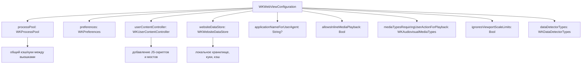

#iOS #Swift #UIKit #WKWebView #WebKit #Configuration #SafariServices

---
## Определение  
`WKWebViewConfiguration` — это объект из фреймворка [[WebKit]], который содержит **набор настроек (конфигурацию)** для создания экземпляра [[WKWebView]].  
Он задаёт поведение веб-представления: обработку JavaScript, хранение данных, масштабирование, работу с медиа, пользовательские скрипты и многое другое.

Конфигурация **применяется только при инициализации** `WKWebView` и не может быть изменена после создания вьюшки.

---

## Схема (взаимосвязи)



---

## Примеры (от простого к сложному)

### 1. Базовая конфигурация (самый простой случай)
```swift
import WebKit

let configuration = WKWebViewConfiguration()
let webView = WKWebView(frame: .zero, configuration: configuration)
```
Никаких особых настроек — всё по умолчанию.

---

### 2. Включаем воспроизведение видео без жеста пользователя
```swift
let config = WKWebViewConfiguration()
config.allowsInlineMediaPlayback = true
config.mediaTypesRequiringUserActionForPlayback = [] // пустой набор = можно сразу играть
let webView = WKWebView(frame: view.bounds, configuration: config)
```

---

### 3. Отключаем ограничения зума (viewport)
```swift
let config = WKWebViewConfiguration()
config.ignoresViewportScaleLimits = true
// теперь пользователь может зумить даже если в HTML прописано user-scalable=no
```

---

### 4. Добавляем свой JavaScript-скрипт при загрузке страницы
```swift
let config = WKWebViewConfiguration()
let script = WKUserScript(
    source: "document.body.style.backgroundColor = 'lightblue';",
    injectionTime: .atDocumentEnd,
    forMainFrameOnly: true
)
config.userContentController.addUserScript(script)
let webView = WKWebView(frame: .zero, configuration: config)
```

---

### 5. Мост между [[Swift]] и JS (обмен сообщениями)
```swift
class ViewController: UIViewController, WKScriptMessageHandler {
    override func viewDidLoad() {
        super.viewDidLoad()
        
        let config = WKWebViewConfiguration()
        let controller = WKUserContentController()
        controller.add(self, name: "swiftHandler")
        config.userContentController = controller
        
        let webView = WKWebView(frame: view.bounds, configuration: config)
        
        // Отправка сообщения из JS в Swift:
        // window.webkit.messageHandlers.swiftHandler.postMessage("Hello from JS!")
    }
    
    func userContentController(_ userContentController: WKUserContentController, didReceive message: WKScriptMessage) {
        print("Получено от JS: \(message.body)")
    }
}
```

---

### 6. Общий кэш и куки между несколькими WKWebView
```swift
let pool = WKProcessPool() // один на всё приложение
let config1 = WKWebViewConfiguration()
config1.processPool = pool
let webView1 = WKWebView(frame: .zero, configuration: config1)

let config2 = WKWebViewConfiguration()
config2.processPool = pool
let webView2 = WKWebView(frame: .zero, configuration: config2)
// Теперь обе вьюшки разделяют одну сессию (куки, localStorage)
```

---

### 7. Полная конфигурация под прод (гибридное приложение)
```swift
let config = WKWebViewConfiguration()

// Процесс-пул для общего хранилища
config.processPool = WKProcessPool()

// Настройки preferences
let prefs = WKPreferences()
prefs.javaScriptEnabled = true
prefs.javaScriptCanOpenWindowsAutomatically = false
config.preferences = prefs

// Контроллер контента с мостом
let contentController = WKUserContentController()
contentController.add(self, name: "nativeBridge")
config.userContentController = contentController

// Хранилище
config.websiteDataStore = .default()

// Медиа
config.allowsInlineMediaPlayback = true
config.mediaTypesRequiringUserActionForPlayback = .audio

// Детекторы данных (телефоны, ссылки и т.д.)
config.dataDetectorTypes = [.phoneNumber, .link, .address]

// User Agent
config.applicationNameForUserAgent = "MyApp/1.0"

let webView = WKWebView(frame: view.bounds, configuration: config)
```

---

## Важные нюансы ( `!warning`)

> [!warning]
> - `WKWebViewConfiguration` **нельзя изменить** после создания `WKWebView` — только через пересоздание вьюшки.
> - `WKProcessPool` нужно создавать **один раз** на всё приложение, если нужна общая сессия.
> - `userContentController` требует ручного удаления `removeScriptMessageHandler(forName:)` в `deinit`, чтобы избежать утечек памяти.
> - Настройки `preferences` в iOS 16+ частично депрекейтнуты в пользу `WKWebpagePreferences`.

