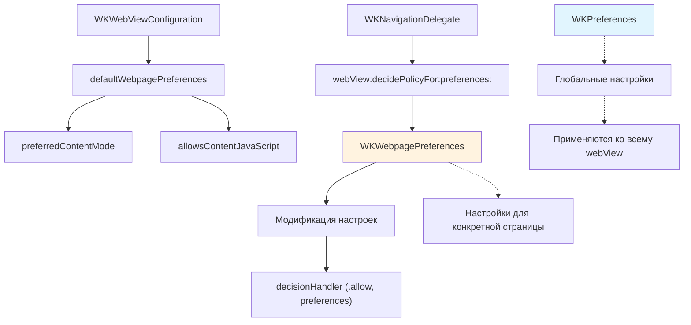

#WKWebpagePreferences #WebKit #iOS #Swift #WKWebView #Rendering #ContentMode #iPad #DesktopMode #MobileMode #iOS13

---
**(настройки отображения веб-страницы / управление режимом рендеринга)**

**WKWebpagePreferences** — это класс из фреймворка **[[WebKit]]**, представленный в **iOS 13**, который определяет **поведение при загрузке и рендеринге веб-страницы**. Он позволяет управлять режимом отображения (десктопный/мобильный) и настройками JavaScript для каждой конкретной страницы.

**Ключевые особенности (важно в 2026):**
- В отличие от `WKPreferences` (глобальные настройки для всего `WKWebView`), `WKWebpagePreferences` позволяет **настраивать поведение для отдельных страниц**.
- Основное применение — **переключение между десктопной и мобильной версией сайта**, особенно актуально для iPad, где по умолчанию может запрашиваться десктопная версия.
- Настройки применяются **во время навигации** через делегат [[WKNavigationDelegate]] или устанавливаются как `defaultWebpagePreferences` в конфигурации.
- Даёт возможность **включить/отключить JavaScript** для конкретной страницы.

---

### Основные свойства WKWebpagePreferences

| Свойство | Тип | Назначение | Доступность |
|----------|-----|------------|-------------|
| `preferredContentMode` | `WKWebpagePreferences.ContentMode` | Режим отображения: `.desktop`, `.mobile`, `.recommended` | iOS 13+ |
| `allowsContentJavaScript` | `Bool` | Разрешить выполнение JavaScript на странице | iOS 14+ |
| `isLockdownModeEnabled` | `Bool` | Использовать режим изоляции (Lockdown Mode) для безопасности | iOS 16+ |

**WKWebpagePreferences.ContentMode**:
- `.recommended` — режим, подходящий для текущего устройства (по умолчанию)
- `.desktop` — десктопная версия сайта
- `.mobile` — мобильная версия сайта

---

### Схема взаимосвязей



---

### Примеры (от простого к сложному)

#### 1. Установка режима отображения через конфигурацию
```swift
import UIKit
import WebKit

class BasicPreferencesViewController: UIViewController {
    
    private var webView: WKWebView!
    
    override func viewDidLoad() {
        super.viewDidLoad()
        
        let config = WKWebViewConfiguration()
        
        // Устанавливаем предпочтения для всех страниц
        if #available(iOS 13.0, *) {
            let preferences = WKWebpagePreferences()
            preferences.preferredContentMode = .mobile // Принудительно мобильная версия
            config.defaultWebpagePreferences = preferences
        }
        
        webView = WKWebView(frame: view.bounds, configuration: config)
        view.addSubview(webView)
        
        if let url = URL(string: "https://example.com") {
            webView.load(URLRequest(url: url))
        }
    }
}
```

#### 2. Принудительная мобильная версия на iPad (актуальная проблема)
На iPad, начиная с iOS 13, Safari и [[WKWebView]] по умолчанию могут запрашивать десктопную версию сайта, что ломает мобильную вёрстку. Для принудительного отображения мобильной версии используется `preferredContentMode = .mobile`:

```swift
class ForceMobileViewController: UIViewController {
    
    private var webView: WKWebView!
    
    override func viewDidLoad() {
        super.viewDidLoad()
        
        let config = WKWebViewConfiguration()
        
        if #available(iOS 13.0, *) {
            // Принудительно запрашиваем мобильную версию на iPad
            let preferences = WKWebpagePreferences()
            preferences.preferredContentMode = .mobile
            config.defaultWebpagePreferences = preferences
        }
        
        webView = WKWebView(frame: view.bounds, configuration: config)
        view.addSubview(webView)
        
        if let url = URL(string: "https://example.com") {
            webView.load(URLRequest(url: url))
        }
    }
}
```

#### 3. Десктопная версия сайта
```swift
class DesktopModeViewController: UIViewController {
    
    private var webView: WKWebView!
    
    override func viewDidLoad() {
        super.viewDidLoad()
        
        let config = WKWebViewConfiguration()
        
        if #available(iOS 13.0, *) {
            let preferences = WKWebpagePreferences()
            preferences.preferredContentMode = .desktop // Десктопная версия
            config.defaultWebpagePreferences = preferences
        }
        
        webView = WKWebView(frame: view.bounds, configuration: config)
        view.addSubview(webView)
        
        if let url = URL(string: "https://example.com") {
            webView.load(URLRequest(url: url))
        }
    }
}
```

#### 4. Динамическое переключение режима через [[WKNavigationDelegate]] (iOS 13+)
Позволяет выбирать режим для каждой страницы индивидуально:

```swift
class DynamicModeViewController: UIViewController, WKNavigationDelegate {
    
    private var webView: WKWebView!
    
    override func viewDidLoad() {
        super.viewDidLoad()
        
        let config = WKWebViewConfiguration()
        webView = WKWebView(frame: view.bounds, configuration: config)
        webView.navigationDelegate = self // Важно: устанавливаем делегата
        view.addSubview(webView)
        
        if let url = URL(string: "https://example.com") {
            webView.load(URLRequest(url: url))
        }
    }
    
    // MARK: - WKNavigationDelegate
    
    @available(iOS 13.0, *)
    func webView(_ webView: WKWebView,
                 decidePolicyFor navigationAction: WKNavigationAction,
                 preferences: WKWebpagePreferences,
                 decisionHandler: @escaping (WKNavigationActionPolicy, WKWebpagePreferences) -> Void) {
        
        // Анализируем URL
        if let url = navigationAction.request.url {
            if url.host?.contains("desktop") == true {
                // Для определённых URL используем десктопный режим
                preferences.preferredContentMode = .desktop
            } else {
                // Для всех остальных — мобильный
                preferences.preferredContentMode = .mobile
            }
            
            // Можно также управлять JavaScript
            if #available(iOS 14.0, *) {
                preferences.allowsContentJavaScript = true
            }
        }
        
        // Разрешаем навигацию с обновлёнными предпочтениями
        decisionHandler(.allow, preferences)
    }
}
```

#### 5. Отключение JavaScript для конкретной страницы (iOS 14+)
```swift
@available(iOS 14.0, *)
class DisableJSViewController: UIViewController, WKNavigationDelegate {
    
    private var webView: WKWebView!
    
    override func viewDidLoad() {
        super.viewDidLoad()
        
        let config = WKWebViewConfiguration()
        webView = WKWebView(frame: view.bounds, configuration: config)
        webView.navigationDelegate = self
        view.addSubview(webView)
        
        if let url = URL(string: "https://example.com") {
            webView.load(URLRequest(url: url))
        }
    }
    
    func webView(_ webView: WKWebView,
                 decidePolicyFor navigationAction: WKNavigationAction,
                 preferences: WKWebpagePreferences,
                 decisionHandler: @escaping (WKNavigationActionPolicy, WKWebpagePreferences) -> Void) {
        
        // Отключаем JavaScript для страниц с определённым путём
        if let url = navigationAction.request.url,
           url.path.contains("/no-js") {
            preferences.allowsContentJavaScript = false
        }
        
        decisionHandler(.allow, preferences)
    }
}
```

#### 6. Режим изоляции (Lockdown Mode) для повышенной безопасности (iOS 16+)
```swift
@available(iOS 16.0, *)
class LockdownModeViewController: UIViewController, WKNavigationDelegate {
    
    private var webView: WKWebView!
    
    override func viewDidLoad() {
        super.viewDidLoad()
        
        let config = WKWebViewConfiguration()
        webView = WKWebView(frame: view.bounds, configuration: config)
        webView.navigationDelegate = self
        view.addSubview(webView)
        
        if let url = URL(string: "https://example.com") {
            webView.load(URLRequest(url: url))
        }
    }
    
    func webView(_ webView: WKWebView,
                 decidePolicyFor navigationAction: WKNavigationAction,
                 preferences: WKWebpagePreferences,
                 decisionHandler: @escaping (WKNavigationActionPolicy, WKWebpagePreferences) -> Void) {
        
        // Включаем Lockdown Mode для конфиденциальных страниц
        if let url = navigationAction.request.url,
           url.host?.contains("secure") == true {
            preferences.isLockdownModeEnabled = true
        }
        
        decisionHandler(.allow, preferences)
    }
}
```

#### 7. Комбинированная настройка (полный пример)
```swift
class FullPreferencesViewController: UIViewController, WKNavigationDelegate {
    
    private var webView: WKWebView!
    
    override func viewDidLoad() {
        super.viewDidLoad()
        
        let config = WKWebViewConfiguration()
        
        // 1. Базовые предпочтения по умолчанию
        if #available(iOS 13.0, *) {
            let defaultPrefs = WKWebpagePreferences()
            defaultPrefs.preferredContentMode = .recommended // Системный выбор
            config.defaultWebpagePreferences = defaultPrefs
        }
        
        webView = WKWebView(frame: view.bounds, configuration: config)
        webView.navigationDelegate = self
        view.addSubview(webView)
        
        if let url = URL(string: "https://example.com") {
            webView.load(URLRequest(url: url))
        }
    }
    
    @available(iOS 13.0, *)
    func webView(_ webView: WKWebView,
                 decidePolicyFor navigationAction: WKNavigationAction,
                 preferences: WKWebpagePreferences,
                 decisionHandler: @escaping (WKNavigationActionPolicy, WKWebpagePreferences) -> Void) {
        
        guard let url = navigationAction.request.url else {
            decisionHandler(.allow, preferences)
            return
        }
        
        // Логика выбора режима на основе URL
        let host = url.host?.lowercased() ?? ""
        
        if host.contains("desktop") {
            preferences.preferredContentMode = .desktop
        } else if host.contains("mobile") {
            preferences.preferredContentMode = .mobile
        } else {
            // Для большинства сайтов используем рекомендуемый режим
            preferences.preferredContentMode = .recommended
        }
        
        // Включаем JavaScript для всех страниц, кроме административных
        if #available(iOS 14.0, *) {
            preferences.allowsContentJavaScript = !host.contains("admin")
        }
        
        // Lockdown Mode только для банковских страниц
        if #available(iOS 16.0, *) {
            preferences.isLockdownModeEnabled = host.contains("bank") || host.contains("payment")
        }
        
        decisionHandler(.allow, preferences)
    }
}
```

#### 8. Влияние ContentMode на User-Agent
Важно понимать, что `preferredContentMode` влияет на **User-Agent**, который отправляется на сервер. Установка `.mobile` заставляет сервер отдавать мобильную версию сайта, а `.desktop` — десктопную.

> **Важно:** Если вы вручную устанавливаете `customUserAgent` для `WKWebView`, это может переопределить поведение, заданное через `preferredContentMode`. Для корректной работы рекомендуется использовать либо один подход, либо другой, но не комбинировать их без необходимости.

---

### Отличия от WKPreferences

| Характеристика          | [[WKPreferences]]                          | WKWebpagePreferences                                |
| ----------------------- | ------------------------------------------ | --------------------------------------------------- |
| **Уровень применения**  | Глобальные настройки для всего `WKWebView` | Настройки для конкретной страницы                   |
| **Изменяемость**        | Только до создания `WKWebView`             | Можно изменять для каждой навигации                 |
| **Основное назначение** | JavaScript, шрифты, зум                    | Режим отображения (десктоп/мобиль), JS для страницы |
| **iOS версия**          | iOS 8+                                     | iOS 13+                                             |

---

### Важные нюансы 2026 года

> [!warning]
> **Устройство по умолчанию:** На iPad, начиная с iOS 13, запрос десктопной версии сайта включён по умолчанию (через настройки Safari → Request Desktop Website → All Websites). Если ваше приложение ожидает мобильную вёрстку, необходимо явно установить `preferredContentMode = .mobile`.
>
> **User-Agent:** Изменение `preferredContentMode` меняет User-Agent. Ручная установка `customUserAgent` может переопределить это поведение.
>
> **iOS 14+:** `allowsContentJavaScript` доступен только с iOS 14. Для более старых версий используйте `WKPreferences.javaScriptEnabled`.
>
> **Неизменяемость:** `defaultWebpagePreferences` устанавливается в конфигурации до создания `WKWebView` и действует как значение по умолчанию, но может быть переопределён в делегате.

---

### Лучшие практики 2026

1. **Для поддержки мобильной вёрстки на iPad** всегда устанавливайте `preferredContentMode = .mobile` либо в конфигурации, либо в делегате.
2. **Используйте `WKNavigationDelegate`** для гибкой настройки каждой страницы.
3. **Не комбинируйте** `preferredContentMode` и `customUserAgent` без необходимости.
4. **Для отключения JavaScript** на конкретных страницах используйте `allowsContentJavaScript` (iOS 14+) вместо глобального `WKPreferences.javaScriptEnabled`.
5. **Включайте `isLockdownModeEnabled`** для страниц с чувствительной информацией (iOS 16+).

---

### Связь с другими темами

- [[WKPreferences]] — глобальные настройки webView
- [[WKWebViewConfiguration]] — конфигурация webView
- [[WKNavigationDelegate]] — делегат для управления навигацией
- [[WKWebView]] — веб-представление
- [[WKUserScript]] — внедрение JavaScript